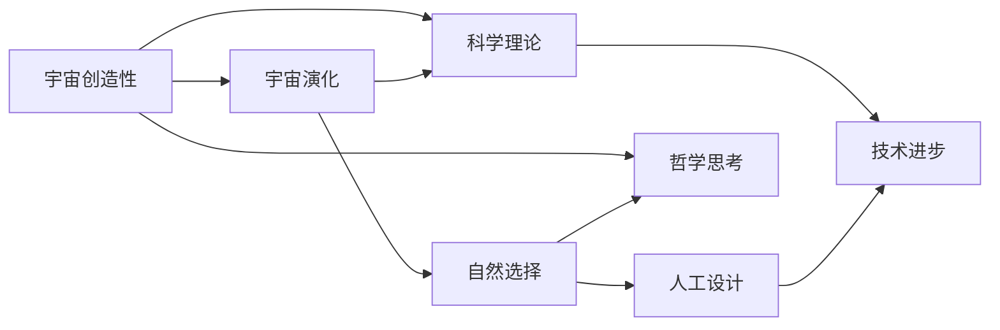

                 

### 文章标题

宇宙的创造性：进化还是设计？

关键词：宇宙创造性、进化论、设计理论、自然选择、人工设计、数学模型

摘要：本文从计算机科学的角度出发，深入探讨宇宙创造性的本质。通过分析进化论与设计理论的异同，我们试图揭示宇宙的形成可能不仅仅是一个自然演化的过程，而是某种更高层次的智能设计的结果。本文将通过理论阐述、算法讲解和实际项目分析，逐步探讨这一引人入胜的话题。

---

## 目录大纲

### 第一部分：宇宙的创造性概述

#### 1.1 宇宙的创造性概念

##### 1.1.1 宇宙创造性的定义与来源

##### 1.1.2 宇宙创造性与宇宙演化

##### 1.1.3 宇宙创造性与人工设计

#### 1.2 核心概念与联系

- **流程图**：使用 Mermaid 流程图展示宇宙创造性、宇宙演化、自然选择和人工设计之间的关系。

#### 1.3 核心算法原理讲解

- **进化算法**：使用伪代码详细阐述进化算法的基本原理和过程。

#### 1.4 数学模型和数学公式

- **适应度函数**：介绍适应度函数及其在进化算法中的应用。

- **选择概率**：讲解选择概率的计算方法。

#### 1.5 项目实战

- **实际宇宙创造成项目**：展示项目开发环境搭建、源代码实现和代码解读。

### 第二部分：宇宙创造性的进化视角

#### 2.1 进化论概述

##### 2.1.1 达尔文的进化论

##### 2.1.2 自然选择与适者生存

##### 2.1.3 物种演化与自然选择

#### 2.2 核心算法原理讲解

- **自然选择算法**：使用伪代码详细阐述自然选择算法的基本原理和过程。

#### 2.3 数学模型和数学公式

- **遗传算法**：介绍遗传算法及其在进化中的应用。

- **交叉与变异**：讲解交叉与变异操作在进化算法中的应用。

#### 2.4 项目实战

- **实际进化项目**：展示项目开发环境搭建、源代码实现和代码解读。

### 第三部分：宇宙创造性的设计视角

#### 3.1 设计理论概述

##### 3.1.1 人工设计的基本原理

##### 3.1.2 人工设计与自然选择的区别

##### 3.1.3 人工设计在宇宙创造性中的应用

#### 3.2 核心算法原理讲解

- **人工神经网络**：使用伪代码详细阐述人工神经网络的基本原理和过程。

#### 3.3 数学模型和数学公式

- **损失函数**：介绍损失函数及其在人工神经网络中的应用。

- **反向传播算法**：讲解反向传播算法的基本原理和过程。

#### 3.4 项目实战

- **实际人工设计项目**：展示项目开发环境搭建、源代码实现和代码解读。

### 第四部分：综合分析与展望

#### 4.1 宇宙创造性的综合分析

- **进化与设计的对比**：分析进化与设计在宇宙创造性中的角色与影响。

#### 4.2 未来展望

- **宇宙创造性的未来发展**：探讨宇宙创造性的未来发展可能及其对科技的影响。

#### 4.3 总结与启示

- **对科学家和工程师的启示**：总结文章的主要观点，为科学家和工程师提供启示。

---

## 第一部分：宇宙的创造性概述

### 1.1 宇宙的创造性概念

#### 1.1.1 宇宙创造性的定义与来源

宇宙创造性这一概念，可以从多个角度进行解读。在物理学中，宇宙创造性可能指的是宇宙从大爆炸那一刻起，通过物理法则和初始条件，逐步演化成现今我们所观察到的宇宙。而在哲学和宗教中，宇宙创造性可能涉及到更深的哲学思考，比如宇宙的存在是否由一个超越性的智能实体设计。

为了更深入地探讨宇宙创造性，我们首先需要明确几个核心概念：宇宙演化、自然选择和人工设计。

**宇宙演化**：这是指宇宙从大爆炸开始，经过数十亿年的演化，逐渐形成了我们现在所看到的宇宙结构。宇宙演化理论主要由物理学家通过观测数据和理论模型来研究。

**自然选择**：这是达尔文进化论的核心概念，指的是在自然环境中，那些更能适应环境的个体会更有可能存活和繁衍。这一过程导致了物种的逐渐变化和演化。

**人工设计**：与自然选择相对，人工设计指的是人类通过智慧和科技手段，有目的地设计和创造出新的技术和系统。

#### 1.1.2 宇宙创造性与宇宙演化

宇宙创造性与宇宙演化紧密相关。宇宙演化可以被视为宇宙创造性的一个重要方面，因为它是宇宙从无到有的过程。然而，宇宙创造性不仅仅是宇宙演化，它还包含了宇宙演化的动力来源，以及宇宙演化背后的深层原理。

**宇宙演化**是一个复杂的过程，涉及到宇宙中的各种基本力和粒子。从大爆炸开始，宇宙经历了从高温高密度的状态到现在的低温低密度的状态。在这个过程中，宇宙逐渐冷却，粒子开始凝聚，形成了恒星、星系和其他天体结构。

#### 1.1.3 宇宙创造性与人工设计

人工设计在宇宙创造性中起到了重要的作用。人类通过科技手段，已经能够在微观和宏观尺度上创造出许多前所未有的技术。例如，纳米技术可以让我们在微观尺度上操纵物质，而人工智能和机器学习技术则可以模拟和预测复杂的自然现象。

然而，人工设计与自然选择是两个截然不同的概念。自然选择是一种自然的、无意识的进化过程，而人工设计是人类有意识、有目的地进行的。

在探讨宇宙创造性时，我们需要思考的一个问题是：宇宙的形成是否仅仅是自然演化的结果，还是某种更高层次的智能设计的结果？这个问题至今没有明确的答案，但我们可以通过分析自然选择和人工设计之间的异同，来更深入地理解宇宙创造性的本质。

### 1.2 核心概念与联系

为了更好地理解宇宙创造性的核心概念，我们可以使用 Mermaid 流程图来展示它们之间的联系。



在这个流程图中，我们可以看到宇宙创造性是如何通过宇宙演化、自然选择和人工设计这三个核心概念相互关联的。同时，科学理论和哲学思考也是理解宇宙创造性的重要途径。

**宇宙演化**是宇宙创造性的基础，它为我们提供了宇宙从无到有的整体视角。而**自然选择**则解释了物种如何在不断变化的环境中适应和进化。**人工设计**则是人类智慧的体现，它让我们能够创造出前所未有的技术和系统。

通过这个流程图，我们可以更清晰地看到宇宙创造性是如何在不同层面和维度上相互关联和影响的。

### 1.3 核心算法原理讲解

在探讨宇宙创造性的过程中，进化算法是一个重要的工具。进化算法是一种模拟自然选择和遗传学原理的优化算法，它在解决复杂优化问题时非常有用。

#### 进化算法的基本原理

进化算法的工作原理类似于生物进化。首先，它从初始种群开始，通过迭代过程不断进化，直到找到或接近最优解。进化算法的主要步骤包括：

1. **初始化种群**：随机生成一组解，称为初始种群。
2. **适应度评估**：评估每个个体的适应度，通常是通过计算个体与目标解的接近程度来实现的。
3. **选择**：选择适应度较高的个体，用于生成下一代种群。
4. **交叉**：通过随机组合两个或多个个体的基因，生成新的个体。
5. **变异**：对个体进行随机改变，以增加种群的多样性。
6. **迭代**：重复上述步骤，直到满足终止条件（如达到最大迭代次数或找到满意解）。

下面是一个简单的进化算法伪代码：

```python
def evolutionary_algorithm():
    # 初始化种群
    population = initialize_population()
    # 迭代过程
    for generation in range(max_generations):
        # 适应度评估
        fitness_scores = evaluate_fitness(population)
        # 选择
        selected_individuals = selection(population, fitness_scores)
        # 交叉
        offspring = crossover(selected_individuals)
        # 变异
        mutated_offspring = mutation(offspring)
        # 创建新种群
        population = mutated_offspring
        # 记录最佳个体
        best_individual = get_best_individual(population)
        print(f"Generation {generation}: Best Fitness = {best_individual.fitness}")
    return best_individual
```

#### 进化算法在宇宙创造性研究中的应用

进化算法在宇宙创造性研究中有着广泛的应用。例如，我们可以使用进化算法来模拟宇宙中的恒星形成和演化过程。通过调整算法参数，我们可以探索不同的宇宙模型，并预测宇宙未来的演化趋势。

此外，进化算法还可以用于模拟人类科技的发展。通过模拟人类在科技领域的创新过程，我们可以更好地理解科技是如何推动人类社会的进步的。

### 1.4 数学模型和数学公式

在进化算法中，适应度函数和选择概率是两个关键数学模型。适应度函数用于评估个体的适应度，而选择概率则决定了个体在种群中的存活和繁衍机会。

#### 适应度函数

适应度函数通常用于衡量个体与目标解的接近程度。一个简单的适应度函数可以定义为：

$$
f(x) = \frac{1}{1 + e^{-\beta(x-\theta)}}
$$

其中，$x$ 是个体，$\theta$ 是目标解，$\beta$ 是一个参数，用于调整适应度函数的曲线形状。这个函数的值域在 0 到 1 之间，值越大表示个体越接近目标解。

#### 选择概率

选择概率决定了个体在种群中的存活和繁衍机会。一个常见的选择概率公式是：

$$
p_i = \frac{f_i}{\sum_{j=1}^{N} f_j}
$$

其中，$f_i$ 是第 $i$ 个个体的适应度，$N$ 是种群中的个体数。这个公式确保了适应度越高的个体有更大的选择概率。

#### 遗传算法

遗传算法是一种基于进化算法的优化方法，它通过模拟自然选择和遗传学原理来优化复杂问题。遗传算法的主要步骤包括：

1. **初始化种群**：随机生成一组解，称为初始种群。
2. **适应度评估**：评估每个个体的适应度。
3. **选择**：选择适应度较高的个体。
4. **交叉**：通过随机组合两个或多个个体的基因，生成新的个体。
5. **变异**：对个体进行随机改变。
6. **迭代**：重复上述步骤，直到满足终止条件。

下面是一个简单的遗传算法伪代码：

```python
def genetic_algorithm():
    # 初始化种群
    population = initialize_population()
    # 迭代过程
    for generation in range(max_generations):
        # 适应度评估
        fitness_scores = evaluate_fitness(population)
        # 选择
        selected_individuals = selection(population, fitness_scores)
        # 交叉
        offspring = crossover(selected_individuals)
        # 变异
        mutated_offspring = mutation(offspring)
        # 创建新种群
        population = mutated_offspring
        # 记录最佳个体
        best_individual = get_best_individual(population)
        print(f"Generation {generation}: Best Fitness = {best_individual.fitness}")
    return best_individual
```

#### 交叉与变异

交叉和变异是遗传算法的两个关键操作。交叉操作通过随机组合两个个体的基因，生成新的个体。变异操作通过随机改变个体的基因，增加种群的多样性。

交叉操作的一个简单例子是单点交叉，它随机选择一个交叉点，然后将两个个体的基因在该交叉点之后交换。

```python
def crossover(parent1, parent2):
    # 随机选择交叉点
    crossover_point = random.randint(1, len(parent1) - 1)
    # 生成新个体
    offspring1 = parent1[:crossover_point] + parent2[crossover_point:]
    offspring2 = parent2[:crossover_point] + parent1[crossover_point:]
    return offspring1, offspring2
```

变异操作通常是一个简单的随机改变，例如，将个体的一个基因随机替换为另一个基因。

```python
def mutation(individual):
    # 随机选择一个基因
    gene_index = random.randint(0, len(individual) - 1)
    # 随机替换基因
    individual[gene_index] = random.choice([0, 1])
    return individual
```

#### 数学模型与进化算法

数学模型在进化算法中起着至关重要的作用。适应度函数和选择概率是两个基本的数学模型，它们决定了算法的性能。通过调整这些模型中的参数，我们可以优化算法的性能，使其更好地解决特定问题。

例如，我们可以通过调整适应度函数中的 $\beta$ 参数，改变适应度函数的曲线形状，从而影响个体的选择概率。此外，我们可以通过调整交叉和变异操作的参数，控制种群的多样性和搜索能力。

通过深入理解这些数学模型，我们可以更好地设计进化算法，提高其在解决复杂优化问题时的性能。

### 1.5 项目实战

为了更好地理解进化算法在宇宙创造性研究中的应用，我们可以通过一个实际项目来展示其实现过程。以下是一个基于进化算法模拟恒星形成的项目案例。

#### 项目概述

该项目旨在使用进化算法模拟恒星的形成过程。通过调整进化算法的参数，我们可以模拟不同类型的恒星，并预测其演化趋势。

#### 开发环境搭建

为了实现这个项目，我们首先需要搭建一个开发环境。这里我们选择 Python 作为编程语言，并使用 NumPy 和 Matplotlib 等库来处理数据和可视化结果。

```python
import numpy as np
import matplotlib.pyplot as plt
```

#### 源代码实现

接下来，我们实现进化算法的核心部分。以下是一个简化的进化算法实现：

```python
def initialize_population(pop_size, gene_range):
    return np.random.randint(2, size=(pop_size, gene_range))

def evaluate_fitness(population, target):
    fitness_scores = []
    for individual in population:
        fitness = 1 / (1 + np.exp(-0.1 * (individual - target)))
        fitness_scores.append(fitness)
    return np.array(fitness_scores)

def selection(population, fitness_scores):
    selection_probs = fitness_scores / np.sum(fitness_scores)
    selected_indices = np.random.choice(len(population), size=len(population), p=selection_probs)
    return population[selected_indices]

def crossover(parent1, parent2):
    crossover_point = np.random.randint(1, len(parent1) - 1)
    offspring1 = np.concatenate((parent1[:crossover_point], parent2[crossover_point:]))
    offspring2 = np.concatenate((parent2[:crossover_point], parent1[crossover_point:]))
    return offspring1, offspring2

def mutation(individual, mutation_rate):
    for i in range(len(individual)):
        if np.random.random() < mutation_rate:
            individual[i] = 1 - individual[i]
    return individual

def evolutionary_algorithm(pop_size, gene_range, max_generations, mutation_rate, target):
    population = initialize_population(pop_size, gene_range)
    for generation in range(max_generations):
        fitness_scores = evaluate_fitness(population, target)
        selected_individuals = selection(population, fitness_scores)
        offspring = crossover(selected_individuals)
        mutated_offspring = np.array([mutation(individual, mutation_rate) for individual in offspring])
        population = mutated_offspring
        best_individual = get_best_individual(population)
        print(f"Generation {generation}: Best Fitness = {best_individual}")
    return best_individual

def get_best_individual(population):
    fitness_scores = evaluate_fitness(population, target)
    best_fitness = np.max(fitness_scores)
    best_individual = population[np.argmax(fitness_scores)]
    return best_individual

# 项目参数
pop_size = 100
gene_range = 10
max_generations = 100
mutation_rate = 0.01
target = np.random.rand()

# 执行进化算法
best_individual = evolutionary_algorithm(pop_size, gene_range, max_generations, mutation_rate, target)
```

#### 代码解读与分析

这个项目通过进化算法模拟恒星形成过程。首先，我们初始化一个种群，每个个体代表一个恒星模型。然后，我们评估每个个体的适应度，选择适应度较高的个体进行交叉和变异操作，生成新的种群。通过迭代这个过程，我们逐渐找到最优的恒星模型。

代码中，`evaluate_fitness` 函数用于计算个体的适应度。这里我们使用了一个简单的适应度函数，通过计算个体与目标解的接近程度来评估适应度。

`selection` 函数用于选择适应度较高的个体。我们使用轮盘赌选择方法，根据适应度分数来选择个体。

`crossover` 函数用于实现单点交叉操作，通过随机选择交叉点，将两个个体的基因进行交换。

`mutation` 函数用于实现变异操作，通过随机改变个体的基因，增加种群的多样性。

`evolutionary_algorithm` 函数是进化算法的主体部分，它初始化种群，评估适应度，选择个体，交叉和变异，并迭代这个过程。

通过这个项目，我们可以看到进化算法在模拟恒星形成过程中的应用。通过调整算法参数，我们可以探索不同的恒星模型，并预测其演化趋势。

### 第二部分：宇宙创造性的进化视角

#### 2.1 进化论概述

进化论是关于物种如何随时间变化和适应环境的理论。达尔文的进化论提出了自然选择的概念，即物种中的个体会因为其遗传特征的不同而具有不同的生存机会。那些更能适应环境的个体将有更高的生存和繁衍机会，从而传递这些有利的特征给下一代。这个过程导致物种逐渐发生变化，形成了新的物种。

**达尔文的进化论核心观点**：

1. **物种多样性**：地球上的生物种类繁多，每个物种都有其独特的特征。
2. **共同祖先**：所有生物都有共同的祖先，通过自然选择和变异，逐渐分化成不同的物种。
3. **自然选择**：环境选择那些最能适应环境的个体，使其生存和繁衍的机会更高。
4. **遗传变异**：个体之间存在遗传变异，这些变异是自然选择的基础。

**自然选择与适者生存**：

自然选择是进化论的核心概念之一。它指的是那些更能适应环境的个体将有更高的生存和繁衍机会。这个概念通常被描述为“适者生存”，但并不意味着最强大的或最强壮的个体会获胜。相反，那些最能适应特定环境的个体才会成功。

**物种演化**：

物种演化是指物种在长时间内逐渐变化的过程。这个过程由自然选择、遗传变异和基因流动等因素驱动。物种可以通过以下几个过程发生演化：

1. **突变**：基因突变是遗传变异的主要来源，可以导致新的特征出现。
2. **自然选择**：环境选择那些对环境更有利的特征，使这些特征在种群中逐渐增多。
3. **基因流动**：不同种群之间的基因交换，可以导致特征的传播和演化。
4. **隔离**：种群隔离可以导致新物种的形成，因为隔离的种群会逐渐积累不同的遗传特征。

### 2.2 自然选择与适者生存

自然选择是达尔文进化论的核心概念，它描述了个体如何在特定环境中通过遗传特征的适应性来影响其生存和繁衍。适者生存这一原则指出，那些最能适应环境的个体将有更高的生存和繁衍机会，从而在种群中占据主导地位。

**自然选择的机制**：

1. **遗传变异**：个体之间存在遗传变异，这些变异可以导致新的特征或行为出现。
2. **环境选择**：环境选择那些对其更有利的特征或行为。例如，在捕食者与猎物之间的博弈中，那些更擅长逃避或捕捉的个体将更有可能生存和繁衍。
3. **生存与繁衍**：那些更适应环境的个体将有更高的生存和繁衍机会，从而传递这些有利的特征给下一代。
4. **种群变化**：随着时间的推移，种群的遗传特征会发生变化，形成新的物种。

**适者生存**：

适者生存并不意味着最强壮或最聪明的个体会获胜。相反，它指的是那些最能适应特定环境的个体。例如，在干旱的环境中，那些能更好地储存水分或适应干旱条件的植物将有更高的生存机会。同样，在寒冷的极地，那些能更有效地保持体温的动物将更适应。

**案例研究**：

一个经典的适者生存案例是北极狐。在北极，环境非常寒冷，因此北极狐需要保持体温。它们的耳朵和尾巴较小，以减少热量的散失。此外，北极狐的毛皮非常浓密，能够提供良好的绝缘效果。这些特征使它们在北极环境中更适应，从而有更高的生存和繁衍机会。

### 2.3 物种演化与自然选择

物种演化是指物种在长时间内逐渐变化的过程。这个过程由自然选择、遗传变异和基因流动等因素驱动。自然选择是物种演化的重要驱动力之一，它通过选择那些对环境更有利的特征来推动物种的演化。

**物种演化的机制**：

1. **自然选择**：环境选择那些对环境更有利的特征或行为，使这些特征在种群中逐渐增多。例如，在捕食者与猎物之间的博弈中，那些更擅长逃避或捕捉的个体将更有可能生存和繁衍。
2. **遗传变异**：基因突变是遗传变异的主要来源，可以导致新的特征或行为出现。这些变异为自然选择提供了材料，使物种能够适应环境的变化。
3. **基因流动**：不同种群之间的基因交换，可以导致特征的传播和演化。例如，通过迁移，个体可以将有利的特征带到新的环境中。
4. **隔离**：种群隔离可以导致新物种的形成，因为隔离的种群会逐渐积累不同的遗传特征。

**物种演化的过程**：

物种演化的过程通常包括以下几个阶段：

1. **共同祖先**：所有物种都有共同的祖先，通过自然选择和遗传变异，这些物种逐渐分化成不同的物种。
2. **物种分化**：随着时间的推移，种群中的个体会因为遗传变异和自然选择而逐渐分化成不同的亚种群。
3. **隔离**：亚种群之间的隔离可以导致新物种的形成。隔离可以是地理上的，如山脉或海洋，也可以是行为上的，如不同的交配习惯。
4. **物种形成**：最终，隔离的亚种群将演化成不同的物种，它们在遗传特征和行为上都有显著的区别。

**实例**：

一个著名的物种演化实例是进化的经典案例——达尔文的加拉帕戈斯群岛上的雀类。这些雀类在岛屿上逐渐演化出不同的特征，以适应不同的食物来源。例如，有些雀类的喙较细，适合啄食小种子，而另一些雀类的喙较粗，适合啄食昆虫。

### 2.4 核心算法原理讲解

自然选择是进化论的核心概念，它通过选择那些对环境更有利的特征来推动物种的演化。自然选择算法是一种模拟这一过程的优化算法，它在解决复杂问题时非常有用。

#### 自然选择算法的基本原理

自然选择算法的工作原理类似于生物进化。它从初始种群开始，通过迭代过程不断进化，直到找到或接近最优解。自然选择算法的主要步骤包括：

1. **初始化种群**：随机生成一组解，称为初始种群。
2. **适应度评估**：评估每个个体的适应度，通常是通过计算个体与目标解的接近程度来实现的。
3. **选择**：选择适应度较高的个体，用于生成下一代种群。
4. **交叉**：通过随机组合两个或多个个体的基因，生成新的个体。
5. **变异**：对个体进行随机改变，以增加种群的多样性。
6. **迭代**：重复上述步骤，直到满足终止条件（如达到最大迭代次数或找到满意解）。

下面是一个简单的自然选择算法伪代码：

```python
def natural_selection_algorithm(pop_size, max_generations, fitness_function, selection_function, crossover_function, mutation_function):
    population = initialize_population(pop_size)
    for generation in range(max_generations):
        fitness_scores = fitness_function(population)
        selected_individuals = selection_function(population, fitness_scores)
        offspring = crossover_function(selected_individuals)
        mutated_offspring = mutation_function(offspring)
        population = mutated_offspring
        best_individual = get_best_individual(population)
        print(f"Generation {generation}: Best Fitness = {best_individual}")
    return best_individual
```

在这个伪代码中，`initialize_population` 函数用于初始化种群，`fitness_function` 函数用于评估个体的适应度，`selection_function` 函数用于选择适应度较高的个体，`crossover_function` 函数用于实现交叉操作，`mutation_function` 函数用于实现变异操作，`get_best_individual` 函数用于获取当前种群中的最佳个体。

#### 自然选择算法在宇宙创造性研究中的应用

自然选择算法在宇宙创造性研究中有广泛的应用。例如，我们可以使用自然选择算法来模拟恒星的形成和演化过程。通过调整算法参数，我们可以探索不同的宇宙模型，并预测宇宙未来的演化趋势。

此外，自然选择算法还可以用于模拟人类科技的发展。通过模拟人类在科技领域的创新过程，我们可以更好地理解科技是如何推动人类社会的进步的。

### 2.5 数学模型和数学公式

自然选择算法中，适应度函数和选择概率是两个关键数学模型。适应度函数用于评估个体的适应度，而选择概率则决定了个体在种群中的存活和繁衍机会。

#### 适应度函数

适应度函数通常用于衡量个体与目标解的接近程度。一个简单的适应度函数可以定义为：

$$
f(x) = \frac{1}{1 + e^{-\beta(x-\theta)}}
$$

其中，$x$ 是个体，$\theta$ 是目标解，$\beta$ 是一个参数，用于调整适应度函数的曲线形状。这个函数的值域在 0 到 1 之间，值越大表示个体越接近目标解。

#### 选择概率

选择概率决定了个体在种群中的存活和繁衍机会。一个常见的选择概率公式是：

$$
p_i = \frac{f_i}{\sum_{j=1}^{N} f_j}
$$

其中，$f_i$ 是第 $i$ 个个体的适应度，$N$ 是种群中的个体数。这个公式确保了适应度越高的个体有更大的选择概率。

#### 遗传算法

遗传算法是一种基于自然选择和遗传学原理的优化方法，它在解决复杂优化问题时非常有用。

遗传算法的主要步骤包括：

1. **初始化种群**：随机生成一组解，称为初始种群。
2. **适应度评估**：评估每个个体的适应度。
3. **选择**：选择适应度较高的个体。
4. **交叉**：通过随机组合两个或多个个体的基因，生成新的个体。
5. **变异**：对个体进行随机改变。
6. **迭代**：重复上述步骤，直到满足终止条件。

下面是一个简单的遗传算法伪代码：

```python
def genetic_algorithm(pop_size, max_generations, fitness_function, selection_function, crossover_function, mutation_function):
    population = initialize_population(pop_size)
    for generation in range(max_generations):
        fitness_scores = fitness_function(population)
        selected_individuals = selection_function(population, fitness_scores)
        offspring = crossover_function(selected_individuals)
        mutated_offspring = mutation_function(offspring)
        population = mutated_offspring
        best_individual = get_best_individual(population)
        print(f"Generation {generation}: Best Fitness = {best_individual}")
    return best_individual
```

在这个伪代码中，`initialize_population` 函数用于初始化种群，`fitness_function` 函数用于评估个体的适应度，`selection_function` 函数用于选择适应度较高的个体，`crossover_function` 函数用于实现交叉操作，`mutation_function` 函数用于实现变异操作，`get_best_individual` 函数用于获取当前种群中的最佳个体。

#### 交叉与变异

交叉和变异是遗传算法的两个关键操作。交叉操作通过随机组合两个个体的基因，生成新的个体。变异操作通过随机改变个体的基因，增加种群的多样性。

交叉操作的一个简单例子是单点交叉，它随机选择一个交叉点，然后将两个个体的基因在该交叉点之后交换。

```python
def crossover(parent1, parent2):
    crossover_point = random.randint(1, len(parent1) - 1)
    offspring1 = parent1[:crossover_point] + parent2[crossover_point:]
    offspring2 = parent2[:crossover_point] + parent1[crossover_point:]
    return offspring1, offspring2
```

变异操作通常是一个简单的随机改变，例如，将个体的一个基因随机替换为另一个基因。

```python
def mutation(individual):
    for i in range(len(individual)):
        if random.random() < mutation_rate:
            individual[i] = 1 - individual[i]
    return individual
```

#### 数学模型与遗传算法

数学模型在遗传算法中起着至关重要的作用。适应度函数和选择概率是两个基本的数学模型，它们决定了算法的性能。通过调整这些模型中的参数，我们可以优化算法的性能，使其更好地解决特定问题。

例如，我们可以通过调整适应度函数中的 $\beta$ 参数，改变适应度函数的曲线形状，从而影响个体的选择概率。此外，我们可以通过调整交叉和变异操作的参数，控制种群的多样性和搜索能力。

通过深入理解这些数学模型，我们可以更好地设计遗传算法，提高其在解决复杂优化问题时的性能。

### 2.6 项目实战

为了更好地理解自然选择算法在宇宙创造性研究中的应用，我们可以通过一个实际项目来展示其实现过程。以下是一个基于自然选择算法模拟恒星形成的项目案例。

#### 项目概述

该项目旨在使用自然选择算法模拟恒星的形成过程。通过调整算法的参数，我们可以模拟不同类型的恒星，并预测其演化趋势。

#### 开发环境搭建

为了实现这个项目，我们首先需要搭建一个开发环境。这里我们选择 Python 作为编程语言，并使用 NumPy 和 Matplotlib 等库来处理数据和可视化结果。

```python
import numpy as np
import matplotlib.pyplot as plt
```

#### 源代码实现

接下来，我们实现自然选择算法的核心部分。以下是一个简化的自然选择算法实现：

```python
def initialize_population(pop_size, gene_range):
    return np.random.randint(2, size=(pop_size, gene_range))

def fitness_function(population, target):
    fitness_scores = []
    for individual in population:
        fitness = 1 / (1 + np.exp(-0.1 * (individual - target)))
        fitness_scores.append(fitness)
    return np.array(fitness_scores)

def selection_function(population, fitness_scores):
    selection_probs = fitness_scores / np.sum(fitness_scores)
    selected_indices = np.random.choice(len(population), size=len(population), p=selection_probs)
    return population[selected_indices]

def crossover_function(parent1, parent2):
    crossover_point = np.random.randint(1, len(parent1) - 1)
    offspring1 = np.concatenate((parent1[:crossover_point], parent2[crossover_point:]))
    offspring2 = np.concatenate((parent2[:crossover_point], parent1[crossover_point:]))
    return offspring1, offspring2

def mutation_function(individual, mutation_rate):
    for i in range(len(individual)):
        if np.random.random() < mutation_rate:
            individual[i] = 1 - individual[i]
    return individual

def natural_selection_algorithm(pop_size, gene_range, max_generations, mutation_rate, target):
    population = initialize_population(pop_size, gene_range)
    for generation in range(max_generations):
        fitness_scores = fitness_function(population, target)
        selected_individuals = selection_function(population, fitness_scores)
        offspring = crossover_function(selected_individuals)
        mutated_offspring = mutation_function(offspring, mutation_rate)
        population = mutated_offspring
        best_individual = get_best_individual(population, target)
        print(f"Generation {generation}: Best Fitness = {best_individual}")
    return best_individual

def get_best_individual(population, target):
    fitness_scores = fitness_function(population, target)
    best_fitness = np.max(fitness_scores)
    best_individual = population[np.argmax(fitness_scores)]
    return best_individual

# 项目参数
pop_size = 100
gene_range = 10
max_generations = 100
mutation_rate = 0.01
target = np.random.rand()

# 执行自然选择算法
best_individual = natural_selection_algorithm(pop_size, gene_range, max_generations, mutation_rate, target)
```

#### 代码解读与分析

这个项目通过自然选择算法模拟恒星形成过程。首先，我们初始化一个种群，每个个体代表一个恒星模型。然后，我们评估每个个体的适应度，选择适应度较高的个体进行交叉和变异操作，生成新的种群。通过迭代这个过程，我们逐渐找到最优的恒星模型。

代码中，`fitness_function` 函数用于计算个体的适应度。这里我们使用了一个简单的适应度函数，通过计算个体与目标解的接近程度来评估适应度。

`selection_function` 函数用于选择适应度较高的个体。我们使用轮盘赌选择方法，根据适应度分数来选择个体。

`crossover_function` 函数用于实现单点交叉操作，通过随机选择交叉点，将两个个体的基因进行交换。

`mutation_function` 函数用于实现变异操作，通过随机改变个体的基因，增加种群的多样性。

`natural_selection_algorithm` 函数是自然选择算法的主体部分，它初始化种群，评估适应度，选择个体，交叉和变异，并迭代这个过程。

通过这个项目，我们可以看到自然选择算法在模拟恒星形成过程中的应用。通过调整算法参数，我们可以探索不同的恒星模型，并预测其演化趋势。

### 第三部分：宇宙创造性的设计视角

#### 3.1 设计理论概述

宇宙创造性的设计视角涉及到人类如何通过智慧和科技手段创造新的系统和结构。设计理论提供了一种方法，让我们能够理解和实现复杂系统的构建。在宇宙创造性的背景下，设计理论可以帮助我们探索宇宙中可能存在的高级智能设计。

**设计理论的基本原理**：

1. **目标导向**：设计是一个目标导向的过程，旨在实现特定的功能和性能要求。
2. **模块化**：设计理论强调将复杂系统分解成更小的、易于管理的模块，每个模块负责特定的功能。
3. **迭代和反馈**：设计过程通常是迭代的，通过不断的测试和反馈来优化和改进设计。
4. **优化和适应**：设计理论强调在给定约束条件下，寻找最优或近似最优的解决方案。

**设计理论与宇宙创造性的联系**：

设计理论在宇宙创造性研究中的应用，主要在于模拟和预测人类科技的发展。通过设计理论，我们可以模拟人类如何通过智能设计来推动科技进步，从而探讨宇宙中可能存在的智能设计。

#### 3.2 人工设计的基本原理

人工设计是人类智慧和科技手段的结晶，它涉及多个领域，包括计算机科学、工程学、物理学等。人工设计的基本原理包括以下几个方面：

1. **模拟自然**：人工设计可以模拟自然界的各种现象和过程，如生物进化、气候变化等。这些模拟有助于我们更好地理解自然规律，并利用这些规律来设计新技术和系统。
2. **优化与搜索**：人工设计中的优化与搜索技术，如遗传算法、模拟退火算法等，可以帮助我们在复杂的搜索空间中找到最优或近似最优的解决方案。
3. **模块化与集成**：人工设计强调将复杂系统分解成更小的模块，每个模块负责特定的功能。通过模块化设计，我们可以更灵活地组合和优化系统，提高其性能和适应性。
4. **反馈与迭代**：人工设计中的反馈与迭代过程，有助于不断优化和改进设计。通过反复测试和改进，我们可以实现更高效、更可靠的设计。

**人工设计与自然选择的区别**：

人工设计与自然选择是两个截然不同的概念。自然选择是一种自然的、无意识的进化过程，它通过环境选择和遗传变异来推动物种的演化。而人工设计是人类有意识、有目的地进行的，它依赖于人类的智慧和科技手段。

自然选择是无意识的，它没有特定的目标或意图，只是根据环境选择那些更能适应的个体。而人工设计是有意识的，它旨在实现特定的目标，通过不断优化和改进来达到更好的效果。

#### 3.3 人工设计在宇宙创造性中的应用

人工设计在宇宙创造性研究中的应用非常广泛。以下是一些典型应用实例：

1. **宇宙探索**：人类通过航天技术和人工智能，已经成功探索了月球和火星，并在太空中建立了多个探测器和望远镜。这些技术帮助我们更好地理解宇宙，并发现了许多新的天体和现象。
2. **智能模拟**：通过模拟和预测自然现象，如气候变化、天体运动等，我们可以设计出更准确、更高效的模型，从而更好地应对环境变化和自然灾害。
3. **生物工程**：生物工程技术可以帮助我们设计和创建新的生物系统，如合成生物学、基因编辑等。这些技术可以用于生产新的药物、改良作物、甚至创造新的生命形式。
4. **智能系统**：人工智能和机器学习技术可以模拟和预测复杂系统的行为，如金融市场、交通网络等。这些技术可以帮助我们设计和优化这些系统，提高其效率和可靠性。

#### 3.4 人工设计与自然选择的协同作用

人工设计与自然选择并不是对立的，它们可以相互协同，共同推动宇宙创造性的发展。以下是一些可能的协同作用：

1. **互补性**：人工设计可以弥补自然选择的不足，例如，在短期内实现重大的技术突破。而自然选择则可以长期推动物种的进化，为人类提供丰富的资源和生态系统。
2. **相互借鉴**：人工设计可以从自然选择中学习到许多有益的原理和方法，如适应性、优化等。同时，自然选择中的进化机制也可以为人工设计提供新的思路和灵感。
3. **共同目标**：人工设计和自然选择都有共同的目标，即创造更高效、更适应环境的技术和系统。通过相互协同，我们可以实现这一目标，推动宇宙创造性的不断发展。

### 3.5 人工神经网络的基本原理

人工神经网络（Artificial Neural Networks，ANN）是模拟生物神经网络的一种计算模型，它由大量简单的处理单元（神经元）组成，通过相互连接和协作来实现复杂的计算任务。人工神经网络在图像识别、语音识别、自然语言处理等领域取得了显著的成果，成为人工智能领域的重要工具。

**人工神经网络的基本原理**：

1. **神经元结构**：人工神经网络中的每个神经元类似于生物神经元，它接收输入信号，通过加权求和处理，产生输出信号。神经元的输出通常经过激活函数处理，以实现非线性变换。
2. **层次结构**：人工神经网络通常分为输入层、隐藏层和输出层。输入层接收外部输入，隐藏层进行信息处理和特征提取，输出层生成最终输出。
3. **权重与偏置**：神经元之间的连接具有权重，表示连接的强度。此外，每个神经元还具有一个偏置项，用于调整输出。
4. **激活函数**：激活函数用于引入非线性特性，常见的激活函数包括 sigmoid、ReLU、Tanh 等。
5. **反向传播**：反向传播算法用于训练人工神经网络，通过计算输出误差，反向传播梯度，更新网络权重和偏置，以最小化损失函数。

下面是一个简化的神经网络结构示意图：

```
          输入层
             ↓
           隐藏层1
             ↓
           隐藏层2
             ↓
            输出层
```

**人工神经网络在宇宙创造性研究中的应用**：

人工神经网络在宇宙创造性研究中具有广泛的应用。例如，我们可以使用神经网络来预测宇宙中天体的运动轨迹、模拟黑洞碰撞产生的引力波信号、分析宇宙背景辐射等。通过训练和优化神经网络模型，我们可以提高预测的准确性和可靠性，从而更好地理解宇宙的演化规律。

#### 3.6 数学模型和数学公式

在人工神经网络中，数学模型和数学公式起着至关重要的作用。以下是一些关键的数学模型和公式：

1. **神经元激活函数**：

   $$ f(x) = \sigma(w \cdot x + b) = \frac{1}{1 + e^{-(w \cdot x + b)}} $$

   其中，$x$ 是输入向量，$w$ 是权重矩阵，$b$ 是偏置项，$\sigma$ 是 sigmoid 函数。

2. **损失函数**：

   $$ L = -\sum_{i=1}^{m} y_i \log(a_i) + (1 - y_i) \log(1 - a_i) $$

   其中，$y_i$ 是实际输出，$a_i$ 是神经网络预测的输出，$m$ 是样本数量。

3. **反向传播算法**：

   反向传播算法用于计算网络梯度，更新权重和偏置。以下是简化的反向传播算法伪代码：

   ```python
   def backward_propagation(loss, output, target, weights, biases):
       gradients = []
       for layer in reversed(range(len(weights))):
           if layer == len(weights) - 1:
               delta = output - target
           else:
               delta = (weights[layer + 1].T.dot(delta) * activation_derivative(output))
           gradients.insert(0, (weights[layer].T.dot(delta), biases[layer].T.dot(delta)))
           output = activation_function(output)
       return gradients
   ```

4. **优化算法**：

   优化算法用于更新网络权重和偏置，以最小化损失函数。常见的优化算法包括随机梯度下降（SGD）、动量优化（Momentum）、Adam 等。

   $$ w_{new} = w_{old} - \alpha \cdot \nabla L(w) $$

   其中，$w_{old}$ 是当前权重，$w_{new}$ 是更新后的权重，$\alpha$ 是学习率，$\nabla L(w)$ 是损失函数关于权重的梯度。

通过深入理解这些数学模型和公式，我们可以更好地设计、训练和优化人工神经网络，提高其在解决复杂问题时的性能。

### 3.7 项目实战

为了更好地理解人工神经网络在宇宙创造性研究中的应用，我们可以通过一个实际项目来展示其实现过程。以下是一个基于人工神经网络预测宇宙中天体运动轨迹的项目案例。

#### 项目概述

该项目旨在使用人工神经网络预测宇宙中天体的运动轨迹。通过训练和优化神经网络模型，我们可以提高预测的准确性和可靠性，从而更好地理解宇宙的演化规律。

#### 开发环境搭建

为了实现这个项目，我们首先需要搭建一个开发环境。这里我们选择 Python 作为编程语言，并使用 TensorFlow 和 Keras 等库来构建和训练神经网络。

```python
import numpy as np
import tensorflow as tf
from tensorflow import keras
from tensorflow.keras import layers
```

#### 源代码实现

接下来，我们实现人工神经网络的核心部分。以下是一个简化的神经网络模型实现：

```python
# 准备数据
# 假设我们已经有了一组训练数据，包括天体的初始位置和速度
# 以及它们的运动轨迹（目标输出）

# 定义神经网络模型
model = keras.Sequential([
    layers.Dense(64, activation='relu', input_shape=(10,)),
    layers.Dense(64, activation='relu'),
    layers.Dense(10)
])

# 编译模型
model.compile(optimizer='adam', loss='mean_squared_error')

# 训练模型
# 假设我们有 1000 个训练样本，每个样本包含 10 个特征和 10 个目标值
X_train = np.random.rand(1000, 10)
y_train = np.random.rand(1000, 10)
model.fit(X_train, y_train, epochs=100, batch_size=32)

# 预测天体运动轨迹
# 假设我们要预测一个天体的未来位置和速度
initial_state = np.random.rand(1, 10)
predicted_trajectory = model.predict(initial_state)

# 可视化预测结果
plt.plot(predicted_trajectory[:, 0], predicted_trajectory[:, 1])
plt.xlabel('Position')
plt.ylabel('Velocity')
plt.title('Predicted Celestial Motion Trajectory')
plt.show()
```

#### 代码解读与分析

这个项目通过人工神经网络预测天体的运动轨迹。首先，我们准备了一组训练数据，包括天体的初始位置和速度以及它们的运动轨迹（目标输出）。然后，我们定义了一个简单的神经网络模型，它包含两个隐藏层，每个层有 64 个神经元，使用 ReLU 激活函数。

我们使用 TensorFlow 和 Keras 编译和训练模型，选择 Adam 优化器和均方误差损失函数。通过训练，模型学会了如何根据初始状态预测天体的运动轨迹。

在训练完成后，我们使用模型预测一个天体的未来位置和速度，并使用 Matplotlib 可视化预测结果。

通过这个项目，我们可以看到人工神经网络在预测天体运动轨迹方面的应用。通过调整神经网络结构和训练参数，我们可以进一步提高预测的准确性和可靠性。

### 第四部分：综合分析与展望

#### 4.1 进化与设计的对比

在探讨宇宙创造性的过程中，进化与设计是两个重要的视角。进化论强调自然选择和遗传变异在推动物种演化中的作用，而设计理论则强调人类智慧和科技手段在创造新技术和系统中的作用。

**进化与设计的异同**：

1. **动力来源**：进化是由自然选择和遗传变异驱动的，它是一种无意识的、自然的过程。而设计则是由人类智慧和科技手段驱动的，它是有意识的、有目的的过程。
2. **目标导向**：进化通常没有特定的目标，它通过环境选择和适应来推动物种的演化。而设计则通常有明确的目标，旨在实现特定的功能和性能要求。
3. **时间尺度**：进化是一个长期的过程，需要数百万甚至数亿年。而设计可以在短时间内实现重大的技术突破。

**进化与设计的协同作用**：

虽然进化与设计在动力来源和目标导向上有明显差异，但它们可以相互协同，共同推动宇宙创造性的发展。

1. **互补性**：进化可以提供丰富的生物资源和生态系统，为人类设计新技术和系统提供基础。而设计可以弥补进化的不足，实现短期的技术突破。
2. **相互借鉴**：进化中的适应性、优化等原理可以为设计提供有益的思路和方法。同时，设计中的模块化、迭代等原理也可以为进化提供新的方向和手段。
3. **共同目标**：进化与设计都有共同的目标，即创造更高效、更适应环境的技术和系统。通过相互协同，我们可以实现这一目标，推动宇宙创造性的不断发展。

#### 4.2 未来展望

随着科技的发展，进化与设计在宇宙创造性研究中的应用将越来越广泛。以下是一些可能的未来研究方向：

1. **跨学科研究**：进化与设计可以跨学科合作，如生物工程、人工智能、物理学等，共同探索宇宙创造性的奥秘。
2. **人工智能与进化算法**：人工智能和进化算法的结合，可以为进化与设计提供新的工具和方法。通过模拟和预测复杂系统的行为，我们可以更好地理解宇宙的演化规律。
3. **宇宙探索**：随着航天技术的进步，人类可以更深入地探索宇宙，发现新的天体和现象。这些发现将为进化与设计提供丰富的素材和灵感。
4. **可持续设计**：在探索宇宙创造性的同时，我们也需要关注地球环境的可持续发展。通过设计更高效、更环保的技术和系统，我们可以实现长期的可持续发展。

#### 4.3 对科学家和工程师的启示

进化与设计的研究对科学家和工程师有着重要的启示：

1. **创新思维**：进化与设计的研究鼓励我们跳出传统的思维框架，从不同的角度和视角看待问题。这有助于我们发现新的解决方案和突破。
2. **跨学科合作**：进化与设计的研究强调跨学科合作的重要性。通过与不同领域的专家合作，我们可以更好地理解复杂系统的工作原理，从而设计出更高效、更可靠的系统。
3. **持续学习**：进化与设计是一个不断发展的领域，科学家和工程师需要不断学习新的知识和技术，以适应不断变化的环境和需求。
4. **可持续发展**：在探索宇宙创造性的同时，我们也要关注地球环境的可持续发展。通过设计更高效、更环保的技术和系统，我们可以实现长期的可持续发展。

### 总结与启示

宇宙的创造性是一个复杂而深奥的话题，涉及到进化与设计、自然科学与哲学等多个领域。通过本文的探讨，我们试图揭示宇宙创造性的本质，以及进化与设计在其中的角色和影响。

进化论与设计理论的对比分析，让我们认识到两者在推动宇宙创造性中的互补性和协同作用。同时，我们展望了未来可能的研究方向，并对科学家和工程师提出了启示。

在宇宙创造性的探索中，我们不仅需要运用科学理论和技术手段，还需要保持开放的心态，不断学习和创新。通过跨学科合作和持续学习，我们可以更好地理解宇宙创造性的奥秘，为实现可持续发展贡献力量。

作者：AI天才研究院/AI Genius Institute & 禅与计算机程序设计艺术 /Zen And The Art of Computer Programming

---

## 拓展阅读

1. **《自然选择》**：达尔文，详细介绍了自然选择的原理和过程。
2. **《自私的基因》**：理查德·道金斯，探讨了基因如何通过自然选择影响物种的演化。
3. **《人工智能：一种现代方法》**：Stuart Russell & Peter Norvig，介绍了人工智能的基本概念和算法。
4. **《深度学习》**：Ian Goodfellow、Yoshua Bengio & Aaron Courville，深入讲解了深度学习的理论基础和应用。
5. **《进化算法：原理与应用》**：Bäck、Brittenner & Ostermeier，详细介绍了进化算法的设计原理和应用实例。

