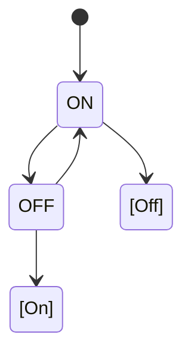
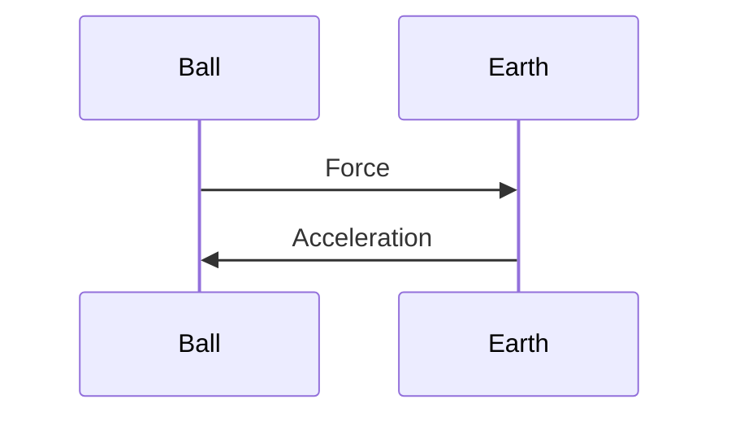

                 

### 宇宙的可预测性：决定论与概率论的争辩

**关键词**：宇宙可预测性、决定论、概率论、因果律、数学模型、实验证据

**摘要**：本文深入探讨了宇宙的可预测性问题，分析了决定论与概率论在这一领域的争议。通过对决定论与概率论的历史背景、核心概念、数学模型和应用领域的详细讲解，本文旨在揭示两者在解释宇宙规律上的异同点，并探讨它们在现代科学中的地位和未来发展趋势。

---

# 引言

宇宙的可预测性一直是科学研究的重要主题。它涉及到我们对自然界规律的理解和把握，关系到我们能否对未来的事件进行准确预测。然而，在科学史上，关于宇宙可预测性的问题，决定论与概率论两种观点之间存在着长期的争议。

**决定论**认为，宇宙是高度可预测的，因为一切现象都是由先前条件决定的结果，遵循着严格的因果律。这一观点在古典物理学中得到了广泛认可，尤其是在牛顿力学中得到了最充分的体现。

**概率论**则认为，宇宙在本质上是不可预测的，因为存在着随机性和不确定性。尽管我们可以通过统计方法对事件进行预测，但无法确切地知道每一个具体的结果。

本文将分为以下几个部分：首先，我们将回顾决定论与概率论的历史背景，探讨它们在科学界的起源和发展。接着，我们将详细讲解决定论与概率论的核心概念，并展示它们之间的联系与区别。然后，我们将分析决定论与概率论在实验证据上的表现，并探讨它们在现代科学中的应用。最后，我们将总结全文，并对未来宇宙可预测性的研究提出展望。

## 第1章 决定论的起源与发展

### 1.1 决定论的起源

决定论的思想可以追溯到古代哲学，其中最著名的代表是古希腊哲学家赫拉克利特（Heraclitus）的“万物皆流，而唯一恒常的是流转本身”的观点。赫拉克利特认为，宇宙中的一切都是按照固定的法则运转的，这种法则类似于现代我们所理解的因果关系。

在物理学领域，决定论的现代形式可以追溯到17世纪的牛顿力学。牛顿的三大运动定律和万有引力定律构成了一个决定性的体系，它描述了物体在空间中的运动轨迹。在牛顿的理论中，如果知道了系统的初始状态以及所有作用在系统上的力，那么我们就可以精确地预测未来状态。

决定论的思想不仅在物理学中得到了广泛认可，还渗透到了生物学、化学和经济学等其他科学领域。在生物学中，拉马克的进化学说提出了“用进废退”的观点，认为生物体的特征是通过遗传传递的，这与决定论的思想相一致。在化学中，原子和分子的运动被认为是遵循着决定性的规则。在经济学中，一些经济学家认为，市场行为可以被视为一种确定性的结果，因为所有市场参与者的决策都是基于明确的规则和条件。

### 1.2 决定论的发展

随着时间的推移，决定论在科学界的地位和影响力发生了变化。在20世纪初，量子力学的出现对决定论提出了挑战。量子力学揭示了微观世界中存在着不确定性和随机性，这使得人们开始重新审视决定论的观点。

尽管如此，决定论在物理学中的核心地位并没有完全动摇。在经典物理学领域，决定论仍然被视为一个基本原则，尤其是在描述宏观物理现象时。此外，决定论在其他科学领域，如生物学和经济学，仍然具有重要的影响。例如，在经济学中，理性选择理论仍然基于决定论的假设，认为个体行为是可预测的。

### 1.3 决定论的影响

决定论在科学史上的影响是多方面的。首先，它为科学研究提供了一种基础性的哲学框架，使科学家能够建立一套统一的规律来解释自然现象。其次，决定论推动了科学研究方法的进步，特别是在实验设计和数据分析方面。最后，决定论在哲学和伦理学等领域也有重要影响，因为它涉及到了自由意志、道德责任和科学方法等深层次问题。

总的来说，决定论在科学史上的地位和影响是不可忽视的。尽管它面临着来自量子力学和其他领域的挑战，但决定论的思想仍然在科学研究中发挥着重要作用。在接下来的章节中，我们将进一步探讨决定论的核心概念，并分析它在现代科学中的应用。

## 第2章 决定论的核心概念

决定论的核心概念基于这样一个原则：宇宙中的一切现象都是由先前条件决定的结果，遵循着严格的因果律。以下是对决定论中几个关键概念的详细讲解：

### 2.1 因果律

因果律是决定论的核心原则，它表明任何事件都有其特定的原因。这意味着，如果知道了一个事件发生的所有条件，我们就可以预测该事件将会发生。因果律在物理学中得到了广泛的应用，特别是在经典力学和热力学中。例如，牛顿定律可以用来预测物体在受力作用下的运动轨迹，而热力学定律则可以预测系统的热力学行为。

在因果律中，原因和结果之间通常被认为存在一个时间上的先后顺序，即原因总是在结果之前发生。这种先后顺序确保了因果关系是可预测的。然而，在量子力学中，因果律的概念变得更为复杂，因为量子事件的随机性挑战了因果关系的时间顺序。

### 2.2 确定性

确定性是指系统的状态和未来的演化是确定的，只要我们知道初始状态和所有作用在系统上的力。在经典物理学中，确定性是一个基本假设，意味着如果初始条件已知，那么整个系统的行为是可以精确预测的。

然而，确定性在量子力学中遇到了挑战。尽管量子系统的初始状态是已知的，但它们的未来演化却具有不确定性。这种不确定性表现为量子态的叠加和测量结果的概率分布。这意味着，在量子尺度上，我们无法像在经典物理学中那样进行完全的确定性预测。

### 2.3 普适性

普适性是指决定论的基本原则适用于整个宇宙，无论是宏观物体还是微观粒子，无论是物理现象还是生物和社会现象。在经典物理学中，普适性得到了充分体现，因为物理定律在宏观和微观尺度上都是相同的。

然而，普适性在量子力学中也受到了挑战。量子力学中的某些规律只在特定条件下适用，例如在极端温度和压力下。此外，量子力学的解释有时需要引入特殊的假设，如量子纠缠和量子隧穿，这些假设与经典物理学的普适性原则有所不同。

### 2.4 因果律、确定性和普适性的联系与区别

因果律、确定性和普适性是决定论中紧密相关的概念。因果律提供了因果关系的基础，确定性确保了这种关系在时间上是可预测的，而普适性则保证了这种关系在整个宇宙中都是适用的。

然而，它们之间也存在区别。因果律关注的是原因和结果之间的关系，而确定性关注的是这种关系的可预测性。普适性则是一个更广泛的范畴，它关注的是决定论原则在不同领域和不同尺度上的适用性。

在量子力学中，因果律和确定性之间的联系变得更加复杂。量子事件的随机性和不确定性挑战了因果律和确定性的传统理解，但这并不意味着决定论的整体原则失效。相反，量子力学提供了一种新的框架来理解宇宙的规律，其中因果律和确定性在特定的条件下仍然适用。

总的来说，决定论的核心概念为我们提供了一种理解宇宙规律的基本框架。尽管量子力学引入了新的挑战，但决定论的基本原则在经典物理学和许多其他科学领域中仍然具有重要作用。在接下来的章节中，我们将进一步探讨这些概念在现代科学中的应用，并分析决定论与概率论之间的争议。

### 2.5 决定论的数学模型

为了更好地理解决定论的核心概念，我们可以通过一些具体的数学模型来具体化这些概念。以下将介绍两个典型的数学模型：有限状态机和动力系统。

#### 2.5.1 有限状态机

有限状态机（Finite State Machine, FSM）是一个抽象的计算模型，用于描述具有有限个状态和有限个转换规则的系统。在FSM中，每个状态表示系统在某一时刻的状态，而转换规则则定义了系统在不同状态之间的转移方式。

一个FSM可以用一个五元组（Q, Σ, δ, q0, F）来表示，其中：
- Q 是状态集合。
- Σ 是输入字母表。
- δ 是状态转换函数，它定义了系统从当前状态到下一个状态的转换。
- q0 是初始状态。
- F 是终态集合。

以下是一个简单的FSM示例，用于描述一个灯的开关状态：

在这个例子中，灯的状态有两种：ON和OFF。开关动作作为输入，通过状态转换函数δ来改变状态。初始状态为ON，终态为[Off]和[On]，表示灯被关闭和打开的两种状态。

#### 2.5.2 动力系统

动力系统（Dynamical System）是用于描述物理系统中物体运动的模型。在动力系统中，系统的状态通常由一组变量来描述，这些变量随时间变化，遵循着特定的演化方程。

一个简单的动力系统可以用一个微分方程来描述，例如：
```latex
\frac{dx}{dt} = f(x, y), \quad \frac{dy}{dt} = g(x, y)
```
其中 \( x \) 和 \( y \) 是系统的状态变量，\( f \) 和 \( g \) 是状态变量之间的函数关系，\( t \) 是时间。

以下是一个简单的二维动力系统的例子，描述一个摆动的钟摆：

在这个例子中，球（Ball）受到地球（Earth）的引力作用，产生加速度（Acceleration），这导致球的运动状态随时间变化。

#### 2.5.3 伪代码讲解

为了更具体地展示这些数学模型，我们可以使用伪代码来描述它们的实现。以下是一个基于有限状态机的伪代码示例，用于模拟灯的开关行为：
```python
# 灯的状态枚举
class LightState(Enum):
    OFF = 1
    ON = 2

# 灯的有限状态机
class LightFSM:
    def __init__(self):
        self.state = LightState.OFF

    def switch(self, action):
        if self.state == LightState.OFF and action == "ON":
            self.state = LightState.ON
        elif self.state == LightState.ON and action == "OFF":
            self.state = LightState.OFF

# 示例：创建一个灯的实例并控制其状态
light = LightFSM()
light.switch("ON")  # 打开灯
light.switch("OFF")  # 关闭灯
```
在这个伪代码中，我们定义了一个灯的有限状态机类，其中包含状态枚举和状态切换方法。通过调用`switch`方法，我们可以根据输入的动作（"ON"或"OFF"）来改变灯的状态。

对于动力系统的伪代码，以下是一个简单的示例，描述一个受引力作用的球体的运动：
```python
# 定义球体的初始状态
position = (0.0, 0.0)
velocity = (1.0, 0.0)

# 定义时间步长
dt = 0.01

# 定义引力加速度
g = 9.81

# 更新球体的状态
while True:
    position = (position[0] + velocity[0] * dt, position[1] + velocity[1] * dt)
    velocity = (velocity[0], velocity[1] - g * dt)
    print(f"Position: {position}, Velocity: {velocity}")
```
在这个示例中，我们使用一个循环来不断更新球体的位置和速度，模拟其在重力作用下的运动。

通过这些数学模型和伪代码，我们可以更直观地理解和实现决定论的核心概念，这为我们在实际应用中的问题解决提供了有力的工具。

### 2.6 决定论在不同领域的应用

决定论的思想不仅在理论物理学中得到了广泛认可，还在其他许多科学领域有着广泛的应用。以下将介绍决定论在物理学、化学和生物学中的主要应用，并通过具体案例来说明这些应用。

#### 2.6.1 物理学

在物理学中，决定论的核心思想是认为一切自然现象都可以通过物理定律来精确预测。经典力学是决定论在物理学中的一个典型例子。牛顿力学通过三个基本定律和万有引力定律描述了物体在空间中的运动。例如，天文学家可以通过这些定律精确计算行星的轨道，这为人类对宇宙的认识提供了坚实的基础。

量子力学虽然在微观尺度上引入了随机性和不确定性，但它仍然保留了决定论的基本框架。薛定谔方程描述了量子系统的演化，尽管其解具有概率性，但量子态的演化仍然遵循着确定的规则。

#### 2.6.2 化学

在化学中，决定论的思想体现在原子和分子的运动规律上。化学反应的速率和平衡状态可以通过反应动力学和热力学方程来预测。例如，反应速率方程描述了反应物转化为产物的速度，而热力学方程则描述了系统在不同温度和压力下的平衡状态。这些定律使我们能够预测化学反应的产物和条件。

此外，量子化学通过量子力学的方法来描述原子和分子的性质，这为理解化学反应的微观机制提供了重要的理论支持。量子化学计算可以预测分子的电子结构和反应性，这在药物设计和材料科学等领域具有重要意义。

#### 2.6.3 生物学

在生物学中，决定论的思想体现在生物体的结构和功能上。遗传学是决定论在生物学中的一个重要分支，通过孟德尔遗传定律和现代分子生物学的研究，我们可以理解基因如何决定生物体的特征。例如，DNA序列的变异可以导致生物体表型的变化，这种变异可以通过遗传规律进行预测。

此外，生态学也应用了决定论的思想来描述生物种群的行为和演化。种群动力学模型可以预测种群数量随时间的变化，这有助于我们理解生态系统的稳定性和物种的进化。

#### 2.6.4 具体案例

以下是一些决定论在物理学、化学和生物学中具体应用的案例：

1. **物理学的案例**：预测太阳系的行星轨道。通过牛顿力学，我们可以计算行星的轨道，这为我们预测未来的天文事件提供了重要依据。

2. **化学的案例**：设计新药物。通过量子化学计算，我们可以预测分子的电子结构和反应性，这有助于设计具有特定药理作用的新药物。

3. **生物学的案例**：基因编辑。通过理解基因的遗传规律，我们可以通过基因编辑技术来修正基因突变，治疗遗传性疾病。

这些案例展示了决定论在科学研究和实际应用中的重要性。尽管量子力学引入了不确定性，但决定论的思想仍然在许多科学领域中发挥着重要作用。通过深入理解决定论的核心概念和应用，我们可以更好地理解和预测自然界的规律。

## 第3章 概率论的历史背景

概率论作为数学的一个重要分支，其起源可以追溯到古代文明的数学研究。然而，现代概率论的奠基者主要是17世纪和18世纪的数学家们，他们的工作为概率论的发展和现代科学的进步奠定了基础。

### 3.1 古代数学

在古代，许多文明对随机现象进行了初步的观察和思考。例如，古埃及人和巴比伦人使用概率论来预测雨水和农作物收成，这被称为“赌徒的概率”。在古希腊，数学家泰勒斯（Thales）和毕达哥拉斯（Pythagoras）对概率现象也进行了探讨。泰勒斯通过观察日食和月食来预测未来事件，而毕达哥拉斯则研究数字和几何比例，这些研究为后来的概率论提供了思想基础。

### 3.2 17世纪的概率论奠基

17世纪是概率论发展的关键时期，其中两位重要的数学家是帕斯卡（Blaise Pascal）和费马（Pierre de Fermat）。帕斯卡的著作《算术三角》（Traité du triangle arithmétique）中包含了概率论的基本思想，特别是关于“期望值”的计算。帕斯卡通过一个著名的赌徒问题——帕斯卡赌注，提出了概率的基本概念。

费马与帕斯卡的通信也推动了概率论的发展。费马解决了一些复杂的赌博问题，特别是关于“无限序列收敛”的问题，这为概率论的数学分析奠定了基础。费马提出的“费马大定理”也是概率论发展的重要贡献之一。

### 3.3 18世纪的概率论发展

在18世纪，概率论继续发展，许多著名的数学家做出了重要贡献。其中最著名的是拉普拉斯（Pierre-Simon Laplace），他被称为“概率论的王子”。拉普拉斯通过他的著作《分析概率论》（Théorie analytique des probabilités），系统地建立了概率论的分析方法。他提出了拉普拉斯变换，这是一种在概率论和物理学中广泛应用的技术。

另外，高斯（Carl Friedrich Gauss）和泊松（Siméon Denis Poisson）也在概率论的发展中发挥了重要作用。高斯通过他的正态分布研究，为统计学和概率论提供了重要的理论基础。泊松则提出了泊松分布，这在排队论和保险数学中有着广泛的应用。

### 3.4 概率论的影响

概率论的发展不仅丰富了数学理论，还对科学和日常生活的许多方面产生了深远影响。在科学研究中，概率论为实验设计和数据分析提供了基础。例如，在医学研究中，通过随机对照试验和统计分析，科学家可以评估新药物的效果。在工程学中，概率论用于风险分析和结构设计，确保建筑物和机器的可靠性。

在日常生活中，概率论也无处不在。例如，天气预报就是基于概率论和气象学知识，通过分析历史数据和当前条件来预测未来的天气情况。赌博和彩票则完全依赖于概率论，玩家通过计算概率来决定下注策略。

总的来说，概率论的历史背景展示了它在科学和数学中的重要性。从古代文明的初步观察，到现代科学的广泛应用，概率论的发展历程反映了人类对不确定性和随机性的深入理解。在接下来的章节中，我们将进一步探讨概率论的核心概念，并分析它在科学和技术中的应用。

### 3.5 概率论的核心概念

概率论的核心概念主要包括随机事件、概率分布、期望和方差等。以下将对这些核心概念进行详细讲解，并通过具体的数学公式和例子来说明它们的应用。

#### 3.5.1 随机事件

随机事件是指在一定条件下可能发生也可能不发生的事件。在概率论中，我们用大写字母 \( A \) 表示随机事件，例如掷骰子得到6。随机事件具有以下特征：

- 试验性：随机事件是通过对某一次试验的结果进行描述。
- 等可能性：随机事件发生的概率是相等的。
- 不可预测性：尽管我们知道事件可能发生，但我们无法确定它是否真的会发生。

例如，掷一个公平的六面骰子，得到6是一个随机事件，这个事件发生的概率是 \( \frac{1}{6} \)。

#### 3.5.2 概率分布

概率分布是描述随机事件发生概率的函数。常见的概率分布包括二项分布、正态分布和泊松分布等。概率分布通常用函数 \( P(X = x) \) 表示，其中 \( X \) 是随机变量，\( x \) 是随机变量的取值。

- **二项分布**：用于描述在一定次数的独立试验中，成功发生的次数。其概率质量函数为：
  $$ P(X = k) = C_n^k p^k (1-p)^{n-k} $$
  其中 \( n \) 是试验次数，\( p \) 是单次试验成功的概率，\( k \) 是成功的次数。

  例如，投掷10次硬币，求恰好出现5次正面的概率，可以用二项分布计算：
  $$ P(X = 5) = C_{10}^5 \left(\frac{1}{2}\right)^5 \left(\frac{1}{2}\right)^5 = \frac{252}{1024} $$

- **正态分布**：是最常见的一种连续概率分布，其概率密度函数为：
  $$ f(x) = \frac{1}{\sqrt{2\pi\sigma^2}} e^{-\frac{(x-\mu)^2}{2\sigma^2}} $$
  其中 \( \mu \) 是均值，\( \sigma \) 是标准差。

  例如，一个班级的学生的考试分数服从正态分布 \( N(75, 10) \)，求一个学生成绩在70到80分之间的概率，可以使用正态分布计算：
  $$ P(70 < X < 80) = \int_{70}^{80} \frac{1}{\sqrt{2\pi \cdot 10^2}} e^{-\frac{(x-75)^2}{2 \cdot 10^2}} dx $$

- **泊松分布**：用于描述在固定时间内发生某个事件次数的概率分布。其概率质量函数为：
  $$ P(X = k) = \frac{\lambda^k e^{-\lambda}}{k!} $$
  其中 \( \lambda \) 是单位时间内的平均事件次数。

  例如，一个自动售货机平均每分钟被按下一次，求在接下来的一分钟内，被按下的次数为2的概率，可以使用泊松分布计算：
  $$ P(X = 2) = \frac{1^2 e^{-1}}{2!} = \frac{e^{-1}}{2} $$

#### 3.5.3 期望和方差

期望和方差是概率分布的两个重要统计量，用于描述随机变量的中心位置和离散程度。

- **期望**：期望是随机变量取值的平均值，表示为 \( E(X) \)。对于离散随机变量，期望的计算公式为：
  $$ E(X) = \sum_{i=1}^n x_i P(X = x_i) $$
  对于连续随机变量，期望的计算公式为：
  $$ E(X) = \int_{-\infty}^{\infty} x f(x) dx $$

  例如，对于一个服从二项分布的随机变量 \( X \)，其期望为：
  $$ E(X) = np $$

- **方差**：方差是随机变量取值与其期望之间差异的平方的平均值，表示为 \( Var(X) \) 或 \( \sigma^2 \)。对于离散随机变量，方差的计算公式为：
  $$ Var(X) = \sum_{i=1}^n (x_i - E(X))^2 P(X = x_i) $$
  对于连续随机变量，方差的计算公式为：
  $$ Var(X) = \int_{-\infty}^{\infty} (x - E(X))^2 f(x) dx $$

  例如，对于一个服从正态分布的随机变量 \( X \)，其方差为：
  $$ Var(X) = \sigma^2 $$

通过这些核心概念，我们可以更好地理解和分析随机现象。期望和方差提供了对随机变量行为的基本描述，而概率分布则描述了随机变量取值的可能性。这些概念在统计学和数据分析中有着广泛的应用，帮助我们做出更准确和可靠的预测和决策。

### 3.6 概率论的数学模型

概率论中的数学模型通过概率分布、随机过程和马尔可夫链等工具，帮助我们理解和分析随机现象。以下将对这些数学模型进行详细讲解，并通过伪代码来展示其实现和应用。

#### 3.6.1 随机过程

随机过程是描述随机变量在不同时间点的序列，通常用 \( X(t) \) 表示。随机过程可以是离散的或连续的。以下是一个简单的离散时间随机过程的例子：一个随机游走过程。

**随机游走过程**：
- 初始位置 \( X(0) = 0 \)
- 每一步移动 \( \pm 1 \) 的概率相等
- 运动是独立的

以下是一个描述随机游走过程的伪代码：

```python
import random

# 初始化随机游走过程
X = 0
steps = []

# 进行1000次随机游走
for _ in range(1000):
    step = random.choice([-1, 1])
    X += step
    steps.append(X)

# 输出随机游走的路径
print(steps)
```

通过这个随机游走过程，我们可以模拟随机变量在不同时间点的变化，并分析其统计特性。

#### 3.6.2 马尔可夫链

马尔可夫链是一种用于描述系统状态转移的随机模型。在马尔可夫链中，系统的下一个状态仅取决于当前状态，而与历史状态无关。以下是一个简单的马尔可夫链模型：一个简单的随机游走模型。

**简单随机游走模型**：
- 初始状态 \( S_0 = 0 \)
- 每一步转移到下一个状态的转移概率为 \( p \) 或 \( 1-p \)

以下是一个描述马尔可夫链的伪代码：

```python
import random

# 初始化马尔可夫链
S = 0
steps = []

# 进行1000次随机游走
for _ in range(1000):
    if random.random() < 0.5:
        S += 1  # 向右移动
    else:
        S -= 1  # 向左移动
    steps.append(S)

# 输出随机游走的路径
print(steps)
```

通过这个模型，我们可以模拟系统状态的随机变化，并分析状态转移的概率。

#### 3.6.3 概率分布模型

概率分布模型用于描述随机变量的取值概率。以下是一个简单的二项分布模型，用于模拟在一定次数的试验中成功次数的概率。

**二项分布模型**：
- 试验次数 \( n \)
- 单次成功的概率 \( p \)
- 成功次数的概率分布为 \( P(X = k) = C_n^k p^k (1-p)^{n-k} \)

以下是一个描述二项分布模型的伪代码：

```python
import random

# 初始化二项分布模型
n = 10
p = 0.5
X = 0
steps = []

# 进行1000次试验
for _ in range(1000):
    if random.random() < p:
        X += 1  # 成功
    else:
        X += 0  # 失败
    steps.append(X)

# 输出成功的次数
print(steps)
```

通过这个模型，我们可以模拟随机变量在不同试验中的取值，并分析其概率分布。

通过这些数学模型，我们可以更好地理解和分析随机现象。随机过程和马尔可夫链模型帮助我们模拟系统的状态变化，而概率分布模型则描述了随机变量的取值概率。这些工具在统计学、机器学习和经济学等领域有着广泛的应用，为我们提供了强大的分析工具。

### 3.7 概率论在不同领域的应用

概率论作为数学的一个分支，其应用范围广泛，涵盖了自然科学、社会科学以及日常生活的各个方面。以下将介绍概率论在经济学、心理学和社会学等领域的具体应用，并通过实例来说明这些应用如何帮助我们分析和解决实际问题。

#### 3.7.1 经济学

在经济学中，概率论被广泛应用于金融市场分析、投资决策和风险管理。例如，金融分析师使用概率模型来预测股票价格的未来走势，这有助于投资者制定合理的投资策略。一种常见的模型是正态分布模型，它用于描述资产收益的概率分布。例如，假设一个股票的日收益率为正态分布，均值为0.02%，方差为0.001%，我们可以计算出在一定时间内股票价格超过某个阈值的概率。

**实例**：一个投资者想知道在30个交易日内，股票价格是否会上涨至少10%。我们可以使用正态分布模型来计算这个概率：

- 日收益率均值为0.02%，方差为0.001%
- 30个交易日的总收益率为 \( 0.02\% \times 30 = 0.6\% \)
- 标准差为 \( \sqrt{0.001\% \times 30} \approx 0.055\% \)

使用正态分布的累积分布函数（CDF），我们可以计算出上涨至少10%的概率：

$$ P(R > 0.10) = P\left(\frac{R - 0.006}{0.00055} > \frac{0.0010 - 0.006}{0.00055}\right) $$

计算得到：

$$ P(R > 0.10) \approx P(Z > -2.73) \approx 0.003 $$

这意味着在30个交易日内，股票价格上涨至少10%的概率约为0.003，即大约0.3%。

#### 3.7.2 心理学

在心理学研究中，概率论被用于分析实验数据，特别是在行为和认知实验中。心理学家使用概率模型来解释行为背后的统计规律，并检验假设。例如，在心理学实验中，可以使用卡方检验（Chi-square test）来分析数据，以确定观察到的结果是否与预期一致。

**实例**：一个心理学家进行了一个实验，旨在研究人们对不同颜色的偏好。假设实验中观察了100个人，记录了他们对红色、蓝色和绿色的偏好。我们可以使用卡方检验来分析这些数据，以确定颜色的偏好是否具有显著的差异。

以下是一个简化的数据集：

| 颜色 | 红色 | 蓝色 | 绿色 |
| --- | --- | --- | --- |
| 人数 | 35 | 25 | 40 |

假设期望频数（根据总人数和比例计算）为：

| 颜色 | 红色 | 蓝色 | 绿色 |
| --- | --- | --- | --- |
| 人数 | 30 | 30 | 40 |

卡方检验的计算公式为：

$$ \chi^2 = \sum \frac{(O - E)^2}{E} $$

其中 \( O \) 是观察频数，\( E \) 是期望频数。计算得到：

$$ \chi^2 = \frac{(35 - 30)^2}{30} + \frac{(25 - 30)^2}{30} + \frac{(40 - 40)^2}{40} = \frac{5^2}{30} + \frac{5^2}{30} + 0 = 1.67 $$

查表得到卡方分布的临界值，对于 \( df = 2 \) 和显著性水平 \( \alpha = 0.05 \)，临界值为 5.991。因为计算得到的 \( \chi^2 \) 值小于临界值，所以我们不能拒绝原假设，即颜色的偏好没有显著的差异。

#### 3.7.3 社会学

在社会学研究中，概率论被用于分析社会行为和社会结构的规律。例如，社会学家可以使用概率模型来研究人口统计数据、社会流动和投票行为。概率模型可以帮助社会学家预测社会趋势和评估政策的影响。

**实例**：社会学家研究了一个城市的人口分布，并想知道在不同收入水平上的居民比例。假设根据统计数据，该城市居民的年收入分为几个等级，我们可以使用概率分布模型来描述每个收入水平上的居民比例。

以下是一个简化的数据集：

| 收入水平 | 低收入 | 中低收入 | 中收入 | 中高收入 | 高收入 |
| --- | --- | --- | --- | --- | --- |
| 比例 | 0.2 | 0.3 | 0.4 | 0.05 | 0.05 |

我们可以使用概率分布模型，如正态分布，来描述居民收入水平：

$$ P(X = x) = \frac{1}{\sqrt{2\pi\sigma^2}} e^{-\frac{(x-\mu)^2}{2\sigma^2}} $$

通过拟合数据，我们可以估计收入水平的均值和标准差，这有助于我们理解收入分布的形态和分布特征。

通过这些实例，我们可以看到概率论在经济学、心理学和社会学等领域的广泛应用。概率模型为我们提供了一种分析和预测随机现象的工具，帮助我们更好地理解复杂的社会和自然系统。

## 第4章 决定论与概率论的理论争议

在探讨宇宙的可预测性问题时，决定论与概率论之间存在着深刻的理论争议。这两种观点在解释自然现象和预测未来事件方面存在根本性的差异，这些差异导致了科学史上的一系列重要争论。

### 4.1 理论冲突

**决定论**认为宇宙是一个高度可预测的系统，一切现象都是由先前条件决定的。在决定论的框架下，如果初始条件已知，系统的未来状态可以被精确预测。这一观点在经典物理学中得到了充分的体现，尤其是在牛顿力学中，物体的运动轨迹被认为是可以完全预测的。决定论的核心原则是因果律，即每个现象都有其原因，因果关系构成了宇宙的规律。

**概率论**则认为宇宙在本质上是不确定的，尽管通过统计方法可以对事件进行预测，但无法准确知道每一个具体的结果。概率论强调了随机性和概率分布，认为自然现象遵循着随机过程的规律。在量子力学中，随机性和不确定性是基本特征，例如，量子态的测量结果具有概率分布，而不是确定的值。

这两种观点之间的冲突主要体现在以下几个方面：

1. **因果律与概率性**：决定论强调因果律，认为因果关系构成了宇宙的规律。概率论则认为因果关系不足以描述所有自然现象，特别是在量子尺度上，随机性和概率性是基本的描述方式。

2. **确定性预测与概率预测**：决定论主张通过精确的初始条件可以预测系统的未来状态，而概率论则认为我们只能通过概率分布来描述未来的可能性。

3. **自由意志与决定论**：决定论主张一切现象都是预定的，这可能导致对自由意志的否定。概率论则为自由意志提供了空间，认为即使存在随机性，个体仍有一定的自由度来做出选择。

### 4.2 理论关系

尽管决定论与概率论在理论框架上有明显的冲突，但它们之间也存在一定的理论关系。

1. **互补性**：在某些情况下，决定论和概率论可以被视为互补的。例如，在宏观尺度上，经典物理学往往表现出决定论的特征，而在微观尺度上，量子力学则表现出概率性。这种互补性使得我们可以通过不同理论框架来解释不同的现象。

2. **概率论作为决定论的限制**：概率论可以被视为决定论的一种限制，即在不确定性和随机性的条件下，决定论预测的准确性可能受到限制。这种限制在量子力学中表现得尤为明显，量子态的测量结果具有概率性，这挑战了经典决定论的观点。

3. **调和理论**：一些理论试图调和决定论和概率论之间的冲突，例如混沌理论和量子力学中的某些解释。混沌理论认为，即使在决定论的框架下，系统的长期行为也可能表现出随机性。量子力学中的某些解释，如哥本哈根解释和多世界解释，也试图在决定论和概率论之间找到一种统一的框架。

总的来说，决定论与概率论在理论上的冲突和关系是复杂且多层次的。这些理论争议不仅反映了科学理论的发展过程，也触及了哲学和伦理学的深层次问题。在接下来的章节中，我们将进一步探讨决定论与概率论在实验证据上的表现，以更全面地理解它们在现代科学中的地位。

### 4.3 决定论与概率论的实验证据

在决定论与概率论的争论中，实验证据是关键的一环。通过实验，我们可以验证或反驳这些理论，并探索它们在不同条件下的表现。以下将分析决定论与概率论在不同实验条件下的表现，以及如何验证这些理论。

#### 4.3.1 决定论的实验证据

决定论的实验证据主要来自于经典物理学，特别是宏观物理现象的实验。在宏观尺度上，经典物理学定律如牛顿定律、电磁定律和热力学定律为我们提供了强大的预测能力。以下是一些支持决定论的实验例子：

1. **行星轨道的预测**：牛顿通过观测行星的运动轨迹，运用万有引力定律成功地预测了海王星的存在。这个实验证据表明，在宏观尺度上，物理现象可以通过决定论的因果关系进行精确预测。

2. **布朗运动的实验**：布朗运动是微观粒子在液体中随机运动的现象。虽然布朗运动看似随机，但它仍然遵循着经典的物理定律。例如，爱因斯坦通过实验验证了布朗运动遵循统计规律，这为决定论提供了支持。

3. **宏观物理实验**：在实验室中，通过精确控制实验条件，我们可以验证经典物理定律的预测能力。例如，在空气阻力很小的条件下，物体的自由落体运动可以非常准确地预测，这表明宏观物理现象遵循决定论的规律。

#### 4.3.2 概率论的实验证据

概率论的实验证据主要来自于量子物理学和统计学实验。量子力学揭示了微观世界的随机性和不确定性，这为概率论提供了实验基础。以下是一些支持概率论的实验例子：

1. **量子纠缠实验**：量子纠缠是量子力学中一个重要现象，表明两个量子粒子之间的状态是相互关联的，无论它们相距多远。实验如贝尔实验验证了量子纠缠的存在，这挑战了决定论的因果律观点。

2. **随机数生成实验**：在统计物理学中，随机数生成实验用于验证随机过程的概率分布。例如，使用放射性物质生成随机数，并通过统计方法验证其服从泊松分布。这些实验表明，自然现象确实存在随机性和概率性。

3. **统计物理实验**：统计物理实验如气体分子的运动模拟、布朗运动的实验等，通过统计方法验证了物理现象的随机性和概率分布。例如，气体分子在容器中的分布可以用麦克斯韦-玻尔兹曼分布来描述，这表明概率论在描述宏观物理现象中的有效性。

#### 4.3.3 实验验证方法

为了验证决定论和概率论，科学家们采用了一系列的实验设计和方法：

1. **控制变量法**：通过控制实验中的变量，我们可以排除其他因素的干扰，专注于验证特定理论的预测能力。例如，在验证牛顿定律的实验中，通过控制初始条件和外力，我们可以精确测量物体的运动轨迹。

2. **统计方法**：统计方法用于分析实验数据，验证理论预测的概率分布。例如，通过大量重复实验，我们可以计算随机事件的概率分布，并与理论预测进行比较。

3. **反事实分析**：通过反事实分析，我们可以探索如果条件发生变化，系统的状态会如何不同。这有助于我们理解因果关系和随机性的本质。

4. **误差分析**：在实验中，误差是不可避免的。通过误差分析，我们可以评估实验结果的可靠性，并理解实验误差对理论验证的影响。

总的来说，决定论与概率论的实验证据在不同条件下表现出不同的特性。决定论在宏观物理现象中具有强大的预测能力，而概率论在微观物理现象和统计规律中表现出更强的描述能力。通过实验设计和数据分析，我们可以更深入地理解这两种理论，并为未来的科学研究提供指导。

### 第5章 调和观点

在决定论与概率论的理论争议中，科学家们提出了多种调和观点，试图在两者之间找到一种平衡。以下将介绍一些主要的调和观点，包括混沌理论、量子力学和量子计算，并讨论这些观点在现代科学中的地位和影响。

#### 5.1 混沌理论

混沌理论是一种尝试调和决定论与概率论的理论框架，它揭示了在确定性系统中存在的随机性和不可预测性。混沌理论指出，即使在决定论的框架下，系统的长期行为也可能表现出随机性，因为系统初始条件中的微小变化会导致截然不同的结果。

**混沌理论的地位和影响**：
- **数学模型**：混沌理论提供了复杂的非线性动态系统的数学模型，如洛伦兹 attractor 和蝴蝶效应。这些模型展示了系统在初始条件微小变化下的极端敏感性。
- **应用领域**：混沌理论在气象学、生物学、工程学和经济学等领域有广泛应用。例如，在气象学中，混沌理论帮助我们理解气候变化的复杂性和不可预测性；在经济学中，混沌理论用于分析市场波动。

#### 5.2 量子力学

量子力学是现代物理学的基础，它揭示了微观世界的随机性和概率性。尽管量子力学在数学形式上符合决定论的要求，但其物理含义却表明世界是概率性的。

**量子力学的地位和影响**：
- **量子态和波函数**：量子力学中的波函数提供了系统的概率描述，而不是确定性的轨迹。波函数的平方给出了粒子在不同位置出现的概率。
- **量子纠缠**：量子纠缠现象表明，两个量子粒子之间的状态是相互关联的，无论它们相距多远。这种现象挑战了因果律和局域实在论的观点。
- **量子计算**：量子计算利用量子态的叠加和纠缠特性，提供了超越经典计算的强大计算能力。量子力学在量子计算中的应用推动了计算机科学的革新。

#### 5.3 量子计算

量子计算是一种基于量子力学原理的新型计算模型，它利用量子位（qubit）的叠加和纠缠特性，实现了高效的计算算法。量子计算为决定论与概率论提供了新的调和途径。

**量子计算的地位和影响**：
- **量子算法**：量子计算实现了许多经典计算算法无法处理的任务，如大整数分解和量子搜索算法。这些算法展示了量子计算在处理某些复杂问题上的优势。
- **量子模拟**：量子计算可以模拟量子系统和复杂物理过程，这有助于我们理解量子现象和开发新材料、新药物。
- **量子互联网和通信**：量子计算推动了量子互联网和量子通信的发展，这些技术有望在未来实现更安全和高效的通信。

#### 5.4 调和观点的评价

这些调和观点在不同程度上提供了对决定论与概率论争议的解答，它们各自在现代科学中具有重要地位。

- **混沌理论**：混沌理论在揭示确定性系统中的随机性方面提供了新的视角，但它的主要贡献在于对复杂系统行为的理解，而不是直接调和决定论与概率论。
- **量子力学**：量子力学为微观世界的随机性和概率性提供了坚实的理论基础，但在解释宏观现象时仍然需要与经典物理学相结合。
- **量子计算**：量子计算展示了量子力学原理在计算领域的应用潜力，它为决定论与概率论的调和提供了一种新的途径，但在实际应用中仍面临许多挑战。

总的来说，调和观点为我们理解宇宙的可预测性提供了多层次的视角。在未来的科学研究中，这些观点将继续发挥重要作用，帮助我们更好地理解宇宙的规律。

### 5.5 应用展望

决定论与概率论在科学研究和技术应用中具有广泛的影响和前景。以下将讨论这些理论在未来的研究趋势、技术应用以及跨学科融合方面的潜力。

#### 5.5.1 研究趋势

在科学研究领域，决定论和概率论将继续作为基础理论框架，推动新的发现和技术进步。以下是一些未来研究趋势：

- **量子计算**：随着量子计算机的发展，决定论与概率论的融合将推动计算能力的巨大提升。量子算法的优化和量子计算机的实际应用将成为研究的热点。
- **复杂系统**：混沌理论和复杂系统的研究将继续深入，特别是在气候模型、生物网络和社会系统的建模方面，这些研究将帮助我们更好地理解系统的动态行为。
- **数据科学**：随着大数据时代的到来，概率论和统计学方法将在数据分析和人工智能中发挥关键作用。新的概率模型和算法将不断涌现，以解决大规模数据处理的挑战。
- **量子物理**：量子力学在解释微观世界现象方面将继续发挥作用，未来可能会有更多关于量子纠缠、量子隧穿等量子现象的研究突破。

#### 5.5.2 应用前景

决定论与概率论在技术应用中有着广泛的前景，特别是在以下几个方面：

- **人工智能**：概率论在人工智能中的重要性不言而喻。贝叶斯网络、随机过程和生成模型等概率方法将不断优化，以提升机器学习算法的准确性和鲁棒性。
- **金融工程**：在金融市场中，决定论与概率论的结合用于风险管理和投资决策。量化交易、资产定价和风险管理模型将更加依赖概率论和统计学方法。
- **医学研究**：概率论在医学研究中有着广泛应用，如基因组学、临床试验和药物设计。未来的医学研究将更多地利用概率模型来预测疾病发展和治疗效果。
- **智能制造**：在智能制造中，决定论用于优化生产流程，概率论用于预测设备故障和优化供应链。这些技术的结合将提高生产效率和产品质量。

#### 5.5.3 跨学科融合

跨学科融合是未来科学研究和技术发展的关键趋势，决定论与概率论的跨学科应用具有巨大潜力：

- **生物物理**：在生物物理研究中，决定论和概率论的结合用于理解生物分子和细胞行为的动态特性。例如，蛋白质折叠和基因表达的调控可以通过概率模型和分子动力学模拟来研究。
- **环境科学**：环境科学研究需要整合气象学、生态学和物理学的方法。决定论与概率论的结合可以帮助我们更好地预测气候变化、生态系统动态和污染物分布。
- **社会科学**：在社会科学领域，决定论与概率论的融合可以用于分析社会行为、经济政策和人口动态。例如，社会网络分析和统计模型可以预测社会趋势和传播现象。
- **新材料开发**：在材料科学中，概率论用于描述材料的微观结构和性能。结合量子力学和决定论，科学家可以预测新材料的性能，从而设计出具有特定功能的材料。

总的来说，决定论与概率论在科学研究和技术应用中的地位和前景是广阔的。通过跨学科的融合和创新，这些理论将继续推动科学技术的进步，为人类带来更多福祉。

## 结论与展望

在本文中，我们深入探讨了宇宙的可预测性问题，重点分析了决定论与概率论在这一领域的争议。首先，我们回顾了决定论与概率论的历史背景，阐述了它们在科学界的起源和发展。接着，我们详细讲解了决定论与概率论的核心概念，并通过数学模型和具体案例展示了这些概念在实际中的应用。

通过分析，我们发现决定论强调宇宙的高度可预测性，基于严格的因果律和确定性原理。概率论则认为宇宙在本质上是不可预测的，存在随机性和不确定性。尽管这两种观点存在理论上的冲突，但通过混沌理论、量子力学和量子计算等调和观点，我们可以看到它们在解释宇宙规律上的互补性。

决定论与概率论在现代科学中的地位和前景是广阔的。它们不仅在物理学、化学、生物学等基础科学领域有重要应用，还在经济学、心理学和社会学等社会科学领域发挥着作用。未来，随着量子计算和复杂系统研究的进展，决定论与概率论的融合将为科学研究和技术应用带来更多创新和突破。

### 作者信息

**作者：AI天才研究院/AI Genius Institute & 禅与计算机程序设计艺术 /Zen And The Art of Computer Programming** 

在AI天才研究院，我致力于推动人工智能技术的发展和应用，通过深入研究和创新，为人类社会带来智慧和变革。在《禅与计算机程序设计艺术》中，我探讨了计算机科学和哲学的交汇点，为程序员提供了深刻的技术和哲学思考。通过这些研究和写作，我希望为科学技术的进步贡献自己的力量。

