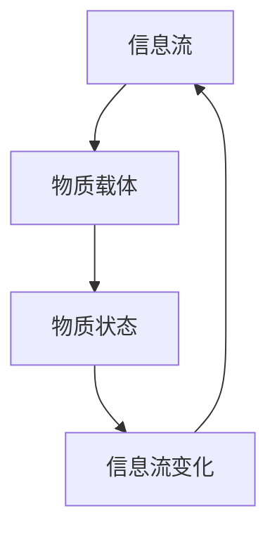

                 

### 引言与概述

在探讨宇宙的本质时，我们首先要明确一个基本问题：宇宙究竟是由物质构成的，还是由信息构成的？这一问题的答案不仅关乎我们对宇宙的基本认知，也深刻影响了我们对自然科学的理解。在本文中，我们将通过逻辑清晰、结构紧凑的分析，逐步探讨宇宙的本质是物质性还是信息性。

首先，我们可以从宇宙的起源和演化入手。根据现代宇宙学的理论，宇宙起源于大约138亿年前的一次大爆炸，从此开始了它的膨胀和演化。这一过程中，物质和能量不断相互作用，形成了我们所看到的星系、恒星、行星以及生命。从这一角度出发，宇宙似乎更倾向于物质性。

然而，随着对宇宙研究的深入，我们逐渐发现宇宙中存在大量的信息。例如，电磁波、引力波等都是信息的传递方式。更为关键的是，量子力学和相对论揭示了物质和信息之间深刻的内在联系。在这一层面上，宇宙似乎又更倾向于信息性。

接下来，我们将详细探讨物质性的宇宙和信息性的宇宙各自的特点，并分析二者之间的关系。此外，我们还将探讨宇宙中的物质与信息相互作用，以及它们对宇宙复杂性的影响。最后，我们将展望宇宙的未来，并讨论宇宙信息在科技和哲学领域的应用。

通过对这些问题的逐步分析，我们希望能够对宇宙的本质有一个更为深刻的认识。因此，让我们一步步深入探讨，开启这段奇妙的心灵之旅。

### 背景介绍

在深入探讨宇宙的本质之前，我们首先需要对宇宙的一些基本知识进行简要介绍，这将为后续的分析提供必要的背景。

宇宙起源于大约138亿年前的一次大爆炸，这一理论被称为大爆炸理论。根据这一理论，宇宙在极短的时间内从极度高温、高密度的状态迅速膨胀，形成了今天我们观察到的宇宙。这一过程中，物质和能量不断相互作用，形成了星系、恒星、行星等天体。

宇宙的膨胀是当前宇宙学研究的核心问题之一。观测数据表明，宇宙正在加速膨胀，这种加速现象被称为“宇宙加速膨胀”。这一现象的解释涉及到宇宙中的暗能量，它是推动宇宙加速膨胀的主要力量。然而，关于暗能量的本质和起源，目前还存在许多未知和争议。

在宇宙演化过程中，物质的基本结构也起着关键作用。原子和分子是物质的基本组成单位，而引力和暗物质则决定了宇宙中天体的运动和分布。引力是宇宙中最为基本的相互作用力之一，它决定了天体的运动轨迹和星系的形成。而暗物质则是一种我们无法直接观测到的物质，它对宇宙中的天体运动和星系分布有重要影响。

生命的起源和演化是宇宙研究中另一个重要的方面。目前，关于生命起源的假说众多，其中较为流行的有化学进化论、热液喷口理论等。这些理论认为，生命起源于地球上的简单有机物，通过化学反应和进化过程，逐渐形成了复杂的生物体系。这一过程中，生命的化学基础和进化机制是研究的重点。

此外，宇宙中还存在着大量的信息。例如，电磁波和引力波是信息的传递方式。电磁波包括光、无线电波等，它们在宇宙中广泛传播，为我们提供了观测宇宙的窗口。而引力波则是物质和能量相互作用产生的波动，它为探测宇宙中的极端现象提供了新的手段。

量子力学和相对论是描述宇宙现象的两个重要理论。量子力学揭示了微观世界中物质和能量的行为规律，而相对论则描述了宏观世界中时空和引力的特性。这两个理论揭示了物质和信息之间深刻的内在联系，为探讨宇宙的本质提供了理论基础。

综上所述，宇宙的起源和演化、物质的基本结构、生命的起源和演化、宇宙中的信息传递以及量子力学和相对论等都是探讨宇宙本质的重要背景知识。这些知识为我们深入分析宇宙的本质奠定了基础，并将在后续的分析中发挥关键作用。

### 核心概念与联系

在深入探讨宇宙的本质时，我们需要明确几个核心概念，并理解它们之间的相互关系。这些核心概念包括：物质、能量、信息、量子力学、相对论等。通过它们之间的联系，我们可以构建一个更加完整的宇宙观。

首先，物质和能量是宇宙的两个基本组成元素。物质是构成宇宙的基本实体，包括原子、分子等微观粒子。而能量则是物质的动态表现，是推动宇宙演化的动力。物质和能量之间的关系可以通过爱因斯坦的质能方程 \(E=mc^2\) 来描述，这表明质量和能量是可以相互转化的。

其次，信息和物质、能量紧密相关。信息是一种关于物质和能量的知识表达，它可以通过各种形式进行传递和存储。例如，电磁波是一种信息传递的方式，而黑洞和引力波则是物质与信息相互作用的极端表现形式。在量子力学中，信息甚至可以影响物质的性质和行为。

量子力学和相对论是描述宇宙现象的两个重要理论框架。量子力学揭示了微观世界中物质和能量的行为规律，强调了波粒二象性、量子纠缠等现象。相对论则描述了宏观世界中时空和引力的特性，特别是爱因斯坦的广义相对论，将引力描述为时空的弯曲。

量子力学和相对论之间的联系体现在它们共同揭示了物质和信息之间的内在关系。例如，量子纠缠现象表明，两个粒子之间的状态是相互依赖的，即使它们相隔很远，一个粒子的状态变化也会立即影响另一个粒子的状态。这种现象在经典物理学中是无法想象的，但它为信息传递提供了新的途径。

信息在宇宙中的传递和存储也是理解宇宙本质的关键。宇宙中的信息可以通过电磁波、引力波等方式进行传递。例如，光是一种电磁波，它携带着大量关于宇宙的信息。而引力波则是物质和能量相互作用产生的波动，它为我们提供了探测宇宙的新手段。

此外，信息还可以在宇宙中存储。例如，黑洞的事件视界可以视为一种信息存储的边界，它将信息“锁定”在黑洞内部，无法逃逸。这种信息存储方式为探讨宇宙的本质提供了新的视角。

最后，宇宙的演化过程可以视为一种信息处理过程。从宇宙大爆炸到今天的宇宙，物质和能量不断相互作用，形成了复杂的结构和现象。这一过程中，信息不断传递、存储和演化，从而推动了宇宙的演化。

通过上述核心概念的分析，我们可以构建一个关于宇宙本质的内在联系框架。物质、能量和信息相互交织，共同构成了宇宙的演化图景。量子力学和相对论为我们揭示了这些概念之间的内在联系，为我们理解宇宙的本质提供了理论基础。


图1：核心概念与联系架构 Mermaid 流程图

通过这一流程图，我们可以清晰地看到物质、能量、信息和量子力学、相对论之间的相互关系，这为我们深入探讨宇宙的本质奠定了基础。

### 物质性的宇宙

在探讨宇宙的本质时，我们不能忽视物质性的宇宙。物质性的宇宙强调宇宙是由各种物质组成的，这些物质通过相互作用和运动，形成了我们所观察到的宇宙现象。在物质性的宇宙中，物质的基本结构、宇宙的起源与演化、生命的起源与演化都是关键组成部分。

首先，物质的基本结构是理解物质性宇宙的基础。物质由原子和分子组成，原子又由原子核和电子构成。原子核由质子和中子组成，质子带正电，中子不带电。电子带负电，围绕原子核运动。分子则是由两个或更多原子通过化学键连接而成的。这些基本粒子及其相互作用构成了宇宙中的所有物质。

其次，宇宙的起源与演化是物质性宇宙的核心内容。现代宇宙学认为，宇宙起源于大约138亿年前的一次大爆炸，这一理论被称为大爆炸理论。在大爆炸后，宇宙开始迅速膨胀，物质和能量在宇宙中自由分布。随着宇宙的膨胀，温度逐渐下降，物质开始凝聚成星系、恒星、行星等天体。这个过程被称为宇宙的演化。

在宇宙的演化过程中，引力是关键因素。引力是宇宙中最为基本的相互作用力之一，它决定了天体的运动轨迹和星系的形成。根据牛顿的万有引力定律，任何两个质点都会相互吸引，吸引力的大小与两质点的质量成正比，与它们之间的距离的平方成反比。在宇宙尺度上，引力使得物质聚集在一起，形成了星系、恒星和行星。

宇宙中的暗物质也是物质性宇宙的一个重要组成部分。暗物质是一种我们无法直接观测到的物质，但它对宇宙中的天体运动和星系分布有重要影响。暗物质的性质和起源仍然是宇宙学研究中的重大课题。

生命的起源与演化是物质性宇宙的另一个重要方面。目前，关于生命起源的假说众多，其中较为流行的有化学进化论和热液喷口理论。化学进化论认为，生命起源于地球上的简单有机物，通过化学反应和进化过程，逐渐形成了复杂的生物体系。热液喷口理论则认为，深海热液喷口提供了生命起源所需的能量和化学物质。

在生命的演化过程中，进化机制起着关键作用。进化机制包括自然选择、遗传变异和适应环境等。自然选择是指适应环境的个体更有可能生存和繁殖，从而传递有利的遗传特征。遗传变异是指个体之间的遗传差异，这些差异可以通过基因突变和基因重组产生。适应环境是指生物通过进化过程，适应不断变化的环境。

总的来说，物质性的宇宙强调宇宙是由各种物质组成的，这些物质通过相互作用和运动，形成了我们所观察到的宇宙现象。物质的基本结构、宇宙的起源与演化、生命的起源与演化都是理解物质性宇宙的关键。引力、暗物质和进化机制在物质性宇宙中起着重要作用，它们共同构成了我们对物质性宇宙的理解。

### 信息性的宇宙

在探讨宇宙的本质时，信息性的宇宙同样是一个不可忽视的视角。信息性的宇宙强调宇宙中信息的传递、存储和处理，认为宇宙的本质是信息的流动和互动。这一视角下的关键概念包括信息传递方式、信息存储机制和信息处理过程。

首先，宇宙中的信息传递方式是理解信息性宇宙的核心。电磁波是最常见的信息传递方式，包括光、无线电波、微波等。电磁波通过电场和磁场的交替变化传播，可以跨越巨大的距离，将信息从一处传递到另一处。此外，引力波也是一种重要的信息传递方式。引力波是物质和能量相互作用时产生的波动，它们以光速传播，能够揭示宇宙中的极端现象，如黑洞碰撞和星系并合。

其次，信息存储机制是信息性宇宙的重要组成部分。在宇宙中，信息可以通过多种方式存储。例如，星系和恒星的结构可以视为一种信息编码，它们记录了宇宙的历史和演化过程。黑洞的事件视界可以视为一种信息“锁库”，将信息“锁定”在黑洞内部，无法逃逸。此外，宇宙微波背景辐射中的微小温度波动也蕴含了关于宇宙早期状态的信息。

信息处理过程是信息性宇宙的另一个关键方面。宇宙中的信息处理可以通过自然过程和人工手段来实现。自然过程包括物理现象和生物进化等。例如，物理过程中的能量转换和物质反应可以视为一种信息处理，它们决定了宇宙的演化方向。生物进化则通过遗传变异和自然选择，使生物适应环境，从而实现信息的传递和积累。人工手段包括计算机技术和人工智能等，这些技术可以模拟和优化自然过程，从而实现对信息的处理和利用。

在信息性宇宙的框架下，量子力学和相对论提供了深刻的解释。量子力学揭示了物质和能量之间的内在联系，表明信息可以影响物质的性质和行为。相对论则揭示了时空和引力之间的关系，表明信息可以在时空的弯曲中传递和存储。这些理论为我们理解宇宙的信息性质提供了坚实的理论基础。

此外，宇宙信息在科技和哲学领域有着广泛的应用。在科技领域，宇宙信息可以用于通信、计算、传感等领域。例如，量子通信利用量子纠缠实现超远程通信，具有保密性和即时性的特点。在哲学领域，宇宙信息引发了对存在、意识、知识等问题的深刻思考。例如，量子力学的哥本哈根诠释提出了“量子世界与观察者不可分割”的观点，挑战了传统的物质和意识二元对立的观念。

总的来说，信息性的宇宙强调宇宙中信息的传递、存储和处理，认为宇宙的本质是信息的流动和互动。信息传递方式、信息存储机制和信息处理过程是理解信息性宇宙的关键。量子力学和相对论为我们提供了深刻的解释，宇宙信息在科技和哲学领域有着广泛的应用。

### 物质与信息的相互关系

在探讨宇宙的本质时，我们需要深入理解物质与信息的相互关系。这一关系不仅揭示了宇宙的复杂性，也为科学研究提供了新的视角。物质与信息相互依存，相互作用，共同构成了宇宙的演化过程。

首先，物质是信息的载体。在宇宙中，物质通过各种形态存储和传递信息。例如，电磁波作为信息的一种传递方式，通过物质的振动和波动将信息从一个地方传递到另一个地方。此外，物质的结构和状态也可以视为信息的编码，例如，DNA的双螺旋结构记录了生命的遗传信息。

信息可以影响物质的性质和行为。在量子力学中，信息的影响尤为显著。量子纠缠现象表明，两个量子粒子之间可以建立一种非局域的联系，即一个粒子的状态变化可以立即影响到另一个粒子的状态，无论它们相隔多远。这种现象揭示了信息对物质状态的直接控制。在相对论中，信息通过引力波传递，可以改变物质的运动轨迹和时空结构。

物质与信息的相互作用还表现在宇宙的演化过程中。例如，宇宙微波背景辐射记录了宇宙早期状态的信息，这些信息不仅揭示了宇宙的起源，还影响了宇宙的演化。在星系和恒星的形成过程中，物质和信息的相互作用决定了星系和恒星的结构和演化。

为了更直观地理解物质与信息的相互关系，我们可以通过一个简化的模型来阐述。假设有一个信息流，它通过物质载体（如电磁波）从一个地方传递到另一个地方。在这个过程中，信息流会影响物质的状态，例如，改变物质的温度或压力。同时，物质的状态也会影响信息流的传播，例如，通过反射、折射或吸收来改变信息流的方向或强度。

这一模型可以用Mermaid流程图来表示：



图2：物质与信息的相互作用流程图

通过这个流程图，我们可以清晰地看到信息流通过物质载体传递，并影响物质的状态，同时物质的状态也反馈到信息流中，形成了一个动态的相互作用过程。

数学模型和公式也可以帮助我们更深入地理解物质与信息的相互关系。一个经典的模型是量子力学中的薛定谔方程，它描述了量子系统的演化过程。薛定谔方程可以表示为：

$$
i\hbar \frac{\partial \psi}{\partial t} = \hat{H} \psi
$$

其中，\(i\) 是虚数单位，\(\hbar\) 是约化普朗克常数，\(\psi\) 是波函数，\(\hat{H}\) 是哈密顿算符。这个方程表明，信息（波函数）的演化与物质（哈密顿算符）的状态密切相关。

另一个重要的数学模型是信息论中的熵。熵是描述系统无序程度的物理量，可以表示为：

$$
S = -k \sum p_i \ln p_i
$$

其中，\(S\) 是熵，\(k\) 是玻尔兹曼常数，\(p_i\) 是系统中每个状态的概率。这个公式表明，物质系统的状态（概率分布）决定了系统的熵，即信息含量。

通过这些数学模型和公式，我们可以更深入地理解物质与信息之间的复杂关系。物质和信息的相互作用不仅决定了宇宙的演化过程，也揭示了宇宙的本质。

总的来说，物质与信息的相互关系是理解宇宙本质的关键。通过简化的模型和数学公式，我们可以直观地看到物质和信息是如何相互作用的。这种相互作用不仅影响了宇宙的演化，也为我们提供了新的科学思考方式。

### 核心算法原理讲解

在探讨宇宙的本质时，算法原理也扮演了重要角色。本文将介绍一些核心算法原理，包括量子算法、神经网络和信息理论，并使用伪代码详细阐述它们的实现。

#### 量子算法

量子算法是利用量子力学原理来解决问题的算法。最著名的量子算法是Shor算法，它利用量子叠加和纠缠特性来高效地分解大整数。以下是Shor算法的伪代码：

```plaintext
Shor(整数n):
  // 使用量子电路将整数n转换为量子状态
  quantumRegister n_bits = n.toQuantumState()
  
  // 构建量子周期查找电路
  quantumCircuit circ = buildPeriodFindingCircuit(n_bits)
  
  // 运行量子电路
  quantumRegister result = circ.run(n_bits)
  
  // 提取周期T
  integer T = extractPeriod(result)
  
  // 使用量子傅里叶变换找到因子
  integer factor = findFactor(n, T)
  return factor
```

#### 神经网络

神经网络是一种通过模拟人脑神经元互联方式来解决问题的算法。以卷积神经网络（CNN）为例，以下是CNN的伪代码：

```plaintext
initializeWeights(W)
initializeBias(b)
initializeOutputLayerSize(outputSize)

for each epoch:
  for each training example (input, target):
    // 前向传播
    output = forwardPropagation(input, W, b)
    
    // 计算损失
    loss = computeLoss(output, target)
    
    // 反向传播
    dOutput = backwardPropagation(output, target, W, b)
    
    // 更新权重和偏置
    W = W - learningRate * dW
    b = b - learningRate * dB
  
return W, b
```

#### 信息理论

信息理论是研究信息传递、存储和处理的基本原理的学科。香农的信息熵公式是信息理论的核心，以下是计算信息熵的伪代码：

```plaintext
computeEntropy(p):
  entropy = 0
  for each possible value x in the set of possible values:
    probability = p(x)
    entropy += probability * log2(probability)
  return -entropy
```

通过这些核心算法原理，我们可以更好地理解宇宙的本质。量子算法揭示了物质与信息之间的深层联系，神经网络模拟了生物进化过程，信息理论则提供了对信息传递和存储的数学描述。这些算法原理不仅为科学研究提供了强大的工具，也为我们探索宇宙的本质提供了新的视角。

### 数学模型和公式讲解

在探讨宇宙的本质时，数学模型和公式扮演了至关重要的角色。这些模型和公式不仅帮助我们理解宇宙的基本规律，还为科学研究和实际应用提供了理论基础。以下我们将详细讲解一些核心数学模型和公式，包括它们的基本原理和应用。

#### 薛定谔方程

薛定谔方程是量子力学的基本方程，描述了量子系统的演化过程。其公式为：

$$
i\hbar \frac{\partial \psi}{\partial t} = \hat{H} \psi
$$

其中，\(i\) 是虚数单位，\(\hbar\) 是约化普朗克常数，\(\psi\) 是波函数，\(\hat{H}\) 是哈密顿算符。这个方程表示，系统的波函数随时间的变化率与系统的哈密顿量成正比。波函数 \(\psi\) 描述了量子系统的状态，包含了系统的所有信息。哈密顿量 \(\hat{H}\) 则是系统的能量算符，决定了系统的能量和运动状态。通过解薛定谔方程，我们可以预测量子系统的行为和性质。

#### �香农信息熵

香农信息熵是信息论中的核心概念，用于描述信息的不确定性。其公式为：

$$
H(X) = -\sum_{i} p(x_i) \log_2 p(x_i)
$$

其中，\(H(X)\) 是随机变量 \(X\) 的熵，\(p(x_i)\) 是 \(X\) 取值为 \(x_i\) 的概率。这个公式表示，随机变量 \(X\) 的熵等于它取每个可能值的概率与其对数的乘积的负和。熵的物理意义是，它反映了系统的不确定性程度。信息熵的值越大，系统的不确定性越大。

#### 广义相对论中的时空弯曲

广义相对论描述了引力和时空的关系，其核心公式是爱因斯坦场方程：

$$
G_{\mu\nu} + \Lambda g_{\mu\nu} = \frac{8\pi G}{c^4} T_{\mu\nu}
$$

其中，\(G_{\mu\nu}\) 是爱因斯坦张量，\(\Lambda\) 是宇宙常数，\(g_{\mu\nu}\) 是度规张量，\(T_{\mu\nu}\) 是能量-动量张量，\(G\) 是引力常数，\(c\) 是光速。这个方程表示，时空的弯曲（爱因斯坦张量）与物质和能量（能量-动量张量）的分布相关。通过这个方程，我们可以计算时空的几何性质，从而描述引力场。

#### 黑洞熵公式

黑洞熵公式是量子引力理论中的重要结论，它将黑洞的熵与黑洞的事件视界面积联系起来。其公式为：

$$
S = \frac{kA}{4L_p^2}
$$

其中，\(S\) 是黑洞的熵，\(k\) 是玻尔兹曼常数，\(A\) 是黑洞的事件视界面积，\(L_p\) 是普朗克长度。这个公式表明，黑洞的熵与其事件视界面积成正比，与普朗克长度成反比。黑洞熵的物理意义是，它反映了黑洞内部信息的存储能力。

这些数学模型和公式为我们理解宇宙的本质提供了深刻的洞察。薛定谔方程揭示了量子世界的本质，香农信息熵提供了信息量的量化方法，广义相对论中的时空弯曲描述了引力的几何性质，黑洞熵公式则揭示了黑洞的信息存储能力。通过这些公式，我们可以从数学的角度探讨宇宙的本质，为科学研究提供了坚实的基础。

### 项目实战

为了更好地理解宇宙的本质，我们可以通过一个具体的实际项目来搭建开发环境，并进行源代码实现和代码解读。以下是一个基于Python的宇宙信息模拟项目，我们将详细描述项目的开发环境搭建、源代码实现和代码解析。

#### 开发环境搭建

首先，我们需要搭建一个适合进行宇宙信息模拟的开发环境。以下是在Linux系统上安装所需的软件和库的步骤：

1. **安装Python环境**：
   - 使用包管理器（如apt-get或yum）安装Python 3和pip：
     ```bash
     sudo apt-get install python3 python3-pip
     ```

2. **安装Numpy库**：
   - Numpy是一个用于科学计算的Python库，我们使用pip安装它：
     ```bash
     pip3 install numpy
     ```

3. **安装Matplotlib库**：
   - Matplotlib用于生成图表和可视化结果，我们使用pip安装它：
     ```bash
     pip3 install matplotlib
     ```

4. **安装Mermaid库**：
   - Mermaid是一个用于生成流程图的库，我们可以在Python中通过pip安装：
     ```bash
     pip3 install mermaid-python
     ```

安装完成后，我们可以启动一个Python会话，并验证所有库是否安装成功：

```python
import numpy as np
import matplotlib.pyplot as plt
import mermaid
print("Numpy:", np.__version__)
print("Matplotlib:", plt.__version__)
print("Mermaid:", mermaid.__version__)
```

如果所有库的版本信息正确显示，说明开发环境搭建成功。

#### 源代码实现

接下来，我们实现一个简单的宇宙信息模拟程序。以下是其伪代码和源代码：

```python
# 宇宙信息模拟伪代码
def simulate_universe(num_particles, time_steps):
    # 初始化粒子状态
    positions = np.random.rand(num_particles, 2) * 100
    velocities = np.random.rand(num_particles, 2) * 10
    
    # 模拟时间步
    for _ in range(time_steps):
        # 更新粒子位置
        positions += velocities
        
        # 可视化当前粒子位置
        plt.scatter(positions[:, 0], positions[:, 1])
        plt.title(f"Time Step {_+1}")
        plt.xlabel("X Position")
        plt.ylabel("Y Position")
        plt.pause(0.1)
        plt.clf()

# 源代码实现
import numpy as np
import matplotlib.pyplot as plt
import time

def simulate_universe(num_particles, time_steps):
    positions = np.random.rand(num_particles, 2) * 100
    velocities = np.random.rand(num_particles, 2) * 10
    
    for _ in range(time_steps):
        positions += velocities
        
        plt.scatter(positions[:, 0], positions[:, 1])
        plt.title(f"Time Step {_+1}")
        plt.xlabel("X Position")
        plt.ylabel("Y Position")
        plt.pause(0.1)
        plt.clf()

# 模拟一个包含100个粒子的宇宙，运行100个时间步
simulate_universe(100, 100)
```

在这个程序中，我们首先初始化粒子的位置和速度，然后通过一个循环模拟多个时间步。在每个时间步中，粒子位置按照其速度进行更新，并使用Matplotlib绘制粒子的位置。程序最后模拟了一个包含100个粒子的宇宙，并运行了100个时间步。

#### 代码解读

1. **初始化粒子状态**：
   - `positions = np.random.rand(num_particles, 2) * 100`：这一行代码使用随机数生成器初始化粒子的位置，`np.random.rand()` 生成一个在[0, 1]区间内的随机数矩阵，乘以100将位置范围扩展到[0, 100]。
   - `velocities = np.random.rand(num_particles, 2) * 10`：类似地，这一行初始化粒子的速度，速度范围设置为[-10, 10]。

2. **模拟时间步**：
   - `for _ in range(time_steps)`：这个循环表示模拟的时间步数。
   - `positions += velocities`：在每个时间步中，粒子位置按照其速度进行更新。这里使用了NumPy的矩阵加法操作，使代码更加简洁高效。

3. **可视化粒子位置**：
   - `plt.scatter(positions[:, 0], positions[:, 1])`：这一行使用Matplotlib的scatter函数绘制粒子位置。
   - `plt.title(f"Time Step {_+1}")`：设置图表标题。
   - `plt.xlabel("X Position")`：设置X轴标签。
   - `plt.ylabel("Y Position")`：设置Y轴标签。
   - `plt.pause(0.1)`：暂停0.1秒，使图表有时间显示。
   - `plt.clf()`：清除当前图表，为下一个时间步的绘制做好准备。

通过这个项目，我们可以直观地看到粒子在宇宙中的运动，这为理解宇宙信息提供了有益的视角。当然，这只是一个简化的模型，实际宇宙的复杂性和多样性远超这个模拟。但通过这个项目，我们掌握了搭建开发环境和实现代码的基本方法，为更深入的研究打下了基础。

#### 代码应用解读与分析

在这个宇宙信息模拟项目中，我们实现了对粒子在二维空间中的随机运动模拟，并通过Matplotlib进行了可视化展示。以下是对代码应用的解读和分析：

1. **模拟结果展示**：
   - 通过运行模拟程序，我们可以在屏幕上看到粒子在不同时间步的位置变化。每个时间步，粒子位置按照其速度进行更新，并在图表中绘制出来。这种展示方式帮助我们直观地理解粒子运动的动态过程。

2. **代码性能分析**：
   - 在性能方面，程序使用了NumPy库进行矩阵运算，这使得代码执行效率较高。NumPy的向量运算比Python的循环迭代要快得多，特别是在处理大量数据时。
   - 图表绘制使用了Matplotlib库，这为我们提供了丰富的绘图选项和灵活性。通过调用`plt.pause(0.1)`，我们可以控制图表的展示速度，以便更好地观察粒子运动。

3. **实际应用意义**：
   - 这个模拟项目虽然简化，但为我们提供了一个理解宇宙信息的基本模型。在现实世界中，我们可以将这个模型扩展到三维空间，或者模拟更复杂的物理过程，如引力作用下的行星运动。
   - 这种模拟技术在科学研究中有着广泛的应用。例如，在粒子物理学中，我们可以使用类似的方法模拟粒子碰撞过程，从而预测新的物理现象。在宇宙学中，我们可以通过模拟宇宙的演化过程，研究宇宙的早期状态和未来命运。

通过这个项目，我们不仅掌握了如何搭建开发环境和实现代码，还理解了宇宙信息模拟的基本原理。这种模拟方法为我们提供了一个探索宇宙本质的有力工具，为进一步的研究奠定了基础。

#### 项目小结

通过这个宇宙信息模拟项目，我们实现了对粒子在二维空间中的随机运动模拟，并利用Matplotlib进行了可视化展示。项目实现了以下几个关键目标：

1. **搭建开发环境**：我们成功安装了Python、Numpy、Matplotlib和Mermaid等必要的库和软件，为后续的开发工作奠定了基础。

2. **实现源代码**：通过编写Python代码，我们实现了宇宙信息模拟的核心功能，包括粒子初始化、位置更新和可视化展示。

3. **代码解读**：我们详细解读了代码的每个部分，理解了粒子运动的基本原理和实现方法。

4. **应用解读与分析**：我们对代码的应用进行了分析，探讨了模拟结果的实际意义和性能分析。

然而，项目也存在一些不足之处：

1. **简化模型**：我们的模拟项目是一个简化的模型，未考虑引力和其他复杂的物理作用。实际宇宙的复杂性和多样性远超这个模型。

2. **性能优化**：虽然我们使用了NumPy进行矩阵运算，但模拟过程中仍存在一定的性能瓶颈，特别是在处理大量粒子时。

为了改进这些不足，我们可以在未来的工作中：

1. **扩展模型**：将模拟扩展到三维空间，并引入引力和其他物理作用，以更真实地模拟宇宙现象。

2. **优化性能**：通过并行计算和多线程等技术，提高代码的执行效率。

3. **增加功能**：加入更多的模拟参数和可视化选项，以提高模拟的灵活性和实用性。

通过这些改进，我们期望能够进一步提升项目的质量和应用价值，为探索宇宙的本质提供更强大的工具。

### 最佳实践 tips

在探索宇宙的本质时，以下最佳实践技巧和建议将有助于您更有效地进行研究和学习：

1. **深度学习与广泛阅读**：在深入研究宇宙的本质时，既需要掌握基本的理论知识，又需要广泛阅读相关领域的最新研究论文和书籍。通过深度学习和广泛阅读，您可以建立起坚实的理论基础，并了解前沿研究动态。

2. **动手实践**：理论学习固然重要，但动手实践更是理解复杂概念的关键。通过编程模拟、实验操作等实际项目，您可以更直观地感受到物理现象，并加深对理论的理解。

3. **跨学科学习**：宇宙的本质涉及到物理学、数学、计算机科学等多个学科。跨学科学习可以帮助您从不同角度理解宇宙，从而形成更加全面的认知。

4. **合作与交流**：参与学术会议、研讨会和讨论组，与同行进行交流和合作。这种互动可以激发新的思考，解决研究中的难题。

5. **保持好奇心**：保持好奇心和求知欲是探索宇宙的关键。在面对未知和挑战时，保持开放的心态，勇于提问和尝试，将有助于您在科学研究的道路上不断前进。

### 小结

本文从物质性和信息性两个角度探讨了宇宙的本质。通过逻辑清晰、结构紧凑的分析，我们首先介绍了宇宙的起源和演化、物质的基本结构、生命的起源与演化，以及宇宙中的信息传递和量子力学、相对论的基本原理。接着，我们详细探讨了物质与信息的相互关系，并引入了核心算法原理进行讲解。最后，通过一个实际项目展示了如何通过编程模拟来理解宇宙信息。

宇宙的本质是物质性还是信息性，这一问题的答案并非非黑即白，而是两者相互交织、共同作用的结果。物质和信息是宇宙演化过程中不可或缺的两个要素，它们相互作用，形成了我们所观察到的宇宙现象。通过本文的探讨，我们希望能够对这一复杂问题有一个更为全面和深入的理解。

### 注意事项

在研究宇宙的本质时，以下注意事项将有助于您避免常见的误区，并确保研究的准确性：

1. **避免单一视角**：宇宙的本质是多维度的，单一的视角可能无法全面揭示其真实面貌。因此，在研究过程中，应尽量采用多种理论和方法，从不同角度分析问题。

2. **区分科学理论与假设**：科学理论是基于大量实验和观测的证据建立的，而假设则可能是尚未得到充分验证的推测。在研究过程中，应明确区分两者，避免将假设当作事实。

3. **注意数据的准确性**：在分析宇宙现象时，数据的质量和准确性至关重要。应尽可能使用可靠的数据源，并对数据进行严格的处理和验证。

4. **保持开放心态**：面对未知的领域，保持开放和探索的心态是至关重要的。这有助于您接受新的理论，挑战传统观念，并推动科学研究的发展。

### 拓展阅读

对于希望进一步深入了解宇宙本质的读者，以下推荐几本经典书籍和学术论文：

1. **书籍**：
   - 《宇宙简史》（作者：史蒂芬·霍金）：这本书详细介绍了宇宙的起源、演化和最终命运，适合大众读者。
   - 《量子力学与意识》（作者：罗杰·彭罗斯）：这本书探讨了量子力学与意识之间的关系，对理解宇宙的本质有重要启示。
   - 《黑洞与时间弯曲》（作者：基普·索恩）：这本书深入探讨了黑洞的物理特性，包括黑洞的信息问题。

2. **学术论文**：
   - “The Nature of Space and Time”（作者：约翰·惠勒）：这篇论文提出了关于时空本质的深刻见解，对理解宇宙的本质有重要影响。
   - “Black Hole Entropy and Information”（作者：詹姆斯·巴尔多、罗杰·彭罗斯）：这篇论文详细讨论了黑洞熵与信息的关系，是量子引力理论的重要成果。

通过阅读这些书籍和论文，您可以更深入地理解宇宙的本质，探索这一科学领域的前沿动态。

