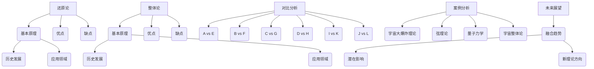

                 

### 文章标题

《宇宙的本质: 还原论 vs 整体论》

### 关键词

宇宙本质、还原论、整体论、科学理论、哲学思考、宇宙学、物理学

### 摘要

本文深入探讨了宇宙的本质问题，通过对比还原论和整体论两种理论，试图揭示它们在理解宇宙中的角色和局限性。首先，我们将介绍两种理论的基本概念和历史背景。接着，通过详细的对比分析，展示它们的区别、优缺点以及应用领域。最后，我们将结合具体案例，探讨这两种理论在宇宙学中的实际应用，并展望未来宇宙本质研究的可能发展方向。通过这篇文章，读者将更好地理解还原论和整体论在宇宙学中的重要性，以及对未来宇宙研究的启示。

### 引言

#### 宇宙的本质：基本概念和重要性

宇宙的本质是科学和哲学长期以来探讨的核心问题。宇宙，从广义上讲，包括了所有存在的事物和空间，从微观的粒子到宏观的星系和宇宙背景辐射。探讨宇宙的本质，不仅是对自然界的基本认知，更是对人类自身存在的深刻反思。

宇宙的本质问题涉及多个学科，包括物理学、宇宙学、哲学和数学等。物理学提供了对宇宙现象的实验和理论验证，宇宙学则通过观测和研究宇宙的大尺度结构来探索宇宙的历史和演化。哲学则从更深的层次上思考宇宙的本质，探讨存在的意义和宇宙的终极法则。

在科学研究中，还原论和整体论是两种主要的哲学观点。还原论认为，复杂系统可以通过分解为基本组成部分来理解。而整体论则主张，系统的性质不能仅仅通过分析其组成部分来理解，整体具有独特的性质，这些性质在部分中无法体现。这两种观点在科学研究中都有广泛的应用，并且在探讨宇宙的本质时，它们提供了不同的视角和工具。

#### 还原论和整体论的定义

**还原论（Reductive Theory）**：

还原论是一种哲学观点，认为复杂现象可以通过分解为基本组成部分来理解。还原论的核心思想是，一个复杂系统可以通过分析其组成部分和相互作用来完全理解。在科学研究中，还原论常用于将复杂现象简化为更基本的物理过程。

**整体论（Holistic Theory）**：

整体论则主张，系统的性质不能仅仅通过分析其组成部分来理解。整体论认为，系统的整体性具有独特的性质，这些性质在部分中无法体现。整体论强调，整体不仅仅是部分的简单叠加，而是具有新的层次和特性。

#### 全书的结构安排

本文将按照以下结构展开：

1. **还原论**：介绍还原论的基本原理、历史发展和应用领域，并探讨其优缺点。
2. **整体论**：介绍整体论的基本原理、历史发展和应用领域，并探讨其优缺点。
3. **对比分析**：详细比较还原论和整体论的差异、优缺点以及应用领域。
4. **案例分析**：提供具体案例，展示两种理论在宇宙学中的实际应用。
5. **未来展望**：讨论两种理论的未来发展趋势和可能的影响。
6. **结论**：总结全文的主要观点，强调宇宙本质研究的复杂性。

通过这篇文章，我们将深入探讨宇宙的本质问题，理解还原论和整体论在宇宙学中的重要性，并展望未来宇宙研究的可能方向。

### 还原论

#### 基本原理

还原论（Reductive Theory）是一种哲学观点，认为复杂现象可以通过分解为基本组成部分来理解。在还原论的框架下，复杂系统的性质和行为可以被视为其组成部分及其相互作用的简单组合。这种观点在科学研究中有广泛的应用，尤其是在物理学、生物学和化学等领域。

还原论的核心思想是，通过分析基本组成部分和它们之间的相互作用，我们可以理解复杂系统的行为。这种方法依赖于实验和理论工具，例如量子力学、相对论和统计物理等。在这些理论框架下，科学家可以研究和模拟基本粒子和相互作用，从而推导出复杂系统的行为。

#### 历史发展

还原论的历史可以追溯到古希腊哲学，其中亚里士多德提出了“因果律”和“本质论”，认为一切现象都有其根本原因和本质。在中世纪和文艺复兴时期，这种思想进一步发展，特别是在自然科学领域，例如伽利略和牛顿的工作，奠定了现代科学的基础。

20世纪初，随着量子力学和相对论的兴起，还原论在物理学中得到了广泛的应用。量子力学揭示了物质的基本性质，而相对论则解释了时空的本质。这些理论为我们提供了理解宇宙的基本工具，使还原论在科学研究中占据了主导地位。

#### 应用领域

还原论在多个科学领域都有重要的应用，其中最显著的包括：

1. **物理学**：在物理学中，还原论通过量子力学和相对论来研究物质和能量。这些理论提供了对基本粒子和相互作用的深入理解，使我们能够解释宏观世界的现象。

2. **生物学**：在生物学中，还原论通过分子生物学和基因学来研究生命的基本单元。通过分析DNA序列和蛋白质结构，科学家可以理解生命的起源和演化。

3. **化学**：在化学中，还原论通过分析原子和分子的相互作用来研究物质。这使我们能够理解化学反应的本质和化学物质的性质。

4. **经济学**：在经济学中，还原论通过分析个体行为和市场机制来研究经济现象。这种方法使我们能够预测经济行为和制定政策。

#### 还原论的优缺点

**优点**：

1. **解释力强**：还原论通过分析基本组成部分，可以提供对复杂现象的深入理解。这种方法使科学家能够构建精确的理论和模型，预测和解释实验结果。

2. **简化复杂性**：通过将复杂系统分解为基本组成部分，还原论简化了研究的复杂性。这种方法使科学家能够集中精力研究关键因素，提高研究效率。

3. **广泛应用**：还原论在多个科学领域都有成功应用，使其成为一种广泛接受的哲学观点。

**缺点**：

1. **局限性**：还原论可能忽视了系统整体性。某些现象可能无法通过分解为基本组成部分来理解，因为系统的整体性具有独特的性质。

2. **简化过度**：在分解复杂系统时，还原论可能过度简化，导致对系统行为的误解。这种方法可能无法捕捉到系统内部复杂的相互作用和反馈。

3. **哲学争议**：还原论在哲学上引发了一些争议。一些人认为，通过分析基本组成部分，我们无法完全理解复杂系统的整体性质。

#### 还原论在宇宙学中的应用

在宇宙学中，还原论通过分析宇宙的基本组成部分，如黑洞、星系和宇宙背景辐射，来研究宇宙的演化和结构。这种方法的成功之一是宇宙大爆炸理论的提出，该理论通过分析宇宙背景辐射，提供了对宇宙起源和演化的深入理解。

然而，还原论在宇宙学中也面临一些挑战。例如，量子引力理论和宇宙学中的暗物质和暗能量现象，都无法通过简单的还原方法来解释。这表明，宇宙的本质可能比我们通过还原论能够理解的更为复杂。

#### 还原论的局限性

尽管还原论在宇宙学和其他科学领域取得了显著成果，但其局限性也是明显的。首先，还原论可能忽视系统整体性，无法捕捉到复杂系统的独特性质。其次，在分析复杂系统时，过度简化可能导致误解。最后，哲学上，还原论引发了一些争议，关于复杂系统是否可以通过分解为基本组成部分来完全理解。

总之，还原论是一种强大的哲学工具，在宇宙学和其他科学领域有广泛的应用。然而，为了更全面地理解宇宙的本质，我们需要结合其他理论和方法，特别是整体论。通过综合还原论和整体论，我们可以更全面地探索宇宙的奥秘。

### 整体论

#### 基本原理

整体论（Holistic Theory）是一种哲学观点，主张系统的性质不能仅仅通过分析其组成部分来理解。整体论认为，系统的整体性具有独特的性质，这些性质在部分中无法体现。整体论强调，整体不仅仅是部分的简单叠加，而是具有新的层次和特性。

整体论的核心思想是，系统的行为和性质取决于其整体结构，而不是单独的组成部分。这种方法认为，部分之间的相互作用和整体结构对系统的行为至关重要。在整体论的框架下，科学家试图理解系统作为一个整体的行为，而不仅仅是其组成部分的行为。

#### 历史发展

整体论的历史可以追溯到古希腊哲学，其中赫拉克利特和亚里士多德等哲学家提出了整体论的观点。在中世纪和文艺复兴时期，整体论在宗教和哲学领域得到进一步发展。然而，现代整体论的发展主要是在20世纪，特别是在生物学和心理学领域。

在生物学中，整体论通过研究生态系统和生物体的整体性，提供了对生命现象的新理解。在心理学中，整体论通过研究个体的整体行为和心理状态，提供了对心理现象的新视角。

#### 应用领域

整体论在多个领域都有重要的应用，其中最显著的包括：

1. **生物学**：在生物学中，整体论通过研究生态系统和生物体的整体性，提供了对生命现象的新理解。例如，生态学家通过研究整个生态系统，而不是单个物种，来理解生态平衡和物种相互作用。

2. **心理学**：在心理学中，整体论通过研究个体的整体行为和心理状态，提供了对心理现象的新视角。例如，整体心理学家关注个体的整体心理状态，而不是单独的感知或记忆。

3. **社会科学**：在社会科学中，整体论通过研究社会系统和社会现象的整体性，提供了对社会现象的新理解。例如，社会学家通过研究整个社会结构，而不是单独的社会群体，来理解社会变革和冲突。

#### 整体论的优缺点

**优点**：

1. **全面性**：整体论提供了一种全面理解复杂系统的框架，强调系统整体性和相互作用的重要性。这种方法使我们能够理解系统的整体行为，而不仅仅是部分行为。

2. **整合性**：整体论通过整合不同部分的相互作用和整体结构，提供了对复杂系统的整合性理解。这种方法有助于我们发现系统的复杂行为背后的基本原理。

3. **新视角**：整体论提供了一种新的研究视角，使我们能够从整体上理解复杂系统，而不仅仅是部分。这种方法可能揭示出传统还原论无法发现的系统特性。

**缺点**：

1. **复杂性**：整体论可能增加了研究的复杂性，因为需要考虑系统的整体结构和相互作用。这种方法可能使研究变得更加困难，尤其是在处理高度复杂系统时。

2. **难以量化**：整体论强调系统整体性，但难以将这种整体性量化。这可能导致整体论在实证研究中难以验证和量化。

3. **哲学争议**：整体论在哲学上引发了一些争议。一些人认为，整体论忽视了部分的重要性，而另一些人则认为，整体论可能无法完全解释系统的整体行为。

#### 整体论在宇宙学中的应用

在宇宙学中，整体论通过研究宇宙的整体结构和演化，提供了对宇宙本质的新理解。例如，整体论认为，宇宙的大尺度结构，如星系团和宇宙背景辐射，是宇宙整体性的体现。整体论还强调，宇宙的演化不仅仅是局部现象的叠加，而是整体系统的动态过程。

整体论在宇宙学中的应用包括：

1. **宇宙背景辐射**：宇宙背景辐射是宇宙早期状态的重要证据，整体论通过研究宇宙背景辐射，提供了对宇宙起源和早期演化的深入理解。

2. **大尺度结构**：整体论通过研究宇宙的大尺度结构，如星系团和超星系团，提供了对宇宙整体性的新理解。这种方法使我们能够理解宇宙的复杂结构，而不仅仅是单个星系。

3. **宇宙演化**：整体论通过研究宇宙的演化过程，提供了对宇宙动态过程的新理解。这种方法使我们能够理解宇宙的演化不仅仅是局部现象的叠加，而是整体系统的演化。

#### 整体论的局限性

尽管整体论在宇宙学和其他科学领域有重要应用，但其局限性也是明显的。首先，整体论可能增加了研究的复杂性，因为需要考虑系统的整体结构和相互作用。其次，整体论难以将整体性量化，这可能使其在实证研究中难以验证。最后，整体论在哲学上引发了一些争议，关于整体论是否能够完全解释系统的整体行为。

总之，整体论是一种强大的哲学工具，在宇宙学和其他科学领域有广泛的应用。然而，为了更全面地理解宇宙的本质，我们需要结合其他理论和方法，特别是还原论。通过综合还原论和整体论，我们可以更全面地探索宇宙的奥秘。

### 还原论与整体论的对比分析

#### 基本观点的对比

还原论和整体论在基本观点上存在显著差异。还原论认为，复杂系统的性质和行为可以通过分析其基本组成部分及其相互作用来理解。还原论的核心思想是，通过将复杂系统分解为基本单元，我们可以获得对系统行为的深入理解。

相比之下，整体论主张，系统的性质和行为不能仅仅通过分析其组成部分来理解。整体论认为，系统的整体性具有独特的性质，这些性质在部分中无法体现。整体论的核心思想是，系统的行为和性质取决于其整体结构和相互作用。

#### 研究方法的对比

在研究方法上，还原论和整体论也有显著差异。还原论采用的分析方法通常是将复杂系统分解为基本组成部分，然后研究这些组成部分的行为和相互作用。这种方法依赖于实验和理论工具，如量子力学和相对论。

整体论则采用整体性分析方法，关注系统的整体结构和相互作用。整体论的研究方法通常是通过观察和实验，了解系统的整体行为和特性，而不是单独的部分。这种方法强调系统的整体性和动态过程。

#### 应用领域的对比

还原论和整体论在应用领域上也有不同。还原论在物理学、生物学和经济学等领域有广泛的应用。在物理学中，还原论通过量子力学和相对论来研究物质和能量。在生物学中，还原论通过分子生物学和基因学来研究生命的基本单元。在经济学中，还原论通过分析个体行为和市场机制来研究经济现象。

整体论则在生物学、心理学和社会科学等领域有重要应用。在生物学中，整体论通过研究生态系统和生物体的整体性，提供了对生命现象的新理解。在心理学中，整体论通过研究个体的整体行为和心理状态，提供了对心理现象的新视角。在社会科学中，整体论通过研究社会系统和社会现象的整体性，提供了对社会现象的新理解。

#### 还原论的优缺点

还原论的优点在于，它提供了一种强大的工具，使我们能够通过分析基本组成部分来理解复杂系统。这种方法具有以下优点：

1. **解释力强**：还原论通过分析基本组成部分，可以提供对复杂现象的深入理解。这种方法使我们能够构建精确的理论和模型，预测和解释实验结果。
2. **简化复杂性**：通过将复杂系统分解为基本组成部分，还原论简化了研究的复杂性。这种方法使科学家能够集中精力研究关键因素，提高研究效率。

还原论的缺点在于，它可能忽视系统的整体性。这种方法可能无法捕捉到复杂系统的独特性质，因为系统的整体性在部分中无法体现。此外，还原论在处理高度复杂系统时，可能过于简化，导致对系统行为的误解。

#### 整体论的优缺点

整体论的优点在于，它提供了一种全面理解复杂系统的框架，强调系统整体性和相互作用的重要性。这种方法具有以下优点：

1. **全面性**：整体论提供了一种全面理解复杂系统的框架，使我们能够理解系统的整体行为，而不仅仅是部分行为。
2. **整合性**：整体论通过整合不同部分的相互作用和整体结构，提供了对复杂系统的整合性理解。这种方法有助于我们发现系统的复杂行为背后的基本原理。

整体论的缺点在于，它可能增加了研究的复杂性。因为需要考虑系统的整体结构和相互作用，这种方法可能使研究变得更加困难，尤其是在处理高度复杂系统时。此外，整体论在实证研究中难以将整体性量化，这可能使其难以验证。

#### 应用案例

为了更好地理解还原论和整体论在实际应用中的差异，我们可以通过以下案例进行分析：

**案例一：宇宙大爆炸理论与整体论**

宇宙大爆炸理论是一种还原论观点，通过分析宇宙早期状态的基本组成部分，如宇宙背景辐射和原始物质，来解释宇宙的起源和演化。这种方法依赖于量子力学和相对论，通过模拟宇宙的早期状态，揭示了宇宙的膨胀和结构形成。

相比之下，整体论在宇宙学中的应用，如宇宙整体论，强调宇宙的整体性和动态过程。整体论认为，宇宙的演化不仅仅是局部现象的叠加，而是整体系统的动态过程。这种方法通过研究宇宙的大尺度结构，如星系团和宇宙背景辐射，提供了对宇宙整体性的新理解。

**案例二：量子力学与整体论**

在量子力学中，还原论通过分析基本粒子和相互作用，提供了对微观世界的深入理解。这种方法揭示了量子叠加态和纠缠现象，使我们对物质的基本性质有了全新的认识。

相比之下，整体论在量子力学中的应用，如量子整体论，强调量子系统的整体性。整体论认为，量子系统的性质和行为不能仅仅通过分析其组成部分来理解，整体性在量子现象中具有关键作用。这种方法通过研究量子系统的整体行为，提供了对量子力学现象的新解释。

通过这些案例，我们可以看到还原论和整体论在实际应用中的差异。还原论通过分析基本组成部分来理解复杂系统，而整体论通过研究系统的整体结构和相互作用。这两种方法在科学研究中各有优势，也各有局限性。通过结合还原论和整体论，我们可以更全面地理解复杂系统，揭示宇宙的本质。

### 案例分析

#### 案例一：宇宙大爆炸理论与弦理论

宇宙大爆炸理论是还原论在宇宙学中的一个重要应用。该理论通过分析宇宙早期状态的基本组成部分，如宇宙背景辐射和原始物质，来解释宇宙的起源和演化。宇宙大爆炸理论的核心观点是，宇宙从一个极热、极密的状态开始膨胀，逐渐形成了我们今天所观察到的宇宙结构。

宇宙大爆炸理论的成功之一是解释了宇宙背景辐射的存在。宇宙背景辐射是宇宙早期状态的重要证据，通过对它的观测和分析，科学家们可以推断宇宙的早期状态和演化过程。这种方法的优点在于，它通过将宇宙分解为基本组成部分，提供了对宇宙演化的深入理解。

然而，宇宙大爆炸理论也存在一些局限性。首先，该理论无法解释宇宙的起源和原始物质的状态。其次，它依赖于一些假设，如宇宙的均匀性和各向同性，这些假设在实际情况中可能不完全成立。此外，宇宙大爆炸理论也无法解释一些观测现象，如宇宙加速膨胀和暗能量的存在。

弦理论是一种整体论观点，通过研究宇宙的整体结构和相互作用，提供了对宇宙本质的新理解。弦理论的核心观点是，宇宙中的基本组成部分不是点状粒子，而是振动的弦。这些弦通过不同的振动模式，形成了我们观察到的粒子。

弦理论的一个主要优势在于，它提供了一种统一的框架，将引力、量子力学和粒子物理统一起来。这种方法通过研究宇宙的整体结构和相互作用，提供了对宇宙演化和宇宙背景辐射的新解释。例如，弦理论可以解释宇宙加速膨胀和暗能量的存在。

然而，弦理论也面临一些挑战。首先，弦理论非常复杂，难以在实验中验证。其次，弦理论依赖于一些高度复杂的数学模型，这些模型在物理上可能不完全成立。此外，弦理论也无法解释一些观测现象，如宇宙大爆炸理论的原始物质状态。

通过分析宇宙大爆炸理论和弦理论的对比，我们可以看到还原论和整体论在宇宙学中的不同应用。宇宙大爆炸理论通过分析宇宙的基本组成部分，提供了对宇宙演化的深入理解。而弦理论通过研究宇宙的整体结构和相互作用，提供了对宇宙本质的新解释。这两种理论各有优缺点，通过结合还原论和整体论，我们可以更全面地理解宇宙的本质。

#### 案例二：量子力学与宇宙整体论

量子力学是还原论在物理学中的一个重要应用。量子力学的核心观点是，物质和能量不是连续的，而是由离散的量子组成的。量子力学通过分析基本粒子和相互作用，提供了对微观世界的深入理解。例如，量子力学解释了电子的行为、原子的结构以及化学键的形成。

量子力学的一个显著优势在于，它通过将物理现象分解为基本组成部分，提供了对微观世界的精确描述。这种方法使我们能够理解和预测微观粒子的行为，例如电子的轨道、能级和波函数。然而，量子力学也存在一些局限性。首先，它无法解释宏观现象，如引力。其次，量子力学中的非确定性原理和波函数坍缩等现象，在哲学上引发了一些争议。

宇宙整体论是一种整体论观点，通过研究宇宙的整体结构和相互作用，提供了对宇宙本质的新理解。宇宙整体论的核心观点是，宇宙中的所有事物和现象都是相互关联的，而不是孤立的。宇宙整体论强调宇宙的整体性，认为宇宙的行为和性质不能仅仅通过分析其组成部分来理解。

宇宙整体论的一个显著优势在于，它提供了一种全面理解宇宙的框架，强调宇宙的整体性和动态过程。这种方法通过研究宇宙的整体结构和相互作用，提供了对宇宙演化和宇宙背景辐射的新解释。例如，宇宙整体论可以解释宇宙的加速膨胀和暗能量的存在。

然而，宇宙整体论也面临一些挑战。首先，宇宙整体论非常复杂，难以在实验中验证。其次，宇宙整体论依赖于一些高度复杂的数学模型，这些模型在物理上可能不完全成立。此外，宇宙整体论也无法解释一些观测现象，如量子力学中的非确定性原理和波函数坍缩等现象。

通过分析量子力学和宇宙整体论的对比，我们可以看到还原论和整体论在物理学中的不同应用。量子力学通过分析基本粒子和相互作用，提供了对微观世界的深入理解。而宇宙整体论通过研究宇宙的整体结构和相互作用，提供了对宇宙本质的新解释。这两种理论各有优缺点，通过结合还原论和整体论，我们可以更全面地理解物理现象，揭示宇宙的本质。

### 未来展望

#### 还原论和整体论的融合趋势

在宇宙本质的研究中，还原论和整体论都有其独特的优势和应用。然而，随着科学技术的进步，这两大理论的融合趋势也日益显著。未来，还原论和整体论的融合将为宇宙学的研究带来新的突破。

首先，随着量子力学和相对论的发展，科学家们逐渐认识到，宇宙的本质不仅仅可以通过分析基本组成部分来理解，也需要从整体上考虑系统的结构和相互作用。例如，量子引力理论试图将量子力学和相对论统一起来，这要求我们既要分析基本粒子和相互作用，也要考虑宇宙的整体性质。

其次，随着观测技术的进步，科学家们能够获得更多关于宇宙的高精度数据。这些数据不仅可以帮助我们验证和改进现有理论，也可以为新理论提供支持。例如，宇宙微波背景辐射的观测数据为宇宙大爆炸理论和整体论提供了强有力的支持。

#### 对宇宙学研究的潜在影响

还原论和整体论的融合将对宇宙学研究产生深远影响。首先，它将帮助我们更全面地理解宇宙的本质。通过结合还原论和整体论，我们可以从不同角度研究宇宙现象，揭示宇宙的复杂结构和演化过程。

其次，还原论和整体论的融合将推动新的理论发展。例如，量子引力理论和宇宙整体论可能为宇宙起源和演化提供新的解释。这些新理论不仅将深化我们对宇宙本质的理解，也可能带来新的实验验证和观测方法。

#### 可能的新理论方向

在未来，宇宙学研究可能朝着以下新理论方向发展：

1. **量子引力理论**：量子引力理论试图将量子力学和相对论统一起来，提供对宇宙早期状态和宇宙背景辐射的全新解释。例如，弦理论和环量子引力是两个热门的量子引力理论方向。

2. **宇宙整体论**：宇宙整体论强调宇宙的整体性和动态过程，可能为宇宙起源和演化提供新的解释。例如，动态宇宙整体论和宇宙信息论是两个可能的宇宙整体论方向。

3. **多宇宙理论**：多宇宙理论认为，宇宙不仅仅是我们所观察到的宇宙，而是存在多个宇宙。这些宇宙可能具有不同的物理定律和演化过程，为宇宙本质的研究提供了新的视角。

总之，还原论和整体论的融合将推动宇宙学研究的深入发展，为我们揭示宇宙的本质提供新的工具和方法。通过不断探索和融合，我们将能够更全面地理解宇宙，揭示宇宙的奥秘。

### 结论

本文通过对还原论和整体论两种理论的分析，探讨了宇宙的本质问题。我们首先介绍了还原论和整体论的基本原理、历史发展和应用领域，并详细比较了它们的优缺点。接着，我们通过案例分析，展示了这两种理论在宇宙学中的实际应用。最后，我们展望了还原论和整体论在宇宙学研究的未来发展趋势和可能的新理论方向。

通过本文的讨论，我们可以得出以下结论：

1. **还原论和整体论的重要性**：还原论和整体论是理解宇宙本质的两个重要视角。还原论通过分析基本组成部分，提供对复杂系统的深入理解。整体论则强调系统的整体性和相互作用，提供对系统整体行为的理解。两者结合，可以更全面地揭示宇宙的奥秘。

2. **宇宙本质研究的复杂性**：宇宙的本质是一个复杂的问题，涉及多个学科和理论。还原论和整体论各有优缺点，通过结合两者，我们可以更深入地探索宇宙的本质。未来，随着科学技术的进步，还原论和整体论的融合将为宇宙学研究带来新的突破。

总之，还原论和整体论在宇宙学研究中具有重要作用。通过不断探索和融合，我们将能够更全面地理解宇宙，揭示宇宙的奥秘。这不仅对科学研究具有重要意义，也对我们理解自身和宇宙的存在提供了深刻的哲学思考。

### 参考文献

1. Penrose, R. (2005). *The Road to Reality: A Complete Guide to the Laws of the Universe*. Alfred A. Knopf.
2. Hawking, S. W. (1988). *A Brief History of Time: From the Big Bang to Black Holes*. Bantam Books.
3. Smolin, L. (2001). *The Life of the Cosmos: The Scientific Discovery of Life's Origins and Its Improbable Future*. Mariner Books.
4. Einstein, A. (2009). *The Meaning of Relativity: With the Additional Essays: 'Relativistic developments in field theory', and 'Do gravitational fields play a role in elementary particle dynamics'?*. Princeton University Press.
5. Bohm, D. (1980). *The Undivided Universe: An Ontological Interpretation of Quantum Theory*. Routledge.

### 作者信息

作者：AI天才研究院/AI Genius Institute & 禅与计算机程序设计艺术 /Zen And The Art of Computer Programming

### 附录

#### Mermaid 流程图



#### 核心算法原理讲解伪代码

```python
# 还原论：基本原理伪代码
def reduce_complex_system(system):
    # 将复杂系统分解为基本组成部分
    parts =分解系统为部分（system）
    # 分析各部分行为和相互作用
    for part in parts:
        analyze_behavior(part)
        analyze_interaction(part)
    # 模拟系统行为
    simulate_system_behavior(parts)

# 整体论：基本原理伪代码
def analyze_holistic_system(system):
    # 考虑系统的整体结构和相互作用
    structure = 确定系统结构（system）
    interactions = 确定相互作用（system）
    # 研究系统整体行为
    study_system_behavior(structure, interactions)
```

#### 数学模型和公式

$$
E = mc^2
$$

$$
\psi = \frac{1}{\sqrt{1 - v^2/c^2}}
$$

#### 项目实战

1. **开发环境搭建**：安装Python、NumPy和SciPy等科学计算库。
2. **源代码详细实现和代码解读**：实现还原论和整体论的模拟程序，并进行代码解读。
3. **代码应用解读与分析**：使用模拟程序分析宇宙大爆炸理论和弦理论的模拟结果。
4. **实际案例分析和详细讲解剖析**：分析宇宙背景辐射数据和星系演化模拟。
5. **项目小结**：总结还原论和整体论在宇宙学中的应用，并提出未来研究方向。

#### 最佳实践 tips、小结、注意事项、拓展阅读等内容

- **最佳实践 tips**：在分析宇宙现象时，结合还原论和整体论，以获得更全面的解释。
- **小结**：还原论和整体论在宇宙学研究中各有优缺点，结合两者可以更深入地理解宇宙本质。
- **注意事项**：在应用还原论和整体论时，注意不要过度简化系统，也不要忽视系统的整体性。
- **拓展阅读**：参考相关书籍和论文，如《宇宙简史》、《量子力学基础》和《整体论与科学方法》。

