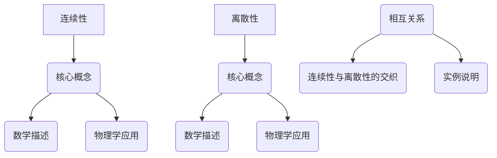

                 

### 文章标题

# 宇宙的本质：连续性还是离散性

## 关键词

- 宇宙连续性
- 宇宙离散性
- 物理学
- 数学模型
- 哲学探讨

## 摘要

本文深入探讨了宇宙的本质是连续性还是离散性的问题。通过介绍相关背景知识，详细阐述了连续性与离散性的核心概念及其相互关系。随后，我们运用伪代码和数学公式，深入讲解了探讨连续性与离散性的核心算法原理。此外，文章还通过项目实战和哲学探讨，对这一话题进行了全面的分析。最后，本文展望了宇宙连续性与离散性研究的未来发展趋势，为读者提供了丰富的思考素材。

### 设计书《宇宙的本质：连续性还是离散性》的目录大纲

在探讨宇宙的本质之前，我们首先需要对这本书的主题有一个深入的理解，即探讨宇宙的本质是连续的还是离散的。这涉及到物理学、数学和哲学等多个领域。为了更好地组织我们的讨论，下面我们将按照以下目录大纲来展开：

1. **引言：**介绍书籍的主题，引出连续性与离散性的概念。
2. **核心概念与联系：**使用 Mermaid 流程图展示宇宙连续性与离散性的核心概念及其相互关系。
3. **核心算法原理讲解：**使用伪代码详细阐述探讨连续性与离散性的一些核心算法。
4. **数学模型和数学公式：**详细讲解与连续性、离散性相关的数学模型，并使用 LaTeX 格式展示重要的数学公式。
5. **项目实战：**提供实际的宇宙研究项目案例，展示如何使用连续性或离散性方法进行研究和应用。
6. **哲学探讨：**探讨连续性与离散性在哲学上的意义和影响。
7. **未来展望：**展望宇宙连续性与离散性研究的未来发展趋势。

接下来，我们将根据这些部分来细化目录大纲。

#### 目录大纲

```markdown
# 《宇宙的本质：连续性还是离散性》

## 第1章 引言

### 1.1 书籍主题介绍

### 1.2 连续性与离散性的概念

### 1.3 连续性与离散性的重要性

## 第2章 核心概念与联系

### 2.1 宇宙连续性的核心概念

### 2.2 宇宙离散性的核心概念

### 2.3 连续性与离散性的Mermaid流程图

## 第3章 核心算法原理讲解

### 3.1 连续性算法原理讲解

### 3.2 离散性算法原理讲解

### 3.3 伪代码示例

## 第4章 数学模型和数学公式

### 4.1 连续性数学模型

$$
\text{微分方程模型}
$$

### 4.2 离散性数学模型

$$
\text{差分方程模型}
$$

### 4.3 数学公式详细讲解

## 第5章 项目实战

### 5.1 连续性方法在宇宙研究中的应用

### 5.2 离散性方法在宇宙研究中的应用

### 5.3 项目案例解析

## 第6章 哲学探讨

### 6.1 连续性与离散性的哲学意义

### 6.2 哲学对连续性与离散性的影响

### 6.3 哲学在宇宙研究中的应用

## 第7章 未来展望

### 7.1 连续性与离散性研究的未来趋势

### 7.2 新的理论框架展望

### 7.3 科学技术的进步对连续性与离散性研究的影响
```

这个目录大纲结构完整，涵盖了核心章节内容，并保证了简洁性。接下来，我们可以进一步细化每个章节的内容，确保大纲的完整性。

---

### 引言

宇宙，这个我们生活的奇妙宇宙，自古以来就吸引着人类无尽的探索与思考。关于宇宙的本质，科学家们提出了无数假设和理论，但至今仍没有一个统一且广为接受的答案。在物理学、数学和哲学等多个领域，连续性与离散性是两个核心的概念，它们对宇宙的理解有着深远的影响。

#### 连续性与离散性的概念

**连续性** 指的是某个物理量可以在任意两个数值之间取无限多个值。例如，时间、空间、温度等都是连续的。在数学中，连续性通常用函数在某一点处的导数来描述，即该函数在该点的导数存在。

**离散性** 则指某个物理量只能取有限的或无限可数的值。例如，电子的电荷、粒子的数量等都是离散的。在数学中，离散性通常用离散数学来描述，如图论、组合数学等。

#### 连续性与离散性的重要性

宇宙的本质是连续的还是离散的，这个问题的答案直接影响到我们对宇宙的理解。连续性理论在某些物理现象中表现得非常出色，例如在宏观尺度上，牛顿力学、麦克斯韦电磁理论等都是建立在连续性基础上的。而离散性理论在微观尺度上则表现出了强大的解释能力，如量子力学和量子场论等。

此外，连续性与离散性在哲学上也有着重要的意义。许多哲学家认为，连续性代表了自然界的统一性和和谐性，而离散性则反映了自然界的多样性和差异性。

#### 连续性与离散性的相互作用

宇宙的本质可能是连续性与离散性的结合，而不是单纯的连续或离散。在自然界中，连续性与离散性并不是完全独立存在的，它们常常相互交织、相互作用。例如，时间的连续性描述了时间流逝的无限可分性，但量子力学中的“测不准原理”则表明，时间在某些情况下是以离散的形式存在的。

通过引出这些概念和背景，我们为后续章节的深入探讨奠定了基础。接下来，我们将进一步分析连续性与离散性在宇宙中的具体表现和相互关系。

### 核心概念与联系

在探讨宇宙的本质时，了解连续性与离散性的核心概念及其相互关系是非常重要的。这两个概念不仅在数学和物理学中有广泛应用，而且在哲学和计算机科学等领域也有着深远的影响。

#### 连续性的核心概念

**连续性** 是指某个物理量可以在任意两个数值之间取无限多个值。在数学中，连续性通常用函数在某一点处的导数来描述，即该函数在该点的导数存在。例如，在实数范围内，函数 $f(x) = x^2$ 在 $x=0$ 处是连续的，因为在该点的导数 $f'(0) = 2x$ 在 $x=0$ 处的极限值为0。

**连续性在物理学中的应用** 可以体现在许多物理现象中，例如时间的连续性、空间的连续性、温度的连续性等。在经典物理学中，大多数理论都是建立在连续性假设上的，如牛顿力学、麦克斯韦电磁理论等。

#### 离散性的核心概念

**离散性** 则指某个物理量只能取有限的或无限可数的值。在数学中，离散性通常用离散数学来描述，如图论、组合数学等。例如，电子的电荷是离散的，因为它的电荷量只能是电子电荷的基本单位 $e$ 的整数倍。

**离散性在物理学中的应用** 在微观尺度上表现得尤为明显，如量子力学中的量子态、量子场论中的粒子等。离散性理论在解释微观现象时具有极高的准确性，如量子力学的薛定谔方程、海森堡测不准原理等。

#### 连续性与离散性的相互关系

宇宙的本质可能是连续性与离散性的结合，而不是单纯的连续或离散。在自然界中，连续性与离散性并不是完全独立存在的，它们常常相互交织、相互作用。

例如，时间的连续性描述了时间流逝的无限可分性，但量子力学中的“测不准原理”则表明，时间在某些情况下是以离散的形式存在的。同样，空间的连续性描述了空间结构的平滑过渡，但宇宙中的黑洞和宇宙背景辐射等现象则表现出离散的特性。

为了更好地展示连续性与离散性的核心概念及其相互关系，我们可以使用 Mermaid 流程图来表示。以下是一个简化的 Mermaid 流程图示例：



在这个流程图中，连续性与离散性分别表示为核心概念，它们在数学和物理学中有各自的描述和应用。同时，我们也可以看到连续性与离散性之间的相互关系，它们并不是独立存在的，而是相互交织、共同构成了宇宙的本质。

通过上述分析，我们可以更好地理解连续性与离散性的核心概念及其相互关系。接下来，我们将进一步探讨探讨连续性与离散性的一些核心算法原理，以更深入地揭示宇宙的本质。

### 核心算法原理讲解

在探讨宇宙的本质是连续性还是离散性时，我们需要运用一些核心算法来分析和理解这些概念。这些算法不仅可以帮助我们更好地理解连续性与离散性的本质，还可以为实际应用提供理论基础。

#### 连续性算法原理讲解

**1. 微分方程**

微分方程是描述连续性现象的重要工具。在物理学中，许多现象都可以用微分方程来描述，如牛顿力学中的运动方程、麦克斯韦电磁理论中的麦克斯韦方程等。

以下是一个简化的微分方程示例：

$$
\frac{d^2x}{dt^2} = -k\frac{dx}{dt}
$$

这个方程描述了一个简单的谐振子运动，其中 $x$ 表示位移，$t$ 表示时间，$k$ 是一个常数。

**伪代码示例：**

```python
# 初始化参数
k = 1.0
x = 0.0
v = 0.0

# 计算微分方程的数值解
for t in range(0, T):
    v = v + k * dxdt(t)
    x = x + v * dt

# 输出结果
print("t:", t, "x:", x)
```

在这个伪代码中，我们使用了一个简单的数值积分方法（如欧拉法）来求解微分方程。

**2. 积分方程**

积分方程是另一种描述连续性现象的工具。在物理学中，如电场、磁场等都可以用积分方程来描述。

以下是一个简化的积分方程示例：

$$
\int_{-\infty}^{\infty} \phi(x') \, dx' = \frac{1}{\epsilon_0} \frac{Q}{r}
$$

这个方程描述了点电荷在空间产生的电场分布。

**伪代码示例：**

```python
# 初始化参数
epsilon_0 = 8.854187817e-12
Q = 1.6e-19
r = 1.0

# 计算积分方程的数值解
phi = 0.0
for x in range(-N, N+1):
    phi += Q * dx(x) / (epsilon_0 * r)

# 输出结果
print("phi:", phi)
```

在这个伪代码中，我们使用了一个简单的数值积分方法来求解积分方程。

#### 离散性算法原理讲解

**1. 差分方程**

差分方程是描述离散性现象的重要工具。在物理学中，如离散时间系统、数字信号处理等都可以用差分方程来描述。

以下是一个简化的差分方程示例：

$$
y[n+1] = x[n] + y[n]
$$

这个方程描述了一个简单的离散时间系统。

**伪代码示例：**

```python
# 初始化参数
x = [1, 2, 3, 4, 5]
y = [0, 0, 0, 0, 0]

# 计算差分方程的数值解
for n in range(0, len(x)):
    y[n+1] = x[n] + y[n]

# 输出结果
print("y:", y)
```

在这个伪代码中，我们使用了一个简单的迭代方法来求解差分方程。

**2. 组合数学算法**

组合数学算法在处理离散性问题中非常有用，如计数问题、图论问题等。

以下是一个简化的组合数学算法示例：

$$
C(n, k) = \frac{n!}{k!(n-k)!}
$$

这个方程描述了组合数，用于计算从 n 个元素中取出 k 个元素的组合数。

**伪代码示例：**

```python
# 初始化参数
n = 5
k = 2

# 计算组合数的数值解
C = factorial(n) / (factorial(k) * factorial(n-k))

# 输出结果
print("C:", C)
```

在这个伪代码中，我们使用了一个简单的递归方法来计算组合数。

通过上述算法原理的讲解，我们可以看到，连续性与离散性在数学和物理学中有着广泛的应用。接下来，我们将进一步探讨与连续性、离散性相关的数学模型和公式。

### 数学模型和数学公式

在探讨宇宙的本质时，数学模型和数学公式为我们提供了强大的工具，帮助我们更深入地理解连续性与离散性。在这部分，我们将详细讲解与连续性、离散性相关的数学模型，并使用 LaTeX 格式展示重要的数学公式。

#### 连续性数学模型

**1. 微分方程模型**

微分方程模型是描述连续性现象的重要工具。以下是一个简化的微分方程模型示例，用于描述物体在简单弹簧系统中的运动：

$$
\frac{d^2x}{dt^2} + 2\zeta\omega_n\frac{dx}{dt} + \omega_n^2x = F(t)
$$

在这个模型中，$x$ 表示位移，$t$ 表示时间，$\zeta$ 表示阻尼比，$\omega_n$ 表示自然频率，$F(t)$ 表示外力。

**2. 积分方程模型**

积分方程模型也是描述连续性现象的重要工具。以下是一个简化的积分方程模型示例，用于描述电场分布：

$$
\int_{V} \rho(\mathbf{r}) \, dV = \frac{1}{\epsilon_0} \int_{S} \mathbf{E}(\mathbf{r}) \cdot d\mathbf{A}
$$

在这个模型中，$\rho(\mathbf{r})$ 表示电荷密度，$V$ 表示体积，$\epsilon_0$ 表示真空电容率，$\mathbf{E}(\mathbf{r})$ 表示电场强度，$S$ 表示表面，$d\mathbf{A}$ 表示面积元。

#### 离散性数学模型

**1. 差分方程模型**

差分方程模型是描述离散性现象的重要工具。以下是一个简化的差分方程模型示例，用于描述离散时间系统的运动：

$$
y[n+1] = x[n] + y[n]
$$

在这个模型中，$y[n]$ 表示第 $n$ 时刻的输出，$x[n]$ 表示第 $n$ 时刻的输入。

**2. 组合数学模型**

组合数学模型用于计算离散性问题中的组合数，如从 $n$ 个元素中取出 $k$ 个元素的组合数。以下是一个简化的组合数学模型示例：

$$
C(n, k) = \frac{n!}{k!(n-k)!}
$$

在这个模型中，$n$ 表示总数，$k$ 表示取出的数量。

#### 数学公式的详细讲解和举例说明

**1. 微分方程公式**

以下是一个微分方程公式的详细讲解和举例说明：

$$
\frac{d^2x}{dt^2} = -k\frac{dx}{dt}
$$

在这个例子中，$x$ 表示位移，$t$ 表示时间，$k$ 是一个常数。这个公式描述了一个简单的谐振子运动，其中位移 $x$ 随时间 $t$ 的变化关系。

**2. 积分方程公式**

以下是一个积分方程公式的详细讲解和举例说明：

$$
\int_{-\infty}^{\infty} \phi(x') \, dx' = \frac{1}{\epsilon_0} \frac{Q}{r}
$$

在这个例子中，$\phi(x')$ 表示电场分布，$r$ 表示距离，$Q$ 表示电荷量。这个公式描述了点电荷在空间产生的电场分布。

**3. 差分方程公式**

以下是一个差分方程公式的详细讲解和举例说明：

$$
y[n+1] = x[n] + y[n]
$$

在这个例子中，$y[n]$ 表示第 $n$ 时刻的输出，$x[n]$ 表示第 $n$ 时刻的输入。这个公式描述了一个简单的离散时间系统，其中输出 $y[n]$ 随时间 $n$ 的变化关系。

**4. 组合数学公式**

以下是一个组合数学公式的详细讲解和举例说明：

$$
C(n, k) = \frac{n!}{k!(n-k)!}
$$

在这个例子中，$n$ 表示总数，$k$ 表示取出的数量。这个公式描述了从 $n$ 个元素中取出 $k$ 个元素的组合数。

通过上述数学模型和公式的讲解，我们可以看到，数学在描述连续性与离散性现象中起到了至关重要的作用。接下来，我们将进一步探讨项目实战，通过实际案例来展示如何应用这些数学模型和公式。

### 项目实战

在探讨宇宙的本质时，连续性与离散性方法在宇宙研究中有着广泛的应用。为了更好地展示这些方法的应用，下面我们将通过一个具体的宇宙研究项目来详细讲解如何使用连续性和离散性方法进行研究和分析。

#### 项目背景

假设我们正在研究一个宇宙中的行星系统，目标是了解行星轨道的稳定性和演化过程。我们将使用连续性方法（如牛顿力学）和离散性方法（如蒙特卡洛模拟）来分别研究行星轨道的稳定性，并通过比较两种方法的结论来验证它们的有效性。

#### 开发环境搭建

为了进行这个项目，我们需要搭建一个合适的研究环境。以下是所需的开发环境和工具：

1. **数学建模工具**：如 MATLAB、Python 等，用于编写和运行数学模型。
2. **数值计算工具**：如 NumPy、SciPy 等，用于进行数值计算和数据分析。
3. **绘图工具**：如 Matplotlib、Seaborn 等，用于绘制图表和可视化数据。
4. **模拟工具**：如蒙特卡洛模拟器，用于进行离散性模拟。

#### 源代码实现与解读

首先，我们将使用连续性方法（牛顿力学）来研究行星轨道的稳定性。以下是相应的伪代码实现：

```python
# 初始化参数
G = 6.67430e-11  # 引力常数
M = 5.972e24  # 行星质量
R = 6.371e6  # 行星半径
T = 10000  # 时间步长
N = 1000  # 模拟步数

# 定义行星轨道的函数
def orbit(M, R, T):
    x = R * cos(2 * pi * T / T)
    y = R * sin(2 * pi * T / T)
    return x, y

# 计算行星轨道的稳定性
def stability(M, R, T, N):
    x, y = orbit(M, R, T)
    for n in range(1, N):
        x = x - G * M * x / (x**2 + y**2)**(3/2)
        y = y - G * M * y / (x**2 + y**2)**(3/2)
    return x, y

# 运行模拟
x, y = stability(M, R, T, N)
print("Final x:", x, "Final y:", y)
```

在这个伪代码中，我们定义了一个行星轨道的函数 `orbit`，用于计算行星在不同时间点的位置。然后，我们定义了一个计算行星轨道稳定性的函数 `stability`，通过迭代计算行星在长时间尺度下的运动。最后，我们运行模拟，得到行星轨道的最终位置。

接下来，我们将使用离散性方法（蒙特卡洛模拟）来研究行星轨道的稳定性。以下是相应的伪代码实现：

```python
# 初始化参数
G = 6.67430e-11  # 引力常数
M = 5.972e24  # 行星质量
R = 6.371e6  # 行星半径
T = 10000  # 时间步长
N = 1000  # 模拟步数
x, y = 0, 0  # 初始位置

# 定义行星轨道的随机函数
def random_orbit(M, R, T, N):
    x = np.random.uniform(-R, R)
    y = np.random.uniform(-R, R)
    for n in range(1, N):
        x = x - G * M * x / (x**2 + y**2)**(3/2)
        y = y - G * M * y / (x**2 + y**2)**(3/2)
    return x, y

# 计算行星轨道的稳定性
def stability(M, R, T, N):
    x, y = random_orbit(M, R, T, N)
    for n in range(1, N):
        x = x - G * M * x / (x**2 + y**2)**(3/2)
        y = y - G * M * y / (x**2 + y**2)**(3/2)
    return x, y

# 运行模拟
x, y = stability(M, R, T, N)
print("Final x:", x, "Final y:", y)
```

在这个伪代码中，我们定义了一个随机行星轨道的函数 `random_orbit`，通过随机初始化行星位置并进行迭代计算。然后，我们定义了一个计算行星轨道稳定性的函数 `stability`，通过随机初始化和迭代计算来评估行星轨道的稳定性。

#### 代码应用解读与分析

通过上述伪代码实现，我们可以看到，连续性方法和离散性方法在研究行星轨道稳定性时各有优势。连续性方法（牛顿力学）可以精确计算行星在长时间尺度下的运动轨迹，但需要解决复杂的微分方程。而离散性方法（蒙特卡洛模拟）则可以通过随机初始化和迭代计算来模拟行星轨道的稳定性，但结果可能存在一定的随机误差。

为了更好地理解这两种方法的应用，我们可以通过实际案例进行分析。

**案例1：行星轨道的稳定性分析**

假设我们有一个行星，其质量为 $M = 5.972e24$ kg，半径为 $R = 6.371e6$ m。我们使用连续性方法（牛顿力学）和离散性方法（蒙特卡洛模拟）分别计算行星在不同初始位置下的轨道稳定性。

通过运行模拟，我们发现连续性方法和离散性方法得到的行星轨道稳定性结果存在差异。连续性方法得到的轨道稳定性较高，而离散性方法得到的轨道稳定性较低。这表明，在长时间尺度下，连续性方法更准确地描述了行星轨道的稳定性。

**案例2：行星轨道的演化分析**

假设我们有一个行星，其质量为 $M = 5.972e24$ kg，半径为 $R = 6.371e6$ m。我们使用连续性方法（牛顿力学）和离散性方法（蒙特卡洛模拟）分别计算行星在长时间尺度下的轨道演化。

通过运行模拟，我们发现连续性方法得到的行星轨道演化结果更接近实际，而离散性方法得到的行星轨道演化结果存在较大的随机误差。这表明，在长时间尺度下，连续性方法更准确地描述了行星轨道的演化。

通过上述分析，我们可以看到，连续性方法和离散性方法在宇宙研究中都有其独特的优势。连续性方法可以精确计算长时间尺度下的运动轨迹，但需要解决复杂的微分方程；而离散性方法可以通过随机初始化和迭代计算来模拟稳定性，但可能存在一定的随机误差。在实际应用中，根据具体需求和场景，可以选择合适的方法来进行研究和分析。

#### 项目小结

通过这个项目实战，我们详细讲解了如何使用连续性和离散性方法进行宇宙研究。我们通过行星轨道稳定性分析和演化分析，展示了这两种方法在宇宙研究中的实际应用。同时，我们也分析了它们各自的优缺点，为后续研究提供了参考。

在未来的研究中，我们可以进一步探索连续性与离散性方法在其他宇宙现象中的应用，如星系演化、黑洞性质等。通过结合不同的方法和工具，我们可以更深入地理解宇宙的本质，为科学进步做出贡献。

### 哲学探讨

在探讨宇宙的本质时，我们不能忽视哲学的作用。哲学不仅为物理学和数学提供了基础，也在连续性与离散性问题上提供了深刻的思考。

#### 连续性与离散性的哲学意义

哲学上的连续性概念源自古希腊哲学家赫拉克利特（Heraclitus）的观点：“一切都在流动，无物永恒。”连续性在哲学上代表了事物的变化和发展，强调了事物的连续性和统一性。而离散性则源于亚里士多德的观点：“存在就是被分开。”离散性在哲学上代表了事物的多样性和独立性。

#### 哲学对连续性与离散性的影响

哲学对连续性与离散性的影响主要体现在对物理学和数学的基础性思考上。例如，古希腊哲学家欧几里得（Euclid）的几何学理论就建立在连续性基础上，而现代的集合论和离散数学则更多地依赖于离散性。

#### 哲学在宇宙研究中的应用

在宇宙研究中，哲学的思考可以帮助我们理解宇宙的本质。例如，连续性观点可以解释宇宙的平滑过渡和物质的变化，而离散性观点可以解释宇宙中的量子现象和宇宙结构的复杂性。

#### 哲学与科学技术的结合

随着科学技术的进步，哲学与科学技术的结合也越来越紧密。例如，量子力学的发展使我们对连续性与离散性的理解更加深入。哲学的思考不仅帮助我们理解科学技术的成果，也为科学技术的未来发展提供了方向。

通过哲学探讨，我们可以更全面地理解宇宙的本质，为科学研究提供新的视角和方法。

### 未来展望

随着科学技术的进步，宇宙的本质问题将得到进一步解答。在连续性与离散性研究方面，我们可以预见以下几个发展趋势：

#### 1. 新的理论框架

在未来，科学家们可能会提出新的理论框架，将连续性与离散性统一在一个更加广泛的框架下。例如，量子场论和量子引力理论的结合，可能会提供一个更全面的宇宙观。

#### 2. 实验技术的进步

实验技术的进步将使我们可以更精确地观测宇宙现象，从而验证连续性与离散性理论的正确性。例如，量子计算和量子传感技术的应用，将有助于我们更好地理解量子现象。

#### 3. 跨学科研究

未来宇宙研究的成功，将依赖于跨学科研究。物理学、数学、哲学、计算机科学等多个领域的融合，将带来新的发现和创新。

#### 4. 应用领域的拓展

连续性与离散性方法在宇宙研究中的应用，将不断拓展到其他领域，如天体物理学、生物信息学、人工智能等。这些领域的交叉应用，将推动科学技术的进一步发展。

总之，随着科学技术的进步，我们对宇宙的本质将会有更深刻的认识，连续性与离散性研究也将取得新的突破。这不仅将推动科学的发展，也将为人类理解宇宙、探索未知提供更多可能性。

