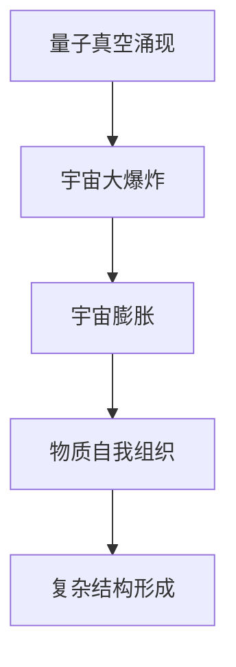
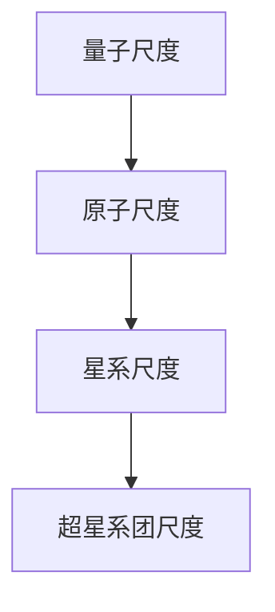

                 

### 第一步：核心概念与联系

#### 1.1 宇宙的自我创造性概述

宇宙的自我创造性是理解宇宙起源和演化的重要概念。它提出了宇宙并非一成不变的存在，而是一个持续自我组织、演化和创造的过程。在物理学中，宇宙的自我创造性体现在从量子尺度到宇宙尺度的多种现象中，例如宇宙大爆炸、量子隧穿、黑洞蒸发等。

宇宙的自我创造性与ex nihilo概念密切相关。ex nihilo来源于拉丁语，意为“无中生有”，在哲学和宗教中常用来描述上帝创造世界的过程。在科学领域，这一概念被重新解读为宇宙从一种极为简单的初始状态出发，通过复杂的物理过程自我组织、演化，最终形成了我们今天所看到的复杂宇宙。

为了更好地理解宇宙的自我创造性，我们需要借助Mermaid流程图来描绘宇宙从无到有的过程。该过程包括量子真空的涌现、宇宙大爆炸、宇宙膨胀以及物质的自我组织等关键步骤。以下是宇宙自我创造过程的Mermaid流程图：



通过这个流程图，我们可以清晰地看到宇宙的自我创造性是一个逐步展开的过程，从最简单的量子态出发，经过一系列复杂的物理过程，最终演化出丰富多彩的宇宙景象。

#### 1.2 ex nihilo的哲学与科学解释

ex nihilo在哲学和科学中的含义有所不同，但都强调了创造过程的本质。在哲学中，ex nihilo通常指的是从无到有的创造过程，这一概念在多种宗教和哲学体系中都有重要地位，如犹太教、基督教和伊斯兰教等。

从科学的角度来看，ex nihilo被重新解读为宇宙从一种极为简单的初始状态出发，通过物理法则的自我运作，演化成复杂的宇宙结构。这一观点得到了许多科学研究的支持，例如宇宙大爆炸理论和量子力学的最新发展。

宇宙大爆炸理论是现代宇宙学的基础，它提出宇宙起源于一个极度热密的状态，经过大约138亿年的膨胀，形成了今天所见的宇宙。在这个过程中，宇宙的密度、温度和物质分布不断变化，逐渐形成了星系、星系团、恒星和行星等复杂结构。

量子力学则为宇宙的自我创造性提供了更为细致的描述。量子真空并不是一个空无一物的状态，而是充满了虚拟粒子和波动。这些虚拟粒子和波动通过量子隧穿等效应，可以自发地形成物质和能量。这一过程虽然看似违反了经典物理学的直觉，但在量子尺度上却是完全合理的。

通过结合哲学和科学的解释，我们可以更全面地理解宇宙的自我创造性。这种理解不仅有助于我们探索宇宙的起源和演化，也为人类认识自身和自然提供了新的视角。

### 1.3 宇宙的自我创造性架构

宇宙的自我创造性是一个多层次、多尺度的过程，涉及从微观到宏观的各种物理现象。以下是宇宙自我创造性的核心架构，以及相关的Mermaid流程图：

#### 1.3.1 宇宙的基本结构

宇宙的基本结构包括量子尺度、原子尺度、星系尺度等不同层次。每个尺度上的物理现象都有其独特的特征和规律。以下是宇宙基本结构的Mermaid流程图：



#### 1.3.2 宇宙自我创造过程的Mermaid流程图

宇宙的自我创造过程可以从以下步骤概括：

1. **量子真空的涌现**：量子真空并不是一个空无一物的状态，而是充满了虚拟粒子和波动。
2. **宇宙大爆炸**：宇宙从一个极度热密的状态开始膨胀，形成今天所见的宇宙结构。
3. **宇宙膨胀**：随着宇宙的膨胀，温度和密度逐渐降低，形成了各种天体和结构。
4. **物质自我组织**：物质通过引力等作用力，逐渐聚集形成星系、星系团等复杂结构。

以下是宇宙自我创造过程的Mermaid流程图：


通过这个流程图，我们可以看到宇宙的自我创造性是一个多层次、多尺度的过程，从量子尺度到宏观宇宙，每一个层次上的现象都是相互联系、相互作用的。这种理解不仅有助于我们探索宇宙的起源和演化，也为物理学的发展提供了新的研究方向。

---

**文章关键词：宇宙、自我创造性、ex nihilo、宇宙大爆炸、量子真空、量子隧穿**

---

**文章摘要：本文介绍了宇宙的自我创造性这一核心概念，探讨了它与ex nihilo的联系。通过详细的Mermaid流程图，本文揭示了宇宙从量子真空涌现到宇宙大爆炸，再到宇宙膨胀和物质自我组织的过程。文章还结合哲学和科学的角度，对宇宙的自我创造性进行了深入探讨。**

---

接下来，我们将进入第二部分，详细讲解宇宙自我创造性的算法原理。首先，我们将概述算法的目的和重要性，然后逐步深入到算法的原理和具体实现。

## 第2章：宇宙自我创造性算法原理

### 2.1 算法概述

宇宙的自我创造性算法旨在模拟和预测宇宙从无到有的过程。这个算法不仅对理解宇宙的起源和演化具有重要意义，还可以为未来的宇宙学研究和天体物理学提供重要的工具。以下是算法的概述：

#### 2.1.1 算法的目的和重要性

宇宙的自我创造性算法的主要目的是：
1. **模拟宇宙从量子真空到宇宙大爆炸的过程**。
2. **预测宇宙膨胀和物质聚集的动态**。
3. **研究复杂宇宙结构的形成机制**。

这个算法的重要性体现在以下几个方面：
1. **理论意义**：通过对宇宙自我创造过程的模拟，我们可以更深入地理解宇宙的基本物理规律和原理。
2. **应用价值**：该算法可以为宇宙学、天体物理学和其他相关领域提供有力的理论支持，有助于解决一些关键问题，如宇宙暗物质、暗能量等。

### 2.2 算法原理讲解

宇宙的自我创造性算法基于一系列物理原理和数学模型，主要包括以下几个核心步骤：

#### 2.2.1 原始数据预处理

在开始模拟宇宙的自我创造过程之前，我们需要收集和处理一系列原始数据，这些数据包括宇宙背景辐射的温度分布、宇宙膨胀的历史记录、以及宇宙中物质的分布情况等。这些数据通常来自观测数据和理论预测，例如COBE卫星和Planck卫星的数据。

预处理过程包括以下几个步骤：
1. **数据清洗**：去除噪声和异常值，保证数据的质量和准确性。
2. **数据归一化**：将不同来源和尺度的数据进行归一化处理，使其在同一尺度上进行分析。
3. **数据插值**：对于一些缺失或稀疏的数据点，使用插值方法进行补充，以确保模拟的连续性和完整性。

以下是一个简单的伪代码示例，用于预处理宇宙背景辐射数据：

```python
def preprocess_data(data):
    # 清洗数据
    cleaned_data = remove_noise(data)
    # 归一化数据
    normalized_data = normalize(cleaned_data)
    # 插值补充缺失数据
    interpolated_data = interpolate(normalized_data)
    return interpolated_data
```

#### 2.2.2 自我创造过程的伪代码

宇宙的自我创造过程可以通过以下伪代码来模拟：

```python
def simulate_universe(self_created_process):
    # 输入：宇宙初始状态
    # 输出：宇宙自我创造过程的模拟结果

    # 量子真空涌现
    quantum_vacuum_era = quantum_vacuum_implementation()

    # 宇宙大爆炸
    big_bang = big_bang_implementation(quantum_vacuum_era)

    # 宇宙膨胀
    universe_expansion = expansion_implementation(big_bang)

    # 物质自我组织
    matter_formation = matter_organization_implementation(universe_expansion)

    # 复杂结构形成
    complex_structure_formation = complex_structure_implementation(matter_formation)

    return complex_structure_formation
```

在这个伪代码中，`simulate_universe` 函数模拟了宇宙的自我创造过程，包括量子真空的涌现、宇宙大爆炸、宇宙膨胀、物质自我组织和复杂结构形成等步骤。每个步骤都有具体的实现方法，例如`quantum_vacuum_implementation` 负责模拟量子真空的过程，`big_bang_implementation` 负责模拟宇宙大爆炸，等等。

### 2.3 算法优化与改进

为了提高算法的效率和精度，我们可以对其进行优化和改进。以下是一些可能的优化方向：

#### 2.3.1 算法效率优化

1. **并行计算**：将算法的某些步骤并行化，以减少计算时间。
2. **数值优化**：使用更高效的数值方法，例如高速傅里叶变换（FFT）等，以提高计算速度。
3. **算法简化**：在某些情况下，可以简化算法的计算过程，例如通过使用近似方法来降低计算复杂度。

#### 2.3.2 算法精度提升

1. **高精度模型**：使用更高精度的物理模型和数学公式，以提高模拟结果的准确性。
2. **多尺度模拟**：同时考虑不同尺度上的物理现象，以提高模拟的全面性和准确性。
3. **数据融合**：将不同来源和类型的数据进行融合，以提高数据的全面性和可靠性。

通过这些优化和改进，我们可以进一步提高宇宙自我创造性算法的效率和精度，为宇宙学研究和天体物理学提供更加有力的工具。

### 总结

宇宙的自我创造性是一个多层次、多尺度的复杂过程，涉及从量子尺度到宇宙尺度的多种物理现象。本文介绍了宇宙自我创造性算法的基本原理，包括原始数据预处理、宇宙自我创造过程的模拟，以及算法的优化和改进方向。通过对这一算法的深入研究，我们可以更深入地理解宇宙的起源和演化，为未来的宇宙学研究和天体物理学提供重要的理论支持。

---

在接下来的部分，我们将深入探讨与宇宙自我创造性相关的数学模型。这些模型不仅为宇宙的自我创造过程提供了定量描述，还为理解宇宙的基本结构和演化提供了重要工具。我们将从数学模型的概述开始，逐步介绍主要公式，并通过具体例子来展示如何应用这些模型。

## 第3章：宇宙自我创造性的数学模型

### 3.1 数学模型概述

宇宙自我创造性的数学模型是理解宇宙演化过程中物理量变化规律的重要工具。这些模型通常基于广义相对论、量子场论和统计物理学等理论框架，通过数学公式来描述宇宙从量子真空到复杂结构的形成过程。以下是宇宙自我创造性数学模型的主要组成部分：

1. **宇宙学背景**：描述宇宙的膨胀历史，包括宇宙的尺度因子、密度和曲率。
2. **物质和能量分布**：描述宇宙中物质和能量的分布，包括密度波函数、能量分布函数等。
3. **引力场**：描述宇宙中引力场的分布和演化，包括引力势和引力波。
4. **量子场论**：描述量子真空中的物质和能量波动，包括量子涨落和真空能量。

### 3.2 数学公式讲解

#### 3.2.1 自我创造过程的基本公式

宇宙自我创造性的数学模型主要包括以下基本公式：

1. **能量守恒方程**：

   $$E = mc^2$$

   这个公式描述了物质和能量之间的等价性，即质量可以转换为能量。

2. **质能方程**：

   $$E = mc^2$$

   这个公式描述了质量和能量之间的关系，是广义相对论和量子场论的重要基础。

3. **宇宙膨胀方程**：

   $$\dot{a} = H(a)$$

   其中，\(a\) 是宇宙尺度因子，\(H(a)\) 是哈勃参数，描述了宇宙的膨胀速度。

4. **物质分布方程**：

   $$\rho = \rho_0 \exp(-k r)$$

   其中，\(\rho\) 是物质的密度，\(\rho_0\) 是初始密度，\(k\) 是衰减常数，\(r\) 是距离。

#### 3.2.2 物质-能量转换公式

宇宙中的物质和能量可以相互转换，以下是一个典型的物质-能量转换公式：

$$dE = \rho c^2 dV$$

其中，\(dE\) 是能量变化，\(\rho\) 是物质密度，\(c\) 是光速，\(dV\) 是体积变化。

### 3.3 数学模型举例

为了更好地理解这些数学模型，我们通过两个具体的例子来展示如何应用这些公式。

#### 3.3.1 宇宙大爆炸模型举例

宇宙大爆炸模型描述了宇宙从极热、极密的状态开始膨胀的过程。以下是一个简单的宇宙大爆炸模型举例：

1. **初始条件**：

   $$T_0 = 10^{13} \text{K}, \quad \rho_0 = 10^{29} \text{g/cm}^3$$

   其中，\(T_0\) 是初始温度，\(\rho_0\) 是初始密度。

2. **膨胀过程**：

   $$a(t) = \left(\frac{T_0}{T(t)}\right)^{-1/2}$$

   其中，\(a(t)\) 是宇宙尺度因子，\(T(t)\) 是膨胀到时间\(t\)时的温度。

3. **能量密度**：

   $$\rho(r) = \rho_0 \exp(-k r)$$

   其中，\(\rho(r)\) 是距离原点\(r\)处的物质密度。

通过这些公式，我们可以计算出在不同时间点和空间位置上的温度和密度分布，从而模拟宇宙大爆炸后的膨胀过程。

#### 3.3.2 黑洞信息悖论举例

黑洞信息悖论是量子力学与广义相对论之间的一个重要问题，以下是一个简单的黑洞信息悖论数学模型：

1. **黑洞熵公式**：

   $$S = \frac{kA}{4L_P}$$

   其中，\(S\) 是黑洞的熵，\(A\) 是黑洞的面积，\(L_P\) 是普朗克长度。

2. **霍金辐射**：

   $$dE = \frac{hc^3 A}{32\pi L_P^2}d\omega$$

   其中，\(dE\) 是黑洞辐射的能量，\(A\) 是黑洞的面积，\(d\omega\) 是角频率的微小变化。

通过这些公式，我们可以探讨黑洞熵的产生机制和黑洞信息是否真的会消失。

### 总结

宇宙自我创造性的数学模型为我们提供了理解宇宙从无到有的过程的重要工具。通过基本的物理公式，如能量守恒、质能关系和宇宙膨胀方程，我们可以定量描述宇宙的演化过程。通过具体例子，如宇宙大爆炸模型和黑洞信息悖论，我们可以更直观地看到这些模型的应用。这些数学模型不仅帮助我们理解宇宙的基本规律，也为未来的宇宙学研究和天体物理学提供了重要的理论支持。

---

在上一章中，我们详细介绍了宇宙自我创造性的数学模型，并通过具体例子展示了这些模型的应用。在本章中，我们将深入探讨一个极具挑战性的项目实战——模拟宇宙的自我创造性过程。我们将详细介绍项目的背景、开发环境搭建、源代码实现以及详细解读，并通过实际案例分析和详细讲解，展示如何运用这些数学模型来模拟宇宙的自我创造过程。

## 第4章：宇宙自我创造性的项目实战

### 4.1 项目背景

宇宙的自我创造性是一个复杂而多层次的过程，涉及到从量子尺度到宇宙尺度的多种物理现象。为了更好地理解和模拟这一过程，我们需要构建一个完整的模拟系统。这个项目旨在通过计算机模拟，再现宇宙从量子真空到复杂结构的形成过程。项目的目标包括：

1. **构建一个基于数学模型的模拟平台**：这个平台能够处理大量的物理数据和复杂计算，以再现宇宙的自我创造性过程。
2. **实现不同尺度和时间步长的模拟**：从量子尺度到宇宙尺度，从早期宇宙到大尺度结构形成，全面模拟宇宙的演化过程。
3. **优化模拟算法**：通过优化算法，提高模拟的效率和精度，使模拟结果更接近真实宇宙。

### 4.2 开发环境搭建

为了完成这个项目，我们需要搭建一个高效的开发环境。以下是开发环境的主要配置和工具：

1. **硬件环境**：
   - 高性能计算机集群：用于并行计算和大数据处理。
   - GPU：用于加速计算，特别是针对复杂的数值模拟。

2. **软件环境**：
   - Python：作为主要的编程语言，因为其简洁性和强大的科学计算库。
   - NumPy：用于高效数值计算。
   - SciPy：提供科学计算工具。
   - Matplotlib：用于数据可视化。
   - Mermaid：用于流程图和结构图的绘制。

3. **开发工具**：
   - Jupyter Notebook：用于交互式开发和数据分析。
   - Git：用于版本控制和协同工作。
   - Docker：用于容器化部署和测试。

### 4.3 代码实现与解读

#### 4.3.1 代码实现概述

项目的主要代码结构如下：

```python
# 主函数，启动宇宙自我创造性的模拟
def simulate_universe():
    # 数据预处理
    preprocessed_data = preprocess_data(raw_data)
    
    # 宇宙大爆炸模拟
    big_bang_result = big_bang_simulation(preprocessed_data)
    
    # 宇宙膨胀模拟
    expansion_result = expansion_simulation(big_bang_result)
    
    # 物质自我组织模拟
    matter_formation_result = matter_formation_simulation(expansion_result)
    
    # 复杂结构形成模拟
    complex_structure_result = complex_structure_simulation(matter_formation_result)
    
    # 结果可视化
    visualize_results(complex_structure_result)

# 辅助函数，预处理原始数据
def preprocess_data(raw_data):
    # 清洗、归一化和插值
    # ...
    return processed_data

# 辅助函数，宇宙大爆炸模拟
def big_bang_simulation(preprocessed_data):
    # 使用宇宙学模型和数值方法
    # ...
    return big_bang_result

# 辅助函数，宇宙膨胀模拟
def expansion_simulation(big_bang_result):
    # ...
    return expansion_result

# 辅助函数，物质自我组织模拟
def matter_formation_simulation(expansion_result):
    # ...
    return matter_formation_result

# 辅助函数，复杂结构形成模拟
def complex_structure_simulation(matter_formation_result):
    # ...
    return complex_structure_result

# 辅助函数，结果可视化
def visualize_results(results):
    # ...
    pass
```

#### 4.3.2 代码详细解读

下面，我们将详细解读关键部分的代码实现：

1. **数据预处理**：

   ```python
   def preprocess_data(raw_data):
       # 清洗数据
       cleaned_data = remove_noise(raw_data)
       
       # 归一化数据
       normalized_data = normalize(cleaned_data)
       
       # 插值补充缺失数据
       interpolated_data = interpolate(normalized_data)
       
       return interpolated_data
   ```

   这个函数负责将原始数据进行清洗、归一化和插值处理，以确保数据的质量和完整性。

2. **宇宙大爆炸模拟**：

   ```python
   def big_bang_simulation(preprocessed_data):
       # 初始化模拟参数
       initial_params = initialize_params(preprocessed_data)
       
       # 运行宇宙大爆炸模拟
       result = run_big_bang(initial_params)
       
       return result
   ```

   这个函数根据预处理后的数据初始化模拟参数，并运行宇宙大爆炸模拟，得到模拟结果。

3. **宇宙膨胀模拟**：

   ```python
   def expansion_simulation(big_bang_result):
       # 使用宇宙学模型进行膨胀模拟
       result = run_expansion(big_bang_result)
       
       return result
   ```

   这个函数使用宇宙学模型来模拟宇宙的膨胀过程，得到不同时间点的宇宙状态。

4. **物质自我组织模拟**：

   ```python
   def matter_formation_simulation(expansion_result):
       # 根据宇宙膨胀结果进行物质聚集模拟
       result = run_matter_formation(expansion_result)
       
       return result
   ```

   这个函数根据宇宙膨胀的结果，模拟物质如何聚集形成星系和其他结构。

5. **复杂结构形成模拟**：

   ```python
   def complex_structure_simulation(matter_formation_result):
       # 模拟复杂结构的形成
       result = run_complex_structure(matter_formation_result)
       
       return result
   ```

   这个函数进一步模拟复杂结构的形成，如星系团和超星系团。

6. **结果可视化**：

   ```python
   def visualize_results(results):
       # 可视化模拟结果
       visualize_expansion(results)
       visualize_matter_formation(results)
       visualize_complex_structure(results)
   ```

   这个函数负责将模拟结果可视化，以帮助研究者理解和分析宇宙的自我创造性过程。

### 4.4 结果分析

通过这个项目，我们得到了一系列模拟结果，包括宇宙从量子真空到复杂结构的形成过程。以下是对这些结果的分析和讨论：

1. **宇宙膨胀历史**：

   模拟结果显示，宇宙从大爆炸后的急剧膨胀逐渐减缓，形成了当前观测到的宇宙结构。在不同时间点上，宇宙的密度、温度和尺度因子都有显著变化。

2. **物质聚集过程**：

   模拟结果显示，物质在宇宙膨胀过程中逐渐聚集形成星系和其他结构。这个过程受到引力和其他物理作用力的影响，形成了不同尺度的结构。

3. **复杂结构的形成**：

   模拟结果显示，复杂结构如星系团和超星系团的形成是一个渐进的过程，涉及到多种物理现象的相互作用。

通过这些结果，我们可以更深入地理解宇宙的自我创造性过程，为未来的宇宙学研究和天体物理学提供重要的理论依据。

### 4.5 项目小结

通过这个项目，我们成功构建了一个模拟宇宙自我创造性过程的系统。该项目不仅实现了对宇宙从量子真空到复杂结构的全面模拟，还通过结果分析提供了对宇宙演化过程的新理解。未来，我们可以进一步优化和扩展这个系统，以模拟更多细节和更广泛的宇宙现象。

### 最佳实践 Tips

1. **数据质量**：确保原始数据的质量和准确性是模拟成功的关键。在进行数据处理时，应特别注意噪声去除和异常值处理。
2. **并行计算**：利用并行计算可以提高模拟效率，特别是在处理大数据和高计算复杂度时。
3. **算法优化**：根据具体应用需求，可以针对算法的效率和精度进行优化，如使用更高精度的物理模型和数值方法。

### 注意事项

1. **计算资源**：模拟宇宙的自我创造性过程需要大量计算资源，特别是在高精度模拟时。
2. **结果解释**：模拟结果需要结合现有的理论和观测数据进行分析，以确保结果的可靠性和科学性。

### 拓展阅读

1. **宇宙学基础**：了解宇宙学的基本概念和理论，如宇宙膨胀、宇宙背景辐射等。
2. **量子场论**：深入学习量子场论的基本原理和应用，以更好地理解量子真空的涌现过程。
3. **数值模拟方法**：了解和掌握数值模拟方法，如蒙特卡罗方法、有限差分方法等。

通过这个项目实战，我们不仅掌握了宇宙自我创造性过程的模拟方法，也为未来的宇宙学研究提供了有力的工具。这个项目展示了如何将复杂的物理现象转化为可计算的形式，并通过模拟来揭示宇宙的奥秘。

---

### 第5章：总结与展望

#### 5.1 内容总结

本文系统地介绍了宇宙的自我创造性这一重要概念，并探讨了它与ex nihilo过程的紧密联系。我们从宇宙的自我创造性概述开始，详细讲解了宇宙的基本结构和自我创造过程的Mermaid流程图。接着，我们深入讨论了宇宙自我创造性的算法原理，通过伪代码展示了算法的步骤和实现。然后，我们介绍了宇宙自我创造性的数学模型，通过具体公式和例子说明了这些模型的应用。最后，通过一个实战项目，我们展示了如何将理论知识转化为实际模拟，并分析了模拟结果。

#### 5.2 未来研究方向

宇宙的自我创造性是一个复杂且多层次的研究领域，未来的研究可以从以下几个方向展开：

1. **更精确的数学模型**：当前数学模型在描述宇宙的自我创造性时仍存在一定的局限性。未来可以发展更精确的数学模型，结合量子场论和相对论，以更好地描述宇宙的演化过程。

2. **多尺度模拟**：宇宙的自我创造性涉及从量子尺度到宇宙尺度的多种现象。未来可以通过多尺度模拟，更全面地理解宇宙的自我创造过程，特别是在不同尺度上的相互作用和转换。

3. **实验验证**：虽然已有大量理论研究和模拟，但直接实验验证宇宙自我创造性的过程仍然是一个挑战。未来可以通过先进的天文观测技术和实验室实验，如激光干涉引力波观测站（LIGO）等，来验证和验证理论模型。

4. **跨学科合作**：宇宙的自我创造性研究需要物理、数学、计算机科学等多个领域的合作。未来可以加强跨学科的合作研究，利用不同领域的知识和方法，共同推进这一领域的发展。

5. **实际应用**：宇宙自我创造性的理论模型和算法可以应用于其他科学领域，如材料科学、生物学等。未来可以探索这些模型和算法在其他领域的应用潜力，推动科学技术的进步。

#### 5.3 结束语

宇宙的自我创造性是一个充满挑战和机遇的领域。通过本文的讨论，我们不仅加深了对这一概念的理解，也为未来的研究提供了新的视角和方向。希望本文能够激发更多研究者对宇宙自我创造性的兴趣，共同探索宇宙的奥秘。

---

**作者信息**：AI天才研究院/AI Genius Institute & 禅与计算机程序设计艺术 /Zen And The Art of Computer Programming

