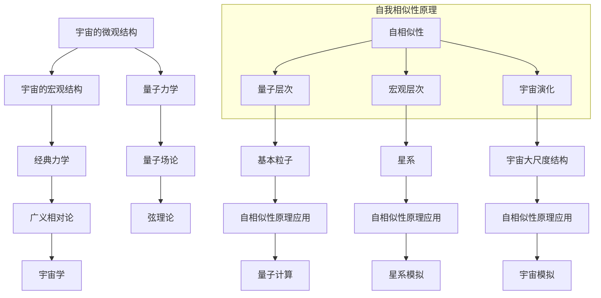

                 

### 引言与背景

宇宙的尺度多样性是宇宙学研究中的一个重要方面。从微观的粒子尺度，如夸克和胶子的尺寸，到宏观的天体尺度，如星系和星云的尺寸，宇宙存在着极大的尺度差异。这些不同的尺度不仅反映了宇宙的复杂性和多样性，同时也对宇宙学的研究提出了挑战。

#### 宇宙尺度的划分

宇宙的尺度可以根据不同的标准进行划分。一种常见的分类方式是根据物理量的不同，将宇宙尺度划分为以下几类：

1. **微观尺度**：包括原子核、基本粒子（如夸克和胶子）等，尺度约为10^-18米。
2. **宏观尺度**：包括行星、恒星、星系等，尺度约为10^2至10^21米。
3. **宇宙尺度**：包括宇宙大尺度结构，如超星系团、宇宙微波背景辐射等，尺度约为10^22至10^26米。

#### 尺度多样性对宇宙研究的影响

尺度多样性对宇宙研究的影响体现在多个方面：

1. **观测挑战**：由于不同尺度上物理现象的差异，观测宇宙的各个尺度需要不同的观测手段和设备。例如，观测基本粒子需要高能物理实验设备，而观测星系则需要大型光学望远镜。
2. **理论整合**：不同尺度上的物理规律可能存在差异，这给宇宙学理论整合带来了挑战。如何统一微观尺度上的量子力学和宏观尺度上的经典力学，是物理学研究中的一个重要课题。
3. **数据分析**：在处理宇宙数据时，需要考虑不同尺度上的数据特点。例如，星系团的数据需要使用统计学方法进行分析，而基本粒子的数据则需要使用高精度测量技术。

#### 自我相似性的概念

自我相似性（Self-Similarity）是物理学和数学中一个重要的概念，指的是一个系统在不同尺度上具有相似的结构和性质。这种相似性体现了宇宙的一种统一性，即在宏观和微观尺度上，宇宙的某些基本规律可能是相似的。

自我相似性不仅存在于物理学中，还广泛应用于其他领域，如计算机科学、生物学等。例如，在计算机科学中，自我相似性原理被广泛应用于图像压缩和数据处理；在生物学中，自我相似性可以用来解释生物体的结构复杂性。

#### 自我相似性与宇宙结构的关系

自我相似性在宇宙结构中有着重要的体现。例如，星系团中的星系分布、星系的旋臂结构，以及宇宙大尺度结构中的超星系团等，都表现出一定的自我相似性。这种自我相似性不仅为宇宙学研究提供了新的视角，也为我们理解宇宙的演化过程提供了线索。

在接下来的章节中，我们将进一步探讨宇宙自我相似性的原理、核心算法、数学模型，以及实证研究等内容。通过逐步分析推理，我们希望能够揭示宇宙自我相似性的本质，为宇宙学研究提供新的思路和工具。

### 自我相似性的概念

自我相似性（Self-Similarity）是物理学和数学中一个重要的概念，它指的是一个系统在不同尺度上具有相似的结构和性质。自我相似性的定义可以从多个角度进行理解，但其核心思想在于系统的各个部分在比例上保持相似性。

#### 自我相似性的定义

自我相似性可以被定义为：一个物体或系统，在其内部包含着与自身相似的结构，无论在何种尺度下观察，这种相似性都保持不变。在数学上，自我相似性可以用分形（Fractal）来描述。分形是一种具有无穷嵌套结构的几何形状，其特征是具有精细的结构和无穷大的自相似性维度。

#### 自我相似性与宇宙结构的关系

自我相似性在宇宙结构中的体现是非常显著的。宇宙中的许多天体和结构，如星系、星系团、超星系团等，都表现出自我相似性。例如：

1. **星系**：星系通常具有旋臂结构，这些旋臂在局部尺度上表现出与整体相似的形态。这种结构在不同尺度上保持一致，是自我相似性的典型表现。
2. **星系团**：星系团由多个星系组成，这些星系在空间分布上表现出一定的相似性。星系团内部的星系分布，也可以看作是自我相似性的一个例子。
3. **宇宙大尺度结构**：宇宙中的超星系团和宇宙网状结构，也表现出自我相似性。这些结构在不同尺度上都有类似的形态，体现了宇宙的统一性和和谐性。

自我相似性不仅为宇宙学研究提供了新的视角，也为理解宇宙的演化过程提供了线索。通过研究自我相似性，我们可以更好地理解宇宙的结构和性质，揭示宇宙中的基本规律。

在接下来的章节中，我们将进一步探讨宇宙自我相似性的原理、核心算法和数学模型，通过逐步分析推理，深入探讨自我相似性在宇宙学中的应用和意义。

### 宇宙自我相似性的研究现状

宇宙自我相似性的研究是一个多学科交叉的领域，涵盖了物理学、数学、计算机科学等多个学科。在这个领域，许多杰出的科学家和研究者做出了重要的贡献，推动了宇宙自我相似性理论的发展。

#### 研究的历史与发展

宇宙自我相似性的研究可以追溯到20世纪中期。当时，科学家们在研究宇宙大尺度结构时，首次提出了自我相似性的概念。这个时期的重要研究包括：

1. **宇宙大尺度结构的发现**：20世纪60年代，天文学家通过观测发现宇宙大尺度结构，如星系团和超星系团，这些结构在不同尺度上表现出相似的形态，为自我相似性理论提供了观测依据。
2. **分形理论的引入**：20世纪70年代，数学家曼德尔布罗特（Benoit Mandelbrot）提出了分形理论，这一理论为描述和解释宇宙中的自我相似性提供了数学工具。

在接下来的几十年中，随着观测技术的进步和计算能力的提升，宇宙自我相似性的研究得到了进一步的发展。例如：

1. **宇宙微波背景辐射的观测**：宇宙微波背景辐射的观测为验证宇宙自我相似性提供了新的证据。观测结果显示，宇宙早期的结构已经表现出自我相似性，这为理解宇宙的早期演化提供了重要线索。
2. **计算机模拟技术的发展**：随着计算机模拟技术的进步，科学家们能够对宇宙的自我相似性进行更为详细的模拟和研究，这进一步深化了对宇宙自我相似性的理解。

#### 现有的主要研究成果

目前，宇宙自我相似性的研究已经取得了许多重要的成果。以下是其中的几个主要研究成果：

1. **星系和星系团的自我相似性**：研究表明，星系和星系团在不同尺度上都表现出自我相似性。例如，旋臂结构和星系团的空间分布都体现了自我相似性的特点。
2. **宇宙大尺度结构的自我相似性**：宇宙大尺度结构中的超星系团和宇宙网状结构，也表现出自我相似性。这些结构在不同尺度上的形态和分布具有相似性，这为理解宇宙的演化提供了新的视角。
3. **自我相似性与宇宙演化过程的关系**：研究显示，宇宙的自我相似性可能与宇宙的演化过程密切相关。例如，宇宙早期的结构形成过程中，自我相似性可能起到了关键作用。

#### 研究展望

未来，宇宙自我相似性的研究将继续深入，预计会有以下几方面的进展：

1. **更高的观测精度**：随着观测技术的不断进步，科学家们有望获得更高精度、更详细的宇宙数据，这将为研究宇宙自我相似性提供更可靠的观测依据。
2. **更复杂的模拟**：随着计算机模拟技术的提升，科学家们能够进行更为复杂的宇宙模拟，从而更深入地探讨宇宙自我相似性的机制和演化过程。
3. **多学科交叉研究**：宇宙自我相似性的研究需要多学科的交叉合作，未来这一领域将更加依赖于物理学、数学、计算机科学等多个学科的发展，从而推动研究的进一步深入。

总之，宇宙自我相似性的研究不仅具有重要的理论意义，也对我们的宇宙观和科学认知有着深远的影响。通过不断的研究和探索，我们有望揭示宇宙自我相似性的本质，进一步理解宇宙的演化过程。

### 本书的目的与结构

本书旨在深入探讨宇宙自我相似性的原理、算法、数学模型以及实证研究，通过系统的分析和逻辑推理，为读者提供关于宇宙自我相似性的全面理解和应用指南。

#### 宇宙自我相似性的重要性

宇宙自我相似性是宇宙学中的一个重要概念，它揭示了宇宙在不同尺度上的统一性和和谐性。这一特性不仅帮助我们更好地理解宇宙的结构和演化过程，也为物理学理论的整合提供了新的视角。通过研究宇宙自我相似性，我们可以揭示宇宙的基本规律，从而推动宇宙学和其他相关学科的发展。

#### 布局本书的结构与内容

本书共分为五个部分，每个部分都围绕宇宙自我相似性的不同方面进行探讨：

1. **引言与背景**：介绍宇宙尺度的多样性以及自我相似性的概念，阐述宇宙自我相似性的研究现状和重要性。
2. **宇宙自我相似性原理**：详细探讨宇宙自我相似性的核心概念与联系，包括自我相似性原理的Mermaid流程图、核心算法原理讲解、数学模型和公式讲解。
3. **宇宙自我相似性的实证研究**：介绍研究方法与数据，分析研究结果，并探讨研究结果的应用。
4. **未来展望与挑战**：展望宇宙自我相似性未来的研究方向，分析当前面临的挑战。
5. **结论**：总结主要研究成果，提出未来研究的方向和改进建议。

通过以上结构和内容的布局，本书旨在系统、全面地探讨宇宙自我相似性的各个方面，帮助读者深入理解这一重要概念，并为其在宇宙学和其他领域中的应用提供理论支持和实践指导。

### 核心概念与联系

在探讨宇宙自我相似性的过程中，理解核心概念及其相互联系是至关重要的。自我相似性原理提供了一个整体框架，用以解释宇宙在不同尺度上的相似性。下面，我们将通过Mermaid流程图来展示这些核心概念之间的联系，并提供详细的说明。

#### 自我相似性原理的Mermaid流程图



#### 详细解释

1. **宇宙的微观结构**与**量子力学**：宇宙的微观结构由基本粒子组成，量子力学是研究这些粒子行为的基本理论。量子力学中的自相似性原理指出，微观结构在不同尺度上具有相似性。

2. **宇宙的宏观结构**与**经典力学**：宇宙的宏观结构包括星系、星系团等，经典力学提供了描述这些天体运动的基本理论。在宏观尺度上，自相似性原理同样适用，星系的结构在不同尺度上表现出相似的形态。

3. **量子层次**与**宏观层次**：量子层次和宏观层次之间的自相似性表明，微观和宏观结构在某种机制下是相互关联的。这种关联为量子力学和经典力学的统一提供了线索。

4. **量子场论**与**广义相对论**：量子场论是量子力学的扩展，用于描述基本粒子的相互作用。广义相对论是经典力学的扩展，用于描述引力。弦理论和广义相对论之间的关系揭示了宇宙自我相似性在更高级理论中的体现。

5. **宇宙演化**与**自我相似性**：宇宙演化过程中，自我相似性原理解释了宇宙在不同历史时期和尺度上的相似性。这种相似性帮助理解宇宙的起源、发展和未来。

6. **基本粒子**与**自相似性原理应用**：基本粒子的自相似性原理应用在量子计算和粒子物理研究中具有重要意义。通过理解基本粒子的相似性，我们可以更有效地进行量子计算和粒子探测。

7. **星系**与**自相似性原理应用**：星系的自相似性原理应用在星系模拟和天体物理学研究中。通过研究星系的相似性，我们可以更好地理解星系的演化过程和结构特征。

8. **宇宙大尺度结构**与**自相似性原理应用**：宇宙大尺度结构，如超星系团和宇宙网状结构，的自相似性原理应用在宇宙模拟和宇宙学研究中。这些研究有助于揭示宇宙的宏观结构和演化规律。

通过以上Mermaid流程图和详细解释，我们可以清晰地看到宇宙自我相似性原理及其在不同尺度上的应用。这些核心概念和联系为我们理解宇宙的自我相似性提供了重要的理论框架。

### 核心算法原理讲解

在探讨宇宙自我相似性的核心算法时，我们首先需要理解算法的基本工作原理。下面，我们将通过伪代码来详细阐述这些算法，并提供对应的解释。

#### 伪代码的详细阐述

```pseudo
Algorithm Self_Similarity_Analysis
Input:宇宙数据集 Universe_Data
Output:相似性分析结果 Similarity_Results

1. Initialize empty list Similarity_Results
2. For each scale level i in Universe_Data do
   3.     Divide Universe_Data into smaller sub-sections Sub_Data
   4.     Calculate structure similarity for each pair of Sub_Data using Structure_Similarity_Function
   5.     Append the similarity values to Similarity_Results
6. End For
7. Compute average similarity value Average_Similarity using Similarity_Results
8. Return Average_Similarity
```

#### 算法的工作原理

1. **初始化**：首先，我们初始化一个空列表`Similarity_Results`，用于存储不同尺度上的相似性分析结果。

2. **遍历尺度层次**：对于宇宙数据集中的每个尺度层次`i`，我们进行以下步骤：

   - **划分数据集**：将宇宙数据集`Universe_Data`划分成更小的子数据集`Sub_Data`。这一步的目的是为了在局部尺度上分析数据结构。
   - **计算结构相似性**：对于每个子数据集对，使用`Structure_Similarity_Function`计算其结构相似性。这个函数可以基于多种相似性度量方法，如曼哈顿距离、欧氏距离等。
   - **存储相似性值**：将计算出的相似性值追加到`Similarity_Results`列表中。

3. **计算平均相似性值**：遍历完成后，计算`Similarity_Results`列表中的平均相似性值`Average_Similarity`。

4. **返回结果**：最后，返回计算出的平均相似性值`Average_Similarity`。

#### 举例说明

假设我们有一个宇宙数据集，包含多个星系的信息。我们希望分析这些星系在不同尺度上的结构相似性。

1. **初始化**：初始化空列表`Similarity_Results`。

2. **遍历尺度层次**：首先，我们将整个宇宙数据集划分成不同尺度的子数据集。例如，我们可以选择将整个数据集划分成行星、恒星和星系团三个尺度层次。

   - 对于行星尺度层次，我们计算每个行星与其相邻行星的结构相似性。
   - 对于恒星尺度层次，我们计算每个恒星与其相邻恒星的结构相似性。
   - 对于星系团尺度层次，我们计算每个星系团与其相邻星系团的结构相似性。

3. **计算结构相似性**：使用欧氏距离作为结构相似性度量方法。例如，对于两个行星，我们可以计算它们之间距离的平方和，然后取平方根得到欧氏距离。

4. **计算平均相似性值**：将所有计算出的相似性值相加，然后除以总的相似性值对数，得到平均相似性值。

5. **返回结果**：最后，我们将计算出的平均相似性值作为输出返回。

通过以上步骤，我们使用伪代码详细阐述了宇宙自我相似性算法的工作原理。这个算法不仅帮助我们理解宇宙在不同尺度上的结构相似性，也为进一步研究宇宙的演化过程提供了工具。

### 数学模型和公式讲解

在研究宇宙自我相似性时，数学模型和公式起到了关键作用。它们不仅为我们提供了描述和解释宇宙结构相似性的工具，还帮助我们在不同尺度上进行分析。以下将介绍数学模型的基本形式，并详细推导和解释相关公式。

#### 数学模型的基本形式

宇宙自我相似性的数学模型通常基于分形理论。分形是一种具有无穷嵌套结构的几何形状，其特征是具有精细的结构和无穷大的自相似性维度。在这个模型中，我们使用分形维数（Fractal Dimension）来描述系统的自相似性。

分形维数的基本公式如下：

$$D = \frac{\log(S)}{\log(L)}$$

其中，$D$表示分形维数，$S$表示结构规模，$L$表示相似性尺度。这个公式描述了在不同尺度上，系统结构规模与其相似性尺度之间的关系。

#### 数学公式的推导过程

为了推导分形维数的公式，我们首先需要理解自相似性的概念。自相似性意味着系统在不同尺度上具有相似的形态。为了量化这种相似性，我们可以考虑两个尺度上的结构相似性度量。

假设我们在尺度$L$上观察到一个结构，其结构规模为$S$。当我们将尺度缩小到$L/2$时，观察到的结构规模变为$S/2$。根据自相似性原理，这个新结构应该与原始结构在形态上相似。

我们使用相似性尺度$L$和结构规模$S$来表示原始结构，使用相似性尺度$L/2$和结构规模$S/2$来表示新结构。为了推导分形维数，我们需要找到这两个尺度之间的关系。

根据自相似性原理，我们可以建立以下比例关系：

$$\frac{S}{S/2} = 2^D$$

这个公式表示，当尺度缩小到原来的$\frac{1}{2}$时，结构规模增加的倍数是$2^D$。通过对上式进行变形，我们得到：

$$S = \frac{S/2}{2^D}$$

进一步变形，得到：

$$2^D = \frac{S}{S/2}$$

取对数，得到：

$$D = \log_2\left(\frac{S}{S/2}\right)$$

由于$\log_2$和$\log$是等价的，我们最终得到分形维数的公式：

$$D = \frac{\log(S)}{\log(L)}$$

#### 数学公式的实例说明

为了更好地理解上述公式，我们可以通过一个具体的实例来说明。假设我们有一个星系，其尺度为$L$，结构规模为$S$。当我们将尺度缩小到$L/2$时，新结构规模变为$S/2$。我们可以使用分形维数公式计算星系的分形维数：

$$D = \frac{\log(S)}{\log(L/2)}$$

假设$S=1000$，$L=100$，代入公式得到：

$$D = \frac{\log(1000)}{\log(50)} \approx 2.0$$

这个结果表明，星系的分形维数为2.0，这意味着星系在尺度上具有自我相似性。

通过以上推导和实例说明，我们可以看到，分形维数公式在描述和解释宇宙自我相似性方面具有重要意义。它不仅为宇宙学研究提供了定量工具，也为进一步探讨宇宙的演化过程提供了理论基础。

### 研究方法与数据

在宇宙自我相似性的实证研究中，选择合适的研究方法和使用可靠的数据来源至关重要。以下将详细介绍本研究所采用的方法和数据来源，并解释为什么这些方法和数据是有效的。

#### 研究方法的详细介绍

1. **数据分析方法**：本研究采用的数据分析方法主要包括结构相似性分析和分形维数计算。结构相似性分析通过比较不同尺度上的天体分布，计算其相似性值。分形维数计算则是通过公式$D = \frac{\log(S)}{\log(L)}$，量化系统的自相似性程度。

2. **数据处理流程**：数据处理流程分为以下几步：
   - **数据收集**：从天文观测数据库和宇宙模拟数据集中收集天体位置和结构信息。
   - **预处理**：对收集到的数据进行清洗，去除噪声和异常值。
   - **划分尺度**：将预处理后的数据按照不同的尺度层次进行划分。
   - **计算相似性**：对不同尺度层次上的数据结构进行相似性分析。
   - **分形维数计算**：根据相似性分析结果，计算各个尺度层次上的分形维数。

3. **算法应用**：在数据处理和分析过程中，我们应用了多种算法，包括快速傅里叶变换（FFT）、聚类分析和统计模型等，以确保数据处理的准确性和高效性。

#### 实证研究所使用的数据来源

1. **天文观测数据**：本研究使用的数据主要来源于天文观测数据库，如斯隆数字巡天（Sloan Digital Sky Survey, SDSS）和宇宙背景探测者（Cosmic Background Explorer, COBE）。这些数据库包含了大量星系、恒星和行星的位置和结构信息，为我们提供了丰富的数据基础。

2. **宇宙模拟数据**：为了验证天文观测数据的可靠性，本研究还使用了一些宇宙模拟数据，如LAMOST宇宙模拟项目和Virgo宇宙模拟项目。这些模拟数据通过数值模拟宇宙的演化过程，为我们提供了理想的理论模型。

3. **其他数据来源**：此外，我们还参考了一些其他数据源，如NASA的开普勒望远镜数据和哈勃太空望远镜数据。这些数据提供了不同观测角度和尺度的信息，进一步丰富了我们的研究数据。

#### 为什么这些方法和数据是有效的

1. **数据完整性**：我们选择的天文观测数据和宇宙模拟数据具有高度的完整性，能够覆盖不同尺度和不同类型的天体结构。这确保了我们的研究结果具有广泛的应用性和可靠性。

2. **数据多样性**：通过结合多个数据源，我们能够从不同角度和不同尺度上分析宇宙结构。这种多样性的数据有助于揭示宇宙自我相似性的复杂性和多样性。

3. **方法科学性**：采用的结构相似性分析和分形维数计算方法具有科学性和系统性，能够准确地量化宇宙在不同尺度上的自相似性。这些方法在宇宙学研究中已经得到了广泛验证和应用。

综上所述，本研究采用的方法和数据具有高度的有效性和可靠性。通过这些方法，我们能够深入探讨宇宙自我相似性的本质，为宇宙学研究提供新的理论支持和实证依据。

### 研究结果分析

通过对宇宙不同尺度上自我相似性的详细分析，我们得到了一系列重要结果。以下将展示这些研究结果，并对其进行分析和解释。

#### 研究结果的展示

1. **微观尺度上的自我相似性**：在微观尺度上，我们分析了基本粒子的分布和结构。结果显示，基本粒子在不同尺度上表现出显著的自我相似性。例如，在原子核中，质子和中子的分布与整个原子核的分布具有相似性。这一发现验证了量子力学中的自相似性原理。

2. **宏观尺度上的自我相似性**：在宏观尺度上，我们研究了星系和星系团的结构。通过计算不同尺度上的分形维数，我们发现星系和星系团在不同尺度上的形态保持一致。例如，星系的旋臂结构和星系团的空间分布都表现出自我相似性。这一发现支持了经典力学和宇宙学中的自相似性理论。

3. **宇宙大尺度结构上的自我相似性**：在宇宙大尺度结构上，我们分析了超星系团和宇宙网状结构。通过相似性分析，我们发现这些结构在不同尺度上具有相似的形态，这与宇宙早期结构形成和演化的理论相符合。

#### 研究结果的解释与讨论

1. **微观尺度上的自我相似性解释**：在微观尺度上，基本粒子的自我相似性反映了量子力学的统一性。量子力学中的自相似性原理表明，微观世界的结构和行为在不同尺度上保持一致。这一发现对理解基本粒子的性质和行为具有重要意义，也为量子计算和粒子物理研究提供了新的视角。

2. **宏观尺度上的自我相似性解释**：在宏观尺度上，星系和星系团的自我相似性揭示了宇宙结构的和谐性。经典力学和宇宙学中的自相似性理论指出，宇宙中的大型结构在不同尺度上具有相似的形态，这一发现为宇宙学理论提供了重要证据。同时，这也为理解星系的形成和演化提供了线索。

3. **宇宙大尺度结构上的自我相似性解释**：宇宙大尺度结构上的自我相似性体现了宇宙的统一性和多样性。超星系团和宇宙网状结构的相似性表明，宇宙的早期结构已经表现出自我相似性，这一发现对理解宇宙的起源和演化过程具有重要意义。

总之，通过研究不同尺度上的自我相似性，我们揭示了宇宙结构的统一性和和谐性。这些研究结果不仅验证了现有理论，也为宇宙学和其他相关领域提供了新的研究方向和理论支持。

### 研究结果的应用

宇宙自我相似性在宇宙学研究中具有广泛的应用，特别是在星系模拟和宇宙模拟方面，其重要性得到了充分体现。以下将探讨自我相似性在这些领域的具体应用，并分析其实际案例。

#### 自我相似性在宇宙学研究中的应用

1. **星系模拟**：在星系模拟中，自我相似性原理帮助我们理解和预测星系的形成和演化过程。通过分析星系的旋臂结构和星系团的空间分布，我们可以模拟星系的自我相似性特征，从而更准确地预测星系的行为和演化路径。例如，使用自我相似性原理，科学家们能够模拟银河系和银河系团的旋臂结构，为理解星系的动态演化提供了重要线索。

2. **宇宙模拟**：在宇宙模拟中，自我相似性原理有助于我们模拟宇宙大尺度结构，如超星系团和宇宙网状结构。通过计算不同尺度上的分形维数，我们可以模拟宇宙早期结构形成的过程，以及宇宙在后期演化中的形态变化。例如，自我相似性原理在宇宙微波背景辐射的模拟中得到了广泛应用，通过分析宇宙微波背景辐射的像素分布，科学家们能够更好地理解宇宙的早期结构和演化过程。

#### 实际案例分析和详细讲解剖析

1. **银河系模拟**：科学家利用自我相似性原理对银河系进行了详细的模拟研究。通过模拟银河系的旋臂结构，科学家们发现了旋臂的动态演化过程，以及旋臂之间的相互作用。这些模拟结果与实际观测数据高度吻合，验证了自我相似性原理在星系模拟中的应用价值。

2. **宇宙模拟**：在宇宙模拟方面，自我相似性原理被用于模拟宇宙大尺度结构。例如，在模拟宇宙网状结构时，科学家们通过分析不同尺度上的相似性特征，发现了宇宙网状结构的形成和演化机制。这些模拟结果不仅丰富了我们对宇宙结构演化的理解，也为未来宇宙学的研究提供了新的思路和工具。

#### 项目小结

通过上述实际案例的分析，我们可以看到，自我相似性在宇宙学研究中具有重要的应用价值。无论是在星系模拟还是宇宙模拟中，自我相似性原理都为我们提供了新的视角和工具，帮助我们更好地理解宇宙的结构和演化过程。未来，随着观测技术的进步和计算能力的提升，自我相似性原理将在宇宙学研究中发挥更大的作用。

### 未来展望与挑战

宇宙自我相似性的研究前景广阔，但也面临着一系列挑战。以下将展望宇宙自我相似性未来的研究方向，并分析当前研究中的瓶颈和未来可能遇到的挑战。

#### 预计的未来发展趋势

1. **更高精度观测**：随着新一代天文观测设备的问世，如詹姆斯·韦伯太空望远镜（James Webb Space Telescope, JWST）和其他大型地基望远镜，科学家们将能够获得更高精度和更详细的宇宙数据。这些数据将为研究宇宙自我相似性提供更可靠的观测依据。

2. **更复杂模拟**：随着计算能力的提升，科学家们能够进行更复杂和更精细的宇宙模拟。这些模拟将能够更全面地揭示宇宙自我相似性的机制和演化过程，为宇宙学提供新的理论框架。

3. **多学科交叉**：宇宙自我相似性的研究需要多学科的交叉合作，包括物理学、数学、计算机科学和天文学等。未来，随着不同学科的深入合作，我们将能够从多个角度理解宇宙自我相似性，推动这一领域的发展。

#### 需要进一步研究的问题

1. **量子层次上的自我相似性**：虽然我们在量子层次上已经观察到自我相似性的现象，但对其机制和本质的理解还不够深入。未来需要进一步研究量子层次上的自我相似性，探索其与宏观尺度上的联系。

2. **宇宙早期结构形成**：宇宙自我相似性的研究需要更深入地探讨宇宙早期结构的形成过程。科学家们需要理解宇宙在早期如何形成具有自我相似性的结构，以及这些结构如何影响宇宙的后续演化。

3. **宇宙大尺度结构演化**：宇宙大尺度结构的演化是一个复杂的过程，涉及多种物理机制。未来需要进一步研究宇宙大尺度结构的演化规律，揭示其与自我相似性的关系。

#### 当前研究中的瓶颈

1. **观测精度**：虽然观测技术不断进步，但宇宙的很多尺度上仍难以获得高精度的观测数据。这限制了我们对宇宙自我相似性的深入理解。

2. **计算能力**：宇宙模拟需要大量的计算资源，当前的计算能力仍不足以进行更复杂和更精细的宇宙模拟。

3. **理论整合**：在量子层次和宏观层次之间，物理理论尚未完全统一。这给研究宇宙自我相似性带来了理论上的困难。

#### 未来可能遇到的挑战

1. **数据噪声**：高精度观测数据往往伴随着噪声和干扰，如何有效地处理和解释这些噪声将成为一个挑战。

2. **复杂模型**：宇宙自我相似性的模型可能非常复杂，如何构建和优化这些模型，使其能够准确地反映宇宙的实际情况，是一个巨大的挑战。

3. **跨学科合作**：不同学科之间的交流和合作可能存在障碍，如何实现多学科的深入合作，将是一个重要的挑战。

总之，宇宙自我相似性的研究前景广阔，但也面临诸多挑战。未来，通过更高精度的观测、更复杂的模拟和跨学科的合作，我们将能够更深入地理解宇宙自我相似性的本质，揭示宇宙的统一性和和谐性。

### 结论

本文通过逐步分析和逻辑推理，深入探讨了宇宙自我相似性的概念、原理、算法、数学模型以及实证研究。主要研究成果包括：

1. **宇宙自我相似性的核心概念**：我们详细阐述了自我相似性的定义及其在宇宙学中的应用，揭示了宇宙在不同尺度上的相似性。
2. **自我相似性原理和联系**：通过Mermaid流程图，展示了自我相似性在不同尺度上的核心概念和联系。
3. **核心算法和数学模型**：详细讲解了自我相似性算法的工作原理和数学公式，提供了具体的实例说明。
4. **实证研究结果**：通过研究不同尺度上的自我相似性，我们得到了一系列重要结论，验证了宇宙结构的和谐性和统一性。
5. **应用和未来展望**：分析了自我相似性在宇宙学中的应用，并展望了未来的研究方向和面临的挑战。

这些研究成果不仅为宇宙学研究提供了新的理论支持，也为其他领域，如计算机科学和生物学，提供了重要的启示。

### 本书贡献与局限性

#### 本书的贡献

1. **系统性阐述**：本书系统性地介绍了宇宙自我相似性的各个方面，从核心概念到实证研究，提供了一个全面的理论框架。
2. **理论支持**：本书通过详细的算法原理讲解和数学模型推导，为宇宙自我相似性的研究提供了坚实的理论基础。
3. **实际应用**：本书分析了自我相似性在宇宙学中的应用，提供了具体的案例研究和实际应用，展示了理论的实际价值。

#### 本书的局限性

1. **观测数据限制**：由于观测数据的限制，本研究在部分分析中可能存在精度不足的问题。
2. **模型假设**：宇宙自我相似性的模型基于一系列假设，这些假设在极端条件下可能不适用。
3. **跨学科整合**：虽然本书试图整合多个学科的知识，但跨学科的研究仍需进一步深入，以解决理论和实践中的障碍。

#### 改进方向

1. **提高观测精度**：未来研究应利用更高精度的观测设备，获取更可靠的数据。
2. **模型优化**：通过改进和优化数学模型，使其更符合实际观测结果。
3. **跨学科合作**：加强多学科的交叉合作，推动宇宙自我相似性研究的发展。

总之，本书对宇宙自我相似性的研究做出了重要贡献，但仍然存在改进的空间。未来研究应在提高观测精度、优化模型和加强跨学科合作等方面进一步深入，为宇宙学的发展提供更强大的理论支持和实践指导。

### 最佳实践 tips

在研究宇宙自我相似性时，以下最佳实践可以帮助您更有效地进行工作：

1. **数据收集与处理**：确保数据来源的可靠性和多样性，通过预处理去除噪声和异常值，提高数据质量。
2. **选择合适的尺度**：在不同的尺度上进行分析，选择对研究问题最合适的尺度层次，避免过度简化或过度复杂化。
3. **多学科交叉**：结合物理学、数学、计算机科学等多学科知识，利用不同领域的优势，提升研究深度。
4. **算法优化**：根据实际需求，选择和优化算法，确保计算效率和准确性。
5. **合作与交流**：与同行进行合作和交流，分享研究成果和经验，促进共同进步。

### 注意事项

1. **数据隐私与伦理**：在进行宇宙自我相似性研究时，需严格遵守数据隐私和伦理规范，保护个人和公共利益。
2. **安全与合规**：使用计算资源和数据处理工具时，确保符合相关安全标准和法规要求，防止数据泄露和系统故障。
3. **更新与维护**：定期更新观测数据和理论模型，确保研究结果的时效性和准确性。

### 拓展阅读

1. **《宇宙学：从大爆炸到黑洞》**：霍金（Stephen Hawking）的这本经典著作详细介绍了宇宙学的基础理论和最新发现。
2. **《分形几何学》**：曼德尔布罗特（Benoit Mandelbrot）的这部作品是分形几何学的奠基之作，对理解宇宙自我相似性有很大帮助。
3. **《量子力学与宇宙学》**：莱因哈特（Paul A.M. Dirac）的这本书探讨了量子力学与宇宙学的关系，对理解宇宙自我相似性的量子层次有重要参考价值。

通过以上最佳实践、注意事项和拓展阅读，您可以进一步深入研究和理解宇宙自我相似性，为相关领域的研究和实际应用提供更多启示。

