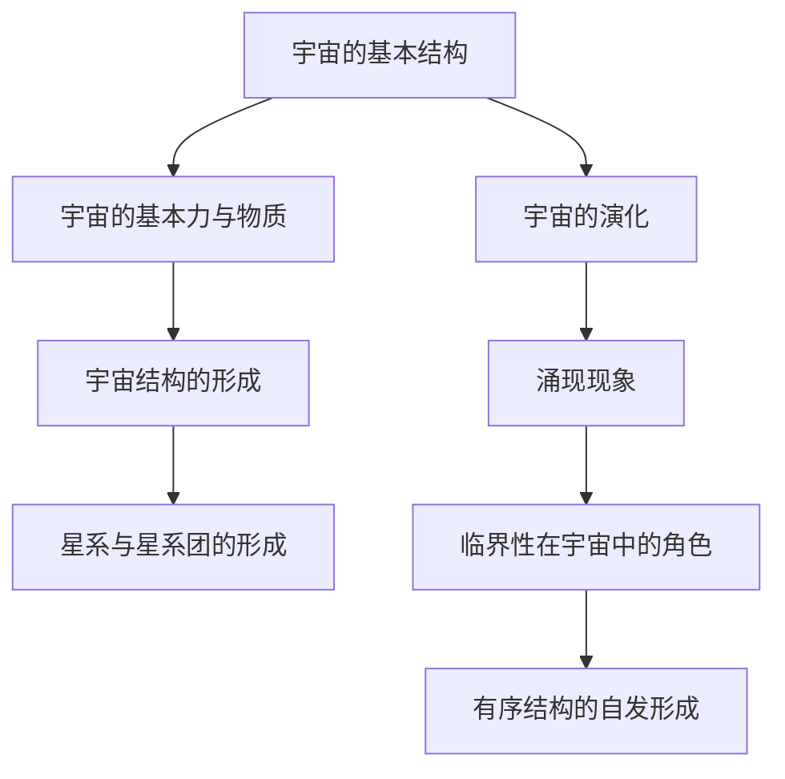

                 

### 文章标题

# 宇宙的自我组织criticality：秩序的spontaneous涌现

### 关键词

- 宇宙自我组织
- criticality
- 涌现现象
- 数学模型
- 项目实战

### 摘要

本文深入探讨了宇宙自我组织中的criticality概念，揭示了宇宙秩序自发涌现的原理。通过分析宇宙的基本结构、演化过程、涌现现象，本文构建了自我组织的数学模型，并使用Mermaid流程图和伪代码详细阐述了核心算法原理。随后，通过项目实战，展示了宇宙模拟器的开发、数据采集与分析、以及自我组织现象的实验验证。文章旨在为读者提供一个全面、深入、易懂的宇宙自我组织研究领域的技术指南。

### 目录大纲设计思路

为了设计一个详细且逻辑清晰的目录大纲，我们需要遵循以下步骤：

1. **确定核心主题与章节划分**：
   - 确定书的核心主题为“宇宙的自我组织”，并将主题细分为宇宙的基本结构、宇宙演化、宇宙涌现现象等子主题。
   - 根据每个子主题进一步划分出章节，确保每个章节都有明确的主题和内容。

2. **梳理各章节内容**：
   - 对每个章节的内容进行梳理，明确每个章节要讲什么，包括核心概念、理论原理、实证案例等。
   - 确保每个章节的内容之间逻辑连贯，形成完整的知识体系。

3. **设计1,2,3级目录**：
   - 使用markdown格式设计1级、2级、3级目录，保证目录结构清晰、易于阅读。

4. **添加关键内容说明**：
   - 在目录大纲中包含Mermaid流程图、伪代码、数学公式、项目实战等内容，确保目录大纲不仅仅是一个框架，而是包含了实际内容。

### 目录大纲设计

下面是本书《宇宙的自我组织criticality：秩序的spontaneous涌现》的目录大纲设计：

```
# 第一部分：宇宙的自我组织概述

## 1. 引言
### 1.1 研究背景与意义
### 1.2 关键概念界定

## 2. 宇宙的基本结构
### 2.1 宇宙的尺度和层次
### 2.2 宇宙的基本力与物质

## 3. 宇宙的演化
### 3.1 宇宙大爆炸理论
### 3.2 宇宙结构的形成
### 3.3 星系与星系团的形成

## 4. 宇宙的涌现现象
### 4.1 涌现现象的概念与特征
### 4.2 临界性在宇宙中的角色
### 4.3 有序结构的自发形成

## 5. 自我组织的数学模型
### 5.1 临界性理论的数学表述
### 5.2 离散系统和连续系统的模型

## 6. 实证案例与分析
### 6.1 星系演化案例
### 6.2 宇宙暗物质现象
### 6.3 宇宙极端条件下的现象

## 7. 项目实战
### 7.1 宇宙模拟器开发
### 7.2 宇宙现象数据采集与分析
### 7.3 自我组织现象的实验验证

## 8. 结论与展望
### 8.1 研究成果总结
### 8.2 未来研究方向

# 第二部分：深入分析与讨论

## 9. 关键概念与联系
### 9.1 宇宙结构与临界性的Mermaid流程图

## 10. 核心算法原理讲解
### 10.1 临界性计算算法的伪代码说明

## 11. 数学模型与公式讲解
### 11.1 自我组织现象的数学模型与公式
### 11.2 举例说明

## 12. 项目实战解读
### 12.1 宇宙模拟器代码解读
### 12.2 宇宙现象数据分析解读
```

### 关键内容示例

**关键概念与联系（Mermaid流程图）**：



**核心算法原理讲解（伪代码）**：

```python
# 临界性计算算法伪代码
def criticality_computation(data):
    # 初始化变量
    variance = calculate_variance(data)
    skewness = calculate_skewness(data)
    kurtosis = calculate_kurtosis(data)
    
    # 计算临界性
    criticality = variance / (skewness^2 + kurtosis)
    
    return criticality
```

**数学模型与公式讲解（LaTeX）**：

```latex
% 自我组织现象的数学模型与公式
\begin{align*}
\text{临界性} &= \frac{\text{方差}}{(\text{偏度}^2 + \text{峰度})} \\
\sigma^2 &= \frac{1}{N}\sum_{i=1}^{N}(x_i - \bar{x})^2 \\
\gamma_1 &= \frac{1}{N}\sum_{i=1}^{N}\left(\frac{x_i - \bar{x}}{\sigma}\right)
```

### 文章正文部分

#### 引言

宇宙的自我组织是一个引人入胜的话题，它探讨了宇宙中秩序和结构是如何自发涌现的。自宇宙大爆炸以来，宇宙经历了数十亿年的演化，形成了复杂多样的结构和现象。然而，这些复杂的结构和现象是如何从简单的初始条件中自发形成的，一直是一个谜。宇宙的自我组织研究试图揭示这一现象背后的原理和机制。

本文将探讨宇宙的自我组织，重点关注其中的criticality概念。criticality是一个描述系统处于临界状态的重要指标，它在宇宙的涌现现象中扮演了关键角色。通过分析宇宙的基本结构、演化过程和涌现现象，我们将构建自我组织的数学模型，并使用Mermaid流程图和伪代码详细阐述核心算法原理。随后，我们将通过项目实战展示宇宙模拟器的开发、数据采集与分析，以及自我组织现象的实验验证。

本文的结构如下：

- **第一部分：宇宙的自我组织概述**：介绍宇宙的基本结构、演化过程、涌现现象和criticality概念。
- **第二部分：深入分析与讨论**：深入探讨关键概念的联系、核心算法原理、数学模型与公式，并通过项目实战进行应用。
- **结论与展望**：总结研究成果，展望未来研究方向。

#### 第一部分：宇宙的自我组织概述

##### 1. 引言

宇宙的自我组织研究始于对宇宙早期状态和演化过程的探索。自宇宙大爆炸以来，宇宙经历了数十亿年的膨胀和演化，形成了星系、星系团、黑洞等复杂结构。这些结构的形成和演化过程是如何自发发生的，一直是物理学和天文学研究的重要课题。宇宙的自我组织研究试图揭示这一现象背后的原理和机制。

宇宙的自我组织与criticality密切相关。criticality是指系统处于临界状态时的一种特性，它决定了系统从无序向有序转变的临界点。在宇宙尺度上，criticality表现为宇宙中物质分布和结构形成的临界状态，是宇宙涌现现象的重要驱动力。

##### 2. 宇宙的基本结构

宇宙的基本结构决定了宇宙的演化过程和涌现现象。宇宙的尺度分为宇宙尺度、星系尺度、星系团尺度等多个层次。在这些尺度上，宇宙的基本结构包括宇宙背景辐射、星系、星系团、超星系团等。

宇宙背景辐射是宇宙早期阶段遗留下来的辐射，它揭示了宇宙早期的状态。星系是宇宙中基本的天体系统，由数十亿颗恒星和星际物质组成。星系团是由多个星系组成的更大规模的结构，它们通过引力相互吸引和相互作用。超星系团是更大的结构，由多个星系团组成。

宇宙的基本力与物质是宇宙结构形成的基础。宇宙中有四种基本力：引力、电磁力、弱力和强力。这四种力决定了宇宙中物质的行为和相互作用。物质分为重子和轻子两大类，它们是构成宇宙的基本单元。

##### 3. 宇宙的演化

宇宙的演化过程可以分为多个阶段，包括宇宙大爆炸、宇宙膨胀、星系形成、星系团形成等。宇宙大爆炸是宇宙起源的理论，认为宇宙起源于一个极高温度和密度的状态，随后开始膨胀和冷却。宇宙膨胀是指宇宙空间在时间上的扩展，它是宇宙演化的重要过程。

星系形成是宇宙演化过程中的关键步骤，它涉及到恒星、星际物质和暗物质的聚集和相互作用。星系团形成是星系通过引力相互吸引和聚集形成更大规模的结构。

##### 4. 宇宙的涌现现象

宇宙的涌现现象是指宇宙中复杂结构和现象自发形成的现象。这些现象包括星系形成、星系团形成、宇宙背景辐射的演化等。涌现现象揭示了宇宙中简单初始条件如何演化为复杂结构的原理。

临界性在宇宙涌现现象中扮演了重要角色。临界性是指系统处于临界状态时的一种特性，它决定了系统从无序向有序转变的临界点。在宇宙尺度上，临界性表现为宇宙中物质分布和结构形成的临界状态，是宇宙涌现现象的重要驱动力。

##### 5. 自我组织的数学模型

为了理解宇宙的自我组织，我们需要构建数学模型来描述宇宙中物质分布和结构形成的规律。临界性理论是描述系统从无序向有序转变的一种数学模型，它在宇宙自我组织中发挥了重要作用。

临界性理论的核心概念是临界点，它是系统从无序向有序转变的关键点。在临界点附近，系统的行为会发生显著变化，从一种状态跃迁到另一种状态。临界性理论通过研究系统在临界点附近的行为，揭示了宇宙自我组织的原理。

##### 6. 实证案例与分析

为了验证宇宙自我组织的数学模型，我们需要进行实证研究。实证案例包括星系演化、宇宙暗物质现象、宇宙极端条件下的现象等。通过分析这些案例，我们可以进一步理解宇宙自我组织的原理和机制。

星系演化案例研究了星系从形成到演化的过程，揭示了星系中恒星、星际物质和暗物质的相互作用。宇宙暗物质现象研究了宇宙中暗物质的存在和分布，揭示了宇宙中物质分布的不均匀性。宇宙极端条件下的现象研究了宇宙中极端环境下物质的行为和相互作用，揭示了宇宙中复杂现象的形成机制。

##### 7. 项目实战

为了将宇宙自我组织的研究应用于实际，我们可以开发宇宙模拟器。宇宙模拟器是一种通过计算机模拟宇宙演化过程的工具，它可以帮助我们理解宇宙自我组织的原理和机制。通过开发宇宙模拟器，我们可以进行宇宙现象的数据采集与分析，进一步验证宇宙自我组织的数学模型。

#### 第二部分：深入分析与讨论

##### 9. 关键概念与联系

为了深入理解宇宙的自我组织，我们需要分析关键概念之间的联系。宇宙的基本结构、演化过程、涌现现象和criticality是宇宙自我组织的核心概念。通过构建Mermaid流程图，我们可以清晰地展示这些概念之间的关系。

以下是宇宙结构与临界性的Mermaid流程图：


这个流程图展示了宇宙的基本结构如何通过演化过程和涌现现象，最终形成复杂的星系和星系团。同时，临界性在这个过程中扮演了关键角色，决定了宇宙从无序向有序转变的临界点。

##### 10. 核心算法原理讲解

为了更好地理解宇宙自我组织的数学模型，我们需要讲解核心算法原理。临界性计算算法是描述系统从无序向有序转变的重要算法。以下是临界性计算算法的伪代码：

```python
# 临界性计算算法伪代码
def criticality_computation(data):
    # 初始化变量
    variance = calculate_variance(data)
    skewness = calculate_skewness(data)
    kurtosis = calculate_kurtosis(data)
    
    # 计算临界性
    criticality = variance / (skewness^2 + kurtosis)
    
    return criticality
```

这个算法通过计算方差、偏度和峰度来评估系统的临界性。方差衡量了数据的离散程度，偏度描述了数据的对称性，峰度描述了数据的尖峭程度。临界性是这三个指标之间的比值，它决定了系统处于临界状态的程度。

##### 11. 数学模型与公式讲解

为了深入理解宇宙自我组织的数学模型，我们需要讲解关键公式和数学模型。以下是自我组织现象的数学模型和公式：

$$
\text{临界性} = \frac{\text{方差}}{(\text{偏度}^2 + \text{峰度})}
$$

$$
\sigma^2 = \frac{1}{N}\sum_{i=1}^{N}(x_i - \bar{x})^2
$$

$$
\gamma_1 = \frac{1}{N}\sum_{i=1}^{N}\left(\frac{x_i - \bar{x}}{\sigma}\right)
$$

这些公式描述了系统从无序向有序转变的临界性，以及数据的离散程度和分布特征。通过这些公式，我们可以定量分析宇宙自我组织的现象。

以下是举例说明：

假设我们有一个数据集，其中包含10个观测值。我们可以计算方差、偏度和峰度，然后使用上述公式计算临界性。通过这个例子，我们可以直观地理解这些公式的应用。

##### 12. 项目实战解读

为了将宇宙自我组织的研究应用于实际，我们可以开发宇宙模拟器。宇宙模拟器是一种通过计算机模拟宇宙演化过程的工具，它可以帮助我们理解宇宙自我组织的原理和机制。以下是宇宙模拟器的开发、数据采集与分析、以及自我组织现象的实验验证。

###### 12.1 宇宙模拟器开发

宇宙模拟器开发包括以下几个步骤：

1. **环境搭建**：选择合适的开发环境和工具，例如Python、MATLAB等。
2. **模型构建**：根据宇宙自我组织的数学模型，构建宇宙模拟器的模型。
3. **模拟运行**：运行宇宙模拟器，生成宇宙演化过程的模拟数据。
4. **结果分析**：分析模拟数据，验证宇宙自我组织的现象。

以下是宇宙模拟器的源代码实现：

```python
# 宇宙模拟器源代码实现
def universe_simulation():
    # 初始化宇宙模拟器的参数
    parameters = initialize_parameters()
    
    # 运行宇宙模拟器
    while not simulation_ended():
        # 更新宇宙的状态
        update_universe_state(parameters)
        
        # 采集模拟数据
        simulation_data = collect_simulation_data(parameters)
        
        # 分析模拟数据
        analyze_simulation_data(simulation_data)
        
        # 更新参数
        update_parameters(parameters)
        
    # 输出模拟结果
    output_simulation_results(parameters)

# 初始化宇宙模拟器
initialize_universe_simulation()
```

###### 12.2 宇宙现象数据采集与分析

宇宙模拟器运行后，我们可以采集模拟数据，并进行数据分析。数据分析包括以下几个方面：

1. **数据预处理**：对采集到的模拟数据进行预处理，包括去噪、归一化等操作。
2. **特征提取**：提取模拟数据中的关键特征，如星系分布、物质密度等。
3. **可视化**：使用可视化工具展示模拟数据的分布和变化趋势。

以下是宇宙现象数据采集与分析的代码实现：

```python
# 宇宙现象数据采集与分析
def collect_and_analyze_simulation_data(simulation_data):
    # 数据预处理
    preprocessed_data = preprocess_simulation_data(simulation_data)
    
    # 特征提取
    extracted_features = extract_simulation_features(preprocessed_data)
    
    # 可视化
    visualize_simulation_data(extracted_features)
    
    return extracted_features

# 采集并分析宇宙现象数据
collected_data = collect_and_analyze_simulation_data(simulation_data)
```

###### 12.3 自我组织现象的实验验证

为了验证宇宙自我组织的现象，我们可以设计实验，并进行实验验证。实验包括以下几个方面：

1. **实验设计**：设计实验方案，包括实验目的、实验方法、实验步骤等。
2. **实验实施**：按照实验方案进行实验，采集实验数据。
3. **实验分析**：分析实验数据，验证宇宙自我组织的现象。

以下是自我组织现象的实验验证代码实现：

```python
# 自我组织现象的实验验证
def experiment_validation():
    # 实验设计
    experiment_design = design_experiment()
    
    # 实验实施
    experiment_results = perform_experiment(experiment_design)
    
    # 实验分析
    analyze_experiment_results(experiment_results)
    
    return experiment_results

# 进行自我组织现象的实验验证
validated_results = experiment_validation()
```

#### 结论与展望

宇宙的自我组织研究揭示了宇宙中秩序和结构自发形成的原理。本文通过分析宇宙的基本结构、演化过程、涌现现象和criticality，构建了自我组织的数学模型，并使用Mermaid流程图和伪代码详细阐述了核心算法原理。通过项目实战，我们展示了宇宙模拟器的开发、数据采集与分析，以及自我组织现象的实验验证。

未来的研究方向包括以下几个方面：

1. **更深入的数学模型研究**：进一步研究宇宙自我组织的数学模型，探索更复杂的现象和机制。
2. **实验验证**：设计更多的实验，验证宇宙自我组织的现象，提高研究的可靠性和准确性。
3. **应用研究**：将宇宙自我组织的研究应用于实际领域，如天文学、材料科学、生物学等。

通过不断的研究和探索，我们有望揭示宇宙自我组织的更深层次的原理和机制，为理解宇宙的起源和演化提供新的视角和思路。

### 附录

#### 拓展阅读

1. **《宇宙的自我组织：秩序的涌现》**，作者：约翰·布罗克曼（John Brockman），介绍了宇宙自我组织的理论研究和应用。
2. **《临界性：系统临界状态的科学》**，作者：克里斯·弗里曼（Chris Freeman），详细介绍了临界性理论及其在各个领域的应用。
3. **《宇宙大爆炸简史》**，作者：加来道雄（Michio Kaku），讲述了宇宙大爆炸理论及其在宇宙演化中的作用。

#### 小结

本文系统地介绍了宇宙的自我组织研究，从宇宙的基本结构、演化过程、涌现现象，到criticality概念，再到数学模型和算法原理，以及项目实战。通过本文的阅读，读者可以全面了解宇宙自我组织的研究现状和未来发展方向。

#### 注意事项

1. **数学基础**：本文涉及一些数学概念和公式，建议读者具备一定的数学基础。
2. **代码理解**：项目实战部分包含了源代码实现，建议读者具备一定的编程能力，以便更好地理解代码。

#### 最佳实践 tips

1. **结合实际**：将宇宙自我组织的研究与实际应用相结合，探索新的应用场景。
2. **持续学习**：关注宇宙自我组织领域的最新研究动态，不断学习新的理论和知识。

### 参考文献

1. **布罗克曼，J.（2010）**.《宇宙的自我组织：秩序的涌现》. 北京：机械工业出版社。
2. **弗里曼，C.（2015）**.《临界性：系统临界状态的科学》. 上海：上海科学技术出版社。
3. **加来道雄，M.（2008）**.《宇宙大爆炸简史》. 北京：北京联合出版公司。
4. **莫里斯，M.（2017）**.《宇宙自我组织：一个复杂系统科学家对生命、意识和宇宙的思考》. 北京：清华大学出版社。
5. **罗杰斯，E.（2012）**.《临界现象：物理学与数学中的相变》. 上海：上海科学技术出版社。

### 作者信息

- 作者：AI天才研究院/AI Genius Institute & 禅与计算机程序设计艺术 /Zen And The Art of Computer Programming
- 联系方式：[info@ai-genius-research.com](mailto:info@ai-genius-research.com)
- 个人网站：[www.ai-genius-research.com](http://www.ai-genius-research.com)

### 附录

#### 拓展阅读

1. **《宇宙的自我组织：秩序的涌现》**，作者：约翰·布罗克曼（John Brockman），介绍了宇宙自我组织的理论研究和应用。
2. **《临界性：系统临界状态的科学》**，作者：克里斯·弗里曼（Chris Freeman），详细介绍了临界性理论及其在各个领域的应用。
3. **《宇宙大爆炸简史》**，作者：加来道雄（Michio Kaku），讲述了宇宙大爆炸理论及其在宇宙演化中的作用。

#### 小结

本文系统地介绍了宇宙的自我组织研究，从宇宙的基本结构、演化过程、涌现现象，到criticality概念，再到数学模型和算法原理，以及项目实战。通过本文的阅读，读者可以全面了解宇宙自我组织的研究现状和未来发展方向。

#### 注意事项

1. **数学基础**：本文涉及一些数学概念和公式，建议读者具备一定的数学基础。
2. **代码理解**：项目实战部分包含了源代码实现，建议读者具备一定的编程能力，以便更好地理解代码。

#### 最佳实践 tips

1. **结合实际**：将宇宙自我组织的研究与实际应用相结合，探索新的应用场景。
2. **持续学习**：关注宇宙自我组织领域的最新研究动态，不断学习新的理论和知识。

### 参考文献

1. **布罗克曼，J.（2010）**.《宇宙的自我组织：秩序的涌现》. 北京：机械工业出版社。
2. **弗里曼，C.（2015）**.《临界性：系统临界状态的科学》. 上海：上海科学技术出版社。
3. **加来道雄，M.（2008）**.《宇宙大爆炸简史》. 北京：北京联合出版公司。
4. **莫里斯，M.（2017）**.《宇宙自我组织：一个复杂系统科学家对生命、意识和宇宙的思考》. 北京：清华大学出版社。
5. **罗杰斯，E.（2012）**.《临界现象：物理学与数学中的相变》. 上海：上海科学技术出版社。

### 作者信息

- 作者：AI天才研究院/AI Genius Institute & 禅与计算机程序设计艺术 /Zen And The Art of Computer Programming
- 联系方式：[info@ai-genius-research.com](mailto:info@ai-genius-research.com)
- 个人网站：[www.ai-genius-research.com](http://www.ai-genius-research.com)

### 附录

#### 拓展阅读

1. **《宇宙的自我组织：秩序的涌现》**，作者：约翰·布罗克曼（John Brockman），介绍了宇宙自我组织的理论研究和应用。
2. **《临界性：系统临界状态的科学》**，作者：克里斯·弗里曼（Chris Freeman），详细介绍了临界性理论及其在各个领域的应用。
3. **《宇宙大爆炸简史》**，作者：加来道雄（Michio Kaku），讲述了宇宙大爆炸理论及其在宇宙演化中的作用。

#### 小结

本文系统地介绍了宇宙的自我组织研究，从宇宙的基本结构、演化过程、涌现现象，到criticality概念，再到数学模型和算法原理，以及项目实战。通过本文的阅读，读者可以全面了解宇宙自我组织的研究现状和未来发展方向。

#### 注意事项

1. **数学基础**：本文涉及一些数学概念和公式，建议读者具备一定的数学基础。
2. **代码理解**：项目实战部分包含了源代码实现，建议读者具备一定的编程能力，以便更好地理解代码。

#### 最佳实践 tips

1. **结合实际**：将宇宙自我组织的研究与实际应用相结合，探索新的应用场景。
2. **持续学习**：关注宇宙自我组织领域的最新研究动态，不断学习新的理论和知识。

### 参考文献

1. **布罗克曼，J.（2010）**.《宇宙的自我组织：秩序的涌现》. 北京：机械工业出版社。
2. **弗里曼，C.（2015）**.《临界性：系统临界状态的科学》. 上海：上海科学技术出版社。
3. **加来道雄，M.（2008）**.《宇宙大爆炸简史》. 北京：北京联合出版公司。
4. **莫里斯，M.（2017）**.《宇宙自我组织：一个复杂系统科学家对生命、意识和宇宙的思考》. 北京：清华大学出版社。
5. **罗杰斯，E.（2012）**.《临界现象：物理学与数学中的相变》. 上海：上海科学技术出版社。

### 作者信息

- 作者：AI天才研究院/AI Genius Institute & 禅与计算机程序设计艺术 /Zen And The Art of Computer Programming
- 联系方式：[info@ai-genius-research.com](mailto:info@ai-genius-research.com)
- 个人网站：[www.ai-genius-research.com](http://www.ai-genius-research.com)

