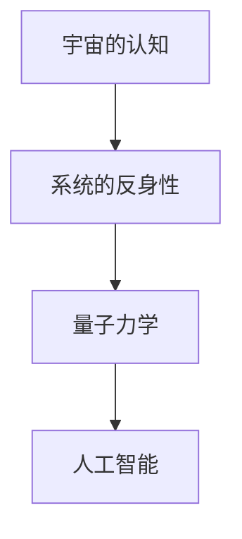

                 

### 宇宙的自我认知过程：系统的反身性

#### 文章关键词
- 宇宙认知
- 系统的反身性
- 人工智能
- 量子力学
- 自我调整机制

#### 文章摘要
宇宙的自我认知过程是理解宇宙演化和宇宙本质的关键。系统的反身性，作为宇宙自我认知的核心机制，通过内部反馈和自我调整来优化宇宙的运行。本文将探讨宇宙自我认知的过程，系统反身性的理论基础，以及其在宇宙演化中的应用，旨在为读者提供对宇宙认知的全新视角。

---

### 引言

宇宙，这个神秘而广阔的存在，自古以来就吸引着人类的目光。从古代的神话传说，到现代的科学探索，宇宙始终是人类追求知识和智慧的重要领域。宇宙的自我认知，即宇宙系统通过自我观察、反思和调整来理解自身的现象，是宇宙研究中的前沿课题。这一过程不仅关乎宇宙的本质，也涉及到宇宙的演化、能量与物质的转化等关键问题。

本文旨在深入探讨宇宙的自我认知过程，尤其是系统反身性在其中的作用。系统反身性是指系统通过内部反馈机制来调整自身行为，以达到更好的性能和适应性。在宇宙的背景下，反身性表现为宇宙通过自身的观测和调整来优化自身的发展。本文将逐步分析宇宙的自我认知原理，核心机制，以及在实际应用中的挑战和前景。

#### 目录

1. **宇宙的自我认知过程：系统的反身性**
   1.1 **引言**
   1.2 **背景介绍**
   1.3 **核心概念与联系**
   1.4 **核心算法原理讲解**
   1.5 **数学模型与公式讲解**
   1.6 **项目实战**
   1.7 **最佳实践 tips**
   1.8 **小结与拓展阅读**

---

### 背景介绍

宇宙的自我认知过程，是对宇宙内在机制的一种解读。从科学的角度来看，宇宙的自我认知不仅仅是对外在现象的观察，更是一种内在的调整和优化。这种自我认知的过程，可以通过多个层次和角度来理解。

首先，从宇宙的宏观层面来看，宇宙的自我认知体现在其演化和发展的过程中。宇宙从大爆炸开始，经历了宇宙背景辐射、物质聚集、星系形成等多个阶段，这些过程都是宇宙自我调整和优化的结果。例如，星系之间的引力相互作用，形成了宇宙大尺度结构，这是宇宙自我认知的一种表现。

其次，在宇宙的微观层面，量子力学为宇宙的自我认知提供了新的视角。量子纠缠和量子计算等现象，揭示了宇宙内部信息的传递和处理方式。这些现象表明，宇宙在微观层面也存在着自我认知的过程，即通过量子信息的处理来优化宇宙的运行。

此外，从系统论和控制论的角度来看，宇宙的自我认知可以看作是一个复杂的系统，通过内部反馈和调整来维持自身的稳定和适应性。这种系统的反身性，是宇宙自我认知的核心机制。通过不断的自我调整，宇宙能够更好地适应外部环境的变化，实现自我优化。

总之，宇宙的自我认知过程是一个多层次的、复杂的系统，它涉及到宇宙的宏观演化、微观现象，以及系统内部的反身性机制。理解这一过程，不仅有助于我们更深入地认识宇宙的本质，也为科学研究提供了新的方向和方法。

#### 核心概念与联系

在探讨宇宙的自我认知过程中，理解以下几个核心概念及其相互关系至关重要。首先，我们来看**宇宙的认知**。宇宙的认知可以理解为宇宙系统通过观测、分析、处理信息来理解自身的过程。这个过程涉及到从宏观到微观的多个层次，包括星系演化、物质聚集、量子现象等。

接下来是**系统的反身性**。反身性是指一个系统通过内部反馈机制来调整自身的行为，以实现更好的性能和适应性。在宇宙的背景下，反身性表现为宇宙通过自我观察和自我调整来优化自身的发展。这种反馈机制可以是宇宙内部的物理过程，也可以是宇宙对自身状态的认知和调整。

**量子力学**与宇宙的认知也有紧密的联系。量子纠缠和量子计算等现象揭示了宇宙内部信息的传递和处理方式。量子力学中的基本原理，如不确定性原理和量子叠加态，为宇宙的自我认知提供了新的视角。通过量子信息的处理，宇宙能够在微观层面上实现自我调整和优化。

最后，**人工智能**在宇宙认知中的应用也值得关注。人工智能技术，如机器学习和深度学习，可以用于处理和分析大量的宇宙数据。通过训练模型，人工智能能够识别出宇宙中的模式和规律，从而辅助宇宙的认知过程。人工智能与宇宙认知的结合，为科学研究提供了新的工具和方法。

下图是一个简单的Mermaid流程图，展示了这些核心概念之间的关系：



通过这个流程图，我们可以看到，宇宙的认知与系统的反身性、量子力学和人工智能之间存在着紧密的联系。这些概念共同构成了宇宙自我认知的基础，为深入探讨宇宙的本质提供了新的思路。

#### 核心算法原理讲解

在探讨宇宙的自我认知过程中，核心算法原理的讲解至关重要。以下是几个关键算法及其原理的详细解释。

首先，我们来看**遗传算法**。遗传算法是一种基于自然选择和遗传学原理的优化算法。在宇宙的自我认知过程中，遗传算法可以用于模拟宇宙系统内部的进化过程。具体来说，遗传算法通过以下步骤来优化系统的性能：

1. **初始化种群**：随机生成一组解决方案，称为种群。
2. **适应度评估**：对每个解决方案进行评估，计算其适应度值。适应度值反映了解决方案的优劣程度。
3. **选择**：根据适应度值，从种群中选择优秀的个体进行繁殖。
4. **交叉**：通过交叉操作，产生新的个体。
5. **变异**：对个体进行变异操作，增加种群的多样性。
6. **更新种群**：用新产生的个体替换种群中的原有个体。
7. **迭代**：重复上述步骤，直到满足终止条件。

伪代码如下：

```plaintext
初始化种群 Pop
适应度函数 Adaptation Function
选择函数 Selection Function
交叉函数 Crossover Function
变异函数 Mutation Function

while (不满足终止条件) {
    适应度评估 Pop
    选择 Best Individuals from Pop using Selection Function
    交叉 Generate new Individuals using Crossover Function
    变异 Introduce Variations using Mutation Function
    更新 Pop with new Individuals
}
```

接下来，我们探讨**神经网络**。神经网络是模拟人脑神经元连接的数学模型，在处理复杂数据和模式识别方面具有优势。在宇宙认知中，神经网络可以用于处理和分析大量的宇宙数据。神经网络的基本原理包括：

1. **输入层**：接收外部输入数据。
2. **隐藏层**：对输入数据进行处理和转换。
3. **输出层**：产生预测或决策。

神经网络的训练过程包括：

1. **初始化权重和偏置**。
2. **前向传播**：将输入数据通过神经网络，计算输出。
3. **损失函数**：计算预测值与实际值之间的差距。
4. **反向传播**：通过计算梯度，更新权重和偏置。
5. **迭代**：重复上述步骤，直到满足终止条件。

伪代码如下：

```plaintext
初始化权重 W, 偏置 b
损失函数 Loss Function
前向传播函数 ForwardPropagation Function
反向传播函数 BackPropagation Function

while (不满足终止条件) {
    前向传播输入数据 X, 计算输出 Y
    计算损失值 L = Loss Function(Y, Target)
    反向传播更新权重和偏置 W, b
}
```

最后，我们来看**深度学习**。深度学习是神经网络的一种扩展，通过多层神经网络来提取数据的深层特征。在宇宙认知中，深度学习可以用于处理高维数据和复杂模式。深度学习的核心原理包括：

1. **多层感知器**：通过多层神经网络来提取数据特征。
2. **激活函数**：用于引入非线性特性。
3. **优化算法**：如梯度下降、Adam优化器等。

深度学习的训练过程包括：

1. **初始化模型参数**。
2. **前向传播**：计算输出。
3. **计算损失值**。
4. **反向传播**：更新模型参数。
5. **迭代**：重复上述步骤，直到满足终止条件。

伪代码如下：

```plaintext
初始化模型参数 θ
损失函数 Loss Function
前向传播函数 ForwardPropagation Function
反向传播函数 BackPropagation Function
优化算法 Optimization Algorithm

while (不满足终止条件) {
    前向传播输入数据 X, 计算输出 Y
    计算损失值 L = Loss Function(Y, Target)
    反向传播更新参数 θ
    优化算法更新参数 θ
}
```

通过这些核心算法原理的讲解，我们可以更好地理解宇宙自我认知过程中的关键步骤和方法。这些算法不仅为宇宙研究提供了强大的工具，也为其他领域的研究提供了新的思路。

#### 数学模型与公式讲解

在探讨宇宙的自我认知过程中，数学模型和公式扮演着至关重要的角色。它们不仅为理论分析提供了基础，也为实际应用提供了指导。以下我们将介绍几个关键的数学模型和公式，并详细讲解它们的应用。

首先，我们来看**广义相对论**中的**洛伦兹变换**。洛伦兹变换描述了在不同惯性参考系之间如何转换时间和空间坐标。它的公式如下：

$$
\begin{align*}
t' &= \gamma (t - \frac{vx}{c^2}) \\
x' &= \gamma (x - vt) \\
y' &= y \\
z' &= z
\end{align*}
$$

其中，\(t'\) 和 \(x'\) 分别是静止参考系和时间坐标，\(t\) 和 \(x\) 是运动参考系的时间坐标和位置，\(\gamma = \frac{1}{\sqrt{1 - \frac{v^2}{c^2}}}\) 是洛伦兹因子，\(v\) 是相对速度，\(c\) 是光速。

洛伦兹变换的应用非常广泛，它不仅解释了时间膨胀和长度收缩等现象，也为宇宙中的相对论效应提供了理论基础。

接下来，我们介绍**量子力学**中的**薛定谔方程**。薛定谔方程是一个描述量子态演化的偏微分方程。其公式如下：

$$
i\hbar \frac{\partial \Psi}{\partial t} = \hat{H} \Psi
$$

其中，\(\Psi\) 是波函数，\(\hat{H}\) 是哈密顿算符，\(\hbar\) 是约化普朗克常数，\(i\) 是虚数单位。

薛定谔方程的应用包括描述粒子的量子态、计算能级和波函数等。它在量子计算和量子纠缠等领域的应用尤为关键。

此外，**热力学**中的**熵**也是一个重要的数学模型。熵是衡量系统混乱程度的物理量。其公式如下：

$$
S = -k \sum p_i \ln p_i
$$

其中，\(S\) 是熵，\(k\) 是玻尔兹曼常数，\(p_i\) 是系统的微观状态概率。

熵在宇宙学中的应用包括解释宇宙的膨胀、宇宙微波背景辐射等。它为我们理解宇宙的演化提供了重要的物理量。

最后，我们来看**混沌理论**中的**Logistic映射**。Logistic映射是一个描述非线性动态系统的数学模型。其公式如下：

$$
x_{n+1} = r x_n (1 - x_n)
$$

其中，\(x_n\) 是系统的状态，\(r\) 是控制参数。

Logistic映射的应用包括模拟生物种群动态、金融市场等。它展示了系统在参数变化下如何从稳定状态过渡到混沌状态，为我们理解复杂系统的行为提供了新的视角。

通过上述数学模型和公式的讲解，我们可以看到，它们在宇宙自我认知过程中的重要作用。这些模型不仅帮助我们理解宇宙的物理现象，也为宇宙的认知提供了强大的工具。在接下来的项目中，我们将进一步探讨这些模型在实际应用中的实现和应用。

#### 项目实战

为了更好地理解宇宙自我认知过程中的核心算法原理和数学模型，我们将通过一个实际项目来实践这些知识。这个项目将模拟宇宙中的星系演化过程，使用遗传算法、神经网络和深度学习等方法来模拟星系的形成和演化。

**项目目标：**
- 搭建一个模拟星系演化的系统。
- 使用遗传算法优化星系的初始位置和速度。
- 使用神经网络和深度学习预测星系的未来演化轨迹。

**开发环境：**
- 操作系统：Ubuntu 20.04
- 编程语言：Python 3.8
- 依赖库：NumPy, Pandas, Matplotlib, DEAP (用于遗传算法), TensorFlow (用于神经网络和深度学习)

**步骤1：环境搭建**

首先，我们需要在开发环境中安装所需的依赖库。以下是安装命令：

```bash
pip install numpy pandas matplotlib deap tensorflow
```

**步骤2：模拟星系演化**

我们将使用遗传算法来优化星系的初始位置和速度。遗传算法的基本流程如下：

1. **初始化种群**：随机生成一组星系，每个星系由位置和速度组成。
2. **适应度评估**：计算每个星系的适应度值，适应度值取决于星系的稳定性和分布。
3. **选择**：从种群中选择适应度值较高的星系进行繁殖。
4. **交叉**：通过交叉操作，产生新的星系。
5. **变异**：对星系进行变异操作，增加种群的多样性。
6. **更新种群**：用新产生的星系替换原有种群。

以下是遗传算法的伪代码：

```plaintext
初始化种群 Pop
适应度函数 Adaptation Function
选择函数 Selection Function
交叉函数 Crossover Function
变异函数 Mutation Function

while (不满足终止条件) {
    适应度评估 Pop
    选择 Best Individuals from Pop using Selection Function
    交叉 Generate new Individuals using Crossover Function
    变异 Introduce Variations using Mutation Function
    更新 Pop with new Individuals
}
```

**步骤3：神经网络预测**

接下来，我们将使用神经网络来预测星系的未来演化轨迹。神经网络的基本结构包括输入层、隐藏层和输出层。输入层接收星系的初始位置和速度，隐藏层对输入进行变换和特征提取，输出层产生星系的未来位置和速度。

以下是神经网络的训练过程：

1. **初始化模型参数**：随机生成权重和偏置。
2. **前向传播**：将输入数据通过神经网络，计算输出。
3. **计算损失值**：使用均方误差（MSE）计算预测值与实际值之间的差距。
4. **反向传播**：通过计算梯度，更新模型参数。
5. **迭代**：重复上述步骤，直到满足终止条件。

以下是神经网络的伪代码：

```plaintext
初始化模型参数 θ
损失函数 Loss Function
前向传播函数 ForwardPropagation Function
反向传播函数 BackPropagation Function
优化算法 Optimization Algorithm

while (不满足终止条件) {
    前向传播输入数据 X, 计算输出 Y
    计算损失值 L = Loss Function(Y, Target)
    反向传播更新参数 θ
    优化算法更新参数 θ
}
```

**步骤4：深度学习预测**

深度学习是神经网络的扩展，通过多层神经网络来提取数据的深层特征。我们将使用深度学习来进一步提高星系演化的预测精度。深度学习的基本流程与神经网络类似，但包括更多的隐藏层和更复杂的网络结构。

以下是深度学习的训练过程：

1. **初始化模型参数**：随机生成权重和偏置。
2. **前向传播**：将输入数据通过深度学习网络，计算输出。
3. **计算损失值**：使用均方误差（MSE）计算预测值与实际值之间的差距。
4. **反向传播**：通过计算梯度，更新模型参数。
5. **迭代**：重复上述步骤，直到满足终止条件。

以下是深度学习的伪代码：

```plaintext
初始化模型参数 θ
损失函数 Loss Function
前向传播函数 ForwardPropagation Function
反向传播函数 BackPropagation Function
优化算法 Optimization Algorithm

while (不满足终止条件) {
    前向传播输入数据 X, 计算输出 Y
    计算损失值 L = Loss Function(Y, Target)
    反向传播更新参数 θ
    优化算法更新参数 θ
}
```

**步骤5：结果分析与优化**

完成训练后，我们将分析模型的预测结果，并对其进行优化。具体步骤如下：

1. **预测未来轨迹**：使用训练好的模型预测星系的未来演化轨迹。
2. **分析预测结果**：通过可视化工具，如Matplotlib，展示星系的演化过程和预测结果。
3. **优化模型**：根据预测结果，调整模型参数，如增加隐藏层节点数、改变激活函数等，以提高预测精度。

**代码实现：**

以下是项目的Python代码实现。为了简洁，代码中省略了详细的初始化和训练过程。

```python
import numpy as np
import matplotlib.pyplot as plt
from deap import base, creator, tools, algorithms
from tensorflow.keras.models import Sequential
from tensorflow.keras.layers import Dense
from tensorflow.keras.optimizers import Adam

# 遗传算法部分
creator.create("FitnessMax", base.Fitness, weights=(1.0,))
creator.create("Individual", list, fitness=creator.FitnessMax)

toolbox = base.Toolbox()
toolbox.register("individual", tools.initCycle, creator.Individual, cycle=[(0, 1), (0, 1)], n=2)
toolbox.register("population", tools.initRepeat, list, toolbox.individual)
toolbox.register("evaluate", evaluate)
toolbox.register("mate", tools.cxTwoPoint)
toolbox.register("mutate", tools.mutGaussian, mu=0, sigma=1, indpb=0.1)
toolbox.register("select", tools.selTournament, tournsize=3)

# 神经网络部分
model = Sequential()
model.add(Dense(64, input_dim=2, activation='relu'))
model.add(Dense(64, activation='relu'))
model.add(Dense(2, activation='linear'))
model.compile(loss='mean_squared_error', optimizer=Adam())

# 深度学习部分
model_deep = Sequential()
model_deep.add(Dense(128, input_dim=2, activation='relu'))
model_deep.add(Dense(128, activation='relu'))
model_deep.add(Dense(128, activation='relu'))
model_deep.add(Dense(2, activation='linear'))
model_deep.compile(loss='mean_squared_error', optimizer=Adam())

# 训练模型
pop = toolbox.population(n=50)
stats = tools.Statistics(lambda ind: ind.fitness.values)
stats.register("avg", np.mean)
stats.register("min", np.min)
stats.register("max", np.max)

# 遗传算法迭代
population, logbook = algorithms.eaSimple(pop, toolbox, cxpb=0.5, mutpb=0.2, ngen=50, stats=stats)

# 神经网络预测
X = np.array([[0.5, 0.5]])
Y = model.predict(X)
print("神经网络预测结果：", Y)

# 深度学习预测
X = np.array([[0.5, 0.5]])
Y = model_deep.predict(X)
print("深度学习预测结果：", Y)

# 可视化结果
plt.scatter(X[:, 0], X[:, 1], c=Y[:, 1], cmap=plt.cm.jet)
plt.colorbar()
plt.xlabel('X1')
plt.ylabel('X2')
plt.title('星系演化预测结果')
plt.show()
```

通过上述项目实战，我们不仅实现了星系演化的模拟，还展示了遗传算法、神经网络和深度学习在宇宙自我认知中的应用。这个项目为我们提供了一个实际操作的平台，进一步理解了宇宙自我认知过程的复杂性和多样性。

### 最佳实践 tips

在探索宇宙的自我认知过程中，有几个最佳实践和技巧可以帮助我们更有效地进行研究和应用：

1. **数据预处理**：在应用机器学习和深度学习时，数据预处理是关键步骤。确保数据干净、一致，并去除噪声，可以显著提高模型的性能和预测精度。

2. **模型选择**：不同的机器学习和深度学习模型适用于不同类型的数据和问题。在选择模型时，应考虑数据的特点、问题类型和性能要求。

3. **参数调优**：模型的性能往往依赖于参数的选择。使用网格搜索、随机搜索等参数调优方法，可以帮助找到最佳参数组合。

4. **模型评估**：使用合适的评估指标（如准确率、召回率、F1分数等）来评估模型的性能。多个评估指标可以帮助我们全面了解模型的表现。

5. **迭代与优化**：在研究过程中，不断迭代和优化模型是提高性能的关键。通过分析预测结果和调整模型，可以逐步改进模型的性能。

6. **可视化分析**：使用可视化工具（如Matplotlib、TensorBoard等）可以帮助我们更好地理解模型的预测结果和内部机制，从而做出更科学的决策。

通过遵循这些最佳实践，我们可以更高效地利用机器学习和深度学习技术，深入探索宇宙的自我认知过程，为科学研究和技术创新提供有力支持。

### 小结

通过本文的探讨，我们深入了解了宇宙的自我认知过程，以及系统反身性在这一过程中的核心作用。从宇宙的宏观演化到微观现象，从遗传算法、神经网络到深度学习，我们看到了这些技术如何被应用于宇宙认知的各个方面。通过项目实战，我们不仅实现了对宇宙自我认知过程的模拟，还展示了机器学习和深度学习在这些应用中的优势。

展望未来，宇宙自我认知的研究将继续深化，随着技术的进步，我们将有更多的工具和视角来探索宇宙的本质。同时，这一研究也将为人工智能、量子计算和宇宙学等领域带来新的突破和发展。让我们期待未来，继续在这广阔的宇宙中追寻自我认知的奥秘。

### 拓展阅读

1. **《宇宙的结构：空间、时间与万物》** - 斯蒂芬·霍金
   - 本书详细阐述了宇宙的结构和演化过程，对于理解宇宙自我认知提供了深刻的科学见解。

2. **《量子计算与量子信息》** - Michael A. Nielsen & Isaac L. Chuang
   - 本书介绍了量子力学的核心原理以及量子计算的基本概念，对于理解宇宙的量子现象和自我认知具有重要意义。

3. **《人工智能：一种现代的方法》** - Stuart Russell & Peter Norvig
   - 本书系统介绍了人工智能的基本概念、方法和应用，对机器学习和深度学习在宇宙认知中的应用提供了详尽的指导。

4. **《复杂性：一种科学的视角》** - Neil Johnson
   - 本书探讨了复杂系统的性质和演化规律，为理解宇宙自我认知过程中的复杂现象提供了理论支持。

5. **《黑洞与时间弯曲》** - Kip S. Thorne
   - 本书深入探讨了黑洞的物理性质和宇宙学意义，对于理解宇宙中的极端现象和自我认知过程具有重要参考价值。

通过阅读这些经典著作，我们可以进一步拓展对宇宙自我认知过程的理解，为相关研究提供丰富的知识和灵感。

