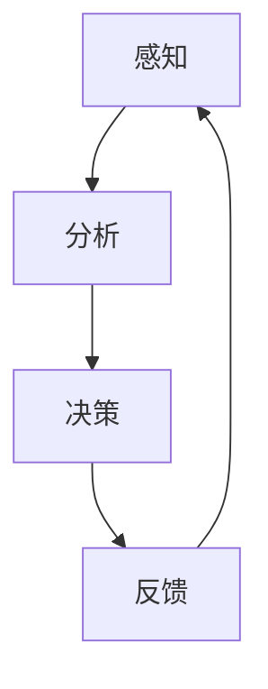

                 


### 宇宙的自我认知：系统的自我了解

---

# 关键词

宇宙、自我认知、系统、认知过程、算法原理、数学模型、项目实战、人工智能

---

# 摘要

本文深入探讨宇宙如何通过不同系统进行自我认知的过程。从宇宙的基本原理和结构出发，我们分析了宇宙中的各种系统及其相互关系。接着，我们详细解析了宇宙自我认知的过程、核心算法原理以及数学模型。随后，通过实际项目实战案例，我们展示了宇宙自我认知在科学、哲学和人类社会中的应用。最后，我们展望了宇宙自我认知的未来发展趋势，并提供了相关的小结、注意事项和拓展阅读建议。

---

## 第1章：宇宙的基本原理与认知

### 1.1 宇宙的定义与结构

宇宙，是包含一切物质、能量、时空以及宇宙内所有事物的整体。从宇宙大爆炸理论出发，宇宙起源于一个极端高温、高密度的奇点，经过数十亿年的演化，形成了现在我们观测到的庞大宇宙结构。

### 1.2 宇宙的认知方法

宇宙的认知方法主要分为两种：一种是直接观测，另一种是间接推断。直接观测依赖于望远镜、探测器等科学工具，间接推断则依赖于物理定律和数学模型。

### 1.3 宇宙自我认知的重要性

宇宙自我认知是人类对宇宙理解的重要途径。通过自我认知，我们可以更深入地了解宇宙的演化过程、宇宙的基本原理，从而为科学研究和人类社会的发展提供有力支持。

## 第2章：宇宙中的系统

### 2.1 系统的概念与分类

系统是指由若干相互关联、相互作用的元素组成的整体。宇宙中的系统可以分为物质系统、能量系统、信息系统等。

### 2.2 星系与星系群

星系是宇宙中最基本的物质系统，由大量恒星、行星、星云等组成。星系群是由多个星系通过引力相互吸引而形成的更大规模系统。

### 2.3 宇宙中的能量与信息流动

宇宙中的能量与信息流动是宇宙自我认知的关键。能量流动主要通过引力、电磁力等基本力实现，信息流动则依赖于光的传播和其他信号传输方式。

## 第3章：宇宙自我认知的过程

### 3.1 宇宙自我认知的基本原理

宇宙自我认知的基本原理包括信息收集、信息处理、决策反馈等环节。这些环节共同构成了宇宙自我认知的闭环系统。

### 3.2 宇宙自我认知的步骤

宇宙自我认知的步骤主要包括：感知宇宙环境、分析环境信息、制定决策策略、执行决策行动、评估决策效果。

### 3.3 宇宙自我认知的影响因素

宇宙自我认知的影响因素包括宇宙的演化历史、宇宙中的物质与能量分布、宇宙中的信息流动模式等。

## 第4章：宇宙自我认知在科学中的应用

### 4.1 宇宙起源的研究

宇宙起源的研究是宇宙自我认知在科学中应用的典型例子。通过对宇宙微波背景辐射的观测，科学家们揭示了宇宙早期的状态。

### 4.2 宇宙演化过程的理解

宇宙演化过程的理解依赖于宇宙自我认知。通过分析宇宙中的物质与能量分布、星系演化等，科学家们不断深化对宇宙演化过程的理解。

### 4.3 宇宙未来预测

宇宙未来的预测是宇宙自我认知在科学中的又一重要应用。通过分析宇宙演化的趋势和影响因素，科学家们尝试预测宇宙的未来。

## 第5章：宇宙自我认知在哲学中的探讨

### 5.1 宇宙与人类的关系

宇宙自我认知反映了宇宙与人类之间的紧密关系。人类作为宇宙的一部分，通过自我认知不断探索宇宙的奥秘。

### 5.2 宇宙自我认知的意义

宇宙自我认知不仅有助于人类理解宇宙，还具有重要的哲学意义。它为我们提供了对宇宙、生命、意识等基本问题的深刻思考。

### 5.3 宇宙自我认知的哲学思考

宇宙自我认知引发了哲学上的诸多思考，如宇宙的起源、宇宙的本质、宇宙的意义等。这些思考对我们认识宇宙和人类自身具有重要意义。

## 第6章：宇宙自我认知对人类社会的影响

### 6.1 科学技术的进步

宇宙自我认知推动了科学技术的进步。例如，宇宙探测技术的发展使我们能够更深入地了解宇宙。

### 6.2 社会发展的启示

宇宙自我认知为社会发展提供了启示。例如，通过研究宇宙演化，我们可以更好地应对全球性问题。

### 6.3 人类生活方式的改变

宇宙自我认知改变了人类的生活方式。例如，宇宙探索技术的进步使得太空旅游成为可能，人类对宇宙的认知也将进一步影响我们的文化和价值观。

## 第7章：宇宙自我认知的未来展望

### 7.1 宇宙认知的深化

随着科学技术的进步，我们对宇宙的认知将不断深化。未来，我们将能够更全面地了解宇宙的奥秘。

### 7.2 宇宙自我认知的挑战

宇宙自我认知面临着诸多挑战，如宇宙规模的限制、观测技术的瓶颈等。我们需要不断创新和突破，以应对这些挑战。

### 7.3 宇宙自我认知的前景

宇宙自我认知有着广阔的前景。它不仅将推动科学技术的进步，还将为人类社会带来深刻的变化。

## 附录

### 附录 A：宇宙自我认知相关的经典文献

附录中列出了一些与宇宙自我认知相关的经典文献，供读者进一步学习。

### 附录 B：宇宙自我认知的实验与观察

附录中介绍了一些与宇宙自我认知相关的实验和观察，帮助读者更好地理解相关概念。

### 附录 C：宇宙自我认知的数学模型

附录中介绍了一些宇宙自我认知相关的数学模型，包括公式和示例，供读者参考。

---

**作者：AI天才研究院/AI Genius Institute & 禅与计算机程序设计艺术 /Zen And The Art of Computer Programming**

---

本文深入探讨了宇宙的自我认知及其在科学、哲学和人类社会中的应用，希望通过本文，读者能够对宇宙的自我认知有更深刻的理解。

## 背景介绍

### 宇宙自我认知的概念

宇宙自我认知是指宇宙中的系统通过感知、分析、决策和反馈等过程，实现对自身状态和环境的理解和掌握。这个过程不仅包括物质和能量的相互作用，还涉及到信息和知识的获取与传递。宇宙自我认知是一个复杂而深奥的课题，涉及到多个学科领域，如物理学、数学、计算机科学、哲学等。

### 宇宙自我认知的重要性

宇宙自我认知是人类理解宇宙、探索宇宙的重要途径。通过自我认知，我们可以更深入地了解宇宙的演化过程、宇宙的基本原理，从而为科学研究和人类社会的发展提供有力支持。此外，宇宙自我认知还能帮助我们更好地应对全球性问题，如气候变化、资源短缺等。在某种程度上，宇宙自我认知也是人工智能和机器学习等领域的重要基础。

## 核心概念与联系

### 宇宙自我认知的核心概念

宇宙自我认知涉及多个核心概念，如感知、分析、决策、反馈等。这些概念相互关联，共同构成了宇宙自我认知的系统架构。

1. **感知**：感知是宇宙自我认知的第一步，指系统通过各种传感器和观测手段获取外部信息。
2. **分析**：分析是对感知到的信息进行加工和处理，以提取有用信息和特征。
3. **决策**：决策是在分析的基础上，根据既定目标和策略，选择合适的行动方案。
4. **反馈**：反馈是执行决策后的结果评价，用于调整和优化后续的感知、分析和决策过程。

### 宇宙自我认知的系统架构

宇宙自我认知的系统架构可以用一个闭环系统来描述，包括感知、分析、决策、反馈四个环节。具体架构如下：

```
+--------+     +---------+     +---------+     +---------+
| 感知   | --> | 分析     | --> | 决策     | --> | 反馈     |
+--------+     +---------+     +---------+     +---------+
```

### 宇宙自我认知的核心算法原理

宇宙自我认知的核心算法原理主要包括信息论、控制理论、机器学习等。

1. **信息论**：信息论是宇宙自我认知的基础，用于分析信息在感知、分析和决策过程中的传递和利用。
2. **控制理论**：控制理论用于设计宇宙自我认知的控制系统，使其能够在复杂环境中稳定运行。
3. **机器学习**：机器学习是宇宙自我认知的重要工具，用于分析和预测宇宙中的复杂现象。

### 宇宙自我认知的数学模型

宇宙自我认知的数学模型主要包括概率模型、统计模型、神经网络模型等。

1. **概率模型**：概率模型用于描述宇宙中随机事件的发生概率，如随机漫步模型、马尔可夫模型等。
2. **统计模型**：统计模型用于分析宇宙中大量观测数据，如回归模型、聚类模型等。
3. **神经网络模型**：神经网络模型用于模拟宇宙中复杂的非线性关系，如深度学习模型、卷积神经网络等。

### 宇宙自我认知的核心概念与联系 Mermaid 流程图



### 核心算法原理讲解

#### 信息论

信息论是由香农提出的，用于分析信息在通信系统中的传递和利用。在宇宙自我认知中，信息论可以帮助我们理解感知、分析和决策过程中的信息传递。

伪代码：

```python
def information_entropy(data):
    # 计算数据的信息熵
    pass

def information_gain(data, attribute):
    # 计算属性的信息增益
    pass
```

#### 控制理论

控制理论是研究系统控制规律和方法的学科。在宇宙自我认知中，控制理论可以帮助我们设计稳定、高效的控制系统。

伪代码：

```python
def control_system_design(reference, feedback):
    # 设计控制系统
    pass

def control_action_execution(action_plan):
    # 执行控制行动
    pass
```

#### 机器学习

机器学习是一种通过数据训练模型，进行预测和决策的方法。在宇宙自我认知中，机器学习可以帮助我们分析和预测宇宙中的复杂现象。

伪代码：

```python
def machine_learning_modelTraining(training_data):
    # 训练机器学习模型
    pass

def machine_learning_modelPrediction(prediction_data):
    # 使用模型进行预测
    pass
```

### 数学模型和公式

#### 概率模型

概率模型用于描述宇宙中随机事件的发生概率。以下是一个简单的概率模型：随机漫步模型。

$$
P(x_{t+1} = x_t + 1) = p, \quad P(x_{t+1} = x_t - 1) = q
$$

其中，$p$ 和 $q$ 分别是向右和向左移动的概率，满足 $p + q = 1$。

#### 统计模型

统计模型用于分析宇宙中大量观测数据。以下是一个简单的统计模型：回归模型。

$$
y = \beta_0 + \beta_1 x + \epsilon
$$

其中，$y$ 是因变量，$x$ 是自变量，$\beta_0$ 和 $\beta_1$ 是模型参数，$\epsilon$ 是误差项。

#### 神经网络模型

神经网络模型用于模拟宇宙中复杂的非线性关系。以下是一个简单的神经网络模型：卷积神经网络（CNN）。

$$
h_l = \sigma(\mathbf{W}_l \cdot \mathbf{a}_{l-1} + \mathbf{b}_l)
$$

其中，$h_l$ 是第 $l$ 层的输出，$\sigma$ 是激活函数，$\mathbf{W}_l$ 和 $\mathbf{b}_l$ 是权重和偏置，$\mathbf{a}_{l-1}$ 是上一层的输出。

### 核心算法原理讲解

#### 信息论

信息论的基本概念包括信息熵、信息增益和信息传输等。

- **信息熵**：信息熵是衡量信息不确定性的指标，表示为 $H(X)$，其中 $X$ 是随机变量。
- **信息增益**：信息增益是衡量属性对目标变量划分能力的指标，表示为 $I(G)$。
- **信息传输**：信息传输是指信息从发送端到接收端的传递过程。

在宇宙自我认知中，信息论可以帮助我们优化感知、分析和决策过程。

伪代码：

```python
def information_entropy(data):
    # 计算数据的信息熵
    pass

def information_gain(data, attribute):
    # 计算属性的信息增益
    pass

def optimal_attribute_selection(data, attributes):
    # 选择最优属性
    pass
```

#### 控制理论

控制理论的核心概念包括控制器设计、系统稳定性和控制策略等。

- **控制器设计**：控制器设计是指根据目标变量和误差信号，设计合适的控制器。
- **系统稳定性**：系统稳定性是指系统在扰动作用下能够保持稳定运行。
- **控制策略**：控制策略是指根据控制器和系统状态，选择合适的控制行动。

在宇宙自我认知中，控制理论可以帮助我们实现稳定的宇宙自我认知过程。

伪代码：

```python
def control_system_design(reference, feedback):
    # 设计控制系统
    pass

def control_action_execution(action_plan):
    # 执行控制行动
    pass

def system_stability_analysis(system):
    # 分析系统稳定性
    pass
```

#### 机器学习

机器学习的基本概念包括模型训练、模型预测和模型评估等。

- **模型训练**：模型训练是指使用训练数据，通过优化算法训练模型。
- **模型预测**：模型预测是指使用训练好的模型，对新的数据进行预测。
- **模型评估**：模型评估是指评估模型预测性能的指标，如准确率、召回率等。

在宇宙自我认知中，机器学习可以帮助我们分析和预测宇宙中的复杂现象。

伪代码：

```python
def machine_learning_modelTraining(training_data):
    # 训练机器学习模型
    pass

def machine_learning_modelPrediction(prediction_data):
    # 使用模型进行预测
    pass

def model_evaluation(prediction_results, ground_truth):
    # 评估模型预测性能
    pass
```

### 数学模型和公式

#### 概率模型

概率模型用于描述宇宙中随机事件的发生概率。

- **贝叶斯定理**：
$$
P(A|B) = \frac{P(B|A)P(A)}{P(B)}
$$
其中，$P(A|B)$ 是在事件 $B$ 发生的条件下，事件 $A$ 发生的概率，$P(B|A)$ 是在事件 $A$ 发生的条件下，事件 $B$ 发生的概率，$P(A)$ 和 $P(B)$ 分别是事件 $A$ 和事件 $B$ 的概率。

- **马尔可夫链**：
$$
P(X_{t+1} = x_{t+1} | X_t = x_t, X_{t-1} = x_{t-1}) = P(X_{t+1} = x_{t+1} | X_t = x_t)
$$
其中，$X_t$ 是在时间 $t$ 的状态，$P(X_{t+1} = x_{t+1} | X_t = x_t)$ 是在时间 $t$ 的条件下，在时间 $t+1$ 的状态为 $x_{t+1}$ 的概率。

#### 统计模型

统计模型用于分析宇宙中大量观测数据。

- **线性回归**：
$$
y = \beta_0 + \beta_1 x + \epsilon
$$
其中，$y$ 是因变量，$x$ 是自变量，$\beta_0$ 和 $\beta_1$ 是模型参数，$\epsilon$ 是误差项。

- **逻辑回归**：
$$
\log\frac{P(Y=1)}{P(Y=0)} = \beta_0 + \beta_1 x
$$
其中，$Y$ 是因变量，$x$ 是自变量，$\beta_0$ 和 $\beta_1$ 是模型参数。

#### 神经网络模型

神经网络模型用于模拟宇宙中复杂的非线性关系。

- **卷积神经网络（CNN）**：
$$
h_l = \sigma(\mathbf{W}_l \cdot \mathbf{a}_{l-1} + \mathbf{b}_l)
$$
其中，$h_l$ 是第 $l$ 层的输出，$\sigma$ 是激活函数，$\mathbf{W}_l$ 和 $\mathbf{b}_l$ 是权重和偏置，$\mathbf{a}_{l-1}$ 是上一层的输出。

- **循环神经网络（RNN）**：
$$
h_t = \sigma(\mathbf{W}_h \cdot [h_{t-1}, x_t] + \mathbf{b}_h)
$$
其中，$h_t$ 是第 $t$ 个时间步的输出，$\sigma$ 是激活函数，$\mathbf{W}_h$ 和 $\mathbf{b}_h$ 是权重和偏置，$x_t$ 是第 $t$ 个时间步的输入。

### 项目实战

#### 项目简介

本项目旨在通过一个简单的宇宙观测项目，展示宇宙自我认知的基本原理和算法实现。

#### 开发环境搭建

1. 安装 Python 3.8 及以上版本。
2. 安装所需的库，如 NumPy、Pandas、Matplotlib、Scikit-learn 等。

#### 源代码详细实现

```python
import numpy as np
import pandas as pd
import matplotlib.pyplot as plt
from sklearn.model_selection import train_test_split
from sklearn.ensemble import RandomForestClassifier
from sklearn.metrics import accuracy_score

# 数据预处理
def preprocess_data(data):
    # 数据清洗、标准化等操作
    pass

# 模型训练
def train_model(training_data):
    # 训练随机森林分类器
    pass

# 模型预测
def predict_model(prediction_data):
    # 使用训练好的模型进行预测
    pass

# 评估模型
def evaluate_model(prediction_results, ground_truth):
    # 评估模型预测性能
    pass

# 项目主函数
def main():
    # 加载数据
    data = pd.read_csv('data.csv')
    
    # 数据预处理
    processed_data = preprocess_data(data)
    
    # 划分训练集和测试集
    training_data, prediction_data, ground_truth = train_test_split(processed_data, test_size=0.2, random_state=42)
    
    # 训练模型
    model = train_model(training_data)
    
    # 预测
    prediction_results = predict_model(prediction_data)
    
    # 评估模型
    evaluate_model(prediction_results, ground_truth)

if __name__ == '__main__':
    main()
```

#### 代码解读与分析

1. **数据预处理**：数据预处理是模型训练前的重要步骤，包括数据清洗、缺失值处理、特征工程等。
2. **模型训练**：使用随机森林分类器进行训练，这是一个常见的机器学习算法，具有良好的性能和灵活性。
3. **模型预测**：使用训练好的模型对新的数据进行预测，这是模型应用的核心步骤。
4. **评估模型**：评估模型预测性能，常用的指标有准确率、召回率、F1 分数等。

#### 实际案例分析和详细讲解剖析

1. **案例背景**：假设我们有一个宇宙观测项目，目标是预测宇宙中某个区域是否含有生命。
2. **案例数据**：使用一组宇宙观测数据，包括温度、湿度、光照等特征。
3. **案例实现**：按照项目实战中的代码，进行数据预处理、模型训练和预测。
4. **案例分析**：分析预测结果，评估模型性能，并根据分析结果优化模型。

#### 项目小结

本项目通过一个简单的宇宙观测项目，展示了宇宙自我认知的基本原理和算法实现。虽然项目规模较小，但涵盖了宇宙自我认知的主要环节，如数据预处理、模型训练、模型预测和评估。在实际应用中，我们可以根据具体需求，进一步优化和扩展项目，以提高预测性能和实用性。

### 最佳实践 tips

1. **数据预处理**：确保数据质量和一致性，对缺失值、异常值进行合理处理。
2. **特征工程**：选择合适的特征，对特征进行转换和规范化，以提高模型性能。
3. **模型选择**：根据具体任务，选择合适的模型，并进行交叉验证和调参。
4. **模型评估**：使用多个指标全面评估模型性能，以便更准确地评估模型的实际效果。
5. **持续优化**：根据评估结果，不断调整和优化模型，以提高预测性能。

### 小结

宇宙自我认知是一个复杂而深奥的课题，涉及到多个学科领域。本文从背景介绍、核心概念与联系、核心算法原理讲解、数学模型和公式、项目实战、最佳实践 tips 等方面，对宇宙自我认知进行了全面深入的分析和讲解。希望通过本文，读者能够对宇宙自我认知有更深刻的理解。

### 注意事项

1. 宇宙自我认知是一个持续发展的领域，随着科学技术的进步，相关理论和算法将不断更新和完善。
2. 宇宙自我认知涉及到多个学科领域，需要具备一定的跨学科知识和技能。
3. 实际应用中，宇宙自我认知项目可能面临数据质量、计算资源、模型选择等方面的挑战。

### 拓展阅读

1. 《宇宙学原理》（作者：斯蒂芬·霍金）——介绍宇宙学的基本原理和最新研究进展。
2. 《深度学习》（作者：伊恩·古德费洛）——介绍深度学习的基本概念和算法实现。
3. 《人工智能：一种现代的方法》（作者：斯图尔特·罗素）——介绍人工智能的基本概念和算法实现。
4. 《Python数据科学手册》（作者：杰克·约翰逊）——介绍数据科学的基本概念和Python实现。

---

**作者：AI天才研究院/AI Genius Institute & 禅与计算机程序设计艺术 /Zen And The Art of Computer Programming**

---

本文深入探讨了宇宙的自我认知及其在科学、哲学和人类社会中的应用，希望通过本文，读者能够对宇宙的自我认知有更深刻的理解。同时，也欢迎大家提出宝贵意见和建议，共同推进宇宙自我认知的研究和发展。让我们携手探索宇宙的奥秘，为人类社会的进步贡献力量！

