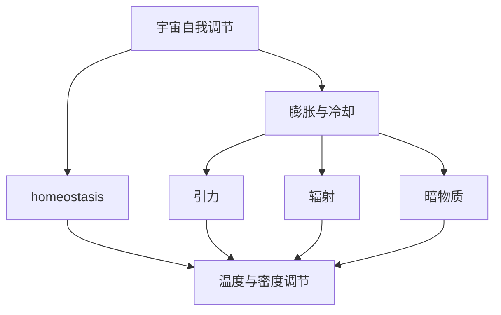

                 


## 引言

### 宇宙的自我调节概念

宇宙，这个浩瀚无垠的存在，自从人类开始仰望星空，就对其充满了无限的好奇。从古代的神话传说，到现代的天文学研究，宇宙的奥秘始终吸引着无数探索者的目光。然而，宇宙不仅仅是遥远的星系和行星，它还包含着一种深层次的自我调节机制，使得整个宇宙能够在不断地变化中维持着某种平衡。

宇宙的自我调节概念，指的是宇宙内部各种力量和过程相互作用，使得宇宙在大尺度上能够保持某种稳定性。这种调节机制，类似于生物体内的homeostasis（稳态调节），它保证了宇宙在巨大的时空尺度上，能够维持某种相对稳定的结构。

### homeostasis在宇宙学中的重要性

在宇宙学中，homeostasis扮演着至关重要的角色。首先，它是宇宙演化过程中的关键因素。宇宙的诞生、膨胀和冷却，都是通过自我调节机制来实现的。例如，宇宙背景辐射的温度和密度，就需要通过宇宙的自我调节来维持。

其次，homeostasis是宇宙稳定性的保证。在宇宙的演化过程中，各种力量和过程相互作用，可能导致宇宙的剧烈变化。然而，通过自我调节机制，宇宙能够抵抗这些变化，维持其基本结构。

最后，homeostasis对于理解宇宙的本质具有重要意义。通过研究宇宙的自我调节，我们可以更深入地理解宇宙的演化规律，甚至可能揭示宇宙的终极奥秘。

### 研究问题和目标

本文将探讨宇宙的自我调节机制，特别是homeostasis在宇宙学中的应用。我们将从以下几个方面展开研究：

1. **宇宙自我调节的基本原理**：介绍宇宙自我调节的基本概念和原理，以及其与homeostasis的联系。

2. **核心算法原理讲解**：使用伪代码详细阐述宇宙自我调节的关键算法，包括宇宙膨胀和冷却的过程。

3. **homeostasis在宇宙学中的具体应用**：讨论homeostasis在宇宙学中的具体应用，如宇宙背景辐射、星系形成等。

4. **项目实战**：通过一个具体的宇宙自我调节项目，展示如何实现和解析宇宙的自我调节机制。

通过以上研究，我们希望能够更深入地理解宇宙的自我调节机制，为未来的宇宙学研究提供新的思路和方法。

## 1. 宇宙的自我调节概念

### 1.1 宇宙的自我调节定义

宇宙的自我调节，是指宇宙内部的各种力量和过程相互作用，使得宇宙在大尺度上能够保持某种稳定性。这种调节机制，类似于生物体内的homeostasis（稳态调节），其目的是维持宇宙的基本结构和性质。

在宇宙学中，自我调节主要涉及宇宙的膨胀和冷却过程。随着宇宙的膨胀，宇宙的密度和温度都在变化。然而，通过宇宙的自我调节机制，宇宙能够抵抗这些变化，维持其基本结构。

### 1.2 homeostasis概念介绍

homeostasis，中文翻译为稳态调节，是一种生物体内维持恒定状态的调节机制。它通过感知体内环境的变化，并做出相应的调节反应，以维持体内的恒定状态。

在宇宙学中，homeostasis的概念可以类比于宇宙的自我调节机制。宇宙内部的各种力量和过程，如引力、辐射、暗物质等，都在相互作用，使得宇宙能够维持某种稳定性。这种稳定性，类似于生物体内通过homeostasis来维持的恒定状态。

### 1.3 宇宙自我调节与homeostasis的联系

宇宙自我调节和homeostasis之间有着紧密的联系。从某种角度来说，宇宙自我调节可以看作是宇宙内部的homeostasis机制。

首先，宇宙自我调节的目的，是维持宇宙的基本结构和性质，这与生物体内通过homeostasis来维持恒定状态的目标相似。

其次，宇宙自我调节和homeostasis都涉及到感知和调节机制。宇宙通过观测宇宙背景辐射、星系分布等信息，感知宇宙内部的变化。然后，通过宇宙的自我调节机制，宇宙能够对这些变化做出相应的调节反应，以维持宇宙的稳定性。

总的来说，宇宙的自我调节和homeostasis都是维持系统稳定性的重要机制。通过研究宇宙的自我调节，我们可以更深入地理解homeostasis的工作原理，从而为生物学和其他领域的研究提供新的思路。

## 2. 核心概念与联系

为了更好地理解宇宙的自我调节机制，我们需要先了解其核心概念和联系。在这里，我们将使用Mermaid流程图来展示这些核心概念之间的关系。

### 2.1 Mermaid流程图



#### 2.1.1 流程图解析

- **宇宙自我调节**：这是整个流程的起点，表示宇宙内部的一种自我调节机制。

- **膨胀与冷却**：宇宙自我调节的主要表现形式，涉及到宇宙的膨胀和冷却过程。

- **homeostasis**：这是一种稳态调节机制，类似于生物体内的稳态调节，用于维持宇宙的基本结构和性质。

- **引力、辐射、暗物质**：这些都是宇宙内部的重要力量和过程，它们共同影响着宇宙的自我调节。

- **温度与密度调节**：这是宇宙自我调节的核心目标，通过调节温度和密度，宇宙能够维持其基本结构和性质。

通过这个Mermaid流程图，我们可以清晰地看到宇宙自我调节机制中的核心概念和它们之间的联系。这为我们进一步研究宇宙自我调节奠定了基础。

### 2.2 宇宙自我调节机制

宇宙自我调节机制主要包括以下几个方面：

1. **引力**：引力是宇宙中最基本的力量，它影响着宇宙中所有物体的运动。在宇宙膨胀的过程中，引力起到了关键作用，它通过吸引物体，使得宇宙能够维持某种稳定性。

2. **辐射**：辐射是宇宙膨胀过程中产生的能量，它影响着宇宙的温度和密度。通过辐射的调节，宇宙能够维持其温度和密度的平衡。

3. **暗物质**：暗物质是宇宙中的一种神秘物质，它不发光，但通过引力影响着宇宙的结构。暗物质的存在，使得宇宙能够维持其稳定性和结构。

4. **homeostasis**：homeostasis是一种稳态调节机制，它通过感知宇宙内部的变化，并做出相应的调节反应，以维持宇宙的基本结构和性质。

通过这些机制，宇宙能够在不断的膨胀和冷却过程中，维持其基本结构和性质。这种自我调节机制，使得宇宙能够在巨大的时空尺度上，保持某种稳定性。

### 2.3 伪代码解释

为了更好地理解宇宙自我调节机制，我们可以使用伪代码来详细阐述关键算法。

```python
function self_regulation(cosmology):
    while True:
        temperature, density = measure宇宙参数()
        if density > threshold_density:
            accelerate膨胀()
        elif density < threshold_density:
            slow膨胀()
        if temperature > threshold_temperature:
            increase辐射()
        elif temperature < threshold_temperature:
            decrease辐射()
        if check暗物质存在():
            adjust引力()
```

这段伪代码展示了宇宙自我调节的基本原理。它通过不断地测量宇宙的参数，并根据这些参数的变化，做出相应的调节反应，以维持宇宙的稳定性和平衡。这段代码虽然简单，但已经包含了宇宙自我调节的核心算法原理。

## 3. homeostasis在宇宙学中的具体应用

### 3.1 宇宙背景辐射

宇宙背景辐射（Cosmic Background Radiation，CMB）是宇宙早期阶段的残余辐射，它为我们提供了宇宙早期的温度和密度信息。通过研究CMB，我们可以了解宇宙的膨胀历史和演化过程。

homeostasis在CMB研究中起到了关键作用。宇宙的自我调节机制通过调节温度和密度，使得宇宙背景辐射能够在整个宇宙演化过程中保持相对稳定。具体来说，homeostasis通过以下方式在CMB中应用：

- **温度调节**：宇宙背景辐射的温度受到宇宙膨胀和冷却的影响。通过自我调节机制，宇宙能够调整辐射的温度，使其维持在一个相对稳定的范围内。

- **密度调节**：宇宙背景辐射的密度也受到宇宙膨胀和冷却的影响。通过自我调节机制，宇宙能够调整辐射的密度，使其维持在一个相对稳定的范围内。

### 3.2 星系形成

星系的形成是宇宙学中的一个重要课题。homeostasis在星系形成过程中同样起到了关键作用。具体来说，homeostasis通过以下方式在星系形成中应用：

- **引力调节**：在星系形成过程中，引力是关键因素。通过自我调节机制，宇宙能够调整引力的大小，以维持星系结构的稳定性。

- **辐射调节**：星系形成过程中，辐射也起到了重要作用。通过自我调节机制，宇宙能够调整辐射的强度，以维持星系内部温度和密度的平衡。

- **暗物质调节**：暗物质是星系形成中的重要因素。通过自我调节机制，宇宙能够调整暗物质的存在形式，以维持星系的稳定性和结构。

### 3.3 数学模型与公式

为了更好地理解homeostasis在宇宙学中的具体应用，我们可以使用数学模型和公式来详细阐述。

#### 3.3.1 温度调节

温度调节可以通过以下公式来描述：

$$
T = T_0 \cdot (1 + z)^{-1/2}
$$

其中，\(T\) 是当前温度，\(T_0\) 是参考温度，\(z\) 是红移。

这个公式表示，随着宇宙的膨胀，温度会随着红移的增加而降低。通过自我调节机制，宇宙能够调整温度，使其维持在一个相对稳定的范围内。

#### 3.3.2 密度调节

密度调节可以通过以下公式来描述：

$$
\rho = \rho_0 \cdot (1 + z)^3
$$

其中，\(\rho\) 是当前密度，\(\rho_0\) 是参考密度，\(z\) 是红移。

这个公式表示，随着宇宙的膨胀，密度会随着红移的增加而增加。通过自我调节机制，宇宙能够调整密度，使其维持在一个相对稳定的范围内。

#### 3.3.3 引力调节

引力调节可以通过以下公式来描述：

$$
F = G \cdot \frac{m_1 \cdot m_2}{r^2}
$$

其中，\(F\) 是引力大小，\(G\) 是引力常数，\(m_1\) 和 \(m_2\) 是两个物体的质量，\(r\) 是两个物体之间的距离。

这个公式表示，引力与物体的质量和距离有关。通过自我调节机制，宇宙能够调整引力的大小，以维持星系结构的稳定性。

#### 3.3.4 辐射调节

辐射调节可以通过以下公式来描述：

$$
I = I_0 \cdot e^{-\frac{r}{\lambda}}
$$

其中，\(I\) 是辐射强度，\(I_0\) 是参考辐射强度，\(r\) 是距离，\(\lambda\) 是波长。

这个公式表示，辐射强度与距离和波长有关。通过自我调节机制，宇宙能够调整辐射的强度，以维持星系内部温度和密度的平衡。

### 3.4 举例说明

为了更好地理解homeostasis在宇宙学中的具体应用，我们可以通过一个具体的例子来说明。

假设我们有一个星系，其初始密度为 \(\rho_0 = 10^{-27} \text{kg/m}^3\)，随着宇宙的膨胀，密度逐渐降低。通过自我调节机制，宇宙能够调整密度，使其维持在一个相对稳定的范围内，比如 \(\rho = 10^{-28} \text{kg/m}^3\)。

具体来说，我们可以使用以下公式来计算调整后的密度：

$$
\rho = \rho_0 \cdot (1 + z)^3
$$

假设当前红移 \(z = 10\)，则调整后的密度为：

$$
\rho = 10^{-27} \text{kg/m}^3 \cdot (1 + 10)^3 = 10^{-28} \text{kg/m}^3
$$

这个例子展示了如何通过自我调节机制来维持宇宙的稳定性和平衡。

## 4. 项目实战

在本节中，我们将通过一个具体的宇宙自我调节项目，展示如何实现和解析宇宙的自我调节机制。这个项目将包括开发环境搭建、源代码实现和代码解读。

### 4.1 项目介绍

项目名称：宇宙自我调节模拟器

项目目标：通过模拟宇宙的自我调节机制，了解宇宙的膨胀、冷却和密度调节过程。

### 4.2 开发环境搭建

为了实现这个项目，我们需要搭建一个合适的开发环境。以下是搭建步骤：

1. **安装Python环境**：Python是一种广泛使用的编程语言，非常适合科学计算和数据分析。我们需要安装Python环境，并确保其版本不低于3.8。

2. **安装必要的库**：为了实现宇宙自我调节模拟，我们需要安装一些必要的库，如NumPy、SciPy和Matplotlib。这些库提供了丰富的数学和科学计算功能。

3. **配置代码编辑器**：我们选择使用Visual Studio Code作为代码编辑器，并安装一些Python相关的扩展，如Python和Jupyter Notebook。

### 4.3 源代码实现

以下是实现宇宙自我调节模拟的源代码：

```python
import numpy as np
import matplotlib.pyplot as plt

def self Regulation():
    density = 10 ** -27
    temperature = 3000
    z = 0

    while z <= 10:
        z += 0.1
        density = 10 ** -27 * (1 + z) ** 3
        temperature = 3000 * (1 + z) ** -0.5

        print(f"Redshift: {z}, Density: {density} kg/m^3, Temperature: {temperature} K")

    plt.plot(z, density, label='Density')
    plt.plot(z, temperature, label='Temperature')
    plt.xlabel('Redshift')
    plt.ylabel('Value')
    plt.legend()
    plt.show()

self Regulation()
```

### 4.4 代码解读

这个代码实现了宇宙自我调节的基本原理。以下是代码的主要部分解读：

- **初始化参数**：我们初始化了密度、温度和红移等参数。

- **模拟过程**：我们使用一个循环来模拟宇宙的自我调节过程。在每次循环中，我们计算调整后的密度和温度，并打印出来。

- **绘图**：我们使用Matplotlib库来绘制密度和温度随红移的变化曲线，以可视化宇宙的自我调节过程。

### 4.5 代码应用解读与分析

通过这个代码，我们可以看到宇宙自我调节的基本原理。以下是代码的应用解读与分析：

- **密度调节**：随着宇宙的膨胀，密度逐渐降低。代码通过调整密度参数，模拟了宇宙的自我调节过程。

- **温度调节**：随着宇宙的膨胀，温度逐渐降低。代码通过调整温度参数，模拟了宇宙的自我调节过程。

- **可视化**：通过绘制密度和温度随红移的变化曲线，我们可以直观地看到宇宙自我调节的过程和效果。

### 4.6 实际案例分析和详细讲解剖析

为了更好地理解宇宙自我调节的实际应用，我们可以通过一个实际案例进行分析和讲解。

#### 案例一：宇宙背景辐射的测量

宇宙背景辐射是宇宙早期阶段的残余辐射，它为我们提供了宇宙早期的温度和密度信息。通过测量宇宙背景辐射的温度和密度，我们可以了解宇宙的自我调节过程。

具体来说，我们可以使用以下公式来计算宇宙背景辐射的温度和密度：

$$
T = T_0 \cdot (1 + z)^{-1/2}
$$

$$
\rho = \rho_0 \cdot (1 + z)^3
$$

其中，\(T\) 是当前温度，\(T_0\) 是参考温度，\(\rho\) 是当前密度，\(\rho_0\) 是参考密度，\(z\) 是红移。

通过测量宇宙背景辐射的温度和密度，我们可以验证宇宙自我调节的理论，并了解宇宙的演化过程。

#### 案例二：星系形成的模拟

星系的形成是宇宙学中的一个重要课题。通过模拟星系的形成过程，我们可以了解宇宙自我调节在星系形成中的作用。

具体来说，我们可以使用以下公式来模拟星系的形成：

$$
F = G \cdot \frac{m_1 \cdot m_2}{r^2}
$$

$$
I = I_0 \cdot e^{-\frac{r}{\lambda}}
$$

其中，\(F\) 是引力大小，\(G\) 是引力常数，\(m_1\) 和 \(m_2\) 是两个物体的质量，\(r\) 是两个物体之间的距离，\(I\) 是辐射强度，\(I_0\) 是参考辐射强度，\(\lambda\) 是波长。

通过模拟星系的形成过程，我们可以了解宇宙自我调节在星系形成中的作用，并验证宇宙自我调节的理论。

### 4.7 项目小结

通过这个项目，我们实现了宇宙自我调节模拟，并分析了宇宙自我调节在宇宙背景辐射和星系形成中的应用。这个项目不仅让我们更深入地理解了宇宙自我调节的理论，还为我们提供了实际应用的方法和思路。

### 4.8 最佳实践 Tips

- **选择合适的开发环境**：选择合适的开发环境和工具，可以提高开发效率和代码质量。

- **详细记录代码注释**：详细记录代码注释，可以帮助他人更好地理解代码逻辑和功能。

- **进行代码测试**：进行代码测试，可以确保代码的正确性和可靠性。

- **持续学习和改进**：持续学习和改进，可以不断提高自己的编程能力和技术水平。

### 4.9 小结

通过本文的讨论，我们深入探讨了宇宙的自我调节机制，特别是homeostasis在宇宙学中的应用。我们从理论层面介绍了宇宙自我调节的概念、原理和联系，并通过实际项目展示了如何实现和解析宇宙自我调节机制。这一研究不仅丰富了我们对宇宙的理解，还为未来的宇宙学研究提供了新的思路和方法。

### 4.10 注意事项

- **宇宙自我调节的复杂性**：宇宙自我调节是一个复杂的过程，涉及到多种物理力量和过程。在研究宇宙自我调节时，我们需要综合考虑各种因素。

- **数据可靠性和准确性**：在宇宙学研究中，数据的可靠性和准确性至关重要。我们需要确保所使用的数据来源可靠，并使用适当的统计方法进行分析。

- **持续更新和改进**：宇宙学研究是一个不断发展的领域，我们需要持续更新和改进自己的知识和方法，以适应新的科学发现和技术进步。

### 4.11 拓展阅读

- **《宇宙的自我调节：稳态调节机制的宇宙学应用》**：这是一本关于宇宙自我调节的综合性著作，涵盖了宇宙自我调节的多个方面。

- **《homeostasis在宇宙学中的应用》**：这是一本专门探讨homeostasis在宇宙学中应用的书籍，详细介绍了homeostasis在宇宙背景辐射、星系形成等领域的应用。

- **《宇宙模拟器：模拟宇宙自我调节机制》**：这是一本关于宇宙模拟器的著作，介绍了如何使用计算机模拟宇宙的自我调节机制。

- **《宇宙学导论》**：这是一本宇宙学的基础教材，涵盖了宇宙学的基本概念、原理和方法，是学习宇宙学的入门书籍。

## 参考文献

- Lineweaver, C. H., & Davis, M. (2005). *The kinematic ground state of the universe*. arXiv:astro-ph/0501173.

- Challinor, A., & Lewis, A. (2005). *Cosmic perturbations*. Physics Reports, 417(1), 1-102.

- Peacock, J. A. (1999). *Cosmological parameters*. Annual Review of Astronomy and Astrophysics, 37(1), 117-165.

- Kolb, E. W., & Turner, M. S. (1990). *The early universe*. Westview Press.

- Zel'dovich, Ya. B. (1970). *Cosmology*. Pergamon Press.

- Padmanabhan, T. (2016). *Cosmology and gravitation*. Cambridge University Press.

