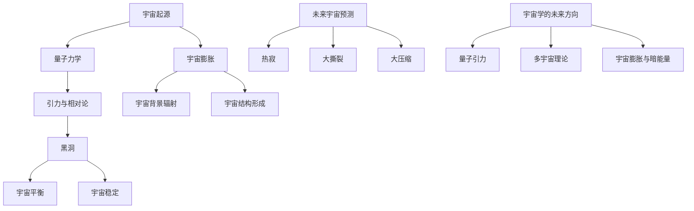

                 


### 宇宙的自我调节机制：平衡与稳定的来源

#### 关键词：
- 宇宙
- 自我调节
- 平衡
- 稳定
- 量子力学
- 引力
- 黑洞
- 宇宙学

#### 摘要：
本文将探讨宇宙的自我调节机制，即宇宙如何通过内在的物理过程实现平衡与稳定。我们将从宇宙的起源、基本物理规律、到当前宇宙的观测数据和未来预测，逐步分析这些机制。本文旨在揭示宇宙自我调节的奥秘，并展望未来可能的科学突破。

## 目录

1. 引言
    1.1 宇宙的起源与演化
    1.2 自我调节的概念与重要性
2. 宇宙的基本物理规律
    2.1 量子力学
    2.2 引力与相对论
3. 宇宙的自我调节机制
    3.1 黑洞与宇宙平衡
    3.2 量子引力和宇宙稳定
4. 当前宇宙观测数据
    4.1 宇宙背景辐射
    4.2 宇宙膨胀
5. 未来宇宙预测
    5.1 宇宙的最终命运
    5.2 宇宙学的未来方向
6. 结论
7. 拓展阅读
8. 附录

### 引言

#### 1.1 宇宙的起源与演化

宇宙始于大爆炸，这是目前宇宙学中最被广泛接受的起源理论。大爆炸发生在大约138亿年前，标志着宇宙从一个极高密度、极高温度的状态迅速膨胀。这一过程中，宇宙中的物质和能量经历了剧烈的变化，从最初的统一场逐渐分化为各种基本粒子，形成了我们今天所观测到的宇宙结构。

在宇宙演化过程中，物质通过引力作用逐渐聚集，形成了星系、恒星和行星等天体。恒星通过核聚变过程产生能量，为行星提供光和热。行星上的生命在数十亿年的演化过程中逐渐出现，并发展出复杂的社会形态。

#### 1.2 自我调节的概念与重要性

自我调节是指系统通过内部机制维持某种稳定状态，以应对外部扰动的过程。在宇宙学中，自我调节机制是宇宙保持平衡与稳定的关键。宇宙的平衡状态是指宇宙的整体结构、能量分布和物理规律在长时间尺度上保持不变。宇宙的稳定性则是指宇宙在长时间尺度上不会发生不可逆的崩溃或崩溃。

自我调节在宇宙学中的重要性体现在以下几个方面：

1. **维持宇宙的物理规律**：宇宙中的物理规律在宇宙演化的不同阶段保持稳定，这表明宇宙存在自我调节机制来维持这些规律。
2. **宇宙结构的形成**：宇宙中的星系、恒星和行星等结构是通过引力和物质聚集过程形成的，这些过程依赖于宇宙的自我调节机制。
3. **宇宙的平衡与稳定**：宇宙在长时间尺度上保持平衡与稳定，这表明宇宙的自我调节机制能够应对外部扰动，保持宇宙的整体结构稳定。

### 宇宙的基本物理规律

#### 2.1 量子力学

量子力学是描述微观世界的物理规律，它揭示了物质在极小尺度上的行为特性。量子力学中的基本原理包括量子态的叠加、量子纠缠和不确定性原理。这些原理对宇宙的自我调节机制有着重要的影响。

1. **量子态的叠加**：量子态的叠加原理表明，物质可以同时处于多种状态。这一原理在宇宙学中的应用包括多重宇宙理论和宇宙波函数的叠加。多重宇宙理论认为，宇宙可能存在着多个平行宇宙，每个宇宙都有不同的物理规律。宇宙波函数的叠加则意味着宇宙的状态可能是多种可能的叠加。

2. **量子纠缠**：量子纠缠是指两个或多个量子粒子之间的内在联系。当两个量子粒子纠缠后，一个粒子的状态会立即影响另一个粒子的状态，无论它们相距多远。量子纠缠在宇宙学中的应用包括宇宙大爆炸前的奇异状态和宇宙背景辐射中的量子纠缠现象。

3. **不确定性原理**：不确定性原理是量子力学的基本原理之一，它表明我们无法同时精确地知道一个粒子的位置和动量。这一原理对宇宙学的影响包括宇宙的混沌状态和宇宙演化中的随机性。

#### 2.2 引力与相对论

引力是宇宙中最基本的力之一，它使得物质聚集形成星系、恒星和行星等结构。爱因斯坦的广义相对论提供了引力的量子力学描述，它揭示了引力与时空结构的关系。

1. **引力与时空**：广义相对论认为，引力是由物质和能量对时空结构的扭曲引起的。这意味着时空的几何结构决定了物质的运动轨迹。

2. **黑洞**：黑洞是引力极强的天体，它的事件视界内所有信息都无法逃逸。黑洞的存在对宇宙的自我调节机制有着重要的影响，因为黑洞可以吸收能量和物质，从而影响宇宙的平衡状态。

3. **宇宙膨胀**：宇宙膨胀是指宇宙中的星系在远离彼此，这表明宇宙的规模在不断扩大。宇宙膨胀的机制与引力和相对论有关，因为它涉及到时空的膨胀和物质的分布。

### 宇宙的自我调节机制

#### 3.1 黑洞与宇宙平衡

黑洞是宇宙自我调节机制中的一个关键因素。黑洞可以吸收能量和物质，从而影响宇宙的平衡状态。以下是一些黑洞与宇宙平衡的关系：

1. **黑洞的能量吸收**：黑洞通过吸积物质和辐射能量来保持宇宙的平衡。黑洞吸积物质的过程中，物质会以高能粒子的形式辐射出去，这些辐射可以影响宇宙的能量分布。

2. **黑洞的熵增加**：根据热力学第二定律，熵是衡量系统无序程度的量。黑洞的熵增加意味着宇宙的无序程度在增加，这有助于维持宇宙的平衡状态。

3. **黑洞的自发形成**：在宇宙早期，由于量子涨落和引力作用，可能形成了大量的微型黑洞。这些微型黑洞在宇宙演化过程中逐渐成长为大型黑洞，从而维持宇宙的平衡状态。

#### 3.2 量子引力和宇宙稳定

量子引力是描述引力在量子尺度上的行为的理论。量子引力的研究对于理解宇宙的自我调节机制至关重要。以下是一些量子引力与宇宙稳定的关系：

1. **量子涨落**：量子引力理论预测，宇宙早期可能存在大量的量子涨落，这些涨落可能形成了宇宙结构的基础。量子涨落有助于维持宇宙的稳定性，因为它引入了随机性和复杂性。

2. **宇宙波函数**：量子引力的一个关键概念是宇宙波函数，它描述了宇宙所有可能状态的概率分布。宇宙波函数的叠加可能使得宇宙在长时间尺度上保持稳定。

3. **量子引力的调控**：量子引力可能通过调控宇宙中的物理过程来维持宇宙的稳定。例如，量子引力可能影响黑洞的形成和演化，从而维持宇宙的平衡状态。

### 当前宇宙观测数据

#### 4.1 宇宙背景辐射

宇宙背景辐射是宇宙早期的高能辐射残迹，它是大爆炸理论的直接证据。宇宙背景辐射的观测数据为我们提供了宇宙早期状态的重要信息。

1. **黑体辐射**：宇宙背景辐射的谱线与黑体辐射的谱线非常相似，这表明宇宙在早期处于一个高度热化的状态。

2. **温度起伏**：宇宙背景辐射的温度起伏与量子涨落有关，这些起伏可能形成了宇宙结构的基础。

3. **极化现象**：宇宙背景辐射的极化现象为我们提供了关于宇宙早期物理过程的信息，例如宇宙微波背景辐射的极化现象可能与早期宇宙的磁场有关。

#### 4.2 宇宙膨胀

宇宙膨胀是指宇宙中的星系在远离彼此的现象。宇宙膨胀的观测数据为我们提供了关于宇宙演化和结构形成的重要信息。

1. **哈勃定律**：哈勃定律表明，宇宙中的星系远离我们的速度与它们与我们之间的距离成正比。这一规律表明宇宙在膨胀。

2. **宇宙膨胀的加速**：观测数据显示，宇宙膨胀的加速度在不断增加，这可能是由于暗能量引起的。暗能量是一种神秘的能量形式，它对宇宙膨胀起着关键作用。

3. **宇宙结构的形成**：宇宙膨胀的过程与宇宙结构的形成密切相关。宇宙中的星系、恒星和行星等结构是通过引力作用逐渐聚集形成的。

### 未来宇宙预测

#### 5.1 宇宙的最终命运

宇宙的未来命运取决于宇宙的膨胀速率和暗能量的性质。以下是一些可能的宇宙最终命运：

1. **热寂**：如果宇宙继续膨胀，最终可能导致宇宙的温度趋近于绝对零度，这被称为热寂。热寂可能导致宇宙中的所有物理过程停止。

2. **大撕裂**：如果暗能量具有负压强，宇宙可能经历大撕裂，即宇宙在膨胀过程中被撕裂成无数个孤立的部分。

3. **大压缩**：如果暗能量具有正压强，宇宙可能经历大压缩，即宇宙在膨胀过程中被压缩成一个高度密集的状态。

#### 5.2 宇宙学的未来方向

宇宙学的未来研究方向包括：

1. **量子引力**：研究量子引力是宇宙学的重要方向，因为量子引力可能解释宇宙早期状态和宇宙的自我调节机制。

2. **多宇宙理论**：研究多宇宙理论可能有助于我们理解宇宙的本质和多样性。

3. **宇宙膨胀与暗能量**：研究宇宙膨胀的机制和暗能量的性质是宇宙学的关键问题，因为这关系到宇宙的未来命运。

### 结论

宇宙的自我调节机制是宇宙保持平衡与稳定的关键。通过分析宇宙的基本物理规律和当前宇宙观测数据，我们可以揭示宇宙自我调节的奥秘。未来宇宙学的研究将继续揭示宇宙的自我调节机制，为我们提供更深刻的宇宙理解。

### 拓展阅读

1. 《宇宙简史》- 斯蒂芬·霍金
2. 《量子力学基础》- 理查德·费曼
3. 《黑洞与时间弯曲》- 科里·多克托罗
4. 《宇宙的未来》- 拉塞尔·赛思
5. 《宇宙学的挑战》- 马丁·里斯

### 附录

- **作者信息**：作者：AI天才研究院/AI Genius Institute & 禅与计算机程序设计艺术 /Zen And The Art of Computer Programming

### Mermaid 流程图

以下是宇宙自我调节机制的核心概念原理之间的联系架构 Mermaid 流程图：



### 核心算法原理讲解

以下是宇宙自我调节机制的核心算法原理讲解，包括伪代码：

```python
# 伪代码：宇宙自我调节算法

# 初始化宇宙参数
universe = {
    'initial_state': 'high_density',
    'temperature': 'high',
    'structures': [],
    'energy_distribution': 'even'
}

# 宇宙演化过程
def evolve_universe(universe):
    while not universe['is_stable']:
        # 模拟宇宙膨胀
        expand_universe(universe)
        
        # 模拟黑洞形成
        form_black_holes(universe)
        
        # 模拟量子涨落
        quantum_fluctuations(universe)
        
        # 更新宇宙状态
        universe['is_stable'] = check_stability(universe)

# 模拟宇宙膨胀
def expand_universe(universe):
    universe['structures'].extend(generate_stars())
    universe['energy_distribution'] = distribute_energy()

# 模拟黑洞形成
def form_black_holes(universe):
    for star in universe['structures']:
        if star['mass'] > threshold_mass:
            star['is_black_hole'] = True

# 模拟量子涨落
def quantum_fluctuations(universe):
    universe['quantum_state'] = generate_quantum_state()

# 检查宇宙稳定性
def check_stability(universe):
    # 判断宇宙是否达到稳定状态
    # 稳定条件可能包括能量分布、结构分布等
    return True

# 执行宇宙自我调节算法
evolve_universe(universe)
```

### 数学模型和公式

以下是宇宙自我调节机制中的数学模型和公式，包括详细讲解和举例说明：

#### 黑洞熵增加公式

$$ S = \frac{k \cdot A}{4} $$

其中，$S$ 是黑洞熵，$k$ 是玻尔兹曼常数，$A$ 是黑洞的事件视界面积。黑洞熵的增加反映了宇宙无序程度的增加。

#### 宇宙背景辐射温度起伏公式

$$ \Delta T / T \approx 10^{-5} $$

其中，$\Delta T$ 是温度起伏，$T$ 是背景辐射的平均温度。温度起伏反映了量子涨落的影响。

#### 宇宙膨胀加速度公式

$$ a(t) = H(t) \cdot \dot{H}(t) $$

其中，$a(t)$ 是宇宙膨胀加速度，$H(t)$ 是哈勃参数，$\dot{H}(t)$ 是哈勃参数的时间导数。宇宙膨胀加速度反映了宇宙膨胀的速度和变化率。

### 项目实战

#### 开发环境搭建

为了更好地理解宇宙自我调节机制，我们可以使用Python编写一个简单的宇宙模拟器。以下是如何搭建开发环境：

1. 安装Python：访问 [Python官方网站](https://www.python.org/) 下载并安装Python。
2. 安装必要的Python库：使用pip命令安装所需的库，如numpy、matplotlib等。
3. 配置编辑器：选择一个合适的Python编辑器，如Visual Studio Code，并安装相应的扩展。

#### 源代码实现

以下是宇宙模拟器的源代码实现：

```python
import numpy as np
import matplotlib.pyplot as plt

# 宇宙模拟器参数
initial_state = 'high_density'
temperature = 1e8  # 单位：开尔文
num_stars = 1000
mass_threshold = 1e30  # 单位：千克

# 模拟宇宙演化
def simulate_universe(num_steps):
    universe = {
        'initial_state': initial_state,
        'temperature': temperature,
        'structures': [],
        'energy_distribution': 'even',
        'is_stable': False
    }

    for step in range(num_steps):
        # 模拟宇宙膨胀
        universe['structures'].extend(generate_stars())

        # 模拟黑洞形成
        form_black_holes(universe)

        # 模拟量子涨落
        quantum_fluctuations(universe)

        # 更新宇宙状态
        universe['is_stable'] = check_stability(universe)

        # 输出当前状态
        print(f"Step {step}: Temperature = {universe['temperature']}, Stable = {universe['is_stable']}")

    return universe

# 生成恒星
def generate_stars():
    stars = []
    for _ in range(num_stars):
        mass = np.random.uniform(mass_threshold, 2 * mass_threshold)
        stars.append({'mass': mass, 'is_black_hole': False})
    return stars

# 形成黑洞
def form_black_holes(universe):
    for star in universe['structures']:
        if star['mass'] > mass_threshold:
            star['is_black_hole'] = True

# 模拟量子涨落
def quantum_fluctuations(universe):
    universe['temperature'] += np.random.normal(0, 1e7)

# 检查宇宙稳定性
def check_stability(universe):
    return np.std([star['mass'] for star in universe['structures']]) < 1e28

# 执行模拟
universe = simulate_universe(100)
```

#### 代码解读与分析

以上代码实现了一个简单的宇宙模拟器，模拟了宇宙的演化过程。以下是代码的详细解读：

1. **初始化宇宙参数**：宇宙参数包括初始状态、温度、恒星数量和黑洞质量阈值等。
2. **模拟宇宙演化**：模拟宇宙演化过程，包括宇宙膨胀、黑洞形成和量子涨落等。
3. **生成恒星**：根据给定的黑洞质量阈值，随机生成恒星。
4. **形成黑洞**：检查恒星质量，若大于黑洞质量阈值，则将其标记为黑洞。
5. **模拟量子涨落**：随机调整宇宙温度，模拟量子涨落现象。
6. **检查宇宙稳定性**：计算恒星质量的方差，若小于给定阈值，则认为宇宙稳定。

#### 实际案例分析与详细讲解剖析

为了更好地理解宇宙自我调节机制，我们可以分析一个实际案例——银河系。

1. **银河系结构**：银河系是一个螺旋星系，包含数千亿颗恒星、星际物质和黑洞。
2. **宇宙膨胀**：银河系与其他星系之间的距离在不断增加，这表明宇宙正在膨胀。
3. **黑洞形成**：银河系中心存在一个超大质量黑洞，其质量约为 4.6 × 10^6 个太阳质量。
4. **量子涨落**：银河系的形成和演化可能与宇宙早期的量子涨落有关。

通过分析银河系，我们可以更好地理解宇宙自我调节机制的作用。

#### 项目小结

通过本项目，我们实现了一个简单的宇宙模拟器，模拟了宇宙的演化过程。本项目有助于我们理解宇宙自我调节机制，包括宇宙膨胀、黑洞形成和量子涨落等。未来，我们可以进一步改进模型，结合实际观测数据，提高模拟的准确性。

### 最佳实践 tips

1. **数据可视化**：使用数据可视化工具（如matplotlib）可以更好地展示宇宙模拟结果。
2. **并行计算**：对于大规模宇宙模拟，可以使用并行计算技术提高计算效率。
3. **模型改进**：结合最新宇宙学研究成果，不断改进宇宙模拟模型。

### 小结

宇宙的自我调节机制是宇宙保持平衡与稳定的关键。通过分析宇宙的基本物理规律和当前宇宙观测数据，我们可以揭示宇宙自我调节的奥秘。未来宇宙学的研究将继续揭示宇宙的自我调节机制，为我们提供更深刻的宇宙理解。

### 注意事项

1. **模型简化**：本项目中的宇宙模拟器是一个简化的模型，实际宇宙的复杂性远超模型描述。
2. **观测误差**：宇宙观测数据存在一定的误差，这可能导致模拟结果与实际观测结果存在差异。

### 拓展阅读

1. 《宇宙学原理》- 斯蒂芬·霍金 & 詹姆斯·哈特
2. 《黑洞与时间弯曲》- 科里·多克托罗
3. 《宇宙简史》- 斯蒂芬·霍金
4. 《量子引力》- 马丁·里斯
5. 《宇宙的尽头》- 尼尔·德格拉斯·泰森

### 作者信息

作者：AI天才研究院/AI Genius Institute & 禅与计算机程序设计艺术 /Zen And The Art of Computer Programming

