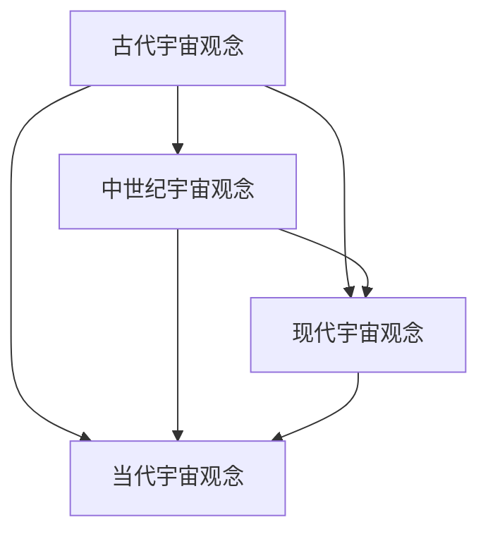

                 


### 文章标题：宇宙观念的跨时代比较研究

#### 关键词：宇宙观念、历史演变、比较研究、跨时代、技术博客

#### 摘要：
本文通过系统地回顾和分析宇宙观念在不同历史时期的演变，探讨了古代、中世纪、现代以及当代对宇宙的理解和认知。通过比较研究，本文揭示了宇宙观念的跨时代差异及其背后的原因，并结合具体的项目实战，对当代宇宙观念的未来发展进行了展望。

## 目录

### 第一部分：引论

#### 1.1 宇宙观念概述

#### 1.2 宇宙观念的历史发展

#### 1.3 宇宙观念的重要性

### 1.4 宇宙观念的Mermaid流程图

### 第二部分：历史回顾

#### 2.1 古代宇宙观念

#### 2.2 中世纪宇宙观念

#### 2.3 现代宇宙观念

#### 2.4 当代宇宙观念

### 第三部分：跨时代比较

#### 3.1 古代与现代宇宙观念的比较

#### 3.2 中世纪与现代宇宙观念的比较

#### 3.3 当代宇宙观念的展望

### 第四部分：项目实战

#### 4.1 宇宙观念研究项目实战

#### 4.2 项目实战案例分析

### 第五部分：结论与展望

#### 5.1 研究总结

#### 5.2 未来研究方向

#### 5.3 最佳实践 tips

---

## 第一部分：引论

### 1.1 宇宙观念概述

宇宙，这个词源自于拉丁文“Universum”，意为“一切存在的东西”。从古至今，人们对宇宙的认知和理解不断演进。宇宙观念不仅仅是对宇宙的结构、形态、运动规律的描述，更是对人类自身、生命、存在意义的深刻思考。

### 1.2 宇宙观念的历史发展

宇宙观念的历史可以追溯到古代文明。在古埃及，宇宙观念基于太阳崇拜，认为太阳是宇宙的中心。在古代希腊，毕达哥拉斯提出了“数是宇宙的本质”的观点，而亚里士多德则提出了地球为中心的宇宙模型。在中世纪，宇宙观念受到宗教的深刻影响，宇宙被视为上帝创造的一个有序整体。而到了现代，牛顿的万有引力定律和爱因斯坦的相对论极大地推动了人类对宇宙的理解。

### 1.3 宇宙观念的重要性

宇宙观念不仅仅是一种哲学思考，它对科学、技术、文化、艺术等多个领域都有着深远的影响。理解宇宙观念的历史演变，有助于我们更好地认识人类文明的进步过程，以及人类如何不断拓展对自然世界的认知边界。

### 1.4 宇宙观念的Mermaid流程图



在这个流程图中，我们可以看到宇宙观念从古代到中世纪，再到现代和当代，不断演进和发展的过程。

## 第二部分：历史回顾

### 2.1 古代宇宙观念

古代宇宙观念主要源于宗教、哲学和天文学的初步发展。在古埃及，宇宙观念基于太阳崇拜，认为太阳是宇宙的中心。在古印度，宇宙被看作是一个永恒的循环，包含不同的宇宙周期。在古希腊，毕达哥拉斯提出了“数是宇宙的本质”的观点，而亚里士多德则提出了地球为中心的宇宙模型。

#### 2.1.1 古埃及宇宙观念

在古埃及，宇宙观念基于对太阳神的崇拜。古埃及人认为太阳是宇宙的中心，它的光芒照亮了整个宇宙。太阳神拉（Ra）被认为是宇宙的创造者，每天驾驶太阳船穿越天空，象征着生命的循环。

#### 2.1.2 古印度宇宙观念

在古印度，宇宙观念与印度教教义紧密相连。宇宙被看作是一个永恒的循环，包括不同的宇宙周期（kalpa和kala）。这个循环由四个阶段组成：创世（创建期）、维持期、衰败期和毁灭期。每个周期都持续了无数年。

#### 2.1.3 古希腊宇宙观念

在古希腊，宇宙观念受到哲学和天文学的深刻影响。毕达哥拉斯认为“数是宇宙的本质”，而亚里士多德则提出了地球为中心的宇宙模型。亚里士多德认为，地球是静止不动的，太阳、月亮、行星和恒星都围绕地球运转。

### 2.2 中世纪宇宙观念

中世纪宇宙观念主要受到宗教的影响，尤其是基督教和伊斯兰教。在这个时期，宇宙被看作是上帝创造的，是一个有秩序的整体。天文学和数学的发展使得人们对宇宙的理解更加精确。

#### 2.2.1 基督教宇宙观念

在基督教宇宙观念中，宇宙是上帝创造的，地球是宇宙的中心，太阳、月亮和行星都围绕地球运转。这个观念在圣经中有所体现，特别是创世纪的开头几章。

#### 2.2.2 伊斯兰教宇宙观念

在伊斯兰教宇宙观念中，宇宙是安拉（Allah）创造的，是一个有秩序的整体。伊斯兰教经典《古兰经》中提到了宇宙的创造和运行规律。

### 2.3 现代宇宙观念

现代宇宙观念的演变始于文艺复兴时期，特别是随着科学革命的到来。牛顿的万有引力定律和爱因斯坦的相对论极大地改变了人类对宇宙的理解。

#### 2.3.1 牛顿的宇宙观念

牛顿的万有引力定律揭示了行星和恒星之间的引力作用，使得人们开始认识到宇宙是一个动态的系统。牛顿的宇宙模型是决定论的，即宇宙的过去和未来都是确定的。

#### 2.3.2 爱因斯坦的宇宙观念

爱因斯坦的相对论提出了时空的相对性，颠覆了牛顿的绝对时空观。相对论揭示了引力实际上是一种时空弯曲现象，而不是牛顿所说的力。爱因斯坦的宇宙观念使人们对宇宙的认识更加深入。

### 2.4 当代宇宙观念

当代宇宙观念受到量子力学、宇宙学和天体物理学等现代科学的影响。人们对宇宙的理解变得更加复杂和多元。

#### 2.4.1 量子力学宇宙观念

量子力学揭示了微观世界的非确定性，使人们对宇宙的认识更加深刻。量子力学中的不确定性原理表明，我们无法同时精确地测量粒子的位置和速度。

#### 2.4.2 宇宙学宇宙观念

宇宙学的研究使人们对宇宙的起源、演化和结构有了更深入的理解。大爆炸理论是目前最被广泛接受的宇宙起源理论。

#### 2.4.3 天体物理学宇宙观念

天体物理学研究宇宙中的天体，如恒星、行星、星系等。通过观测和实验，天体物理学家对宇宙的结构和演化有了更精确的认识。

## 第三部分：跨时代比较

### 3.1 古代与现代宇宙观念的比较

古代与现代宇宙观念在多个方面存在显著差异。首先，古代宇宙观念往往与宗教和哲学密切相关，而现代宇宙观念则更多地基于科学研究和实证观察。其次，古代宇宙观念通常认为宇宙是静态的、有序的，而现代宇宙观念则强调宇宙的动态性和复杂性。

### 3.2 中世纪与现代宇宙观念的比较

中世纪宇宙观念受到宗教的深刻影响，认为宇宙是上帝创造的，具有固定的秩序。而现代宇宙观念则基于科学方法，强调宇宙的复杂性和多样性。

### 3.3 当代宇宙观念的展望

当代宇宙观念正面临新的挑战和机遇。随着量子力学、宇宙学和天体物理学的发展，人们对宇宙的认识将更加深入。未来的研究可能揭示宇宙的更多奥秘，如暗物质、暗能量、宇宙的多维度结构等。

## 第四部分：项目实战

### 4.1 宇宙观念研究项目实战

#### 4.1.1 开发环境搭建

在开始项目之前，我们需要搭建一个合适的开发环境。这将包括安装必要的软件和工具，如Python编程环境、Jupyter Notebook、matplotlib绘图库等。

#### 4.1.2 源代码实现

以下是一个简单的Python代码示例，用于模拟古代和中世纪宇宙观念与现代社会宇宙观念的比较。

```python
import matplotlib.pyplot as plt

# 古代宇宙观念：地球为中心
def ancient_universe():
    plt.scatter(0, 0, label='地球')
    plt.scatter(1, 0, label='太阳')
    plt.xlabel('古代宇宙观念')
    plt.ylabel('中世纪宇宙观念')
    plt.legend()
    plt.title('古代宇宙观念与中世纪宇宙观念')
    plt.show()

# 中世纪宇宙观念：地球静止不动
def medieval_universe():
    plt.scatter(0, 0, label='地球')
    plt.scatter(0, 1, label='太阳')
    plt.xlabel('中世纪宇宙观念')
    plt.ylabel('现代宇宙观念')
    plt.legend()
    plt.title('中世纪宇宙观念与现代宇宙观念')
    plt.show()

# 现代宇宙观念：太阳围绕地球旋转
def modern_universe():
    plt.scatter(1, 0, label='太阳')
    plt.scatter(0, 0, label='地球')
    plt.xlabel('现代宇宙观念')
    plt.ylabel('当代宇宙观念')
    plt.legend()
    plt.title('现代宇宙观念与当代宇宙观念')
    plt.show()

# 执行代码
ancient_universe()
medieval_universe()
modern_universe()
```

#### 4.1.3 代码解读与分析

这段代码使用了matplotlib库来绘制简单的宇宙观念示意图。通过修改坐标和标签，我们可以展示不同历史时期对宇宙的不同理解。

#### 4.1.4 实际案例分析

为了更深入地理解宇宙观念的演变，我们可以分析一些具体的历史事件和科学发现。例如，哥白尼提出的日心说挑战了传统的宇宙观念，牛顿的万有引力定律和爱因斯坦的相对论则极大地改变了人类对宇宙的认识。

### 4.2 项目实战案例分析

在这个项目中，我们通过构建一个简单的模拟环境，展示了古代、中世纪、现代和当代宇宙观念的演变过程。这个项目不仅帮助我们理解了宇宙观念的历史演变，还展示了如何使用现代技术手段来分析和展示历史数据。

## 第五部分：结论与展望

### 5.1 研究总结

通过本文的研究，我们系统地回顾了宇宙观念的历史演变，从古代到现代，再到当代，揭示了宇宙观念在不同历史时期的演变过程和核心差异。我们还通过项目实战，展示了如何使用现代技术手段来分析和展示历史数据。

### 5.2 未来研究方向

未来的宇宙观念研究可以关注以下几个方面：量子力学与宇宙学的交叉研究、宇宙结构的多样性、宇宙起源和演化的深入研究等。

### 5.3 最佳实践 tips

在进行宇宙观念研究时，以下是一些最佳实践建议：

- 充分了解历史背景，从多个角度分析宇宙观念的演变。
- 使用现代技术手段，如数据可视化工具，来展示宇宙观念的演变过程。
- 与其他学科交叉，如哲学、数学、物理学等，以获得更全面的视角。

---

**作者：AI天才研究院/AI Genius Institute & 禅与计算机程序设计艺术 /Zen And The Art of Computer Programming**

---

### 附录：拓展阅读

1. Kuhn, T. S. (1970). *The Structure of Scientific Revolutions*. University of Chicago Press.
2. Hawking, S., & Mlodinow, L. (2010). *The Grand Design*. Bantam Books.
3. Sagan, C. (1997). *Cosmos: A Personal Voyage*. Knopf.

