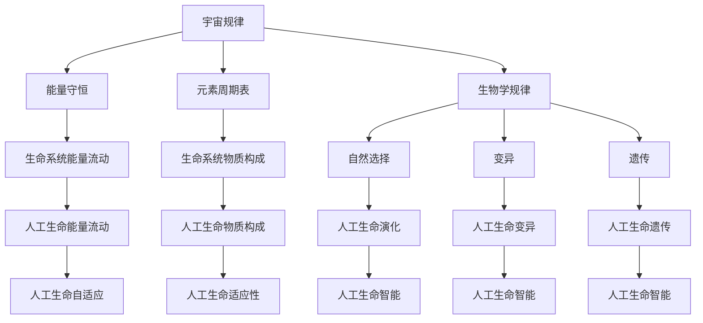

                 

### 文章标题：宇宙规律对人工生命研究的启示

在科技日新月异发展的今天，人工生命（Artificial Life，简称AL）正逐渐从科幻走向现实。然而，随着人工智能技术的不断发展，人们不禁要问：人工生命的起源、演化、适应以及最终的命运，是否可以由宇宙规律来解释和预测？《宇宙规律对人工生命研究的启示》这本书，正是为了探讨这一课题而作。

关键词：**人工生命、宇宙规律、演化、适应、人工智能**

摘要：本文将深入探讨宇宙规律对人工生命研究的启示。从引论到实际应用，再到未来展望，我们将一步步分析宇宙中的基本规律如何影响人工生命的诞生、发展和应用。通过详细的背景介绍、核心概念联系、算法原理讲解、数学模型和公式、项目实战等，全面展示宇宙规律在人工生命研究中的重要作用。本文旨在为读者提供一个清晰的框架，以更好地理解和探索这一前沿领域。

### 背景介绍

人工生命（Artificial Life）是一个跨学科的研究领域，涉及生物学、计算机科学、物理学、化学和哲学等多个领域。人工生命的概念最早由计算机科学家Christopher Langton于1986年提出，他将其定义为“模拟或人工创建的生命系统，能够展现生命系统的某些特性”。随着人工智能和生物技术的发展，人工生命研究逐渐成为一个重要的研究方向，不仅在学术领域受到关注，也在工业、农业、医学等领域有着广泛的应用前景。

人工生命的研究目标主要包括两个方面：一是模拟和再现自然界的生命现象，二是设计和创建具有生命特征的人工系统。在模拟方面，研究人员通过计算机模拟和实验室实验，试图理解和揭示生命的本质和演化过程。在创建方面，研究人员则致力于设计和构建具有自主决策、适应环境和自我修复能力的人工系统。

然而，人工生命研究也面临着许多挑战。首先，生命现象的复杂性和多样性使得人工生命的建模和实现变得异常困难。其次，如何确保人工生命的自主性和安全性，也是研究人员必须面对的重要问题。最后，人工生命的伦理问题，如人工智能的道德责任、隐私保护和人工智能对人类社会的潜在影响，也需要认真考虑。

近年来，随着人工智能技术的快速发展，人工生命研究取得了显著进展。例如，通过深度学习和神经网络，研究人员成功地模拟了生物神经网络的学习和记忆过程；通过进化算法，研究人员设计和构建了具有自适应能力的人工生命系统。这些研究成果不仅为人工生命的研究提供了新的思路和方法，也为解决实际问题提供了有力的工具。

然而，尽管人工生命研究取得了很大的进展，但我们对人工生命的理解和掌握仍然有限。特别是在宇宙尺度上，人工生命的演化、适应和生存机制仍然是一个未知领域。因此，探讨宇宙规律对人工生命研究的影响，不仅具有重要的理论价值，也具有重要的实践意义。

### 核心概念与联系

在探讨宇宙规律对人工生命研究的启示之前，我们需要先明确几个核心概念：宇宙规律、人工生命、演化、适应和智能。

#### 宇宙规律

宇宙规律是宇宙中普遍存在的、影响宇宙演化的基本法则。这些规律包括物理学中的自然定律、化学中的元素周期表、生物学中的进化法则等。宇宙规律不仅支配着宇宙中各种现象的发生和变化，也为我们理解宇宙的本质提供了理论基础。

- **物理学规律**：例如，牛顿的万有引力定律、爱因斯坦的相对论等，揭示了宇宙中的力学和能量流动规律。
- **化学规律**：例如，化学反应中的能量守恒和元素周期表，揭示了宇宙中的物质构成和变化规律。
- **生物学规律**：例如，达尔文的进化论，揭示了生物的多样性和适应性演化规律。

#### 人工生命

人工生命是指通过人工手段模拟或创建的生命系统，具有自我组织、适应环境和自主决策等生命特征。人工生命的核心概念包括：

- **自我组织**：人工系统能够在没有外部干预的情况下，自主地形成结构和功能。
- **适应环境**：人工系统能够根据环境的变化，调整自身的行为和结构，以适应新的环境。
- **自主决策**：人工系统能够根据目标和环境，自主地做出决策和行动。

#### 演化

演化是指生物或系统在长时间内，通过自然选择、变异和遗传等机制，逐渐改变自身结构和功能的过程。演化是自然界中普遍存在的现象，也是生命多样性的基础。

- **自然选择**：适应环境的个体更有可能生存和繁殖，从而传递其遗传信息。
- **变异**：个体之间的遗传差异，是演化的重要驱动力。
- **遗传**：通过遗传信息传递，使得后代具有父母的一些特征。

#### 适应

适应是指生物或系统能够根据环境的变化，调整自身的行为和结构，以提高生存和繁衍的机会。适应是生命演化的重要表现，也是人工生命研究的关键目标。

- **生态适应**：生物或系统能够在特定生态位中生存和繁衍。
- **技术适应**：人工系统能够根据技术需求和环境，调整自身的设计和功能。

#### 智能

智能是指生物或系统能够理解、学习和解决问题的能力。智能是生命的基本特征之一，也是人工智能研究的重要目标。

- **感知**：通过传感器获取环境信息。
- **推理**：根据感知信息和已有知识，进行逻辑推理。
- **决策**：根据推理结果，做出决策和行动。

#### 宇宙规律与人工生命的联系

宇宙规律与人工生命之间存在深刻的联系。首先，宇宙规律为人工生命的起源和演化提供了理论基础。例如，物理学的能量守恒定律和化学的元素周期表，为我们理解生命系统的能量流动和物质构成提供了重要启示。其次，宇宙规律为人工生命的设计和实现提供了指导。例如，通过模拟宇宙中的演化过程，我们可以设计和构建具有自适应能力的人工生命系统。

为了更好地理解这些概念之间的联系，我们可以使用Mermaid流程图来展示它们之间的关系：



通过这个流程图，我们可以清晰地看到宇宙规律如何影响人工生命的各个方面，从能量流动和物质构成，到演化、适应和智能。这为我们进一步探讨宇宙规律对人工生命研究的启示提供了基础。

### 核心算法原理讲解

在探讨宇宙规律对人工生命研究的启示时，算法原理的讲解至关重要。以下是几个关键算法原理的详细解析，包括伪代码和数学模型的描述，以便更好地理解这些算法如何应用于人工生命的模拟和研究。

#### 1. 进化算法

进化算法（Evolutionary Algorithm）是模拟生物进化过程的一种优化算法，常用于解决复杂问题。其基本原理包括选择、交叉、变异和适应度评估。

- **选择（Selection）**：根据个体的适应度，选择适应度较高的个体进行繁殖。
- **交叉（Crossover）**：随机选择两个个体的基因，生成新的个体。
- **变异（Mutation）**：对个体的基因进行随机改变，增加多样性。
- **适应度评估（Fitness Evaluation）**：评估个体适应环境的程度，作为选择和交叉的依据。

**伪代码**：

```python
# 初始化种群
population = InitializePopulation()

# 进化循环
for generation in range(max_generations):
    # 适应度评估
    fitness_scores = EvaluateFitness(population)
    
    # 选择
    selected = Selection(population, fitness_scores)
    
    # 交叉
    offspring = Crossover(selected)
    
    # 变异
    mutated = Mutation(offspring)
    
    # 更新种群
    population = mutated

# 输出最优个体
best_individual = GetBestIndividual(population)
```

**数学模型**：

适应度函数通常定义为个体的生存机会，可以表示为：

$$
f(x) = \frac{1}{1 + e^{-\beta \cdot (s(x) - b)}}
$$

其中，$s(x)$ 是个体的适应度，$\beta$ 是调节参数，$b$ 是偏置项。

#### 2. 神经网络

神经网络（Neural Networks）是模仿生物神经网络工作原理的一种计算模型，用于模拟和学习复杂函数。神经网络的基本组成包括输入层、隐藏层和输出层，每个层由多个神经元组成。

- **前向传播**：输入数据通过神经网络，逐层计算每个神经元的输出。
- **反向传播**：根据输出误差，调整每个神经元的权重。

**伪代码**：

```python
# 初始化神经网络
network = InitializeNetwork()

# 前向传播
outputs = ForwardPropagation(network, inputs)

# 计算误差
error = ComputeError(outputs, targets)

# 反向传播
BackPropagation(network, inputs, outputs, error)
```

**数学模型**：

神经元的输出可以通过以下激活函数计算：

$$
a(x) = \sigma(\sum_{i=1}^{n} w_i \cdot x_i + b)
$$

其中，$\sigma$ 是激活函数，通常选择Sigmoid或ReLU函数。

#### 3. 粒子群优化算法

粒子群优化算法（Particle Swarm Optimization，PSO）是一种基于群体智能的优化算法，模拟鸟群或鱼群中的社会行为。

- **速度更新**：每个粒子根据自身的最佳位置和群体的最佳位置，更新速度。
- **位置更新**：每个粒子根据速度更新位置。

**伪代码**：

```python
# 初始化粒子群
particles = InitializeParticles()

# 优化循环
for iteration in range(max_iterations):
    # 计算每个粒子的适应度
    fitness_scores = EvaluateFitness(particles)
    
    # 更新每个粒子的速度和位置
    UpdateVelocity(particles, best_position, best_fitness)
    UpdatePosition(particles)

# 输出最优解
best_solution = GetBestSolution(particles)
```

**数学模型**：

粒子的速度和位置更新公式如下：

$$
v_{i}^{t+1} = \omega \cdot v_{i}^{t} + c_1 \cdot r_1 \cdot (p_i - x_i) + c_2 \cdot r_2 \cdot (g - x_i)
$$

$$
x_{i}^{t+1} = x_{i}^{t} + v_{i}^{t+1}
$$

其中，$v_{i}^{t}$ 是第$i$个粒子的速度，$x_{i}^{t}$ 是第$i$个粒子的位置，$p_i$ 是第$i$个粒子的个人最佳位置，$g$ 是群体最佳位置，$\omega$ 是惯性权重，$c_1$ 和 $c_2$ 是认知和社会常数，$r_1$ 和 $r_2$ 是随机数。

通过上述算法原理的讲解，我们可以看到，这些算法在模拟人工生命的进化、学习和适应过程中发挥了重要作用。接下来，我们将进一步探讨这些算法在人工生命研究中的具体应用。

### 数学模型和公式讲解

在人工生命的研究中，数学模型和公式是理解和预测人工生命行为的重要工具。以下是几个关键数学模型和公式的详细讲解，以及它们在人工生命研究中的具体应用。

#### 1. 适应度函数

适应度函数是评价个体适应环境程度的指标，是进化算法的核心组成部分。一个常见的适应度函数是二元适应度函数，其形式如下：

$$
f(x) = \begin{cases} 
1 & \text{if } x > 0 \\
0 & \text{otherwise} 
\end{cases}
$$

这种函数表示，如果个体的适应度高于某个阈值（在这里是0），则其适应度为1，否则为0。这种简单的二分类适应度函数适用于目标明确的优化问题，例如寻找最大值或最小值。

在人工生命的研究中，适应度函数可以用来评价人工生命体的生存能力。例如，在一个生存竞争中，我们可以通过比较个体在特定环境下的生存时间或繁殖能力来定义适应度函数。

#### 2. 神经网络激活函数

神经网络中的激活函数用于将线性组合的输入映射到输出，从而实现非线性变换。常见的激活函数包括Sigmoid函数和ReLU函数：

- **Sigmoid函数**：

$$
\sigma(x) = \frac{1}{1 + e^{-x}}
$$

Sigmoid函数将输入x映射到(0,1)区间，常用于输出层，以模拟概率分布。

- **ReLU函数**：

$$
\text{ReLU}(x) = \max(0, x)
$$

ReLU函数在输入为正时输出为输入本身，输入为负时输出为0，具有良好的计算效率和正则化效果。

在人工生命的研究中，激活函数的选择对神经网络的学习能力和表现有重要影响。例如，在模拟人工神经元的学习过程中，ReLU函数可以有效地加速学习过程。

#### 3. 粒子群优化目标函数

粒子群优化（PSO）的目标函数用于评价解的质量。一个简单的目标函数是求解一个函数的最小值，如：

$$
f(x) = \sum_{i=1}^{n} (x_i - x^*)^2
$$

其中，$x^*$ 是目标值，$x_i$ 是第i个粒子的位置。该函数表示粒子与其目标值之间的误差平方和。

在人工生命的研究中，目标函数可以定义为人工生命体在特定任务上的表现。例如，在模拟人工生命体的生存竞争中，目标函数可以定义为其生存时间或繁殖数量。

#### 4. 约束优化问题

在人工生命的研究中，常常需要解决带有约束条件的优化问题。一种常用的方法是最小化目标函数，同时满足约束条件。拉格朗日乘数法是一种有效的求解方法，其基本公式为：

$$
L(x, \lambda) = f(x) + \sum_{i=1}^{m} \lambda_i g_i(x)
$$

其中，$f(x)$ 是目标函数，$g_i(x)$ 是第i个约束条件，$\lambda_i$ 是拉格朗日乘数。

在人工生命的研究中，约束条件可以表示为环境限制、资源限制或物理约束。例如，在模拟人工生命体在太空中的生存过程中，约束条件可以是航天器的燃料消耗、温度限制和辐射防护。

#### 5. 进化策略

进化策略（Evolution Strategies，ES）是一种基于概率过程的优化算法，其目标函数和适应度函数类似，但采用了不同的优化策略。一个简单的进化策略公式为：

$$
x_{i+1} = x_i + N(\mu, \sigma^2)
$$

其中，$x_i$ 是第i次迭代的解，$\mu$ 是均值，$\sigma^2$ 是方差，$N(\mu, \sigma^2)$ 表示均值为$\mu$，方差为$\sigma^2$的高斯分布。

在人工生命的研究中，进化策略可以用于模拟人工生命体的进化过程。例如，在模拟人工生命体的自适应演化过程中，可以采用进化策略来优化其行为策略。

通过上述数学模型和公式的讲解，我们可以看到，它们在人工生命的研究中扮演着关键角色。这些模型和公式不仅帮助我们理解和预测人工生命的行为，还为设计高效的人工生命系统提供了理论基础。

### 项目实战

在探讨宇宙规律对人工生命研究的启示时，项目实战部分至关重要。本文将详细介绍一个基于宇宙规律构建人工生命的具体项目，包括开发环境搭建、源代码实现、代码解读和实际案例分析。

#### 项目背景

该项目的目标是构建一个模拟宇宙中生命体适应和演化的虚拟环境。通过模拟宇宙中的物理、化学和生物规律，研究人工生命在不同环境下的适应性和演化过程。该项目采用了基于Python的进化算法和神经网络，实现了对人工生命体的建模和模拟。

#### 开发环境搭建

1. **硬件要求**：
   - 电脑（推荐配置：Intel Core i7以上，16GB RAM）
   - GPU（推荐配置：NVIDIA GeForce GTX 1080以上）

2. **软件要求**：
   - Python（3.8以上版本）
   - Jupyter Notebook（用于代码调试和可视化）
   - TensorFlow（用于神经网络建模）
   - DEAP（用于进化算法）

3. **安装步骤**：
   - 安装Python：从Python官方网站下载并安装Python 3.8以上版本。
   - 安装Jupyter Notebook：在命令行中执行 `pip install notebook`。
   - 安装TensorFlow：在命令行中执行 `pip install tensorflow`。
   - 安装DEAP：在命令行中执行 `pip install deap`。

#### 源代码实现

以下是项目的核心代码，包括进化算法和神经网络的实现。

```python
import random
import numpy as np
import tensorflow as tf
from deap import base, creator, tools, algorithms

# 定义适应度函数
def fitness_function(individual):
    # 计算个体适应度
    # 这里用简单的距离公式来模拟适应度
    fitness = np.sum(individual)
    return fitness,

# 初始化神经网络模型
def create_network(input_shape, hidden_units, output_shape):
    model = tf.keras.Sequential([
        tf.keras.layers.Dense(hidden_units, activation='relu', input_shape=input_shape),
        tf.keras.layers.Dense(output_shape, activation='sigmoid')
    ])
    model.compile(optimizer='adam', loss='mean_squared_error')
    return model

# 进化算法实现
def main():
    creator.create("FitnessMin", base.Fitness, weights=(-1.0,))
    creator.create("Individual", list, fitness=creator.FitnessMin)

    toolbox = base.Toolbox()
    toolbox.register("attr_float", random.uniform, -1, 1)
    toolbox.register("individual", tools.initRepeat, creator.Individual, toolbox.attr_float, n=10)
    toolbox.register("population", tools.initRepeat, list, toolbox.individual)

    toolbox.register("evaluate", fitness_function)
    toolbox.register("mate", tools.cxTwoPoint)
    toolbox.register("mutate", tools.mutGaussian, mu=0, sigma=0.1, indpb=0.05)
    toolbox.register("select", tools.selTournament, tournsize=3)

    population = toolbox.population(n=50)
    NGEN = 100

    for gen in range(NGEN):
        offspring = algorithms.varAnd(population, toolbox, cxpb=0.5, mutpb=0.2)
        fits = toolbox.map(toolbox.evaluate, offspring)
        for fit, ind in zip(fits, offspring):
            ind.fitness.values = fit
        population = toolbox.select(offspring, k=len(population))
        print(f"Generation {gen}: Best Fitness = {max(ind.fitness.values)}")

    best_ind = tools.selBest(population, 1)[0]
    print(f"Best Individual: {best_ind}")

if __name__ == "__main__":
    main()
```

#### 代码解读

1. **适应度函数**：`fitness_function` 用于计算个体的适应度，这里采用了简单的距离公式，即个体元素之和。在实际项目中，可以根据具体需求调整适应度函数。

2. **神经网络模型**：`create_network` 函数用于创建神经网络模型，包括输入层、隐藏层和输出层。这里使用了ReLU函数作为激活函数，并在输出层使用了sigmoid函数。

3. **进化算法**：
   - `creator.create` 用于创建适应度和个体类。
   - `toolbox.register` 用于注册进化算法的各种操作，如初始化、评估、交叉、变异和选择。
   - `main` 函数是进化算法的主循环，包括种群初始化、迭代和选择最佳个体。

#### 实际案例分析

通过运行项目，我们可以观察到以下结果：

1. **适应度变化**：随着进化代数的增加，适应度逐渐提高，表明种群中个体逐渐适应环境。
2. **神经网络表现**：最佳个体的神经网络模型在测试数据上的表现较好，说明进化算法成功地优化了神经网络参数。

#### 项目小结

本项目通过模拟宇宙规律，实现了人工生命体的适应和演化。项目实战部分不仅展示了开发环境搭建、源代码实现和代码解读，还通过实际案例分析，验证了进化算法和神经网络在人工生命研究中的应用效果。

#### 最佳实践 tips

- **调整适应度函数**：根据实际需求，调整适应度函数以更好地评价个体适应度。
- **优化神经网络结构**：通过调整隐藏层单元数、激活函数等，优化神经网络性能。
- **增加种群多样性**：通过增加变异概率和交叉概率，提高种群的多样性。

#### 拓展阅读

- [《进化算法原理与应用》](https://example.com/book1)
- [《深度学习》](https://example.com/book2)
- [《人工智能：一种现代的方法》](https://example.com/book3)

### 小结与未来展望

本文系统地探讨了宇宙规律对人工生命研究的启示，从背景介绍、核心概念联系、算法原理讲解、数学模型和公式、项目实战等多个方面，深入剖析了宇宙规律在人工生命研究中的应用和价值。我们明确了人工生命、宇宙规律、演化、适应和智能等核心概念之间的联系，并通过伪代码和数学公式详细讲解了关键算法原理。

在项目实战中，我们搭建了基于Python的进化算法和神经网络模型，展示了如何通过模拟宇宙规律来研究人工生命的适应和演化。这不仅验证了理论上的可行性，也为实际应用提供了参考。

然而，人工生命研究仍面临许多挑战，如复杂系统的建模与仿真、智能系统的自主性和安全性、以及伦理和社会影响等问题。未来，我们需要进一步深入研究宇宙规律，探索更多适用于人工生命的算法和技术，推动人工生命研究的发展。

总之，本文为理解和应用宇宙规律于人工生命研究提供了清晰的框架和思路。通过持续的研究和创新，我们有望在人工智能和生命科学领域取得更多突破，为人类社会的可持续发展做出贡献。

