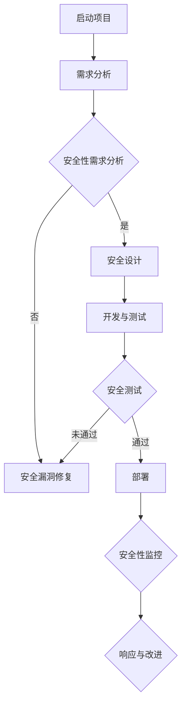

                 

### 安全性考虑：在快速迭代中不可忽视的环节

在当今高速发展的技术时代，快速迭代已成为软件开发的主流模式。然而，在追求敏捷性和高效性的过程中，安全性的考虑往往被忽视，这可能导致严重的安全风险和业务损失。本文旨在探讨在快速迭代开发中，如何有效地考虑和确保安全性，帮助开发团队在追求速度的同时，不忘保障系统的安全稳定。

## 关键词

- 快速迭代
- 安全性
- 安全漏洞
- 风险管理
- 安全测试
- 安全架构

## 摘要

本文从多个维度探讨了在快速迭代过程中确保安全性的重要性。首先，分析了快速迭代与安全性之间的潜在冲突，以及如何在两者之间取得平衡。接着，阐述了快速迭代过程中的常见安全风险，并提出了相应的风险管理策略。随后，介绍了确保安全性的方法，包括安全性设计与架构、安全性测试与验证、以及安全性监控与响应。最后，通过实际案例研究和最佳实践，提供了在快速迭代中确保安全性的具体实施建议。

## 引言

### 背景介绍

随着云计算、大数据、人工智能等新兴技术的蓬勃发展，软件开发的复杂性日益增加。为了在这种复杂环境下保持竞争力，快速迭代开发模式应运而生。快速迭代允许开发团队在短时间内快速交付可用的软件版本，并不断根据用户反馈进行优化和改进。这种模式在一定程度上提高了开发效率和用户满意度，但也带来了新的挑战，尤其是安全性问题。

### 核心概念与联系

快速迭代与安全性之间的核心联系在于两者之间的平衡。快速迭代强调的是开发速度和灵活性，而安全性则强调系统的稳定性和保护性。这两者看似矛盾，但并不是不可调和的。正确的做法是在快速迭代的过程中，始终将安全性视为一个重要的考虑因素，并在每个开发阶段都进行相应的安全评估和措施。

以下是一个简单的Mermaid流程图，展示了快速迭代中的安全性关键步骤：



### 安全性与业务目标的平衡

在快速迭代中，确保安全性并不是一蹴而就的过程。开发团队需要在保持业务目标的同时，确保系统的安全性。这需要考虑以下几个关键因素：

1. **安全性需求分析**：在项目启动阶段，需要对安全性需求进行详细分析，确保安全性与业务目标的一致性。
2. **安全设计**：在设计阶段，应将安全性考虑融入系统架构，确保系统具备必要的安全防护机制。
3. **安全性测试与验证**：在开发和测试阶段，应进行严格的安全性测试，确保系统在各个层面都达到安全要求。
4. **安全性监控与响应**：在系统上线后，应持续进行安全性监控，并建立快速响应机制，以应对潜在的安全威胁。

### 核心算法原理讲解

快速迭代中的安全性保障并非依赖于某一特定的算法，而是依赖于一系列安全措施和流程的协同作用。以下是一个简化的伪代码，展示了如何在不同阶段进行安全性保障：

```python
# 安全性保障伪代码

def ensure_safety():
    # 安全需求分析
    safety_requirements = analyze_safety_requirements()
    if not safety_requirements:
        return "安全性需求不满足，项目终止"

    # 安全设计
    safety_design = design_safety(safety_requirements)
    if not safety_design:
        return "安全设计不满足要求，返回修改"

    # 开发与测试
    for version in iterate_versions():
        test_safety(version)
        if not is_safe(version):
            fix_vulnerabilities(version)
            continue

    # 安全测试与验证
    if not verify_safety():
        return "安全测试未通过，系统存在漏洞"

    # 部署
    deploy_system()

    # 安全性监控与响应
    monitor_system()
    respond_to_threats()

    return "系统安全性保障完成"
```

### 数学模型和公式

在安全性分析中，可以使用一些基本的数学模型和公式来评估系统的安全性风险。以下是一个简化的数学模型，用于评估系统的安全漏洞：

$$
R = \frac{E \times V}{C}
$$

其中：
- \( R \) 是安全漏洞风险值
- \( E \) 是系统暴露的漏洞数量
- \( V \) 是每个漏洞的严重程度
- \( C \) 是系统修复漏洞的成本

通过这个模型，可以评估系统在某个时间点上的安全漏洞风险，并据此制定相应的修复策略。

### 详细讲解和举例说明

为了更好地理解上述核心概念和算法，以下通过一个实际案例进行详细讲解和举例说明。

### 案例背景

假设我们正在开发一款在线购物平台，该平台需要在短时间内推出多个版本，以满足不断变化的市场需求。

### 案例分析

1. **安全性需求分析**：
   - 在项目启动阶段，我们需要明确平台的安全需求，例如用户数据保护、支付安全等。
   - 分析业务目标，确保安全性需求与业务目标一致。

2. **安全设计**：
   - 在设计阶段，我们应将安全性考虑融入系统架构，例如使用HTTPS协议保护用户数据传输，使用OAuth2.0进行用户认证等。
   - 设计安全监控和响应机制，以应对潜在的安全威胁。

3. **开发与测试**：
   - 在开发过程中，我们需要遵循安全编码规范，例如避免SQL注入、XSS攻击等常见漏洞。
   - 在测试阶段，应进行全面的安全性测试，包括功能测试、性能测试和安全测试。

4. **安全性测试与验证**：
   - 通过第三方安全公司进行安全测试，确保系统在各个层面都达到安全要求。
   - 根据测试结果，修复系统漏洞，重新进行测试，直到通过所有安全测试。

5. **部署**：
   - 将系统部署到生产环境，确保部署过程中不引入新的安全漏洞。

6. **安全性监控与响应**：
   - 持续监控系统，及时发现和处理安全事件。
   - 建立快速响应机制，以应对潜在的安全威胁。

### 项目实战

#### 开发环境搭建

1. 配置开发环境，包括代码管理工具（如Git）、版本控制工具（如Jenkins）、代码审查工具（如SonarQube）等。

2. 搭建测试环境，包括测试服务器、数据库服务器、Web应用服务器等。

3. 搭建生产环境，确保与测试环境一致。

#### 源代码详细实现和代码解读

1. 根据需求设计数据库模型，并编写相应的数据库脚本。

2. 编写Web应用代码，实现用户注册、登录、商品浏览、购物车、支付等核心功能。

3. 编写API接口，实现与第三方支付系统、物流系统等的交互。

4. 编写安全测试脚本，用于自动化测试系统安全性。

#### 代码应用解读与分析

1. 通过代码审查工具（如SonarQube）检测代码中的潜在安全漏洞，并修复这些问题。

2. 通过自动化测试工具（如Selenium）进行功能测试，确保系统功能的正确性。

3. 通过安全测试工具（如OWASP ZAP）进行安全性测试，检测系统中的安全漏洞。

#### 实际案例分析和详细讲解剖析

1. 分析系统上线后发生的安全事件，如SQL注入攻击、XSS攻击等。

2. 分析事件的原因，并提出相应的解决方案。

3. 案例研究，总结在快速迭代中确保安全性的最佳实践。

#### 项目小结

1. 在快速迭代中，安全性是不可或缺的一环。

2. 通过严格的安全需求分析、安全设计和安全测试，可以确保系统在各个阶段都达到安全要求。

3. 建立持续的安全性监控和快速响应机制，以应对潜在的安全威胁。

### 最佳实践 Tips

1. **代码审查**：定期进行代码审查，确保代码质量，减少安全漏洞。

2. **安全测试**：进行全面的自动化测试，包括功能测试、性能测试和安全测试。

3. **安全培训**：定期对开发团队进行安全培训，提高安全意识。

4. **安全工具**：使用合适的工具，如防火墙、入侵检测系统等，提高系统安全性。

### 小结

在快速迭代的过程中，安全性是必须考虑的重要一环。开发团队需要通过严格的安全需求分析、安全设计和安全测试，确保系统在各个阶段都达到安全要求。同时，建立持续的安全性监控和快速响应机制，以应对潜在的安全威胁。只有这样，才能在快速迭代中既保持敏捷性，又保障系统的安全性。

### 注意事项

1. **平衡速度与安全性**：在快速迭代中，不要因追求速度而忽视安全性。

2. **持续改进**：安全性是一个持续改进的过程，需要定期评估和更新安全措施。

3. **团队协作**：安全性是团队协作的结果，需要所有团队成员共同参与。

### 拓展阅读

1. 《网络安全实战指南》
2. 《软件安全性工程》
3. 《敏捷开发与安全》

作者：AI天才研究院/AI Genius Institute & 禅与计算机程序设计艺术 /Zen And The Art of Computer Programming

