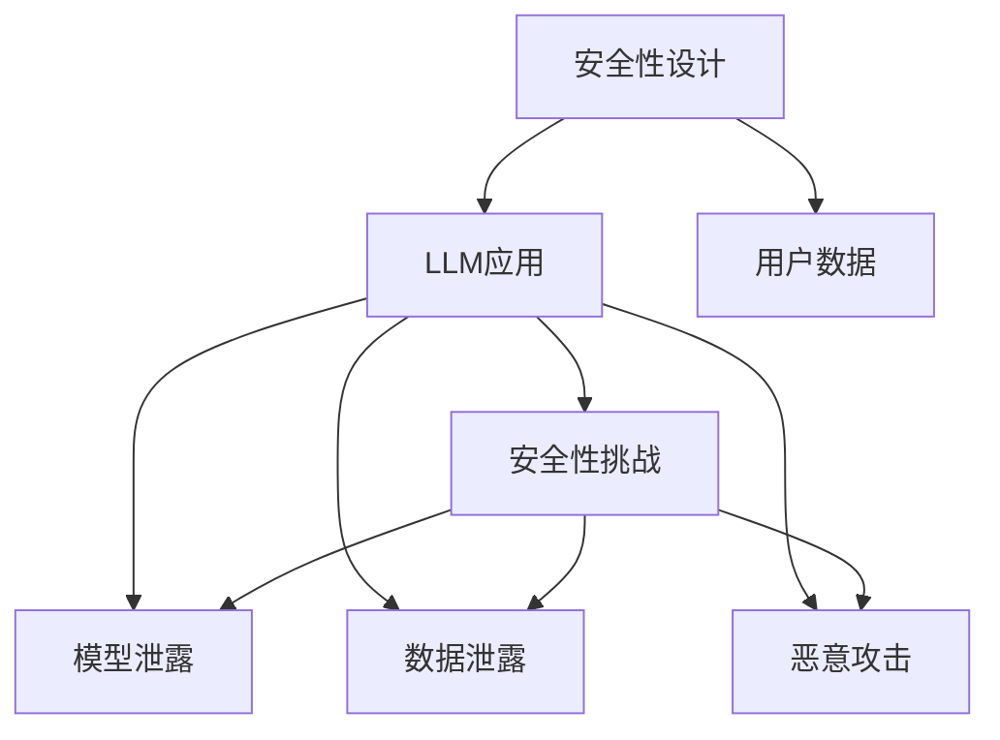

                 


### 背景介绍

在当今数字化时代，数据成为了企业和社会的关键资产。然而，随着数据量的爆炸性增长，数据安全成为了亟待解决的重要问题。在这个背景下，大型语言模型（LLM）的应用越来越广泛。LLM是一种基于深度学习的语言处理模型，能够在自然语言生成、翻译、问答等多个场景中提供高效和准确的服务。然而，随着LLM的普及，其安全性问题也日益凸显。本文将详细探讨LLM应用的安全性挑战，以及如何设计有效的安全性措施来保护LLM应用及用户数据。

#### 核心概念与联系

在本章中，我们将探讨以下几个核心概念，并分析它们之间的关系：

1. **安全性设计**：确保信息系统或应用在面对威胁时能够保持完整性、保密性和可用性。
2. **LLM应用**：一种基于深度学习的语言处理模型，广泛应用于自然语言生成、翻译和问答等领域。
3. **用户数据**：在LLM应用中使用和生成的数据，包括个人隐私信息、行为数据和交互数据。
4. **安全性挑战**：LLM应用在安全方面面临的威胁，如模型泄露、数据泄露和恶意攻击。

为了更好地理解这些概念之间的联系，我们可以使用Mermaid流程图来展示它们的关系：



#### 安全性设计原理讲解

安全性设计是确保LLM应用及其用户数据安全的核心。其理论基础包括以下几个关键要素：

1. **访问控制**：通过用户身份验证和权限管理来限制对LLM应用的访问，确保只有授权用户才能访问特定功能或数据。
2. **加密技术**：使用加密算法对数据进行加密，确保数据在传输和存储过程中的安全性。
3. **安全通信**：确保数据在传输过程中不被窃取或篡改，通常使用HTTPS等加密协议来实现。
4. **审计和监控**：通过日志记录和监控工具来跟踪系统的操作和事件，及时发现和响应异常行为。

以下是安全性设计原理的伪代码：

```python
def security_design():
    # 用户身份验证
    authenticate_user()
    
    # 权限管理
    manage_permissions()
    
    # 数据加密
    encrypt_data()
    
    # 安全通信
    secure_communication()
    
    # 审计和监控
    audit_and_monitor()
```

#### 数学模型和公式

在安全性设计中，数学模型和公式可以帮助我们更好地理解和分析安全威胁。以下是一个简单的例子：

假设我们使用加密算法对数据进行加密，加密算法的复杂度为O(n)，其中n是数据的长度。则加密时间t可以表示为：

$$ t = O(n) $$

#### 详细讲解与举例说明

为了更好地理解安全性设计原理，我们可以通过一个简单的例子来说明。假设我们开发了一个聊天机器人应用，需要确保用户的聊天记录不会被泄露。

1. **用户身份验证**：用户在登录聊天机器人时，需要输入用户名和密码，系统通过验证用户名和密码的匹配性来确认用户身份。

2. **权限管理**：不同的用户有不同的权限，如普通用户只能查看聊天记录，而管理员用户可以删除聊天记录。系统通过角色分配和权限控制来实现。

3. **数据加密**：用户聊天记录在存储到数据库前，需要使用AES加密算法进行加密，确保数据在存储过程中不会被窃取。

4. **安全通信**：聊天数据在传输过程中，使用HTTPS协议来保证数据的安全性，防止数据在传输过程中被窃取或篡改。

5. **审计和监控**：系统会记录用户的操作日志，包括登录时间、聊天记录的创建和删除等，通过监控这些日志，可以及时发现异常行为。

通过这个例子，我们可以看到如何将安全性设计原理应用到实际应用中，从而保护用户数据的安全。

#### 项目实战

在安全性设计的过程中，我们需要考虑开发环境搭建、源代码实现和代码解读等方面。

1. **开发环境搭建**：选择合适的开发工具和框架，如Python和Django，搭建一个基本的聊天机器人开发环境。

2. **源代码实现**：实现用户身份验证、权限管理、数据加密和安全通信等功能，并在源代码中进行详细注释，以便于后续解读。

3. **代码解读**：分析源代码中的关键部分，如用户身份验证逻辑、权限管理逻辑和数据加密算法等，解释其工作原理和实现方法。

4. **代码应用解读与分析**：通过实际案例，如用户登录和聊天记录存储，分析代码的应用场景和效果。

5. **实际案例分析和详细讲解剖析**：选择一个实际的聊天机器人项目，分析项目中存在的安全漏洞和解决方案，进行详细讲解。

6. **项目小结**：总结项目开发过程中遇到的问题和解决方案，给出项目经验和建议。

#### 最佳实践 Tips、小结、注意事项、拓展阅读

1. **最佳实践 Tips**：给出在安全性设计过程中的一些实用技巧，如如何进行有效的安全性需求分析、如何选择合适的加密算法等。

2. **小结**：总结文章的核心内容，强调安全性设计在LLM应用中的重要性。

3. **注意事项**：提醒读者在安全性设计过程中需要注意的问题，如数据泄露的潜在风险、加密算法的选择标准等。

4. **拓展阅读**：推荐一些相关领域的书籍和文章，供读者进一步学习和了解。

以上是《安全性设计：保护LLM应用及用户数据》的第一章内容，接下来我们将继续探讨LLM应用的安全性挑战、用户数据保护、安全性设计与实现等主题。让我们一起深入探讨如何有效地保护LLM应用及其用户数据。

作者：AI天才研究院/AI Genius Institute & 禅与计算机程序设计艺术 /Zen And The Art of Computer Programming

