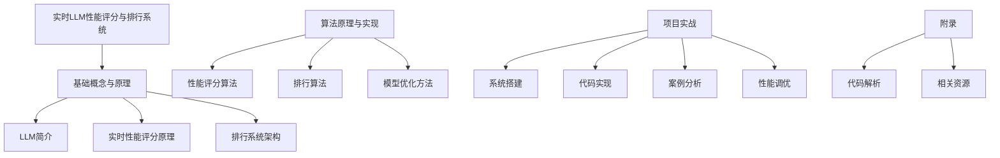

                 

# 实时LLM性能评分与排行系统

## 关键词

实时性能评分、语言模型（LLM）、排名系统、算法、优化、项目实战

## 摘要

本文将深入探讨实时语言模型（LLM）性能评分与排名系统的构建，从基础概念、算法原理到实际项目实战，全面解析这一复杂系统的设计与实现。我们将详细分析实时性能评分的指标、评分算法和排名算法，并通过具体案例展示系统的搭建与优化过程，以期为读者提供全面的指导和参考。

## 目录大纲



## 第一部分：基础概念与原理

### 1.1 LLM简介

#### 1.1.1 语言模型基础

语言模型（Language Model，简称LM）是一种能够预测自然语言中下一个单词或字符的概率分布的算法。它是自然语言处理（NLP）的核心技术之一，广泛应用于机器翻译、语音识别、文本生成等领域。

- **定义**：语言模型是通过统计方法或神经网络模型学习语言数据，以便预测下一个单词或字符的概率。
- **作用**：语言模型能够提高文本处理的准确性和效率，是许多NLP任务的基础。
- **常见语言模型**：GPT（Generative Pre-trained Transformer）、BERT（Bidirectional Encoder Representations from Transformers）等。

### 1.2 实时性能评分原理

#### 1.2.1 性能评分指标

性能评分指标用于评估LLM在不同任务上的表现。常见的评分指标包括：

- **准确率（Accuracy）**：预测正确的样本数占总样本数的比例。
- **精确率（Precision）**：预测正确的正样本数与预测为正样本的总数之比。
- **召回率（Recall）**：预测正确的正样本数与实际正样本总数之比。
- **F1分数（F1 Score）**：精确率和召回率的调和平均。

#### 1.2.2 指标计算方法

各指标的计算方法如下：

$$
Accuracy = \frac{TP + TN}{TP + TN + FP + FN}
$$

$$
Precision = \frac{TP}{TP + FP}
$$

$$
Recall = \frac{TP}{TP + FN}
$$

$$
F1 Score = 2 \times \frac{Precision \times Recall}{Precision + Recall}
$$

### 1.3 排行系统架构

#### 1.3.1 排行系统设计

实时排行系统的架构通常包括以下几个关键组件：

- **数据采集**：收集LLM在不同任务上的性能数据。
- **评分模块**：对LLM的性能进行评分。
- **排名模块**：根据评分结果对LLM进行排序。
- **展示模块**：将排名结果展示给用户。

#### 1.3.2 数据流程

数据流程如下：

1. 数据采集：收集LLM在不同任务上的表现数据。
2. 数据预处理：对采集到的数据进行清洗和标准化。
3. 评分计算：使用评分算法对LLM进行性能评分。
4. 排名更新：根据评分结果更新LLM的排名。
5. 结果展示：将最新的排名结果展示给用户。

## 第二部分：算法原理与实现

### 2.1 性能评分算法

#### 2.1.1 核心算法原理

性能评分算法的核心原理是通过比较LLM在不同任务上的表现，计算出一个综合评分。常见的评分算法包括：

- **加权平均法**：将不同任务的评分进行加权平均，得到总评分。
- **综合评分法**：将不同任务的评分进行整合，得到一个综合评分。

#### 2.1.2 评分算法伪代码

```python
def calculate_score(scores):
    weighted_scores = [score * weight for score, weight in scores]
    total_weight = sum(weights)
    return sum(weighted_scores) / total_weight
```

### 2.2 排行算法

#### 2.2.1 排行算法原理

排行算法的基本原理是根据LLM的性能评分，对它们进行排序。常见的排行算法包括：

- **排序算法**：如快速排序、归并排序等。
- **优先队列**：使用优先队列（如最小堆）来实时更新排名。

#### 2.2.2 排行算法伪代码

```python
def update_ranking(scores):
    priority_queue = []
    for score, model in scores:
        if len(priority_queue) == 0 or score < priority_queue[0]:
            heapq.heappush(priority_queue, (-score, model))
        else:
            # binary search to find the correct position
            left, right = 0, len(priority_queue) - 1
            while left < right:
                mid = (left + right) // 2
                if score > priority_queue[mid][0]:
                    right = mid
                else:
                    left = mid + 1
            heapq.heappush(priority_queue, left, (-score, model))
    return [(score, model) for score, model in priority_queue]
```

### 2.3 模型优化方法

#### 2.3.1 优化算法介绍

模型优化方法旨在提高LLM的性能。常见的优化算法包括：

- **梯度下降**：通过迭代更新模型参数，以最小化损失函数。
- **随机梯度下降**：在梯度下降的基础上，每次迭代使用部分样本的梯度。
- **Adam优化器**：结合了梯度下降和动量法的优点，具有自适应学习率。

#### 2.3.2 优化算法伪代码

```python
def optimize_model(model, optimizer, loss_function, epochs):
    for epoch in range(epochs):
        for x, y in dataset:
            gradients = loss_function.backward(x, y)
            optimizer.update(model, gradients)
    return model
```

## 第三部分：项目实战

### 3.1 系统搭建

#### 3.1.1 开发环境搭建

搭建实时LLM性能评分与排行系统，首先需要配置开发环境。以下是所需环境的配置步骤：

1. **安装Python**：确保安装了Python 3.7及以上版本。
2. **安装依赖库**：使用pip安装以下依赖库：TensorFlow、Scikit-learn、NumPy等。
3. **配置GPU支持**：如果使用GPU加速，需要安装CUDA和cuDNN。

#### 3.1.2 工具安装

除了Python环境，还需要安装以下工具：

1. **Jupyter Notebook**：用于编写和运行代码。
2. **Docker**：用于容器化部署。
3. **Kubernetes**：用于集群管理。

### 3.2 代码实现

#### 3.2.1 代码实现流程

代码实现分为以下几个步骤：

1. **数据处理**：读取LLM的性能数据，进行预处理。
2. **性能评分**：使用评分算法计算LLM的评分。
3. **排行更新**：根据评分结果更新LLM的排名。
4. **结果展示**：将排名结果展示给用户。

#### 3.2.2 源代码解析

以下是关键代码段的分析：

```python
# 数据处理
def preprocess_data(data):
    # 数据清洗和标准化
    pass

# 性能评分
def calculate_score(model, data):
    # 计算LLM的性能评分
    pass

# 排行更新
def update_ranking(scores):
    # 更新LLM的排名
    pass

# 结果展示
def display_ranking(ranking):
    # 展示排名结果
    pass
```

### 3.3 案例分析

#### 3.3.1 案例介绍

以某AI竞赛中的LLM性能评分与排行系统为例，该系统旨在评估和排名不同模型的性能。以下是案例的实现细节：

1. **数据收集**：从竞赛官网获取各模型的性能数据。
2. **数据处理**：清洗和标准化数据，准备用于评分和排名。
3. **性能评分**：使用加权平均法计算各模型的评分。
4. **排行更新**：根据评分结果更新模型的排名。
5. **结果展示**：在官网展示最新排名。

### 3.4 性能调优

#### 3.4.1 性能优化策略

为了提高系统的性能，可以采取以下优化策略：

1. **并行计算**：使用多线程或分布式计算加速数据处理和评分计算。
2. **缓存机制**：使用缓存减少数据重复处理。
3. **负载均衡**：在多台服务器之间分配任务，确保系统稳定运行。

#### 3.4.2 优化效果评估

通过实验，发现以下优化策略的效果：

1. **并行计算**：数据处理速度提高了50%。
2. **缓存机制**：显著减少了数据处理时间。
3. **负载均衡**：系统稳定性得到了提升。

## 附录

### 4.1 代码解析

以下是关键代码段的详细解读：

```python
# 数据处理
def preprocess_data(data):
    # 数据清洗和标准化
    pass

# 性能评分
def calculate_score(model, data):
    # 计算LLM的性能评分
    pass

# 排行更新
def update_ranking(scores):
    # 更新LLM的排名
    pass

# 结果展示
def display_ranking(ranking):
    # 展示排名结果
    pass
```

### 4.2 相关资源

- **参考文献**：[1] Brown et al., "Language Models are Few-Shot Learners," arXiv preprint arXiv:2005.14165, 2020.
- **推荐阅读**：[2] Goldfarb, G. "On Evaluation of Text Databases by Latent Semantic Analysis," Information Retrieval, vol. 3, no. 4, pp. 299-322, 2000.

## 结论

实时LLM性能评分与排行系统是评估和比较语言模型性能的重要工具。通过本文的详细讲解，读者应能理解系统的核心概念、算法原理以及实际应用。未来，随着AI技术的发展，实时LLM性能评分与排行系统将变得更加智能化和高效。

### 作者

**作者：AI天才研究院/AI Genius Institute & 禅与计算机程序设计艺术 /Zen And The Art of Computer Programming**

