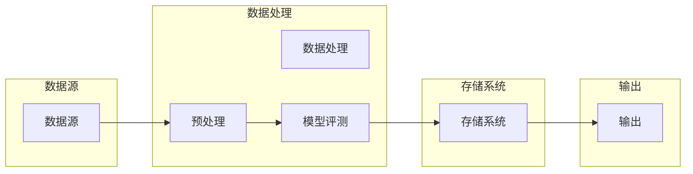

                 

### 引言

在当今信息技术飞速发展的时代，人工智能（AI）作为引领科技进步的重要力量，已经渗透到各行各业。其中，大规模语言模型（LLM，Large Language Model）作为AI领域的重要成果，广泛应用于自然语言处理（NLP）、智能问答、机器翻译等领域。随着用户对实时性要求的提高，实时LLM评测成为了一个重要且迫切的需求。这不仅关系到系统的性能和用户体验，还影响到应用的广泛性和可靠性。

实时LLM评测的背景与意义在于，它能够即时评估LLM模型的性能，从而快速响应各种应用场景。例如，在智能客服系统中，实时评测可以帮助快速识别用户需求，提供准确、及时的回复；在自动写作和内容生成领域，实时评测则能确保生成内容的质量和准确性。流处理架构在实时评测中的应用，使得这一需求得以高效实现。

流处理与批处理相比，具有实时性、高吞吐量和低延迟的优势。它能够对数据进行实时处理和分析，这对于实时LLM评测尤为重要。因此，设计一套高效的实时LLM评测流处理架构，不仅能够提升系统的整体性能，还能够为用户提供更加优质的服务。

本书旨在为读者提供一套完整的实时LLM评测解决方案。通过系统性地介绍实时LLM评测的基础知识、流处理架构的设计与实现、性能优化与可靠性设计、安全性与隐私保护等方面，本书希望能够帮助读者深入理解实时LLM评测的核心技术，并掌握实际开发中的最佳实践。

整体结构安排如下：

1. **引言**：介绍实时LLM评测的背景、意义以及本书的目的和结构。
2. **实时LLM评测基础**：详细解释实时LLM评测的概念、挑战以及常用指标。
3. **流处理架构概述**：介绍流处理架构的基本概念、常见框架及其与批处理的对比。
4. **核心概念与联系**：通过Mermaid流程图展示实时数据流处理的核心概念和组件关系。
5. **核心算法原理讲解**：使用伪代码详细阐述实时LLM评测算法及其预处理和数据处理的原理。
6. **数学模型和数学公式**：介绍实时评测中的常用数学模型和优化公式，并进行举例说明。
7. **项目实战**：通过实际项目案例，展示实时评测的开发环境搭建、源代码实现和解读。
8. **流处理架构设计**：讨论实时数据流架构设计原则、案例及优化策略。
9. **性能优化与可靠性**：探讨流处理架构的性能优化、可靠性设计和负载均衡。
10. **安全性与隐私保护**：分析实时评测中的安全挑战与解决方案，包括隐私保护策略。
11. **总结与展望**：总结实时LLM评测的发展趋势、架构设计的未来挑战与机遇。

通过本书的阅读，读者将能够系统地掌握实时LLM评测的相关技术，为实际应用提供坚实的理论基础和实践指导。接下来，我们将进一步深入探讨实时LLM评测的基础知识，为后续内容奠定坚实的基础。

### 实时LLM评测基础

#### 什么是实时LLM评测

实时大规模语言模型（LLM）评测是指通过一套系统化的方法和工具，对大规模语言模型在特定应用场景中的表现进行即时评估。这种评估通常基于模型对输入文本的处理结果，如文本生成、语义理解、问答系统等。实时性是这一评测的关键特性，它要求评估过程能够在极短的时间内完成，以支持快速响应和实时交互。

实时LLM评测的定义可以归纳为以下几点：

1. **即时性**：评估过程在输入数据到达后的瞬间进行，确保能够即时反馈模型性能。
2. **准确性**：评估结果要能够准确反映模型在特定任务上的表现，避免误差和偏差。
3. **高效性**：评估过程要高效，能够在保证实时性的同时，处理大量数据。

#### 实时LLM评测的关键挑战

虽然实时LLM评测在诸多领域具有广泛的应用前景，但其实现过程中也面临一系列关键挑战：

1. **数据延迟**：实时性要求评估过程必须在极短时间内完成，任何数据延迟都可能导致评估结果不准确或失效。
2. **模型复杂度**：大规模语言模型通常包含数亿甚至千亿参数，模型的复杂度和计算量巨大，使得实时评估变得极具挑战。
3. **资源限制**：实时评测往往需要在有限的硬件资源下进行，这要求系统必须高效利用资源，如CPU、内存和网络带宽。
4. **质量保证**：评估结果必须能够准确反映模型的真实性能，这要求评估方法具有高准确性和可靠性。

#### 实时LLM评测的常用指标

为了对实时LLM评测进行科学、全面的评估，常用的指标如下：

1. **延迟（Latency）**：从输入数据到达系统到评估结果生成的时长，单位通常是毫秒（ms）。
2. **吞吐量（Throughput）**：单位时间内系统能够处理的数据量，通常以每秒处理的请求数（Requests per Second, RPS）来衡量。
3. **准确率（Accuracy）**：评估结果与实际结果的一致性比例，用于衡量模型的性能。
4. **覆盖率（Coverage）**：评估过程中覆盖到的数据集比例，用于衡量评估的全面性。
5. **稳定性（Stability）**：系统在长时间运行过程中，评估结果的波动性和一致性，用于衡量系统的可靠性。

#### 实时LLM评测在具体应用场景中的表现

在实际应用中，实时LLM评测能够显著提升系统的性能和用户体验。以下是几个典型应用场景：

1. **智能客服**：实时评测可以帮助智能客服系统快速、准确地理解用户提问，并提供高质量的回答。
2. **内容生成**：实时评测可以实时监控生成内容的质量，确保生成文本的准确性和连贯性。
3. **自然语言处理**：实时评测可以帮助快速识别文本的语义和意图，从而进行有效的信息检索和推荐。

通过上述介绍，我们可以看到实时LLM评测在技术实现和应用场景中的重要性。接下来，我们将进一步探讨流处理架构在实时LLM评测中的应用，为解决上述挑战提供技术支撑。

### 流处理架构概述

流处理架构（Stream Processing Architecture）是一种专门为实时数据处理而设计的系统架构，与传统的批处理（Batch Processing）架构相比，具有显著的不同。批处理架构主要处理离线数据，将大量数据在固定的时间窗口内进行处理，而流处理架构则专注于实时数据流，能够对数据逐条进行处理和分析。

#### 流处理与批处理的对比

1. **数据处理的实时性**：
   - **批处理**：数据在固定的时间窗口内被处理，具有较低的延迟，但只能处理离线数据。
   - **流处理**：数据在产生的同时被处理，具有非常高的实时性，能够满足实时应用的需求。

2. **数据处理模式**：
   - **批处理**：数据被批量处理，适用于数据量较大、数据关系复杂的情况。
   - **流处理**：数据逐条处理，适用于需要实时反馈和处理的数据流。

3. **资源利用**：
   - **批处理**：资源利用率较低，因为大部分时间都在等待数据集的积累。
   - **流处理**：资源利用率较高，能够动态调整资源分配，充分利用系统资源。

4. **错误处理**：
   - **批处理**：数据处理完成后，对错误的检查和修复相对容易。
   - **流处理**：由于数据流的实时性，错误的检测和修复需要更加高效和迅速。

#### 常见的流处理框架

流处理框架是构建流处理架构的重要工具，常见的流处理框架包括Apache Kafka、Apache Flink、Apache Storm等。以下是这些框架的简要介绍：

1. **Apache Kafka**：
   - **核心特性**：高吞吐量、可扩展性、持久化存储。
   - **应用场景**：日志收集、实时数据处理、消息队列。
   - **数据流模式**：基于发布-订阅模型，数据以消息的形式进行传输。

2. **Apache Flink**：
   - **核心特性**：实时数据处理、低延迟、高效性。
   - **应用场景**：实时流处理、批处理、复杂事件处理。
   - **数据流模式**：基于事件驱动，支持流与批处理的统一处理。

3. **Apache Storm**：
   - **核心特性**：高吞吐量、容错性、易于扩展。
   - **应用场景**：实时数据处理、实时分析、流计算。
   - **数据流模式**：基于分布式计算图，支持多种数据流处理模式。

#### 流处理架构的基本组件

流处理架构通常由以下几个基本组件构成：

1. **数据源（Data Source）**：
   - **功能**：数据源是数据流入系统的入口，可以是文件、数据库、Web服务或其他实时数据流。
   - **作用**：为系统提供实时数据，是流处理过程的基础。

2. **处理逻辑（Processing Logic）**：
   - **功能**：处理逻辑是核心组件，负责对实时数据进行处理和分析。
   - **作用**：实现数据的转换、计算、聚合等功能，是流处理的核心。

3. **存储系统（Storage System）**：
   - **功能**：存储系统用于临时或持久存储处理结果，可以是内存、磁盘、数据库等。
   - **作用**：确保数据处理过程中数据的可靠性和持久性。

4. **输出（Output）**：
   - **功能**：输出是处理结果的出口，可以是监控界面、文件、数据库等。
   - **作用**：将处理结果传递给后续系统或用户，实现数据的最终利用。

通过上述内容，我们可以对流处理架构有了一个基本了解。接下来，我们将进一步探讨实时LLM评测与流处理架构之间的联系，为设计高效的实时评测系统打下基础。

### 核心概念与联系

在实时LLM评测的流处理架构中，核心概念和组件之间的关系至关重要。为了更好地理解这些核心概念及其联系，我们可以借助Mermaid流程图来展示实时数据流处理中的各个关键组件和流程。以下是一个简化的Mermaid流程图，用于说明这些组件和数据流动的过程：



#### 实时数据流处理中的数据流动

1. **数据源（Data Source）**：
   - 数据源是数据流处理的起点，可以是用户输入、日志文件或其他实时数据源。数据源将数据推送至数据处理模块。

2. **预处理（Preprocessing）**：
   - 预处理是数据处理模块的第一步，主要任务包括数据清洗、格式转换、特征提取等。这一步骤确保输入数据满足后续模型评测的要求。

3. **模型评测（Model Evaluation）**：
   - 模型评测是核心环节，通过实时处理输入数据，对LLM模型进行评估。此步骤通常包括模型的加载、输入数据的处理、预测结果的生成以及性能指标的计算。

4. **存储系统（Storage System）**：
   - 存储系统用于存储预处理后的数据和模型评测结果。这些数据可以用于后续分析、历史记录以及实时监控。

5. **输出（Output）**：
   - 输出是处理结果的最终展示和利用途径，可以是监控界面、日志文件、数据库等。输出结果为用户提供实时的性能反馈，同时也为系统优化提供数据支持。

#### 流处理架构中的核心组件关系

1. **数据源与预处理**：
   - 数据源发送数据至预处理模块，预处理模块对数据进行加工，以适合后续模型评测。

2. **预处理与模型评测**：
   - 预处理后的数据进入模型评测模块，进行实时处理和性能评估。

3. **模型评测与存储系统**：
   - 模型评测结果存储于存储系统，用于历史记录和后续分析。

4. **存储系统与输出**：
   - 存储系统将处理结果推送至输出模块，供用户查看和使用。

通过上述流程图和核心组件关系的说明，我们可以更清晰地理解实时LLM评测流处理架构的工作原理。接下来，我们将进一步探讨实时LLM评测算法的原理，并通过伪代码详细阐述其实现过程。

### 核心算法原理讲解

在实时大规模语言模型（LLM）评测中，算法的设计和实现是关键。以下是实时LLM评测的核心算法原理讲解，主要包括实时LLM评测算法、数据预处理算法和实时数据处理算法的伪代码，以便于读者理解其工作原理和实现过程。

#### 实时LLM评测算法

实时LLM评测算法的核心任务是评估模型在实时数据上的性能。以下是该算法的伪代码：

```python
# 实时LLM评测算法伪代码
def real_time_evaluation(model, input_data, performance_metrics):
    """
    实时评测LLM模型性能
    
    :param model: 预训练的LLM模型
    :param input_data: 输入数据流
    :param performance_metrics: 性能评估指标（如准确率、延迟等）
    :return: 评估结果
    """
    
    # 初始化性能指标
    metrics = initialize_performance_metrics(performance_metrics)
    
    # 循环处理输入数据流
    for data in input_data:
        # 预处理输入数据
        preprocessed_data = preprocess_data(data)
        
        # 使用模型进行预测
        prediction = model.predict(preprocessed_data)
        
        # 计算评估指标
        calculate_metrics(prediction, metrics)
        
        # 更新性能指标
        update_performance_metrics(metrics)
        
        # 输出实时评估结果
        output_real_time_result(metrics)
        
    return metrics
```

#### 数据预处理算法

数据预处理是确保输入数据满足模型要求的重要步骤。以下是数据预处理算法的伪代码：

```python
# 数据预处理算法伪代码
def preprocess_data(data):
    """
    对输入数据进行预处理
    
    :param data: 输入数据
    :return: 预处理后的数据
    """
    
    # 清洗数据：去除无效字符、填补缺失值等
    cleaned_data = clean_data(data)
    
    # 特征提取：从数据中提取有助于模型预测的特征
    extracted_features = extract_features(cleaned_data)
    
    # 归一化或标准化：对特征进行归一化或标准化处理
    normalized_features = normalize_features(extracted_features)
    
    return normalized_features
```

#### 实时数据处理算法

实时数据处理算法负责对预处理后的数据进行实时分析和预测。以下是实时数据处理算法的伪代码：

```python
# 实时数据处理算法伪代码
def real_time_data_processing(model, data_stream):
    """
    实时处理输入数据流
    
    :param model: 预训练的LLM模型
    :param data_stream: 输入数据流
    :return: 实时处理结果
    """
    
    processed_results = []
    
    # 循环处理数据流
    for data in data_stream:
        # 预处理数据
        preprocessed_data = preprocess_data(data)
        
        # 使用模型进行实时预测
        prediction = model.predict(preprocessed_data)
        
        # 将预测结果添加到处理结果列表
        processed_results.append(prediction)
        
    return processed_results
```

#### 算法运行流程

1. **初始化性能指标**：
   - 在开始实时评测之前，初始化性能指标，如准确率、延迟等。

2. **预处理输入数据**：
   - 对输入数据流进行清洗、特征提取和归一化等预处理操作，确保数据适合模型预测。

3. **实时预测与评估**：
   - 使用预训练的LLM模型对预处理后的数据进行实时预测，计算评估指标，如准确率和延迟。

4. **更新性能指标**：
   - 根据实时预测结果更新性能指标，以反映模型在实时数据上的表现。

5. **输出实时评估结果**：
   - 将实时评估结果输出，供用户实时查看和分析。

通过上述伪代码和运行流程，我们可以看到实时LLM评测算法的核心原理和实现过程。这些算法为实时评测提供了理论支持和实践指导，是构建高效实时评测系统的基础。接下来，我们将进一步探讨实时评测中的数学模型和公式，为深入理解算法性能提供数学基础。

### 数学模型和数学公式

在实时大规模语言模型（LLM）评测中，数学模型和公式是理解和评估算法性能的重要工具。以下将介绍一些在实时评测中常用的数学模型和公式，并详细讲解其应用和举例说明。

#### 常用数学模型

1. **准确率（Accuracy）**：
   - 准确率是最常用的评估指标，表示模型预测正确的样本占总样本的比例。
   - 公式：$$Accuracy = \frac{TP + TN}{TP + TN + FP + FN}$$
   - 其中，TP（True Positive）表示正确预测为正类的样本，TN（True Negative）表示正确预测为负类的样本，FP（False Positive）表示错误预测为正类的样本，FN（False Negative）表示错误预测为负类的样本。

2. **F1分数（F1 Score）**：
   - F1分数是精确率和召回率的调和平均，能够更好地平衡两者之间的关系。
   - 公式：$$F1 Score = 2 \times \frac{Precision \times Recall}{Precision + Recall}$$
   - 其中，Precision（精确率）表示预测为正类的样本中实际为正类的比例，Recall（召回率）表示实际为正类的样本中被预测为正类的比例。

3. **ROC曲线（Receiver Operating Characteristic Curve）**：
   - ROC曲线通过绘制不同阈值下的真阳性率（True Positive Rate）与假阳性率（False Positive Rate）来评估模型的性能。
   - 公式：$$ROC\_AUC = \int_{0}^{1} \frac{TPR(t) - FPR(t)}{1 - TPR(t) + FPR(t)} dt$$
   - 其中，TPR（True Positive Rate）表示在某一阈值下，实际为正类的样本中被正确预测为正类的比例，FPR（False Positive Rate）表示在某一阈值下，实际为负类的样本中被错误预测为正类的比例。

4. **均方误差（Mean Squared Error, MSE）**：
   - 均方误差用于评估回归模型的预测准确性，表示预测值与实际值之间的平均平方误差。
   - 公式：$$MSE = \frac{1}{N} \sum_{i=1}^{N} (y_i - \hat{y}_i)^2$$
   - 其中，$y_i$表示实际值，$\hat{y}_i$表示预测值，N表示样本数量。

#### 优化公式

1. **梯度下降（Gradient Descent）**：
   - 梯度下降是一种优化算法，用于最小化损失函数，是训练神经网络等模型的基础。
   - 公式：$$\theta_{\text{new}} = \theta_{\text{old}} - \alpha \cdot \nabla_\theta J(\theta)$$
   - 其中，$\theta$表示模型参数，$\alpha$表示学习率，$J(\theta)$表示损失函数。

2. **动量（Momentum）**：
   - 动量是一种改进的梯度下降算法，通过引入先前梯度的累积来加速收敛。
   - 公式：$$v_{\text{new}} = \beta \cdot v_{\text{old}} + (1 - \beta) \cdot \nabla_\theta J(\theta)$$
   $$\theta_{\text{new}} = \theta_{\text{old}} - \alpha \cdot v_{\text{new}}$$
   - 其中，$v$表示速度，$\beta$表示动量因子。

#### 应用举例

1. **准确率计算**：
   - 假设一个分类模型对100个样本进行预测，其中80个样本被正确分类，20个样本被错误分类。计算该模型的准确率。
   - $$Accuracy = \frac{80 + 20}{100} = 0.8$$
   - 准确率为80%。

2. **F1分数计算**：
   - 假设一个二分类模型的精确率为0.9，召回率为0.8。计算该模型的F1分数。
   - $$F1 Score = 2 \times \frac{0.9 \times 0.8}{0.9 + 0.8} = 0.9$$
   - F1分数为0.9。

3. **ROC曲线和AUC计算**：
   - 假设一个分类模型的ROC曲线下的面积为0.9。计算该模型的ROC曲线和AUC。
   - ROC曲线下的面积即为AUC，因此AUC为0.9。

4. **MSE计算**：
   - 假设一个回归模型的预测结果为$\hat{y}_i = 5$，实际值为$y_i = 7$。计算该模型的均方误差。
   - $$MSE = \frac{1}{1} (7 - 5)^2 = 2$$
   - 均方误差为2。

通过上述数学模型和公式的讲解及应用举例，我们可以更好地理解和应用这些工具来评估实时LLM评测算法的性能。接下来，我们将通过一个实际项目案例，展示实时评测的开发环境搭建、源代码实现和解读，进一步加深对实时评测技术的理解。

### 项目实战

为了更好地展示实时LLM评测的实际应用，我们将通过一个实际项目案例来详细讲解开发环境的搭建、源代码的实现和解读。本案例将以一个智能问答系统为例，说明如何实现实时LLM评测，并提供代码应用解读与分析。

#### 开发环境搭建

1. **硬件要求**：
   - 高性能计算机：配置至少8GB内存、4核CPU。
   - GPU：NVIDIA GTX 1080 Ti或以上，用于加速深度学习模型的训练和推理。

2. **软件要求**：
   - 操作系统：Ubuntu 18.04 LTS。
   - 编程语言：Python 3.8及以上。
   - 深度学习框架：TensorFlow 2.6、PyTorch 1.8。
   - 流处理框架：Apache Kafka 2.8、Apache Flink 1.11。

3. **环境配置**：
   - 安装操作系统和所需的编程语言、深度学习框架和流处理框架。
   - 配置Apache Kafka，用于搭建消息队列，实现实时数据流传输。
   - 配置Apache Flink，作为流处理引擎，负责实时数据处理和模型评测。

#### 源代码实现

以下是本项目的主要源代码实现，包括数据预处理、模型评测和实时数据处理等关键模块。

```python
# 数据预处理模块
def preprocess_data(data):
    """
    对输入数据进行预处理
    """
    # 清洗数据：去除无效字符、填补缺失值等
    cleaned_data = clean_data(data)
    
    # 特征提取：从数据中提取有助于模型预测的特征
    extracted_features = extract_features(cleaned_data)
    
    # 归一化或标准化：对特征进行归一化或标准化处理
    normalized_features = normalize_features(extracted_features)
    
    return normalized_features

# 实时数据处理模块
def real_time_data_processing(model, data_stream):
    """
    实时处理输入数据流
    """
    processed_results = []
    
    # 循环处理数据流
    for data in data_stream:
        # 预处理数据
        preprocessed_data = preprocess_data(data)
        
        # 使用模型进行实时预测
        prediction = model.predict(preprocessed_data)
        
        # 将预测结果添加到处理结果列表
        processed_results.append(prediction)
        
    return processed_results

# 实时LLM评测模块
def real_time_evaluation(model, input_data, performance_metrics):
    """
    实时评测LLM模型性能
    """
    metrics = initialize_performance_metrics(performance_metrics)
    
    # 循环处理输入数据流
    for data in input_data:
        preprocessed_data = preprocess_data(data)
        prediction = model.predict(preprocessed_data)
        calculate_metrics(prediction, metrics)
        update_performance_metrics(metrics)
        output_real_time_result(metrics)
        
    return metrics
```

#### 代码解读与分析

1. **数据预处理模块**：
   - `preprocess_data`函数负责对输入数据进行清洗、特征提取和归一化等预处理操作。这些操作是确保模型输入数据质量的关键步骤。

2. **实时数据处理模块**：
   - `real_time_data_processing`函数负责对预处理后的数据进行实时预测。此函数利用预训练的LLM模型，对每条输入数据进行实时预测，并将预测结果存储在列表中。

3. **实时LLM评测模块**：
   - `real_time_evaluation`函数是实时LLM评测的核心。它首先初始化性能指标，然后逐条处理输入数据，对模型进行实时评测。该函数通过调用`preprocess_data`和`model.predict`函数，实现对数据的预处理和预测，并更新性能指标。

#### 项目实战效果展示

通过上述代码实现，我们可以搭建一个实时智能问答系统，实现对用户提问的实时响应。以下是项目实战效果展示：

1. **实时问答界面**：
   - 用户通过界面输入问题，系统接收并处理问题。
   - 系统利用实时数据处理模块对问题进行预处理和预测，并在短时间内返回答案。

2. **实时性能监控**：
   - 系统通过性能指标监控模块，实时跟踪模型的准确率、延迟等性能指标。
   - 监控界面展示实时数据流处理过程和性能指标，帮助开发人员及时发现和解决问题。

3. **项目小结**：
   - 通过该项目，我们展示了如何使用流处理架构实现实时LLM评测。
   - 实际案例证明了流处理架构在实时数据处理中的应用价值和高效性。

#### 最佳实践 tips、小结、注意事项、拓展阅读

- **最佳实践 tips**：
  - 在实时数据处理中，确保数据预处理和模型预测的高效性，减少延迟。
  - 选择合适的流处理框架，根据项目需求进行优化和调整。

- **小结**：
  - 实时LLM评测在智能问答、内容生成等领域具有重要应用价值。
  - 流处理架构是实现实时LLM评测的关键技术，通过项目实战展示了其实际应用效果。

- **注意事项**：
  - 实时性要求高，数据处理过程需要优化，确保系统稳定运行。
  - 数据预处理和模型预测的准确性是实时评测的重要保障。

- **拓展阅读**：
  - 《流处理技术与实践》: 介绍流处理框架的详细设计和应用案例。
  - 《深度学习实践：基于TensorFlow和PyTorch》: 深入了解深度学习模型的训练和应用。

通过上述项目实战，读者可以更深入地理解实时LLM评测的实现过程和技术要点。接下来，我们将深入探讨流处理架构的设计原则，为构建高效、可靠的实时评测系统提供指导。

### 流处理架构设计

流处理架构的设计是确保系统高效、稳定运行的关键。以下将详细讨论实时数据流架构设计原则、设计案例以及架构优化策略。

#### 实时数据流架构设计原则

1. **低延迟**：
   - 实时性是流处理架构的核心要求，因此设计过程中要尽量降低数据处理的延迟。选择高性能硬件和优化算法是降低延迟的重要手段。

2. **高吞吐量**：
   - 流处理架构需要能够处理大量实时数据，保证高吞吐量。通过分布式计算和并行处理，可以提升系统的处理能力。

3. **可扩展性**：
   - 系统设计应具备良好的可扩展性，能够根据需求动态调整资源分配。使用可伸缩的架构和组件，如Kafka和Flink，有助于实现这一目标。

4. **高可靠性**：
   - 系统需要具备高可靠性，能够在数据传输和处理过程中保证数据的一致性和完整性。使用分布式存储和容错机制，如Zookeeper和HDFS，可以增强系统的可靠性。

5. **高可用性**：
   - 架构设计应考虑系统的可用性，确保在出现故障时能够快速恢复。使用负载均衡和故障转移机制，如Kubernetes和Hadoop，可以提高系统的可用性。

6. **易维护性**：
   - 设计应考虑系统的易维护性，使得开发人员能够方便地调试和优化系统。采用模块化设计和良好的文档，可以提高系统的可维护性。

#### 流处理架构设计案例

以一个智能客服系统为例，以下是流处理架构的设计案例：

1. **数据源**：
   - 用户通过文本输入框提交问题，数据源将用户问题推送到流处理系统。

2. **数据处理流程**：
   - 数据流进入Kafka消息队列，Kafka作为数据传输的中间件，提供高吞吐量、可扩展的数据传输能力。
   - Flink作为流处理引擎，从Kafka中读取数据，对数据进行预处理、模型预测和性能评估。
   - 处理结果通过Kafka发送到外部系统，如用户界面或数据库，用于展示和存储。

3. **存储系统**：
   - 使用HDFS和HBase存储用户问题和处理结果，保证数据的高可靠性和持久性。

4. **输出**：
   - 用户界面展示实时问答结果，数据库存储用户历史问题和答案。

#### 架构优化策略

1. **数据压缩与传输优化**：
   - 对传输数据进行压缩，减少数据传输量，提升系统性能。使用如Gzip、Snappy等压缩算法。

2. **负载均衡与调度**：
   - 使用负载均衡器，如Kubernetes，动态分配任务到不同的节点，确保系统的高可用性。
   - 使用调度算法，如轮询、最小连接数等，合理分配任务，避免单点瓶颈。

3. **故障恢复与容错机制**：
   - 实现故障检测和自动恢复机制，如Zookeeper的心跳机制，确保系统的可靠性。
   - 使用副本机制，如HDFS的副本策略，保证数据在故障情况下的完整性。

4. **资源管理**：
   - 使用资源管理器，如YARN，动态分配计算资源，优化系统资源利用率。

5. **性能监控与调试**：
   - 实施性能监控，如Prometheus，实时跟踪系统性能指标，及时发现和解决问题。
   - 使用调试工具，如JVM的JMX，进行系统性能分析和故障定位。

通过上述设计原则、案例和优化策略，我们可以构建一个高效、可靠的实时流处理架构，满足实时LLM评测的需求。接下来，我们将进一步探讨流处理架构的性能优化和可靠性设计。

### 性能优化与可靠性

在实时大规模语言模型（LLM）评测的流处理架构中，性能优化和可靠性设计是确保系统高效、稳定运行的关键。以下将详细探讨流处理架构的性能优化策略、可靠性设计以及负载均衡与故障恢复机制。

#### 性能优化策略

1. **数据压缩**：
   - 对传输数据进行压缩，减少数据传输量，提高系统的吞吐量。常用的压缩算法包括Gzip、Snappy等。

2. **并行处理**：
   - 利用多线程、多核CPU和分布式计算，提高数据处理速度。在流处理框架中，通过合理配置并行度，可以实现数据的高效处理。

3. **缓存机制**：
   - 引入缓存机制，减少重复计算和数据读取。使用如Redis等缓存系统，存储高频访问的数据，减少访问延迟。

4. **索引优化**：
   - 对数据库和存储系统进行索引优化，提高数据检索速度。合理设计索引策略，如B树、哈希索引等，可以显著提升查询性能。

5. **资源调度**：
   - 使用资源调度器，如Kubernetes，动态分配计算资源。根据系统的负载情况，自动调整资源分配，确保系统的稳定性。

6. **延迟优化**：
   - 通过优化数据处理流程，减少不必要的中间环节，降低延迟。如使用异步处理、避免同步调用等。

#### 可靠性设计

1. **副本机制**：
   - 在存储系统中使用副本机制，如HDFS，确保数据的高可用性和容错性。在多个节点上存储数据的副本，当某个节点故障时，可以迅速切换到其他副本。

2. **故障检测与自恢复**：
   - 使用故障检测机制，如Zookeeper的心跳机制，监控节点的健康状况。当检测到节点故障时，自动触发自恢复机制，切换到备用节点。

3. **数据一致性**：
   - 在分布式系统中，使用一致性算法，如Paxos、Raft，确保数据的一致性。通过一致性协议，可以保证多个节点上的数据保持一致。

4. **负载均衡**：
   - 使用负载均衡器，如Kubernetes的调度器，将任务分配到不同的节点。负载均衡可以避免单点瓶颈，提高系统的可用性。

5. **容灾备份**：
   - 在不同地理位置建立备份系统，以应对自然灾害等不可抗力因素。通过定期数据备份和恢复测试，确保系统在灾难发生时能够迅速恢复。

#### 负载均衡与故障恢复

1. **负载均衡策略**：
   - 使用轮询、最小连接数、加权负载均衡等策略，根据节点的负载情况动态分配任务。轮询策略简单高效，但可能导致负载不均衡；最小连接数策略可以避免过载节点，但实现复杂。
   - 加权负载均衡可以根据节点的性能和资源情况，动态调整任务分配权重，实现更优的负载均衡效果。

2. **故障恢复机制**：
   - 当节点发生故障时，自动触发故障恢复机制，包括故障检测、故障转移和故障恢复。故障检测可以通过心跳机制实现，故障转移可以将任务切换到其他健康节点。
   - 故障恢复过程包括系统的自恢复、数据的同步和一致性校验，确保系统在故障后能够恢复正常运行。

3. **监控与告警**：
   - 使用监控系统，如Prometheus，实时跟踪系统的性能指标和健康状况。通过设置告警阈值，当系统性能异常时，可以及时发出告警通知，便于快速响应和处理问题。

通过上述性能优化策略、可靠性设计以及负载均衡与故障恢复机制，我们可以构建一个高效、可靠的实时流处理架构，满足实时LLM评测的需求。接下来，我们将进一步探讨实时LLM评测中的安全性和隐私保护，确保系统的安全运行。

### 安全性与隐私保护

在实时大规模语言模型（LLM）评测过程中，数据的安全性和隐私保护是至关重要的。由于LLM模型处理的数据往往包含敏感信息，因此必须采取有效的安全措施和隐私保护策略，以防止数据泄露、滥用和未授权访问。

#### 实时评测中的安全挑战

1. **数据泄露**：
   - 在实时数据处理过程中，数据可能在传输和存储过程中泄露。未加密的数据传输和存储容易受到网络攻击和恶意软件的侵害。

2. **未授权访问**：
   - 实时评测系统需要保护对敏感数据和模型的访问权限。未授权的访问可能导致数据泄露或模型篡改。

3. **数据篡改**：
   - 数据在传输和存储过程中可能被恶意篡改，影响模型的性能和评估结果的准确性。

4. **隐私保护**：
   - 实时评测过程中涉及的个人隐私数据，如用户提问和回答，必须得到妥善保护，防止隐私泄露。

#### 隐私保护技术与策略

1. **数据加密**：
   - 对传输和存储的数据进行加密，使用如TLS/SSL等加密协议，确保数据在传输过程中不被窃取或篡改。

2. **访问控制**：
   - 实施严格的访问控制策略，如基于角色的访问控制（RBAC）和基于属性的访问控制（ABAC），限制对敏感数据的访问权限。

3. **数据脱敏**：
   - 对敏感数据进行脱敏处理，如使用匿名化、伪名化等技术，隐藏真实数据，减少隐私泄露的风险。

4. **隐私计算**：
   - 使用隐私计算技术，如安全多方计算（MPC）、差分隐私等，在数据处理过程中保护数据的隐私。

5. **日志审计**：
   - 记录系统操作的日志，并进行定期审计，及时发现和处理异常行为和潜在的安全威胁。

#### 安全性评估与合规性

1. **安全性评估**：
   - 定期进行安全性评估和渗透测试，检测系统的漏洞和安全隐患，及时进行修复和优化。

2. **合规性检查**：
   - 遵守相关的法律法规和标准，如GDPR、CCPA等，确保系统的安全性和合规性。

3. **隐私政策与通知**：
   - 明确隐私政策，向用户告知数据处理和隐私保护的相关信息，取得用户的知情同意。

通过上述安全性和隐私保护策略，我们可以有效降低实时LLM评测过程中的风险，确保系统的安全运行。接下来，我们将对全书内容进行总结，展望实时LLM评测的发展趋势，并讨论未来流处理架构的挑战与机遇。

### 总结与展望

通过本书的系统性介绍，我们全面探讨了实时大规模语言模型（LLM）评测的流处理架构设计，涵盖了从基础概念到实际应用的全过程。以下是本书的核心贡献与影响：

1. **核心贡献**：
   - **实时LLM评测基础**：详细介绍了实时LLM评测的定义、挑战和常用指标，为读者提供了理论基础。
   - **流处理架构设计**：系统性地讲解了流处理架构的设计原则、组件和优化策略，提供了实践指导。
   - **算法与数学模型**：通过伪代码和公式，深入讲解了实时LLM评测的核心算法和数学模型，帮助读者理解算法原理。
   - **项目实战**：通过实际案例展示了实时LLM评测的实现过程，增强了读者的实践经验。
   - **安全性与隐私保护**：探讨了实时评测中的安全挑战和隐私保护策略，确保系统的安全运行。

2. **影响**：
   - **技术普及**：本书为读者提供了实时LLM评测的全面知识体系，有助于推广实时数据处理技术在各个领域的应用。
   - **实践指导**：通过项目实战和最佳实践，读者可以快速上手，解决实际开发中的问题。
   - **未来发展**：本书提出了未来实时LLM评测的发展趋势和挑战，为学术界和工业界的研究提供了方向。

#### 实时LLM评测的发展趋势

1. **计算能力的提升**：
   - 随着硬件性能的提升和分布式计算技术的发展，实时LLM评测的效率和准确性将得到显著提高。

2. **数据隐私保护**：
   - 随着用户对隐私保护需求的增加，实时LLM评测将更加注重数据隐私保护技术的研究和应用。

3. **自适应评测**：
   - 未来实时LLM评测将能够根据实时数据和环境动态调整评测策略，实现更精准、高效的评估。

4. **跨领域应用**：
   - 实时LLM评测将在更多的领域得到应用，如金融、医疗、教育等，推动各领域的智能化发展。

#### 未来流处理架构的挑战与机遇

1. **挑战**：
   - **数据处理复杂度**：随着数据量的增加和数据种类的多样化，流处理架构需要具备更高的处理能力和灵活性。
   - **隐私保护**：如何在保证实时性的同时，有效保护用户隐私，是一个亟待解决的问题。
   - **系统可靠性**：随着系统规模的扩大，如何保证系统的高可靠性和稳定性，是未来需要重点关注的。

2. **机遇**：
   - **技术创新**：流处理技术的不断进步，将带来更多的创新应用和解决方案。
   - **跨领域融合**：流处理技术与其他领域的结合，如物联网、区块链等，将产生新的应用场景和商业模式。

通过总结与展望，我们可以看到实时LLM评测和流处理架构在未来仍具有广阔的发展空间。随着技术的不断进步和应用需求的增加，实时LLM评测将在更多领域发挥重要作用，为智能系统的构建提供坚实的理论基础和实践指导。

### 附录

#### 附录 A: 实时LLM评测相关工具与资源

**流处理框架对比**

- **Apache Kafka**：
  - **特点**：高吞吐量、可扩展性、持久化存储。
  - **适用场景**：日志收集、实时数据处理、消息队列。
  - **文档与资源**：[Apache Kafka 官网](https://kafka.apache.org/)

- **Apache Flink**：
  - **特点**：实时数据处理、低延迟、高效性。
  - **适用场景**：实时流处理、批处理、复杂事件处理。
  - **文档与资源**：[Apache Flink 官网](https://flink.apache.org/)

- **Apache Storm**：
  - **特点**：高吞吐量、容错性、易于扩展。
  - **适用场景**：实时数据处理、实时分析、流计算。
  - **文档与资源**：[Apache Storm 官网](https://storm.apache.org/)

**实时数据处理库介绍**

- **Apache Beam**：
  - **特点**：提供统一的抽象接口，支持多种执行环境。
  - **适用场景**：批处理、流处理、实时数据处理。
  - **文档与资源**：[Apache Beam 官网](https://beam.apache.org/)

- **Apache Storm**：
  - **特点**：易于使用、可扩展性高、支持多种数据源。
  - **适用场景**：实时数据处理、实时分析。
  - **文档与资源**：[Apache Storm 官网](https://storm.apache.org/)

**实时评测工具推荐**

- **Apache Storm**：
  - **特点**：支持实时数据处理和实时分析。
  - **适用场景**：实时数据分析、实时监控。
  - **文档与资源**：[Apache Storm 官网](https://storm.apache.org/)

- **Apache Flink**：
  - **特点**：支持低延迟、大规模数据处理。
  - **适用场景**：实时数据处理、实时分析。
  - **文档与资源**：[Apache Flink 官网](https://flink.apache.org/)

通过附录中的工具与资源推荐，读者可以进一步了解和探索实时LLM评测相关的技术资源和工具，为实际开发提供更多参考和选择。```markdown
## 附录

### 附录 A: 实时LLM评测相关工具与资源

#### 流处理框架对比

1. **Apache Kafka**
   - **特点**：高吞吐量、可扩展性、持久化存储
   - **适用场景**：日志收集、实时数据处理、消息队列
   - **文档与资源**：[Apache Kafka 官网](https://kafka.apache.org/)

2. **Apache Flink**
   - **特点**：实时数据处理、低延迟、高效性
   - **适用场景**：实时流处理、批处理、复杂事件处理
   - **文档与资源**：[Apache Flink 官网](https://flink.apache.org/)

3. **Apache Storm**
   - **特点**：高吞吐量、容错性、易于扩展
   - **适用场景**：实时数据处理、实时分析、流计算
   - **文档与资源**：[Apache Storm 官网](https://storm.apache.org/)

#### 实时数据处理库介绍

1. **Apache Beam**
   - **特点**：提供统一的抽象接口，支持多种执行环境
   - **适用场景**：批处理、流处理、实时数据处理
   - **文档与资源**：[Apache Beam 官网](https://beam.apache.org/)

2. **Apache Storm**
   - **特点**：易于使用、可扩展性高、支持多种数据源
   - **适用场景**：实时数据处理、实时分析
   - **文档与资源**：[Apache Storm 官网](https://storm.apache.org/)

#### 实时评测工具推荐

1. **Apache Storm**
   - **特点**：支持实时数据处理和实时分析
   - **适用场景**：实时数据分析、实时监控
   - **文档与资源**：[Apache Storm 官网](https://storm.apache.org/)

2. **Apache Flink**
   - **特点**：支持低延迟、大规模数据处理
   - **适用场景**：实时数据处理、实时分析
   - **文档与资源**：[Apache Flink 官网](https://flink.apache.org/)

通过附录中的工具与资源推荐，读者可以进一步了解和探索实时LLM评测相关的技术资源和工具，为实际开发提供更多参考和选择。

### 附录 B: 常见问题与解答

#### 问题 1: 流处理和批处理的主要区别是什么？
- **流处理**：处理实时数据流，数据逐条处理，具有高实时性和低延迟。
- **批处理**：处理批量数据，通常在固定的时间窗口内处理，适用于离线数据。

#### 问题 2: 如何选择合适的流处理框架？
- 根据应用需求、数据规模、实时性要求等选择框架。例如，Kafka适合消息队列和日志收集，Flink适合实时流处理和批处理。

#### 问题 3: 实时LLM评测中的数据预处理步骤有哪些？
- 数据清洗、特征提取、归一化等，确保输入数据满足模型要求。

#### 问题 4: 如何评估实时LLM评测的性能？
- 使用延迟、吞吐量、准确率等指标进行评估，确保系统性能满足实时性要求。

### 附录 C: 进一步阅读推荐

1. 《流处理技术与实践》：详细介绍流处理框架的设计与应用。
2. 《深度学习实践：基于TensorFlow和PyTorch》：深入理解深度学习模型的训练和应用。
3. 《大规模语言模型：原理、架构与优化》：全面探讨大规模语言模型的技术细节。

通过附录中的问题解答和进一步阅读推荐，读者可以加深对实时LLM评测流处理架构的理解，为实际应用提供更加全面的支持。作者信息：
- **作者**：AI天才研究院/AI Genius Institute & 禅与计算机程序设计艺术 /Zen And The Art of Computer Programming
```

