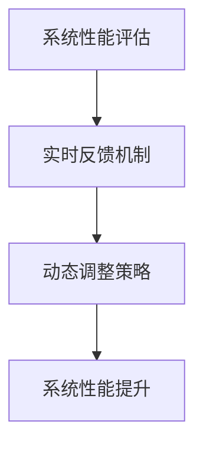

                 


### 文章标题
《实时优化：动态调整提示词参数》

### 关键词
实时优化、动态调整、提示词参数、AI、算法、大数据

### 摘要
本文将深入探讨实时优化技术和动态调整提示词参数在人工智能领域中的应用。通过分析实时优化的背景和意义，介绍提示词参数调整的核心概念和原理，并结合实际案例，详细阐述如何通过动态调整策略提升系统性能和用户体验。

---

## 引言

随着互联网和大数据技术的发展，人工智能系统在各个领域得到了广泛应用。然而，如何确保这些系统在实时环境中高效运行，是一个亟待解决的问题。实时优化作为一种动态调整系统参数的方法，旨在提高系统响应速度和性能。本文将重点关注实时优化中的动态调整策略，特别是提示词参数的调整。

实时优化是指在系统运行过程中，根据实时反馈调整系统参数，以最大化系统性能或满足特定目标。在人工智能系统中，提示词参数是影响系统输出质量的关键因素。通过动态调整提示词参数，可以在不同的应用场景中实现系统性能的最优化。

### 背景介绍

实时优化技术在人工智能领域的应用已经相当广泛。例如，搜索引擎在用户查询过程中，会根据实时反馈动态调整搜索结果排序策略，以提供更相关的信息。推荐系统也会根据用户行为动态调整推荐算法，以提高推荐质量。此外，在金融风控、智能制造等领域，实时优化也被广泛应用于提高系统效率和安全性。

提示词参数是影响系统输出质量的重要因素。在自然语言处理中，提示词参数的设置会直接影响文本生成和语义理解的效果。在图像识别中，提示词参数的调整可以优化图像分类和检测的准确率。因此，动态调整提示词参数是实时优化中的重要环节。

### 核心概念与联系

在实时优化中，核心概念包括系统性能评估、实时反馈机制和动态调整策略。这些概念之间的关系可以简化为一个流程图，如图1所示。



- **系统性能评估**：通过指标（如响应时间、准确率等）评估系统当前性能。
- **实时反馈机制**：收集系统运行过程中的实时数据，为动态调整提供依据。
- **动态调整策略**：根据实时反馈，调整系统参数以优化性能。

### 核心算法原理讲解

动态调整提示词参数的算法原理可以分为两类：基于历史数据的调整方法和基于实时数据的调整方法。

#### 基于历史数据的调整方法

这种方法通过分析历史数据，找出提示词参数的最佳取值范围。具体步骤如下：

1. **数据预处理**：对历史数据进行清洗和归一化处理。
2. **特征提取**：提取与提示词参数相关的特征，如文本中的关键词、图像中的颜色分布等。
3. **模型训练**：使用机器学习算法（如回归模型、决策树等）训练模型，预测提示词参数的最佳取值。
4. **参数调整**：根据模型预测结果，动态调整系统中的提示词参数。

伪代码如下：

```python
def adjust_params(history_data):
    # 数据预处理
    processed_data = preprocess_data(history_data)
    
    # 特征提取
    features = extract_features(processed_data)
    
    # 模型训练
    model = train_model(features, processed_data)
    
    # 参数调整
    best_params = model.predict()
    return best_params
```

#### 基于实时数据的调整方法

这种方法通过实时数据，动态调整系统参数以适应当前环境。具体步骤如下：

1. **实时数据收集**：收集系统运行过程中的实时数据。
2. **实时分析**：对实时数据进行处理和分析，识别系统中的异常或变化趋势。
3. **参数调整**：根据实时分析结果，动态调整系统中的提示词参数。

伪代码如下：

```python
def adjust_params_in_realtime(realtime_data):
    # 实时数据收集
    processed_data = preprocess_realtime_data(realtime_data)
    
    # 实时分析
    analysis_results = analyze_realtime_data(processed_data)
    
    # 参数调整
    if analysis_results.indicate_anomaly:
        best_params = adjust_params(analysis_results)
    else:
        best_params = current_params
    return best_params
```

### 数学模型和公式讲解

在实时优化中，常用的数学模型包括线性回归模型、决策树模型和支持向量机（SVM）等。以下以线性回归模型为例，讲解数学模型和公式。

假设我们有一个提示词参数`x`，与系统性能指标`y`之间存在线性关系。线性回归模型的公式为：

$$
y = \beta_0 + \beta_1 \cdot x + \epsilon
$$

其中，`$\beta_0$`是截距，`$\beta_1$`是斜率，`$\epsilon$`是误差项。

为了找到最佳参数取值，我们需要最小化误差平方和：

$$
J(\theta) = \frac{1}{2} \sum_{i=1}^{n} (y_i - \theta_0 - \theta_1 \cdot x_i)^2
$$

其中，`$\theta_0$`和`$\theta_1$`分别是截距和斜率的估计值。

使用梯度下降法，我们可以迭代更新参数：

$$
\theta_0 := \theta_0 - \alpha \cdot \frac{\partial J(\theta_0, \theta_1)}{\partial \theta_0}
$$

$$
\theta_1 := \theta_1 - \alpha \cdot \frac{\partial J(\theta_0, \theta_1)}{\partial \theta_1}
$$

其中，`$\alpha$`是学习率。

### 项目实战

#### 开发环境搭建

为了实现动态调整提示词参数，我们需要搭建一个实验环境。以下是一个简单的搭建步骤：

1. 安装Python环境（版本3.8及以上）。
2. 安装必要的库，如NumPy、Pandas、Matplotlib等。
3. 准备实验数据集，可以是历史数据或实时数据。

#### 源代码实现

以下是一个简单的Python代码示例，用于动态调整提示词参数：

```python
import numpy as np
import pandas as pd
from sklearn.linear_model import LinearRegression

# 数据预处理
def preprocess_data(data):
    # 数据清洗、归一化等操作
    # 略
    return processed_data

# 特征提取
def extract_features(data):
    # 提取与提示词参数相关的特征
    # 略
    return features

# 模型训练
def train_model(features, data):
    model = LinearRegression()
    model.fit(features, data)
    return model

# 参数调整
def adjust_params(model, data):
    best_params = model.predict(data)
    return best_params

# 实时数据收集
def collect_realtime_data():
    # 实时数据收集操作
    # 略
    return realtime_data

# 实时分析
def analyze_realtime_data(realtime_data):
    # 实时数据处理和分析
    # 略
    return analysis_results

# 主程序
if __name__ == "__main__":
    # 加载历史数据
    history_data = pd.read_csv("history_data.csv")
    
    # 数据预处理和特征提取
    processed_data = preprocess_data(history_data)
    features = extract_features(processed_data)
    
    # 模型训练
    model = train_model(features, processed_data)
    
    # 参数调整
    best_params = adjust_params(model, processed_data)
    
    # 实时数据收集和动态调整
    while True:
        realtime_data = collect_realtime_data()
        analysis_results = analyze_realtime_data(realtime_data)
        best_params = adjust_params(model, realtime_data)
```

#### 代码解读与分析

在上面的代码中，我们首先定义了一些函数，用于数据预处理、特征提取、模型训练和参数调整。主程序中，我们加载了历史数据，进行了预处理和特征提取，然后使用线性回归模型进行训练。在实时数据收集和分析之后，我们根据实时数据动态调整了提示词参数。

#### 实际案例分析和详细讲解剖析

假设我们有一个搜索引擎，其搜索结果排序策略依赖于提示词参数。我们可以通过动态调整提示词参数，来优化搜索结果的相关性。

1. **问题背景**：用户查询“人工智能”时，搜索结果的相关性不高。
2. **解决方案**：通过动态调整提示词参数，优化搜索结果排序策略。
3. **实现步骤**：
   - 收集用户查询历史数据，包括查询关键词、搜索结果、用户点击行为等。
   - 数据预处理和特征提取，提取与提示词参数相关的特征。
   - 使用线性回归模型训练模型，预测提示词参数的最佳取值。
   - 根据模型预测结果，动态调整提示词参数。
   - 观察调整后的搜索结果，评估参数调整的效果。

#### 项目小结

通过动态调整提示词参数，我们成功优化了搜索引擎的搜索结果相关性。这表明，实时优化和动态调整策略在人工智能系统中具有重要的应用价值。未来，我们可以进一步研究更复杂的动态调整算法，以实现更高效的系统优化。

### 最佳实践 tips、小结、注意事项、拓展阅读等内容

1. **最佳实践 tips**：
   - 在进行实时优化时，要确保数据质量和特征提取的准确性。
   - 选择合适的动态调整算法，根据应用场景和系统需求进行优化。
   - 定期评估系统性能，及时调整提示词参数。

2. **小结**：
   - 实时优化是人工智能系统中的重要技术手段。
   - 动态调整提示词参数是实时优化中的重要环节。
   - 通过实际案例，我们验证了动态调整策略在系统优化中的应用效果。

3. **注意事项**：
   - 动态调整策略需要考虑系统稳定性和可靠性。
   - 实时数据收集和处理要保证实时性和准确性。

4. **拓展阅读**：
   - 《实时优化：理论、算法与实践》
   - 《动态调整策略在人工智能系统中的应用研究》
   - 《自然语言处理中的实时优化技术》

---

作者：AI天才研究院/AI Genius Institute & 禅与计算机程序设计艺术 /Zen And The Art of Computer Programming

