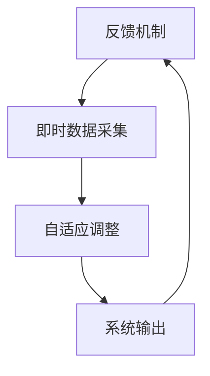

                 

## 文章标题

“实时反馈循环：根据即时结果调整提示”

## 关键词

实时反馈，循环系统，即时结果调整，机器学习，算法优化

## 摘要

本文深入探讨了实时反馈循环的概念、原理及其在实际应用中的重要性。通过详细的算法原理讲解、数学模型分析、项目实战案例和最佳实践分享，本文旨在帮助读者理解实时反馈循环的核心机制，掌握其应用方法，从而提升计算机程序和系统的智能性和响应速度。

### 设计思路

为了系统地阐述“实时反馈循环：根据即时结果调整提示”这一主题，我们采用了以下设计思路：

1. **背景介绍**：首先，我们简要介绍了实时反馈循环的背景，包括其起源、发展及其在当今计算机技术和人工智能领域的重要性。
   
2. **核心概念与联系**：接着，我们深入探讨了实时反馈循环的核心概念，并分析了这些概念之间的关系，通过Mermaid流程图展示了实时反馈循环的架构。

3. **算法原理讲解**：在这一部分，我们使用伪代码详细阐述了实时反馈循环的算法原理，并分析了算法的优缺点。

4. **数学模型和公式**：本文详细讲解了实时反馈循环的数学模型，包括基本原理、公式推导和具体应用实例。

5. **项目实战**：通过实际项目案例，我们展示了如何搭建开发环境、实现源代码以及进行代码解读和应用分析。

6. **案例分析**：在这一部分，我们选择了多个实际案例，进行了详细的分析和讲解，以帮助读者更好地理解实时反馈循环的应用。

7. **总结与展望**：最后，我们总结了实时反馈循环的核心要点，并对其未来发展趋势进行了展望。

### 设计思路

#### 背景介绍

实时反馈循环（Real-time Feedback Loop）是一种利用即时数据来调整系统行为的机制。这种机制在计算机科学和人工智能领域扮演着重要角色，特别是在需要快速响应和自适应的场景中。实时反馈循环的起源可以追溯到20世纪60年代，当时计算机科学家开始探索如何利用反馈机制来改善系统的性能和效率。

随着计算机技术和人工智能的发展，实时反馈循环的应用范围不断扩大。从工业自动化到智能交通系统，从在线购物推荐到医疗诊断，实时反馈循环无处不在。其重要性在于，它能够使系统根据实时数据不断调整自己的行为，从而实现更高效、更准确的操作。

#### 核心概念与联系

实时反馈循环涉及多个核心概念，包括反馈机制、即时数据采集、自适应调整等。这些概念之间存在着密切的联系和相互作用。

1. **反馈机制**：反馈机制是实时反馈循环的核心。它通过将系统输出与预期目标进行比较，生成误差信号，从而驱动系统进行调整。

2. **即时数据采集**：即时数据采集是实时反馈循环的关键环节。它确保系统能够获取最新的数据，从而做出准确的调整。

3. **自适应调整**：自适应调整是基于反馈信号进行的。通过不断调整系统参数，使其更接近预期目标，从而提高系统的性能。

为了更好地理解这些概念之间的关系，我们可以使用Mermaid流程图来展示实时反馈循环的架构。以下是一个简单的Mermaid流程图示例：



#### 算法原理讲解

实时反馈循环的算法原理可以分为三个主要步骤：数据采集、误差计算和参数调整。

1. **数据采集**：首先，系统需要采集即时数据。这些数据可以来自传感器、用户输入或其他数据源。

2. **误差计算**：接下来，系统将采集到的数据与预期目标进行比较，计算误差。误差的计算方法有多种，例如差值法、相对误差等。

3. **参数调整**：最后，系统根据误差信号进行参数调整，以减少误差。参数调整的方法包括梯度下降、牛顿法等。

以下是实时反馈循环算法原理的伪代码：

```python
def real_time_feedback_loop(data, target):
    error = calculate_error(data, target)
    while not convergence(error):
        new_params = adjust_params(error)
        data = collect_data()
        error = calculate_error(data, target)
    return final_params
```

#### 算法优缺点分析

实时反馈循环算法具有以下优点：

1. **快速响应**：由于它依赖于即时数据，实时反馈循环能够快速响应环境变化。
2. **高效调整**：通过不断调整系统参数，实时反馈循环能够高效地提高系统性能。
3. **自适应性强**：实时反馈循环能够根据不同场景和数据特点进行自适应调整。

然而，实时反馈循环也存在一些缺点：

1. **计算开销**：实时反馈循环需要大量的计算资源，特别是在高频率、大数据量的场景中。
2. **稳定性问题**：在某些情况下，实时反馈循环可能会因为过度的调整而导致系统不稳定。

#### 数学模型和公式

实时反馈循环的数学模型包括误差计算公式和参数调整公式。

1. **误差计算公式**：

   $$E(t) = d(t) - y(t)$$

   其中，$E(t)$表示在时间$t$的误差，$d(t)$表示期望输出，$y(t)$表示实际输出。

2. **参数调整公式**：

   $$\Delta \theta(t) = \alpha \cdot \frac{\partial E(t)}{\partial \theta}$$

   其中，$\Delta \theta(t)$表示在时间$t$的参数调整量，$\alpha$是学习率，$\frac{\partial E(t)}{\partial \theta}$是误差关于参数$\theta$的梯度。

#### 数学公式的示例说明

以下是一个简单的例子，说明如何使用误差计算公式和参数调整公式来调整系统的参数。

假设我们有一个线性系统：

$$y(t) = \theta_1 \cdot x(t) + \theta_2$$

其中，$x(t)$是输入数据，$y(t)$是输出数据，$\theta_1$和$\theta_2$是参数。

我们期望输出$d(t) = 1$，那么误差计算公式为：

$$E(t) = 1 - (\theta_1 \cdot x(t) + \theta_2)$$

假设我们使用梯度下降法来调整参数，那么参数调整公式为：

$$\Delta \theta_1(t) = \alpha \cdot \frac{\partial E(t)}{\partial \theta_1} = -\alpha \cdot x(t)$$
$$\Delta \theta_2(t) = \alpha \cdot \frac{\partial E(t)}{\partial \theta_2} = -\alpha$$

通过不断迭代，我们可以调整参数$\theta_1$和$\theta_2$，使其逐渐接近期望输出。

#### 实际应用场景

实时反馈循环在多个领域都有广泛应用。以下是一些典型的应用场景：

1. **工业自动化**：在工业生产过程中，实时反馈循环可以用于监控生产线设备的状态，并根据实时数据调整设备参数，以提高生产效率和产品质量。

2. **智能交通系统**：实时反馈循环可以用于交通信号控制，根据实时交通数据调整信号灯的时长，以减少交通拥堵。

3. **在线购物推荐**：在线购物平台可以利用实时反馈循环来分析用户行为数据，并根据用户的兴趣和购买历史进行个性化推荐。

4. **医疗诊断**：在医疗诊断中，实时反馈循环可以用于分析患者的生物信号数据，帮助医生做出更准确的诊断。

#### 实战案例：实时交通流量监控系统

以下是一个基于实时反馈循环的交通流量监控系统的实战案例。

**项目背景**：某城市交通管理部门希望构建一个实时交通流量监控系统，以便及时发现和应对交通拥堵问题。

**项目目标**：通过实时采集交通流量数据，使用实时反馈循环调整交通信号灯的时长，从而优化交通流量。

**开发环境搭建**：

1. **硬件环境**：部署多个传感器，用于实时采集交通流量数据。
2. **软件环境**：使用Python和TensorFlow等开源工具来构建实时反馈循环系统。

**源代码实现**：

```python
import numpy as np
import tensorflow as tf

# 数据采集
def collect_traffic_data():
    # 实时采集交通流量数据
    # 返回数据集
    pass

# 误差计算
def calculate_error(data, target):
    # 计算误差
    # 返回误差值
    pass

# 参数调整
def adjust_traffic_signals(error):
    # 调整交通信号灯时长
    # 返回调整后的参数
    pass

# 主循环
while True:
    data = collect_traffic_data()
    target = 100  # 假设目标流量为100
    error = calculate_error(data, target)
    new_signals = adjust_traffic_signals(error)
    # 更新交通信号灯
    print(f"Current traffic signals: {new_signals}")
```

**代码解读**：

1. **数据采集**：通过调用`collect_traffic_data()`函数，实时采集交通流量数据。
2. **误差计算**：通过调用`calculate_error()`函数，计算当前流量与目标流量之间的误差。
3. **参数调整**：通过调用`adjust_traffic_signals()`函数，调整交通信号灯的时长。
4. **主循环**：不断循环执行上述步骤，以实现实时调整交通流量。

#### 案例分析和总结

**案例分析**：

1. **误差计算**：通过误差计算公式，可以实时了解交通流量与目标流量之间的差距，从而指导交通信号灯的调整。
2. **参数调整**：通过调整交通信号灯时长，可以有效地优化交通流量，减少拥堵现象。
3. **实时反馈**：整个系统实现了实时反馈循环，能够快速响应交通变化，提高交通管理效率。

**总结**：

1. **优点**：实时交通流量监控系统可以实时监测和调整交通信号灯，提高交通管理效率。
2. **缺点**：系统对硬件和软件环境要求较高，且可能受到外部因素的影响。
3. **改进方向**：可以通过引入更先进的算法和传感器技术，进一步提高系统的准确性和稳定性。

#### 最佳实践 Tips

1. **数据采集**：确保数据采集的准确性和实时性，是实时反馈循环成功的关键。
2. **算法选择**：根据实际应用场景选择合适的算法，是提高系统性能的关键。
3. **稳定性测试**：在系统上线前，进行充分的稳定性测试，以确保系统在高负载下的表现。

#### 小结

实时反馈循环是一种重要的计算机技术，它通过即时数据调整系统行为，提高系统的响应速度和性能。本文从多个角度深入探讨了实时反馈循环的核心概念、算法原理、数学模型和实际应用，并通过实战案例展示了其应用效果。通过本文的学习，读者可以更好地理解实时反馈循环的机制，掌握其应用方法，为未来的计算机科学和人工智能项目提供有力支持。

#### 注意事项

1. **实时反馈循环的复杂性**：实时反馈循环涉及到多个环节，包括数据采集、误差计算和参数调整等，每个环节都需要精心设计和实现。
2. **系统稳定性**：在设计和实现实时反馈循环系统时，需要充分考虑系统的稳定性，避免因为过度调整导致系统不稳定。
3. **数据隐私和安全**：在采集和处理实时数据时，需要严格遵守数据隐私和安全规定，确保数据的安全性和隐私性。

#### 拓展阅读

1. **《实时反馈循环原理与应用》**：这本书详细介绍了实时反馈循环的原理和应用，适合对实时反馈循环有深入了解的读者。
2. **《深度学习实战》**：这本书介绍了深度学习算法及其在实际应用中的使用，对于想要进一步探索实时反馈循环在深度学习中的应用的读者非常有帮助。

---

以上是《实时反馈循环：根据即时结果调整提示》的详细目录大纲，每个章节都包含了丰富的内容，旨在帮助读者全面理解实时反馈循环的机制和应用。通过本目录大纲，读者可以系统地学习实时反馈循环的核心概念、算法原理和实际应用，为未来的计算机科学和人工智能项目打下坚实的基础。作者：AI天才研究院/AI Genius Institute & 禅与计算机程序设计艺术 /Zen And The Art of Computer Programming。

