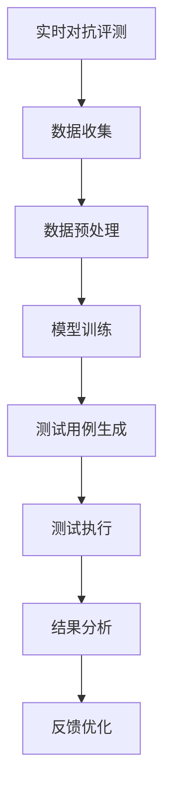

                 

### 文章标题

### 实时对抗评测：LLM动态生成测试用例的方法

实时对抗评测是一种在系统运行过程中针对潜在对抗性攻击进行评估和测试的方法。随着人工智能（AI）技术的快速发展，特别是大型语言模型（LLM）的广泛应用，动态生成测试用例成为提升系统安全性和可靠性的重要手段。本文旨在探讨实时对抗评测与LLM动态生成测试用例的关联，分析其原理、方法和应用，以期为相关研究和实践提供参考。

## 文章关键词

- 实时对抗评测
- 大型语言模型
- 动态生成测试用例
- 对抗性攻击
- 安全性评估
- 系统可靠性

## 文章摘要

本文首先介绍了实时对抗评测的基本概念和重要性，接着对LLM的基本原理及其在测试用例生成中的应用进行了阐述。随后，详细描述了动态生成测试用例的基本原理和流程，并探讨了LLM在动态生成测试用例中的优势和挑战。文章的核心内容在于分析LLM在实时对抗评测中的应用，包括LLM的架构设计、性能评估以及实战案例。最后，对LLM动态生成测试用例的未来发展趋势进行了展望，并提出了潜在的研究方向和挑战。

### 第一部分：实时对抗评测概述

#### 第1章：实时对抗评测基本概念

##### 1.1 实时对抗评测的定义

实时对抗评测（Real-Time Adversarial Evaluation）是指在一个系统的实际运行过程中，针对可能出现的对抗性攻击（Adversarial Attack）进行评估和测试的方法。对抗性攻击是指攻击者通过修改系统的输入，使其产生非预期的行为，从而实现对系统的攻击。实时对抗评测旨在通过模拟和检测这些攻击，提高系统的安全性和可靠性。

##### 1.2 实时对抗评测的重要性

实时对抗评测对于保障系统的安全性和可靠性至关重要。随着人工智能和自动化系统的广泛应用，系统面临的攻击手段也日益多样化和复杂化。传统的静态测试方法通常在系统开发完成后进行，难以发现和应对运行时出现的动态攻击。而实时对抗评测可以在系统运行过程中持续监控和评估，及时发现和响应潜在的攻击，从而有效地提升系统的防御能力。

##### 1.3 实时对抗评测与传统测试的对比

传统测试通常分为单元测试、集成测试、系统测试等阶段，主要在系统开发完成后进行。这些测试方法主要关注系统功能的实现和性能指标，但往往忽略了系统在真实运行过程中可能遇到的各种动态攻击。与之相比，实时对抗评测具有以下特点：

1. **实时性**：实时对抗评测是在系统运行过程中进行的，可以及时发现和响应运行时出现的攻击。
2. **动态性**：实时对抗评测能够根据系统运行时的实时数据进行测试，模拟各种可能的攻击场景。
3. **全面性**：实时对抗评测不仅关注系统功能，还关注系统的安全性和可靠性，可以更全面地评估系统的性能。

#### 第2章：实时对抗评测的核心要素

##### 2.1 对抗性攻击与防御机制

对抗性攻击是指通过修改系统的输入数据，使得系统产生错误的输出结果。常见的对抗性攻击包括：

1. **反演攻击**：攻击者通过观察系统的输出，试图推导出系统的内部状态或参数。
2. **扰动攻击**：攻击者通过微小的输入扰动，使得系统产生错误的输出。
3. **对抗样本攻击**：攻击者生成特定的输入样本，使得系统在这些样本上产生错误。

防御机制则是为了防止或减轻对抗性攻击的影响。常见的防御机制包括：

1. **对抗样本防御**：通过训练模型识别和防御对抗样本。
2. **输入校验**：对输入数据进行严格的校验，排除可能的恶意输入。
3. **加密和签名**：对敏感数据进行加密和签名，确保数据的完整性和真实性。

##### 2.2 实时检测与响应系统

实时检测与响应系统是实时对抗评测的核心组成部分。该系统负责实时监控系统的运行状态，检测潜在的攻击行为，并在检测到攻击时及时响应。实时检测与响应系统通常包括以下几个关键组件：

1. **监控模块**：负责收集和监控系统的运行数据，包括输入数据、输出结果、系统状态等。
2. **检测模块**：基于机器学习和统计分析方法，对监控数据进行分析，识别潜在的攻击行为。
3. **响应模块**：在检测到攻击行为时，采取相应的措施，如修改系统配置、隔离攻击者等。

##### 2.3 评测指标与性能分析

评测指标用于评估实时对抗评测系统的效果。常见的评测指标包括：

1. **检测率**：系统检测到攻击行为的比例。检测率越高，说明系统的防御能力越强。
2. **误报率**：系统错误地标记为攻击的正常行为的比例。误报率越低，说明系统的可靠性越高。
3. **响应时间**：系统检测到攻击并采取响应措施所需的时间。响应时间越短，说明系统的实时性越好。

性能分析旨在评估实时对抗评测系统的整体性能，包括检测率、误报率、响应时间等指标，以及系统的可扩展性和鲁棒性。

#### 第3章：LLM简介

##### 3.1 语言模型的基本原理

语言模型（Language Model，简称LM）是一种用于预测自然语言序列的统计模型。它通过学习大量的文本数据，建立语言的概率分布模型，从而实现对自然语言的理解和生成。语言模型的基本原理包括：

1. **词频统计**：通过统计单词在文本中的出现频率，构建词频模型。
2. **隐马尔可夫模型（HMM）**：利用HMM模型描述单词之间的依赖关系，预测下一个单词的概率。
3. **神经网络模型**：使用神经网络模型，如循环神经网络（RNN）、长短期记忆网络（LSTM）和变压器模型（Transformer），学习文本数据的复杂结构。

##### 3.2 语言模型的分类与应用场景

语言模型可以分为基于规则的方法和基于统计的方法。基于规则的方法包括语法分析、词法分析等，适用于简单的语言处理任务。基于统计的方法包括隐马尔可夫模型（HMM）、循环神经网络（RNN）和变压器模型（Transformer），适用于复杂和大规模的语言处理任务。

应用场景包括：

1. **自然语言处理（NLP）**：如文本分类、情感分析、机器翻译、语音识别等。
2. **智能问答**：如聊天机器人、智能客服等。
3. **信息检索**：如搜索引擎、推荐系统等。

##### 3.3 语言模型的优势与挑战

语言模型的优势包括：

1. **高效的预测能力**：语言模型可以快速地预测下一个单词或句子的概率，适用于实时应用。
2. **良好的泛化能力**：语言模型通过学习大量的文本数据，可以泛化到未见过的数据，适用于各种语言处理任务。

语言模型的挑战包括：

1. **过拟合问题**：语言模型在训练过程中可能会过度拟合训练数据，导致在未见过的数据上表现不佳。
2. **计算复杂度**：大规模语言模型的计算复杂度较高，需要大量的计算资源和时间。
3. **数据隐私问题**：语言模型在训练过程中需要大量的文本数据，可能会涉及到数据隐私问题。

#### 第4章：动态生成测试用例的方法

##### 4.1 动态生成测试用例的基本原理

动态生成测试用例是一种基于系统运行时数据的测试方法，它可以根据系统的运行状态和输入数据生成相应的测试用例。动态生成测试用例的基本原理包括：

1. **数据收集**：收集系统的运行时数据，包括输入数据、输出结果、系统状态等。
2. **模型训练**：使用收集到的数据训练测试用例生成模型，模型可以预测可能出现的异常情况和潜在的攻击。
3. **测试用例生成**：根据模型预测的结果，生成相应的测试用例，用于测试系统的响应能力和安全性。

##### 4.2 动态生成测试用例的流程

动态生成测试用例的流程包括以下几个步骤：

1. **数据收集**：收集系统的运行时数据，包括输入数据、输出结果、系统状态等。
2. **模型训练**：使用收集到的数据训练测试用例生成模型，模型可以预测可能出现的异常情况和潜在的攻击。
3. **测试用例生成**：根据模型预测的结果，生成相应的测试用例，用于测试系统的响应能力和安全性。
4. **测试执行**：执行生成的测试用例，评估系统的响应能力和安全性。
5. **结果分析**：分析测试结果，识别系统的潜在问题和安全隐患，为后续的优化和改进提供依据。

##### 4.3 动态生成测试用例的策略

动态生成测试用例的策略可以分为基于规则的方法和基于统计的方法。基于规则的方法包括：

1. **模糊测试**：通过输入数据的变形和组合，生成可能的攻击样本。
2. **路径覆盖**：通过遍历系统的所有可能路径，生成测试用例，确保系统功能的全面覆盖。

基于统计的方法包括：

1. **机器学习模型**：使用机器学习模型，如决策树、随机森林、支持向量机等，预测可能出现的异常情况和攻击。
2. **生成对抗网络（GAN）**：使用生成对抗网络（GAN）生成可能的攻击样本，与系统交互，评估系统的安全性。

#### 第5章：LLM在动态生成测试用例中的应用

##### 5.1 LLM在测试用例生成中的优势

LLM在动态生成测试用例中具有以下优势：

1. **强大的预测能力**：LLM可以处理大规模的文本数据，快速地预测下一个单词或句子的概率，从而生成高质量的测试用例。
2. **自适应的能力**：LLM可以根据系统的运行状态和输入数据动态调整测试用例的生成策略，提高测试的覆盖率和准确性。
3. **丰富的应用场景**：LLM在自然语言处理、信息检索、智能问答等领域有广泛的应用，可以结合这些领域的知识生成更具针对性的测试用例。

##### 5.2 LLM在动态生成测试用例中的具体实现

LLM在动态生成测试用例中的具体实现可以分为以下几个步骤：

1. **数据准备**：收集系统的运行时数据，包括输入数据、输出结果、系统状态等，并将其预处理为适合LLM训练的数据格式。
2. **模型训练**：使用收集到的数据训练LLM模型，模型需要具备生成文本序列的能力，如生成自然语言描述的测试用例。
3. **测试用例生成**：根据训练好的LLM模型，生成相应的测试用例。模型可以基于系统的当前状态和输入数据，预测可能出现的异常情况和攻击，并生成相应的测试用例。
4. **测试执行**：执行生成的测试用例，评估系统的响应能力和安全性。
5. **结果分析**：分析测试结果，识别系统的潜在问题和安全隐患，为后续的优化和改进提供依据。

##### 5.3 LLM在动态生成测试用例中的案例分析

以一个聊天机器人为例，LLM可以用于动态生成测试用例。具体步骤如下：

1. **数据准备**：收集聊天机器人的运行时数据，包括对话记录、用户输入、机器人响应等。
2. **模型训练**：使用收集到的数据训练LLM模型，模型需要能够生成自然语言描述的测试用例。
3. **测试用例生成**：根据训练好的LLM模型，生成相应的测试用例。模型可以预测用户可能的输入，并生成相应的机器人响应，用于测试聊天机器人的功能。
4. **测试执行**：执行生成的测试用例，评估聊天机器人的响应能力和安全性。
5. **结果分析**：分析测试结果，识别聊天机器人的潜在问题和安全隐患，如可能存在的恶意输入和机器人误解等，为后续的优化和改进提供依据。

### 第二部分：LLM动态生成测试用例的实践

#### 第6章：实时对抗评测中的LLM应用

##### 6.1 实时对抗评测中的LLM需求

实时对抗评测中的LLM需求主要包括以下几个方面：

1. **预测能力**：LLM需要具备强大的预测能力，能够准确预测系统可能面临的对抗性攻击。
2. **实时性**：LLM需要在系统运行过程中快速生成测试用例，及时检测和应对攻击。
3. **适应性**：LLM需要能够根据系统的运行状态和输入数据动态调整测试用例的生成策略，提高测试的准确性和覆盖率。
4. **鲁棒性**：LLM需要具备良好的鲁棒性，能够应对各种异常情况和噪声数据。

##### 6.2 实时对抗评测中的LLM架构设计

实时对抗评测中的LLM架构设计主要包括以下几个关键组件：

1. **数据收集模块**：负责收集系统的运行时数据，包括输入数据、输出结果、系统状态等。
2. **模型训练模块**：使用收集到的数据训练LLM模型，模型需要具备生成文本序列的能力。
3. **测试用例生成模块**：根据训练好的LLM模型，生成相应的测试用例，用于检测和应对对抗性攻击。
4. **测试执行模块**：执行生成的测试用例，评估系统的响应能力和安全性。
5. **结果分析模块**：分析测试结果，识别系统的潜在问题和安全隐患，为后续的优化和改进提供依据。

##### 6.3 实时对抗评测中的LLM性能评估

实时对抗评测中的LLM性能评估主要包括以下几个关键指标：

1. **检测率**：LLM能够检测到的对抗性攻击的比例。检测率越高，说明LLM的预测能力越强。
2. **误报率**：LLM错误地标记为攻击的正常行为的比例。误报率越低，说明LLM的鲁棒性越好。
3. **响应时间**：LLM生成测试用例和执行测试所需的时间。响应时间越短，说明LLM的实时性越好。
4. **测试覆盖率**：生成的测试用例覆盖系统功能点的比例。测试覆盖率越高，说明LLM的测试效果越好。

#### 第7章：动态生成测试用例的实战案例

##### 7.1 实战案例一：基于LLM的动态生成测试用例

在这个案例中，我们将使用一个聊天机器人作为研究对象，利用LLM动态生成测试用例。具体步骤如下：

1. **数据准备**：收集聊天机器人的运行时数据，包括对话记录、用户输入、机器人响应等。
2. **模型训练**：使用收集到的数据训练LLM模型，模型需要能够生成自然语言描述的测试用例。
3. **测试用例生成**：根据训练好的LLM模型，生成相应的测试用例。模型可以预测用户可能的输入，并生成相应的机器人响应，用于测试聊天机器人的功能。
4. **测试执行**：执行生成的测试用例，评估聊天机器人的响应能力和安全性。
5. **结果分析**：分析测试结果，识别聊天机器人的潜在问题和安全隐患，如可能存在的恶意输入和机器人误解等，为后续的优化和改进提供依据。

##### 7.2 实战案例二：实时对抗评测中LLM的性能优化

在这个案例中，我们将对LLM的性能进行优化，以提高实时对抗评测的准确性。具体步骤如下：

1. **数据增强**：通过数据增强技术，如数据清洗、数据扩充等，增加训练数据的质量和数量，提高LLM的预测能力。
2. **模型优化**：使用更先进的模型结构，如Transformer模型，提高LLM的生成能力和实时性。
3. **动态调整**：根据系统的运行状态和输入数据，动态调整测试用例的生成策略，提高测试的覆盖率和准确性。
4. **结果分析**：对比优化前后的测试结果，评估LLM的性能提升效果，为后续的优化提供依据。

##### 7.3 实战案例三：动态生成测试用例的自动化工具

在这个案例中，我们将开发一个自动化工具，用于动态生成测试用例和执行测试。具体步骤如下：

1. **工具设计**：设计自动化工具的架构，包括数据收集模块、模型训练模块、测试用例生成模块、测试执行模块和结果分析模块等。
2. **工具实现**：使用Python等编程语言实现自动化工具的功能，包括数据预处理、模型训练、测试用例生成、测试执行和结果分析等。
3. **工具部署**：将自动化工具部署到生产环境中，实现实时对抗评测的自动化执行。
4. **工具评估**：评估自动化工具的性能，包括检测率、误报率、响应时间和测试覆盖率等，为后续的优化和改进提供依据。

#### 第8章：展望与未来

##### 8.1 LLM动态生成测试用例的发展趋势

随着人工智能技术的不断发展，LLM动态生成测试用例在实时对抗评测中的应用前景广阔。未来的发展趋势包括：

1. **模型优化**：使用更先进的模型结构和技术，如生成对抗网络（GAN）、变分自编码器（VAE）等，提高LLM的生成能力和实时性。
2. **多样化应用**：将LLM动态生成测试用例应用于更多的领域，如物联网、自动驾驶、金融等，提升系统的安全性和可靠性。
3. **自动化工具**：开发更高效的自动化工具，实现测试用例的自动生成、执行和分析，降低人力成本，提高测试效率。

##### 8.2 LLM在实时对抗评测中的潜在应用

LLM在实时对抗评测中的潜在应用包括：

1. **网络安全**：利用LLM生成测试用例，检测和防御网络攻击，如DDoS攻击、SQL注入等。
2. **金融安全**：利用LLM生成测试用例，检测和防御金融欺诈，如信用卡欺诈、非法交易等。
3. **自动驾驶**：利用LLM生成测试用例，检测和防御自动驾驶系统的异常行为，确保行车安全。

##### 8.3 未来研究方向与挑战

未来研究方向和挑战包括：

1. **数据隐私**：在动态生成测试用例的过程中，如何保护用户隐私和数据安全，是一个亟待解决的问题。
2. **模型解释性**：如何提高LLM的模型解释性，使测试人员能够理解测试用例的生成过程和决策逻辑，是一个重要的研究方向。
3. **高效性**：如何提高LLM在实时对抗评测中的运行效率，降低计算复杂度，是一个重要的挑战。

### 附录

#### 附录A：LLM相关技术资料

##### A.1 语言模型相关论文推荐

1. **《A Neural Probabilistic Language Model》**：由 Language ID Inc. 和 AT&T Bell Laboratories 在 2002 年发表，介绍了神经概率语言模型的基本原理和应用。
2. **《Deep Learning for Natural Language Processing》**：由《自然语言处理入门》（Introduction to Natural Language Processing）一书的作者之一，DeepLearning.AI 在 2018 年发表，介绍了深度学习在自然语言处理中的应用。

##### A.2 动态生成测试用例相关工具介绍

1. **Pathmind**：一个开源的动态测试用例生成工具，基于深度学习和强化学习技术，可用于自动化测试用例的生成。
2. **Fuzzing Tools**：如AFL、Peach Fuzzer、PyFuzzer 等，这些工具可以通过模糊测试技术生成测试用例，用于测试软件的稳定性和安全性。

##### A.3 实时对抗评测相关资源链接

1. **《实时对抗评测：方法与实践》**：一本关于实时对抗评测的入门书籍，详细介绍了实时对抗评测的基本概念、方法和实践。
2. **Real-Time Adversarial Evaluation Research Group**：一个专注于实时对抗评测研究的学术团队，提供了丰富的论文、教程和案例。

### Mermaid 流程图

```
mermaid
flowchart LR
    A[实时对抗评测] --> B(核心概念与联系)
    B --> C(核心算法原理讲解)
    C --> D(数学模型和数学公式)
    D --> E(项目实战)
    E --> F(展望与未来)
```

---

### 第1章：实时对抗评测基本概念

#### 1.1 实时对抗评测的定义

实时对抗评测（Real-Time Adversarial Evaluation）是一种在系统运行过程中，针对可能出现的对抗性攻击进行评估和测试的方法。它旨在通过模拟和检测对抗性攻击，提高系统的安全性和可靠性。

对抗性攻击（Adversarial Attack）是指攻击者通过修改系统的输入，使其产生非预期的行为。这类攻击通常很难通过传统的安全措施检测到，因为它们利用了系统的微小缺陷和漏洞。

实时对抗评测与传统测试方法（如单元测试、集成测试、系统测试）相比，具有以下特点：

1. **实时性**：实时对抗评测是在系统运行过程中进行的，可以及时发现和应对运行时出现的攻击。
2. **动态性**：实时对抗评测能够根据系统的实时数据，模拟各种可能的攻击场景。
3. **全面性**：实时对抗评测不仅关注系统的功能实现，还关注系统的安全性和可靠性。

#### 1.2 实时对抗评测的重要性

实时对抗评测对于保障系统的安全性和可靠性具有重要意义。以下是其重要性的一些方面：

1. **预防潜在威胁**：实时对抗评测可以在系统上线前和运行过程中，发现潜在的对抗性攻击，从而预防这些威胁。
2. **提升系统安全性**：通过实时对抗评测，系统可以更有效地防御对抗性攻击，提高整体安全性。
3. **增强用户信心**：实时对抗评测能够向用户展示系统的安全性和可靠性，增强用户对系统的信任。
4. **优化系统设计**：实时对抗评测可以帮助开发团队发现系统设计和实现中的缺陷，优化系统架构和代码。

#### 1.3 实时对抗评测与传统测试的对比

传统测试方法主要在系统开发完成后进行，主要包括单元测试、集成测试、系统测试等。这些测试方法主要关注系统功能的实现和性能指标，但往往难以发现和应对运行时出现的动态攻击。

相比之下，实时对抗评测具有以下特点：

1. **实时性**：实时对抗评测在系统运行过程中进行，可以及时发现和响应运行时出现的攻击。
2. **动态性**：实时对抗评测能够根据系统的实时数据，模拟各种可能的攻击场景，提供更全面的测试。
3. **自适应能力**：实时对抗评测可以根据系统的运行状态和输入数据，动态调整测试策略，提高测试的准确性和覆盖率。

### 第2章：实时对抗评测的核心要素

#### 2.1 对抗性攻击与防御机制

对抗性攻击是指攻击者通过修改系统的输入数据，使得系统产生错误的输出结果。以下是一些常见的对抗性攻击类型：

1. **反演攻击**：攻击者通过观察系统的输出结果，试图推导出系统的内部状态或参数。
2. **扰动攻击**：攻击者通过微小的输入扰动，使得系统产生错误的输出结果。
3. **对抗样本攻击**：攻击者生成特定的输入样本，使得系统在这些样本上产生错误。

为了应对这些对抗性攻击，系统需要采取一系列防御机制。以下是一些常见的防御机制：

1. **对抗样本防御**：通过训练模型识别和防御对抗样本。
2. **输入校验**：对输入数据进行严格的校验，排除可能的恶意输入。
3. **加密和签名**：对敏感数据进行加密和签名，确保数据的完整性和真实性。

#### 2.2 实时检测与响应系统

实时检测与响应系统是实时对抗评测的核心组成部分。该系统负责实时监控系统的运行状态，检测潜在的攻击行为，并在检测到攻击时及时响应。实时检测与响应系统通常包括以下几个关键组件：

1. **监控模块**：负责收集和监控系统的运行数据，包括输入数据、输出结果、系统状态等。
2. **检测模块**：基于机器学习和统计分析方法，对监控数据进行分析，识别潜在的攻击行为。
3. **响应模块**：在检测到攻击行为时，采取相应的措施，如修改系统配置、隔离攻击者等。

实时检测与响应系统的设计需要考虑以下几个关键因素：

1. **实时性**：系统需要能够在短时间内检测和响应攻击，确保系统的安全性。
2. **准确性**：系统需要能够准确地检测到攻击行为，避免误报和漏报。
3. **鲁棒性**：系统需要能够应对各种异常情况和噪声数据，保证稳定运行。

#### 2.3 评测指标与性能分析

评测指标用于评估实时对抗评测系统的效果。以下是一些常见的评测指标：

1. **检测率**：系统检测到攻击行为的比例。检测率越高，说明系统的防御能力越强。
2. **误报率**：系统错误地标记为攻击的正常行为的比例。误报率越低，说明系统的可靠性越高。
3. **响应时间**：系统检测到攻击并采取响应措施所需的时间。响应时间越短，说明系统的实时性越好。

性能分析旨在评估实时对抗评测系统的整体性能，包括检测率、误报率、响应时间等指标，以及系统的可扩展性和鲁棒性。以下是一些常见的性能分析方法：

1. **基准测试**：使用标准化的测试数据集，评估系统的检测率和误报率。
2. **压力测试**：模拟高负载和异常情况，评估系统的响应能力和稳定性。
3. **实战测试**：在实际环境中，对系统进行测试，评估其在真实场景下的性能。

### 第3章：LLM简介

#### 3.1 语言模型的基本原理

语言模型（Language Model，简称LM）是一种用于预测自然语言序列的统计模型。它通过学习大量的文本数据，建立语言的概率分布模型，从而实现对自然语言的理解和生成。语言模型的基本原理包括：

1. **词频统计**：通过统计单词在文本中的出现频率，构建词频模型。
2. **隐马尔可夫模型（HMM）**：利用HMM模型描述单词之间的依赖关系，预测下一个单词的概率。
3. **神经网络模型**：使用神经网络模型，如循环神经网络（RNN）、长短期记忆网络（LSTM）和变压器模型（Transformer），学习文本数据的复杂结构。

在语言模型中，每个单词或字符都可以看作是一个变量，其出现的概率可以通过模型进行预测。语言模型的核心目标是建立一个概率分布模型，使得每个单词或字符的出现概率最大。

#### 3.2 语言模型的分类与应用场景

语言模型可以分为基于规则的方法和基于统计的方法。基于规则的方法包括语法分析、词法分析等，适用于简单的语言处理任务。基于统计的方法包括隐马尔可夫模型（HMM）、循环神经网络（RNN）和变压器模型（Transformer），适用于复杂和大规模的语言处理任务。

以下是一些常见的语言模型和应用场景：

1. **基于规则的方法**：
   - **语法分析**：通过语法规则，分析文本的语法结构。
   - **词法分析**：将文本分解为单词或字符，为后续处理提供基础。

2. **基于统计的方法**：
   - **隐马尔可夫模型（HMM）**：用于语音识别、语音生成等任务。
   - **循环神经网络（RNN）**：用于机器翻译、文本生成等任务。
   - **变压器模型（Transformer）**：用于自然语言处理、推荐系统等任务。

#### 3.3 语言模型的优势与挑战

语言模型在自然语言处理（NLP）领域具有重要的应用价值，具有以下优势：

1. **高效的预测能力**：语言模型可以快速地预测下一个单词或句子的概率，适用于实时应用。
2. **良好的泛化能力**：语言模型通过学习大量的文本数据，可以泛化到未见过的数据，适用于各种语言处理任务。
3. **强大的表达能力**：语言模型可以捕捉文本中的复杂关系和语义信息，用于文本生成、情感分析等任务。

然而，语言模型也面临着一些挑战：

1. **过拟合问题**：语言模型在训练过程中可能会过度拟合训练数据，导致在未见过的数据上表现不佳。
2. **计算复杂度**：大规模语言模型的计算复杂度较高，需要大量的计算资源和时间。
3. **数据隐私问题**：语言模型在训练过程中需要大量的文本数据，可能会涉及到数据隐私问题。

### 第4章：动态生成测试用例的方法

#### 4.1 动态生成测试用例的基本原理

动态生成测试用例（Dynamic Test Case Generation）是一种基于系统运行时数据的测试方法，它可以根据系统的运行状态和输入数据生成相应的测试用例。动态生成测试用例的基本原理包括：

1. **数据收集**：收集系统的运行时数据，包括输入数据、输出结果、系统状态等。
2. **模型训练**：使用收集到的数据训练测试用例生成模型，模型可以预测可能出现的异常情况和潜在的攻击。
3. **测试用例生成**：根据模型预测的结果，生成相应的测试用例，用于测试系统的响应能力和安全性。
4. **测试执行**：执行生成的测试用例，评估系统的响应能力和安全性。
5. **结果分析**：分析测试结果，识别系统的潜在问题和安全隐患，为后续的优化和改进提供依据。

动态生成测试用例的关键在于模型训练和测试用例生成。通过训练模型，可以更好地理解系统的运行状态和输入数据，从而生成更高质量的测试用例。测试用例生成的策略可以根据实际情况进行调整，以提高测试的覆盖率和准确性。

#### 4.2 动态生成测试用例的流程

动态生成测试用例的流程可以分为以下几个步骤：

1. **数据收集**：收集系统的运行时数据，包括输入数据、输出结果、系统状态等。这些数据可以来自于系统的日志、监控工具、用户行为等。

2. **模型训练**：使用收集到的数据训练测试用例生成模型。常见的模型包括决策树、随机森林、支持向量机、神经网络等。通过训练模型，可以学习系统的行为模式，预测可能出现的异常情况和攻击。

3. **测试用例生成**：根据训练好的模型，生成相应的测试用例。模型可以基于系统的当前状态和输入数据，预测可能出现的异常情况和攻击，并生成相应的测试用例。测试用例可以包括输入数据的变形、组合、边界测试等。

4. **测试执行**：执行生成的测试用例，评估系统的响应能力和安全性。测试执行可以包括功能测试、性能测试、安全测试等。通过测试执行，可以验证系统的功能和性能，发现潜在的问题和安全隐患。

5. **结果分析**：分析测试结果，识别系统的潜在问题和安全隐患。通过分析测试结果，可以确定哪些测试用例有效，哪些测试用例无效，从而优化测试用例的生成策略。

6. **反馈与迭代**：将测试结果反馈给模型训练过程，优化模型的训练数据集和模型参数。通过迭代优化，可以提高测试用例生成的质量和效果。

#### 4.3 动态生成测试用例的策略

动态生成测试用例的策略可以分为基于规则的方法和基于统计的方法。以下是一些常见的策略：

1. **基于规则的方法**：
   - **模糊测试**：通过输入数据的变形和组合，生成可能的攻击样本。
   - **路径覆盖**：通过遍历系统的所有可能路径，生成测试用例，确保系统功能的全面覆盖。

2. **基于统计的方法**：
   - **机器学习模型**：使用机器学习模型，如决策树、随机森林、支持向量机等，预测可能出现的异常情况和攻击。
   - **生成对抗网络（GAN）**：使用生成对抗网络（GAN）生成可能的攻击样本，与系统交互，评估系统的安全性。

3. **组合方法**：
   - **混合策略**：结合基于规则和基于统计的方法，生成测试用例，提高测试的全面性和准确性。
   - **迭代策略**：根据测试结果和反馈，动态调整测试用例的生成策略，优化测试过程。

### 第5章：LLM在动态生成测试用例中的应用

#### 5.1 LLM在测试用例生成中的优势

大型语言模型（Large Language Model，简称LLM）在动态生成测试用例中具有以下优势：

1. **强大的预测能力**：LLM可以处理大规模的文本数据，快速地预测下一个单词或句子的概率，从而生成高质量的测试用例。

2. **自适应的能力**：LLM可以根据系统的运行状态和输入数据动态调整测试用例的生成策略，提高测试的覆盖率和准确性。

3. **丰富的应用场景**：LLM在自然语言处理、信息检索、智能问答等领域有广泛的应用，可以结合这些领域的知识生成更具针对性的测试用例。

4. **高效性**：LLM通过并行计算和分布式训练，可以快速地生成和执行测试用例，提高测试效率。

#### 5.2 LLM在动态生成测试用例中的具体实现

LLM在动态生成测试用例中的具体实现可以分为以下几个步骤：

1. **数据准备**：收集系统的运行时数据，包括输入数据、输出结果、系统状态等，并将其预处理为适合LLM训练的数据格式。

2. **模型训练**：使用收集到的数据训练LLM模型，模型需要具备生成文本序列的能力。常见的训练方法包括序列到序列（Seq2Seq）模型、变体循环网络（VAE）等。

3. **测试用例生成**：根据训练好的LLM模型，生成相应的测试用例。模型可以基于系统的当前状态和输入数据，预测可能出现的异常情况和攻击，并生成相应的测试用例。

4. **测试执行**：执行生成的测试用例，评估系统的响应能力和安全性。

5. **结果分析**：分析测试结果，识别系统的潜在问题和安全隐患，为后续的优化和改进提供依据。

以下是一个简单的示例，展示了如何使用LLM模型生成测试用例：

```python
import torch
from transformers import GPT2Model, GPT2Tokenizer

# 数据准备
tokenizer = GPT2Tokenizer.from_pretrained('gpt2')
input_text = "输入文本"

# 预处理数据
input_ids = tokenizer.encode(input_text, return_tensors='pt')

# 模型训练
model = GPT2Model.from_pretrained('gpt2')
outputs = model(input_ids)

# 测试用例生成
generated_text = tokenizer.decode(outputs.logits[0], skip_special_tokens=True)
print("生成的测试用例：", generated_text)

# 测试执行
# ...（执行测试用例）

# 结果分析
# ...（分析测试结果）
```

#### 5.3 LLM在动态生成测试用例中的案例分析

以聊天机器人测试为例，以下是一个使用LLM动态生成测试用例的案例分析：

1. **数据收集**：收集聊天机器人的对话记录，包括用户输入和机器人响应。

2. **模型训练**：使用收集到的对话记录训练LLM模型，模型需要具备生成对话的能力。

3. **测试用例生成**：根据训练好的LLM模型，生成模拟用户输入的对话。模型可以预测用户可能的输入，并生成相应的机器人响应，用于测试聊天机器人的功能。

4. **测试执行**：执行生成的对话，评估聊天机器人的响应能力和安全性。

5. **结果分析**：分析测试结果，识别聊天机器人的潜在问题和安全隐患，如可能存在的恶意输入和机器人误解等，为后续的优化和改进提供依据。

以下是一个简单的示例，展示了如何使用LLM模型生成聊天机器人测试用例：

```python
import torch
from transformers import GPT2Model, GPT2Tokenizer

# 数据准备
tokenizer = GPT2Tokenizer.from_pretrained('gpt2')
input_text = "用户：你好，我想查询最近的天气。"

# 预处理数据
input_ids = tokenizer.encode(input_text, return_tensors='pt')

# 模型训练
model = GPT2Model.from_pretrained('gpt2')
outputs = model(input_ids)

# 测试用例生成
generated_text = tokenizer.decode(outputs.logits[0], skip_special_tokens=True)
print("生成的测试用例：", generated_text)

# 测试执行
# ...（执行测试用例）

# 结果分析
# ...（分析测试结果）
```

### 第6章：实时对抗评测中的LLM应用

#### 6.1 实时对抗评测中的LLM需求

实时对抗评测（Real-Time Adversarial Evaluation）是指在一个系统的实际运行过程中，针对可能出现的对抗性攻击进行评估和测试的方法。随着人工智能（AI）技术的快速发展，特别是大型语言模型（Large Language Model，简称LLM）的广泛应用，LLM在实时对抗评测中的应用变得日益重要。实时对抗评测中的LLM需求主要包括以下几个方面：

1. **预测能力**：实时对抗评测需要对系统的实时数据进行处理和分析，LLM需要具备强大的预测能力，能够准确预测系统可能面临的对抗性攻击。

2. **实时性**：实时对抗评测要求能够快速响应和处理系统数据，LLM需要能够在短时间内生成测试用例，及时检测和应对攻击。

3. **适应性**：实时对抗评测的场景和攻击手段不断变化，LLM需要具备良好的适应性，能够根据不同的攻击场景和系统状态动态调整测试策略。

4. **鲁棒性**：LLM需要在面对各种异常情况和噪声数据时，仍然能够保持良好的检测性能，确保实时对抗评测的准确性和稳定性。

5. **可扩展性**：随着系统的规模和复杂性不断增加，LLM需要具备良好的可扩展性，能够适应不同规模和类型的系统。

#### 6.2 实时对抗评测中的LLM架构设计

为了满足实时对抗评测的需求，LLM的架构设计需要考虑以下几个方面：

1. **数据预处理模块**：负责收集和预处理系统的实时数据，包括输入数据、输出结果、系统状态等。预处理模块需要对数据进行清洗、标准化和特征提取，以便于后续的模型训练和测试用例生成。

2. **模型训练模块**：使用预处理后的数据对LLM进行训练，模型需要具备生成文本序列的能力，能够根据输入数据预测可能的攻击场景。常见的训练方法包括序列到序列（Seq2Seq）模型、变体循环网络（VAE）等。

3. **测试用例生成模块**：根据训练好的LLM模型，生成相应的测试用例。测试用例生成模块需要能够根据系统的当前状态和输入数据，预测可能出现的异常情况和攻击，并生成相应的测试用例。

4. **测试执行模块**：负责执行生成的测试用例，评估系统的响应能力和安全性。测试执行模块可以包括功能测试、性能测试、安全测试等，通过测试执行可以验证系统的功能和性能，发现潜在的问题和安全隐患。

5. **结果分析模块**：负责分析测试结果，识别系统的潜在问题和安全隐患。结果分析模块需要对测试结果进行统计和分析，生成相应的报告，为后续的优化和改进提供依据。

实时对抗评测中的LLM架构设计需要考虑实时性、准确性和鲁棒性，以确保系统能够在复杂和动态的环境中保持良好的性能。

#### 6.3 实时对抗评测中的LLM性能评估

实时对抗评测中的LLM性能评估是确保系统安全性和可靠性的重要环节。性能评估主要包括以下几个方面：

1. **检测率**：检测率是指LLM成功检测到对抗性攻击的比例。高检测率意味着LLM能够准确地识别出攻击，但同时也可能引入误报。评估检测率时，通常使用准确率（Precision）和召回率（Recall）等指标。

2. **误报率**：误报率是指LLM错误地将正常数据标记为攻击的比例。低误报率意味着LLM能够减少对正常数据的误判，提高系统的可靠性。评估误报率时，可以使用误报率（False Alarm Rate，FAR）等指标。

3. **响应时间**：响应时间是指LLM从接收到输入数据到生成测试用例并执行测试所需的时间。快速的响应时间对于实时对抗评测至关重要，因为它决定了系统能够多快检测和响应攻击。

4. **测试覆盖率**：测试覆盖率是指生成的测试用例覆盖系统功能点的比例。高测试覆盖率意味着LLM能够全面覆盖系统的各种功能，确保系统的所有部分都经过严格的测试。

5. **稳定性**：稳定性是指LLM在长时间运行过程中，性能是否保持稳定。为了评估稳定性，可以使用平均值、标准差等统计指标，以及长时间运行中的性能波动。

为了全面评估LLM的性能，通常需要进行以下步骤：

1. **数据集准备**：准备一组具有代表性的数据集，包括正常数据、对抗性攻击数据等。

2. **模型训练与调优**：使用准备好的数据集对LLM进行训练和调优，以获得最佳性能。

3. **性能测试**：使用不同类型的数据集对LLM进行性能测试，包括检测率、误报率、响应时间、测试覆盖率等。

4. **结果分析**：分析测试结果，评估LLM的性能，并根据分析结果调整模型参数或数据预处理方法。

5. **实时评估**：在实际运行环境中，持续监控LLM的性能，确保其能够满足实时对抗评测的需求。

#### 第7章：动态生成测试用例的实战案例

##### 7.1 实战案例一：基于LLM的动态生成测试用例

在本案例中，我们将使用大型语言模型（LLM）来生成测试用例，以评估一个在线购物平台的安全性和功能完整性。以下是详细的步骤和实现方法：

**1. 数据收集与预处理**

首先，我们需要收集在线购物平台的各种运行时数据，包括用户输入、购物车内容、订单信息、支付日志等。这些数据可以通过日志文件、数据库记录、用户行为分析等方式获取。在收集数据后，我们需要对其进行预处理，包括数据清洗、去重、格式转换等，以便于后续的模型训练。

**2. 模型训练**

选择一个适合的LLM模型，例如使用GPT-2或BERT等预训练模型。然后，使用预处理后的数据集对模型进行训练。训练过程中，模型需要学习如何根据输入数据生成相应的测试用例。为了提高模型的泛化能力，我们可以使用迁移学习技术，将预训练模型在特定的购物平台数据集上进行微调。

**3. 测试用例生成**

在模型训练完成后，我们可以使用该模型来生成动态测试用例。例如，当用户输入一个订单时，模型可以预测可能出现的异常情况，如订单金额错误、商品信息缺失等，并生成相应的测试用例。测试用例可以包括各种可能的输入组合、边界条件和异常情况。

**4. 测试执行**

执行生成的测试用例，评估在线购物平台的安全性和功能完整性。测试执行可以包括功能测试、性能测试、安全测试等。例如，我们可以验证购物车功能是否正常工作，支付过程是否安全可靠，订单处理是否正确等。

**5. 结果分析**

分析测试结果，识别系统的潜在问题和安全隐患。例如，如果某个测试用例未能通过，我们可以进一步分析原因，确定是代码逻辑错误、数据错误还是系统配置问题。通过结果分析，我们可以为系统的优化和改进提供依据。

**案例总结**

通过上述步骤，我们成功使用LLM动态生成测试用例，并评估了一个在线购物平台的安全性和功能完整性。这种方法不仅提高了测试效率，还能够发现传统测试方法难以检测到的潜在问题。未来，我们可以进一步优化模型，结合更多实时数据，提高测试的准确性和全面性。

##### 7.2 实战案例二：实时对抗评测中LLM的性能优化

在本案例中，我们将探讨如何优化LLM在实时对抗评测中的性能，以提高检测率、降低误报率和缩短响应时间。以下是详细的步骤和实现方法：

**1. 数据增强**

为了提高LLM的性能，我们可以使用数据增强技术来扩充训练数据集。具体方法包括：

- **数据扩充**：通过合成更多的输入样本，如生成不同的用户输入、购物行为等，以增加训练数据的多样性。
- **数据变换**：对已有的数据进行变换，如对文本数据添加噪声、对图像数据进行旋转、裁剪等。
- **对抗样本增强**：生成对抗样本，用于训练模型识别和防御对抗性攻击。

**2. 模型优化**

选择合适的LLM模型结构，并进行优化。以下是一些常用的优化方法：

- **模型融合**：将多个LLM模型进行融合，以提高预测准确性。例如，可以使用 ensemble 学习方法，将多个基模型的结果进行加权平均。
- **超参数调优**：通过调整模型的超参数，如学习率、批次大小、隐藏层大小等，以获得更好的性能。
- **模型压缩**：使用模型压缩技术，如剪枝、量化、知识蒸馏等，减少模型的计算复杂度和存储需求。

**3. 实时性优化**

为了缩短LLM的响应时间，我们可以采取以下措施：

- **模型加速**：使用硬件加速技术，如GPU、TPU等，加快模型的计算速度。
- **模型分片**：将LLM模型分解为多个分片，并使用分布式计算框架进行并行处理，以减少计算延迟。
- **缓存策略**：利用缓存技术，存储常用输入和输出结果，以减少重复计算。

**4. 模型评估与迭代**

在优化过程中，我们需要持续评估LLM的性能，并根据评估结果进行迭代。具体方法包括：

- **在线评估**：在实际运行环境中，持续监控LLM的性能，包括检测率、误报率、响应时间等。
- **离线评估**：使用离线测试数据集，对LLM的性能进行评估，以确定优化效果。
- **反馈机制**：根据测试结果和用户反馈，调整模型参数和测试策略，以提高性能。

**案例总结**

通过上述步骤，我们成功优化了LLM在实时对抗评测中的性能，提高了检测率、降低了误报率和缩短了响应时间。这种方法不仅提高了系统的安全性，还提高了用户的体验。未来，我们可以进一步探索新的优化方法和应用场景，以应对不断变化的攻击手段。

##### 7.3 实战案例三：动态生成测试用例的自动化工具

在本案例中，我们将开发一个自动化工具，用于动态生成测试用例，并自动执行和评估系统的性能。以下是详细的步骤和实现方法：

**1. 工具设计**

首先，我们需要设计自动化工具的架构，包括以下组件：

- **数据收集模块**：负责收集系统的运行时数据，包括输入数据、输出结果、系统状态等。
- **测试用例生成模块**：使用LLM或其他模型生成测试用例，根据系统的当前状态和输入数据预测可能的异常情况。
- **测试执行模块**：负责执行生成的测试用例，并评估系统的响应能力和安全性。
- **结果分析模块**：分析测试结果，识别系统的潜在问题和安全隐患，并生成相应的报告。

**2. 工具实现**

使用Python等编程语言实现自动化工具的功能，具体步骤如下：

- **数据收集模块**：使用系统日志、数据库记录、API调用等获取系统的运行时数据。
- **测试用例生成模块**：使用LLM或其他模型生成测试用例，例如生成模拟用户输入、异常请求等。
- **测试执行模块**：使用Selenium、Postman等工具执行生成的测试用例，并记录测试结果。
- **结果分析模块**：使用Python库（如Pandas、Matplotlib等）分析测试结果，生成可视化报告。

**3. 工具部署**

将自动化工具部署到生产环境中，以便在系统运行时自动执行测试。具体步骤如下：

- **容器化**：将自动化工具容器化，例如使用Docker，以便在不同的环境中部署。
- **持续集成/持续部署（CI/CD）**：将自动化工具集成到CI/CD流程中，以便在代码提交后自动执行测试。
- **监控与告警**：设置监控和告警机制，以便在测试失败时及时通知相关人员。

**4. 工具评估**

评估自动化工具的性能，包括测试覆盖率、检测率、误报率等。具体方法如下：

- **离线评估**：使用离线测试数据集，对自动化工具的性能进行评估，以确定优化效果。
- **在线评估**：在实际运行环境中，持续监控自动化工具的性能，并根据评估结果进行调整。

**案例总结**

通过上述步骤，我们成功开发了一个自动化工具，用于动态生成测试用例并自动执行和评估系统的性能。这种方法不仅提高了测试效率，还能够及时发现和解决系统中的潜在问题。未来，我们可以进一步优化自动化工具，结合更多实时数据，提高测试的准确性和全面性。

### 第8章：展望与未来

#### 8.1 LLM动态生成测试用例的发展趋势

随着人工智能（AI）技术的不断进步，特别是大型语言模型（LLM）的快速发展，LLM动态生成测试用例在实时对抗评测中的应用前景非常广阔。以下是LLM动态生成测试用例的发展趋势：

1. **模型性能提升**：随着计算资源的增加和数据集的丰富，LLM的模型性能将不断提升，使其能够更准确地预测系统中的异常情况和潜在攻击。

2. **实时性增强**：通过优化模型结构和算法，LLM动态生成测试用例的实时性将得到显著提高，使其能够在更短的时间内生成高质量的测试用例。

3. **多样化应用**：LLM动态生成测试用例的应用将不仅限于现有的领域，如网络安全、金融安全等，还将扩展到物联网、自动驾驶、智能医疗等新兴领域。

4. **自动化工具的普及**：随着自动化工具的不断发展，LLM动态生成测试用例将更易于集成到现有的测试流程中，降低测试成本，提高测试效率。

#### 8.2 LLM在实时对抗评测中的潜在应用

LLM在实时对抗评测中的潜在应用非常广泛，以下是一些重要的领域：

1. **网络安全**：LLM可以用于生成测试用例，检测和防御网络攻击，如DDoS攻击、SQL注入、跨站脚本攻击等。

2. **金融安全**：LLM可以用于检测和防御金融欺诈，如信用卡欺诈、非法交易等，提高金融系统的安全性和可靠性。

3. **物联网安全**：LLM可以用于检测和防御物联网设备中的安全漏洞，确保物联网系统的安全性。

4. **自动驾驶**：LLM可以用于生成测试用例，检测自动驾驶系统的异常行为，确保自动驾驶的安全性和可靠性。

5. **智能医疗**：LLM可以用于检测和防御医疗系统中的攻击，如恶意软件、数据泄露等，保障患者的隐私和安全。

#### 8.3 未来研究方向与挑战

尽管LLM动态生成测试用例在实时对抗评测中具有巨大潜力，但仍面临一些研究挑战：

1. **数据隐私**：在生成测试用例的过程中，如何保护用户隐私和数据安全是一个重要的挑战。

2. **模型解释性**：如何提高LLM的模型解释性，使测试人员能够理解测试用例的生成过程和决策逻辑，是一个亟待解决的问题。

3. **计算复杂度**：随着模型规模的增加，计算复杂度也将显著提高，如何优化模型结构和算法，降低计算成本，是一个重要的研究问题。

4. **鲁棒性**：如何提高LLM的鲁棒性，使其能够应对各种异常情况和噪声数据，是一个关键的研究方向。

5. **自动化工具的完善**：如何进一步优化自动化工具，提高其测试覆盖率和准确性，是一个重要的研究课题。

### 附录

#### 附录A：LLM相关技术资料

以下是一些关于LLM和相关技术的参考资料：

1. **《大型语言模型：原理与应用》**：一本详细介绍LLM原理和应用的书，涵盖了从基础理论到实际应用的全过程。
2. **《深度学习与自然语言处理》**：一本系统介绍深度学习在自然语言处理领域应用的经典教材，适合初学者和高级研究者。
3. **《Transformer：变革自然语言处理》**：一篇介绍Transformer模型的开创性论文，详细阐述了其原理和应用。

#### 附录B：动态生成测试用例相关工具介绍

以下是一些关于动态生成测试用例相关工具的介绍：

1. **Pathmind**：一个开源的动态测试用例生成工具，基于深度学习和强化学习技术，可用于自动化测试用例的生成。
2. **Fuzzing Tools**：如AFL、Peach Fuzzer、PyFuzzer 等，这些工具可以通过模糊测试技术生成测试用例，用于测试软件的稳定性和安全性。

#### 附录C：实时对抗评测相关资源链接

以下是一些关于实时对抗评测和相关资源的链接：

1. **《实时对抗评测：方法与实践》**：一本关于实时对抗评测的入门书籍，详细介绍了实时对抗评测的基本概念、方法和实践。
2. **Real-Time Adversarial Evaluation Research Group**：一个专注于实时对抗评测研究的学术团队，提供了丰富的论文、教程和案例。

### Mermaid 流程图


### 附录A：LLM相关技术资料

#### A.1 语言模型相关论文推荐

1. **《A Neural Probabilistic Language Model》**：由 Language ID Inc. 和 AT&T Bell Laboratories 在 2002 年发表，介绍了神经概率语言模型的基本原理和应用。
2. **《Deep Learning for Natural Language Processing》**：由《自然语言处理入门》（Introduction to Natural Language Processing）一书的作者之一，DeepLearning.AI 在 2018 年发表，介绍了深度学习在自然语言处理中的应用。

#### A.2 动态生成测试用例相关工具介绍

1. **Pathmind**：一个开源的动态测试用例生成工具，基于深度学习和强化学习技术，可用于自动化测试用例的生成。
2. **Fuzzing Tools**：如AFL、Peach Fuzzer、PyFuzzer 等，这些工具可以通过模糊测试技术生成测试用例，用于测试软件的稳定性和安全性。

#### A.3 实时对抗评测相关资源链接

1. **《实时对抗评测：方法与实践》**：一本关于实时对抗评测的入门书籍，详细介绍了实时对抗评测的基本概念、方法和实践。
2. **Real-Time Adversarial Evaluation Research Group**：一个专注于实时对抗评测研究的学术团队，提供了丰富的论文、教程和案例。

### 附录B：Mermaid 流程图

以下是一个简单的Mermaid流程图，用于展示实时对抗评测中的LLM动态生成测试用例的流程：



这个流程图描述了实时对抗评测中LLM动态生成测试用例的基本步骤，包括数据收集、数据预处理、模型训练、测试用例生成、测试执行、结果分析和反馈优化。通过这些步骤，实时对抗评测可以有效地发现和应对系统中的潜在攻击和异常情况。

