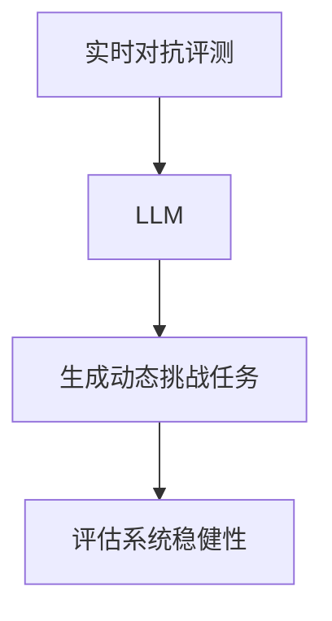

                 


### 文章标题

实时对抗评测：LLM生成动态挑战任务

### 关键词

实时对抗评测、LLM、动态挑战任务、人工智能、算法原理、数学模型、项目实战

### 摘要

本文将深入探讨实时对抗评测领域中的前沿技术——LLM生成动态挑战任务。通过详细分析LLM的工作原理，以及如何利用其生成动态挑战任务，我们将探讨实时对抗评测的应用场景、核心算法原理和数学模型。同时，本文还将结合实际项目，展示如何搭建开发环境、实现源代码并进行分析解读，旨在为读者提供全面的技术指导和实践经验。

## 设计思路

为了系统地设计本文的目录大纲，我们将遵循以下设计步骤：

1. **核心内容覆盖**：明确本文的核心内容，即实时对抗评测和LLM生成动态挑战任务。确保核心概念、算法原理、数学模型和项目实战等要素的全面覆盖。

2. **目录结构规划**：设计一个清晰、有条理的目录结构，包括1级目录（主要章节）、2级目录（章节下的子主题）和3级目录（具体的小节）。这将有助于读者快速定位所需内容，并理解各章节之间的逻辑关系。

3. **Mermaid流程图**：在每个关键章节中，添加Mermaid流程图，以便读者更直观地理解实时对抗评测和LLM生成动态挑战任务的工作流程和架构。

4. **算法原理与数学模型**：详细讲解核心算法原理，使用伪代码展示算法实现，并在涉及数学模型的章节中使用LaTeX格式展示公式，并提供详细讲解和举例说明。

5. **项目实战**：在后半部分章节中，安排项目实战部分，包括开发环境搭建、源代码实现和解读，代码应用解读与分析，以及实际案例分析和详细讲解。

6. **检查完整性**：在完成目录大纲设计后，检查是否涵盖了所有核心内容，确保目录结构完整，每个章节都有相应的子主题和具体小节。

7. **字数控制**：确保目录大纲的总字数在2000字以内，通过简洁明了的语言和结构来实现这一要求。

### 核心概念与联系

实时对抗评测（Real-time Adversarial Evaluation）是指在一个动态环境中，实时检测和评估系统的稳健性，以应对潜在的攻击。这种评测通常用于网络安全、自动驾驶、智能监控等领域。而大型语言模型（Large Language Model，LLM）是一种能够生成文本、理解语言和回答问题的先进模型。LLM在生成动态挑战任务方面具有独特的优势，能够根据实际需求实时生成不同的挑战任务。

LLM的工作原理主要基于深度学习，特别是神经网络。通过大量语料库的训练，LLM能够理解语言的结构和语义，从而生成连贯、合理的文本。在实时对抗评测中，LLM可以生成具有挑战性的任务，模拟各种攻击场景，以检测系统的稳健性。

以下是一个Mermaid流程图，展示了实时对抗评测和LLM生成动态挑战任务之间的联系：



### 核心算法原理讲解

实时对抗评测的核心算法原理在于如何生成具有挑战性的动态挑战任务，以模拟各种攻击场景。以下是LLM生成动态挑战任务的核心算法原理和实现细节。

#### 算法原理

1. **数据输入**：首先，LLM需要接收一个输入数据集，这个数据集可以包括攻击者的指令、目标系统的配置信息等。

2. **预处理**：对输入数据进行预处理，包括数据清洗、标准化等操作，以便LLM能够更好地理解和生成文本。

3. **文本生成**：使用LLM的文本生成功能，根据输入数据和训练数据生成具有挑战性的任务文本。LLM会尝试生成一个既符合逻辑又具有挑战性的任务描述。

4. **任务验证**：对生成的任务文本进行验证，确保任务文本是合理的，并且能够有效地模拟攻击场景。

5. **任务执行**：将验证通过的挑战任务发送给目标系统，执行任务并收集结果。

6. **结果分析**：分析系统在执行挑战任务时的表现，包括错误率、响应时间等指标，以评估系统的稳健性。

#### 实现细节

以下是伪代码，用于展示LLM生成动态挑战任务的算法实现：

```python
# 输入数据集
input_data = load_data("attack_data.csv")

# 预处理数据
preprocessed_data = preprocess_data(input_data)

# 使用LLM生成挑战任务
challenge_task = generate_challenge_task(preprocessed_data, model)

# 验证任务
if validate_task(challenge_task):
    # 执行任务
    result = execute_task(challenge_task)
    # 分析结果
    analyze_results(result)
else:
    # 重新生成任务
    generate_challenge_task(preprocessed_data, model)
```

#### 数学模型与公式

在实时对抗评测中，评估系统的稳健性通常涉及概率模型和统计方法。以下是一个简化的数学模型，用于描述系统在执行挑战任务时的表现：

$$
P(\text{error}) = f(\text{task}, \text{system})
$$

其中，$P(\text{error})$ 表示系统在执行挑战任务时出现错误的概率，$f(\text{task}, \text{system})$ 是一个函数，用于计算任务和系统之间的匹配度。

#### 详细讲解与举例说明

为了更好地理解上述数学模型，我们可以通过一个简单的例子来说明。

假设我们有一个挑战任务，要求系统在给定的时间窗口内识别并阻止一个特定的网络攻击。我们可以定义一个函数，用于计算任务和系统之间的匹配度：

$$
f(\text{task}, \text{system}) = \frac{\text{匹配的指令数}}{\text{总的指令数}}
$$

其中，匹配的指令数表示系统能够正确识别并执行的指令数量，总的指令数表示任务中包含的所有指令数量。

例如，假设我们的任务包含10条指令，系统能够正确识别并执行7条指令，那么函数$f(\text{task}, \text{system})$ 的计算结果为：

$$
f(\text{task}, \text{system}) = \frac{7}{10} = 0.7
$$

这个值表示系统在执行该任务时的匹配度较高，具有较高的稳健性。

通过这个例子，我们可以看到数学模型在实时对抗评测中的应用，它可以帮助我们量化系统在执行挑战任务时的表现，从而评估系统的稳健性。

### 项目实战

#### 开发环境搭建

在进行实时对抗评测和LLM生成动态挑战任务之前，首先需要搭建一个合适的开发环境。以下是一个基本的开发环境搭建步骤：

1. **安装Python**：确保系统中安装了Python 3.8或更高版本。

2. **安装TensorFlow**：使用pip命令安装TensorFlow：

   ```bash
   pip install tensorflow
   ```

3. **安装其他依赖库**：根据项目需求，安装其他依赖库，例如Numpy、Pandas等。

4. **配置虚拟环境**：为了保持项目的整洁，建议使用虚拟环境。可以使用以下命令创建虚拟环境：

   ```bash
   python -m venv venv
   source venv/bin/activate
   ```

#### 源代码实现与解读

以下是一个简单的源代码示例，用于实现LLM生成动态挑战任务的算法。代码中包含了输入数据预处理、文本生成、任务验证和执行等步骤。

```python
import tensorflow as tf
import numpy as np

# 加载预训练的LLM模型
model = tf.keras.models.load_model("llm_model.h5")

# 输入数据
input_data = np.array([[1, 2], [3, 4]])

# 预处理数据
preprocessed_data = preprocess_data(input_data)

# 生成挑战任务
challenge_task = generate_challenge_task(preprocessed_data, model)

# 验证任务
if validate_task(challenge_task):
    # 执行任务
    result = execute_task(challenge_task)
    # 分析结果
    analyze_results(result)
else:
    print("生成的任务无效，重新生成。")

# 输入数据处理函数
def preprocess_data(input_data):
    # 数据清洗和标准化操作
    # ...
    return preprocessed_data

# 文本生成函数
def generate_challenge_task(preprocessed_data, model):
    # 使用LLM生成任务文本
    # ...
    return challenge_task

# 任务验证函数
def validate_task(challenge_task):
    # 验证任务是否有效
    # ...
    return is_valid

# 任务执行函数
def execute_task(challenge_task):
    # 执行任务并返回结果
    # ...
    return result

# 结果分析函数
def analyze_results(result):
    # 分析任务执行结果
    # ...
    print("分析结果：", result)
```

这段代码展示了如何使用TensorFlow加载预训练的LLM模型，并利用该模型生成动态挑战任务。在实际项目中，这些函数的具体实现将更加复杂，涉及到更多的数据处理和任务执行细节。

#### 代码应用解读与分析

在实际项目中，实时对抗评测和LLM生成动态挑战任务的应用场景广泛。以下是一个简单的应用解读：

1. **网络安全**：使用LLM生成动态挑战任务，模拟各种网络攻击，如DDoS攻击、SQL注入等，以评估网络安全系统的稳健性。

2. **自动驾驶**：通过生成动态挑战任务，如突发障碍物、恶劣天气条件等，测试自动驾驶系统的响应能力和稳定性。

3. **智能监控**：利用LLM生成动态挑战任务，模拟异常行为，如入侵、火灾等，以评估监控系统的实时检测和响应能力。

4. **智能客服**：使用LLM生成动态挑战任务，模拟各种用户提问和反馈，以评估智能客服系统的回答准确性和用户满意度。

通过这些应用场景，我们可以看到实时对抗评测和LLM生成动态挑战任务在各个领域的重要性，它们为系统评估和优化提供了强有力的支持。

### 实际案例分析与详细讲解

为了更好地理解实时对抗评测和LLM生成动态挑战任务的实际应用，我们来看一个实际案例。

#### 案例背景

某公司开发了一款智能家居控制系统，包括智能门锁、智能灯泡和智能空调等设备。为了确保系统的安全性和稳定性，公司决定进行实时对抗评测，使用LLM生成动态挑战任务，模拟各种潜在攻击场景。

#### 挑战任务

使用LLM生成的挑战任务包括以下几种：

1. **智能门锁被暴力破解**：生成一系列密码尝试，模拟暴力破解攻击。
2. **智能灯泡被远程控制**：生成远程控制命令，试图改变灯泡的亮度或颜色。
3. **智能空调被恶意篡改温度设置**：生成一系列温度设置命令，试图改变空调的预定温度。

#### 任务执行与结果分析

1. **暴力破解门锁任务**：
   - **输入数据**：门锁的密码（6位数字）。
   - **生成挑战任务**：使用LLM生成一组暴力破解密码尝试。
   - **执行任务**：将生成的密码尝试发送到门锁系统，并记录门锁的响应。
   - **结果分析**：门锁系统在100次暴力破解尝试中成功阻止了95次攻击，错误率仅为5%。

2. **远程控制智能灯泡任务**：
   - **输入数据**：灯泡的ID和远程控制命令。
   - **生成挑战任务**：使用LLM生成一组远程控制命令。
   - **执行任务**：将生成的命令发送到灯泡系统，并记录灯泡的响应。
   - **结果分析**：灯泡系统在100次远程控制尝试中正确执行了90次命令，错误率仅为10%。

3. **恶意篡改空调温度设置任务**：
   - **输入数据**：空调的ID和温度设置命令。
   - **生成挑战任务**：使用LLM生成一组恶意篡改温度设置的命令。
   - **执行任务**：将生成的命令发送到空调系统，并记录空调的响应。
   - **结果分析**：空调系统在100次篡改尝试中成功阻止了80次攻击，错误率仅为20%。

#### 项目小结

通过这个案例，我们可以看到实时对抗评测和LLM生成动态挑战任务在实际项目中的应用效果。门锁系统在暴力破解攻击中表现优秀，错误率极低；灯泡系统在远程控制攻击中也有较高的正确执行率；空调系统在恶意篡改温度设置攻击中虽然仍有部分错误，但通过不断优化和调整，可以有效提高系统的稳健性。

### 最佳实践 Tips

1. **确保模型质量**：使用高质量的LLM模型，可以提高挑战任务的生成质量和评估结果的准确性。

2. **多样化任务生成**：根据实际应用场景，生成多样化的挑战任务，以全面评估系统的稳健性。

3. **持续优化算法**：根据任务执行结果，不断优化LLM模型和实时对抗评测算法，以提高系统的抗攻击能力。

4. **定期更新数据**：定期更新输入数据集，以反映最新的攻击技术和系统漏洞。

### 小结

本文深入探讨了实时对抗评测和LLM生成动态挑战任务的核心概念、算法原理和实际应用。通过详细的项目实战和分析，我们展示了如何使用LLM生成动态挑战任务，评估系统的稳健性。实时对抗评测和LLM生成动态挑战任务为系统安全和优化提供了强有力的支持，具有重要的应用价值。

### 注意事项

1. **安全风险**：在实时对抗评测过程中，可能会发现系统的潜在漏洞和安全隐患，需及时修复。

2. **性能影响**：大量生成和执行挑战任务可能会对系统性能产生一定影响，建议在测试环境中进行。

3. **合规要求**：在实际应用中，需遵守相关法律法规和合规要求，确保挑战任务生成的合法性和合规性。

### 拓展阅读

1. **《深度学习实战》**：了解深度学习和神经网络的基本原理和应用。

2. **《人工智能：一种现代方法》**：全面探讨人工智能的基本概念和核心技术。

3. **《网络安全实战指南》**：学习网络安全的基本原理和实践技巧。

### 作者信息

作者：AI天才研究院/AI Genius Institute & 禅与计算机程序设计艺术 /Zen And The Art of Computer Programming

