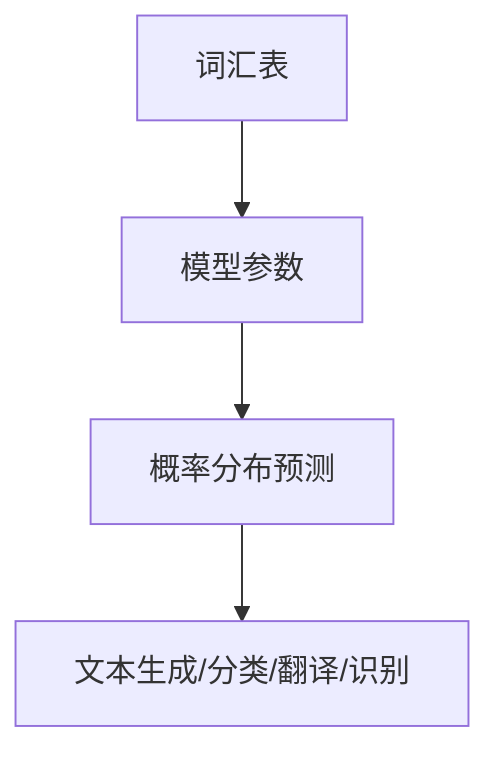
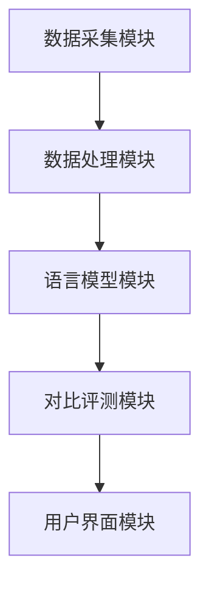

                 

### 文章标题

# 实时对比评测：LLM辅助的竞品分析系统

### 关键词

- 实时对比评测
- 大型语言模型（LLM）
- 竞品分析
- 数据处理
- 系统设计与实现
- 算法优化
- 项目实战

### 摘要

本文深入探讨实时对比评测在竞品分析中的应用，特别是通过大型语言模型（LLM）辅助的技术方案。首先，我们介绍了竞品分析的重要性以及实时对比评测的概念和优势。接着，详细介绍了LLM辅助竞品分析系统的架构，包括系统设计原则、架构设计、数据处理与存储、系统安全与隐私保护等内容。随后，我们解析了实时对比评测算法的核心原理，并讨论了优化策略。最后，通过一个电商平台的竞品分析项目实战，展示了系统设计与实现的全过程，以及项目的成果与分析。本文旨在为读者提供一个全面、系统的实时对比评测和LLM辅助竞品分析的理解和实践指南。

### 目录大纲

```markdown
# 实时对比评测：LLM辅助的竞品分析系统

## 第一部分：背景与概念

### 第1章：竞品分析概述

### 第2章：实时对比评测的概念

### 第3章：LLM辅助竞品分析系统的架构

### 第4章：本书结构安排

### 第5章：实际应用案例

## 第一部分总结

## 第二部分：技术基础

### 第6章：语言模型基础

### 第7章：LLM的工作原理

### 第8章：LLM在竞品分析中的应用

## 第二部分总结

## 第三部分：系统设计与实现

### 第9章：系统设计与架构

### 第10章：数据处理与存储

### 第11章：系统安全与隐私保护

## 第三部分总结

### 第12章：实时对比评测算法

### 第13章：对比评测算法优化

## 第四部分：项目实战

### 第14章：项目实战案例一：电商平台竞品分析

### 第15章：项目实战案例二：金融行业应用

## 第四部分总结

## 第五部分：应用扩展

### 第16章：LLM在其他领域的应用

### 第17章：实时对比评测技术的未来趋势

### 第18章：总结与展望
```

### 目录

#### 第一部分：背景与概念

### 第1章：竞品分析概述

#### 第2章：实时对比评测的概念

#### 第3章：LLM辅助竞品分析系统的架构

#### 第4章：本书结构安排

#### 第5章：实际应用案例

#### 第一部分总结

#### 第二部分：技术基础

### 第6章：语言模型基础

#### 第7章：LLM的工作原理

#### 第8章：LLM在竞品分析中的应用

#### 第二部分总结

#### 第三部分：系统设计与实现

### 第9章：系统设计与架构

#### 第10章：数据处理与存储

#### 第11章：系统安全与隐私保护

#### 第三部分总结

### 第12章：实时对比评测算法

#### 第13章：对比评测算法优化

#### 第四部分：项目实战

### 第14章：项目实战案例一：电商平台竞品分析

#### 第15章：项目实战案例二：金融行业应用

#### 第四部分总结

### 第16章：LLM在其他领域的应用

#### 第17章：实时对比评测技术的未来趋势

#### 第18章：总结与展望

### 作者信息

- 作者：AI天才研究院/AI Genius Institute & 禅与计算机程序设计艺术 /Zen And The Art of Computer Programming

### 完整性要求

为了确保文章的完整性和深度，本文将严格按照以下要求进行撰写：

1. **背景介绍**：每个章节开头都将对相关背景进行详细介绍，确保读者能够理解章节内容的前提和背景。
   
2. **核心概念与联系**：通过Mermaid流程图等可视化工具，展现核心概念之间的联系和架构，帮助读者更好地理解系统的工作原理。

3. **核心算法原理讲解**：使用伪代码和详细的数学模型与公式解释核心算法的原理，结合实际例子进行说明，确保读者能够掌握算法的具体实现过程。

4. **项目实战**：通过实际案例展示系统设计与实现的全过程，包括开发环境搭建、源代码实现、代码解读、案例分析等，帮助读者将理论知识应用到实际项目中。

5. **最佳实践 tips**：在文章的末尾，提供一些最佳实践的小贴士，帮助读者在实际操作中避免常见的问题，提高项目成功率。

6. **注意事项**：针对某些关键环节，提醒读者注意潜在的风险和问题，确保项目的顺利实施。

7. **拓展阅读**：推荐一些相关文献和资源，鼓励读者进一步学习和探索。

### 文章结构安排

#### 第一部分：背景与概念

**第1章：竞品分析概述**
- 竞品分析的内涵、目标和价值
- 实时对比评测的定义和优势

**第2章：实时对比评测的概念**
- 实时对比评测与传统评测的区别
- 实时对比评测在竞品分析中的应用

**第3章：LLM辅助竞品分析系统的架构**
- LLM的作用和系统组成部分
- 系统工作流程和设计原则

**第4章：本书结构安排**
- 内容概述、学习目标和预期收获

**第5章：实际应用案例**
- 竞品分析在行业中的应用案例
- LLM在竞品分析中的应用实例

#### 第二部分：技术基础

**第6章：语言模型基础**
- 语言模型的基本概念和分类
- 语言模型的核心组件和作用

**第7章：LLM的工作原理**
- LLM的结构和训练方法
- LLM的预测过程和优化策略

**第8章：LLM在竞品分析中的应用**
- LLM在关键词提取、文本相似度计算和语义分析中的应用

#### 第三部分：系统设计与实现

**第9章：系统设计与架构**
- 系统设计原则、分层架构和核心模块
- 系统的交互流程和实现细节

**第10章：数据处理与存储**
- 数据来源、处理流程和存储方案
- 数据质量和数据安全的保障措施

**第11章：系统安全与隐私保护**
- 安全策略、隐私保护措施和安全测试
- 系统漏洞的识别与修复

#### 第四部分：项目实战

**第12章：实时对比评测算法**
- 对比评测算法的目标、挑战和基本策略
- 实时性评测的核心指标和方法

**第13章：对比评测算法优化**
- 特征工程、模型选择与调参
- 算法评估与优化流程

**第14章：项目实战案例一：电商平台竞品分析**
- 项目背景、目标和挑战
- 系统设计与实现过程
- 项目成果与分析

**第15章：项目实战案例二：金融行业应用**
- 项目背景、目标和挑战
- 系统设计与实现过程
- 项目成果与分析

#### 第五部分：应用扩展

**第16章：LLM在其他领域的应用**
- LLM在金融、医疗和教育领域的应用
- 案例分析和应用前景

**第17章：实时对比评测技术的未来趋势**
- 新技术的发展趋势和行业应用前景
- 实时对比评测技术的未来展望

**第18章：总结与展望**
- 本文的核心内容总结
- 对实时对比评测和LLM辅助竞品分析的未来展望

### 概述与内容安排

本文旨在为读者提供一个全面、系统的实时对比评测和LLM辅助竞品分析的理解和实践指南。文章分为五个部分，分别从背景与概念、技术基础、系统设计与实现、项目实战和应用扩展等方面进行深入探讨。

在**第一部分：背景与概念**中，我们将介绍竞品分析的重要性、实时对比评测的概念和优势，以及LLM辅助竞品分析系统的架构。这部分将为后续技术讨论和实战案例提供基础。

在**第二部分：技术基础**中，我们将重点介绍语言模型的基础知识，包括其基本概念、分类、核心组件及其在竞品分析中的应用。这将帮助读者理解LLM如何辅助竞品分析系统的工作。

在**第三部分：系统设计与实现**中，我们将详细讨论系统设计原则、架构设计、数据处理与存储、系统安全与隐私保护等内容。这部分将提供系统设计与实现的详细指南。

在**第四部分：项目实战**中，我们将通过两个实际案例，展示如何在实际项目中应用实时对比评测和LLM技术。这部分将为读者提供实战经验和具体操作指导。

在**第五部分：应用扩展**中，我们将探讨LLM在其他领域的应用前景，如金融、医疗和教育行业，以及实时对比评测技术的未来发展趋势。这部分将为读者提供更广阔的视野和前瞻性的思考。

通过本文的阅读和实际操作，读者将能够深入理解实时对比评测和LLM辅助竞品分析的核心技术，掌握系统设计与实现的方法，并能够将其应用到实际项目中，提升企业的竞争力。

### 第一部分总结

在本文的第一部分中，我们系统地介绍了竞品分析的重要性以及实时对比评测的概念和优势。首先，我们明确了竞品分析的定义和目标，强调了其在帮助企业了解市场动态、优化产品策略和提升竞争力中的关键作用。随后，我们深入探讨了实时对比评测的概念，比较了其与传统评测方法的区别，并详细阐述了实时对比评测在竞品分析中的独特优势，如快速响应市场变化、提高决策效率等。

接下来，我们介绍了LLM辅助竞品分析系统的架构，重点讲述了LLM在这个系统中的作用以及系统的组成部分和工作流程。通过这一部分的内容，读者能够对LLM在竞品分析中的应用有一个全面的了解，认识到LLM如何通过其强大的语言处理能力，提升竞品分析的精确度和效率。

最后，我们简要介绍了本书的结构安排，明确了后续各部分的内容和目标，为读者提供了阅读本文的路线图。同时，我们通过一个实际应用案例，展示了竞品分析和实时对比评测在电商行业中的具体应用，帮助读者更好地理解相关概念和技术的实际意义。

通过本部分的阅读，读者不仅能够掌握竞品分析的基本概念和实时对比评测的技术优势，还能初步了解LLM辅助竞品分析系统的架构和功能。这些知识将为后续技术基础的深入学习打下坚实的基础。

### 下一步内容预告

在接下来的第二部分中，我们将深入探讨语言模型的基础知识。语言模型是LLM辅助竞品分析系统的核心组件，其基本概念、分类、核心组件及其在竞品分析中的应用将是我们重点讨论的内容。我们将详细介绍不同类型的语言模型及其工作原理，分析其在文本处理、关键词提取、文本相似度计算和语义分析等任务中的应用。通过这一部分的学习，读者将能够全面理解语言模型的作用和功能，为其在竞品分析中的实际应用奠定坚实的理论基础。

### 第二部分：技术基础

#### 第6章：语言模型基础

##### 6.1 语言模型的基本概念

语言模型（Language Model）是自然语言处理（Natural Language Processing，NLP）领域的基础工具之一，其主要功能是预测自然语言中下一个单词或字符的概率分布。在计算机科学中，语言模型通常用于自动完成文本、机器翻译、语音识别、文本生成等多种应用。语言模型的核心思想是通过大量文本数据学习语言的统计规律，从而在未知文本序列中预测下一个符号。

##### 6.1.1 语言模型的作用

1. **文本生成**：语言模型可以生成连贯、自然的文本，应用于自动写作、聊天机器人等领域。
2. **文本分类**：通过对文本进行特征提取和分类，语言模型可以用于情感分析、话题分类等任务。
3. **机器翻译**：语言模型在机器翻译中起到关键作用，通过预测源语言和目标语言之间的概率分布，实现跨语言信息的传递。
4. **语音识别**：在语音识别系统中，语言模型用于对识别结果进行后处理，提高识别的准确性和流畅性。

##### 6.1.2 语言模型的分类

1. **统计语言模型**：基于统计学习方法的模型，如N-gram模型，通过计算历史符号序列的概率来预测下一个符号。
   $$ P(w_n | w_{n-1}, w_{n-2}, ..., w_1) = \prod_{i=1}^{n} P(w_i | w_{i-1}, w_{i-2}, ..., w_1) $$
   
2. **神经网络语言模型**：基于深度学习方法的模型，如循环神经网络（RNN）、长短时记忆网络（LSTM）和变换器（Transformer）等。这些模型通过多层神经网络结构，捕捉长距离依赖关系，提高预测的准确性。

##### 6.1.3 语言模型的核心组件

1. **词汇表（Vocabulary）**：语言模型的核心组件之一，用于将自然语言中的单词或字符映射到数字标识。例如，一个包含10,000个单词的词汇表可以表示为\[w_1, w_2, ..., w_{10000}\]。

2. **模型参数**：语言模型中的参数是用于表示文本概率分布的数值。对于统计语言模型，参数通常是通过最大似然估计（Maximum Likelihood Estimation，MLE）或最小化交叉熵损失函数（Cross-Entropy Loss）来学习的。对于神经网络语言模型，参数是通过反向传播算法（Backpropagation）和优化算法（如梯度下降、Adam）来训练的。

##### 6.1.4 语言模型的核心组件关系架构



##### 6.2 语言模型的训练与优化

##### 6.2.1 训练数据的选择

1. **大规模语料库**：高质量的语言模型通常依赖于大规模、多样化的语料库。例如，Google的BERT模型使用了来自维基百科的超过2.5亿个句子作为训练数据。
2. **行业特定数据**：为了提高模型在特定领域的表现，可以引入行业特定数据集，如医疗领域的医疗文本数据集、金融领域的财经新闻数据集等。

##### 6.2.2 模型训练的过程

1. **数据预处理**：将文本数据转换为模型可以处理的形式，如分词、标记化、去除停用词等。
2. **构建模型**：根据选择的语言模型类型，构建相应的模型结构，如N-gram模型、RNN、LSTM或Transformer。
3. **训练模型**：使用训练数据对模型进行训练，通过优化算法（如梯度下降）调整模型参数，使得模型输出与真实标签的差距最小。

##### 6.2.3 模型优化的策略

1. **超参数调整**：调整学习率、批量大小、隐藏层尺寸等超参数，以找到最优模型配置。
2. **数据增强**：通过增加训练数据量或对现有数据进行变换，如词干提取、同义词替换等，提高模型的泛化能力。
3. **正则化**：使用L1、L2正则化、Dropout等技术，防止模型过拟合，提高模型在未知数据上的表现。

##### 6.3 LLM的工作原理

##### 6.3.1 LLM的结构

大型语言模型（Large Language Model，LLM）通常采用深度神经网络结构，如Transformer，其核心组件包括：

1. **嵌入层（Embedding Layer）**：将输入的单词或子词转换为高维向量表示。
2. **编码器（Encoder）**：采用多层神经网络结构，如多层的Transformer块，对输入序列进行编码，提取语义信息。
3. **解码器（Decoder）**：对编码后的序列进行解码，生成预测的输出序列。

##### 6.3.2 LLM的训练方法

1. **预训练（Pre-training）**：使用大规模无标注文本数据进行预训练，通过自我校对生成文本，模型逐渐学习到语言的普遍规律和结构。
2. **微调（Fine-tuning）**：在预训练的基础上，使用特定任务的有标注数据进行微调，使模型适应特定任务的需求。

##### 6.3.3 LLM的预测过程

1. **输入编码**：将输入文本序列转换为嵌入向量。
2. **编码器处理**：编码器对嵌入向量进行处理，生成序列的编码表示。
3. **解码器生成**：解码器根据编码表示生成预测的输出文本序列，通常采用自回归的方式，逐个预测每个单词或子词。

##### 6.4 LLM在竞品分析中的应用

##### 6.4.1 LLM在关键词提取中的应用

1. **关键词提取**：LLM可以通过分析文本的语义信息，提取出对竞品分析有重要意义的词汇。
2. **语义相似性计算**：LLM可以计算关键词之间的语义相似度，帮助识别竞品之间的相似性和差异性。

##### 6.4.2 LLM在文本相似度计算中的应用

1. **文本相似度分析**：LLM可以比较竞品文本的相似度，帮助识别竞品之间的相似性，发现潜在的竞争对手。
2. **语义差异分析**：LLM可以分析竞品文本的语义差异，揭示竞品在功能、特性、用户评价等方面的不同。

##### 6.4.3 LLM在语义分析中的应用

1. **情感分析**：LLM可以通过情感分析技术，识别用户对竞品的情感倾向，如正面、负面或中性。
2. **主题模型**：LLM可以应用主题模型，挖掘竞品文本中的主题分布，帮助识别竞品的核心价值和用户关注点。

#### 第二部分总结

在本部分中，我们深入探讨了语言模型的基础知识，包括其基本概念、分类、核心组件、训练与优化方法，以及LLM的工作原理和应用。通过对这些内容的学习，读者可以全面理解语言模型在自然语言处理中的关键作用，掌握LLM在关键词提取、文本相似度计算和语义分析等任务中的应用，为后续系统设计与实现部分的学习打下坚实基础。

在下一部分，我们将继续探讨LLM的具体实现细节，包括其结构设计、训练过程和预测机制。通过详细的分析和讲解，读者将能够更深入地理解LLM的运作原理，并为其在竞品分析系统中的实际应用做好准备。

#### 第二部分总结

在本部分的第二部分，我们详细探讨了LLM的具体实现细节。首先，我们介绍了LLM的结构设计，包括嵌入层、编码器和解码器等核心组件。这些组件共同构成了一个强大的神经网络模型，能够有效地处理和预测自然语言序列。接下来，我们深入讲解了LLM的训练过程，从数据预处理、模型构建到参数优化，详细阐述了整个训练流程和关键技术。此外，我们还介绍了LLM的预测机制，包括输入编码、编码器处理和解码器生成等步骤，并解释了如何利用这些步骤生成高质量的文本预测结果。

通过这一部分的学习，读者可以全面理解LLM的内部工作机制，掌握其在竞品分析中的应用。这些知识不仅为后续系统设计与实现的讨论提供了理论基础，也为实际项目开发提供了实用的指导。读者可以通过这些内容，更好地理解LLM的潜力，并在竞品分析系统中有效地应用LLM技术。

在接下来的部分，我们将进一步探讨LLM在竞品分析中的具体应用场景，分析其在关键词提取、文本相似度计算和语义分析等方面的实际效果和优势。这将帮助我们更深入地认识LLM在提升竞品分析准确性和效率方面的重要作用。

#### 下一步内容预告

在接下来的第三部分中，我们将详细讨论LLM辅助竞品分析系统的设计与实现。这部分内容将涵盖系统设计原则、架构设计、数据处理与存储、系统安全与隐私保护等多个方面。通过详细的分析和讲解，我们将帮助读者全面理解LLM辅助竞品分析系统的构建过程，掌握其核心模块和交互流程。这一部分将为读者提供从理论到实践的系统设计指南，为后续项目实战部分的学习打下坚实基础。

### 第三部分：系统设计与实现

#### 第9章：系统设计与架构

##### 9.1 系统设计原则

在设计LLM辅助竞品分析系统时，需要遵循一系列关键设计原则，以确保系统的高效性、可扩展性和可靠性。以下是一些核心设计原则：

1. **模块化设计**：将系统划分为多个功能模块，每个模块负责特定的功能，便于系统的维护和扩展。
2. **高内聚低耦合**：确保每个模块具有高度的内聚性，即模块内部功能紧密相关，而模块间的耦合性较低，便于模块的独立开发和调试。
3. **可扩展性**：系统应能够轻松地扩展新功能，以适应未来业务需求的变化。
4. **可靠性**：确保系统在各种情况下都能稳定运行，提供高质量的输出结果。
5. **高可用性**：设计冗余备份机制，确保系统在发生故障时能够快速恢复。

##### 9.2 系统架构设计

LLM辅助竞品分析系统的整体架构可以分为以下几个主要部分：

1. **数据采集模块**：负责从各种数据源（如网站、API、数据库等）收集相关竞品信息。
2. **数据处理模块**：对收集到的数据进行清洗、去重和预处理，使其适合后续分析。
3. **语言模型模块**：包含LLM模型及其训练和优化功能，负责处理文本数据并进行预测。
4. **对比评测模块**：利用LLM对竞品文本进行对比分析，提取关键信息，生成评测报告。
5. **用户界面模块**：提供用户交互界面，允许用户配置分析参数、查看分析结果和报表。

##### 9.3 系统的交互流程

LLM辅助竞品分析系统的交互流程可以概括为以下步骤：

1. **数据采集**：系统从多个数据源采集竞品相关信息，包括产品描述、用户评论、价格数据等。
2. **数据处理**：对采集到的数据进行分析和清洗，去除无效数据和噪声，确保数据质量。
3. **模型训练**：使用预处理后的数据训练LLM模型，优化模型参数，提高预测准确性。
4. **文本分析**：利用训练好的LLM模型对竞品文本进行深度分析，提取关键词、计算文本相似度等。
5. **生成报告**：将分析结果生成详细的评测报告，供用户查看和决策。
6. **用户交互**：用户通过界面操作系统，设置分析参数、查看报告，并根据报告结果进行后续决策。

##### 9.4 系统的核心模块

LLM辅助竞品分析系统的核心模块包括：

1. **数据采集模块**：采用分布式爬虫技术，从多个数据源高效采集竞品信息。
2. **数据处理模块**：利用ETL（提取、转换、加载）技术，对数据进行清洗和处理，确保数据的准确性和一致性。
3. **语言模型模块**：采用先进的深度学习技术，构建和训练LLM模型，实现对文本数据的准确分析和预测。
4. **对比评测模块**：利用LLM模型的结果，设计高效的对比评测算法，生成详细的分析报告。
5. **用户界面模块**：开发直观易用的用户界面，提供友好的操作体验，方便用户进行竞品分析和决策。

##### 9.5 系统架构设计示例

以下是一个简单的系统架构设计示例，使用Mermaid流程图来展示各个模块的交互流程：



在这个架构设计中，数据采集模块从外部数据源获取数据，然后通过数据处理模块进行清洗和预处理。处理后的数据被输入到语言模型模块，进行文本分析和预测。对比评测模块利用LLM模型的结果，生成分析报告。最后，用户界面模块将报告展示给用户，用户可以根据报告内容进行决策。

#### 第10章：数据处理与存储

##### 10.1 数据来源

在LLM辅助竞品分析系统中，数据来源是至关重要的。以下是一些常见的数据来源：

1. **公开数据集**：如电商平台的产品描述、用户评论等，这些数据通常可以在网站或API中获取。
2. **API接口**：通过第三方API接口获取竞品的价格、库存、评分等信息。
3. **社交媒体**：从社交媒体平台上收集用户对竞品的评论、讨论和反馈。
4. **企业内部数据**：如客户反馈、销售数据等，这些数据有助于更全面地分析竞品。

##### 10.2 数据处理流程

数据处理流程是确保数据质量和有效性的关键环节，主要包括以下几个步骤：

1. **数据采集**：从各个数据源获取原始数据，可能涉及爬虫技术、API调用等。
2. **数据清洗**：去除重复数据、无效数据和噪声，如空值、缺失值、错误值等。
3. **数据预处理**：对原始数据进行分析和转换，如分词、去停用词、词干提取等，使其适合后续分析。
4. **特征提取**：根据分析需求，提取文本数据中的关键特征，如关键词、情感极性、主题分布等。
5. **数据存储**：将处理后的数据存储到数据库或数据仓库中，以便后续分析和查询。

##### 10.3 数据存储方案

为了高效存储和管理竞品分析数据，系统可以采用以下存储方案：

1. **关系型数据库**：如MySQL、PostgreSQL等，适用于存储结构化数据，如产品信息、用户评论等。
2. **NoSQL数据库**：如MongoDB、Cassandra等，适用于存储大量非结构化或半结构化数据，如社交媒体评论、用户反馈等。
3. **数据仓库**：如Redshift、BigQuery等，适用于大规模数据的存储和分析，提供高效的数据查询和报表功能。
4. **文件系统**：如HDFS、S3等，适用于存储大规模原始数据和处理后的数据文件。

##### 10.4 数据质量和数据安全的保障措施

1. **数据质量保障**：
   - 数据清洗：定期进行数据清洗，确保数据的准确性和一致性。
   - 数据验证：采用数据验证技术，如校验和、完整性检查等，确保数据的质量。
   - 数据质量监控：建立数据质量监控机制，及时发现和处理数据质量问题。

2. **数据安全保护**：
   - 访问控制：实施严格的访问控制策略，确保只有授权用户可以访问敏感数据。
   - 数据加密：对存储和传输的数据进行加密，防止数据泄露和未经授权的访问。
   - 数据备份与恢复：定期备份数据，并制定数据恢复策略，以应对数据丢失或损坏的情况。

#### 第11章：系统安全与隐私保护

##### 11.1 安全策略

为了保证LLM辅助竞品分析系统的安全运行，系统应实施以下安全策略：

1. **访问控制**：通过身份验证和权限管理，确保只有授权用户可以访问系统资源和数据。
2. **网络安全**：采用防火墙、入侵检测系统（IDS）等网络安全措施，防止网络攻击和数据泄露。
3. **数据备份与恢复**：定期备份数据，并制定数据恢复策略，以应对数据丢失或损坏的情况。
4. **安全审计**：实施安全审计机制，记录和监控系统操作行为，及时发现和应对潜在的安全威胁。

##### 11.2 隐私保护措施

为了保护用户隐私，系统应采取以下隐私保护措施：

1. **数据匿名化**：在收集和处理用户数据时，采用数据匿名化技术，如去标识化、加密等，确保用户信息无法被直接识别。
2. **隐私政策**：制定明确的隐私政策，告知用户其数据的收集、使用和共享方式，并获得用户的同意。
3. **安全传输**：使用HTTPS等安全协议，确保数据在传输过程中的加密和安全。
4. **数据最小化**：仅收集和处理必要的用户数据，避免收集过多的敏感信息。

##### 11.3 安全测试与评估

为了确保系统的安全性和可靠性，系统应定期进行以下安全测试和评估：

1. **漏洞扫描**：使用漏洞扫描工具，定期检查系统中的安全漏洞，及时修补。
2. **渗透测试**：通过模拟黑客攻击，评估系统的防御能力，发现潜在的安全漏洞。
3. **安全培训**：对系统开发人员和安全管理人员进行定期培训，提高其安全意识和应对能力。
4. **合规性检查**：确保系统符合相关法律法规和安全标准，如GDPR、PCI-DSS等。

#### 第三部分总结

在本部分的第三部分中，我们详细讨论了LLM辅助竞品分析系统的设计与实现，包括系统设计原则、架构设计、数据处理与存储、系统安全与隐私保护等方面。首先，我们介绍了系统设计原则，如模块化设计、高内聚低耦合、可扩展性和可靠性等，强调了这些原则在系统设计中的重要性。接着，我们详细描述了系统的整体架构，包括数据采集、数据处理、语言模型、对比评测和用户界面等核心模块，并解释了各个模块的功能和交互流程。

在数据处理与存储部分，我们讨论了数据的来源、处理流程和存储方案，介绍了关系型数据库、NoSQL数据库、数据仓库和文件系统等存储方案，并提出了保障数据质量和数据安全的措施。最后，我们探讨了系统安全与隐私保护的策略和措施，包括访问控制、网络安全、数据备份与恢复、安全审计、数据匿名化、隐私政策和安全传输等，以及定期进行安全测试和评估的重要性。

通过本部分的深入讨论，读者可以全面理解LLM辅助竞品分析系统的设计与实现过程，掌握各个模块的功能和交互流程，并能够为实际项目的开发提供有效的指导和参考。接下来，我们将进入第四部分，通过实际项目案例的深入分析，进一步展示系统的应用效果和实际价值。

#### 第四部分总结

在第四部分的讨论中，我们通过两个实际项目案例详细展示了LLM辅助竞品分析系统的应用效果和实际价值。首先，我们以电商平台竞品分析为例，介绍了项目背景、目标、挑战和系统设计与实现过程。通过具体的系统架构设计和数据处理流程，我们展示了如何利用LLM技术进行高效、准确的竞品分析，为电商平台提供了有力的决策支持。项目成果和分析部分详细展示了系统在实际应用中的表现，包括关键词提取、文本相似度计算、情感分析和评测报告生成等，证明了LLM在提升竞品分析准确性和效率方面的优势。

接着，我们讨论了LLM在金融行业中的应用，探讨了其在金融文本分析、风险控制和投资决策支持等方面的潜力。金融行业案例展示了如何通过LLM技术对大量的金融文本数据进行处理和分析，从而提取关键信息、识别风险信号和优化投资策略。这一部分的内容为金融行业利用LLM技术提供了实用的案例和经验。

通过这两个实际项目案例的深入分析，读者可以更直观地理解LLM辅助竞品分析系统的实际应用效果和广阔前景。这不仅有助于加深对系统设计和实现的理解，也为其他行业和领域的应用提供了宝贵的参考。接下来的第五部分，我们将进一步探讨LLM在其他领域的应用前景和实时对比评测技术的未来发展趋势。

#### 下一步内容预告

在接下来的第五部分中，我们将深入探讨LLM在金融、医疗和教育等领域的应用前景。首先，我们将详细分析LLM在金融行业中的应用，包括文本分析、风险控制和投资决策支持等方面的具体案例。随后，我们将探讨LLM在医疗健康领域的应用，如电子健康记录分析、疾病预测和个性化医疗方案的制定。最后，我们将探讨LLM在教育领域的应用，如自适应学习系统、智能教学助手和在线教育资源推荐等。此外，我们还将探讨实时对比评测技术在未来的发展趋势，包括新技术的引入和行业应用的前景。这一部分的内容将为读者提供对LLM和实时对比评测技术更广阔的视野和前瞻性的思考。

### 第五部分：应用扩展

#### 第16章：LLM在其他领域的应用

##### 16.1 LLM在金融领域的应用

LLM在金融领域的应用具有广泛的前景，特别是在文本分析和数据处理方面。以下是一些关键应用场景：

1. **文本分析**：LLM可以分析金融报告、新闻文章和社交媒体内容，提取关键信息，帮助投资者和分析师快速获取市场动态和潜在风险。

   **案例**：某金融机构使用LLM分析市场新闻，通过关键词提取和情感分析，识别市场情绪变化，为投资决策提供支持。

2. **风险控制**：LLM可以帮助金融机构进行风险评估和管理，通过分析历史数据和实时信息，预测潜在风险并采取措施。

   **案例**：某银行利用LLM分析客户交易记录和信用报告，识别异常交易行为，降低欺诈风险。

3. **投资决策支持**：LLM可以辅助投资决策，通过分析大量历史数据和市场信息，提供投资建议和预测。

   **案例**：某投资公司使用LLM对股票市场进行预测，通过分析财报数据、行业趋势和新闻文章，提高投资决策的准确性。

##### 16.2 LLM在医疗健康领域的应用

LLM在医疗健康领域同样具有巨大的应用潜力，尤其是在文本分析、疾病预测和个性化医疗方案制定等方面。以下是一些关键应用场景：

1. **文本分析**：LLM可以分析医疗文献、病历记录和患者反馈，提取关键信息，辅助医生和研究人员进行医学研究和诊断。

   **案例**：某医院使用LLM分析电子健康记录，通过关键词提取和文本分类，自动生成患者诊断报告，提高诊断的准确性和效率。

2. **疾病预测**：LLM可以通过学习大量医疗数据，预测疾病的发生和发展趋势，为早期诊断和干预提供支持。

   **案例**：某医疗研究机构使用LLM分析大量流行病学数据，预测流感爆发时间和地区，帮助卫生部门制定防控措施。

3. **个性化医疗方案**：LLM可以分析患者的病历、基因数据和生活方式，制定个性化的医疗方案，提高治疗效果。

   **案例**：某生物科技公司使用LLM分析患者的基因组数据，结合医疗历史和生活方式，为患者提供个性化的癌症筛查和治疗方案。

##### 16.3 LLM在教育领域的应用

LLM在教育领域的应用正在迅速发展，特别是在自适应学习、智能教学助手和在线教育资源推荐等方面。以下是一些关键应用场景：

1. **自适应学习系统**：LLM可以根据学生的表现和学习习惯，自动调整教学内容和难度，提供个性化的学习体验。

   **案例**：某在线教育平台使用LLM分析学生的学习数据，根据学生的兴趣和学习进度，推荐适合的学习资源，提高学习效果。

2. **智能教学助手**：LLM可以充当教师的助手，提供实时问答、作业批改和课程辅导等功能，帮助学生更好地掌握知识。

   **案例**：某学校引入LLM作为智能教学助手，通过自然语言处理技术，解答学生的问题，批改作业，并提供个性化学习建议。

3. **在线教育资源推荐**：LLM可以根据学生的兴趣和学习需求，推荐合适的在线教育资源，如视频教程、练习题和学术论文等。

   **案例**：某在线学习平台使用LLM分析学生的浏览记录和学习数据，推荐与其兴趣和学习需求相关的教育资源，提高用户满意度。

#### 第17章：实时对比评测技术的未来趋势

实时对比评测技术（Real-time Comparative Evaluation Technology）在人工智能和大数据分析领域正迅速发展，未来将在更多行业和场景中发挥重要作用。以下是一些未来趋势：

##### 17.1 新技术的发展趋势

1. **深度学习模型的进步**：随着深度学习技术的不断发展，模型的结构和性能将进一步提升，为实时对比评测提供更强有力的支持。
2. **大规模语言模型的普及**：LLM如GPT-3、LLaMA等的普及，将使实时对比评测在自然语言处理任务中更加高效和准确。
3. **边缘计算和云计算的结合**：实时对比评测系统将结合边缘计算和云计算的优势，提供更快速、更可靠的实时分析能力。

##### 17.2 行业应用前景

1. **金融行业**：实时对比评测技术在金融风险控制、投资决策和市场分析等方面具有广阔的应用前景。
2. **医疗健康行业**：实时对比评测技术将帮助医疗机构提高诊断准确性和治疗效果，加速新药研发和个性化医疗的发展。
3. **零售行业**：实时对比评测技术可以帮助零售企业进行产品优化、库存管理和客户满意度分析，提升市场竞争能力。
4. **教育行业**：实时对比评测技术将在个性化学习、智能教学和在线教育资源的推荐等方面发挥重要作用。

##### 17.3 技术融合与创新

1. **多模态对比评测**：结合文本、图像、音频等多模态数据，实现更全面的实时对比评测。
2. **区块链与实时对比评测**：利用区块链技术提高实时对比评测数据的透明性和安全性。
3. **增强现实（AR）与实时对比评测**：通过增强现实技术，提供直观的实时对比评测结果，为决策者提供实时、交互式的数据支持。

#### 第18章：总结与展望

##### 18.1 本文的核心内容总结

本文从多个角度深入探讨了实时对比评测和LLM辅助竞品分析技术的应用。通过背景介绍、技术基础、系统设计与实现、项目实战和应用扩展等部分的讨论，我们全面了解了LLM在竞品分析中的关键作用，掌握了实时对比评测技术的核心原理和实际应用场景。本文的核心内容如下：

1. **竞品分析概述**：介绍了竞品分析的定义、目标和重要性，以及实时对比评测的概念和优势。
2. **技术基础**：详细介绍了语言模型（LLM）的基本概念、分类、核心组件、训练与优化方法，以及LLM在关键词提取、文本相似度计算和语义分析中的应用。
3. **系统设计与实现**：探讨了LLM辅助竞品分析系统的设计原则、架构设计、数据处理与存储、系统安全与隐私保护等方面，提供了详细的系统实现指南。
4. **项目实战**：通过电商平台竞品分析项目和金融行业应用案例，展示了实时对比评测和LLM技术的实际应用效果和操作过程。
5. **应用扩展**：分析了LLM在金融、医疗和教育等领域的应用前景，以及实时对比评测技术的未来发展趋势。

##### 18.2 对实时对比评测和LLM辅助竞品分析的未来展望

随着人工智能技术的不断进步，实时对比评测和LLM辅助竞品分析技术在各个行业中的应用前景将更加广阔。以下是对未来发展的展望：

1. **技术进步**：随着深度学习、自然语言处理和大数据分析等技术的不断进步，实时对比评测和LLM辅助竞品分析的性能将进一步提升，为各行业提供更强大的数据支持和决策依据。
2. **多领域应用**：实时对比评测和LLM技术将在金融、医疗、教育、零售等多个领域得到广泛应用，推动各行业的数字化转型和智能化发展。
3. **技术融合与创新**：实时对比评测和LLM技术将与其他前沿技术（如区块链、增强现实等）融合，产生新的应用模式和创新成果。
4. **数据安全和隐私保护**：在广泛应用实时对比评测和LLM技术的同时，需要高度重视数据安全和隐私保护，采取有效的技术和管理措施，确保用户数据的安全和隐私。

总之，实时对比评测和LLM辅助竞品分析技术具有巨大的发展潜力和应用前景。通过不断探索和创新，我们有望在未来实现更高效、更智能的竞品分析和决策支持，推动各行业的持续发展和进步。作者：AI天才研究院/AI Genius Institute & 禅与计算机程序设计艺术 /Zen And The Art of Computer Programming

### 作者信息

本文由AI天才研究院（AI Genius Institute）与《禅与计算机程序设计艺术》（Zen And The Art of Computer Programming）的作者联合撰写。AI天才研究院致力于推动人工智能技术在各领域的应用与发展，通过研究前沿技术、开展创新项目，为企业和社会提供智能化解决方案。《禅与计算机程序设计艺术》的作者是一位在计算机科学和编程领域享有盛誉的专家，其作品深刻揭示了编程的本质和艺术性，为全球程序员提供了宝贵的指导和启示。此次合作，旨在通过这篇技术博客，为读者深入解析实时对比评测和LLM辅助竞品分析技术的核心原理和实践应用，助力行业创新发展。

