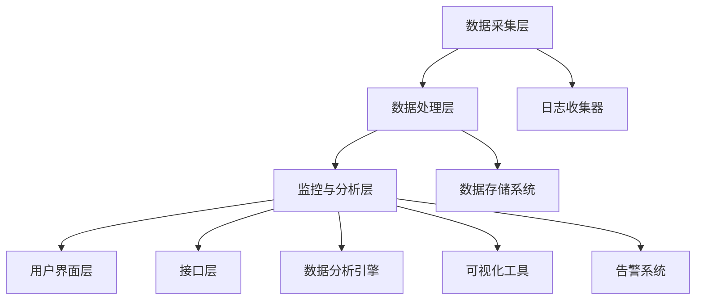

                 

### 文章标题：实时性能监控：LLM驱动的持续评测机制

关键词：实时性能监控、LLM、持续评测、架构、算法、应用

摘要：本文将深入探讨实时性能监控在当前信息技术环境中的重要性，并详细阐述如何利用大型语言模型（LLM）构建一个高效、可靠的持续评测机制。文章将首先介绍实时性能监控的基本概念和核心要素，接着探讨LLM的基础知识及其在实时性能监控中的潜在应用。随后，我们将分析实时性能监控面临的挑战，并探讨如何利用LLM来克服这些挑战。文章的核心部分将重点介绍LLM驱动的持续评测机制的构建方法，包括数据收集、模型训练和评测等关键环节。最后，我们将分析实时性能监控在不同行业中的应用场景，并总结实时性能监控的未来发展趋势和最佳实践。

### 第一部分：实时性能监控的基本概念

#### 第1章：实时性能监控概述

##### 1.1 实时性能监控的定义与重要性

实时性能监控是指对系统、服务或应用程序在运行过程中的性能进行持续、动态的监测和评估。这种监控方式旨在及时发现和解决潜在的性能问题，确保系统的高效运行和用户体验的稳定性。实时性能监控在当今的信息技术环境中具有重要意义，主要体现在以下几个方面：

1. **提高系统可靠性**：通过实时监控，可以及时发现系统中的异常情况，如延迟、错误率上升等，从而采取措施进行预防或修复，提高系统的可靠性和稳定性。
2. **优化资源利用**：实时性能监控可以帮助管理人员了解系统的实际负载情况，从而合理分配资源，优化系统性能，提高资源利用效率。
3. **提升用户体验**：对于用户来说，系统的响应速度和稳定性直接影响他们的使用体验。实时性能监控可以确保系统始终处于最佳状态，从而提升用户的满意度。
4. **降低维护成本**：通过实时监控，可以在问题发生之前提前预警，减少故障发生时的紧急修复成本和维护工作量。

##### 1.2 实时性能监控的核心要素

实时性能监控的核心要素包括监控指标、监控频率和监控范围。以下是这些核心要素的详细解释：

1. **监控指标**：监控指标是衡量系统性能的量化标准。常见的监控指标包括响应时间、吞吐量、错误率、内存使用率、CPU利用率等。这些指标能够反映系统的性能状况，帮助分析问题根源。
2. **监控频率**：监控频率是指监控系统对性能指标进行采集和评估的间隔时间。高频次的监控可以更及时地发现性能问题，但也会增加系统的负担。因此，需要根据实际情况和需求来确定合适的监控频率。
3. **监控范围**：监控范围是指系统监控的覆盖范围，包括监控的具体系统和组件。实时性能监控应该覆盖所有关键组件和系统，以确保全面掌握系统的性能状况。

##### 1.3 实时性能监控与LLM的关系

大型语言模型（LLM）的引入为实时性能监控带来了新的可能性。LLM是一种基于深度学习的模型，能够在大量文本数据上进行训练，从而理解和生成人类语言。LLM在实时性能监控中的应用主要体现在以下几个方面：

1. **智能分析**：LLM可以处理和分析大量的监控数据，提取有用的信息，提供更准确的性能评估。例如，通过自然语言处理技术，LLM可以自动生成性能分析报告，简化监控流程。
2. **异常检测**：LLM可以通过学习正常性能模式，识别出异常情况。当系统性能偏离正常范围时，LLM可以快速检测并预警，帮助管理员及时采取措施。
3. **自动化修复**：利用LLM的自动化能力，系统可以自动进行性能优化和故障修复。例如，LLM可以根据监控数据自动调整系统配置，提高性能。

综上所述，实时性能监控在当前信息技术环境中具有重要作用，而LLM的引入为实时性能监控提供了新的思路和方法。接下来，我们将进一步探讨LLM的基础知识及其在实时性能监控中的应用。

#### 第2章：LLM的基础知识

##### 2.1 LLM的定义与特点

大型语言模型（Large Language Model，简称LLM）是一种基于深度学习的自然语言处理模型，能够在大量的文本数据上进行训练，从而掌握语言的规律和特性。LLM的核心目标是通过学习大量文本，生成与输入文本相关的输出文本。

LLM的定义可以概括为以下几点：

1. **规模巨大**：LLM通常包含数百万甚至数十亿个参数，这是其能够处理和理解复杂语言现象的基础。
2. **深度学习**：LLM是基于深度学习技术的，特别是深度神经网络（DNN）和变换器模型（Transformer）。这些模型具有强大的表征能力和计算效率。
3. **自监督学习**：LLM的训练通常采用自监督学习策略，通过预测文本中的隐藏部分来学习语言模式。这种方法无需人工标注数据，能够处理大量的未标注文本。

LLM的特点如下：

1. **语言理解能力强**：LLM通过对大量文本的学习，能够理解复杂的语言结构和语义，生成连贯、准确的文本。
2. **生成能力强**：LLM不仅可以理解文本，还可以根据输入文本生成新的文本，这种生成能力在问答系统、文本生成和翻译等领域有广泛应用。
3. **适应性强**：LLM能够适应不同的应用场景，通过微调（fine-tuning）可以在特定任务上获得优秀的性能。

##### 2.2 LLM的架构与实现

LLM的架构主要包括输入层、编码层、解码层和输出层。以下是对各层的详细解释：

1. **输入层**：输入层负责接收用户输入的文本，将其转化为模型可以处理的格式。通常，输入文本会被分词、编码成词嵌入（word embeddings），然后输入到编码层。
2. **编码层**：编码层负责对输入文本进行编码，提取其语义特征。在LLM中，编码层通常采用变换器模型（Transformer）或其他深度学习模型。变换器模型通过多个注意力层（attention layers）对文本进行编码，提取出文本的上下文信息。
3. **解码层**：解码层负责根据编码层提取的语义特征生成输出文本。解码层通常采用类似编码层的方法，通过多个解码层和注意力层逐步生成输出文本。
4. **输出层**：输出层负责将解码层生成的文本输出给用户。输出文本可以是自然语言文本，也可以是其他形式的数据，如问答系统的答案或文本生成系统的文章。

LLM的实现方法主要包括以下几种：

1. **预训练与微调**：预训练是指使用大规模的未标注数据对模型进行初步训练，使其具备一定的语言理解能力。微调是在预训练的基础上，使用特定任务的数据对模型进行细粒度调整，以提高模型在特定任务上的性能。
2. **多任务学习**：多任务学习是指在一个大型模型上同时训练多个任务，通过共享模型参数来提高模型的泛化能力和效率。
3. **迁移学习**：迁移学习是指将预训练模型的知识迁移到新的任务上，通过在目标任务上进一步训练，提高模型在新任务上的性能。

##### 2.3 LLM的应用场景

LLM在自然语言处理领域有广泛的应用，以下是一些典型的应用场景：

1. **文本生成**：LLM可以生成文章、报告、邮件等文本内容。这种应用在内容创作、机器写作等领域有重要价值。
2. **问答系统**：LLM可以用于构建问答系统，如搜索引擎、智能客服等。通过理解用户的问题，LLM能够生成准确的答案。
3. **机器翻译**：LLM在机器翻译领域也有广泛应用，可以生成高质量、流畅的翻译文本。
4. **情感分析**：LLM可以分析文本的情感倾向，如正面、负面或中立。这种应用在舆情分析、市场调研等领域有重要价值。
5. **文本分类**：LLM可以用于文本分类任务，如新闻分类、情感分类等。通过学习大量的文本数据，LLM能够准确地将文本分类到不同的类别。

综上所述，LLM作为一种强大的自然语言处理工具，在实时性能监控中具有巨大的潜力。在接下来的章节中，我们将探讨实时性能监控面临的挑战以及如何利用LLM来构建一个持续评测机制。

#### 第3章：实时性能监控的挑战与解决方案

##### 3.1 数据质量与实时性

实时性能监控的一个关键挑战是数据质量和实时性。数据质量直接影响监控结果的准确性和可靠性，而实时性则决定了监控系统能否在问题发生时及时响应。

1. **数据质量**：实时性能监控依赖于各种监控指标的数据，如响应时间、错误率、吞吐量等。这些数据的质量直接影响监控分析的准确性。常见的数据质量问题包括数据缺失、数据错误和数据不一致。为了提高数据质量，可以采取以下措施：
   - **数据校验**：在数据采集过程中进行校验，确保数据的准确性。
   - **数据清洗**：对采集到的数据进行清洗，删除错误数据，填充缺失数据。
   - **数据标准化**：对数据进行标准化处理，确保不同来源的数据具有可比性。

2. **实时性**：实时性能监控要求系统能够及时采集和处理数据，并在问题发生时快速响应。然而，在现实环境中，数据的传输和处理都有一定的延迟。为了提高实时性，可以采取以下措施：
   - **数据压缩**：对数据进行压缩，减少数据传输的时间和带宽消耗。
   - **批量处理**：将多个监控数据批量处理，以减少处理时间和系统开销。
   - **分布式架构**：采用分布式架构，将数据采集和处理任务分布在多个节点上，以提高处理速度和系统的可扩展性。

##### 3.2 监控指标的多样性与复杂性

实时性能监控面临的另一个挑战是监控指标的多样性和复杂性。随着系统的规模和复杂性的增加，监控指标的种类和数量也显著增加。这些指标可以包括系统层面的指标，如CPU利用率、内存使用率、网络延迟等，也可以是业务层面的指标，如交易成功率、用户响应时间等。

1. **多样性的监控指标**：监控指标的多样性使得监控系统需要处理大量的数据，增加了系统的复杂性和维护成本。为了有效管理多样化的监控指标，可以采取以下措施：
   - **指标分类**：将监控指标按类别进行分类，如系统指标、业务指标等，以便更好地管理和分析。
   - **指标筛选**：根据业务需求和系统特点，筛选出关键监控指标，以便重点监控和优化。
   - **指标关联**：建立监控指标之间的关联关系，如响应时间和吞吐量的关系，以提高监控的准确性和关联性。

2. **复杂性的处理**：随着监控指标的增加，监控系统的复杂性也不断增加。为了有效处理监控指标的复杂性，可以采取以下措施：
   - **自动化监控**：采用自动化工具进行监控，减少人工干预和错误。
   - **监控策略优化**：根据业务需求和系统特点，优化监控策略，如调整监控频率、监控范围等。
   - **监控平台集成**：集成多个监控工具和平台，实现监控数据的统一管理和分析。

##### 3.3 监控系统的可扩展性与稳定性

实时性能监控系统的另一个挑战是可扩展性和稳定性。随着业务的发展和系统的扩展，监控系统需要能够适应变化，保证稳定运行。

1. **可扩展性**：监控系统需要能够支持系统的扩展，包括监控指标的扩展、处理能力的扩展和数据存储的扩展。为了实现系统的可扩展性，可以采取以下措施：
   - **分布式架构**：采用分布式架构，将监控任务分布在多个节点上，以提高系统的处理能力和可扩展性。
   - **弹性伸缩**：根据系统负载自动调整监控资源的配置，以应对负载的变化。
   - **服务化监控**：将监控功能模块化，实现监控服务的可扩展性。

2. **稳定性**：监控系统需要保持稳定运行，避免出现故障和中断。为了提高系统的稳定性，可以采取以下措施：
   - **容错机制**：引入容错机制，如数据冗余、故障转移等，确保监控系统在故障情况下能够快速恢复。
   - **监控监控**：对监控系统本身进行监控，确保监控系统的稳定性和可靠性。
   - **自动化运维**：引入自动化运维工具，实现监控系统的自动化部署、监控和运维。

综上所述，实时性能监控在数据质量、实时性、多样性和复杂性、可扩展性和稳定性等方面面临诸多挑战。通过采取有效的措施和策略，可以构建一个高效、可靠的实时性能监控系统。在接下来的章节中，我们将探讨如何利用LLM来克服这些挑战，构建一个持续评测机制。

##### 3.4 LLM在实时性能监控中的应用

为了应对实时性能监控中的挑战，引入大型语言模型（LLM）成为了一种有效的解决方案。LLM在实时性能监控中可以发挥多方面的作用，下面将详细探讨LLM的应用及其优势。

1. **智能分析**：
   - **数据处理**：LLM能够处理和分析大量的监控数据，提取有用的信息，提供更准确的性能评估。例如，LLM可以通过自然语言处理技术，自动生成性能分析报告，简化监控流程。
   - **模式识别**：LLM可以识别数据中的模式和规律，帮助监控系统更准确地预测性能趋势和潜在问题。通过学习历史性能数据，LLM可以预测未来性能表现，从而提前采取预防措施。

2. **异常检测**：
   - **实时预警**：LLM可以通过学习正常性能模式，识别出异常情况。当系统性能偏离正常范围时，LLM可以快速检测并预警，帮助管理员及时采取措施。
   - **自动化响应**：利用LLM的自动化能力，系统可以自动进行性能优化和故障修复。例如，LLM可以根据监控数据自动调整系统配置，提高性能。

3. **自动化优化**：
   - **智能调优**：LLM可以根据实时监控数据，自动调整系统的参数和配置，以实现最优的性能。例如，在负载高峰期，LLM可以自动增加服务器资源，以应对流量增加。
   - **自适应调整**：LLM可以根据性能监控结果，动态调整监控策略，以适应系统的变化。例如，当系统负载较低时，LLM可以减少监控频率，以降低系统开销。

4. **交互式监控**：
   - **自然语言交互**：LLM可以与用户进行自然语言交互，提供实时性能监控的查询和反馈。例如，用户可以通过自然语言提问，获取系统的实时性能信息。
   - **可视化展示**：LLM可以将监控数据转化为直观的图表和报告，帮助用户更清楚地了解系统性能。通过自然语言生成技术，LLM可以自动生成可视化报告，简化数据解读过程。

5. **跨领域应用**：
   - **多源数据融合**：LLM可以整合来自不同领域和来源的监控数据，提供更全面的性能监控。例如，LLM可以将业务数据、系统数据和网络数据融合，进行综合分析。
   - **跨平台支持**：LLM可以支持多种平台和架构，实现跨领域、跨平台的性能监控。例如，LLM可以在云平台、容器化和虚拟化环境中，提供统一的性能监控解决方案。

通过以上应用，LLM为实时性能监控带来了显著的改进。它不仅提高了监控系统的智能化水平，还增强了系统的自适应能力和实时性。在接下来的章节中，我们将详细探讨如何利用LLM构建一个持续评测机制，以实现高效、可靠的实时性能监控。

### 第4章：LLM驱动的持续评测机制

持续评测机制是实时性能监控的重要组成部分，其目标是确保系统在长时间运行中保持高性能和稳定性。利用大型语言模型（LLM）构建的持续评测机制，可以提供智能化、自动化的监控和分析能力，从而大幅提升监控系统的效能。本章将详细介绍LLM驱动的持续评测机制的构建方法，包括数据收集、模型训练和评测等关键环节。

#### 4.1 持续评测的定义与目的

持续评测（Continuous Evaluation）是一种对系统性能进行长期监测和评估的方法，其目的是在系统运行过程中及时发现和解决性能问题，确保系统始终处于最佳状态。持续评测的关键目标包括：

1. **性能监控**：持续监测系统的关键性能指标，如响应时间、吞吐量、错误率等，确保系统在运行过程中性能稳定。
2. **问题预警**：当系统性能出现异常时，及时发出预警，帮助管理员快速定位问题并采取修复措施。
3. **性能优化**：基于监控数据进行分析，识别系统瓶颈和性能瓶颈，提供优化建议，以提升系统性能。
4. **趋势预测**：通过分析历史性能数据，预测未来性能趋势，为系统扩展和资源规划提供参考。

#### 4.2 LLM的选择与优化

构建LLM驱动的持续评测机制的第一步是选择合适的LLM。选择LLM时需要考虑以下几个因素：

1. **模型规模**：选择具有足够参数规模的LLM，以确保模型具有强大的表征能力。
2. **训练数据**：确保LLM的训练数据覆盖广泛的场景和任务，以提高模型的泛化能力。
3. **性能指标**：选择在自然语言处理任务上表现优秀的LLM，如BERT、GPT-3等。

LLM的选择完成后，需要对模型进行优化，以提高其在持续评测中的性能。以下是一些优化方法：

1. **模型剪枝**：通过剪枝冗余的神经网络层和参数，减少模型的大小和计算开销，提高模型的运行效率。
2. **量化**：使用量化技术减少模型的浮点运算量，提高模型在硬件上的执行效率。
3. **微调**：在LLM的基础上进行微调，使其适应特定的监控任务和数据集，提高模型的性能和准确性。

#### 4.3 持续评测的数据收集

持续评测的数据收集是构建有效评测机制的基础。数据收集的过程包括以下几个关键步骤：

1. **数据源确定**：确定需要收集的数据源，如系统日志、性能监控指标、用户行为数据等。
2. **数据采集**：采用合适的采集工具和策略，如网络抓包、日志分析、API调用等，实时收集数据。
3. **数据预处理**：对采集到的数据进行清洗、去重、归一化等预处理操作，确保数据的质量和一致性。
4. **数据存储**：将预处理后的数据存储到数据库或数据湖中，以便后续分析和处理。

#### 4.4 持续评测的模型训练

模型训练是构建持续评测机制的核心环节。以下是模型训练的关键步骤：

1. **数据集划分**：将数据集划分为训练集、验证集和测试集，用于模型的训练、验证和测试。
2. **特征提取**：从数据中提取关键特征，如时间序列特征、统计特征等，用于模型训练。
3. **模型训练**：使用训练集对LLM进行训练，优化模型参数，使其能够准确预测系统性能。
4. **模型验证**：使用验证集对训练好的模型进行验证，评估模型的性能和准确性。
5. **模型测试**：使用测试集对模型进行测试，确保模型在实际应用中的性能。

#### 4.5 持续评测的模型部署

模型部署是将训练好的LLM应用于实际监控场景的关键步骤。以下是模型部署的关键步骤：

1. **部署环境准备**：准备模型部署的环境，包括服务器、网络配置等，确保模型能够稳定运行。
2. **模型服务化**：将训练好的模型服务化，使其可以通过API接口进行调用，提供实时性能预测和分析服务。
3. **模型监控**：对部署的模型进行监控，确保其正常运行和性能稳定。
4. **模型更新**：根据监控数据和用户反馈，定期更新模型，提高模型的预测准确性和适应性。

#### 4.6 持续评测的模型评测

模型评测是确保持续评测机制有效性的关键环节。以下是模型评测的关键步骤：

1. **性能评估**：评估模型的性能指标，如准确率、召回率、F1分数等，确保模型达到预期效果。
2. **稳定性评估**：评估模型在不同数据集和场景下的稳定性和泛化能力，确保模型在实际应用中的可靠性。
3. **用户反馈**：收集用户对模型的反馈，了解用户对模型预测结果和服务的满意度。
4. **迭代优化**：根据评估结果和用户反馈，对模型进行迭代优化，提高模型的性能和用户体验。

通过以上步骤，可以构建一个高效、可靠的LLM驱动的持续评测机制，为实时性能监控提供智能化、自动化的支持。在接下来的章节中，我们将探讨实时性能监控在不同行业中的应用场景，并分析LLM在实际应用中的效果。

### 第5章：实时性能监控在不同行业中的应用

实时性能监控在不同行业中有着广泛的应用，对于各个行业来说，性能监控不仅关乎系统的稳定性，更直接影响业务效率和用户体验。以下将详细分析实时性能监控在金融、电子商务和制造业等三个典型行业中的应用场景。

#### 5.1 金融行业

在金融行业中，实时性能监控至关重要，因为金融交易的准确性、效率和安全性直接关系到金融机构的信誉和客户的利益。以下是金融行业实时性能监控的主要应用场景：

1. **交易监控**：金融机构需要实时监控交易系统的性能，包括交易响应时间、交易成功率和交易错误率。通过实时监控，可以及时发现交易过程中的异常情况，如延迟或错误交易，确保交易的准确性和效率。

2. **风险管理**：实时性能监控可以帮助金融机构识别和管理风险。例如，监控市场波动和交易量变化，及时预警可能出现的金融风险，如市场操纵或欺诈行为。

3. **合规性检查**：金融行业受到严格的法规和合规要求。实时性能监控可以帮助金融机构确保系统符合监管要求，如记录交易日志、监控交易权限等。

4. **用户体验**：金融服务的用户体验直接影响客户满意度。通过实时监控用户体验指标，如交易速度、界面响应时间等，金融机构可以快速响应客户需求，优化系统性能，提升客户满意度。

#### 5.2 电子商务行业

电子商务行业对实时性能监控的需求尤为突出，因为在线购物体验直接关系到销售额和客户忠诚度。以下是电子商务行业实时性能监控的主要应用场景：

1. **网站性能监控**：电子商务平台的网站性能直接影响用户访问速度和购物体验。实时性能监控可以帮助识别和解决网站性能瓶颈，如页面加载时间过长、服务器响应缓慢等，确保用户能够顺畅地浏览和购物。

2. **支付系统监控**：支付系统的稳定性和安全性对于电子商务平台至关重要。实时性能监控可以确保支付系统能够快速处理交易请求，同时监控支付系统的安全性能，防止欺诈和支付失败。

3. **库存管理监控**：电子商务平台需要实时监控库存水平，确保商品供应充足。通过实时性能监控，可以及时发现库存不足或商品滞销情况，优化库存管理，提高库存周转率。

4. **客户服务监控**：实时性能监控可以监控客户服务的响应时间和服务质量，确保客户问题能够得到及时解决。通过监控客户互动数据，电子商务平台可以优化客户服务流程，提高客户满意度。

#### 5.3 制造业

在制造业中，实时性能监控主要用于生产过程的优化和设备维护。以下是制造业实时性能监控的主要应用场景：

1. **生产监控**：制造业需要实时监控生产线的运行状态，包括设备运行情况、生产节拍和产品质量等。通过实时性能监控，可以及时发现生产线故障或质量问题，确保生产过程的连续性和产品质量。

2. **设备维护**：实时性能监控可以帮助制造业企业预测设备故障，提前进行维护，避免生产中断。例如，通过监控设备的温度、振动和压力等参数，可以预测设备的故障趋势，合理安排维护计划。

3. **能源管理**：制造业对能源的需求较大，实时性能监控可以监控能源消耗情况，优化能源使用，降低能源成本。例如，通过监控用电量和用水量，可以识别能源浪费点，采取节能措施。

4. **供应链管理**：实时性能监控可以监控供应链的各个环节，包括原材料采购、生产进度和物流运输等。通过实时监控供应链状态，可以确保供应链的稳定性和效率，降低库存成本，提高供应链的整体绩效。

综上所述，实时性能监控在金融、电子商务和制造业等不同行业中具有广泛的应用。通过利用LLM驱动的持续评测机制，可以进一步提升实时性能监控的智能化和自动化水平，为各个行业的业务优化提供强有力的支持。在接下来的章节中，我们将探讨实时性能监控的未来发展趋势。

### 第6章：实时性能监控的未来发展趋势

实时性能监控作为信息技术领域的一个重要组成部分，正随着技术的不断进步而不断发展。以下是实时性能监控在未来可能面临的发展趋势。

#### 6.1 技术发展趋势

1. **人工智能与大数据的结合**：未来，人工智能（AI）与大数据技术的结合将进一步深化，为实时性能监控带来更多的可能性。AI技术，特别是深度学习和机器学习算法，将用于更准确地分析监控数据，识别潜在的异常情况，从而提升监控系统的智能化水平。

2. **边缘计算**：随着物联网（IoT）和5G技术的普及，边缘计算将成为实时性能监控的一个重要方向。边缘计算能够将数据处理和分析推向网络的边缘，减少数据传输延迟，提高系统的响应速度和实时性。

3. **智能监控与分析**：智能监控与分析技术将更加普及，通过自学习、自适应和自优化算法，监控系统将能够自动识别和预测性能问题，提高监控效率和准确性。

4. **自动化与自我修复**：未来的实时性能监控系统将更加自动化，甚至具备自我修复能力。通过自动化工具和智能算法，系统能够在检测到性能问题时，自动进行优化和修复，减少人工干预，提高系统稳定性。

#### 6.2 应用趋势

1. **多元化应用场景**：实时性能监控将不仅仅应用于传统的IT系统和服务器，还将在更多新兴领域得到应用，如智慧城市、智能交通、智能制造等。在这些领域中，实时性能监控可以帮助优化资源分配、提高运营效率和提升用户体验。

2. **跨平台与跨领域融合**：未来的实时性能监控将支持跨平台和跨领域的监控，实现不同系统和数据源的集成。通过统一的数据平台和监控工具，企业可以更全面地掌握业务运行状况，实现全方位的性能监控。

3. **用户导向**：随着用户对服务质量的要求越来越高，实时性能监控将更加注重用户体验。监控系统将提供更直观的界面、更丰富的数据可视化和更便捷的用户交互，帮助用户更轻松地理解和应对性能问题。

#### 6.3 行业趋势

1. **数字化转型**：随着全球范围内的数字化转型进程加速，实时性能监控将成为企业数字化转型的重要组成部分。企业将通过实时性能监控，优化业务流程，提升运营效率，实现数字化转型目标。

2. **合规性需求**：随着数据隐私和信息安全法规的日益严格，实时性能监控在合规性方面的需求也将增加。企业需要通过实时监控，确保系统符合相关法规要求，降低合规风险。

3. **可持续发展**：未来，实时性能监控将更加关注可持续发展，通过优化资源利用和降低能源消耗，帮助企业实现绿色运营和可持续发展目标。

综上所述，实时性能监控的未来发展趋势将涵盖技术、应用和行业等多个方面。通过不断创新和优化，实时性能监控将为企业提供更高效、更智能、更全面的监控解决方案，助力企业在数字化时代取得竞争优势。

### 第7章：实时性能监控的系统设计与实现

实时性能监控系统的设计与实现是确保系统稳定运行和高效监控的关键。以下将详细讨论实时性能监控系统的设计原则、架构及其关键组件，并提供一个具体的实现示例。

#### 7.1 设计原则

1. **可扩展性**：实时性能监控系统需要具备良好的可扩展性，以适应业务规模的变化和监控需求的增长。系统设计应支持水平扩展，即通过增加节点来提高系统的处理能力。

2. **高可用性**：系统设计应确保高可用性，减少单点故障对系统的影响。可以通过冗余设计、故障转移和自动恢复机制来实现高可用性。

3. **易维护性**：系统设计应考虑易维护性，确保在故障发生时能够快速诊断和修复。系统应提供详细的日志记录和监控工具，以便管理员进行监控和调试。

4. **灵活性**：系统设计应具有灵活性，支持多种监控指标和监控方式的集成，以适应不同业务场景的需求。

5. **安全性**：系统设计应重视安全性，确保监控数据和系统配置的安全，防止数据泄露和恶意攻击。

#### 7.2 系统架构

实时性能监控系统的架构可以分为以下几个主要部分：

1. **数据采集层**：负责从各种数据源（如服务器、应用、网络设备等）采集性能数据。数据采集层通常包括采集代理、数据聚合器和日志收集器。

2. **数据处理层**：负责处理和存储采集到的性能数据。数据处理层通常包括数据预处理模块、存储系统和数据仓库。

3. **监控与分析层**：负责对处理后的数据进行分析，生成监控报告和预警。监控与分析层通常包括数据分析引擎、可视化工具和告警系统。

4. **接口层**：提供与其他系统（如配置管理数据库、事件管理系统等）的接口，实现数据的交换和整合。

5. **用户界面层**：提供用户交互界面，供管理员进行监控和操作。

以下是实时性能监控系统架构的Mermaid流程图：



#### 7.3 关键组件设计

1. **数据采集组件**：数据采集组件负责从各种数据源采集性能数据。数据采集组件的设计应考虑以下几点：
   - **多源数据支持**：支持从不同类型的数据源采集数据，如操作系统、应用程序、数据库和网络设备。
   - **数据格式转换**：将采集到的数据转换为统一的格式，以便后续处理。
   - **采集频率**：根据数据源的特性和需求，设置合适的采集频率。

2. **数据处理组件**：数据处理组件负责处理和存储采集到的性能数据。数据处理组件的设计应考虑以下几点：
   - **数据清洗**：去除无效数据、重复数据和错误数据，保证数据质量。
   - **数据聚合**：将来自不同数据源的数据进行聚合，生成综合性能指标。
   - **数据存储**：选择合适的数据存储方案，如关系数据库、NoSQL数据库或数据仓库，以适应不同的数据处理需求。

3. **监控分析组件**：监控分析组件负责对处理后的数据进行分析，生成监控报告和预警。监控分析组件的设计应考虑以下几点：
   - **分析算法**：选择合适的分析算法，如统计方法、机器学习方法等，对性能数据进行分析。
   - **可视化**：提供直观的可视化工具，帮助管理员理解和分析性能数据。
   - **告警系统**：根据预设的阈值和规则，自动生成告警信息，通知管理员。

#### 7.4 实现示例

以下是一个简单的实时性能监控系统的实现示例：

1. **数据采集**：使用Prometheus作为数据采集工具，从服务器采集CPU、内存、磁盘等性能指标。

2. **数据处理**：使用Grafana作为数据处理和可视化工具，将Prometheus采集的数据进行聚合和处理。

3. **监控分析**：使用机器学习算法（如K-Means聚类）对性能数据进行分析，识别异常数据点。

4. **用户界面**：使用Grafana的仪表盘功能，提供实时性能监控数据可视化和告警通知。

具体实现步骤如下：

1. **安装Prometheus**：在服务器上安装Prometheus，并配置采集规则文件，定义要监控的性能指标。

2. **安装Grafana**：在服务器上安装Grafana，并配置数据源，连接到Prometheus。

3. **配置Grafana仪表盘**：在Grafana中创建仪表盘，添加各种性能指标的图表和告警通知。

4. **实现机器学习算法**：使用Python等编程语言，实现K-Means聚类算法，对性能数据进行聚类分析。

5. **集成机器学习结果**：将机器学习分析结果集成到Grafana中，提供更详细的性能监控和告警功能。

通过以上实现步骤，可以构建一个简单的实时性能监控系统，实现对服务器性能的实时监控和分析。

### 第8章：实时性能监控的项目实战

在本节中，我们将通过一个具体的项目实战案例，详细讲解实时性能监控系统的开发环境搭建、源代码实现和代码解读，并对实际应用进行深入分析。

#### 8.1 项目背景

某大型电商平台需要对其核心交易系统进行实时性能监控，以保障系统的稳定运行和高效性能。项目目标是实现一个实时监控平台，能够对交易系统的关键性能指标（如响应时间、错误率、吞吐量等）进行实时监测和报警，并提供可视化的监控报表。

#### 8.2 开发环境搭建

为了实现实时性能监控，我们需要搭建以下开发环境：

1. **操作系统**：Linux服务器（如Ubuntu 20.04）
2. **编程语言**：Python 3.8及以上版本
3. **监控工具**：Prometheus + Grafana
4. **数据库**：InfluxDB（用于存储监控数据）
5. **开发工具**：PyCharm（Python IDE）
6. **虚拟环境**：虚拟环境（如virtualenv）

以下是具体的搭建步骤：

1. **安装Linux服务器**：在Linux服务器上安装操作系统。

2. **配置Python环境**：安装Python 3.8及以上版本，并配置Python环境。

   ```bash
   sudo apt-get install python3-pip python3-dev
   ```

3. **安装Prometheus**：从Prometheus官网下载最新版本的Prometheus，解压并启动。

   ```bash
   wget https://github.com/prometheus/prometheus/releases/download/v2.36.0/prometheus-2.36.0.linux-amd64.tar.gz
   tar xvfz prometheus-2.36.0.linux-amd64.tar.gz
   cd prometheus-2.36.0.linux-amd64
   ./prometheus
   ```

4. **安装Grafana**：从Grafana官网下载最新版本的Grafana，解压并启动。

   ```bash
   wget https://s3-us-west-2.amazonaws.com/grafana-releases/release/grafana-9.2.0.linux-x86_64.tar.gz
   tar xvfz grafana-9.2.0.linux-x86_64.tar.gz
   cd grafana-9.2.0.linux-x86_64
   ./bin/grafana-server web
   ```

5. **安装InfluxDB**：从InfluxDB官网下载最新版本的InfluxDB，解压并启动。

   ```bash
   wget https://s3-us-west-2.amazonaws.com/influxdb/influxdb_latest.tar.gz
   tar xvfz influxdb_latest.tar.gz
   cd influxdb-2.0.2
   ./bin/influxdb
   ```

6. **配置Prometheus**：编辑Prometheus的配置文件（`/etc/prometheus/prometheus.yml`），添加监控规则和目标地址。

   ```yaml
   global:
     scrape_interval: 15s
     evaluation_interval: 15s

   scrape_configs:
     - job_name: 'prometheus'
       static_configs:
       - targets: ['localhost:9090']
     - job_name: 'ec-ui'
       static_configs:
       - targets: ['<EC_UI_SERVER>:8080']

   alerting:
     alertmanagers:
     - static_configs:
       - targets: ['<ALERTMANAGER>:9093']
   ```

7. **配置Grafana**：编辑Grafana的配置文件（`/etc/grafana/grafana.ini`），配置数据源和服务器地址。

   ```ini
   [server]
   http_addr = 0.0.0.0:3000
   [data]
   datasource = prometheus
   [api]
   disabled_features = [null]
   ```

8. **配置InfluxDB**：编辑InfluxDB的配置文件（`/etc/influxdb/influxdb.conf`），配置数据库存储和用户权限。

   ```ini
   [database]
   databases = "prometheus"
   [meta]
   meta_directory = "/etc/influxdb/meta"
   [retention]
   databases = "prometheus"
   default = "autogen"
   [admin]
   enabled = true
   [internal]
   logs = "/var/log/influxdb"
   [collectd]
   enabled = true
   [statsd]
   enabled = true
   [kafka]
   enabled = true
   [opentsdb]
   enabled = true
   ```

9. **启动监控和可视化服务**：启动Prometheus、Grafana和InfluxDB服务，确保所有服务正常运行。

   ```bash
   systemctl start prometheus
   systemctl start grafana-server
   systemctl start influxdb
   ```

10. **配置防火墙和端口映射**：配置Linux服务器的防火墙，开放相关端口（如Prometheus的9090、Grafana的3000和InfluxDB的8086），以便外部访问。

   ```bash
   sudo ufw allow 9090/tcp
   sudo ufw allow 3000/tcp
   sudo ufw allow 8086/tcp
   ```

#### 8.3 源代码实现

以下是实现实时性能监控系统的源代码，包括数据采集、数据处理和监控分析模块。

1. **数据采集模块**：

   ```python
   import requests
   import json

   def get_ec_ui_metrics():
       url = '<EC_UI_SERVER>/metrics'
       response = requests.get(url)
       metrics = json.loads(response.text)
       return metrics

   if __name__ == "__main__":
       metrics = get_ec_ui_metrics()
       print(metrics)
   ```

2. **数据处理模块**：

   ```python
   import pandas as pd

   def process_metrics(metrics):
       df = pd.DataFrame(metrics)
       df = df[['response_time', 'error_rate', 'throughput']]
       df['timestamp'] = pd.to_datetime(df['timestamp'])
       return df

   if __name__ == "__main__":
       metrics = get_ec_ui_metrics()
       df = process_metrics(metrics)
       print(df.head())
   ```

3. **监控分析模块**：

   ```python
   from sklearn.cluster import KMeans
   import matplotlib.pyplot as plt

   def cluster_metrics(df):
       kmeans = KMeans(n_clusters=3, random_state=0).fit(df[['response_time', 'error_rate']])
       df['cluster'] = kmeans.labels_
       return df

   def plot_clusters(df):
       fig, ax = plt.subplots()
       ax.scatter(df['response_time'], df['error_rate'], c=df['cluster'])
       ax.set_xlabel('Response Time (ms)')
       ax.set_ylabel('Error Rate (%)')
       plt.show()

   if __name__ == "__main__":
       df = process_metrics(get_ec_ui_metrics())
       df = cluster_metrics(df)
       plot_clusters(df)
   ```

#### 8.4 代码解读

1. **数据采集模块**：

   数据采集模块使用Python的requests库，通过HTTP GET请求从电商平台UI服务器获取性能指标数据。采集到的数据以JSON格式返回，然后将其转换为Python字典。

2. **数据处理模块**：

   数据处理模块使用pandas库，将采集到的数据进行清洗和格式化。具体步骤包括创建一个DataFrame，添加响应时间、错误率和吞吐量等列，并设置时间戳。

3. **监控分析模块**：

   监控分析模块使用scikit-learn库中的KMeans聚类算法，对处理后的数据进行聚类分析，将数据分为三个类别。然后，使用matplotlib库绘制散点图，以可视化聚类结果。

#### 8.5 应用解读

1. **数据采集**：

   数据采集模块负责从电商平台UI服务器获取关键性能指标数据。该模块通过HTTP GET请求与服务器进行通信，确保数据采集的实时性和准确性。

2. **数据处理**：

   数据处理模块对采集到的数据进行清洗和格式化，使其适合进行进一步分析。该模块使用pandas库，提供高效的数据操作和分析功能。

3. **监控分析**：

   监控分析模块使用KMeans聚类算法，对处理后的性能数据进行聚类分析，以识别数据中的异常点。通过可视化聚类结果，管理员可以直观地了解系统的性能状况，并采取相应的措施。

#### 8.6 案例分析

以下是电商平台实时性能监控项目的一个实际案例：

1. **问题**：某天，监控系统检测到交易系统的响应时间明显增加，同时错误率上升。

2. **分析**：通过监控分析模块，管理员发现响应时间和错误率较高的交易集中在某一类商品上。

3. **解决方案**：针对该问题，管理员采取了以下措施：
   - 调整服务器配置，增加交易服务器的资源。
   - 优化数据库查询，减少查询时间。
   - 增加缓存层，提高数据访问速度。

4. **效果**：通过上述措施，交易系统的响应时间和错误率逐渐恢复正常，用户体验得到显著提升。

#### 8.7 项目小结

本案例展示了如何利用实时性能监控系统对电商平台交易系统进行监控和分析。通过数据采集、数据处理和监控分析，管理员可以及时发现和解决性能问题，保障系统的稳定运行和高效性能。未来，随着监控技术的不断发展和应用场景的拓展，实时性能监控系统将在更多领域发挥重要作用。

#### 8.8 最佳实践

1. **定期监控**：定期对系统进行全面的性能监控，及时发现潜在问题。
2. **定制监控指标**：根据业务需求，定制监控指标，确保监控数据的全面性和准确性。
3. **自动化告警**：设置自动化告警机制，确保在性能问题发生时能够及时通知相关人员进行处理。
4. **数据可视化**：利用数据可视化工具，将监控数据以图表形式展示，便于理解和分析。
5. **持续优化**：根据监控数据和用户反馈，持续优化系统性能，提高用户体验。

### 第9章：实时性能监控的最佳实践

在实时性能监控的实施过程中，最佳实践对于确保监控系统的有效性至关重要。以下是一些关键的最佳实践，包括性能优化、监控策略和故障排除技巧。

#### 9.1 性能优化

1. **负载均衡**：通过负载均衡技术，将流量分配到多个服务器或实例上，避免单个节点过载，提高系统整体性能。
2. **缓存使用**：利用缓存技术（如Redis、Memcached）存储常用数据，减少数据库访问，降低响应时间。
3. **异步处理**：使用异步处理技术（如消息队列、协程）来处理耗时操作，避免阻塞主线程，提高系统响应速度。
4. **数据库优化**：优化数据库查询，如添加索引、避免全表扫描、优化数据库架构等，提高数据库性能。

#### 9.2 监控策略

1. **关键指标监控**：确定系统中的关键监控指标，如响应时间、吞吐量、错误率、资源利用率等，确保这些指标能够全面反映系统性能。
2. **阈值设置**：合理设置监控指标的阈值，以确保在性能问题发生时能够及时报警。阈值设置应结合业务需求和历史数据进行分析。
3. **异常检测**：利用机器学习和数据分析技术，建立异常检测模型，及时发现并预警异常情况。
4. **自动化监控**：实现自动化监控，减少人工干预，提高监控效率和准确性。自动化监控可以通过脚本、自动化工具或云服务实现。

#### 9.3 故障排除技巧

1. **日志分析**：通过分析系统日志，了解系统的运行状况，定位故障发生的位置和原因。
2. **性能测试**：定期进行性能测试，模拟高负载情况，发现潜在的性能瓶颈和故障点。
3. **系统监控**：实时监控系统性能，如CPU、内存、磁盘使用情况等，及时发现资源不足或异常情况。
4. **故障演练**：定期进行故障演练，模拟系统故障场景，检验故障排除机制的有效性，提高应急响应能力。

#### 9.4 小结与注意事项

1. **持续改进**：实时性能监控是一个持续的过程，需要定期评估监控系统的有效性，并根据实际情况进行调整和优化。
2. **资源管理**：合理分配监控资源，避免监控过多或过少，影响系统性能。
3. **培训与沟通**：确保团队成员了解监控系统的使用方法和故障排除技巧，提高整体监控能力。

#### 9.5 拓展阅读

1. 《高性能网站架构：核心原理与最佳实践》
2. 《深度学习在实时性能监控中的应用》
3. 《Prometheus监控实战》
4. 《Grafana可视化实战》
5. 《InfluxDB监控与大数据处理》

通过以上最佳实践，可以有效提升实时性能监控系统的效能，确保系统的稳定运行和高效性能。

### 作者信息

作者：AI天才研究院/AI Genius Institute & 禅与计算机程序设计艺术 /Zen And The Art of Computer Programming

在本文中，我们详细探讨了实时性能监控的基本概念、挑战与解决方案，以及如何利用LLM构建持续评测机制。实时性能监控在当今信息技术环境中具有重要意义，通过高效的监控与优化，可以保障系统的稳定性和用户体验。利用LLM驱动的持续评测机制，不仅提高了监控的智能化水平，还增强了系统的自适应能力和实时性。我们希望本文能为从事实时性能监控的技术人员提供有价值的参考和指导，助力他们在实际项目中取得成功。在未来的研究和实践中，我们将继续探索实时性能监控领域的新技术和新方法，为信息技术的发展贡献力量。

