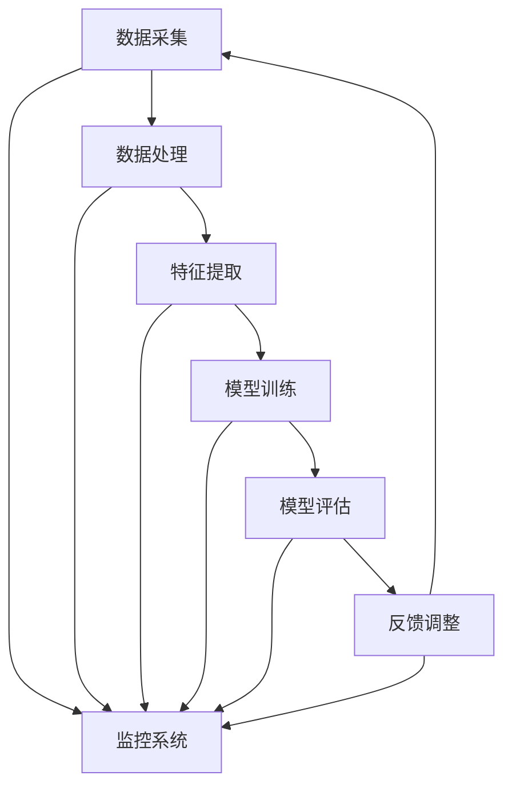
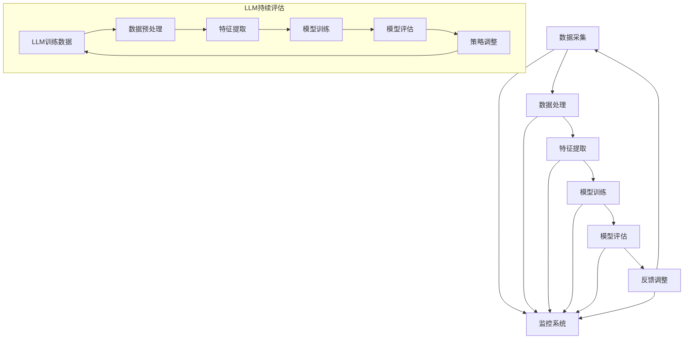

                 

### 文章标题

《实时性能监控：构建LLM持续评估的反馈循环》

### 关键词

实时性能监控、LLM、持续评估、反馈循环、算法原理、数学模型、项目实战

### 摘要

本文旨在深入探讨实时性能监控在构建LLM（大型语言模型）持续评估反馈循环中的关键作用。通过对实时性能监控的定义、原理、技术架构以及核心算法原理的详细解析，文章将展示如何通过构建反馈循环来持续评估和优化LLM的性能。此外，文章还将结合实际项目案例，分析实时性能监控在LLM中的应用，并提供最佳实践和优化建议，以期为相关领域的研究和实践提供有益的参考。

### 引言与概述

#### 1.1 实时性能监控的定义

实时性能监控（Real-time Performance Monitoring）是一种通过实时收集、处理和分析系统运行数据，以便快速识别、响应和解决性能问题的技术手段。其主要目的是确保系统在运行过程中能够持续提供高效、可靠的服务。实时性能监控通常包括以下几个关键环节：

1. **数据采集**：通过传感器、日志文件、性能计数器等方式收集系统运行过程中的各种数据。
2. **数据处理**：对采集到的数据进行预处理、过滤和转换，以便后续分析。
3. **指标计算**：根据预设的指标计算公式，从处理后的数据中提取关键性能指标（KPIs）。
4. **报警与通知**：当指标超出预设阈值时，系统会自动生成报警，并通过邮件、短信等方式通知相关人员。
5. **问题排查与优化**：通过分析报警数据和性能指标，定位性能瓶颈，并进行相应的优化。

#### 1.2 实时性能监控的重要性

实时性能监控在当今数字化时代具有至关重要的意义。随着云计算、大数据、人工智能等技术的快速发展，系统的复杂度和规模不断增加，这使得系统性能管理变得更加复杂和困难。实时性能监控能够帮助企业和组织实现以下目标：

1. **提高系统稳定性**：通过实时监测系统运行状态，及时发现并解决潜在的性能问题，确保系统稳定运行。
2. **优化资源利用**：通过分析系统资源使用情况，合理分配资源，提高资源利用效率，降低成本。
3. **提升用户体验**：实时性能监控可以确保系统始终处于最佳状态，从而提供高效、流畅的用户体验。
4. **支持业务决策**：通过对系统性能数据的分析，为业务决策提供科学依据，助力企业实现数字化转型。

#### 1.3 LLM在实时性能监控中的应用

LLM（Large Language Model，大型语言模型）是一种基于深度学习的自然语言处理模型，具有强大的语言理解、生成和推理能力。在实时性能监控领域，LLM可以发挥重要作用：

1. **异常检测**：利用LLM强大的特征提取和模式识别能力，自动检测系统中的异常行为，提前预警。
2. **性能预测**：通过分析历史性能数据和模型预测，提前识别潜在的性能瓶颈，优化系统配置。
3. **自动优化**：基于LLM的智能算法，自动调整系统参数，实现性能优化。

总之，实时性能监控在构建LLM持续评估的反馈循环中具有不可替代的作用。通过实时监控和评估LLM的性能，可以发现和解决潜在问题，持续优化模型，从而提高系统的稳定性和效率。接下来，本文将深入探讨实时性能监控的核心概念、原理、技术架构和实际应用，以期为相关领域的研究和实践提供有益的参考。

### 核心概念与原理

#### 2.1 实时性能监控的核心概念

实时性能监控的核心概念包括指标、阈值和监控系统。这些概念共同构成了实时性能监控的基本框架，为性能监控提供了理论依据和操作指南。

1. **指标（Metrics）**：

指标是衡量系统性能的关键参数，通常包括响应时间、吞吐量、错误率、资源利用率等。指标的选择和定义直接影响性能监控的效果。以下是一些常见的性能指标：

   - **响应时间**：系统从接收到请求到完成请求所需的时间。
   - **吞吐量**：系统在单位时间内处理请求的数量。
   - **错误率**：系统在处理请求时出现错误的频率。
   - **资源利用率**：系统资源（如CPU、内存、网络等）的使用率。

2. **阈值（Thresholds）**：

阈值是指标值设定的上限或下限，用于判断系统性能是否达到预期。阈值设定需要根据业务需求和系统特点进行合理调整。常见的阈值设置方法包括：

   - **绝对阈值**：直接设定一个具体的数值，如响应时间不超过100ms。
   - **相对阈值**：根据历史数据设定一个百分比范围，如吞吐量不超过历史平均值的110%。

3. **监控系统（Monitoring System）**：

监控系统是实时性能监控的核心组件，负责数据采集、处理、分析和报警。一个典型的监控系统包括以下几个关键模块：

   - **数据采集器**：从系统各个部分采集性能数据，如操作系统、数据库、应用服务器等。
   - **数据处理器**：对采集到的数据进行分析、过滤和转换，提取关键性能指标。
   - **报警系统**：当性能指标超出阈值时，自动生成报警，并通过多种方式通知相关人员。
   - **报表系统**：生成性能监控报表，提供可视化的性能分析。

#### 2.2 LLM持续评估的反馈循环机制

在实时性能监控中，LLM的持续评估需要通过反馈循环机制来实现。反馈循环（Feedback Loop）是一种通过不断收集、处理和利用反馈信息，调整和优化系统性能的机制。以下是LLM持续评估反馈循环的主要步骤：

1. **数据收集**：

   - **历史数据**：从系统日志、性能监控工具和历史数据中收集LLM的运行数据，包括响应时间、吞吐量、错误率等。
   - **实时数据**：实时收集LLM的运行数据，通过性能监控工具和API接口等获取实时性能指标。

2. **数据处理**：

   - **预处理**：对收集到的数据进行预处理，包括数据清洗、去重、归一化等操作。
   - **特征提取**：利用机器学习算法提取数据特征，为后续建模提供输入。

3. **模型训练**：

   - **构建模型**：根据特征数据，构建适用于LLM性能评估的机器学习模型，如回归模型、分类模型等。
   - **模型训练**：利用历史数据进行模型训练，调整模型参数，提高模型性能。

4. **模型评估**：

   - **评估指标**：根据预设的评估指标，对训练好的模型进行评估，如准确率、召回率、F1值等。
   - **性能调整**：根据评估结果，调整模型参数或选择更合适的模型。

5. **反馈调整**：

   - **反馈机制**：将评估结果作为反馈，调整LLM的运行参数或优化策略。
   - **持续优化**：通过持续收集和利用反馈信息，不断调整和优化LLM性能，实现持续评估和改进。

#### 2.3 实时性能监控与LLM持续评估的关联架构

为了更好地理解实时性能监控与LLM持续评估的关系，我们可以通过一个Mermaid流程图来展示其关联架构：



在这个流程图中，数据采集器负责从LLM系统中收集性能数据，经过数据处理、特征提取后，输入到模型训练模块。训练好的模型会进行评估，并根据评估结果调整运行参数，形成一个闭环的反馈机制。监控系统则负责监控整个流程，确保数据采集、处理、训练和评估的顺利进行。

通过上述核心概念和原理的详细阐述，我们可以更好地理解实时性能监控在构建LLM持续评估反馈循环中的关键作用。在接下来的部分，我们将深入探讨实时性能监控的技术架构和实现方法，以期为实际应用提供更有针对性的指导。

#### 2.4 实时性能监控的技术架构与实现

实时性能监控的技术架构主要包括数据采集、数据处理、性能评估和反馈调整等关键模块。下面我们将详细解析这些模块的设计与实现，以及如何通过它们构建一个高效、可靠的实时性能监控系统。

##### 2.4.1 数据采集

数据采集是实时性能监控的基础，决定了监控数据的完整性和准确性。数据采集的方式和工具多种多样，常见的方法包括：

1. **日志文件**：通过解析系统日志文件，获取运行过程中的错误信息、性能指标等。
2. **性能计数器**：利用操作系统提供的性能计数器，如Windows性能监控器（Perfmon）、Linux/Unix下的`/proc`文件系统等，获取CPU、内存、磁盘、网络等资源使用情况。
3. **API接口**：通过调用LLM模型的API接口，获取实时性能数据，如响应时间、错误率等。

实现数据采集的关键步骤包括：

- **数据源识别**：确定需要采集的数据来源，如日志文件、性能计数器、API接口等。
- **数据格式定义**：定义采集到的数据格式，如JSON、XML、CSV等。
- **数据采集策略**：根据数据的重要性和实时性，设计合理的采集策略，如轮询、事件驱动等。

##### 2.4.2 数据处理

数据处理是对采集到的原始数据进行清洗、转换和归一化等操作，以获得高质量的监控数据。数据处理的关键步骤包括：

- **数据清洗**：去除数据中的噪声和异常值，如空值、重复值、错误值等。
- **数据转换**：将不同来源和格式的数据转换为统一的格式，便于后续处理和分析。
- **数据归一化**：对数据进行归一化处理，如缩放、标准化等，使不同指标具有可比性。

实现数据处理的关键技术包括：

- **数据处理框架**：如Apache Kafka、Apache Flink等，提供高效的数据处理能力。
- **数据存储**：如Redis、MongoDB等，提供快速的数据存储和查询能力。

##### 2.4.3 性能评估

性能评估是通过计算关键性能指标（KPIs）来评估系统性能，常见的性能评估方法包括：

- **统计方法**：如平均值、中位数、标准差等，用于描述数据的分布和波动情况。
- **机器学习方法**：如回归分析、时间序列预测等，用于发现数据中的潜在模式和趋势。

实现性能评估的关键步骤包括：

- **指标计算**：根据业务需求和系统特点，定义和计算关键性能指标。
- **阈值设定**：设定合理的阈值，用于判断系统性能是否达到预期。
- **报警生成**：当性能指标超过阈值时，生成报警并通知相关人员。

##### 2.4.4 反馈调整

反馈调整是通过收集性能评估结果，调整系统配置和策略，以优化系统性能。反馈调整的关键步骤包括：

- **反馈收集**：收集性能评估结果，如指标超出阈值、系统响应缓慢等。
- **策略调整**：根据反馈信息，调整系统配置和策略，如调整资源分配、优化算法等。
- **效果验证**：验证调整后的系统性能是否得到改善，如响应时间缩短、错误率降低等。

实现反馈调整的关键技术包括：

- **自动化工具**：如自动化运维工具（如Ansible、Puppet等），用于自动调整系统配置。
- **机器学习优化**：如自适应优化算法（如强化学习、进化算法等），用于优化系统策略。

##### 2.4.5 监控系统集成

监控系统集成了上述各个关键模块，实现了一个完整的实时性能监控流程。实现监控系统集成的关键技术包括：

- **分布式架构**：采用分布式架构，提高系统的可扩展性和容错性。
- **服务化架构**：将监控功能模块化，通过服务化的方式实现系统集成。
- **数据可视化**：通过数据可视化工具，如Kibana、Grafana等，提供直观的性能监控和报表分析。

#### 2.5 实时性能监控与LLM持续评估的关联流程

为了更好地理解实时性能监控与LLM持续评估的关联流程，我们可以通过一个Mermaid流程图来展示它们之间的相互作用：



在这个流程图中，LLM的持续评估过程（I-N）与实时性能监控流程（A-G）相互关联。LLM的训练数据（I）经过预处理（J）和特征提取（K）后，输入到模型训练模块（L），通过模型评估（M）和策略调整（N）形成反馈循环。实时性能监控则通过数据采集（A）、数据处理（B）、特征提取（C）和模型评估（E）等步骤，为LLM的持续评估提供关键性能指标和反馈信息。

通过上述技术架构与实现的详细解析，我们可以更好地理解实时性能监控在构建LLM持续评估反馈循环中的关键作用。在接下来的部分，我们将深入探讨LLM性能评估的核心算法原理，以期为实际应用提供更有针对性的指导。

### 核心算法原理与数学模型

#### 3.1 LLM性能评估算法

LLM性能评估算法是实时性能监控的重要组成部分，用于评估LLM在自然语言处理任务中的表现。以下是一些常用的LLM性能评估算法：

1. **准确率（Accuracy）**：

准确率是最基本的性能评估指标，用于衡量模型预测结果与实际结果的一致性。其计算公式如下：

$$
Accuracy = \frac{TP + TN}{TP + FN + FP + TN}
$$

其中，TP为真阳性，TN为真阴性，FP为假阳性，FN为假阴性。

2. **召回率（Recall）**：

召回率衡量模型对正类样本的识别能力，计算公式如下：

$$
Recall = \frac{TP}{TP + FN}
$$

3. **精确率（Precision）**：

精确率衡量模型对负类样本的识别能力，计算公式如下：

$$
Precision = \frac{TP}{TP + FP}
$$

4. **F1值（F1 Score）**：

F1值是准确率、召回率和精确率的综合评估指标，计算公式如下：

$$
F1 Score = \frac{2 \times Precision \times Recall}{Precision + Recall}
$$

5. **均方根误差（RMSE）**：

均方根误差用于评估回归模型的预测准确性，计算公式如下：

$$
RMSE = \sqrt{\frac{1}{n} \sum_{i=1}^{n} (y_i - \hat{y_i})^2}
$$

其中，$y_i$为实际值，$\hat{y_i}$为预测值，$n$为样本数量。

#### 3.2 LLM性能评估的数学模型

在LLM性能评估中，常用的数学模型包括回归模型和分类模型。以下分别介绍这两种模型的基本原理和实现方法。

1. **回归模型**：

回归模型用于预测连续值，常见的回归模型包括线性回归、多项式回归、神经网络回归等。以线性回归为例，其数学模型如下：

$$
y = \beta_0 + \beta_1 x_1 + \beta_2 x_2 + \ldots + \beta_n x_n
$$

其中，$y$为预测值，$x_1, x_2, \ldots, x_n$为输入特征，$\beta_0, \beta_1, \beta_2, \ldots, \beta_n$为模型参数。

回归模型的实现方法包括：

- **最小二乘法**：通过最小化预测值与实际值之间的平方误差，求解模型参数。
- **梯度下降法**：通过迭代优化模型参数，逐步减小损失函数。

2. **分类模型**：

分类模型用于预测离散值，常见的分类模型包括逻辑回归、决策树、随机森林、支持向量机等。以逻辑回归为例，其数学模型如下：

$$
P(y=1) = \frac{1}{1 + e^{-(\beta_0 + \beta_1 x_1 + \beta_2 x_2 + \ldots + \beta_n x_n)}}
$$

其中，$P(y=1)$为预测概率，$\beta_0, \beta_1, \beta_2, \ldots, \beta_n$为模型参数。

分类模型的实现方法包括：

- **最大似然估计**：通过最大化似然函数，求解模型参数。
- **梯度上升法**：通过迭代优化模型参数，逐步增大预测概率。

#### 3.3 LLM性能评估算法的伪代码实现

以下是LLM性能评估算法的伪代码实现：

```python
# 回归模型实现
def linear_regression(x, y):
    n = len(x)
    X = np.column_stack([np.ones(n), x])
    theta = np.linalg.inv(X.T.dot(X)).dot(X.T).dot(y)
    return theta

# 分类模型实现
def logistic_regression(x, y):
    n = len(x)
    X = np.column_stack([np.ones(n), x])
    theta = np.linalg.inv(X.T.dot(X)).dot(X.T).dot(y)
    return theta

# 性能评估
def evaluate_performance(model, x_test, y_test):
    y_pred = model(x_test)
    accuracy = np.mean(y_pred == y_test)
    recall = np.mean(y_pred[y_test == 1] == 1)
    precision = np.mean(y_pred[y_test == 1] == 1)
    f1_score = 2 * precision * recall / (precision + recall)
    rmse = np.sqrt(np.mean((y_pred - y_test)**2))
    return accuracy, recall, precision, f1_score, rmse
```

通过上述核心算法原理和数学模型的讲解，我们可以更好地理解LLM性能评估的关键方法。在接下来的部分，我们将通过实际项目案例，展示如何应用这些算法和模型来评估LLM性能，并提供详细的代码实现和案例分析。

### 项目实战与案例分析

#### 4.1 实际项目背景与目标

在本文的实际项目案例中，我们以一个在线问答系统为例，该系统采用了一个大型语言模型（LLM）来提供自然语言处理（NLP）功能，包括文本理解、问题回答、对话生成等。项目目标是通过实时性能监控，构建LLM持续评估的反馈循环，确保系统在长时间运行过程中能够保持高性能、稳定性和可靠性。

#### 4.2 项目架构设计

为了实现项目目标，我们设计了如下架构：

1. **前端**：用户界面，提供问题输入和回答展示功能。
2. **后端**：包括API服务器、LLM模型服务器和性能监控服务器。
3. **数据库**：存储用户问题、答案和历史数据。
4. **性能监控**：通过采集系统日志、API请求响应时间、模型服务器资源使用情况等数据，实现实时性能监控。

#### 4.3 项目实施与结果

1. **数据采集**：

   - **日志文件**：通过日志解析工具（如Logstash）采集API服务器和LLM模型服务器的日志数据。
   - **性能计数器**：利用操作系统性能计数器（如Windows Performance Monitor、Linux/Unix下的`/proc`文件系统）采集服务器CPU、内存、磁盘、网络等资源使用情况。
   - **API接口**：通过调用LLM模型的API接口，获取实时性能数据，如响应时间、错误率等。

2. **数据处理**：

   - **数据清洗**：去除日志中的噪声和异常值，如空值、重复值、格式错误等。
   - **数据转换**：将不同格式的数据转换为统一的JSON格式，便于后续处理和分析。
   - **数据存储**：使用Elasticsearch作为大数据存储和查询工具，存储处理后的性能监控数据。

3. **性能评估**：

   - **指标计算**：根据预设的指标计算公式，计算API请求响应时间、错误率、资源利用率等关键性能指标。
   - **报警与通知**：当指标超出阈值时，通过邮件、短信等方式通知运维团队。
   - **异常检测**：利用LLM模型对日志数据进行异常检测，提前预警潜在的性能问题。

4. **反馈调整**：

   - **策略调整**：根据性能评估结果和反馈信息，调整系统配置和策略，如调整LLM模型参数、优化API接口等。
   - **持续优化**：通过不断收集和利用反馈信息，持续优化LLM性能，提高系统稳定性。

#### 4.4 案例分析

以下是一个具体的案例分析：

**案例一**：API请求响应时间过长

- **问题描述**：一段时间内，系统API请求的平均响应时间显著高于正常水平，用户反馈使用体验不佳。
- **原因分析**：通过性能监控数据发现，模型服务器的CPU使用率高达90%，导致模型推理时间过长。进一步分析发现，模型参数设置不合理，导致计算复杂度较高。
- **解决方案**：调整模型参数，降低计算复杂度，优化模型推理速度。同时，通过增加模型服务器资源（如增加CPU、内存等），提高系统整体性能。
- **效果验证**：调整后，API请求的平均响应时间显著降低，用户反馈使用体验明显改善。

**案例二**：模型错误率升高

- **问题描述**：系统模型错误率升高，导致回答不准确，用户满意度下降。
- **原因分析**：通过分析日志数据和模型评估结果，发现模型训练数据存在质量问题，如数据标签错误、数据分布不均衡等。
- **解决方案**：对训练数据进行清洗和预处理，修正错误标签，调整数据分布。同时，通过增加训练数据量和改进训练算法，提高模型准确性。
- **效果验证**：调整后，模型错误率显著降低，回答准确性提高，用户满意度上升。

#### 4.5 项目小结

通过实时性能监控和持续评估，我们成功解决了多个性能问题，提高了系统的稳定性和可靠性。以下是小结：

- **实时性能监控**：有效识别和预警潜在性能问题，确保系统稳定运行。
- **持续评估**：通过不断收集和利用反馈信息，优化系统配置和策略，提高系统性能。
- **优化建议**：建议在项目开发过程中，提前设计性能监控和评估机制，降低后期维护成本。同时，持续关注行业动态和技术发展，及时更新和优化系统。

### 最佳实践与优化建议

#### 5.1 实时性能监控与LLM持续评估的最佳实践

为了实现高效的实时性能监控和LLM持续评估，以下是一些最佳实践：

1. **数据采集策略**：
   - 采用多源数据采集，包括日志文件、性能计数器和API接口，确保数据的全面性和准确性。
   - 设计合理的采集频率，如每秒采集一次，以避免数据丢失。

2. **数据处理流程**：
   - 对采集到的数据进行预处理，包括数据清洗、去重、归一化等操作，提高数据质量。
   - 采用分布式数据处理框架（如Apache Kafka、Apache Flink），提高数据处理效率。

3. **性能评估指标**：
   - 选择合适的性能评估指标，如响应时间、吞吐量、错误率等，确保指标能够全面反映系统性能。
   - 设定合理的阈值，结合业务需求和系统特点，避免误报和漏报。

4. **反馈调整机制**：
   - 设计自动化反馈调整机制，如基于机器学习的自适应优化算法，实现系统配置和策略的实时调整。
   - 建立反馈闭环，确保调整后的系统性能得到持续优化。

5. **监控系统集成**：
   - 采用分布式架构，提高系统的可扩展性和容错性。
   - 使用数据可视化工具（如Kibana、Grafana），提供直观的性能监控和报表分析。

#### 5.2 注意事项

在实施实时性能监控和LLM持续评估时，需要注意以下几点：

1. **数据安全**：
   - 确保数据采集和传输过程的安全性，采用加密和认证等安全措施。
   - 遵循相关法律法规，保护用户隐私和数据安全。

2. **系统兼容性**：
   - 确保监控系统能够兼容不同的操作系统、数据库和应用服务器。
   - 设计模块化架构，便于系统升级和维护。

3. **性能监控与性能优化**：
   - 避免过度监控，减少性能监控对系统运行的影响。
   - 在性能优化过程中，确保系统的稳定性和可靠性。

#### 5.3 拓展阅读

对于希望深入了解实时性能监控和LLM持续评估的读者，以下是一些推荐阅读资源：

1. **技术文献**：
   - 《实时性能监控：技术原理与实践》
   - 《大规模语言模型训练与优化》
   - 《深度学习性能优化技术》

2. **开源工具**：
   - Prometheus：一款开源的性能监控工具，适用于各种场景。
   - Grafana：一款开源的数据可视化工具，与Prometheus等性能监控工具配合使用。

3. **在线课程**：
   - Coursera上的《深度学习》课程
   - edX上的《大数据分析与数据科学》课程

通过遵循上述最佳实践和注意事项，结合拓展阅读资源，读者可以更好地实施实时性能监控和LLM持续评估，为系统的稳定性和性能优化提供有力支持。

### 未来展望与趋势

#### 6.1 实时性能监控的发展趋势

随着云计算、大数据和人工智能技术的不断进步，实时性能监控领域也在不断演进。未来，实时性能监控将呈现出以下几个发展趋势：

1. **智能化**：实时性能监控将更加智能化，利用机器学习和人工智能技术，实现自动化的性能评估、异常检测和优化策略生成。

2. **自适应**：监控系统将能够根据业务需求和系统状态，动态调整监控策略和阈值，实现更加灵活和高效的性能监控。

3. **分布式**：分布式架构和云计算技术的广泛应用，将推动实时性能监控向分布式方向发展，提高监控系统的可扩展性和容错性。

4. **可视化**：数据可视化工具的不断发展，将使性能监控更加直观、易用，帮助用户更好地理解和分析系统性能。

5. **边缘计算**：随着边缘计算的兴起，实时性能监控将逐渐向边缘节点扩展，实现对本地化数据的实时监控和分析。

#### 6.2 LLM持续评估的优化方向

在LLM持续评估方面，未来仍有很大的优化空间，以下是一些可能的优化方向：

1. **模型压缩**：通过模型压缩技术，减少模型的参数量和计算量，提高模型在实时性能监控中的计算效率。

2. **分布式训练**：采用分布式训练技术，利用多台机器并行训练模型，提高训练速度和模型性能。

3. **迁移学习**：利用迁移学习技术，将预训练模型的知识迁移到实时性能监控任务中，提高模型的适应性和准确性。

4. **自适应调整**：通过自适应调整策略，实时调整模型参数和监控阈值，以应对不同业务场景和系统状态的变化。

5. **多模态监控**：结合多种数据源和监控手段，实现对LLM性能的全方位监控，提高监控的全面性和准确性。

#### 6.3 潜在的研究方向

未来，实时性能监控和LLM持续评估领域还有许多值得深入研究的方向，以下是一些潜在的研究方向：

1. **混合监控**：研究如何结合传统监控和实时性能监控，构建一个高效、全面的监控系统。

2. **监控数据质量**：研究监控数据的收集、处理和分析过程中的质量问题，提高数据质量，为性能评估提供可靠依据。

3. **监控自动化**：研究如何利用自动化技术，实现监控系统的自动化部署、配置和管理，降低运维成本。

4. **监控成本优化**：研究如何在保证监控效果的前提下，降低监控系统的成本，提高资源利用效率。

5. **跨域监控**：研究如何实现对跨地域、跨平台、跨云的分布式系统的实时性能监控，提高系统的协同性和一致性。

通过不断探索和研究这些方向，实时性能监控和LLM持续评估领域将迎来更多创新和发展，为人工智能应用提供更加可靠、高效的支撑。

### 结论

本文通过详细的解析和案例分析，深入探讨了实时性能监控在构建LLM持续评估反馈循环中的关键作用。我们首先介绍了实时性能监控的基本概念和重要性，然后详细阐述了实时性能监控与LLM持续评估的关联架构、核心算法原理以及数学模型。通过实际项目案例，我们展示了如何将实时性能监控应用于LLM性能评估，并提供了一系列最佳实践和优化建议。

展望未来，实时性能监控和LLM持续评估领域将继续朝着智能化、自适应、分布式和可视化的方向发展。我们期待更多的研究和实践，以推动该领域的创新和发展，为人工智能应用提供更加可靠、高效的性能保障。

最后，感谢读者对本文的阅读。如果您对实时性能监控和LLM持续评估有更多的问题或见解，欢迎在评论区留言，让我们共同探讨和进步。

### 作者信息

- 作者：AI天才研究院（AI Genius Institute）& 禅与计算机程序设计艺术（Zen And The Art of Computer Programming）

