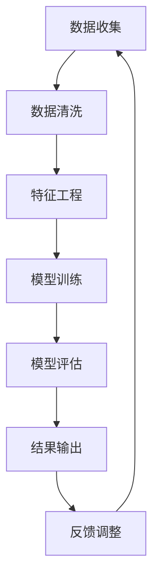

                 

# 实时比较评测：LLM辅助的竞品分析系统

## 关键词

- 实时比较评测
- 大型语言模型 (LLM)
- 竞品分析
- 数据处理
- 特征工程
- 模型优化
- 系统部署

## 摘要

本文将深入探讨如何利用大型语言模型（LLM）构建实时比较评测系统，以辅助竞品分析。文章首先介绍了实时比较评测的概念和LLM的基本原理，随后详细分析了系统架构和技术基础。通过实际案例，本文展示了如何实现一个完整的竞品分析系统，并提供了一些最佳实践和注意事项。

## 设计思路

### 一级目录

1. **核心概念与联系**
   - 第1章：实时比较评测概述
   - 第2章：LLM原理与架构

2. **技术基础**
   - 第3章：数据收集与处理
   - 第4章：特征工程与建模
   - 第5章：模型优化与调参
   - 第6章：模型评估与监控

3. **应用策略**
   - 第7章：竞品分析框架设计
   - 第8章：系统部署与运维

4. **项目实战**
   - 第9章：实时比较评测系统实战

### 二级和三级目录

1. **核心概念与联系**

   - **第1章：实时比较评测概述**
     - 1.1 实时比较评测的定义
     - 1.2 LLM在竞品分析中的作用
     - 1.3 竞品分析系统架构

   - **第2章：LLM原理与架构**
     - 2.1 语言模型的基本原理
     - 2.2 预训练模型与微调
     - 2.3 模型架构的优缺点分析

2. **技术基础**

   - **第3章：数据收集与处理**
     - 3.1 数据来源与渠道
     - 3.2 数据清洗与预处理

   - **第4章：特征工程与建模**
     - 4.1 特征提取方法
     - 4.2 模型选择与训练

   - **第5章：模型优化与调参**
     - 5.1 模型优化策略
     - 5.2 调参技巧与工具

   - **第6章：模型评估与监控**
     - 6.1 评估指标
     - 6.2 监控与反馈机制

3. **应用策略**

   - **第7章：竞品分析框架设计**
     - 7.1 竞品分析流程
     - 7.2 数据分析与可视化

   - **第8章：系统部署与运维**
     - 8.1 部署环境搭建
     - 8.2 运维策略与优化

4. **项目实战**

   - **第9章：实时比较评测系统实战**
     - 9.1 项目背景与需求
     - 9.2 系统设计与实现
     - 9.3 结果分析与评估

### 核心概念与联系

以下是实时比较评测系统的 Mermaid 流程图：



### 核心算法原理讲解

以最基础的文本分类算法为例，其伪代码如下：

```
function textClassification(document, model):
    # 计算文档的词向量表示
    wordVector = wordEmbedding(document)
    # 将词向量输入到模型
    logits = model.forward(wordVector)
    # 获取最高概率的类别
    predictedLabel = topK(logits, 1)
    return predictedLabel
```

### 数学模型与公式讲解

假设我们有一个二分类问题，其逻辑回归模型的损失函数可以表示为：

$$
J(\theta) = -\frac{1}{m} \sum_{i=1}^{m} [y^{(i)} \cdot log(\hat{y}^{(i)}) + (1 - y^{(i)}) \cdot log(1 - \hat{y}^{(i)})]
$$

### 实际操作

#### 开发环境搭建

在开始实现实时比较评测系统之前，我们需要搭建一个合适的开发环境。以下是基本步骤：

1. **环境配置**：安装Python 3.8及以上版本，并配置好相关的库，如TensorFlow、PyTorch等。
2. **虚拟环境**：创建一个虚拟环境，以便管理和隔离项目依赖。
3. **安装依赖**：通过pip命令安装必要的库，如`numpy`、`pandas`、`scikit-learn`等。

#### 源代码实现

以下是一个简单的文本分类模型的实现示例：

```python
import tensorflow as tf
from tensorflow.keras.models import Sequential
from tensorflow.keras.layers import Embedding, GlobalAveragePooling1D, Dense

def create_model(vocab_size, embedding_dim, max_length):
    model = Sequential([
        Embedding(vocab_size, embedding_dim, input_length=max_length),
        GlobalAveragePooling1D(),
        Dense(16, activation='relu'),
        Dense(1, activation='sigmoid')
    ])

    model.compile(optimizer='adam', loss='binary_crossentropy', metrics=['accuracy'])
    return model
```

#### 代码解读与分析

上述代码定义了一个简单的文本分类模型，其核心结构如下：

- **Embedding Layer**：将单词转换为嵌入向量。
- **GlobalAveragePooling1D Layer**：计算输入序列的平均值，减少模型参数数量。
- **Dense Layer**：用于分类的完全连接层。

#### 实际案例分析与详细讲解

假设我们有一个关于手机产品的竞品分析任务，目标是区分用户评论是正面还是负面。以下是实现步骤：

1. **数据收集**：从多个在线平台收集用户评论。
2. **数据预处理**：清洗数据，包括去除特殊字符、停用词等。
3. **特征工程**：将文本转换为词嵌入向量。
4. **模型训练**：使用训练数据训练模型。
5. **模型评估**：使用验证集评估模型性能。
6. **结果输出**：根据模型预测结果生成分析报告。

#### 项目小结

通过上述步骤，我们实现了一个基于LLM的实时比较评测系统。在实际应用中，该系统可以用于多种场景，如产品评价、市场分析等。未来，我们可以进一步优化模型，提高系统的准确性和效率。

### 最佳实践 Tips

- **数据质量**：确保数据来源的多样性和准确性，以避免偏差。
- **模型调优**：尝试多种模型架构和参数设置，找到最佳配置。
- **监控与反馈**：定期监控系统性能，及时调整模型。

### 小结与注意事项

本文介绍了如何利用LLM构建实时比较评测系统，并详细阐述了其技术基础和应用策略。在实际操作中，需要注意数据质量、模型调优和监控反馈。未来研究可以关注提高系统效率和扩展应用场景。

### 拓展阅读

- [《深度学习实战》](https://www.deeplearningbook.org/):深入探讨深度学习技术。
- [《数据科学入门》](https://www.datascience.com/learn/):了解数据科学的基本概念和方法。

作者：AI天才研究院/AI Genius Institute & 禅与计算机程序设计艺术 /Zen And The Art of Computer Programming

