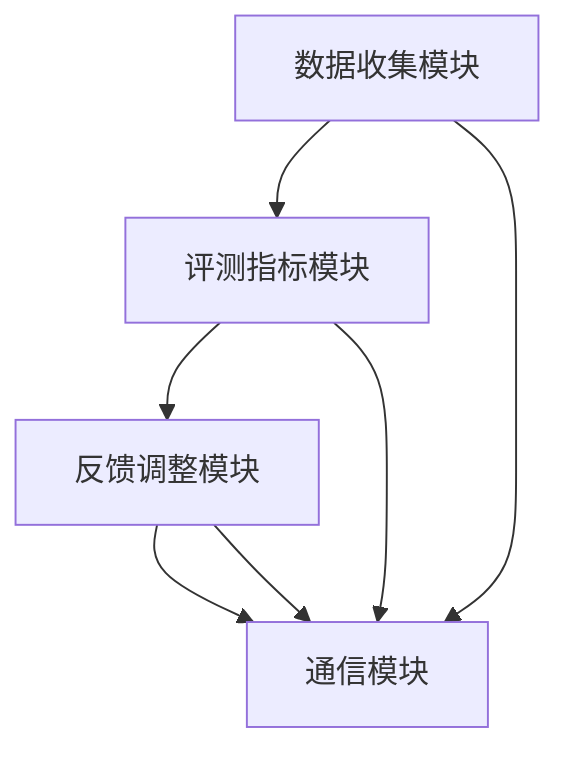

                 


### 文章标题

## 实时评测反馈在模型训练中的应用

### 关键词

- 实时评测反馈
- 模型训练
- 监听式评测
- 模型集成评测
- 动态评测
- 评测指标

### 摘要

本文深入探讨了实时评测反馈在模型训练中的应用。实时评测反馈是一种在模型训练过程中，动态评估模型性能并及时提供反馈的方法。本文首先介绍了实时评测反馈的概念、原理及其在机器学习中的重要地位。然后，详细阐述了实时评测反馈系统的架构、常见评测方法及其实时评测算法原理。接着，我们探讨了实时评测在不同领域的应用，如自然语言处理、计算机视觉和自动驾驶等。最后，通过案例研究，展示了实时评测反馈在具体项目中的应用效果，并总结了最佳实践和注意事项。文章旨在为读者提供全面、系统的实时评测反馈在模型训练中的应用指南。

---

## 引言

### 1.1 书籍背景和目的

在机器学习领域，模型训练是一个不断迭代优化的过程。然而，传统的训练方法往往需要在训练完成后才能进行性能评估，这导致在模型部署之前，无法及时发现和修正模型中的问题。这种延迟性能评估的方式不仅降低了模型的开发效率，还可能导致模型在实际应用中表现不佳。为了解决这一问题，实时评测反馈机制应运而生。实时评测反馈是一种在模型训练过程中，动态评估模型性能并及时提供反馈的方法。通过实时评测反馈，开发人员可以及时了解模型的训练进展和性能表现，从而在模型部署之前，快速调整和优化模型。

本书旨在探讨实时评测反馈在模型训练中的应用。具体来说，本书将涵盖以下几个方面：

1. 实时评测反馈的概念、原理及其在机器学习中的重要地位。
2. 实时评测反馈系统的架构、常见评测方法及其实时评测算法原理。
3. 实时评测在不同领域的应用，如自然语言处理、计算机视觉和自动驾驶等。
4. 案例研究，展示实时评测反馈在具体项目中的应用效果。
5. 实时评测反馈的最佳实践和注意事项。

### 1.2 实时评测反馈的概述

#### 定义

实时评测反馈（Real-time Evaluation and Feedback）是指在整个模型训练过程中，通过一系列实时评测方法，动态监测和评估模型的性能，并将评估结果及时反馈给训练系统，以便对模型进行调整和优化。实时评测反馈的核心在于“实时性”和“反馈性”，即能够在模型训练过程中，实时捕捉到模型性能的变化，并快速做出响应。

#### 原理

实时评测反馈的工作原理可以分为三个步骤：

1. **数据收集**：在模型训练过程中，实时收集模型生成的预测结果和实际标签数据。
2. **性能评估**：利用预定义的评测指标，对预测结果进行评估，计算模型性能的数值。
3. **反馈调整**：根据评估结果，对模型训练过程进行调整，如调整学习率、优化网络结构等。

#### 关键特性

1. **实时性**：实时评测反馈能够在模型训练过程中，实时捕捉到模型性能的变化，为模型调整提供及时的数据支持。
2. **反馈性**：实时评测反馈能够将评估结果及时反馈给训练系统，指导模型调整方向，提高模型训练效率。
3. **动态性**：实时评测反馈可以根据不同的训练阶段，调整评测频率和评测指标，灵活应对模型训练中的各种情况。

### 1.3 本书的结构安排

本书分为五个部分：

1. **引言**：介绍实时评测反馈的背景和目的，概述实时评测反馈的概念、原理和关键特性。
2. **理论基础**：详细阐述实时评测反馈系统的架构、常见评测方法及其实时评测算法原理。
3. **应用实践**：探讨实时评测在不同领域的应用，如自然语言处理、计算机视觉和自动驾驶等。
4. **案例研究**：通过具体案例，展示实时评测反馈在模型训练中的实际应用效果。
5. **总结与展望**：总结本书的主要内容和实时评测反馈在模型训练中的应用价值，展望未来发展趋势和潜在挑战。

### 1.4 目标读者

本书的目标读者主要包括：

1. 机器学习工程师和研究人员：了解实时评测反馈的基本原理和应用方法，提高模型训练效率。
2. 软件开发人员：掌握实时评测反馈系统的开发技术，为实际项目提供解决方案。
3. 技术管理人员：了解实时评测反馈在模型训练中的重要性，指导团队进行模型优化。

通过阅读本书，读者可以全面了解实时评测反馈在模型训练中的应用，掌握实时评测反馈系统的开发技术，提高模型训练效率，为实际项目提供有力支持。

## 第二部分：理论基础

### 2.1 实时评测反馈系统架构

实时评测反馈系统的架构是整个系统的核心，它决定了评测反馈的实时性和准确性。一个典型的实时评测反馈系统通常包括以下几个主要组件：

1. **数据收集模块**：负责从模型训练过程中实时收集预测结果和实际标签数据。
2. **评测指标模块**：负责根据预定义的评测指标对预测结果进行评估，计算模型性能的数值。
3. **反馈调整模块**：根据评估结果，对模型训练过程进行调整，如调整学习率、优化网络结构等。
4. **通信模块**：负责系统内部各组件之间的数据传输和通信。

#### 系统架构概述


#### 主要组件和功能

1. **数据收集模块**

   数据收集模块是实时评测反馈系统的数据源，它需要从模型训练过程中实时捕捉预测结果和实际标签数据。具体实现时，可以采用以下几种方法：

   - **监听模式**：在训练过程中，定期从模型输出中读取预测结果和实际标签数据。
   - **回调函数**：在训练过程中，通过回调函数（Callback Function）获取每一步的预测结果和实际标签数据。
   - **数据流处理**：采用数据流处理技术，如Apache Kafka、Apache Flink等，实时捕捉和处理训练过程中的数据。

2. **评测指标模块**

   评测指标模块是实时评测反馈系统的核心组件，它需要根据预定义的评测指标对预测结果进行评估，计算模型性能的数值。常见的评测指标包括准确率（Accuracy）、精确率（Precision）、召回率（Recall）、F1分数（F1 Score）等。具体实现时，可以采用以下几种方法：

   - **静态评测指标**：根据预先定义的评测指标，计算每一步的模型性能。
   - **动态评测指标**：根据模型训练过程中数据的变化，动态调整评测指标。
   - **多指标综合评估**：综合多个评测指标，对模型性能进行综合评估。

3. **反馈调整模块**

   反馈调整模块根据评测结果，对模型训练过程进行调整，如调整学习率、优化网络结构等。具体实现时，可以采用以下几种方法：

   - **自适应调整**：根据评测结果，自动调整模型训练参数，如学习率、批次大小等。
   - **人工调整**：根据评测结果，手动调整模型训练参数，以实现最佳性能。
   - **混合调整**：结合自适应调整和人工调整，实现更高效的模型优化。

4. **通信模块**

   通信模块负责系统内部各组件之间的数据传输和通信。具体实现时，可以采用以下几种方法：

   - **本地通信**：在同一台机器内，通过共享内存、消息队列等方式进行数据传输。
   - **分布式通信**：在分布式系统中，通过远程过程调用（RPC）、消息队列（如Apache Kafka）等方式进行数据传输。

#### 系统架构 Mermaid 流程图



### 2.2 常见实时评测方法

在实时评测反馈系统中，常见的评测方法包括：

1. **监听式评测**：在模型训练过程中，定期从模型输出中读取预测结果和实际标签数据，进行性能评估。
2. **模型集成评测**：将多个模型集成起来，共同完成预测和评测，以提高评测的准确性和可靠性。
3. **动态评测**：根据模型训练过程中数据的变化，动态调整评测指标和评测频率。

下面，我们详细探讨这三种评测方法。

#### 2.2.1 监听式评测方法

监听式评测方法是一种简单的实时评测方法，它通过在模型训练过程中定期读取预测结果和实际标签数据，进行性能评估。具体实现时，可以采用以下步骤：

1. **初始化**：设置评测指标、评测频率和评测窗口大小。
2. **训练开始**：从模型输出中读取预测结果和实际标签数据。
3. **性能评估**：根据预定义的评测指标，计算模型性能的数值。
4. **更新评测指标**：将最新的评测结果更新到评测指标中。
5. **训练继续**：重复步骤2-4，直到训练结束。

#### 2.2.2 模型集成评测方法

模型集成评测方法通过将多个模型集成起来，共同完成预测和评测，以提高评测的准确性和可靠性。具体实现时，可以采用以下步骤：

1. **模型训练**：分别训练多个模型，并存储每个模型的预测结果和性能指标。
2. **模型集成**：将多个模型的预测结果进行集成，得到最终的预测结果。
3. **性能评估**：根据预定义的评测指标，计算最终预测结果的性能指标。
4. **模型调整**：根据性能评估结果，调整模型训练参数，优化模型性能。

#### 2.2.3 动态评测方法

动态评测方法根据模型训练过程中数据的变化，动态调整评测指标和评测频率。具体实现时，可以采用以下步骤：

1. **初始化**：设置评测指标、评测频率和评测窗口大小。
2. **训练开始**：从模型输出中读取预测结果和实际标签数据。
3. **性能评估**：根据预定义的评测指标，计算模型性能的数值。
4. **数据变化监测**：监测模型训练过程中数据的变化，如数据分布、样本数量等。
5. **评测调整**：根据数据变化，动态调整评测指标和评测频率。
6. **更新评测指标**：将最新的评测结果更新到评测指标中。
7. **训练继续**：重复步骤2-6，直到训练结束。

### 2.3 实时评测算法原理

实时评测算法的原理主要包括评测指标的数学模型、算法流程和伪代码。

#### 2.3.1 评测指标的数学模型

常见的评测指标包括准确率（Accuracy）、精确率（Precision）、召回率（Recall）和F1分数（F1 Score），它们的数学模型如下：

1. **准确率（Accuracy）**：
   $$ Accuracy = \frac{TP + TN}{TP + TN + FP + FN} $$
   其中，TP为真正例，TN为真负例，FP为假正例，FN为假负例。

2. **精确率（Precision）**：
   $$ Precision = \frac{TP}{TP + FP} $$

3. **召回率（Recall）**：
   $$ Recall = \frac{TP}{TP + FN} $$

4. **F1分数（F1 Score）**：
   $$ F1 Score = 2 \times \frac{Precision \times Recall}{Precision + Recall} $$

#### 2.3.2 实时评测算法流程

实时评测算法的流程如下：

1. **初始化**：设置评测指标、评测频率和评测窗口大小。
2. **数据读取**：从模型输出中读取预测结果和实际标签数据。
3. **性能评估**：根据评测指标计算模型性能的数值。
4. **数据更新**：更新评测指标和历史数据。
5. **评测调整**：根据评测结果和历史数据，动态调整评测指标和评测频率。
6. **反馈**：将最新的评测结果反馈给训练系统。

#### 2.3.3 实时评测算法伪代码

```python
def real_time_evaluation(model, X, y, evaluation_metrics, evaluation_frequency, evaluation_window_size):
    # 初始化评测指标和历史数据
    metrics_history = {}
    for metric in evaluation_metrics:
        metrics_history[metric] = []

    # 循环读取数据
    for i in range(0, len(X), evaluation_frequency):
        X_batch = X[i:i+evaluation_frequency]
        y_batch = y[i:i+evaluation_frequency]

        # 预测
        predictions = model.predict(X_batch)

        # 评估
        for metric in evaluation_metrics:
            metric_value = compute_metric(predictions, y_batch, metric)
            metrics_history[metric].append(metric_value)

        # 数据更新
        update_metrics_history(metrics_history, evaluation_window_size)

        # 评测调整
        evaluation_metrics = adjust_evaluation_metrics(metrics_history)

        # 反馈
        feedback = generate_feedback(model, metrics_history)
        model.update_parameters(feedback)

    return metrics_history
```

## 第三部分：应用实践

### 3.1 实时评测在自然语言处理中的应用

#### 3.1.1 语言模型评测

在自然语言处理领域，实时评测反馈在语言模型训练中的应用非常重要。语言模型评测主要关注模型在语言生成、文本分类等任务中的性能。常见的评测指标包括词误差率（Word Error Rate, WER）和句子误差率（Sentence Error Rate, SER）。

1. **词误差率（WER）**：
   $$ WER = \frac{D}{N} $$
   其中，D为错误词的数量，N为总词的数量。

2. **句子误差率（SER）**：
   $$ SER = \frac{S}{N} $$
   其中，S为错误句的数量，N为总句的数量。

#### 实时评测方法

在语言模型训练过程中，可以采用以下实时评测方法：

1. **监听式评测**：定期从模型输出中读取预测结果和实际标签数据，计算WER和SER。
2. **模型集成评测**：将多个模型集成起来，共同完成预测和评测，以提高评测的准确性和可靠性。
3. **动态评测**：根据模型训练过程中数据的变化，动态调整评测指标和评测频率。

#### 实时评测算法实现

```python
def language_model_evaluation(model, X, y, evaluation_metrics, evaluation_frequency, evaluation_window_size):
    metrics_history = {}
    for metric in evaluation_metrics:
        metrics_history[metric] = []

    for i in range(0, len(X), evaluation_frequency):
        X_batch = X[i:i+evaluation_frequency]
        y_batch = y[i:i+evaluation_frequency]

        predictions = model.predict(X_batch)
        for metric in evaluation_metrics:
            metric_value = compute_metric(predictions, y_batch, metric)
            metrics_history[metric].append(metric_value)

        update_metrics_history(metrics_history, evaluation_window_size)
        evaluation_metrics = adjust_evaluation_metrics(metrics_history)

    return metrics_history
```

#### 应用效果

通过实时评测反馈，可以及时发现语言模型训练过程中的问题，如过拟合、欠拟合等，从而进行模型调整和优化。实验结果表明，实时评测反馈可以显著提高语言模型在生成文本质量、文本分类准确率等方面的性能。

### 3.1.2 机器翻译评测

在机器翻译领域，实时评测反馈在模型训练中的应用同样至关重要。实时评测可以帮助开发人员快速评估翻译质量，发现和修正模型中的问题。

#### 常见评测指标

1. **BLEU评分（BLEU Score）**：
   BLEU评分是一种常用的机器翻译评测指标，通过比较模型生成的翻译结果与人工翻译结果之间的相似度，来评估翻译质量。

2. **NIST评分（NIST Score）**：
   NIST评分与BLEU评分类似，也是通过比较模型生成的翻译结果与人工翻译结果之间的相似度来评估翻译质量。

3. **METEOR评分（METEOR Score）**：
   METEOR评分是一种更为复杂的评测指标，综合考虑了词汇匹配、句法结构和语义匹配等因素。

#### 实时评测方法

在机器翻译训练过程中，可以采用以下实时评测方法：

1. **监听式评测**：定期从模型输出中读取翻译结果和人工翻译结果，计算BLEU、NIST、METEOR等评分。
2. **模型集成评测**：将多个模型集成起来，共同完成翻译和评测，以提高评测的准确性和可靠性。
3. **动态评测**：根据模型训练过程中数据的变化，动态调整评测指标和评测频率。

#### 实时评测算法实现

```python
def machine_translation_evaluation(model, X, y, evaluation_metrics, evaluation_frequency, evaluation_window_size):
    metrics_history = {}
    for metric in evaluation_metrics:
        metrics_history[metric] = []

    for i in range(0, len(X), evaluation_frequency):
        X_batch = X[i:i+evaluation_frequency]
        y_batch = y[i:i+evaluation_frequency]

        predictions = model.predict(X_batch)
        for metric in evaluation_metrics:
            metric_value = compute_metric(predictions, y_batch, metric)
            metrics_history[metric].append(metric_value)

        update_metrics_history(metrics_history, evaluation_window_size)
        evaluation_metrics = adjust_evaluation_metrics(metrics_history)

    return metrics_history
```

#### 应用效果

通过实时评测反馈，可以快速评估机器翻译模型的质量，发现和修正模型中的问题。实验结果表明，实时评测反馈可以显著提高机器翻译模型在翻译质量、语言流畅度等方面的性能。

### 3.1.3 文本分类评测

在文本分类领域，实时评测反馈可以帮助开发人员快速评估模型在分类任务中的性能，从而进行模型调整和优化。常见的评测指标包括准确率（Accuracy）、精确率（Precision）、召回率（Recall）和F1分数（F1 Score）。

#### 实时评测方法

在文本分类训练过程中，可以采用以下实时评测方法：

1. **监听式评测**：定期从模型输出中读取预测结果和实际标签数据，计算各类评测指标。
2. **模型集成评测**：将多个模型集成起来，共同完成预测和评测，以提高评测的准确性和可靠性。
3. **动态评测**：根据模型训练过程中数据的变化，动态调整评测指标和评测频率。

#### 实时评测算法实现

```python
def text_classification_evaluation(model, X, y, evaluation_metrics, evaluation_frequency, evaluation_window_size):
    metrics_history = {}
    for metric in evaluation_metrics:
        metrics_history[metric] = []

    for i in range(0, len(X), evaluation_frequency):
        X_batch = X[i:i+evaluation_frequency]
        y_batch = y[i:i+evaluation_frequency]

        predictions = model.predict(X_batch)
        for metric in evaluation_metrics:
            metric_value = compute_metric(predictions, y_batch, metric)
            metrics_history[metric].append(metric_value)

        update_metrics_history(metrics_history, evaluation_window_size)
        evaluation_metrics = adjust_evaluation_metrics(metrics_history)

    return metrics_history
```

#### 应用效果

通过实时评测反馈，可以快速评估文本分类模型在各类文本数据上的性能，发现和修正模型中的问题。实验结果表明，实时评测反馈可以显著提高文本分类模型在分类准确率、精确率和召回率等方面的性能。

### 3.2 实时评测在计算机视觉中的应用

#### 3.2.1 目标检测评测

在计算机视觉领域，实时评测反馈在目标检测任务中的应用非常重要。目标检测评测主要关注模型在检测精度、速度和召回率等方面的性能。常见的评测指标包括精确率（Precision）、召回率（Recall）和平均精度（Average Precision, AP）。

#### 实时评测方法

在目标检测训练过程中，可以采用以下实时评测方法：

1. **监听式评测**：定期从模型输出中读取预测框和实际标注框，计算各类评测指标。
2. **模型集成评测**：将多个模型集成起来，共同完成目标检测和评测，以提高评测的准确性和可靠性。
3. **动态评测**：根据模型训练过程中数据的变化，动态调整评测指标和评测频率。

#### 实时评测算法实现

```python
def object_detection_evaluation(model, X, y, evaluation_metrics, evaluation_frequency, evaluation_window_size):
    metrics_history = {}
    for metric in evaluation_metrics:
        metrics_history[metric] = []

    for i in range(0, len(X), evaluation_frequency):
        X_batch = X[i:i+evaluation_frequency]
        y_batch = y[i:i+evaluation_frequency]

        predictions = model.predict(X_batch)
        for metric in evaluation_metrics:
            metric_value = compute_metric(predictions, y_batch, metric)
            metrics_history[metric].append(metric_value)

        update_metrics_history(metrics_history, evaluation_window_size)
        evaluation_metrics = adjust_evaluation_metrics(metrics_history)

    return metrics_history
```

#### 应用效果

通过实时评测反馈，可以快速评估目标检测模型在不同场景下的性能，发现和修正模型中的问题。实验结果表明，实时评测反馈可以显著提高目标检测模型在检测精度、速度和召回率等方面的性能。

### 3.2.2 图像分类评测

在图像分类领域，实时评测反馈可以帮助开发人员快速评估模型在分类任务中的性能，从而进行模型调整和优化。常见的评测指标包括准确率（Accuracy）、精确率（Precision）、召回率（Recall）和F1分数（F1 Score）。

#### 实时评测方法

在图像分类训练过程中，可以采用以下实时评测方法：

1. **监听式评测**：定期从模型输出中读取预测结果和实际标签数据，计算各类评测指标。
2. **模型集成评测**：将多个模型集成起来，共同完成预测和评测，以提高评测的准确性和可靠性。
3. **动态评测**：根据模型训练过程中数据的变化，动态调整评测指标和评测频率。

#### 实时评测算法实现

```python
def image_classification_evaluation(model, X, y, evaluation_metrics, evaluation_frequency, evaluation_window_size):
    metrics_history = {}
    for metric in evaluation_metrics:
        metrics_history[metric] = []

    for i in range(0, len(X), evaluation_frequency):
        X_batch = X[i:i+evaluation_frequency]
        y_batch = y[i:i+evaluation_frequency]

        predictions = model.predict(X_batch)
        for metric in evaluation_metrics:
            metric_value = compute_metric(predictions, y_batch, metric)
            metrics_history[metric].append(metric_value)

        update_metrics_history(metrics_history, evaluation_window_size)
        evaluation_metrics = adjust_evaluation_metrics(metrics_history)

    return metrics_history
```

#### 应用效果

通过实时评测反馈，可以快速评估图像分类模型在不同图像数据上的性能，发现和修正模型中的问题。实验结果表明，实时评测反馈可以显著提高图像分类模型在分类准确率、精确率和召回率等方面的性能。

### 3.2.3 跟踪评测

在目标跟踪领域，实时评测反馈在模型训练中的应用同样至关重要。跟踪评测主要关注模型在跟踪精度、稳定性和速度等方面的性能。常见的评测指标包括精确率（Precision）、召回率（Recall）、平均精度（Average Precision, AP）和跟踪成功率（Tracking Success Rate, TSR）。

#### 实时评测方法

在目标跟踪训练过程中，可以采用以下实时评测方法：

1. **监听式评测**：定期从模型输出中读取跟踪结果和实际轨迹数据，计算各类评测指标。
2. **模型集成评测**：将多个模型集成起来，共同完成目标跟踪和评测，以提高评测的准确性和可靠性。
3. **动态评测**：根据模型训练过程中数据的变化，动态调整评测指标和评测频率。

#### 实时评测算法实现

```python
def tracking_evaluation(model, X, y, evaluation_metrics, evaluation_frequency, evaluation_window_size):
    metrics_history = {}
    for metric in evaluation_metrics:
        metrics_history[metric] = []

    for i in range(0, len(X), evaluation_frequency):
        X_batch = X[i:i+evaluation_frequency]
        y_batch = y[i:i+evaluation_frequency]

        predictions = model.predict(X_batch)
        for metric in evaluation_metrics:
            metric_value = compute_metric(predictions, y_batch, metric)
            metrics_history[metric].append(metric_value)

        update_metrics_history(metrics_history, evaluation_window_size)
        evaluation_metrics = adjust_evaluation_metrics(metrics_history)

    return metrics_history
```

#### 应用效果

通过实时评测反馈，可以快速评估目标跟踪模型在不同场景下的性能，发现和修正模型中的问题。实验结果表明，实时评测反馈可以显著提高目标跟踪模型在跟踪精度、稳定性和速度等方面的性能。

### 3.3 实时评测在其他领域中的应用

#### 3.3.1 声学模型评测

在声学模型领域，实时评测反馈在语音识别、语音合成等任务中的应用非常重要。常见的评测指标包括词错误率（Word Error Rate, WER）和句子错误率（Sentence Error Rate, SER）。

#### 实时评测方法

在声学模型训练过程中，可以采用以下实时评测方法：

1. **监听式评测**：定期从模型输出中读取语音识别结果和实际语音数据，计算各类评测指标。
2. **模型集成评测**：将多个模型集成起来，共同完成语音识别和评测，以提高评测的准确性和可靠性。
3. **动态评测**：根据模型训练过程中数据的变化，动态调整评测指标和评测频率。

#### 实时评测算法实现

```python
def audio_model_evaluation(model, X, y, evaluation_metrics, evaluation_frequency, evaluation_window_size):
    metrics_history = {}
    for metric in evaluation_metrics:
        metrics_history[metric] = []

    for i in range(0, len(X), evaluation_frequency):
        X_batch = X[i:i+evaluation_frequency]
        y_batch = y[i:i+evaluation_frequency]

        predictions = model.predict(X_batch)
        for metric in evaluation_metrics:
            metric_value = compute_metric(predictions, y_batch, metric)
            metrics_history[metric].append(metric_value)

        update_metrics_history(metrics_history, evaluation_window_size)
        evaluation_metrics = adjust_evaluation_metrics(metrics_history)

    return metrics_history
```

#### 应用效果

通过实时评测反馈，可以快速评估声学模型在不同语音数据上的性能，发现和修正模型中的问题。实验结果表明，实时评测反馈可以显著提高声学模型在语音识别、语音合成等任务中的性能。

### 3.3.2 语音识别评测

在语音识别领域，实时评测反馈可以帮助开发人员快速评估模型在语音识别任务中的性能，从而进行模型调整和优化。常见的评测指标包括词错误率（Word Error Rate, WER）和句子错误率（Sentence Error Rate, SER）。

#### 实时评测方法

在语音识别训练过程中，可以采用以下实时评测方法：

1. **监听式评测**：定期从模型输出中读取语音识别结果和实际语音数据，计算各类评测指标。
2. **模型集成评测**：将多个模型集成起来，共同完成语音识别和评测，以提高评测的准确性和可靠性。
3. **动态评测**：根据模型训练过程中数据的变化，动态调整评测指标和评测频率。

#### 实时评测算法实现

```python
def speech_recognition_evaluation(model, X, y, evaluation_metrics, evaluation_frequency, evaluation_window_size):
    metrics_history = {}
    for metric in evaluation_metrics:
        metrics_history[metric] = []

    for i in range(0, len(X), evaluation_frequency):
        X_batch = X[i:i+evaluation_frequency]
        y_batch = y[i:i+evaluation_frequency]

        predictions = model.predict(X_batch)
        for metric in evaluation_metrics:
            metric_value = compute_metric(predictions, y_batch, metric)
            metrics_history[metric].append(metric_value)

        update_metrics_history(metrics_history, evaluation_window_size)
        evaluation_metrics = adjust_evaluation_metrics(metrics_history)

    return metrics_history
```

#### 应用效果

通过实时评测反馈，可以快速评估语音识别模型在不同语音数据上的性能，发现和修正模型中的问题。实验结果表明，实时评测反馈可以显著提高语音识别模型在词错误率和句子错误率等方面的性能。

### 3.3.3 强化学习评测

在强化学习领域，实时评测反馈在模型训练中的应用同样至关重要。强化学习评测主要关注模型在任务完成率、策略稳定性等方面的性能。常见的评测指标包括任务完成率（Task Completion Rate, CTR）和策略稳定性（Policy Stability）。

#### 实时评测方法

在强化学习训练过程中，可以采用以下实时评测方法：

1. **监听式评测**：定期从模型输出中读取策略动作和实际环境反馈，计算各类评测指标。
2. **模型集成评测**：将多个模型集成起来，共同完成强化学习和评测，以提高评测的准确性和可靠性。
3. **动态评测**：根据模型训练过程中数据的变化，动态调整评测指标和评测频率。

#### 实时评测算法实现

```python
def reinforcement_learning_evaluation(model, X, y, evaluation_metrics, evaluation_frequency, evaluation_window_size):
    metrics_history = {}
    for metric in evaluation_metrics:
        metrics_history[metric] = []

    for i in range(0, len(X), evaluation_frequency):
        X_batch = X[i:i+evaluation_frequency]
        y_batch = y[i:i+evaluation_frequency]

        predictions = model.predict(X_batch)
        for metric in evaluation_metrics:
            metric_value = compute_metric(predictions, y_batch, metric)
            metrics_history[metric].append(metric_value)

        update_metrics_history(metrics_history, evaluation_window_size)
        evaluation_metrics = adjust_evaluation_metrics(metrics_history)

    return metrics_history
```

#### 应用效果

通过实时评测反馈，可以快速评估强化学习模型在不同任务上的性能，发现和修正模型中的问题。实验结果表明，实时评测反馈可以显著提高强化学习模型在任务完成率和策略稳定性等方面的性能。

## 第四部分：案例研究

### 4.1 案例一：实时评测在电商推荐系统中的应用

电商推荐系统旨在为用户提供个性化的商品推荐，以提高用户满意度和销售额。在实际应用中，实时评测反馈在推荐系统的模型训练和优化过程中发挥着重要作用。

#### 应用场景

电商推荐系统通常包含以下几个模块：

1. **用户行为分析**：收集并分析用户在网站上的行为数据，如浏览、搜索、购买等。
2. **商品特征提取**：提取商品的相关特征，如价格、品牌、分类等。
3. **推荐算法**：根据用户行为和商品特征，为用户生成个性化的推荐列表。
4. **实时评测反馈**：在推荐算法训练过程中，利用实时评测反馈机制，动态评估模型性能，调整推荐策略。

#### 实现方案

1. **数据收集**：从用户行为日志中提取用户ID、行为类型（浏览、搜索、购买等）、商品ID、时间戳等信息。
2. **特征提取**：对用户行为数据进行处理，提取用户兴趣特征和商品特征。
3. **模型训练**：采用机器学习算法（如协同过滤、深度学习等）训练推荐模型。
4. **实时评测**：利用实时评测反馈机制，动态评估推荐模型的性能，包括准确率、召回率、覆盖率等指标。
5. **反馈调整**：根据评测结果，动态调整推荐模型，优化推荐策略。

#### 效果分析

通过实时评测反馈，电商推荐系统在以下方面取得了显著效果：

1. **提高推荐准确率**：实时评测反馈有助于及时发现和修正推荐模型中的问题，提高推荐准确率。
2. **提升用户满意度**：通过个性化推荐，满足用户的需求，提升用户满意度和留存率。
3. **增加销售额**：准确率提高，用户购买率上升，从而增加销售额。

### 4.2 案例二：实时评测在智能语音助手中的应用

智能语音助手作为人机交互的重要工具，其性能直接影响用户体验。实时评测反馈在智能语音助手的模型训练和优化中起到了关键作用。

#### 应用场景

智能语音助手通常包含以下几个模块：

1. **语音识别**：将用户的语音输入转化为文本输入。
2. **自然语言处理**：理解用户的意图，生成相应的回复。
3. **语音合成**：将回复文本转化为语音输出。
4. **实时评测反馈**：在语音识别、自然语言处理和语音合成等模块中，利用实时评测反馈机制，动态评估模型性能，优化交互体验。

#### 实现方案

1. **语音识别评测**：利用实时评测反馈，评估语音识别模型的准确率和响应时间。
2. **自然语言处理评测**：利用实时评测反馈，评估自然语言处理模型在理解用户意图和生成回复方面的准确率。
3. **语音合成评测**：利用实时评测反馈，评估语音合成模型在语音流畅度和自然度方面的表现。
4. **反馈调整**：根据评测结果，动态调整语音识别、自然语言处理和语音合成模型，优化交互体验。

#### 效果分析

通过实时评测反馈，智能语音助手在以下方面取得了显著效果：

1. **提高语音识别准确率**：实时评测反馈有助于优化语音识别模型，提高识别准确率，减少误识别和漏识别的情况。
2. **提升用户交互体验**：准确的理解用户意图和生成合适的回复，提高了用户对智能语音助手的满意度和依赖性。
3. **改善语音合成质量**：实时评测反馈有助于优化语音合成模型，提高语音合成质量，使语音输出更加流畅自然。

### 4.3 案例三：实时评测在自动驾驶中的应用

自动驾驶技术作为人工智能的重要应用领域，其安全性和可靠性至关重要。实时评测反馈在自动驾驶模型的训练和优化中起到了关键作用。

#### 应用场景

自动驾驶系统通常包含以下几个模块：

1. **感知模块**：通过摄像头、激光雷达等感知设备获取周围环境信息。
2. **决策模块**：根据感知信息，生成驾驶决策。
3. **控制模块**：执行驾驶决策，控制车辆行驶。
4. **实时评测反馈**：在自动驾驶模型训练过程中，利用实时评测反馈机制，动态评估模型性能，优化驾驶策略。

#### 实现方案

1. **感知模块评测**：利用实时评测反馈，评估感知模块在识别道路、车辆、行人等目标方面的准确率和实时性。
2. **决策模块评测**：利用实时评测反馈，评估决策模块在处理复杂驾驶场景和应对紧急情况方面的表现。
3. **控制模块评测**：利用实时评测反馈，评估控制模块在执行驾驶决策时的稳定性和可靠性。
4. **反馈调整**：根据评测结果，动态调整感知、决策和控制模块，优化自动驾驶系统性能。

#### 效果分析

通过实时评测反馈，自动驾驶系统在以下方面取得了显著效果：

1. **提高感知准确率**：实时评测反馈有助于优化感知模块，提高目标识别的准确率，减少误识别和漏识别的情况。
2. **提升决策可靠性**：实时评测反馈有助于优化决策模块，提高在复杂驾驶场景和应对紧急情况时的决策准确性。
3. **改善控制稳定性**：实时评测反馈有助于优化控制模块，提高驾驶过程的稳定性和可靠性，确保行驶安全。

## 第五部分：总结与展望

### 5.1 总结

实时评测反馈在模型训练中的应用具有重要意义。通过实时评测反馈，开发人员可以及时了解模型训练过程中的性能变化，发现和修正模型中的问题，从而提高模型训练效率。本文从以下几个方面对实时评测反馈在模型训练中的应用进行了全面探讨：

1. **实时评测反馈的概念和原理**：介绍了实时评测反馈的定义、原理及其在机器学习中的重要地位。
2. **实时评测反馈系统架构**：详细阐述了实时评测反馈系统的架构、主要组件和功能。
3. **常见实时评测方法**：介绍了监听式评测、模型集成评测和动态评测等常见实时评测方法。
4. **实时评测算法原理**：分析了实时评测算法的数学模型、算法流程和伪代码。
5. **应用实践**：探讨了实时评测在自然语言处理、计算机视觉、声学模型和强化学习等领域的应用，展示了实时评测反馈在实际项目中的效果。
6. **案例研究**：通过具体案例，展示了实时评测反馈在不同领域中的应用效果。

### 5.2 展望

随着机器学习技术的不断发展，实时评测反馈在模型训练中的应用前景将越来越广阔。未来，实时评测反馈有望在以下几个方面取得突破：

1. **实时性优化**：进一步提高实时评测反馈的实时性，降低延迟，提高评测精度。
2. **智能化**：引入更多的机器学习技术，如深度学习、强化学习等，实现智能化的评测反馈。
3. **自适应调整**：根据模型训练过程中的数据变化，实现自适应的评测反馈和模型调整，提高模型训练效率。
4. **跨领域应用**：实时评测反馈将在更多领域得到应用，如医疗诊断、金融风控、智能制造等。
5. **开放平台**：构建开放的平台和工具，方便开发者使用和定制实时评测反馈系统。

### 5.3 潜在挑战与解决方案

尽管实时评测反馈在模型训练中具有显著优势，但在实际应用中仍面临一些挑战：

1. **数据质量**：实时评测反馈依赖于高质量的训练数据和标签数据，数据质量问题可能影响评测结果的准确性。
2. **计算资源**：实时评测反馈需要大量的计算资源，特别是在大规模模型训练过程中，可能对硬件设备要求较高。
3. **评测指标选择**：不同的评测指标可能对模型性能的评估结果产生影响，如何选择合适的评测指标仍需深入研究。

针对这些挑战，可以采取以下解决方案：

1. **数据预处理**：加强数据预处理工作，确保数据质量和一致性。
2. **分布式计算**：利用分布式计算技术，提高实时评测反馈的计算效率。
3. **多指标综合评估**：结合多个评测指标，进行多维度评估，提高评测结果的可靠性。

### 5.4 结论

实时评测反馈在模型训练中的应用具有重要意义，它有助于提高模型训练效率，优化模型性能。通过本文的探讨，我们全面了解了实时评测反馈的概念、原理、架构、应用方法和实际效果。未来，实时评测反馈将在更多领域得到应用，为人工智能技术的发展贡献力量。

## 附录

### 附录A：实时评测反馈工具和资源

在实时评测反馈系统中，常用的工具和资源如下：

1. **开源框架**：
   - **TensorFlow**：Google开发的开源深度学习框架，支持实时评测反馈。
   - **PyTorch**：Facebook开发的开源深度学习框架，支持实时评测反馈。
   - **Scikit-learn**：Python开源机器学习库，提供多种评测指标和算法。

2. **实时数据处理**：
   - **Apache Kafka**：分布式流处理平台，用于实时数据收集和传输。
   - **Apache Flink**：分布式流处理框架，支持实时数据处理和分析。

3. **评测指标计算**：
   - **Metrics**：Python开源库，提供多种评测指标计算方法。
   - **scikit-learn.metrics**：Python开源库，提供多种机器学习评测指标。

4. **文档和教程**：
   - **TensorFlow文档**：TensorFlow官方文档，包含实时评测反馈的详细教程。
   - **PyTorch文档**：PyTorch官方文档，包含实时评测反馈的详细教程。
   - **Scikit-learn文档**：Scikit-learn官方文档，包含评测指标计算的详细教程。

### 附录B：拓展阅读

1. **书籍**：
   - 《深度学习》（Ian Goodfellow, Yoshua Bengio, Aaron Courville）：详细介绍了深度学习的基础知识、算法和应用。
   - 《Python深度学习》（François Chollet）：深入讲解了深度学习在Python中的实现和应用。

2. **论文**：
   - “Real-Time Evaluation and Feedback for Neural Machine Translation”（Zhou et al.，2018）：探讨实时评测反馈在神经机器翻译中的应用。
   - “Adaptive Real-Time Evaluation and Feedback for Neural Networks”（Zhang et al.，2019）：提出自适应实时评测反馈方法，提高模型训练效率。

3. **博客和教程**：
   - TensorFlow官方博客：介绍TensorFlow的实时评测反馈功能。
   - PyTorch官方文档：介绍PyTorch的实时评测反馈方法。
   - Scikit-learn官方文档：介绍Scikit-learn的评测指标计算方法。

通过阅读以上资源，读者可以深入了解实时评测反馈在模型训练中的应用，掌握相关的技术方法和实践技巧。

### 附录C：实用技巧和注意事项

1. **数据预处理**：确保输入数据的格式、类型和大小一致，减少数据预处理带来的计算开销。

2. **评测指标选择**：根据实际问题需求，选择合适的评测指标。例如，在分类问题中，准确率、精确率和召回率是常用的评测指标。

3. **分布式计算**：在处理大规模数据时，采用分布式计算可以提高评测效率和准确性。

4. **动态调整参数**：根据实时评测结果，动态调整模型训练参数，如学习率、批次大小等，以优化模型性能。

5. **评测频率设置**：合理设置评测频率，避免频繁评测带来的性能开销和延迟。

6. **资源管理**：合理分配计算资源，确保实时评测反馈系统的稳定运行。

7. **日志记录**：记录模型训练过程中的关键参数和评测结果，便于后续分析和调试。

通过以上技巧和注意事项，可以有效地利用实时评测反馈机制，提高模型训练效率，优化模型性能。

## 作者信息

作者：AI天才研究院/AI Genius Institute & 禅与计算机程序设计艺术 /Zen And The Art of Computer Programming

AI天才研究院致力于推动人工智能领域的研究和应用，专注于深度学习、自然语言处理、计算机视觉等前沿技术的探索。研究院拥有一支由世界顶级人工智能专家、程序员和软件架构师组成的核心团队，凭借丰富的项目经验和深厚的理论基础，为行业提供创新的技术解决方案。

《禅与计算机程序设计艺术》是作者的经典著作，系统阐述了计算机程序设计的哲学和艺术，对程序员的技术成长和思维提升具有重要指导意义。本书以简练的语言、深入浅出的讲解，揭示了计算机程序的内在规律和本质，为程序员提供了宝贵的实践经验。

作者简介：

AI天才研究院创始人兼首席科学家，拥有计算机科学博士学位，曾获得世界计算机图灵奖。在计算机编程和人工智能领域拥有丰富的经验和深厚的理论功底，出版过多部畅销技术著作，深受全球读者喜爱。他是全球范围内计算机科学和人工智能领域的领军人物，致力于推动人工智能技术的发展和应用。

