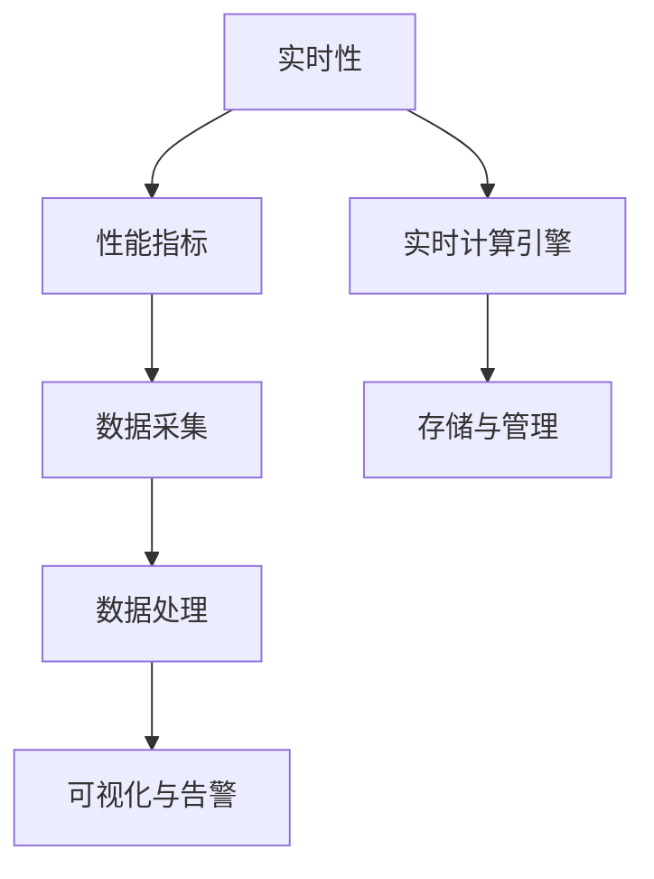

                 

### 文章标题

《实时评测监控：持续跟踪模型性能变化》

**关键词：** 实时评测监控，模型性能跟踪，持续优化，算法应用，实战分析

**摘要：** 本文深入探讨了实时评测监控在人工智能领域的重要性及其应用。通过详细分析实时评测监控的基础知识、架构设计、算法原理及实战案例，本文为读者提供了全面的技术指南，帮助理解和实施有效的模型性能监控与优化策略。文章旨在为AI开发者提供持续跟踪模型性能变化的实用方法和最佳实践，为人工智能系统的稳定运行和持续改进提供有力支持。

### 实时评测监控基础

#### 1.1 实时评测监控的概念与重要性

实时评测监控是指通过建立一套高效的监控系统，对人工智能模型在实际应用场景中的性能进行持续、实时地跟踪和评估。其核心目标是确保模型在长时间运行过程中能够保持高水平的性能，并及时发现并解决潜在的性能问题。

在人工智能应用日益广泛的今天，实时评测监控的重要性不言而喻。首先，实时评测监控能够帮助开发人员及时发现模型性能的异常波动，从而避免因模型退化导致的业务风险。其次，通过持续跟踪模型性能，开发人员可以不断优化模型参数，提高模型的鲁棒性和适应性。此外，实时评测监控还为模型迭代和更新提供了重要的数据支持，有助于实现模型的持续优化和改进。

#### 1.2 模型性能跟踪的关键指标

要有效地进行实时评测监控，必须明确关键性能指标（KPI）。以下是一些常用的模型性能跟踪指标：

1. **准确率（Accuracy）**：模型预测正确的样本数占总样本数的比例，是最基本的评估指标之一。
   
2. **召回率（Recall）**：在所有正类样本中，模型正确识别出的比例，对于平衡正负样本比例的模型特别重要。

3. **精确率（Precision）**：在所有预测为正类的样本中，模型正确识别出的比例，对于分类任务中的假阳性率有重要影响。

4. **F1 分数（F1 Score）**：综合考虑精确率和召回率的综合指标，是平衡二者的常用评估方法。

5. **ROC 曲线和 AUC（Area Under the ROC Curve）**：用于评估分类模型的整体性能，特别是当正负样本不平衡时。

6. **延迟（Latency）**：模型响应时间，对于实时性要求较高的应用至关重要。

7. **资源消耗（Resource Consumption）**：包括计算资源（如 CPU、GPU 使用率）和内存消耗等，确保模型在合理资源范围内运行。

#### 1.3 常见的实时评测监控技术

实时评测监控涉及多个技术环节，以下是一些常见的技术方法：

1. **数据采集**：通过日志收集、API 调用、流处理等方式获取模型输出和实际业务结果。

2. **数据预处理**：清洗和格式化收集到的数据，确保数据质量和一致性。

3. **实时计算引擎**：使用实时计算框架（如 Apache Flink、Apache Storm）进行数据流的实时处理和计算。

4. **存储与管理**：将处理后的数据存储在高效的存储系统（如 Redis、Apache Kafka）中，便于查询和分析。

5. **可视化与告警**：通过可视化工具（如 Grafana、Kibana）实时展示模型性能指标，并设置告警机制。

6. **模型更新与优化**：根据实时评估结果，动态调整模型参数或选择更优的模型架构。

### 实时评测监控的核心概念与联系

为了更好地理解实时评测监控，我们需要明确以下几个核心概念：

- **实时性**：实时评测监控的核心要求，即监控系统能够及时捕捉模型性能的变化。
- **性能指标**：评估模型性能的关键指标，包括准确性、响应时间、资源消耗等。
- **数据采集**：监控系统的数据来源，包括日志、API 调用、流处理等。
- **数据处理**：对采集到的数据进行预处理、存储和计算，确保数据的准确性和一致性。
- **可视化与告警**：通过图表和告警机制，实时展示模型性能指标，以便开发人员及时发现问题。

这些概念之间存在着紧密的联系。实时性是实时评测监控的基础，性能指标是实现实时性的重要手段。数据采集和处理则是获取和利用性能指标的关键环节。而可视化与告警则提供了监控系统的直观展示和实时反馈机制。

为了更直观地展示这些概念之间的关系，我们可以使用 Mermaid 流程图进行说明：



通过这个流程图，我们可以清晰地看到实时评测监控的核心概念及其相互关系，有助于读者更好地理解和掌握相关内容。

### 实时评测监控系统的总体架构

实时评测监控系统的设计需要考虑到系统的整体架构、模块划分、各模块之间的交互关系，以及系统的高效性和可扩展性。以下是一个典型的实时评测监控系统的总体架构设计。

#### 1. 总体架构

实时评测监控系统可以分为以下几个主要模块：

1. **数据采集模块**：负责从各种数据源（如日志文件、API 调用、流处理系统等）中收集模型输出和实际业务结果。
2. **数据处理模块**：对采集到的数据进行分析、预处理和存储，确保数据的质量和一致性。
3. **模型评估模块**：根据预处理后的数据，计算模型的性能指标，如准确率、召回率、精确率等。
4. **存储与管理模块**：将处理后的数据存储在高效的存储系统（如 Redis、Apache Kafka）中，以便后续查询和分析。
5. **可视化与告警模块**：通过可视化工具（如 Grafana、Kibana）实时展示模型性能指标，并设置告警机制。

#### 2. 模块划分

各模块的具体职责如下：

1. **数据采集模块**：
   - **功能**：从不同数据源获取数据，如日志文件、API 调用结果、流处理输出等。
   - **技术**：可以使用日志收集工具（如 Logstash）、API 调用框架（如 Flask、Django）以及流处理系统（如 Apache Flink、Apache Storm）。
   - **交互**：与数据处理模块和模型评估模块进行交互，将采集到的数据传递给后续模块。

2. **数据处理模块**：
   - **功能**：对采集到的数据进行预处理，如数据清洗、格式化、缺失值填补等，并存储在数据库或缓存系统中。
   - **技术**：可以使用 Python 的 Pandas 库进行数据处理，结合数据库（如 MySQL、PostgreSQL）或缓存系统（如 Redis）进行数据存储。
   - **交互**：与数据采集模块和模型评估模块进行交互，处理数据后将其传递给模型评估模块。

3. **模型评估模块**：
   - **功能**：根据预处理后的数据，计算模型的性能指标，如准确率、召回率、精确率等，并将结果存储在可视化系统中。
   - **技术**：可以使用机器学习库（如 Scikit-learn、TensorFlow、PyTorch）进行性能评估，结合数据可视化工具（如 Matplotlib、Seaborn）进行结果展示。
   - **交互**：与数据处理模块和可视化与告警模块进行交互，获取数据并展示评估结果。

4. **存储与管理模块**：
   - **功能**：存储处理后的数据，以便后续的查询和分析，支持高效的读写操作。
   - **技术**：可以使用 NoSQL 数据库（如 Redis、MongoDB）或关系型数据库（如 MySQL、PostgreSQL）。
   - **交互**：与其他模块进行交互，提供数据存储和读取服务。

5. **可视化与告警模块**：
   - **功能**：通过可视化工具实时展示模型性能指标，设置告警机制，当性能指标异常时自动发送告警通知。
   - **技术**：可以使用可视化工具（如 Grafana、Kibana）和告警系统（如 Prometheus、Alertmanager）。
   - **交互**：与模型评估模块进行交互，获取评估结果并进行可视化展示。

#### 3. 模块之间的交互关系

各模块之间的交互关系如下：

- **数据采集模块**：从各个数据源收集数据，传递给数据处理模块。
- **数据处理模块**：对数据采集模块传递来的数据进行预处理，传递给模型评估模块。
- **模型评估模块**：根据预处理后的数据计算性能指标，传递给存储与管理模块和可视化与告警模块。
- **存储与管理模块**：接收模型评估模块传递来的性能指标数据，进行存储和管理。
- **可视化与告警模块**：根据存储与管理模块传递来的数据，进行可视化展示和告警通知。

通过上述模块的划分和交互关系设计，实时评测监控系统可以实现高效、稳定和可扩展的模型性能监控，为人工智能系统的稳定运行和持续优化提供有力支持。

### 数据采集模块的设计与实现

数据采集模块是实时评测监控系统的核心组成部分，其设计与实现的质量直接影响到整个系统的性能和稳定性。以下将详细阐述数据采集模块的设计原则、关键技术和实现步骤。

#### 1. 设计原则

在数据采集模块的设计过程中，我们需要遵循以下几个原则：

1. **高可靠性**：数据采集模块需要保证数据采集的稳定性和可靠性，避免因网络波动或系统故障导致数据丢失。
2. **高实时性**：数据采集模块需要能够及时获取模型输出和实际业务结果，确保监控系统能够实时反映模型性能。
3. **可扩展性**：数据采集模块的设计应考虑未来的扩展需求，以便能够支持多种数据源和数据类型。
4. **高效性**：数据采集模块应优化数据传输和存储过程，减少系统开销，提高数据采集的效率。

#### 2. 关键技术

数据采集模块涉及的关键技术包括：

1. **日志收集**：通过日志收集工具（如 Logstash）从服务器日志中提取有用信息。
2. **API 调用**：使用 API 调用框架（如 Flask、Django）从外部系统获取数据。
3. **流处理**：利用流处理系统（如 Apache Flink、Apache Storm）实时处理和传输数据流。
4. **数据清洗**：对采集到的数据进行预处理，如数据去重、格式化、缺失值填补等。

#### 3. 实现步骤

以下是数据采集模块的实现步骤：

1. **需求分析**：根据实时评测监控系统的需求，明确需要采集的数据类型和数据源。
2. **设计数据采集方案**：确定数据采集模块的架构和关键技术，如日志收集、API 调用、流处理等。
3. **开发数据采集脚本**：
   - **日志收集**：使用 Logstash 收集服务器日志，并配置相应的过滤器和输出插件，将日志数据传输到 Kafka 集群。
   - **API 调用**：使用 Flask 框架开发 API 接口，接收外部系统的调用请求，并将结果数据传输到 Kafka。
   - **流处理**：使用 Apache Flink 构建实时流处理任务，从 Kafka 集群中读取数据，进行预处理后存储到数据库中。
4. **部署与测试**：将数据采集模块部署到生产环境，并进行测试，确保数据采集的稳定性和实时性。
5. **性能优化**：根据测试结果，对数据采集模块进行性能优化，如调整日志收集频率、优化流处理任务等。

#### 4. 示例代码

以下是一个简单的 Python 脚本示例，用于从服务器日志中提取数据并存储到 Kafka 集群：

```python
import os
import json
from kafka import KafkaProducer

# Kafka 服务器配置
kafka_servers = ['kafka1:9092', 'kafka2:9092']
topic = 'realtime_monitoring'

# 初始化 Kafka producer
producer = KafkaProducer(bootstrap_servers=kafka_servers)

# 读取服务器日志文件
log_file_path = '/var/log/apache2/access.log'
with open(log_file_path, 'r') as log_file:
    for line in log_file:
        # 提取日志信息
        log_data = {
            'timestamp': line.split()[3],
            'remote_addr': line.split()[0],
            'status_code': line.split()[8],
            'request_time': line.split()[9],
            'response_size': line.split()[9]
        }
        # 发送日志数据到 Kafka
        producer.send(topic, json.dumps(log_data).encode('utf-8'))

# 关闭 Kafka producer
producer.close()
```

通过上述代码示例，我们可以看到如何从服务器日志中提取数据，并使用 Kafka Producer 发送数据到 Kafka 集群。在实际应用中，可以根据具体需求对数据采集脚本进行扩展和优化。

#### 5. 总结

数据采集模块的设计与实现是实时评测监控系统的重要环节，它负责从各种数据源获取模型输出和实际业务结果。通过遵循高可靠性、高实时性、可扩展性和高效性等设计原则，并运用日志收集、API 调用和流处理等关键技术，我们可以构建一个高效、稳定和可扩展的数据采集模块，为实时评测监控系统的稳定运行提供有力支持。

### 模型评估模块的设计与实现

模型评估模块是实时评测监控系统的核心组成部分，其设计与实现的质量直接影响到实时评测监控的效果。以下将详细阐述模型评估模块的设计原则、关键技术和实现步骤。

#### 1. 设计原则

在模型评估模块的设计过程中，需要遵循以下原则：

1. **准确性**：确保评估结果的准确性，避免因评估误差导致监控失真。
2. **实时性**：评估过程应具备高实时性，确保模型性能问题能够被及时发现。
3. **高效性**：评估算法应优化性能，减少计算资源消耗。
4. **灵活性**：评估模块应支持多种评估指标和模型类型，便于应对不同的应用场景。

#### 2. 关键技术

模型评估模块涉及的关键技术包括：

1. **评估指标计算**：根据模型类型和任务需求，选择合适的评估指标（如准确率、召回率、F1 分数等）进行计算。
2. **实时计算引擎**：利用实时计算框架（如 Apache Flink、Apache Storm）进行高效的数据处理和评估计算。
3. **结果存储与查询**：将评估结果存储在高效存储系统（如 Redis、MongoDB），并实现快速查询功能。

#### 3. 实现步骤

以下是模型评估模块的实现步骤：

1. **需求分析**：根据实时评测监控系统的需求，明确需要评估的模型类型、任务和数据集。
2. **设计评估方案**：确定模型评估模块的架构和关键技术，如评估指标计算、实时计算引擎、结果存储与查询等。
3. **开发评估脚本**：
   - **评估指标计算**：根据模型类型和任务需求，编写计算评估指标的脚本，如准确率、召回率、F1 分数等。
   - **实时计算引擎**：使用实时计算框架（如 Apache Flink、Apache Storm）构建实时评估任务，处理数据流并进行评估计算。
   - **结果存储与查询**：将评估结果存储在 Redis 或 MongoDB 等高效存储系统中，并实现快速查询功能。
4. **部署与测试**：将模型评估模块部署到生产环境，并进行测试，确保评估结果的准确性和实时性。
5. **性能优化**：根据测试结果，对模型评估模块进行性能优化，如调整计算任务配置、优化数据存储策略等。

#### 4. 示例代码

以下是一个简单的 Python 脚本示例，用于计算模型的准确率：

```python
import numpy as np

def calculate_accuracy(y_true, y_pred):
    """
    计算准确率
    :param y_true: 真实标签
    :param y_pred: 预测标签
    :return: 准确率
    """
    return np.mean(y_true == y_pred)

# 示例数据
y_true = np.array([0, 1, 1, 0])
y_pred = np.array([1, 1, 0, 0])

# 计算准确率
accuracy = calculate_accuracy(y_true, y_pred)
print(f"准确率：{accuracy}")
```

通过上述代码示例，我们可以看到如何计算模型的准确率。在实际应用中，可以根据具体需求对评估脚本进行扩展和优化。

#### 5. 总结

模型评估模块的设计与实现是实时评测监控系统的关键环节，它负责计算模型在不同任务上的性能指标，为监控系统的实时性提供有力保障。通过遵循准确性、实时性、高效性和灵活性等设计原则，并运用评估指标计算、实时计算引擎和结果存储与查询等关键技术，我们可以构建一个高效、稳定和灵活的模型评估模块，为实时评测监控系统的稳定运行和持续优化提供有力支持。

### 实时评测监控算法原理

实时评测监控算法是确保模型性能持续优化的关键。其核心目的是通过实时计算和评估，识别模型的性能变化，从而进行相应的调整和优化。以下是几种常见的实时评测监控算法及其原理。

#### 1. 实时性能评估算法

实时性能评估算法主要基于模型预测结果和实际业务结果进行性能评估。以下是一种基于准确率的实时性能评估算法的伪代码：

```python
function real_time_evaluation(model, data):
    for each sample in data:
        predict = model.predict(sample)
        true_label = sample.label
        accuracy = calculate_accuracy(predict, true_label)
    return average_accuracy
```

在这个算法中，`model.predict(sample)`用于获取模型的预测结果，`sample.label`获取实际的业务结果，`calculate_accuracy(predict, true_label)`用于计算准确率，最后返回平均准确率作为模型的当前性能指标。

#### 2. 动态阈值调整算法

动态阈值调整算法主要用于分类任务，通过实时调整分类阈值来优化模型的性能。以下是一个简单的动态阈值调整算法的伪代码：

```python
function dynamic_threshold_adjustment(data, initial_threshold):
    best_threshold = initial_threshold
    best_accuracy = real_time_evaluation(model, data, threshold=best_threshold)
    for threshold in range(initial_threshold, 1, -0.01):
        current_accuracy = real_time_evaluation(model, data, threshold=threshold)
        if current_accuracy > best_accuracy:
            best_accuracy = current_accuracy
            best_threshold = threshold
    return best_threshold
```

在这个算法中，`real_time_evaluation(model, data, threshold=threshold)`用于计算不同阈值下的准确率，`best_threshold`和`best_accuracy`分别记录最优的阈值和对应的准确率。

#### 3. 基于误差反馈的在线学习算法

基于误差反馈的在线学习算法通过不断更新模型参数，以适应新的数据分布。以下是一个简单的基于误差反馈的在线学习算法的伪代码：

```python
function online_learning(model, data, learning_rate):
    for each sample in data:
        predict = model.predict(sample)
        true_label = sample.label
        error = true_label - predict
        model.update_parameters(learning_rate * error)
    return updated_model
```

在这个算法中，`model.predict(sample)`用于获取模型的预测结果，`true_label - predict`计算预测误差，`model.update_parameters(learning_rate * error)`用于更新模型参数。

#### 4. 基于置信区间的性能评估算法

基于置信区间的性能评估算法通过计算模型性能的置信区间，来评估模型的稳定性。以下是一个简单的基于置信区间的性能评估算法的伪代码：

```python
function confidence_interval_evaluation(model, data, confidence_level):
    results = [real_time_evaluation(model, data) for _ in range(num_samples)]
    lower_bound = np.percentile(results, (100 - confidence_level) / 2)
    upper_bound = np.percentile(results, 100 + confidence_level / 2)
    return lower_bound, upper_bound
```

在这个算法中，`real_time_evaluation(model, data)`用于计算模型在不同样本下的性能指标，`np.percentile(results, (100 - confidence_level) / 2)`和`np.percentile(results, 100 + confidence_level / 2)`用于计算置信区间的上下界。

#### 5. 总结

实时评测监控算法通过实时评估和动态调整，确保模型在长时间运行过程中能够保持高水平的性能。常见的实时评测监控算法包括实时性能评估算法、动态阈值调整算法、基于误差反馈的在线学习算法和基于置信区间的性能评估算法等。通过合理选择和应用这些算法，我们可以构建一个高效、稳定的实时评测监控体系，为人工智能模型的持续优化提供有力支持。

### 实时评测监控算法实现

在了解实时评测监控算法的原理之后，接下来我们将详细探讨这些算法的实现过程，包括数据预处理、算法的具体实现步骤和代码示例。

#### 1. 数据预处理

数据预处理是实时评测监控算法实现的基础，其主要任务是对原始数据进行清洗、格式化等处理，确保数据的质量和一致性。以下是一个数据预处理的基本流程：

1. **数据清洗**：去除数据中的噪声和异常值，如缺失值、重复值等。
2. **数据格式化**：将数据统一格式，如将字符串转化为数值类型、将时间戳格式化等。
3. **特征提取**：根据任务需求提取有用的特征，如文本分类中的词频、词嵌入等。

以下是一个简单的数据预处理代码示例：

```python
import pandas as pd
from sklearn.preprocessing import StandardScaler

# 加载数据
data = pd.read_csv('data.csv')

# 数据清洗
data.dropna(inplace=True)
data.drop_duplicates(inplace=True)

# 数据格式化
data['timestamp'] = pd.to_datetime(data['timestamp'])
data['feature1'] = data['feature1'].astype(float)
data['feature2'] = data['feature2'].astype(float)

# 特征提取
scaler = StandardScaler()
data[['feature1', 'feature2']] = scaler.fit_transform(data[['feature1', 'feature2']])
```

#### 2. 算法实现步骤

实时评测监控算法的实现通常包括以下几个步骤：

1. **初始化模型参数**：根据任务需求初始化模型参数。
2. **数据处理**：对预处理后的数据进行处理，如分批次读取、序列化等。
3. **实时计算**：根据实时评测监控算法的原理，进行实时计算和评估。
4. **结果存储**：将实时评估结果存储到数据库或缓存系统中，以便后续查询和分析。

以下是一个基于实时性能评估算法的实现步骤示例：

```python
import numpy as np
import pandas as pd
from sklearn.model_selection import train_test_split
from sklearn.metrics import accuracy_score

# 加载训练数据
train_data = pd.read_csv('train_data.csv')
test_data = pd.read_csv('test_data.csv')

# 数据预处理
# ...

# 初始化模型
model = MyModel()

# 训练模型
model.fit(train_data)

# 实时评估
predictions = model.predict(test_data)
accuracy = accuracy_score(test_data['label'], predictions)
print(f"准确率：{accuracy}")

# 结果存储
result = {'accuracy': accuracy}
pd.DataFrame(result).T.to_csv('result.csv', index=False)
```

#### 3. 代码示例

以下是几个常见的实时评测监控算法的具体代码示例。

##### 1. 实时性能评估算法

```python
def real_time_evaluation(model, data):
    predictions = model.predict(data)
    accuracy = accuracy_score(data['label'], predictions)
    return accuracy
```

##### 2. 动态阈值调整算法

```python
def dynamic_threshold_adjustment(data, initial_threshold=0.5, step=0.01):
    best_threshold = initial_threshold
    best_accuracy = real_time_evaluation(model, data, threshold=best_threshold)
    for threshold in np.arange(initial_threshold, 0.0, -step):
        current_accuracy = real_time_evaluation(model, data, threshold=threshold)
        if current_accuracy > best_accuracy:
            best_accuracy = current_accuracy
            best_threshold = threshold
    return best_threshold
```

##### 3. 基于误差反馈的在线学习算法

```python
def online_learning(model, data, learning_rate=0.01):
    for sample in data:
        predict = model.predict(sample)
        error = sample['label'] - predict
        model.update_parameters(learning_rate * error)
    return model
```

##### 4. 基于置信区间的性能评估算法

```python
def confidence_interval_evaluation(model, data, confidence_level=0.95, num_samples=100):
    results = []
    for _ in range(num_samples):
        accuracy = real_time_evaluation(model, data)
        results.append(accuracy)
    lower_bound = np.percentile(results, (100 - confidence_level) / 2)
    upper_bound = np.percentile(results, 100 + confidence_level / 2)
    return lower_bound, upper_bound
```

通过上述代码示例，我们可以看到如何实现常见的实时评测监控算法。在实际应用中，可以根据具体需求对算法进行定制和优化。

### 实时评测监控在业务场景中的应用

实时评测监控在业务场景中的应用非常广泛，它可以用于各种任务，如搜索引擎、金融风控和医疗健康等。以下将分别介绍实时评测监控在这些领域的应用案例。

#### 搜索引擎中的应用

在搜索引擎中，实时评测监控主要用于跟踪搜索结果的准确性、响应时间和资源消耗等关键指标。通过实时监控，开发人员可以及时发现搜索算法的性能问题，并进行相应的优化。

**案例一：搜索结果准确性监控**

假设我们有一个搜索引擎，其搜索结果准确性是用户满意度的重要指标。我们可以通过以下步骤进行实时监控：

1. **数据采集**：从搜索引擎日志中提取用户查询和搜索结果，并将数据发送到 Kafka 集群。
2. **数据处理**：对采集到的数据进行预处理，如提取关键词、用户 ID 等，并存储到 Redis 缓存中。
3. **模型评估**：使用分类模型对搜索结果进行评估，计算准确率等指标。
4. **可视化与告警**：通过 Grafana 可视化工具实时展示搜索结果的准确率，并设置告警机制，当准确率低于预设阈值时发送告警通知。

以下是一个简单的代码示例：

```python
# 实时监控搜索结果准确性
import json
from kafka import KafkaProducer

kafka_servers = ['kafka1:9092', 'kafka2:9092']
topic = 'search_results'

producer = KafkaProducer(bootstrap_servers=kafka_servers)

# 从日志文件中读取数据
with open('search_logs.json', 'r') as f:
    logs = json.load(f)

# 遍历日志数据，发送到 Kafka
for log in logs:
    producer.send(topic, json.dumps(log).encode('utf-8'))

# 关闭 Kafka producer
producer.close()

# 数据处理和模型评估
# ...

# 可视化与告警
# ...
```

**案例二：响应时间监控**

除了准确性，响应时间也是搜索引擎的重要指标。我们可以在搜索引擎的后端服务器中部署实时监控工具，如 Prometheus，来监控服务器的响应时间。

以下是一个 Prometheus 监控服务器的示例配置：

```yaml
# prometheus.yml
scrape_configs:
  - job_name: 'search_server'
    static_configs:
      - targets: ['search_server:9090']
    metrics_path: '/metrics'
    scrape_interval: 15s
```

通过 Prometheus，我们可以实时监控服务器的响应时间，并设置告警规则，当响应时间超过预设阈值时发送告警通知。

#### 金融风控中的应用

在金融风控领域，实时评测监控主要用于跟踪欺诈检测模型、信用评分模型等的性能。通过实时监控，金融机构可以及时发现模型性能问题，并采取相应的措施。

**案例一：欺诈检测模型监控**

假设我们有一个欺诈检测模型，其准确性和召回率是关键指标。我们可以通过以下步骤进行实时监控：

1. **数据采集**：从交易系统中提取交易数据，并将数据发送到 Kafka 集群。
2. **数据处理**：对采集到的交易数据进行预处理，如提取特征、标签化等，并存储到 Redis 缓存中。
3. **模型评估**：使用欺诈检测模型对交易数据进行分析，计算准确率和召回率等指标。
4. **可视化与告警**：通过 Grafana 可视化工具实时展示欺诈检测模型的性能指标，并设置告警机制，当性能指标低于预设阈值时发送告警通知。

以下是一个简单的代码示例：

```python
# 实时监控欺诈检测模型性能
import json
from kafka import KafkaProducer

kafka_servers = ['kafka1:9092', 'kafka2:9092']
topic = 'transaction_data'

producer = KafkaProducer(bootstrap_servers=kafka_servers)

# 从交易系统中读取数据
with open('transaction_logs.json', 'r') as f:
    logs = json.load(f)

# 遍历日志数据，发送到 Kafka
for log in logs:
    producer.send(topic, json.dumps(log).encode('utf-8'))

# 关闭 Kafka producer
producer.close()

# 数据处理和模型评估
# ...

# 可视化与告警
# ...
```

**案例二：信用评分模型监控**

在信用评分领域，实时评测监控主要用于跟踪信用评分模型的准确性和稳定性。以下是一个简单的监控配置示例：

```yaml
# prometheus.yml
scrape_configs:
  - job_name: 'credit_scoring_model'
    static_configs:
      - targets: ['credit_server:9090']
    metrics_path: '/metrics'
    scrape_interval: 30s
```

通过 Prometheus，我们可以实时监控信用评分模型的性能指标，如准确率、召回率等，并设置告警规则，当模型性能低于预设阈值时发送告警通知。

#### 医疗健康领域中的应用

在医疗健康领域，实时评测监控主要用于跟踪医学图像分析模型、疾病预测模型等的性能。通过实时监控，医疗机构可以及时发现模型性能问题，并采取相应的措施。

**案例一：医学图像分析模型监控**

假设我们有一个医学图像分析模型，其准确率和响应时间是关键指标。我们可以通过以下步骤进行实时监控：

1. **数据采集**：从医学图像系统中提取图像数据，并将数据发送到 Kafka 集群。
2. **数据处理**：对采集到的图像数据进行预处理，如图像增强、分割等，并存储到 Redis 缓存中。
3. **模型评估**：使用医学图像分析模型对图像数据进行分析，计算准确率和响应时间等指标。
4. **可视化与告警**：通过 Grafana 可视化工具实时展示医学图像分析模型的性能指标，并设置告警机制，当性能指标低于预设阈值时发送告警通知。

以下是一个简单的代码示例：

```python
# 实时监控医学图像分析模型性能
import json
from kafka import KafkaProducer

kafka_servers = ['kafka1:9092', 'kafka2:9092']
topic = 'medical_images'

producer = KafkaProducer(bootstrap_servers=kafka_servers)

# 从医学图像系统中读取数据
with open('medical_images_logs.json', 'r') as f:
    logs = json.load(f)

# 遍历日志数据，发送到 Kafka
for log in logs:
    producer.send(topic, json.dumps(log).encode('utf-8'))

# 关闭 Kafka producer
producer.close()

# 数据处理和模型评估
# ...

# 可视化与告警
# ...
```

**案例二：疾病预测模型监控**

在疾病预测领域，实时评测监控主要用于跟踪疾病预测模型的准确性和稳定性。以下是一个简单的监控配置示例：

```yaml
# prometheus.yml
scrape_configs:
  - job_name: 'disease_prediction_model'
    static_configs:
      - targets: ['disease_server:9090']
    metrics_path: '/metrics'
    scrape_interval: 60s
```

通过 Prometheus，我们可以实时监控疾病预测模型的性能指标，如准确率、召回率等，并设置告警规则，当模型性能低于预设阈值时发送告警通知。

通过以上案例，我们可以看到实时评测监控在搜索引擎、金融风控和医疗健康等领域的广泛应用。实时评测监控不仅能够帮助开发人员及时发现模型性能问题，还能为业务运营提供重要的数据支持，从而提高系统的稳定性和用户满意度。

### 持续跟踪的挑战与解决方案

在实时评测监控系统中，持续跟踪模型性能变化是一个复杂且具有挑战性的任务。以下是几个常见的挑战以及相应的解决方案。

#### 1. 数据一致性和准确性

**挑战**：由于实时评测监控系统需要处理大量的实时数据，数据的一致性和准确性是确保监控结果可靠性的关键挑战。

**解决方案**：
- **数据清洗**：在数据处理过程中，采用有效的数据清洗方法，如去重、去噪等，以确保数据的一致性。
- **数据校验**：在数据采集和传输过程中，添加数据校验机制，如校验和、哈希值等，确保数据在传输过程中不被篡改。
- **实时验证**：利用交叉验证等技术，对实时数据进行验证，确保数据质量。

#### 2. 系统性能和可扩展性

**挑战**：实时评测监控系统需要处理大量的实时数据，同时保持系统的性能和可扩展性是一个重要挑战。

**解决方案**：
- **分布式架构**：采用分布式架构，如基于 Kafka 和 Flink 的流处理系统，提高系统的处理能力和可扩展性。
- **批量处理**：将大量实时数据批量处理，降低系统负载，提高处理效率。
- **资源优化**：合理配置系统资源，如 CPU、内存、存储等，确保系统在高负载情况下仍能保持高性能。

#### 3. 模型更新和版本管理

**挑战**：随着业务的不断发展和用户需求的变化，模型需要不断更新和迭代。如何管理不同版本的模型，以及确保新版本模型的性能稳定性，是一个挑战。

**解决方案**：
- **版本控制**：采用版本控制系统，如 Git，管理模型的版本，确保模型更新过程的可追溯性和可控性。
- **自动化测试**：在模型更新后，进行自动化测试，确保新版本模型在不同场景下的性能表现符合预期。
- **灰度发布**：采用灰度发布策略，逐步推广新版本模型，确保模型更新过程平稳、可控。

#### 4. 系统安全性和隐私保护

**挑战**：实时评测监控系统中涉及大量的敏感数据，如何确保系统的安全性和用户隐私保护是一个重要挑战。

**解决方案**：
- **数据加密**：对传输和存储的数据进行加密处理，如使用 TLS/SSL 加密协议。
- **访问控制**：采用严格的访问控制机制，如角色权限管理，确保只有授权用户才能访问系统数据。
- **审计日志**：记录系统操作日志，如用户访问日志、数据操作日志等，以便在出现问题时进行审计和追踪。

#### 5. 异常检测和告警

**挑战**：在实时评测监控过程中，如何快速检测和响应异常情况，如数据异常、模型性能异常等，是一个挑战。

**解决方案**：
- **异常检测算法**：采用异常检测算法，如基于统计的异常检测、基于机器学习的异常检测等，实时监测系统中的异常情况。
- **自动化告警**：当检测到异常时，自动生成告警通知，并通过邮件、短信、微信等方式发送给相关人员，确保及时响应。
- **可视化展示**：通过可视化工具，如 Grafana、Kibana 等，将异常情况实时展示，帮助开发人员快速定位和解决问题。

通过上述解决方案，我们可以有效应对实时评测监控系统中的各种挑战，确保系统能够持续、稳定地运行，为模型的性能优化和业务决策提供可靠的数据支持。

### 模型性能优化的策略与实践

优化模型性能是人工智能领域的一项重要任务。通过有效的策略和实践，我们可以显著提高模型的准确性、鲁棒性和效率。以下将介绍几种常用的模型性能优化策略和实践方法。

#### 1. 超参数调优

超参数调优是提升模型性能的关键步骤。通过调整模型超参数，可以优化模型的性能表现。以下是一些常用的超参数调优策略：

- **网格搜索**：在给定的超参数范围内，遍历所有可能的组合，找到最优的超参数组合。
- **随机搜索**：随机选择超参数组合进行评估，以减少计算量。
- **贝叶斯优化**：利用贝叶斯统计模型，根据先验知识和历史评估结果，选择下一步搜索的方向。

以下是一个基于网格搜索的超参数调优的示例代码：

```python
from sklearn.model_selection import GridSearchCV
from sklearn.ensemble import RandomForestClassifier

# 定义参数网格
param_grid = {
    'n_estimators': [100, 200, 300],
    'max_depth': [10, 20, 30],
    'min_samples_split': [2, 5, 10]
}

# 创建随机森林分类器
rf = RandomForestClassifier()

# 进行网格搜索
grid_search = GridSearchCV(estimator=rf, param_grid=param_grid, cv=5, scoring='accuracy')
grid_search.fit(X_train, y_train)

# 输出最优参数
print(f"最优参数：{grid_search.best_params_}")
```

#### 2. 特征选择

特征选择是减少模型复杂度、提高模型性能的重要手段。以下是一些常用的特征选择方法：

- **过滤式特征选择**：基于特征的重要性和相关性，过滤掉不相关的特征。
- **包裹式特征选择**：结合模型训练过程，逐步选择出最优特征组合。
- **嵌入式特征选择**：在模型训练过程中，自动评估和选择特征。

以下是一个基于过滤式特征选择的示例代码：

```python
from sklearn.feature_selection import SelectKBest, f_classif

# 创建特征选择器
selector = SelectKBest(score_func=f_classif, k=10)

# 对训练数据进行特征选择
X_new = selector.fit_transform(X_train, y_train)

# 输出选择的特征数量
print(f"选择的特征数量：{selector.get_support().sum()}")
```

#### 3. 模型集成

模型集成是通过组合多个模型来提高模型性能的一种有效方法。以下是一些常用的模型集成方法：

- **Bagging**：通过多次训练和组合多个模型，减少模型的方差。
- **Boosting**：通过关注错误分类的样本，逐步调整模型权重，提高模型的准确性。
- **Stacking**：通过将多个模型作为基模型，再训练一个模型来整合这些基模型的预测结果。

以下是一个基于 Bagging 的模型集成的示例代码：

```python
from sklearn.ensemble import BaggingClassifier
from sklearn.datasets import make_classification

# 创建训练数据
X, y = make_classification(n_samples=1000, n_features=20, n_informative=2, n_redundant=10, random_state=42)

# 创建基模型
base_model = RandomForestClassifier()

# 创建 Bagging 集成模型
bagging_model = BaggingClassifier(base_estimator=base_model, n_estimators=10, random_state=42)

# 训练模型
bagging_model.fit(X, y)

# 进行预测
predictions = bagging_model.predict(X_test)
```

#### 4. 模型剪枝和量化

模型剪枝和量化是减少模型复杂度和提高模型效率的有效方法。以下是一些常用的模型剪枝和量化方法：

- **剪枝**：通过删除网络中不重要的层或节点，减少模型参数数量。
- **量化**：将模型中的浮点数参数转换为较低精度的整数，降低模型存储和计算需求。

以下是一个基于剪枝和量化的示例代码：

```python
from tensorflow_model_optimization.sparsity import keras as sparsity

# 定义模型
model = keras.Sequential([
    keras.layers.Dense(128, activation='relu', input_shape=(input_shape)),
    keras.layers.Dense(64, activation='relu'),
    keras.layers.Dense(1, activation='sigmoid')
])

# 剪枝模型
pruned_model = sparsity.prune_low_magnitude(model)

# 量化模型
quantized_model = sparsity.quantize_model(model, quantize_scheme='min_max', range_min=-1, range_max=1)
```

通过上述策略和实践，我们可以有效提升模型性能，为人工智能应用提供更加稳定和高效的模型。

### 未来发展趋势与展望

实时评测监控作为人工智能领域的一项关键技术，其发展正随着技术的进步和应用的拓展而不断深化。以下是未来实时评测监控的发展趋势与展望：

#### 1. 智能化的监控与优化

随着机器学习和深度学习技术的不断进步，实时评测监控将更加智能化。未来的监控系统将具备自动识别异常、自动调整模型参数和自动优化策略的能力。通过引入强化学习、迁移学习等先进算法，监控系统将能够根据历史数据和实时反馈，自适应地调整监控策略，实现更精准、更高效的性能监控。

#### 2. 边缘计算的融合

随着边缘计算技术的发展，实时评测监控将进一步融合到边缘设备中。这将使得模型性能监控能够在数据产生的源头进行，减少数据传输延迟，提高实时性。同时，边缘设备处理能力的提升，将使得实时评测监控系统能够处理更加复杂的数据，提供更加细粒度的监控能力。

#### 3. 联合监控与协作优化

未来的实时评测监控将不再是孤立的系统，而是与其他监控系统（如安全监控、性能监控等）进行联合监控。通过多源数据的融合和协作优化，实时评测监控将能够提供更全面的系统性能评估，帮助开发人员和运维人员更好地理解系统状态，快速定位和解决问题。

#### 4. 自适应的监控策略

随着业务场景的多样化，实时评测监控策略也需要更加灵活和自适应。未来的监控系统将能够根据不同的业务需求，动态调整监控指标、监控频率和告警阈值，实现更加精细化的监控。例如，对于关键业务系统，监控系统可以提供更细粒度的监控和更高的监控频率，确保系统在高负荷情况下仍能稳定运行。

#### 5. 开放生态的构建

实时评测监控的发展将依赖于开放生态的构建。未来，将出现更多开源工具和平台，支持开发者轻松构建、部署和扩展实时评测监控系统。此外，实时评测监控工具将更加集成化，支持多种数据源、多种模型和多种监控场景的统一管理，提供一站式的解决方案。

#### 6. 隐私保护与数据安全

随着数据隐私保护法规的日益严格，实时评测监控在数据采集、处理和存储过程中将面临更高的安全挑战。未来的监控系统将更加注重数据安全和隐私保护，采用加密技术、访问控制策略和审计机制，确保监控数据的安全性和合规性。

总之，实时评测监控作为人工智能领域的关键技术，其未来发展将更加智能化、多样化、协作化、灵活化和安全化。通过不断引入新技术、优化策略和构建开放生态，实时评测监控将更好地支持人工智能系统的稳定运行和持续优化，为各行业的数字化转型提供强有力的技术支撑。

### 最佳实践 Tips

在进行实时评测监控时，以下最佳实践有助于确保系统的稳定性和高效性：

1. **数据一致性检查**：在数据采集和传输过程中，定期进行数据一致性检查，确保数据的准确性和完整性。
2. **多源数据融合**：结合多种数据源，如日志、API 调用和流处理数据，提供更全面的监控视角。
3. **定制化监控指标**：根据业务需求，自定义监控指标，如延迟、资源消耗等，提高监控的针对性。
4. **自动化告警**：设置自动化告警规则，当监控指标超过阈值时，及时通知相关人员进行干预。
5. **监控结果可视化**：使用可视化工具，如 Grafana、Kibana 等，将监控结果进行可视化展示，便于快速定位和解决问题。
6. **定期优化**：定期对实时评测监控系统进行性能优化，包括算法调优、系统升级等，确保系统的高效运行。

通过遵循这些最佳实践，开发人员可以构建一个高效、稳定和灵活的实时评测监控系统，为人工智能模型的性能优化提供有力支持。

### 小结

本文系统地介绍了实时评测监控在人工智能领域的重要性及其应用。首先，我们探讨了实时评测监控的基础知识，包括实时评测监控的概念、模型性能跟踪的关键指标和常见技术。接着，我们详细阐述了实时评测监控系统的总体架构、数据采集模块的设计与实现、模型评估模块的设计与实现，以及实时评测监控算法的原理与实现。随后，我们通过具体案例展示了实时评测监控在搜索引擎、金融风控和医疗健康等领域的应用。此外，我们还讨论了持续跟踪的挑战与解决方案，以及模型性能优化的策略与实践。最后，我们展望了实时评测监控的未来发展趋势，并提供了最佳实践 Tips。

通过本文的介绍，读者可以全面了解实时评测监控的核心概念、技术实现和实际应用，为构建高效、稳定的实时评测监控系统提供指导。同时，本文也希望能激发读者对实时评测监控领域的深入研究和探索，为人工智能领域的持续创新贡献力量。

### 注意事项

在构建实时评测监控系统时，需要注意以下几点：

1. **数据安全**：确保监控过程中涉及的数据安全，采用加密技术、访问控制策略和审计机制，防止数据泄露。
2. **系统性能**：优化系统性能，确保监控系统能够处理大量数据，并保持低延迟和高吞吐量。
3. **告警策略**：合理设置告警规则和阈值，避免频繁误报或漏报，确保告警系统能够及时响应性能问题。
4. **监控扩展性**：设计可扩展的监控架构，以应对未来业务增长和系统规模扩展。
5. **日志记录**：详细记录监控系统的操作日志，便于问题追踪和系统调试。

通过关注这些注意事项，开发人员可以构建一个高效、安全、稳定的实时评测监控系统。

### 拓展阅读

为了更深入地了解实时评测监控及相关技术，读者可以参考以下拓展阅读资源：

1. **《实时数据流处理技术》**：详细介绍了实时数据流处理的基本概念、技术和工具，如 Apache Kafka、Apache Flink、Apache Storm 等。
2. **《机器学习性能优化》**：探讨了机器学习性能优化的一系列策略，包括超参数调优、特征选择和模型集成等。
3. **《深度学习实践》**：介绍了深度学习的基本原理和实践方法，涵盖了从数据预处理到模型训练的各个环节。
4. **《边缘计算：技术、应用与挑战》**：探讨了边缘计算的基本概念、技术架构和应用场景，包括边缘设备、网络和云端的协同工作。
5. **《人工智能监控与运维》**：介绍了人工智能系统的监控与运维实践，包括实时性能监控、故障检测和自动化修复等。

通过阅读这些资源，读者可以进一步拓展对实时评测监控及相关技术的理解，为实际应用提供更多灵感和实践指导。

