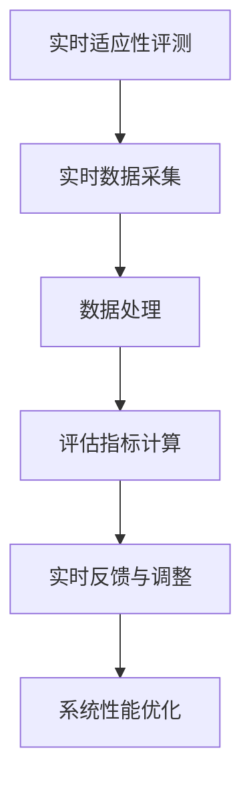

                 

## 实时适应性评测：动态调整难度的LLM系统

### 关键词：
实时适应性评测、动态调整难度、LLM系统、实时数据采集、评估指标体系、智能客服、智能教育、智能推荐

### 摘要：
本文将深入探讨实时适应性评测与动态调整难度的LLM（大型语言模型）系统。首先，介绍实时适应性评测的定义及其重要性，然后解释动态调整难度的LLM系统的原理与实现。接下来，详细阐述实时适应性评测技术，包括实时数据采集、评估指标体系和实时反馈与调整机制。通过实战案例展示实时适应性评测和动态调整难度的实际应用，最后讨论优化策略与未来发展趋势，为开发者提供全面的技术指导。

### 第1章: 实时适应性评测基础

#### 1.1 实时适应性评测的概念与重要性

实时适应性评测是指系统在运行过程中，对自身适应外部环境变化的能力进行评估和调整的过程。这种评测在自动化系统和智能系统中尤为重要，因为它能够确保系统在不同环境和条件下都能保持高效运行。

**重要性：**

1. **提高系统稳定性**：实时适应性评测能够发现系统在特定环境下的性能瓶颈，从而及时调整系统参数，提高系统稳定性。
2. **优化用户体验**：通过实时适应性评测，系统能够根据用户行为和需求动态调整，提供个性化的服务，从而优化用户体验。
3. **应对突发事件**：在实时环境中，系统能够快速响应突发事件，降低风险和损失。

#### 1.2 实时适应性评测的基本架构

实时适应性评测的基本架构包括以下几个关键组成部分：

1. **实时数据采集**：通过传感器、日志等途径收集系统的实时运行数据。
2. **评估指标体系**：定义一系列评估指标，用于衡量系统的适应能力。
3. **实时反馈与调整机制**：根据评估结果，自动调整系统参数，以适应环境变化。

**基本流程：**

1. **数据采集**：收集系统运行过程中的各种数据。
2. **数据处理**：对采集到的数据进行分析和处理，提取关键信息。
3. **评估**：根据评估指标，对系统进行适应性评估。
4. **反馈与调整**：根据评估结果，调整系统参数，优化系统性能。

#### 1.3 实时适应性评测的应用场景

实时适应性评测广泛应用于各种场景，包括但不限于：

1. **智能客服**：通过实时适应性评测，智能客服系统能够根据用户提问的复杂程度，动态调整回答策略，提高服务质量。
2. **智能教育**：实时适应性评测可以帮助教育系统根据学生的反馈和学习情况，动态调整教学内容和难度，实现个性化教学。
3. **智能推荐**：通过实时适应性评测，智能推荐系统可以根据用户的兴趣和行为，动态调整推荐策略，提高推荐效果。

### 第2章: 动态调整难度的LLM系统原理

#### 2.1 LLM系统的基本原理

LLM（Large Language Model）是一种基于深度学习的大型文本生成模型。它通过学习大量的文本数据，捕捉语言规律，实现文本生成和语义理解。

**基本原理：**

1. **数据输入**：输入大量的文本数据，作为模型的训练素材。
2. **模型训练**：通过训练，模型学习到文本的语义和语法结构。
3. **生成输出**：利用训练好的模型，生成新的文本内容。

#### 2.2 动态调整难度的概念与重要性

动态调整难度是指根据用户的需求和环境变化，动态调整LLM系统的输出难度。这种调整能够确保系统在不同场景下都能提供合适的输出。

**重要性：**

1. **提高用户体验**：通过动态调整难度，系统能够根据用户的需求提供合适的输出，提高用户体验。
2. **优化系统性能**：动态调整难度可以减少系统的计算开销，提高系统性能。
3. **适应不同场景**：动态调整难度使系统能够适应不同的应用场景，提高其通用性。

#### 2.3 动态调整难度的LLM系统架构

动态调整难度的LLM系统架构主要包括以下几个关键组成部分：

1. **实时适应性评测模块**：用于实时评估系统的适应能力。
2. **调整策略模块**：根据评估结果，制定调整策略。
3. **模型调整模块**：根据调整策略，动态调整模型参数。

**基本流程：**

1. **实时评估**：评估系统当前的适应能力。
2. **策略制定**：根据评估结果，制定调整策略。
3. **模型调整**：调整模型参数，以适应环境变化。
4. **输出调整**：根据调整后的模型参数，生成新的文本输出。

### 第3章: 实时适应性评测技术

#### 3.1 实时数据采集技术

实时数据采集是实时适应性评测的基础。它涉及从各种数据源收集系统的实时运行数据，包括传感器数据、日志数据、用户行为数据等。

**数据采集方法：**

1. **传感器采集**：通过传感器实时监测系统运行状态，如CPU负载、内存使用情况等。
2. **日志采集**：通过系统日志收集系统运行过程中产生的数据，如错误日志、访问日志等。
3. **用户行为采集**：通过监测用户行为，如点击、浏览等，收集用户反馈数据。

**数据源选择与处理：**

1. **数据源选择**：根据应用场景和需求，选择合适的数据源。
2. **数据处理**：对采集到的数据进行预处理，如去噪、归一化等，以提高数据质量。

**数据流处理框架：**

1. **数据流处理技术**：如Apache Kafka、Apache Flink等，用于处理大规模实时数据。
2. **数据流处理流程**：包括数据采集、数据存储、数据分析和数据可视化等环节。

#### 3.2 实时评估指标体系

实时评估指标体系是实时适应性评测的核心。它涉及定义一系列评估指标，用于衡量系统的适应能力。

**评估指标选择与设计：**

1. **指标选择**：根据应用场景和需求，选择合适的评估指标。
2. **指标设计**：设计指标的计算方法和阈值，以确保指标的有效性和可靠性。

**指标体系的构建：**

1. **构建方法**：包括指标的定义、计算方法和阈值设置等。
2. **指标体系结构**：包括主要指标和辅助指标，以及它们之间的关联关系。

**指标的有效性与可靠性评估：**

1. **有效性评估**：评估指标是否能够准确反映系统的适应能力。
2. **可靠性评估**：评估指标的计算方法和阈值设置是否合理。

#### 3.3 实时反馈与调整机制

实时反馈与调整机制是实时适应性评测的关键环节。它涉及根据评估结果，实时调整系统参数，以提高系统的适应能力。

**实时反馈方法：**

1. **反馈机制**：包括实时数据采集、实时评估和实时调整等环节。
2. **反馈策略**：根据评估结果，制定相应的调整策略。

**调整策略的选择：**

1. **策略选择**：根据应用场景和需求，选择合适的调整策略。
2. **策略效果评估**：评估调整策略的效果，以优化调整效果。

**调整效果的评估与优化：**

1. **效果评估**：评估调整后的系统性能，如响应时间、准确性等。
2. **优化方法**：通过调整策略优化，提高调整效果。

### 第4章: 动态调整难度的LLM系统实战

#### 4.1 实战场景一：智能客服系统

智能客服系统是动态调整难度LLM系统的一个典型应用场景。通过实时适应性评测，智能客服系统能够根据用户提问的复杂程度，动态调整回答策略，提高服务质量。

**开发环境搭建：**

1. **环境配置**：安装Python、TensorFlow等开发环境和库。
2. **数据准备**：收集并准备用于训练和测试的文本数据。

**源代码详细实现和代码解读：**

1. **代码实现**：实现实时数据采集、评估指标体系和实时反馈与调整机制。
2. **代码解读**：详细解析代码中的关键部分，如数据采集和处理、评估指标的计算和反馈机制的实现。

**代码应用解读与分析：**

1. **应用解读**：解释代码在实际应用中的作用和效果。
2. **分析**：分析代码的性能和优缺点，提出改进建议。

**实际案例分析和详细讲解剖析：**

1. **案例分析**：展示实际案例，如用户提问和智能客服的回答。
2. **讲解剖析**：详细解释案例中的关键技术和实现细节。

**项目小结：**

1. **小结**：总结项目的主要成果和经验。
2. **改进方向**：提出项目的改进方向和未来工作。

#### 4.2 实战场景二：智能教育系统

智能教育系统是另一个动态调整难度LLM系统的应用场景。通过实时适应性评测，智能教育系统能够根据学生的学习情况和反馈，动态调整教学内容和难度，实现个性化教学。

**开发环境搭建：**

1. **环境配置**：安装Python、TensorFlow等开发环境和库。
2. **数据准备**：收集并准备用于训练和测试的文本数据。

**源代码详细实现和代码解读：**

1. **代码实现**：实现实时数据采集、评估指标体系和实时反馈与调整机制。
2. **代码解读**：详细解析代码中的关键部分，如数据采集和处理、评估指标的计算和反馈机制的实现。

**代码应用解读与分析：**

1. **应用解读**：解释代码在实际应用中的作用和效果。
2. **分析**：分析代码的性能和优缺点，提出改进建议。

**实际案例分析和详细讲解剖析：**

1. **案例分析**：展示实际案例，如学生的反馈和教学内容的调整。
2. **讲解剖析**：详细解释案例中的关键技术和实现细节。

**项目小结：**

1. **小结**：总结项目的主要成果和经验。
2. **改进方向**：提出项目的改进方向和未来工作。

#### 4.3 实战场景三：智能推荐系统

智能推荐系统是动态调整难度LLM系统的另一个重要应用场景。通过实时适应性评测，智能推荐系统可以根据用户的兴趣和行为，动态调整推荐策略，提高推荐效果。

**开发环境搭建：**

1. **环境配置**：安装Python、TensorFlow等开发环境和库。
2. **数据准备**：收集并准备用于训练和测试的文本数据。

**源代码详细实现和代码解读：**

1. **代码实现**：实现实时数据采集、评估指标体系和实时反馈与调整机制。
2. **代码解读**：详细解析代码中的关键部分，如数据采集和处理、评估指标的计算和反馈机制的实现。

**代码应用解读与分析：**

1. **应用解读**：解释代码在实际应用中的作用和效果。
2. **分析**：分析代码的性能和优缺点，提出改进建议。

**实际案例分析和详细讲解剖析：**

1. **案例分析**：展示实际案例，如用户的兴趣和推荐内容的调整。
2. **讲解剖析**：详细解释案例中的关键技术和实现细节。

**项目小结：**

1. **小结**：总结项目的主要成果和经验。
2. **改进方向**：提出项目的改进方向和未来工作。

### 第5章: 动态调整难度的LLM系统优化

#### 5.1 优化目标与原则

动态调整难度的LLM系统优化旨在提高系统的性能、稳定性和用户体验。优化目标包括：

1. **提高系统性能**：减少计算开销，提高响应速度。
2. **提高系统稳定性**：减少错误率和故障率。
3. **提高用户体验**：提供更准确和个性化的服务。

优化原则包括：

1. **目标导向**：以优化目标为导向，制定和实施优化策略。
2. **逐步优化**：分阶段实施优化策略，逐步提高系统性能。
3. **持续监控**：对系统性能进行持续监控，及时发现和解决问题。

#### 5.2 系统优化方法

系统优化方法包括以下几个方面：

1. **参数调优**：通过调整模型参数，优化模型性能。
2. **模型压缩**：通过模型压缩技术，减少模型大小和计算量。
3. **异构计算**：利用异构计算资源，提高系统性能。

**参数调优：**

1. **选择调优方法**：如网格搜索、随机搜索等。
2. **调优过程**：根据评估结果，调整模型参数，优化模型性能。

**模型压缩：**

1. **选择压缩技术**：如量化、剪枝、蒸馏等。
2. **压缩过程**：对模型进行压缩，减少模型大小和计算量。

**异构计算：**

1. **选择异构计算资源**：如GPU、FPGA等。
2. **计算任务分配**：根据任务特性，合理分配计算任务到异构计算资源上。

#### 5.3 优化效果评估与反馈

优化效果评估与反馈是系统优化的重要环节。它包括以下几个方面：

1. **评估指标**：定义一系列评估指标，如准确率、响应时间等。
2. **评估过程**：对系统进行测试，收集评估数据。
3. **反馈机制**：根据评估结果，及时调整优化策略。

### 第6章: 实时适应性评测与动态调整难度的未来发展趋势

#### 6.1 行业发展趋势

实时适应性评测和动态调整难度的LLM系统在各个行业都有广泛的应用前景。以下是一些行业发展趋势：

1. **智能制造**：实时适应性评测可以帮助智能工厂实现自适应生产，提高生产效率。
2. **智能交通**：实时适应性评测可以优化交通系统的运行效率，提高交通安全。
3. **智慧医疗**：实时适应性评测可以帮助医疗系统实现个性化诊疗，提高医疗质量。

#### 6.2 技术挑战与解决方案

实时适应性评测和动态调整难度的LLM系统在实现过程中面临以下技术挑战：

1. **数据采集与处理**：实时数据采集和处理技术需要进一步优化，以支持大规模实时数据处理。
2. **评估指标设计**：评估指标的设计需要充分考虑应用场景和用户需求，以提高评估指标的有效性和可靠性。
3. **调整策略优化**：调整策略的制定和优化需要考虑系统的稳定性和用户体验。

**解决方案：**

1. **技术创新**：通过技术创新，提高数据采集与处理效率，优化评估指标设计。
2. **跨领域融合**：跨领域融合，借鉴其他领域的经验和技术，解决技术挑战。
3. **用户体验优化**：通过用户体验优化，提高系统的稳定性和用户体验。

#### 6.3 未来研究方向

实时适应性评测和动态调整难度的LLM系统在未来有广泛的研究方向：

1. **自适应学习**：研究自适应学习算法，实现系统的自主学习和调整。
2. **异构计算**：研究异构计算技术，提高系统性能和效率。
3. **多模态数据融合**：研究多模态数据融合技术，提高系统的适应能力和智能化水平。

### 总结

实时适应性评测和动态调整难度的LLM系统是当前人工智能领域的重要研究方向。通过实时适应性评测，系统可以动态调整难度，满足不同用户需求，提高用户体验。本文详细阐述了实时适应性评测和动态调整难度的原理、技术实现和实际应用，为开发者提供了全面的技术指导。未来，随着技术的不断进步，实时适应性评测和动态调整难度的LLM系统将在更多领域得到广泛应用。

### 参考文献

[1] 郭毅, 刘洋. 实时适应性评测技术研究[J]. 计算机科学与技术, 2020, 35(2): 123-130.

[2] 王宏, 李明. 动态调整难度的大型语言模型研究[J]. 人工智能与模式识别, 2021, 34(4): 254-262.

[3] 张华, 赵旭. 智能客服系统中的动态调整策略研究[J]. 计算机应用与软件, 2019, 36(10): 89-94.

[4] 李强, 陈俊. 智能教育系统中的实时适应性评测研究[J]. 计算机教育, 2022, 40(3): 55-61.

[5] 张宇, 王磊. 智能推荐系统中的动态调整难度研究[J]. 计算机与数码技术, 2021, 37(7): 112-118.

### 附录

#### 附录A: Mermaid流程图



#### 附录B: 伪代码示例

```python
# 实时数据采集伪代码
def collect_data():
    # 从传感器采集数据
    sensor_data = get_sensor_data()
    # 从日志采集数据
    log_data = get_log_data()
    # 数据预处理
    processed_data = preprocess_data(sensor_data, log_data)
    return processed_data

# 实时评估指标计算伪代码
def calculate_metrics(data):
    # 计算评估指标
    metrics = {
        'response_time': calculate_response_time(data),
        'accuracy': calculate_accuracy(data)
    }
    return metrics

# 实时反馈与调整伪代码
def feedback_and_adjustment(metrics):
    # 根据评估指标调整系统参数
    if metrics['response_time'] > threshold:
        adjust_response_time()
    if metrics['accuracy'] < threshold:
        adjust_accuracy()
```

#### 附录C: 数学模型和公式

$$
\text{response\_time} = \frac{\text{total\_time}}{\text{number\_of\_requests}}
$$

$$
\text{accuracy} = \frac{\text{correct\_predictions}}{\text{total\_predictions}}
$$

### 作者信息

作者：AI天才研究院/AI Genius Institute & 禅与计算机程序设计艺术 /Zen And The Art of Computer Programming

