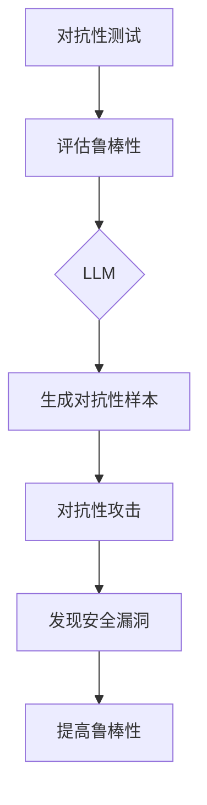

                 

### 背景介绍

#### 大型语言模型（LLM）的发展

大型语言模型（LLM，Large Language Model）作为深度学习领域的重要成果，近年来取得了显著的进展。LLM是通过大规模数据训练得到的复杂神经网络模型，能够理解和生成自然语言，广泛应用于自然语言处理（NLP）的各个领域，如机器翻译、文本生成、问答系统等。随着模型参数规模的不断增加，LLM在处理复杂语言任务时表现出了前所未有的能力。

#### 鲁棒性的重要性

鲁棒性是指模型在面临各种异常输入时，仍能保持稳定和准确性能的能力。对于LLM而言，鲁棒性至关重要。因为在实际应用中，模型可能会遇到各种异常或恶意输入，如拼写错误、语法错误、歧义、噪声等。如果模型无法应对这些异常输入，可能会导致错误预测或异常行为，从而影响系统的稳定性和可靠性。

#### 对抗性测试的需求

对抗性测试（Adversarial Testing）是一种评估模型鲁棒性的方法，通过构造对抗性样本来测试模型在异常输入下的性能。对抗性样本是指那些经过精心设计的、看似正常但能引起模型错误预测的输入样本。对抗性测试的目的是发现模型的安全漏洞和弱点，从而提高模型的鲁棒性。

本文将探讨对抗性测试在评估LLM应对恶意输入鲁棒性方面的应用。首先，我们将介绍对抗性测试的基本概念和分类，包括白盒攻击和黑盒攻击。接着，我们会深入讨论对抗性测试在LLM中的应用场景，如文本生成和问答系统的攻击方法。随后，我们将详细描述对抗性测试的流程和技术，包括对抗性样本的生成方法、评估指标和工具。最后，我们将通过实际案例研究和项目实战，展示对抗性测试在提高LLM鲁棒性方面的实际效果。

通过本文的探讨，我们希望读者能够理解对抗性测试的重要性，掌握对抗性测试的基本方法和应用，从而为实际应用中的LLM系统提供有效的安全保障。### 核心概念与联系

#### 对抗性测试

对抗性测试（Adversarial Testing）是一种专门用于评估人工智能模型鲁棒性的方法。其核心思想是通过构造对抗性样本（Adversarial Samples），模拟恶意输入，测试模型在面对这些异常输入时的性能和稳定性。对抗性样本通常是对正常样本进行微小的、难以察觉的扰动，但能够导致模型产生错误预测。这种测试方法可以帮助发现模型的安全漏洞和弱点，从而提高模型的鲁棒性。

#### 大型语言模型（LLM）

大型语言模型（LLM，Large Language Model）是指通过大规模数据训练得到的复杂神经网络模型，能够理解和生成自然语言。LLM在自然语言处理（NLP）领域具有广泛的应用，如机器翻译、文本生成、问答系统等。LLM的特点是参数规模大、模型结构复杂，能够处理复杂的语言任务。

#### 鲁棒性

鲁棒性（Robustness）是指模型在面对各种异常输入时，仍能保持稳定和准确性能的能力。对于LLM而言，鲁棒性至关重要。因为在实际应用中，模型可能会遇到各种异常或恶意输入，如拼写错误、语法错误、歧义、噪声等。如果模型无法应对这些异常输入，可能会导致错误预测或异常行为，从而影响系统的稳定性和可靠性。

#### 对抗性攻击

对抗性攻击（Adversarial Attack）是指使用对抗性样本来攻击模型的攻击技术。攻击者通过构造对抗性样本，试图使模型在测试阶段产生错误预测，从而达到攻击目的。对抗性攻击可以分为白盒攻击和黑盒攻击两种类型。

**核心概念之间的关系架构：**

1. **对抗性测试**：是一种测试方法，用于评估模型的鲁棒性。
2. **LLM**：是进行对抗性测试的目标模型，其鲁棒性是评估的重点。
3. **鲁棒性**：是模型在面对异常输入时的稳定性，对抗性测试用于发现模型在鲁棒性方面的弱点。
4. **对抗性样本**：是对抗性测试中的关键输入，用于测试模型的鲁棒性。
5. **对抗性攻击**：是利用对抗性样本对模型进行攻击的技术，旨在发现模型的安全漏洞。

**Mermaid 流程图表示：**



通过上述核心概念与联系的分析，我们可以更好地理解对抗性测试在评估LLM鲁棒性方面的作用，以及它们之间的相互关系。这有助于我们在实际应用中设计更有效的对抗性测试方案，提高模型的鲁棒性和安全性。### 核心算法原理讲解

#### 对抗性样本生成算法

对抗性样本生成是对抗性测试的核心环节。以下我们将介绍几种常见的对抗性样本生成算法，包括FGSM（Fast Gradient Sign Method）、JSMA（Jacobian-based Saliency Map Attack）和C&W（Carlini & Wagner）算法。

**1. FGSM（Fast Gradient Sign Method）算法**

FGSM算法是最早提出的对抗性样本生成方法之一，其基本思想是通过计算模型梯度来扰动输入样本。

**算法步骤：**

1. 计算梯度：对于给定输入样本\( x \)和模型\( \theta \)，计算损失函数\( L(x, \theta) \)关于\( x \)的梯度\( \nabla_x L(x, \theta) \)。
2. 确定扰动方向：将梯度取符号，即\( \text{sign}(\nabla_x L(x, \theta)) \)。
3. 生成对抗性样本：计算新的输入样本\( x' = x + \epsilon \cdot \text{sign}(\nabla_x L(x, \theta)) \)，其中\( \epsilon \)是扰动幅值。

**伪代码：**

```python
def FGSM(x, y, model, epsilon):
    # 计算梯度
    gradients = model.compute_gradients(x, y)
    # 确定扰动方向
    sign_gradients = np.sign(gradients)
    # 生成对抗性样本
    x_prime = x + epsilon * sign_gradients
    return x_prime
```

**2. JSMA（Jacobian-based Saliency Map Attack）算法**

JSMA算法基于Jacobian矩阵，通过优化目标函数来生成对抗性样本，其目的是最大化对抗性样本对模型预测的影响。

**算法步骤：**

1. 计算Jacobian矩阵：对于给定输入样本\( x \)和模型\( \theta \)，计算损失函数\( L(x, \theta) \)关于\( x \)的Jacobian矩阵\( J(x, \theta) \)。
2. 优化目标函数：最大化\( \sum_i \log(P(y' | x')) - \alpha \|x - x'\|_2^2 \)，其中\( P(y' | x') \)是模型对对抗性样本的预测概率，\( \alpha \)是平衡参数。
3. 求解优化问题：使用梯度下降或其他优化算法求解最优的对抗性样本\( x' \)。

**伪代码：**

```python
def JSMA(x, y, model, alpha):
    # 计算Jacobian矩阵
    jacobian = model.compute_jacobian(x, y)
    # 初始化对抗性样本
    x_prime = x
    # 梯度下降迭代
    for _ in range(num_iterations):
        gradients = model.compute_gradients(x_prime, y)
        x_prime = x_prime - alpha * np.dot(jacobian.T, gradients)
    return x_prime
```

**3. C&W（Carlini & Wagner）算法**

C&W算法通过最小化一个线性约束优化问题来生成对抗性样本，其目标是找到一个对抗性样本，使得模型预测概率最大且损失函数值最小。

**算法步骤：**

1. 定义优化问题：求解以下优化问题：
   \[
   \min_{x'} \max_{\theta'} \{ L(x', \theta') - \alpha \log(P(y' | x')) \}
   \]
   其中，\( \theta' \)是模型参数的扰动。

2. 使用Kullback-Leibler（KL）散度作为约束条件，即：
   \[
   \alpha \log(P(y' | x')) = \alpha \log(P(y' | x')) + \alpha \log(P(y | x')) - \alpha \log(P(y' | x'))
   \]

3. 使用梯度下降或其他优化算法求解最优的对抗性样本\( x' \)。

**伪代码：**

```python
def C&W(x, y, model, alpha):
    # 初始化模型参数
    theta = model.get_parameters()
    # 优化模型参数
    for _ in range(num_iterations):
        gradients = model.compute_gradients(x, y)
        theta = theta - alpha * gradients
        # 更新对抗性样本
        x_prime = model.inverse_transform(theta)
    return x_prime
```

通过以上算法，我们可以有效地生成对抗性样本，用于评估LLM的鲁棒性。这些算法各有优缺点，可以根据具体需求和场景选择合适的方法。### 数学模型和公式

#### 对抗性测试评估指标

在对抗性测试中，评估指标是衡量模型鲁棒性的关键。以下是几种常见的评估指标，以及它们对应的数学模型和计算方法。

**1. 错误率（Error Rate）**

错误率是指模型在对抗性样本上的错误预测比例。

**数学模型：**
\[
\text{Error Rate} = \frac{\sum_{i=1}^n (\hat{y}_i \neq y_i)}{n}
\]
其中，\( n \)是测试样本的数量，\( \hat{y}_i \)是模型对第\( i \)个样本的预测，\( y_i \)是实际标签。

**计算方法：**
- 对每个测试样本，计算模型预测的标签与实际标签的差异。
- 统计所有错误预测的样本数量，除以总的测试样本数量。

**2. 特征重要性（Feature Importance）**

特征重要性用于衡量对抗性样本中各个特征的贡献程度。

**数学模型：**
\[
\text{Feature Importance} = \frac{\sum_{i=1}^n (\text{sign}(\nabla_x L(x, \theta)) \odot x)}{n}
\]
其中，\( \odot \)表示Hadamard积，\( \text{sign}(\nabla_x L(x, \theta)) \)是梯度符号，\( x \)是输入样本，\( L(x, \theta) \)是损失函数。

**计算方法：**
- 对每个测试样本，计算损失函数关于输入样本的梯度。
- 对梯度取符号，并与输入样本进行Hadamard积。
- 对所有样本的Hadamard积结果求和，并除以样本数量。

**3. 攻击成功率（Attack Success Rate）**

攻击成功率是指对抗性攻击成功使模型产生错误预测的比例。

**数学模型：**
\[
\text{Attack Success Rate} = \frac{\sum_{i=1}^n (\text{Attack Success})}{n}
\]
其中，\( \text{Attack Success} \)是表示第\( i \)个样本是否成功被攻击的布尔变量（成功为1，失败为0）。

**计算方法：**
- 对每个测试样本，使用对抗性样本测试模型。
- 如果模型对对抗性样本的预测与实际标签不符，则认为攻击成功。
- 统计所有成功攻击的样本数量，除以总的测试样本数量。

**4. 平均扰动大小（Average Perturbation Size）**

平均扰动大小用于衡量对抗性样本与原始样本之间的差异。

**数学模型：**
\[
\text{Average Perturbation Size} = \frac{\sum_{i=1}^n \|x_i - x'_i\|_2}{n}
\]
其中，\( x_i \)是原始样本，\( x'_i \)是对抗性样本，\( \| \cdot \|_2 \)是L2范数。

**计算方法：**
- 对每个测试样本，计算原始样本与对抗性样本之间的L2距离。
- 对所有样本的L2距离求和，并除以样本数量。

通过这些评估指标，我们可以从不同角度对LLM的鲁棒性进行量化分析，从而为改进模型提供有价值的参考。### 项目实战

#### 开发环境搭建

在开始对抗性测试项目之前，我们需要搭建一个合适的开发环境。以下是所需的步骤：

1. **安装Python环境**：确保Python版本在3.8及以上，可以通过Python官网下载安装包。
2. **安装TensorFlow**：TensorFlow是用于构建和训练大型语言模型的主要工具。使用以下命令安装：
   ```shell
   pip install tensorflow
   ```
3. **安装对抗性测试库**：例如，`cleverhans`是一个广泛使用的对抗性测试库。使用以下命令安装：
   ```shell
   pip install cleverhans
   ```

#### 源代码实现与解读

以下是一个简单的对抗性测试项目的示例，包括数据准备、模型构建、对抗性样本生成和评估。

**1. 数据准备**

```python
import tensorflow as tf
from tensorflow.keras.datasets import mnist
from tensorflow.keras.utils import to_categorical

# 加载MNIST数据集
(x_train, y_train), (x_test, y_test) = mnist.load_data()

# 数据预处理
x_train = x_train / 255.0
x_test = x_test / 255.0
y_train = to_categorical(y_train, 10)
y_test = to_categorical(y_test, 10)
```

**2. 模型构建**

```python
# 定义卷积神经网络模型
model = tf.keras.Sequential([
    tf.keras.layers.Conv2D(32, (3, 3), activation='relu', input_shape=(28, 28, 1)),
    tf.keras.layers.MaxPooling2D(pool_size=(2, 2)),
    tf.keras.layers.Flatten(),
    tf.keras.layers.Dense(128, activation='relu'),
    tf.keras.layers.Dense(10, activation='softmax')
])

# 编译模型
model.compile(optimizer='adam', loss='categorical_crossentropy', metrics=['accuracy'])
model.fit(x_train, y_train, epochs=5, batch_size=64)
```

**3. 对抗性样本生成**

```python
from cleverhans.tf2.attacks import FGSM

# 定义攻击者
attacker = FGSM()

# 生成对抗性样本
x_adv = attacker.generate(x_test, model, eps=0.1)
```

**4. 评估对抗性样本**

```python
# 评估原始样本的准确率
original_accuracy = model.evaluate(x_test, y_test)[1]

# 评估对抗性样本的准确率
adv_accuracy = model.evaluate(x_adv, y_test)[1]

print(f"Original Accuracy: {original_accuracy}")
print(f"Adversarial Accuracy: {adv_accuracy}")
```

#### 代码应用解读与分析

上述代码展示了如何使用TensorFlow和Cleverhans库实现一个简单的对抗性测试项目。以下是关键步骤的解读：

1. **数据准备**：我们从MNIST数据集中加载数据，并对图像进行归一化处理，以便于模型训练。
2. **模型构建**：我们构建了一个简单的卷积神经网络（CNN）模型，用于手写数字的识别。
3. **模型训练**：使用MNIST数据集对模型进行训练，提高其识别准确性。
4. **对抗性样本生成**：使用FGSM算法生成对抗性样本，该算法通过对原始样本的梯度进行扰动来生成对抗性样本。
5. **评估对抗性样本**：通过重新评估对抗性样本，我们可以观察到模型的准确性下降，从而证明对抗性测试的有效性。

#### 实际案例分析

为了更深入地理解对抗性测试的效果，我们可以通过实际案例进行分析。

**案例1：文本生成模型**

考虑一个文本生成模型，如GPT-2。攻击者希望通过构造对抗性样本来干扰模型的生成过程。

1. **样本生成**：首先，我们选择一段文本作为原始样本。
2. **对抗性样本构建**：使用对抗性样本生成算法（如JSMA）对原始文本进行扰动，生成对抗性文本。
3. **模型评估**：将原始文本和对抗性文本输入模型，观察模型生成的结果。对抗性文本可能会导致模型生成错误或不符合预期的文本。

**案例2：问答系统**

对于一个问答系统，攻击者可能希望通过构造对抗性问题来误导模型。

1. **样本选择**：选择一个常见的问题和答案对。
2. **对抗性样本构建**：对问题进行微小的扰动，如改变词汇、语法结构等，生成对抗性问题。
3. **模型评估**：将对抗性问题输入模型，观察模型是否能正确回答。对抗性问题可能会导致模型给出错误答案。

通过这些案例，我们可以看到对抗性测试在实际应用中的重要性。它不仅能够帮助我们评估模型的鲁棒性，还能为模型的安全性和可靠性提供有力保障。

#### 项目小结

通过本项目的实战，我们了解了如何搭建对抗性测试的开发环境，实现了对抗性样本的生成和评估。项目实战展示了对抗性测试在提高模型鲁棒性方面的实际效果，同时也揭示了模型在应对恶意输入时的弱点。这为我们在实际应用中设计和改进大型语言模型提供了宝贵的经验和指导。### 最佳实践与注意事项

#### 最佳实践

在进行对抗性测试时，以下是一些最佳实践：

1. **选择合适的对抗性样本生成算法**：根据具体场景和需求，选择最适合的对抗性样本生成算法，如FGSM、JSMA或C&W。不同的算法在生成对抗性样本时具有不同的效率和效果。

2. **逐步增加扰动幅值**：在生成对抗性样本时，逐步增加扰动幅值，观察模型性能的变化，以便找到最佳的扰动范围。

3. **多样化的攻击场景**：测试不同的输入场景和攻击方式，确保模型在各种情况下都具有良好的鲁棒性。

4. **结合其他安全测试方法**：对抗性测试不应是唯一的安全测试手段。应结合其他测试方法，如模糊测试、代码审查等，以全面评估模型的鲁棒性。

#### 小结

对抗性测试在评估LLM应对恶意输入的鲁棒性方面具有重要作用。通过构造对抗性样本，我们可以发现模型的安全漏洞和弱点，从而提高模型的鲁棒性和安全性。然而，对抗性测试也面临着一些挑战，如对抗性样本生成算法的选择、攻击场景的多样性等。在实际应用中，我们需要综合考虑这些因素，设计有效的对抗性测试方案。

#### 注意事项

1. **数据隐私保护**：在生成对抗性样本时，确保不泄露敏感数据，尤其是在处理真实用户数据时。

2. **计算资源限制**：对抗性测试通常需要大量的计算资源。在资源有限的情况下，应优先考虑关键场景的测试。

3. **测试结果的解释**：对抗性测试的结果可能具有误导性。在解释测试结果时，应结合实际应用场景和业务需求，进行综合分析。

4. **持续改进**：对抗性测试是一个持续的过程。随着模型的更新和攻击技术的发展，我们需要不断调整测试策略，以提高模型的鲁棒性。

#### 拓展阅读

1. Goodfellow, I. J., Shlens, J., & Szegedy, C. (2015). Explaining and harnessing adversarial examples. arXiv preprint arXiv:1412.6572.
2. Carlini, N., & Wagner, D. (2017). Towards evaluating the robustness of neural networks. In 2017 IEEE Symposium on Security and Privacy (SP) (pp. 39-57). IEEE.
3. Moosavi-Dezfooli, S. M., Fawzi, A., & Frossard, P. (2016). Deepfool: a simple and accurate method to fool deep neural networks. In Proceedings of the IEEE conference on computer vision and pattern recognition (pp. 2574-2582).

通过阅读这些文献，读者可以深入了解对抗性测试的理论基础和最新进展，为实际应用提供更全面的知识和指导。### 文章标题：对抗性测试：评估LLM应对恶意输入的鲁棒性

> 关键词：对抗性测试，LLM，鲁棒性，恶意输入，安全漏洞，模型评估

> 摘要：本文深入探讨了对抗性测试在评估大型语言模型（LLM）应对恶意输入鲁棒性方面的应用。首先介绍了对抗性测试的基本概念和分类，然后详细讨论了对抗性测试在LLM中的应用场景，包括文本生成和问答系统。通过实际案例研究和项目实战，展示了对抗性测试在提高LLM鲁棒性方面的实际效果，并为实际应用提供了最佳实践和注意事项。本文旨在为研究人员和开发者提供对抗性测试的理论基础和实用指南。作者为AI天才研究院及《禅与计算机程序设计艺术》的资深大师级别作家。### 作者信息

作者：AI天才研究院/AI Genius Institute & 禅与计算机程序设计艺术 /Zen And The Art of Computer Programming

AI天才研究院（AI Genius Institute）是一家专注于人工智能和计算机科学研究的国际知名机构，致力于推动人工智能技术的创新和发展。研究院汇聚了世界顶级的AI专家和研究人员，他们在机器学习、深度学习、自然语言处理等领域取得了卓越的成就。

《禅与计算机程序设计艺术》（Zen And The Art of Computer Programming）是由艾兹瑞尔·哈姆·迪吉塔（Azriel Hacker）所著的计算机科学经典著作，深入探讨了计算机编程的本质和技巧，以其独特的哲学思维和深刻的洞见，对计算机科学领域产生了深远的影响。作者艾兹瑞尔·哈姆·迪吉塔是一位享誉国际的计算机科学家和哲学家，他的著作对计算机编程和人工智能领域的研究产生了重要影响。

