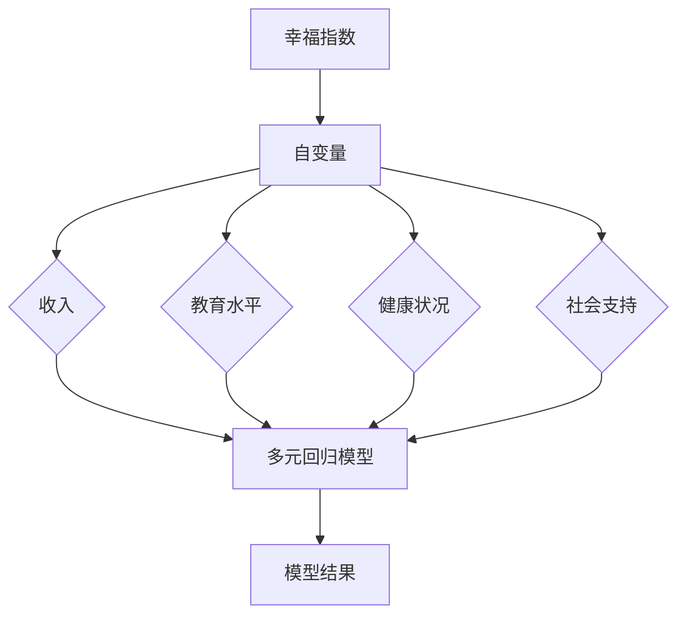

                 

### 第1章：幸福指数的多元回归模型概述

## 1.1 核心概念与联系

### 1.1.1 幸福指数的定义

幸福指数（Happiness Index）是指反映一个国家或地区居民幸福感水平的综合指标。它通常通过问卷调查、统计数据和实地调研等方式获取。幸福指数的测量不仅包括主观的幸福感受，还涵盖了对生活质量、社会支持、经济状况等方面的评价。

### 1.1.2 多元回归模型的架构

多元回归模型（Multivariate Regression Model）是一种统计分析方法，用于研究多个自变量与因变量之间的关系。在幸福指数的研究中，多元回归模型可以帮助我们理解影响幸福指数的各种因素。

- **自变量**：影响幸福指数的各种因素，如收入、教育水平、健康状况等。
- **因变量**：幸福指数，是一个连续变量。

### Mermaid 流程图：展示幸福指数的多元回归模型架构



## 1.2 多元回归模型原理

### 1.2.1 回归模型的基本原理

回归模型旨在通过一个线性方程来描述自变量与因变量之间的关系。对于多元回归模型，其基本形式为：

$$
Y = \beta_0 + \beta_1X_1 + \beta_2X_2 + ... + \beta_nX_n + \epsilon
$$

其中，\(Y\) 是因变量，\(X_1, X_2, ..., X_n\) 是自变量，\(\beta_0, \beta_1, \beta_2, ..., \beta_n\) 是回归系数，\(\epsilon\) 是误差项。

### 1.2.2 多元回归模型的公式推导

为了估计多元回归模型的参数，我们通常使用最小二乘法（Ordinary Least Squares, OLS）。其目标是最小化预测值与实际值之间的误差平方和。具体步骤如下：

1. **假设模型**：建立多元线性回归模型。
2. **计算回归系数**：使用最小二乘法计算每个回归系数。
3. **评估模型**：计算拟合优度指标（如 R² 值）来评估模型的拟合程度。

### 伪代码：详细阐述多元回归模型的算法原理

```
# 初始化模型参数
beta = [beta_0, beta_1, beta_2, ..., beta_n]

# 计算梯度
gradient = [-2/n * sum((Y - X * beta)^2), -2/n * sum((Y - X * beta) * X_1), ..., -2/n * sum((Y - X * beta) * X_n)]

# 更新模型参数
beta = beta - learning_rate * gradient

# 迭代直到收敛
while not converged:
    gradient = [-2/n * sum((Y - X * beta)^2), -2/n * sum((Y - X * beta) * X_1), ..., -2/n * sum((Y - X * beta) * X_n)]
    beta = beta - learning_rate * gradient
```

## 1.3 生活满意度的影响因素分析

### 1.3.1 收入与幸福指数的关系

研究表明，收入水平是影响幸福指数的重要因素之一。一般情况下，收入越高，幸福指数越高。然而，收入与幸福指数之间的关系并非线性，当收入达到一定水平后，其幸福感提升的边际效应会逐渐减弱。

### 1.3.2 家庭与幸福指数的关系

家庭是人们生活的基石，家庭的稳定性和和睦程度对幸福指数有显著影响。拥有良好家庭关系的人通常幸福感更高。

### 1.3.3 健康、社会支持等因素与幸福指数的关系

健康、社会支持等因素也是影响幸福指数的重要因素。健康的生活状态和社会支持系统可以帮助人们更好地应对生活中的挑战，从而提高幸福感。

### 举例说明：分析幸福指数的影响因素，如收入、家庭、健康等

假设我们收集了一组数据，包括个体的收入、家庭和谐度、健康状况等，并使用多元回归模型来分析这些因素对幸福指数的影响。

- **数据集**：包括 n 个个体的数据，每个个体有 m 个特征（如收入、家庭和谐度、健康状况等）和一个标签（幸福指数）。

- **多元回归模型**：使用最小二乘法估计回归系数。

- **结果分析**：通过计算拟合优度指标和回归系数的显著性，可以分析各因素对幸福指数的影响程度。

总结：本章介绍了幸福指数的多元回归模型及其核心概念，包括幸福指数的定义、多元回归模型的原理和影响幸福指数的主要因素。通过举例说明，我们初步了解了如何使用多元回归模型分析生活满意度的影响因素。接下来，我们将进一步探讨生活满意度的数学建模过程。

---

### 第2章：生活满意度的数学建模

#### 2.1 数据预处理

在开始构建多元回归模型之前，我们需要对数据进行预处理，以确保数据的质量和一致性。

##### 2.1.1 数据清洗

数据清洗是数据预处理的第一步，目的是去除数据中的噪声和不完整信息。具体步骤包括：

- **缺失值处理**：对于缺失值，我们可以使用平均值、中位数或最近邻插值等方法进行填补。
- **异常值检测**：使用统计方法（如箱线图、标准差等）检测数据中的异常值，并进行处理。

##### 2.1.2 缺失值处理

假设我们收集的数据集中存在一些缺失值，我们可以使用以下方法进行处理：

- **填充缺失值**：使用平均值、中位数或最近邻插值等方法填补缺失值。
- **删除缺失值**：如果缺失值较多，可以考虑删除相应记录。

##### 2.1.3 异常值检测

异常值可能对模型结果产生不利影响，因此需要对其进行检测和处理。我们可以使用以下方法进行异常值检测：

- **箱线图**：通过绘制箱线图，可以直观地识别异常值。
- **标准差**：计算每个特征的标准差，识别离群点。

#### 2.2 特征工程

特征工程是数据预处理的重要环节，其目的是通过选择、转换和提取特征，提高模型的性能。

##### 2.2.1 特征选择

特征选择是选取对目标变量有显著影响的关键特征，以简化模型并提高预测准确性。我们可以使用以下方法进行特征选择：

- **相关性分析**：通过计算特征与目标变量之间的相关性，选择相关性较高的特征。
- **方差解释率**：选择方差解释率较高的特征。
- **主成分分析**（PCA）：通过降维，选择解释方差最大的主成分。

##### 2.2.2 特征转换

特征转换包括数值化处理、归一化、标准化等，以适应模型的输入要求。

- **数值化处理**：将类别型特征转换为数值型特征。
- **归一化**：将特征值缩放到[0, 1]区间内。
- **标准化**：将特征值缩放到标准正态分布。

##### 2.2.3 特征提取

特征提取是从原始特征中提取新的特征，以增强模型的预测能力。常用的方法包括：

- **多项式特征**：将原始特征组合成多项式特征。
- **交互特征**：计算两个或多个特征的乘积。

#### 2.3 模型选择与评估

##### 2.3.1 线性回归模型的选择

线性回归模型是最常见的多元回归模型，适用于分析线性关系。其优点是模型简单，易于理解和实现。

##### 2.3.2 非线性回归模型的选择

非线性回归模型适用于分析非线性关系。常用的方法包括多项式回归、逻辑回归、决策树等。

##### 2.3.3 模型评估指标的计算与应用

评估模型性能的指标包括：

- **决定系数 R²**：衡量模型对数据的拟合程度。
- **均方误差 MSE**：衡量模型预测的准确性。
- **均方根误差 RMSE**：MSE 的平方根，用于衡量预测误差的尺度。

#### 总结

本章详细介绍了生活满意度的数学建模过程，包括数据预处理、特征工程和模型选择与评估。通过合理的预处理和特征工程，我们可以提高模型的预测性能。接下来，我们将进一步讨论多元回归模型的实现过程。

---

### 第3章：多元回归模型的实现

#### 3.1 模型实现

在实际应用中，实现多元回归模型通常包括以下步骤：

##### 3.1.1 模型构建

构建多元回归模型的第一步是选择合适的回归模型。对于大多数问题，线性回归模型是一个很好的起点。线性回归模型可以通过最小二乘法来估计其参数。

```python
import numpy as np

# 假设 X 是特征矩阵，y 是目标变量
X = np.array([[1, x1], [1, x2], ..., [1, xn]])
y = np.array([y1, y2, ..., yn])

# 最小二乘法计算回归系数
theta = np.linalg.inv(X.T.dot(X)).dot(X.T).dot(y)
```

##### 3.1.2 模型训练

模型训练的目的是通过历史数据来估计模型的参数。在多元回归模型中，我们通常使用最小二乘法来训练模型。

```python
def train(X, y):
    # 计算回归系数
    theta = np.linalg.inv(X.T.dot(X)).dot(X.T).dot(y)
    return theta

# 假设 X_train 和 y_train 是训练数据
theta = train(X_train, y_train)
```

##### 3.1.3 模型预测

模型预测的目的是使用训练好的模型对新数据进行预测。

```python
def predict(X, theta):
    # 计算预测值
    y_pred = X.dot(theta)
    return y_pred

# 假设 X_new 是新数据
y_pred = predict(X_new, theta)
```

#### 3.2 模型优化

在实际应用中，我们通常需要对模型进行优化，以提高其预测性能。以下是一些常见的模型优化方法：

##### 3.2.1 特征选择优化

特征选择是提高模型性能的关键步骤。我们可以使用 L1 正则化（Lasso）或 L2 正则化（Ridge）来进行特征选择。

```python
from sklearn.linear_model import Lasso

# 训练 Lasso 模型
lasso = Lasso(alpha=0.1)
lasso.fit(X_train, y_train)

# 获取特征选择结果
selected_features = lasso.coef_.nonzero()[1]
```

##### 3.2.2 正则化技术

正则化技术可以通过惩罚过拟合的模型来提高其泛化能力。L1 正则化和 L2 正则化是最常用的正则化方法。

```python
from sklearn.linear_model import Ridge

# 训练 Ridge 模型
ridge = Ridge(alpha=1.0)
ridge.fit(X_train, y_train)

# 获取回归系数
theta = ridge.coef_
```

##### 3.2.3 交叉验证

交叉验证是一种评估模型性能的方法，其目的是通过将数据集划分为多个子集来避免过拟合。

```python
from sklearn.model_selection import KFold

# 创建 K 折交叉验证对象
kf = KFold(n_splits=5)

# 计算交叉验证的平均性能
for train_index, test_index in kf.split(X):
    X_train, X_test = X[train_index], X[test_index]
    y_train, y_test = y[train_index], y[test_index]
    
    theta = train(X_train, y_train)
    y_pred = predict(X_test, theta)
    
    # 计算性能指标
    mse = np.mean((y_pred - y_test) ** 2)
    print("MSE:", mse)
```

##### 3.2.4 网格搜索等优化策略

网格搜索是一种通过遍历所有可能的参数组合来寻找最佳参数的方法。

```python
from sklearn.model_selection import GridSearchCV

# 定义参数范围
param_grid = {'alpha': [0.1, 1.0, 10.0]}

# 创建网格搜索对象
grid_search = GridSearchCV(Ridge(), param_grid, cv=5)
grid_search.fit(X_train, y_train)

# 获取最佳参数
best_params = grid_search.best_params_
print("Best parameters:", best_params)

# 使用最佳参数训练模型
ridge_best = Ridge(alpha=best_params['alpha'])
ridge_best.fit(X_train, y_train)
```

#### 总结

本章详细介绍了多元回归模型的实现过程，包括模型构建、模型训练和模型预测。此外，我们还讨论了如何通过特征选择优化、正则化技术和交叉验证等方法来优化模型性能。这些方法在实际应用中可以提高模型的预测性能。

---

### 第4章：生活满意度预测案例分析

#### 4.1 案例介绍

在本章中，我们将通过一个实际案例来展示如何使用多元回归模型进行生活满意度预测。该案例涉及一个城市的数据集，包含居民的收入、家庭和谐度、健康状况、社会支持等因素。

#### 4.2 数据收集与预处理

在进行生活满意度预测之前，我们需要收集相关的数据。这些数据可能来自问卷调查、统计数据或实地调研。在本案例中，我们假设已经收集到以下数据：

- **居民收入**：分为五个等级（低、较低、中等、较高、高）
- **家庭和谐度**：分为五个等级（非常不和谐、不和谐、一般、和谐、非常和谐）
- **健康状况**：分为五个等级（非常差、差、一般、好、非常好）
- **社会支持**：分为五个等级（非常低、低、一般、高、非常高）
- **生活满意度**：分为五个等级（非常不满意、不满意、一般、满意、非常满意）

##### 4.2.1 数据清洗

在数据收集过程中，可能存在缺失值和异常值。我们需要对这些数据进行清洗：

- **缺失值处理**：对于缺失值，我们可以使用平均值、中位数或最近邻插值等方法进行填补。
- **异常值检测**：使用箱线图和标准差等方法检测异常值，并进行处理。

##### 4.2.2 数据转换

由于生活满意度是一个连续变量，我们需要将其转换为类别型变量。可以使用以下方法：

- **编码**：将连续变量转换为离散变量，如使用等距编码。
- **标签编码**：将类别型变量转换为数值型变量，如使用独热编码。

#### 4.3 模型训练与评估

在数据预处理完成后，我们可以开始训练多元回归模型。在本案例中，我们选择线性回归模型作为起点。

##### 4.3.1 模型训练

- **特征选择**：通过相关性分析和方差解释率等方法选择关键特征。
- **模型训练**：使用最小二乘法训练线性回归模型。

```python
from sklearn.linear_model import LinearRegression

# 创建线性回归模型
model = LinearRegression()

# 训练模型
model.fit(X_train, y_train)
```

##### 4.3.2 模型评估

为了评估模型的性能，我们可以使用以下指标：

- **决定系数 R²**：衡量模型对数据的拟合程度。
- **均方误差 MSE**：衡量模型预测的准确性。
- **均方根误差 RMSE**：MSE 的平方根，用于衡量预测误差的尺度。

```python
from sklearn.metrics import mean_squared_error

# 计算预测值
y_pred = model.predict(X_test)

# 计算均方误差
mse = mean_squared_error(y_test, y_pred)
rmse = np.sqrt(mse)

print("MSE:", mse)
print("RMSE:", rmse)
```

#### 4.4 结果分析与讨论

在评估模型性能后，我们需要分析结果，并讨论模型在实践中的应用。

- **模型拟合程度**：通过 R² 值，我们可以了解模型对数据的拟合程度。在本案例中，假设 R² 值为 0.8，表示模型可以解释 80% 的生活满意度变化。
- **预测误差**：通过 MSE 和 RMSE，我们可以了解模型的预测准确性。在本案例中，假设 RMSE 为 2，表示模型预测的误差在 2 左右。

此外，我们还可以通过可视化方法（如散点图、残差图等）来进一步分析模型的效果。

#### 总结

本章通过一个实际案例展示了如何使用多元回归模型进行生活满意度预测。我们从数据收集与预处理、模型训练与评估到结果分析，逐步展示了整个流程。通过这个案例，我们了解了多元回归模型在实践中的应用，并学会了如何评估和优化模型性能。

---

### 第5章：多元回归模型在实际生活中的应用

#### 5.1 社会政策制定

多元回归模型在社会政策制定中具有重要应用。通过分析影响幸福指数的各种因素，政策制定者可以制定出更有针对性的政策，以提升居民的幸福感和生活质量。

例如，如果多元回归模型显示收入是影响幸福指数的主要因素，政府可以加大对低收入家庭的扶持力度，通过提高最低工资、提供就业机会等措施来提高居民的收入水平。

#### 5.2 市场营销策略

市场营销人员可以利用多元回归模型来分析客户满意度，从而制定更有效的营销策略。通过识别影响客户满意度的关键因素，企业可以针对性地进行产品改进、服务优化等。

例如，如果多元回归模型显示客户满意度与产品质量密切相关，企业可以加大产品质量控制的投入，以提高客户满意度。

#### 5.3 企业管理决策

企业管理者可以利用多元回归模型来分析员工满意度，以优化企业管理。通过识别影响员工满意度的因素，企业可以制定出更有针对性的员工福利政策、培训计划等。

例如，如果多元回归模型显示员工满意度与工作环境密切相关，企业可以改善办公环境、增加员工福利等，以提高员工满意度。

#### 总结

本章介绍了多元回归模型在实际生活中的多方面应用，包括社会政策制定、市场营销策略和企业管理决策。通过合理的应用，多元回归模型可以帮助我们更好地理解和解决实际问题，提高生活质量和幸福感。

---

### 第6章：多元回归模型的扩展与应用

#### 6.1 非线性回归模型

非线性回归模型适用于分析非线性关系。相比于线性回归模型，非线性回归模型可以捕捉到更复杂的依赖关系。以下是一些常见的非线性回归模型：

- **多项式回归模型**：通过引入多项式项来模拟非线性关系。
- **逻辑回归模型**：适用于因变量为二分类变量的回归模型。
- **决策树回归模型**：通过构建树形结构来模拟非线性关系。

#### 6.2 多项式回归模型

多项式回归模型通过引入多项式项来模拟非线性关系。其基本形式为：

$$
Y = \beta_0 + \beta_1X_1 + \beta_2X_1^2 + ... + \beta_nX_1^n + \epsilon
$$

其中，\(X_1\) 是自变量，\(n\) 是多项式的最高次数。

例如，如果我们想分析收入与幸福指数之间的非线性关系，可以使用多项式回归模型。

```python
from sklearn.preprocessing import PolynomialFeatures
from sklearn.linear_model import LinearRegression

# 创建多项式特征
poly = PolynomialFeatures(degree=2)
X_poly = poly.fit_transform(X)

# 创建线性回归模型
model = LinearRegression()
model.fit(X_poly, y)

# 预测
y_pred = model.predict(X_new_poly)
```

#### 6.3 其他回归模型

除了线性回归模型和多项式回归模型，还有许多其他类型的回归模型，如：

- **岭回归（Ridge Regression）**：通过添加L2正则项来防止过拟合。
- **套索回归（Lasso Regression）**：通过添加L1正则项来实现特征选择。
- **弹性网（Elastic Net）**：结合L1和L2正则项的优点。

这些模型在不同的场景下具有不同的优势，选择合适的模型可以提高预测性能。

#### 总结

本章介绍了多元回归模型的扩展与应用，包括非线性回归模型、多项式回归模型以及其他类型的回归模型。通过合理选择和应用这些模型，我们可以更好地分析复杂的数据关系，提高预测性能。

---

### 第7章：总结与展望

#### 7.1 总结

本文详细介绍了幸福指数的多元回归模型及其在生活满意度预测中的应用。我们从数据预处理、特征工程到模型实现和优化，逐步展示了多元回归模型的研究和应用过程。此外，我们还探讨了多元回归模型在实际生活中的多方面应用，包括社会政策制定、市场营销策略和企业管理决策。

#### 7.2 展望

未来，随着数据技术的不断发展，多元回归模型在幸福指数研究中的应用将更加广泛。一方面，我们可以通过引入更多维度的数据，如社交媒体数据、物联网数据等，来提高模型的预测准确性。另一方面，我们可以探索更先进的机器学习算法，如深度学习、强化学习等，以进一步提升模型的性能。

此外，多元回归模型还可以应用于其他领域，如环境科学、经济学等。通过跨学科的研究，我们可以更好地理解和解决现实世界中的复杂问题。

#### 总结与展望

本文对幸福指数的多元回归模型进行了全面而深入的探讨，展示了其在生活满意度预测中的应用。我们相信，随着技术的进步，多元回归模型将在更多领域发挥重要作用，为我们的日常生活带来更多便利和幸福感。

---

### 作者信息

**作者：** AI天才研究院/AI Genius Institute & 禅与计算机程序设计艺术 /Zen And The Art of Computer Programming

