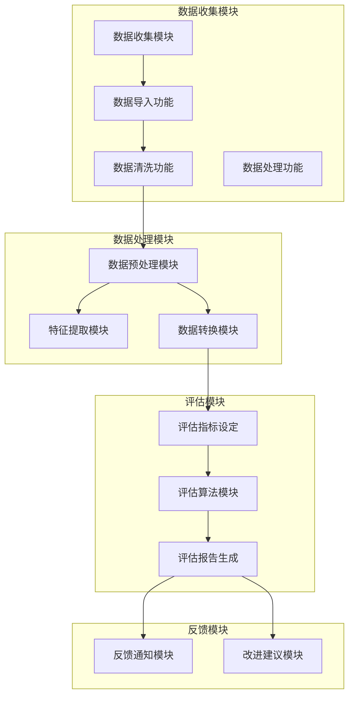

                 

## 文章标题

### 360度反馈：全方位评估AI团队成员表现

## 文章关键词

- **360度反馈**
- **AI团队评估**
- **绩效管理**
- **人工智能**
- **团队成员表现**

## 文章摘要

本文将深入探讨360度反馈在评估AI团队成员表现中的应用。首先，我们将概述360度反馈的概念及其在组织管理中的重要性。接着，我们将分析如何将AI技术融入360度反馈系统，提高评估的精确性和效率。本文还将探讨AI团队中常见的评估指标，提供实际案例，展示如何实施360度反馈，并分享最佳实践和小结。通过本文，读者将获得全面理解，掌握如何有效运用360度反馈来提升AI团队的绩效和管理。

---

## 引言

在快速发展的技术领域，人工智能（AI）的应用日益广泛。AI团队作为推动技术创新的核心力量，其成员的表现直接影响到项目的成功和组织的竞争力。传统的绩效评估方法往往局限于单一视角，无法全面反映团队成员的真实能力和表现。因此，寻找一种全面、科学的评估体系成为当前AI团队管理的重要课题。

360度反馈是一种全方位评估体系，通过多角度收集团队成员的反馈信息，旨在提供更全面、客观的评估结果。这种评估方法不仅考虑团队成员的工作表现，还包括领导力、团队合作能力等多方面的素质。将360度反馈应用于AI团队，可以帮助管理者深入了解团队成员的潜力与不足，为人才培养和团队建设提供有力支持。

本文将首先介绍360度反馈的概念和基本原则，然后探讨如何将AI技术融入360度反馈系统，提高评估的精确性和效率。接着，我们将详细分析AI团队中的关键评估指标，并通过实际案例展示如何实施360度反馈。最后，本文将总结最佳实践，提供有关团队绩效管理和评估的宝贵建议。通过本文的阅读，读者将全面了解如何通过360度反馈全方位评估AI团队成员的表现，从而提升团队整体效能。

---

## 360度反馈的概念及其重要性

### 360度反馈的定义

360度反馈是一种全方位评估体系，通过收集来自多个角度的反馈信息，对个人或团队的表现进行综合评价。与传统的一对一反馈或自评方式不同，360度反馈涉及到的反馈来源包括团队成员、上级领导、下属员工、同事以及其他相关利益相关者。这种多角度的反馈机制旨在提供更加全面、客观的评估结果，从而帮助评估对象识别自己的优点和不足，有针对性地进行改进。

### 360度反馈的历史与发展

360度反馈最早起源于20世纪70年代的美国，最初应用于高层管理人员的绩效评估。随着时间的推移，这种评估方法逐渐被广泛应用于各种组织和企业中，成为人力资源管理中的重要工具。特别是在知识密集型行业，如技术、咨询和教育领域，360度反馈因其全面性和科学性而受到广泛关注。

### 360度反馈与传统绩效评估的差异

1. **反馈来源不同**：传统绩效评估通常仅依赖于上级领导或自我评估，而360度反馈则涵盖更广泛的反馈来源，包括下属、同事、客户等，能够提供更全面、多维度的评估信息。

2. **评估内容全面**：360度反馈不仅关注工作表现，还涉及个人素质、团队合作、领导力等多方面能力，从而提供更加全面的评估结果。

3. **反馈方式科学**：360度反馈通常采用匿名或半匿名的方式，减少评估过程中的主观偏见和情绪影响，确保反馈的真实性和客观性。

4. **改进措施具体**：由于反馈来源多样，360度反馈能够帮助评估对象更清晰地识别自身问题，制定具体的改进措施，提高绩效改进的效果。

### 360度反馈的优势与应用场景

#### **优势**

1. **全面性**：多角度的反馈有助于全面了解团队成员的能力和潜力，提高评估的准确性。

2. **客观性**：通过匿名或半匿名的方式，减少评估过程中的偏见，确保反馈的真实性和客观性。

3. **发展导向**：360度反馈注重个人和团队的成长，鼓励团队成员不断进步，提升整体绩效。

4. **激励作用**：全面、公正的评估能够激发团队成员的积极性和主动性，提高工作满意度。

#### **应用场景**

1. **团队建设**：通过360度反馈，团队领导可以更好地了解团队成员的能力和需求，优化团队结构，提升团队协作效率。

2. **绩效管理**：360度反馈为绩效评估提供更加科学、全面的依据，有助于制定合理的人才培养和激励计划。

3. **职业发展**：员工通过360度反馈可以更清晰地了解自己的职业发展路径，制定个人成长计划。

4. **组织变革**：在组织变革过程中，360度反馈有助于识别组织中的问题和优势，为变革提供有力支持。

综上所述，360度反馈作为一种科学、全面的评估体系，在AI团队管理中具有重要作用。通过多角度的反馈和全面的评估，360度反馈不仅能够帮助团队提升绩效，还能为团队成员的职业发展提供有力支持。

### 360度反馈的组成部分

360度反馈系统由多个关键组成部分构成，这些部分共同作用，确保评估过程的全面性、准确性和有效性。以下是对这些组成部分的详细说明：

#### **1. 反馈来源**

反馈来源是360度反馈系统的核心，决定了评估信息的多样性和全面性。反馈来源通常包括以下几个方面：

1. **上级领导**：上级领导对团队成员的工作表现有直接的观察和了解，他们的反馈有助于评估员工的工作成果和执行能力。
2. **下属员工**：下属员工的反馈可以反映员工在团队中的协作表现和沟通能力，有助于评估员工的人际关系和团队合作能力。
3. **同事**：同事的反馈提供了团队成员在工作中的实际表现和互动情况，有助于全面了解员工的综合能力和工作风格。
4. **客户**：对于面向客户的岗位，客户的反馈是评估员工服务质量和客户满意度的重要依据，有助于了解员工在工作中的实际表现。
5. **自我评估**：自我评估是团队成员对自己工作表现和成长过程的反思，有助于提高自我认知和自我提升。

#### **2. 反馈内容**

反馈内容是360度反馈系统的评估核心，包括多个方面的评价指标：

1. **工作绩效**：工作绩效是评估员工在岗位上的实际工作成果，包括完成任务的效率、质量、创新性等。
2. **团队合作**：团队合作能力是评估员工在团队中的协作情况，包括沟通能力、协作精神、责任感等。
3. **领导力**：领导力是评估员工在团队中承担领导角色时的表现，包括决策能力、团队激励、领导风格等。
4. **专业技能**：专业技能是评估员工在特定领域的技术水平和知识掌握程度，包括技术熟练度、专业培训、学术成果等。
5. **职业素养**：职业素养是评估员工在工作中的职业态度和行为，包括职业道德、职业规划、工作效率等。

#### **3. 反馈机制**

反馈机制是360度反馈系统的运作基础，包括以下关键环节：

1. **反馈收集**：通过问卷调查、面对面访谈、在线反馈等形式，收集来自不同来源的反馈信息。
2. **反馈分析**：对收集到的反馈信息进行整理、分析，提取关键评估指标，形成综合评估报告。
3. **反馈反馈**：将分析结果反馈给评估对象，帮助其了解自身表现和改进方向，同时向反馈者传达评估结果，确保反馈过程的透明和公正。
4. **改进措施**：根据反馈结果，评估对象制定改进计划，通过培训、指导、调整工作方式等手段，提升个人和团队的能力和绩效。

#### **4. 反馈目标**

反馈目标决定了360度反馈系统设计的方向和效果，主要包括以下几个方面：

1. **绩效提升**：通过全面、客观的评估，帮助团队成员识别自身不足，制定改进计划，提高工作绩效。
2. **团队建设**：通过评估团队中每个成员的表现，优化团队结构，提升团队协作能力和整体绩效。
3. **人才发展**：通过评估结果，发现团队成员的潜力，制定个性化的人才发展计划，提升员工职业素养和职业竞争力。
4. **组织发展**：通过360度反馈，了解组织内部的工作氛围、文化状况和管理水平，为组织变革和发展提供有力支持。

通过上述关键组成部分，360度反馈系统能够全面、科学地评估团队成员的表现，为绩效管理和团队建设提供有力支持。理解这些组成部分及其相互作用，有助于设计和实施有效的360度反馈系统，从而提升团队的整体效能。

### AI技术在360度反馈中的应用

随着人工智能技术的迅速发展，AI在各个领域的应用也越来越广泛。在绩效评估和团队管理中，AI技术可以提供高效、精准的解决方案，提升360度反馈系统的效果。以下将详细探讨AI技术在360度反馈中的应用，包括数据分析、机器学习算法、自然语言处理以及数据隐私与伦理问题。

#### **数据分析**

数据分析是360度反馈系统的基础，通过对大量数据的收集、整理和分析，可以提取出有价值的信息，为评估提供依据。AI技术在数据分析中发挥了重要作用：

1. **数据收集**：AI技术可以通过自动化工具收集各种来源的数据，如员工绩效数据、客户反馈、团队活动记录等。
2. **数据处理**：AI算法可以高效处理海量数据，去除冗余信息，提取关键指标，如工作绩效、团队合作等。
3. **数据可视化**：通过数据可视化技术，将分析结果以图表、仪表盘等形式呈现，使评估结果更加直观易懂。

#### **机器学习算法**

机器学习算法在360度反馈中的应用主要体现在评估指标的自动生成和评估结果的预测：

1. **评估指标生成**：通过机器学习算法，可以从大量历史数据中自动识别出有效的评估指标，无需人工预设，提高评估的准确性。
2. **评估结果预测**：利用机器学习模型，可以预测团队成员未来绩效趋势，为绩效改进和职业发展提供科学依据。
3. **伪代码示例**：
   ```python
   # 评估指标生成伪代码
   def generate_kpis(data):
       model = train_model(data)
       kpis = model.predict(data)
       return kpis

   # 评估结果预测伪代码
   def predict_performance(model, future_data):
       performance = model.predict(future_data)
       return performance
   ```

#### **自然语言处理**

自然语言处理（NLP）技术在360度反馈中的应用主要在于文本分析和情感分析：

1. **文本分析**：通过NLP技术，可以对员工反馈文本进行深入分析，提取关键信息，如优点、不足、改进建议等。
2. **情感分析**：通过情感分析，可以评估反馈的情感倾向，如积极、消极或中立，为评估结果提供更丰富的信息。
3. **伪代码示例**：
   ```python
   # 文本分析伪代码
   def analyze_text(text):
       tokens = tokenize(text)
       entities = extract_entities(tokens)
       sentiments = analyze_sentiment(tokens)
       return entities, sentiments

   # 情感分析伪代码
   def analyze_sentiment(tokens):
       sentiment = sentiment_analyzer(tokens)
       return sentiment
   ```

#### **数据隐私与伦理问题**

在AI技术应用于360度反馈的过程中，数据隐私和伦理问题是不可忽视的重要方面：

1. **数据安全**：确保反馈数据在收集、存储和处理过程中得到充分保护，防止数据泄露或滥用。
2. **数据匿名化**：通过技术手段对反馈数据进行匿名化处理，保护反馈者的隐私。
3. **伦理审查**：建立伦理审查机制，确保AI技术在反馈评估中的使用符合道德规范，避免造成不公平或歧视。
4. **透明度**：确保评估过程的透明度，让团队成员了解评估方法、评估结果及其应用，提高信任度。

综上所述，AI技术在360度反馈中的应用为绩效评估和团队管理提供了新的工具和方法，提高了评估的精确性和效率。通过结合数据分析、机器学习算法和自然语言处理技术，360度反馈系统能够更全面、准确地评估团队成员的表现，为组织的人才培养和团队建设提供有力支持。同时，数据隐私和伦理问题的关注，确保了评估过程的公正性和可持续性。

### AI驱动的360度反馈系统设计

#### **系统架构设计**

AI驱动的360度反馈系统架构主要包括以下几个核心模块：数据收集模块、数据处理模块、评估模块和反馈模块。以下是各模块的详细设计：

1. **数据收集模块**：该模块负责从多种渠道收集反馈数据，包括员工自我评估、上级领导评估、同事评估、下属评估和客户反馈等。数据收集模块应具备自动化数据导入功能，确保数据的及时性和完整性。

2. **数据处理模块**：数据处理模块负责对收集到的数据进行预处理，包括数据清洗、格式统一、缺失值处理等。该模块还应利用AI算法对原始数据进行特征提取和转换，为后续评估提供高质量的输入数据。

3. **评估模块**：评估模块是系统的核心，利用机器学习算法和自然语言处理技术，对处理后的数据进行综合评估，生成评估报告。评估模块应具备自适应学习能力，根据不同团队和岗位的实际情况，动态调整评估指标和权重。

4. **反馈模块**：反馈模块负责将评估结果反馈给相关团队成员，并提供个性化改进建议。该模块应支持多种反馈形式，如电子邮件、短信、内部通知等，确保反馈信息的及时传达。

#### **系统架构图**



#### **数据收集与处理**

1. **数据来源**：系统应支持多种数据来源，包括员工自我评估问卷、上级领导评估表、同事反馈问卷、下属反馈问卷和客户满意度调查等。

2. **数据预处理**：数据预处理是确保数据质量和评估准确性的关键步骤。具体包括：
   - **数据清洗**：去除重复数据、缺失值填充、异常值检测和修正。
   - **格式统一**：将不同来源的数据格式进行统一，如将文本数据转换为结构化数据。
   - **特征提取**：从原始数据中提取对评估有意义的特征，如员工的工作绩效、团队合作能力、领导力等。

3. **数据转换**：将预处理后的数据进行转换，为评估模块提供高质量的数据输入。具体包括：
   - **数值化**：将文本数据转换为数值型数据，如使用词袋模型或词嵌入技术。
   - **标准化**：对数据进行标准化处理，如使用Z-score标准化或Min-Max标准化。

#### **用户行为分析与反馈生成**

1. **用户行为分析**：通过分析用户在系统中的行为数据，如登录次数、反馈提交时间、评估结果浏览情况等，可以了解用户的使用习惯和反馈情况，为后续改进提供依据。

2. **反馈生成**：根据评估结果，系统应生成个性化的反馈报告，包括整体评估结果、详细评估指标、改进建议等。反馈报告应以易于理解的形式呈现，如图表、列表、文字说明等。

3. **个性化反馈**：系统应支持个性化反馈生成，根据团队成员的不同角色和职责，提供定制化的反馈内容。例如，对于技术团队成员，反馈重点可能放在技术能力和项目完成情况上；对于管理团队成员，反馈重点可能放在领导力和团队协作上。

#### **个性化反馈与报告生成**

1. **反馈策略**：根据团队成员的角色和评估结果，制定不同的反馈策略。例如，对于表现优异的团队成员，反馈内容可以更多关注如何进一步提升；对于表现一般的团队成员，反馈内容可以更多关注如何改进和提高。

2. **报告格式**：报告应以清晰、简洁的形式呈现，包括评估结果概览、详细评估指标、改进建议和下一步行动计划等。报告还应支持多种格式输出，如PDF、Word、Excel等，方便团队成员查阅和打印。

3. **动态更新**：系统应支持动态更新评估结果和反馈内容，确保团队成员能够及时了解自身的评估情况和改进建议。

通过以上设计，AI驱动的360度反馈系统可以高效、精准地评估团队成员的表现，为团队绩效管理和评估提供有力支持。系统的设计应充分考虑数据隐私和伦理问题，确保评估过程的公正性和可持续性。

### AI团队中的常见评估指标

在AI团队中，评估团队成员的表现需要考虑多个维度，以全面、科学地反映其工作效果。以下是一些常见的评估指标，包括工作绩效、团队合作能力、领导力和专业技能等方面。

#### **工作绩效**

工作绩效是评估团队成员最直接的指标，主要包括以下几个方面：

1. **项目完成情况**：团队成员是否按时、按质完成分配的任务，包括项目的进度、质量、创新性和实际贡献等。
2. **目标达成度**：根据设定的绩效目标，评估团队成员的工作表现，如达成目标的百分比、超额完成的程度等。
3. **问题解决能力**：在项目过程中，团队成员面对问题时的解决能力，包括分析问题的深度、解决问题的效率和创新性。
4. **反馈与改进**：项目结束后，团队成员是否主动接受反馈并进行改进，反映其自我提升的意愿和能力。

#### **团队合作能力**

团队合作能力是评估团队成员在团队中协作效果的重要指标，包括以下几个方面：

1. **沟通能力**：团队成员之间沟通的频率、效果和效率，包括是否能够清晰表达自己的想法，理解并回应同事的意见。
2. **协作精神**：团队成员在团队项目中的协作态度和贡献，包括共同解决问题、分担工作负担等。
3. **团队意识**：团队成员对团队的认同感和归属感，是否能够将个人目标与团队目标相结合，共同努力实现团队目标。
4. **冲突解决**：在团队协作过程中，团队成员处理冲突的能力和效果，包括是否能够通过沟通和协商解决分歧。

#### **领导力**

领导力是评估团队成员在团队中承担领导角色时的表现，包括以下几个方面：

1. **决策能力**：团队成员在面对复杂问题时，能够快速、准确地做出决策，并承担决策结果的责任。
2. **团队激励**：团队成员在领导团队时，能够激发团队成员的积极性和创造力，提高团队整体的工作效率和绩效。
3. **领导风格**：团队成员在领导团队时，是否能够根据团队的特点和需求，采取适当的领导风格，如民主式、专制式或参与式等。
4. **团队建设**：团队成员在领导团队时，是否能够建立积极、健康的团队文化，提高团队的凝聚力和协作效率。

#### **专业技能**

专业技能是评估团队成员在技术领域的能力和知识水平，包括以下几个方面：

1. **技术熟练度**：团队成员对所负责技术领域的掌握程度，包括编程语言、算法、框架等。
2. **学术成果**：团队成员在技术领域的研究成果，如论文发表、专利申请等。
3. **专业培训**：团队成员参加的专业培训课程和学习活动，反映其持续学习和自我提升的意愿和能力。
4. **项目贡献**：在项目实施过程中，团队成员的具体工作内容和贡献，包括代码质量、功能实现等。

通过以上多方面的评估指标，AI团队可以全面、准确地评估团队成员的表现，为绩效管理和人才发展提供科学依据。同时，这些指标也为团队成员提供了清晰的发展方向和改进目标，有助于提升团队的整体绩效和竞争力。

### AI团队360度反馈的实施案例

#### **案例一：数据科学与人工智能团队**

**1. 背景介绍**

数据科学与人工智能团队是一家科技公司下属的研究团队，负责开发和实施公司的人工智能项目。团队成员包括数据科学家、机器学习工程师和AI研究员等，团队的目标是推动公司人工智能技术的创新和应用。

**2. 评估指标设定**

在实施360度反馈时，团队设定了以下评估指标：
- **工作绩效**：项目完成度、任务质量、创新性贡献。
- **团队合作能力**：沟通效率、协作精神、冲突解决能力。
- **领导力**：决策能力、团队激励、团队建设。
- **专业技能**：技术熟练度、学术成果、专业培训。

**3. 实施过程**

- **数据收集**：通过问卷调查和面对面访谈，从团队成员、上级领导、同事、下属和客户等多个渠道收集反馈。
- **数据处理**：对收集到的数据进行分析和整理，提取关键评估指标。
- **反馈生成**：利用机器学习算法生成个性化的反馈报告，包括整体评估结果、详细评估指标和改进建议。

**4. 结果分析**

通过360度反馈，团队发现了以下问题：
- **沟通不畅**：部分团队成员之间沟通效率低，导致协作困难。
- **领导力不足**：团队领导在决策和激励方面存在不足，影响了团队的整体士气。

**5. 改进措施**

- **沟通培训**：为团队成员提供沟通技巧培训，提高沟通效率。
- **领导力培养**：组织领导力培训，提升团队领导的决策能力和激励水平。

#### **案例二：机器学习研发团队**

**1. 背景介绍**

机器学习研发团队是一家专注于机器学习算法研发的团队，团队成员包括高级算法工程师、数据工程师和研究学者。团队的主要任务是实现机器学习算法的创新和应用。

**2. 评估指标设定**

评估指标包括：
- **工作绩效**：算法创新性、项目完成度、任务质量。
- **团队合作能力**：技术交流、知识共享、协作精神。
- **领导力**：学术引领、团队激励、技术创新。
- **专业技能**：技术熟练度、论文发表、专利申请。

**3. 实施过程**

- **数据收集**：通过在线问卷调查和专家评审，从团队成员、上级领导、同事和学术同行等多个角度收集反馈。
- **数据处理**：对收集到的数据进行分析和整合，提取关键评估指标。
- **反馈生成**：利用自然语言处理技术生成个性化的反馈报告，包括评估结果、改进建议和下一步行动计划。

**4. 结果分析**

通过360度反馈，团队识别出以下问题：
- **知识共享不足**：团队成员之间的技术交流和知识共享不够，影响了团队的整体创新能力。
- **领导力薄弱**：团队领导在学术引领和技术创新方面存在不足，限制了团队的发展潜力。

**5. 改进措施**

- **知识共享平台**：建立团队内部知识共享平台，鼓励团队成员分享技术经验和研究成果。
- **领导力培养**：为团队领导提供专业培训，提升其学术引领和技术创新的能力。

#### **案例三：人工智能产品团队**

**1. 背景介绍**

人工智能产品团队负责开发和推广人工智能产品，团队成员包括产品经理、设计师、开发工程师和测试工程师等。团队的目标是确保产品的技术先进性和用户体验。

**2. 评估指标设定**

评估指标包括：
- **工作绩效**：产品完成度、用户满意度、市场反馈。
- **团队合作能力**：项目协同、沟通效率、问题解决。
- **领导力**：项目管理、团队激励、用户导向。
- **专业技能**：产品知识、技术实现、用户体验。

**3. 实施过程**

- **数据收集**：通过用户调研、内部评审和同事反馈，从多方面收集评估信息。
- **数据处理**：对收集到的数据进行整理和分析，提取关键评估指标。
- **反馈生成**：利用数据分析技术生成个性化的反馈报告，包括整体评估结果、改进建议和行动计划。

**4. 结果分析**

通过360度反馈，团队发现以下问题：
- **用户满意度低**：部分产品的用户满意度较低，影响了市场表现。
- **团队合作不畅**：项目过程中，部分团队成员之间的协作不充分，影响了项目的进度和质量。

**5. 改进措施**

- **用户调研**：增加用户调研频率，深入了解用户需求和反馈，优化产品设计。
- **团队协作培训**：为团队成员提供团队协作培训，提高项目协同和沟通效率。

以上三个案例展示了如何在不同类型的AI团队中实施360度反馈，并通过分析评估结果，制定具体的改进措施，提升团队绩效。通过360度反馈，团队可以更全面、客观地了解自身表现，为团队发展提供有力支持。

### AI团队绩效改进与职业发展

#### **绩效改进策略**

360度反馈不仅帮助团队了解成员的表现，还提供了明确的改进方向。以下是一些具体的绩效改进策略：

1. **个性化发展计划**：根据每位成员的评估结果，制定个性化的职业发展计划。发展计划应包括具体的培训课程、实践项目和技能提升目标。
2. **持续反馈与支持**：在绩效改进过程中，定期进行反馈和评估，确保改进措施的执行效果。同时，为团队成员提供必要的支持和资源，如培训、导师指导等。
3. **目标管理与激励**：将个人目标和团队目标相结合，设立明确的绩效目标，并通过激励措施如奖金、晋升机会等，激发团队成员的积极性和主动性。

#### **职业发展规划与人才梯队建设**

1. **人才识别与培养**：通过360度反馈，识别出有潜力的成员，制定详细的培养计划，包括技术培训、领导力发展、跨职能交流等。
2. **人才梯队建设**：构建多层次的人才梯队，确保团队在不同阶段都有合适的领导者和接班人。通过轮岗、跨部门项目等方式，提升成员的多样性和综合素质。
3. **职业发展通道**：为团队成员提供明确的职业发展路径，包括技术专家、项目管理、产品管理等多种方向，帮助成员根据个人兴趣和优势进行职业规划。

#### **反馈结果的应用与反馈文化的培养**

1. **反馈结果的利用**：将反馈结果应用到人力资源管理的各个方面，如招聘、晋升、薪酬调整等。确保反馈结果成为决策的重要依据，提高管理决策的科学性和公正性。
2. **反馈文化的培养**：建立开放、包容的反馈文化，鼓励团队成员之间进行积极、建设性的反馈。通过培训、研讨会等形式，提升团队成员的反馈意识和能力。
3. **持续改进与优化**：定期回顾和优化360度反馈系统，确保评估过程的透明、公正和高效。根据团队成员的反馈，不断改进评估方法和工具，提高反馈效果。

通过上述措施，AI团队可以有效提升成员的绩效水平，促进职业发展，并构建一个积极、健康的反馈文化，为团队的长期发展奠定坚实基础。

### 360度反馈与AI团队管理的未来趋势

#### **挑战与机遇**

1. **数据隐私与伦理问题**：在AI团队管理中，360度反馈需要处理大量个人数据，涉及隐私保护和伦理问题。未来的挑战在于如何确保数据的安全性和合规性，同时维护反馈者的隐私权益。
2. **技术更新与适应**：随着技术的不断进步，360度反馈系统需要不断更新和优化，以适应新的数据分析和评估需求。团队管理者需具备快速适应新技术的能力。
3. **反馈效果验证**：评估360度反馈的实际效果是未来的一大挑战。需要通过长期的实践和研究，验证反馈系统在提升团队绩效和员工满意度方面的有效性。

#### **未来发展趋势**

1. **智能化反馈系统**：未来的360度反馈系统将更加智能化，利用深度学习和自然语言处理技术，自动分析反馈内容，提供更精准的评估结果。
2. **数据驱动的决策**：通过大数据和AI技术，360度反馈将能够提供更全面、多维度的数据支持，帮助团队管理者做出更加科学和有效的决策。
3. **个性化反馈与干预**：未来的反馈系统将更加注重个性化，根据团队成员的具体情况，提供有针对性的反馈和改进建议，提高反馈的实用性和有效性。

#### **AI团队管理的新模式**

1. **智能绩效管理**：利用AI技术，实现对团队成员绩效的实时监控和动态评估，提高绩效管理的效率和准确性。
2. **自适应团队结构**：通过分析团队成员的能力和需求，自动调整团队结构，优化团队配置，提升团队整体效能。
3. **个性化职业发展**：基于AI算法，为团队成员提供个性化的职业发展路径和培训计划，促进个人成长和团队发展。

总之，360度反馈在AI团队管理中具有广阔的发展前景。通过不断探索和创新，结合AI技术，可以构建更加智能、高效、公正的绩效评估和团队管理新模式，为AI团队的长期发展提供坚实保障。

### 附录

#### **附录A：AI团队360度反馈工具与资源推荐**

**A.1 开源评估工具**

1. **Gauge**：一个开源的反馈和评估平台，支持多角度、多维度的评估，适合中小型团队。
2. **360度评估工具**：一个基于Web的开源评估工具，提供用户友好的界面和丰富的功能，适合各种规模的企业。

**A.2 商业反馈系统**

1. **Elevate**：一个商业化的反馈系统，提供全面的360度反馈功能，支持数据分析和管理报告。
2. **Lumery**：一个提供个性化反馈和职业发展的反馈平台，适用于中大型企业。

**A.3 学习资源与推荐**

1. **《绩效管理：系统与策略》**：一本系统化的绩效管理教材，详细介绍了360度反馈的理论和实践。
2. **在线课程**：例如Coursera上的《绩效评估与反馈》课程，提供丰富的理论知识与实践技巧。
3. **专业研讨会和会议**：如年度绩效管理国际研讨会（IPM），汇集了业内专家的最新研究成果和实践经验。

通过使用这些工具和资源，AI团队可以更有效地实施360度反馈，提升绩效管理和团队建设水平。

### 作者信息

**作者：AI天才研究院/AI Genius Institute & 禅与计算机程序设计艺术 /Zen And The Art of Computer Programming**

