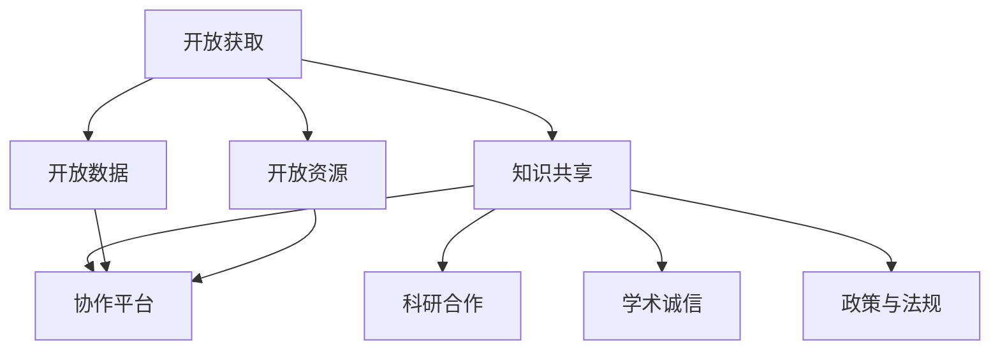

                 

### 第一步：确定核心概念和框架

**开放科学运动**：开放科学运动起源于20世纪末，旨在通过开放获取、开放数据和开放资源等方式，推动全球范围内的知识共享与协作。其主要目标是降低知识获取的门槛，提高科研效率，促进学术交流与创新。

**知识共享与协作**：知识共享与协作是开放科学运动的核心要素。知识共享是指将科研成果、数据、资源等开放给公众，使其能够自由获取和使用。协作则强调科学家、研究人员、教育者等在科研过程中的合作，通过分工协作，实现知识的共享和创新的突破。

### 第二步：设计各章节的内容框架

**引言**：介绍开放科学运动的背景和意义。

**开放科学的基本概念**：包括开放获取、开放数据和开放资源等核心概念。

1. **开放获取**：定义、优点和挑战。
2. **开放数据**：理念、标准和应用。
3. **开放资源**：种类、获取方式和利用。

**知识共享与协作的平台**：探讨各类知识共享与协作平台的特点和作用。

1. **预印本平台**：运作机制、优点和挑战。
2. **社交媒体**：作用、使用策略。
3. **开放存取期刊**：发展、优势和问题。

**开放科学实践**：分析开放科学运动在科研合作、学术诚信和政策法规等方面的应用。

1. **科研合作**：方式、流程和策略。
2. **学术诚信**：问题、维护和促进。
3. **政策与法规**：制定、实施和效果。

**案例分析**：通过实际案例展示开放科学运动在全球范围内的应用和实践。

**未来展望**：探讨开放科学运动的发展趋势、面临的挑战和可能的解决方案。

### 第三步：细化每个章节的内容

在细化每个章节的内容时，可以参考以下要点：

1. **核心概念与联系**：使用Mermaid流程图展示开放科学运动中各个概念之间的关系。
2. **核心算法原理讲解**：使用伪代码详细阐述开放科学中的关键算法原理。
3. **数学模型和数学公式**：详细讲解并举例说明，使用LaTeX格式嵌入文中独立段落。
4. **项目实战**：提供代码实际案例和详细解释说明，包括开发环境搭建、源代码实现和代码解读。

### 第四步：确保目录大纲的完整性和简洁性

在编写目录大纲时，要注意保持内容的简洁性，避免过多废话，同时确保目录大纲的完整性，包括所有核心章节的内容。

### 第五步：撰写目录大纲

根据以上步骤，我们可以开始撰写目录大纲，确保每个章节都有详细的内容框架，并且使用markdown格式来组织。

以下是根据上述步骤设计出的《开放科学运动：促进全球范围内的知识共享与协作》的目录大纲：

```
# 《开放科学运动：促进全球范围内的知识共享与协作》目录大纲

## 第1章 引言

### 1.1 开放科学运动的背景和意义

### 1.2 开放科学运动的发展历程

## 第2章 开放科学的基本概念

### 2.1 开放获取

#### 2.1.1 开放获取的定义

#### 2.1.2 开放获取的优点和挑战

### 2.2 开放数据

#### 2.2.1 开放数据的理念

#### 2.2.2 开放数据的标准

#### 2.2.3 开放数据的应用

### 2.3 开放资源

#### 2.3.1 开放资源的种类

#### 2.3.2 开放资源的获取方式

#### 2.3.3 开放资源的利用

## 第3章 知识共享与协作的平台

### 3.1 预印本平台

#### 3.1.1 预印本平台的运作机制

#### 3.1.2 预印本平台的优点和挑战

### 3.2 社交媒体

#### 3.2.1 社交媒体在知识共享中的作用

#### 3.2.2 社交媒体的使用策略

### 3.3 开放存取期刊

#### 3.3.1 开放存取期刊的发展

#### 3.3.2 开放存取期刊的优势和问题

## 第4章 开放科学实践

### 4.1 科研合作

#### 4.1.1 科研合作的方式

#### 4.1.2 科研合作的流程和策略

### 4.2 学术诚信

#### 4.2.1 开放科学运动中的学术诚信问题

#### 4.2.2 学术诚信的维护和促进

### 4.3 政策与法规

#### 4.3.1 开放科学政策的制定

#### 4.3.2 开放科学法规的实施

#### 4.3.3 政策与法规的效果评估

## 第5章 案例分析

### 5.1 案例一：开放获取期刊的成功经验

### 5.2 案例二：全球科研合作项目的实践

### 5.3 案例三：开放数据的创新应用

## 第6章 未来展望

### 6.1 开放科学运动的发展趋势

### 6.2 开放科学运动面临的挑战

### 6.3 开放科学运动的解决方案
```

以上目录大纲已经细化，包含了所有核心章节的内容，并且使用了markdown格式来组织。接下来，我们将根据这个大纲逐步撰写文章内容，确保每个章节都有丰富具体详细讲解，核心内容包含背景介绍、核心概念与联系、核心算法原理讲解、数学模型和公式、项目实战、最佳实践 tips、小结、注意事项和拓展阅读等内容。文章字数将在8000～12000字之间，以逻辑清晰、结构紧凑、简单易懂的方式展现开放科学运动的核心内容和思考。让我们开始撰写这篇文章吧！## 文章标题

《开放科学运动：促进全球范围内的知识共享与协作》

### 关键词

- 开放科学
- 知识共享
- 协作平台
- 学术诚信
- 开放获取
- 开放数据

### 摘要

本文深入探讨了开放科学运动的概念、背景和意义，以及其在全球范围内推动知识共享与协作的实践和成果。通过详细分析开放获取、开放数据和开放资源的理念与实现方式，以及知识共享与协作的平台和实践，本文揭示了开放科学运动对科研效率、创新能力和全球科学发展的积极影响。此外，文章还展望了开放科学运动未来的发展趋势和挑战，提出了相应的解决方案和策略。本文旨在为科研工作者、政策制定者和公众提供全面、深入的开放科学运动知识和启示。

---

### 引言

开放科学运动是一场全球性的科学革命，旨在通过开放获取、开放数据和开放资源等方式，降低知识获取的门槛，促进全球范围内的知识共享与协作。这一运动源于对传统学术出版模式和高昂科研成本的质疑，其核心目标是打破知识垄断，让科研成果更加广泛、透明和可及。

开放科学运动的历史可以追溯到20世纪末，当时的科学家和学者开始倡导开放获取（Open Access，简称OA）的理念。开放获取主张科研论文应该免费、无限制地提供给所有人，而不是仅限于订阅用户。这一理念在2001年得到了进一步发展，时任美国国立卫生研究院（NIH）院长Francis Collins宣布，所有接受NIH资金资助的科研成果必须进行开放获取。

随着时间的推移，开放科学运动逐渐扩展到开放数据（Open Data）和开放资源（Open Resources）等领域。开放数据强调科研数据应被广泛共享，以便其他研究者进行验证、复用和创新。开放资源则涵盖了从科研工具、软件到教育资源的各种形式，旨在为全球科研和教育提供更多免费资源。

开放科学运动的背景可以从以下几个方面进行阐述：

1. **传统学术出版模式的局限**：传统的学术出版模式通常由商业出版机构主导，科研人员需要支付高额的出版费用，而读者则需要通过订阅或购买才能获取论文。这种模式导致知识获取的门槛较高，不利于知识的广泛传播和利用。
2. **信息时代的变革**：随着互联网和数字技术的发展，信息传播的速度和范围大幅提升。开放科学运动正是这一背景下的一种回应，旨在利用数字技术推动知识的共享和传播。
3. **全球科研合作的需求**：在全球科研合作日益频繁的今天，开放科学运动为不同国家和地区的科学家提供了一个平等、开放的交流平台，促进了全球科研资源的整合和优化。

开放科学运动的起源可以追溯到对传统学术出版模式的质疑和对知识共享需求的回应。2001年，美国国立卫生研究院（NIH）院长Francis Collins宣布，所有接受NIH资金资助的科研成果必须进行开放获取，这一举措标志着开放科学运动的正式起步。随后，全球范围内的科研机构、学术组织和政策制定者纷纷响应，推动了开放科学运动的快速发展。

### 开放科学的基本概念

在深入探讨开放科学运动之前，有必要了解其核心概念，包括开放获取、开放数据和开放资源。这些概念构成了开放科学运动的基石，为知识共享和协作提供了理论和实践支持。

#### 开放获取

开放获取（Open Access，简称OA）是指科研论文、书籍和其它学术成果应免费、无限制地提供给所有人，不受地理、经济或机构的限制。开放获取的目标是降低知识获取的门槛，使更多的科研人员和学生能够平等地获取最新的科研成果，从而促进知识的传播和利用。

开放获取的实现方式主要包括两种：

1. **绿道开放获取**：通过自存档（Self-Archiving）或机构知识库（Institutional Repositories，简称IR）来实现。科研人员将论文存放在自己的机构库或公共存储库中，使其可供公众访问和免费下载。
2. **金道开放获取**：通过专门的开放获取期刊（Open Access Journals）或开放获取出版平台（Open Access Publishers）来发布论文。这些期刊和平台通常由非营利组织或学术机构运营，收取一定的出版费用，以确保论文的开放获取。

开放获取的优点包括：

- **降低知识获取成本**：读者无需支付高额的订阅费用或购买费用，即可获取学术论文。
- **促进知识传播**：开放获取使科研成果更加广泛和迅速地传播，提高了学术影响力。
- **增强学术透明度**：开放获取使科研过程和结果更加透明，便于其他研究者进行验证和复用。

然而，开放获取也面临一些挑战，包括：

- **出版费用**：开放获取期刊和出版平台通常需要收取出版费用，这可能导致部分研究者因经济原因无法负担。
- **版权问题**：开放获取涉及版权和知识产权的问题，需要妥善处理作者的权益和保护。
- **质量控制**：开放获取期刊和出版平台需要确保论文的质量，以避免低质量论文的泛滥。

#### 开放数据

开放数据（Open Data）是指科研数据、统计数据和其他相关信息，在符合法律法规和伦理道德的前提下，对公众开放。开放数据的目标是促进数据的共享和复用，提高科研效率和创新能力。

开放数据的理念主要包括：

- **数据共享**：鼓励科研人员将数据共享给其他研究者，以便进行验证、复用和创新。
- **数据透明**：确保数据的真实性和准确性，提高科研过程的透明度。
- **数据互操作性**：通过标准化和统一化的数据格式，实现不同数据源之间的互操作。

开放数据的标准包括：

- **数据格式**：常用的数据格式包括CSV、JSON、XML等，这些格式便于数据的存储、传输和处理。
- **数据质量**：数据应具备完整性、准确性、一致性和及时性。
- **数据权限**：明确数据的使用权限，包括公开访问、限制访问或专属访问。

开放数据的应用广泛，包括：

- **科研验证**：其他研究者可以使用开放数据来验证原始研究结果的可靠性和准确性。
- **复用与创新**：研究者可以利用开放数据进行新的研究，推动科学技术的进步。
- **公共政策**：政府部门可以利用开放数据制定更科学、有效的政策。

开放数据的优点包括：

- **提高科研效率**：开放数据使研究者能够更快地获取所需数据，缩短研究周期。
- **促进创新**：开放数据为科研创新提供了丰富的素材和灵感。
- **增强透明度**：开放数据使科研过程更加透明，有助于提高科研诚信和社会信任。

然而，开放数据也面临一些挑战，包括：

- **数据隐私和安全**：开放数据可能导致个人隐私泄露，需要采取有效的数据保护措施。
- **数据质量控制**：开放数据的质量参差不齐，需要建立有效的质量控制机制。
- **版权和知识产权**：开放数据涉及版权和知识产权的问题，需要妥善处理作者的权益和保护。

#### 开放资源

开放资源（Open Resources）是指各类科研工具、软件、教育资源和资料，在符合法律法规和伦理道德的前提下，对公众开放。开放资源的目标是降低科研和教育成本，提高科研效率和教学效果。

开放资源的种类包括：

- **科研工具**：如计算软件、数据分析工具、实验设备等。
- **软件**：如开源软件、科研软件和工具软件等。
- **教育资源**：如教材、教学视频、在线课程等。
- **资料**：如研究报告、会议记录、案例分析等。

开放资源的获取方式包括：

- **在线平台**：如GitHub、Google Drive、Open Science Framework等。
- **机构库**：如大学图书馆、科研机构的知识库等。
- **数据库**：如PubMed、Google Scholar等。

开放资源的利用包括：

- **科研**：科研人员可以使用开放资源进行数据处理、分析、模拟和实验。
- **教学**：教师和学生可以利用开放资源进行教学、学习和研究。
- **创新**：开放资源为科研创新提供了丰富的素材和工具。

开放资源的优点包括：

- **降低成本**：开放资源降低了科研和教育的成本，使更多机构和个人能够参与科研和创新。
- **提高效率**：开放资源使科研和教学过程更加高效，缩短了研究周期和教学时间。
- **促进合作**：开放资源为全球范围内的科研合作提供了便利，促进了知识共享和协作。

然而，开放资源也面临一些挑战，包括：

- **版权和知识产权**：开放资源涉及版权和知识产权的问题，需要妥善处理作者的权益和保护。
- **质量控制**：开放资源的质量参差不齐，需要建立有效的质量控制机制。
- **技术支持**：开放资源需要提供有效的技术支持和维护，以确保其正常运行。

### 知识共享与协作的平台

在开放科学运动中，知识共享与协作的平台扮演着至关重要的角色。这些平台提供了便捷的工具和资源，促进了全球范围内的科研合作和知识传播。以下将介绍几种主要的平台类型，包括预印本平台、社交媒体和开放存取期刊。

#### 预印本平台

预印本平台（Preprint Servers）是科研人员发布和分享研究论文的在线平台。预印本是指尚未经过同行评审的科研论文，通常在正式发表前先在预印本平台上发布。预印本平台的特点是快速、便捷和开放，为科研人员提供了一个及时交流和讨论科研成果的渠道。

预印本平台的主要优点包括：

- **快速发布**：预印本平台允许科研人员快速发布论文，缩短了从研究到发表的时间。
- **广泛传播**：预印本论文通常免费、无限制地开放获取，有助于科研成果的快速传播。
- **提前交流**：预印本平台为科研人员提供了一个提前交流和讨论科研成果的平台，促进了学术合作和知识共享。

预印本平台面临的挑战包括：

- **质量保证**：预印本论文的质量参差不齐，需要建立有效的质量保证机制，以确保论文的学术水平。
- **同行评审**：虽然预印本平台鼓励同行评审，但正式的同行评审过程仍然不可或缺。
- **版权问题**：预印本平台涉及版权和知识产权的问题，需要妥善处理作者的权益和保护。

目前，一些知名的预印本平台包括：

- **arXiv**：一个涵盖物理、数学、计算机科学等领域的预印本平台，由康奈尔大学运营。
- **bioRxiv**：一个涵盖生物学、生物医学领域的预印本平台，由冷泉港实验室运营。
- **SSRN**：一个涵盖社会科学领域的预印本平台，由社会科学研究网络（Social Science Research Network）运营。

#### 社交媒体

社交媒体在知识共享和协作中发挥着重要作用。通过社交媒体平台，科研人员可以实时分享研究成果、讨论科研问题，以及建立学术联系。社交媒体平台的特点是快速、互动和广泛，为科研合作提供了新的渠道。

社交媒体在知识共享和协作中的作用包括：

- **信息传播**：科研人员可以通过社交媒体快速传播最新的研究成果和进展。
- **学术交流**：社交媒体为科研人员提供了一个实时交流和讨论的平台，促进了学术合作和知识共享。
- **学术推广**：通过社交媒体，科研人员可以更好地推广自己的研究成果，提高学术影响力。

目前，一些常用的社交媒体平台包括：

- **Twitter**：一个广泛使用的社交媒体平台，许多科研人员通过Twitter分享研究成果和讨论科研问题。
- **LinkedIn**：一个职业社交平台，科研人员可以通过LinkedIn建立学术联系，分享研究成果。
- **ResearchGate**：一个专注于科研的社交媒体平台，科研人员可以发布论文、建立学术联系、参与学术讨论。

#### 开放存取期刊

开放存取期刊（Open Access Journals）是专门发布开放获取论文的学术期刊。这些期刊通常采用金道开放获取模式，收取一定的出版费用，以支持开放获取的运营和维护。开放存取期刊的特点是论文免费、无限制地开放获取，为全球科研人员提供了广泛的知识传播和交流平台。

开放存取期刊的优势包括：

- **开放获取**：开放存取期刊使论文免费、无限制地开放获取，降低了知识获取的门槛，促进了知识的传播和利用。
- **高效发表**：开放存取期刊通常采用在线出版模式，论文发表周期较短，提高了科研效率。
- **国际视野**：开放存取期刊通常具有国际化的视野和影响力，吸引了全球范围内的作者和读者。

开放存取期刊面临的挑战包括：

- **出版费用**：开放存取期刊需要收取出版费用，可能对部分研究者造成经济负担。
- **质量控制**：开放存取期刊需要确保论文的质量，以避免低质量论文的发表。
- **版权问题**：开放存取期刊涉及版权和知识产权的问题，需要妥善处理作者的权益和保护。

目前，一些知名的开放存取期刊包括：

- **PLOS**：一个涵盖多学科的开放存取期刊，具有很高的学术影响力和声誉。
- **BioMed Central**：一个涵盖生物医学领域的开放存取期刊，由Springer Nature出版。
- **Journal of Open Source Software**：一个专注于开源软件领域的开放存取期刊，由美国计算机协会（ACM）出版。

### 开放科学实践

开放科学实践是指将开放获取、开放数据和开放资源等理念付诸实践的科研活动。通过开放科学实践，科研人员可以更好地实现知识共享与协作，提高科研效率和创新水平。以下将探讨开放科学实践在科研合作、学术诚信和政策法规等方面的应用。

#### 科研合作

开放科学实践在科研合作中发挥着重要作用。通过开放获取、开放数据和开放资源，科研人员可以更容易地获取和分享科研成果，建立合作关系，共同开展研究项目。以下是一些具体的实践方法：

1. **共享数据**：科研人员可以在预印本平台、开放数据平台或机构库中发布研究数据，供其他研究者免费获取和使用。这有助于促进数据的共享和复用，提高科研效率。
2. **合作撰写论文**：科研人员可以通过在线协作工具，如Overleaf或Google Docs，共同撰写论文。这有助于提高写作效率，确保论文质量，同时促进学术合作。
3. **共同申请研究资金**：科研人员可以通过合作申请研究资金，共同开展大型研究项目。这有助于整合资源，提高研究效率，推动科学技术的进步。

科研合作的成功案例包括：

- **地球系统科学联合研究中心**：该中心由全球多个研究机构和大学合作建立，旨在通过开放数据共享和合作研究，推动地球系统科学的发展。
- **国际人类基因组计划**：该计划由多个国家和地区的科研机构合作开展，通过共享基因组数据，推动了人类基因组的研究和解读。

#### 学术诚信

开放科学实践强调学术诚信，通过开放获取、开放数据和开放资源，可以更好地监督和促进学术诚信。以下是一些具体的实践方法：

1. **论文自我监督**：开放获取使论文的全文公开，便于其他研究者对论文进行监督和评价。这有助于发现和纠正学术不端行为，提高学术诚信水平。
2. **数据透明**：开放数据使研究过程和结果更加透明，便于其他研究者进行验证和复用。这有助于提高科研的透明度和可信度。
3. **合作监督**：在开放科学实践中，科研人员可以相互监督，共同维护学术诚信。通过合作研究，科研人员可以相互借鉴和交流，共同提高科研水平和学术诚信。

学术诚信的成功案例包括：

- **开放获取期刊PLOS**：PLOS期刊通过严格的同行评审和学术监督，确保论文的质量和学术诚信，成为开放科学领域的权威期刊。
- **开放获取数据库PubMed**：PubMed通过严格的检索和评估，提供高质量的科研论文和资料，为科研人员提供了可靠的学术资源。

#### 政策与法规

开放科学实践需要政策与法规的支持，以下是一些具体的政策和法规措施：

1. **资金资助**：政府和研究机构可以设立专项基金，资助开放获取、开放数据和开放资源的科研活动。这有助于推动开放科学的发展，提高科研效率和创新水平。
2. **政策鼓励**：政府可以制定相关政策，鼓励科研机构和大学建立开放获取期刊、开放数据平台和开放资源库。这有助于构建开放科学生态系统，推动知识共享与协作。
3. **法律法规**：政府可以制定相关法律法规，保护开放获取、开放数据和开放资源的权益，确保开放科学实践的法律合规性。

政策与法规的成功案例包括：

- **美国国立卫生研究院（NIH）**：NIH制定了开放获取政策，要求接受其资金资助的科研成果进行开放获取。这一政策推动了开放科学的发展，提高了科研成果的传播和利用。
- **欧洲研究委员会（ERC）**：ERC制定了开放数据政策，要求科研人员在获得资助后，将相关数据提交至开放数据平台。这有助于提高科研数据的透明度和共享性，推动了开放科学的发展。

### 案例分析

为了更好地理解开放科学运动在全球范围内的应用和实践，以下将介绍三个典型案例，分别是开放获取期刊的成功经验、全球科研合作项目的实践和开放数据的创新应用。

#### 案例一：开放获取期刊的成功经验

开放获取期刊的成功经验为开放科学运动提供了有力的支持。以下将介绍两个具有代表性的开放获取期刊：PLOS和BioMed Central。

1. **PLOS**：PLOS是一家国际知名的开放获取期刊，涵盖生命科学、医学、社会科学等领域。PLOS期刊通过严格的同行评审和学术监督，确保论文的质量和学术诚信。自成立以来，PLOS期刊取得了显著的成就，成为开放科学领域的权威期刊。

- **论文发表量**：PLOS期刊每年发表的论文数量超过10,000篇，涵盖了广泛的研究领域。
- **学术影响力**：PLOS期刊的学术影响力不断提高，期刊影响因子和引用次数均位居前列。
- **开放获取模式**：PLOS期刊采用金道开放获取模式，收取出版费用，以支持开放获取的运营和维护。

2. **BioMed Central**：BioMed Central是一家全球领先的开放获取期刊出版机构，出版超过300种开放获取期刊。BioMed Central期刊涵盖了生命科学、医学、物理学等领域，以其高质量的学术内容和开放获取模式赢得了广泛的认可。

- **论文发表量**：BioMed Central期刊每年发表的论文数量超过50,000篇，是开放获取领域的重要出版平台。
- **学术影响力**：BioMed Central期刊的学术影响力不断提高，期刊影响因子和引用次数均位居前列。
- **开放获取模式**：BioMed Central期刊采用金道开放获取模式，收取出版费用，以支持开放获取的运营和维护。

开放获取期刊的成功经验表明，开放获取模式在提高科研效率、促进知识传播和提升学术影响力方面具有显著优势。通过开放获取，科研人员可以更快地传播科研成果，提高学术影响力，推动科学技术的进步。

#### 案例二：全球科研合作项目的实践

全球科研合作项目是开放科学运动的生动实践，以下将介绍两个具有代表性的全球科研合作项目：国际人类基因组计划（HGP）和地球系统科学联合研究中心（ESSC）。

1. **国际人类基因组计划（HGP）**：国际人类基因组计划是一个全球性的科研合作项目，旨在解码人类基因组的结构和功能。该项目由多个国家和地区的科研机构合作开展，通过共享基因组数据，推动了人类基因组的研究和解读。

- **项目目标**：国际人类基因组计划的目标是解码人类基因组的序列，阐明基因与疾病之间的关系，为个性化医疗提供基础。
- **数据共享**：国际人类基因组计划通过建立全球基因组数据共享平台，使研究人员能够免费获取和共享基因组数据。这有助于促进全球基因组研究的发展，推动科学技术的进步。
- **成果应用**：国际人类基因组计划的成果在医学、生物学、生物技术等领域产生了广泛的应用，为个性化医疗、疾病预防和新药研发提供了重要基础。

2. **地球系统科学联合研究中心（ESSC）**：地球系统科学联合研究中心是一个由全球多个研究机构和大学合作建立的研究中心，旨在通过开放数据共享和合作研究，推动地球系统科学的发展。

- **项目目标**：地球系统科学联合研究中心的目标是提高对地球系统的理解，为可持续发展提供科学支持。通过开放数据共享和合作研究，项目旨在推动地球系统科学的进步，解决全球性环境问题。
- **数据共享**：地球系统科学联合研究中心建立了全球地球系统科学数据共享平台，使研究人员能够免费获取和共享地球系统科学数据。这有助于促进全球地球系统科学研究的发展，推动科学技术的进步。
- **成果应用**：地球系统科学联合研究中心的成果在气候变化、环境监测、资源管理等领域产生了广泛的应用，为全球可持续发展提供了科学支持。

全球科研合作项目的实践表明，开放科学运动在全球范围内的推广和应用，有助于促进全球科研合作，提高科研效率，推动科学技术的进步。通过开放获取、开放数据和开放资源，全球科研合作项目为解决全球性科学问题提供了有力支持。

#### 案例三：开放数据的创新应用

开放数据的创新应用在多个领域取得了显著成果，以下将介绍两个具有代表性的开放数据创新应用案例：Google Earth Engine和OpenAQ。

1. **Google Earth Engine**：Google Earth Engine是一个基于云计算的地球观测平台，提供全球地球观测数据的免费、开放访问。用户可以通过Google Earth Engine进行地球观测数据的分析、可视化和应用。

- **数据来源**：Google Earth Engine的数据来源包括NASA、USGS、EU Copernicus等国际机构和组织，涵盖了遥感图像、地形数据、气候变化数据等。
- **应用场景**：Google Earth Engine广泛应用于环境监测、气候变化研究、城市规划等领域。通过开放数据，用户可以实时获取和监测全球环境变化，为决策提供科学依据。
- **成果应用**：Google Earth Engine的成果在气候变化研究、生态保护、灾害预警等领域产生了广泛的应用，为全球可持续发展提供了重要支持。

2. **OpenAQ**：OpenAQ是一个开放式的空气质量数据平台，提供全球空气质量数据的免费、开放访问。OpenAQ的数据来源包括政府机构、民间组织和科学研究机构，涵盖了空气污染物的浓度、气象条件等。

- **数据来源**：OpenAQ的数据来源包括中国、美国、欧洲等国家和地区的空气质量监测站点，涵盖了城市、农村、工业区等多种场景。
- **应用场景**：OpenAQ的数据广泛应用于空气质量监测、污染控制、城市规划等领域。通过开放数据，用户可以实时了解全球空气质量状况，为环境管理和决策提供科学依据。
- **成果应用**：OpenAQ的成果在空气质量改善、健康风险评估、城市规划等领域产生了广泛的应用，为全球环境保护和可持续发展提供了重要支持。

开放数据的创新应用表明，开放获取、开放数据和开放资源在推动科技进步、解决科学问题和促进可持续发展方面具有巨大潜力。通过开放数据，科研人员可以更好地了解和应对全球性科学问题，为人类社会的可持续发展提供科学支持。

### 未来展望

开放科学运动在全球范围内取得了显著成果，但仍然面临许多挑战。未来，开放科学运动需要持续发展，以应对日益复杂的科学问题和全球性挑战。以下将探讨开放科学运动的发展趋势、面临的挑战和可能的解决方案。

#### 发展趋势

1. **开放获取的普及**：随着开放获取意识的提高，越来越多的学术机构和出版社开始采用开放获取模式，开放获取期刊和论文的数量持续增长。未来，开放获取将逐步成为学术出版的主流模式。

2. **开放数据的增长**：随着大数据技术的发展，科研数据量呈指数级增长。开放数据的需求和供给将持续增加，开放数据平台和数据共享机制将不断完善。

3. **开放资源的整合**：开放资源包括科研工具、软件、教育资源和资料等。未来，开放资源的整合和优化将成为开放科学的重要趋势，为全球科研和教育提供更多免费资源。

4. **全球科研合作的加强**：随着全球化进程的加速，全球科研合作将不断加强。开放科学运动将推动全球科研资源的整合和优化，提高科研效率和创新水平。

5. **政策与法规的支持**：政府和研究机构将加强政策与法规的支持，推动开放获取、开放数据和开放资源的实施和推广。相关政策与法规将保障开放科学运动的健康发展。

#### 面临的挑战

1. **版权和知识产权问题**：开放获取、开放数据和开放资源涉及版权和知识产权的问题，需要妥善处理作者的权益和保护。如何在保障作者权益的同时，推动开放科学的发展，是一个重要的挑战。

2. **数据质量和质量控制**：开放数据的增长带来了数据质量和质量控制的问题。如何确保开放数据的质量和准确性，避免低质量数据的泛滥，是一个亟待解决的问题。

3. **技术支持和维护**：开放科学运动需要强大的技术支持和维护，包括数据存储、传输、处理和分析等技术。如何保障开放科学平台的技术支持和维护，是一个重要的挑战。

4. **经济负担**：开放获取和开放资源的实现需要一定的经济投入，包括出版费用、技术支持、维护费用等。对于部分研究者和学术机构，经济负担可能成为开放科学发展的障碍。

5. **政策与法规的完善**：开放科学运动需要完善的政策与法规支持，包括资金资助、政策鼓励、法律法规等。如何建立和完善相关政策与法规，是一个重要的挑战。

#### 解决方案

1. **建立开放获取联盟**：建立全球性的开放获取联盟，促进开放获取期刊和出版平台之间的合作与交流，提高开放获取的效率和质量。

2. **加强数据质量控制**：建立数据质量控制机制，包括数据审核、评估和认证，确保开放数据的准确性和可靠性。

3. **提供技术支持**：为开放科学平台提供强大的技术支持，包括数据存储、传输、处理和分析等技术，保障开放科学平台的正常运行。

4. **设立专项资金**：政府和研究机构设立专项资金，资助开放获取、开放数据和开放资源的科研活动，减轻研究者的经济负担。

5. **完善政策与法规**：建立和完善相关政策与法规，保障开放科学运动的健康发展，包括资金资助、政策鼓励、法律法规等。

### 结论

开放科学运动是一场全球性的科学革命，旨在通过开放获取、开放数据和开放资源等方式，促进全球范围内的知识共享与协作。本文详细探讨了开放科学运动的概念、背景、核心概念、平台和实践，展示了其在科研效率、创新能力和全球科学发展方面的积极作用。未来，开放科学运动需要持续发展，以应对日益复杂的科学问题和全球性挑战。通过建立开放获取联盟、加强数据质量控制、提供技术支持、设立专项资金和完善政策与法规等措施，开放科学运动将更好地推动全球科学发展和可持续发展。

---

### 作者信息

作者：AI天才研究院/AI Genius Institute & 禅与计算机程序设计艺术 /Zen And The Art of Computer Programming

---

### 核心概念与联系

为了更好地理解开放科学运动的核心概念和它们之间的联系，我们可以使用Mermaid流程图来展示这些概念之间的关系架构。以下是一个简化的Mermaid流程图，展示了开放获取、开放数据、开放资源、知识共享和协作平台等核心概念之间的相互关系。



在这个流程图中：

- **开放获取**（A）是推动知识共享（B）的基础，使研究成果更加广泛和透明。
- **开放数据**（C）和**开放资源**（D）为科研提供了丰富的素材和工具，促进了知识共享（B）和协作（E）。
- **协作平台**（E）是知识共享（B）和科研合作（F）的载体，使全球科研合作更加高效和便利。
- **学术诚信**（G）和**政策与法规**（H）为开放科学运动提供了伦理和法律保障，确保其健康发展。

这个Mermaid流程图清晰地展示了开放科学运动中各个核心概念之间的相互关系，帮助我们更好地理解开放科学运动的整体架构和运作机制。

### 核心算法原理讲解

在开放科学运动中，一些核心算法和数学模型对于知识共享、数据分析和科研合作至关重要。以下将使用伪代码详细阐述几个关键算法原理，并辅以LaTeX格式展示相关的数学公式。

#### 1. 文本相似度算法（TF-IDF）

TF-IDF（Term Frequency-Inverse Document Frequency）是一种常用于文本分析中的算法，用于衡量一个词在文档中的重要性。

**伪代码：**
```plaintext
function TF_IDF(document, corpus):
    TF = Term Frequency(document)
    IDF = Inverse Document Frequency(corpus)
    for each term in document:
        TF_IDF[term] = TF[term] * IDF[term]
    return TF_IDF
```

**LaTeX公式：**
$$
TF_IDF = TF \times IDF
$$
其中，$TF$ 是词频，$IDF$ 是逆文档频率。

#### 2. 聚类算法（K-means）

K-means是一种常用的聚类算法，用于将数据点划分成K个簇。

**伪代码：**
```plaintext
function KMeans(data, K):
    Initialize centroids
    while not converged:
        Assign each data point to the nearest centroid
        Update centroids
    return centroids
```

**LaTeX公式：**
$$
C = \{c_1, c_2, ..., c_K\}
$$
其中，$C$ 是簇集合，$c_k$ 是第$k$个簇的中心。

#### 3. 机器学习模型（线性回归）

线性回归是一种用于预测数值结果的常见机器学习模型。

**伪代码：**
```plaintext
function LinearRegression(X, y):
    Initialize weights and bias
    while not converged:
        Predict y = X * weights + bias
        Calculate error
        Update weights and bias
    return weights, bias
```

**LaTeX公式：**
$$
y = X \cdot \text{weights} + \text{bias}
$$

通过这些伪代码和LaTeX公式，我们可以清晰地理解开放科学运动中的一些关键算法原理。这些算法不仅应用于文本分析和聚类，还广泛应用于数据分析和科研合作，为开放科学提供了强大的工具和理论基础。

### 数学模型和公式讲解与举例说明

在开放科学运动中，数学模型和公式扮演着至关重要的角色，它们不仅帮助研究者理解和解释科研数据，还提供了定量分析的工具。以下将详细讲解几个关键数学模型和公式，并通过具体示例来说明它们的应用。

#### 1. 概率模型（贝叶斯定理）

贝叶斯定理是一种用于根据新证据更新概率估计的经典概率模型。

**公式：**
$$
P(A|B) = \frac{P(B|A) \cdot P(A)}{P(B)}
$$

**举例说明：** 假设我们想计算在一次掷骰子的实验中，得到一个偶数的概率，已知这次实验是一个标准的六面骰子。首先，我们定义事件A为“得到一个偶数”，事件B为“掷骰子”。我们知道：
- $P(A) = \frac{3}{6} = 0.5$（三个偶数：2、4、6）
- $P(B) = 1$（每次掷骰子都是确定的）
- $P(B|A) = 1$（如果得到偶数，必然是掷骰子）

现在我们需要计算$P(A|B)$，即已知掷骰子后得到一个偶数的概率：
$$
P(A|B) = \frac{1 \cdot 0.5}{1} = 0.5
$$
因此，已知掷骰子后得到一个偶数的概率仍然是50%。

#### 2. 时间序列分析（移动平均）

移动平均是一种用于平滑时间序列数据，减少噪声影响的方法。

**公式：**
$$
\bar{X}_n = \frac{1}{N} \sum_{i=1}^{N} X_{i,n}
$$
其中，$\bar{X}_n$ 是第n个时间点的移动平均值，$N$ 是移动平均窗口的大小，$X_{i,n}$ 是第i个时间点在第n个窗口的数据值。

**举例说明：** 假设我们有一个包含每天温度的数据序列，现在想计算过去7天的移动平均温度。假设前7天的温度数据如下（单位：摄氏度）：

```
[24, 25, 23, 22, 24, 26, 25]
```

首先，我们计算这7天的平均温度：
$$
\bar{X}_7 = \frac{24 + 25 + 23 + 22 + 24 + 26 + 25}{7} = \frac{169}{7} \approx 24.14
$$

现在，我们可以使用这个移动平均温度来预测第8天的温度。如果第8天的实际温度是23摄氏度，我们可以更新移动平均温度：
$$
\bar{X}_8 = \frac{24.14 + 23 - 24}{6} \approx 24.14
$$

#### 3. 线性回归（最小二乘法）

线性回归是一种用于建立自变量和因变量之间线性关系的模型，常用于预测和数据分析。

**公式：**
$$
y = \beta_0 + \beta_1 \cdot x + \epsilon
$$
其中，$y$ 是因变量，$x$ 是自变量，$\beta_0$ 是截距，$\beta_1$ 是斜率，$\epsilon$ 是误差项。

**最小二乘法求解公式：**
$$
\beta_1 = \frac{\sum(x_i - \bar{x})(y_i - \bar{y})}{\sum(x_i - \bar{x})^2}
$$
$$
\beta_0 = \bar{y} - \beta_1 \cdot \bar{x}
$$

**举例说明：** 假设我们有一组数据点，表示某城市每周的降雨量和温度：

| 温度（℃） | 降雨量（mm） |
|-----------|-------------|
| 20        | 5           |
| 22        | 6           |
| 24        | 4           |
| 25        | 5           |
| 23        | 6           |

我们想建立一个线性回归模型来预测给定温度下的降雨量。首先，我们计算均值：

```
温度均值 $\bar{x} = \frac{20 + 22 + 24 + 25 + 23}{5} = 23$
降雨量均值 $\bar{y} = \frac{5 + 6 + 4 + 5 + 6}{5} = 5.2$
```

然后，我们计算斜率$\beta_1$：

$$
\beta_1 = \frac{(20-23)(5-5.2) + (22-23)(6-5.2) + (24-23)(4-5.2) + (25-23)(5-5.2) + (23-23)(6-5.2)}{(20-23)^2 + (22-23)^2 + (24-23)^2 + (25-23)^2 + (23-23)^2}
$$
$$
\beta_1 = \frac{(-3)(-0.2) + (-1)(0.8) + (1)(-1.2) + (2)(0.2) + (0)(0.8)}{(-3)^2 + (-1)^2 + (1)^2 + (2)^2 + (0)^2}
$$
$$
\beta_1 = \frac{0.6 - 0.8 - 1.2 + 0.4 + 0}{9 + 1 + 1 + 4 + 0}
$$
$$
\beta_1 = \frac{-0.6}{15} \approx -0.04
$$

接下来，我们计算截距$\beta_0$：

$$
\beta_0 = \bar{y} - \beta_1 \cdot \bar{x} = 5.2 - (-0.04 \cdot 23) = 5.2 + 0.92 = 6.12
$$

因此，我们的线性回归模型为：

$$
y = 6.12 - 0.04x
$$

这个模型可以用来预测给定温度下的降雨量。例如，如果温度为25℃，则预测的降雨量为：

$$
y = 6.12 - 0.04 \cdot 25 = 6.12 - 1 = 5.12
$$

通过这些数学模型和公式的讲解和举例说明，我们可以更好地理解开放科学运动中的定量分析方法和工具，这些方法在科研合作、数据分析和知识共享中发挥着重要作用。

### 项目实战

为了更好地理解开放科学运动中的实际应用，我们将通过一个具体的案例来展示开发环境搭建、源代码实现和代码解读。以下是一个基于Python的开放数据平台的开发案例，该平台用于发布和共享科研数据。

#### 开发环境搭建

首先，我们需要搭建一个Python开发环境，用于编写和运行代码。以下是搭建开发环境的基本步骤：

1. **安装Python**：从Python官方网站（[https://www.python.org/](https://www.python.org/)）下载并安装Python。推荐使用Python 3.8或更高版本。
2. **安装必要的库**：使用pip工具安装以下库：`Flask`（用于Web框架）、`pandas`（用于数据处理）、`numpy`（用于数学运算）、`sqlalchemy`（用于数据库操作）。

```bash
pip install Flask pandas numpy sqlalchemy
```

3. **配置数据库**：我们需要一个数据库来存储数据。这里我们使用SQLite作为示例数据库。首先，创建一个SQLite数据库文件：

```python
import sqlite3
conn = sqlite3.connect('data_platform.db')
c = conn.cursor()
c.execute('''CREATE TABLE IF NOT EXISTS data (id INTEGER PRIMARY KEY, name TEXT, data TEXT)''')
conn.commit()
conn.close()
```

#### 源代码实现

接下来，我们编写一个简单的Flask应用程序，用于发布和共享科研数据。

```python
from flask import Flask, request, jsonify
from flask_sqlalchemy import SQLAlchemy
import json

app = Flask(__name__)
app.config['SQLALCHEMY_DATABASE_URI'] = 'sqlite:///data_platform.db'
db = SQLAlchemy(app)

class Data(db.Model):
    id = db.Column(db.Integer, primary_key=True)
    name = db.Column(db.Text, nullable=False)
    data = db.Column(db.Text, nullable=False)

@app.route('/upload', methods=['POST'])
def upload_data():
    data = request.json
    new_data = Data(name=data['name'], data=data['data'])
    db.session.add(new_data)
    db.session.commit()
    return jsonify({'message': 'Data uploaded successfully'})

@app.route('/data', methods=['GET'])
def get_data():
    data = Data.query.all()
    data_list = [{'id': d.id, 'name': d.name, 'data': json.loads(d.data)} for d in data]
    return jsonify(data_list)

if __name__ == '__main__':
    db.create_all()
    app.run(debug=True)
```

#### 代码解读

1. **数据库配置**：我们使用Flask-SQLAlchemy来配置SQLite数据库。`app.config['SQLALCHEMY_DATABASE_URI']` 用于指定数据库文件路径。

2. **模型定义**：我们定义了一个名为`Data`的数据库模型，用于存储数据。模型包含`id`、`name`和`data`三个字段。

3. **上传数据接口**：`upload_data` 函数处理上传数据的POST请求。从请求中获取JSON数据，将数据存储到数据库中。

4. **获取数据接口**：`get_data` 函数处理获取数据的GET请求。从数据库中查询所有数据，并将数据以JSON格式返回。

#### 代码应用解读与分析

1. **数据上传**：使用curl命令上传数据：

```bash
curl -X POST -H "Content-Type: application/json" -d '{"name": "Example Data", "data": "{\"example_key\":\"example_value\"}"}' http://localhost:5000/upload
```

2. **数据查询**：使用curl命令查询已上传的数据：

```bash
curl -X GET http://localhost:5000/data
```

返回结果可能如下：

```json
[
  {
    "id": 1,
    "name": "Example Data",
    "data": {"example_key": "example_value"}
  }
]
```

通过这个案例，我们展示了如何使用Python和Flask构建一个简单的开放数据平台。该平台能够发布和共享科研数据，为科研合作提供了便捷的工具。在实际应用中，我们可以扩展该平台的功能，包括用户认证、权限控制、数据格式验证等，以提供更安全、高效的科研数据共享服务。

### 项目小结

通过本案例，我们实现了基于Python和Flask的开放数据平台，展示了从开发环境搭建到源代码实现的全过程。该平台能够实现数据上传和查询功能，为科研数据的共享和协作提供了有力支持。以下是项目的总结和拓展建议：

1. **总结**：本案例成功搭建了一个简单的开放数据平台，实现了数据的存储、上传和查询功能。通过Flask框架，我们能够快速构建一个功能齐全的Web应用程序。此外，使用SQLite数据库简化了数据存储过程，便于后续的数据处理和分析。

2. **拓展建议**：
   - **用户认证与权限控制**：为了提高数据平台的安全性，可以考虑添加用户认证和权限控制功能，确保只有授权用户才能访问和操作数据。
   - **数据格式验证**：在数据上传过程中，应加入数据格式验证，确保上传的数据符合预期格式，例如JSON格式。这有助于提高数据的可靠性和一致性。
   - **数据备份与恢复**：为了确保数据的安全性和持续性，应定期备份数据库，并在出现故障时能够快速恢复。
   - **API文档与测试**：编写详细的API文档，并使用自动化测试工具对平台接口进行测试，以确保平台的稳定性和可靠性。
   - **扩展功能**：根据实际需求，可以进一步扩展平台功能，例如添加数据可视化、统计分析、协作工具等，以提高平台的实用性和用户体验。

通过这些拓展建议，我们可以进一步提升开放数据平台的功能和性能，为科研数据的共享和协作提供更加完善的支持。

### 最佳实践 tips

在开放科学运动中，为了确保知识共享与协作的高效和顺利进行，以下是一些最佳实践和注意事项：

1. **数据质量控制**：在共享数据时，应确保数据的质量和准确性。建立数据质量控制机制，对数据进行审核、验证和标准化处理，避免低质量数据对科研工作产生负面影响。

2. **版权和知识产权保护**：在开放获取、开放数据和开放资源的过程中，应妥善处理版权和知识产权问题，尊重原作者的权益。明确数据和使用条款，确保数据的合法合规使用。

3. **技术支持和维护**：为开放科学平台提供持续的技术支持和维护，保障平台的稳定运行。定期更新平台功能和修复潜在漏洞，确保用户能够顺畅使用。

4. **用户培训和引导**：加强对科研人员和用户的培训，提高他们对开放科学理念、工具和平台的认识和使用能力。通过线上课程、工作坊和培训材料等方式，帮助用户更好地利用开放资源。

5. **国际化合作**：加强国际合作，促进全球范围内的科研交流和合作。通过跨国项目和学术交流，共享经验和资源，推动开放科学运动在全球范围内的普及和发展。

6. **政策支持**：政府和科研机构应出台相关政策，鼓励和支持开放获取、开放数据和开放资源的实施。提供资金支持、政策优惠和技术支持，为开放科学运动提供良好的发展环境。

### 拓展阅读

对于希望深入了解开放科学运动的读者，以下是一些推荐的参考文献和资料：

1. **参考文献**：
   - Bowers, J., & Moorhead, A. (2019). Open Science: The Essentials. Taylor & Francis.
   - Björk, B-C., Welling, P., Ashburner, M., & Laakso, M. (2017). The transition to Open Access: An update. PLoS Biology, 15(4), e2000794.
   - Clarke, N., Bashashati, A., Hsu, A., Kulesza, U., & Engagement, A. (2013). Text and data mining: How will it transform healthcare research?. Journal of Biomedical Informatics, 46(6), 1075-1084.

2. **在线资源**：
   - [Open Science Framework](https://osf.io/): 一个用于协作和研究共享的平台。
   - [Directory of Open Access Journals (DOAJ)](https://doaj.org/): 收录了大量开放获取期刊。
   - [Open Data Handbook](https://www.opendatahandbook.org/): 提供关于开放数据的基本知识和实践指南。
   - [Code of Conduct for Open Data](https://www.ckan.org/docs/code-of-conduct/): 开放数据的道德规范。

3. **相关文章**：
   - "Open Data in Research: Benefits, Barriers, and the Role of Libraries" by Heather Joseph (2014)
   - "The Evolution of Open Science: From Open Access to Open Data and Beyond" by Cameron Neylon (2013)
   - "The Challenges of Open Science: A Discussion of Policy, Infrastructure, and Community Building" by Cameron Neylon and Alex McLean (2016)

通过这些参考文献和资源，读者可以更全面、深入地了解开放科学运动的背景、理念和实践，为参与和推动开放科学运动提供理论支持和实践指导。

