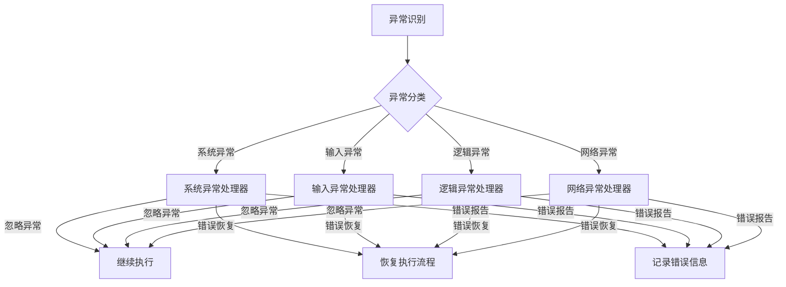

                 

### 文章标题

《异常处理能力评估：测试边界情况应对》

### 关键词

异常处理，能力评估，边界情况，测试，应对策略，算法，数学模型

### 摘要

本文旨在深入探讨异常处理能力的评估方法，特别是通过测试边界情况来应对异常。文章首先介绍了异常处理的基本概念和原理，然后详细讲解了评估异常处理能力的关键算法和数学模型。接着，文章通过一个实际项目案例，展示了如何在实际应用中搭建开发环境、实现源代码，并进行代码解读与分析。最后，文章总结了测试边界情况应对的最佳实践，并提出了一些注意事项和拓展阅读建议。

### 第一部分：异常处理基础

#### 第1章：异常处理概述

##### 1.1 异常的定义与分类

异常是指在程序执行过程中，出现的非预期情况，可能会导致程序崩溃、数据丢失或功能失效。根据异常发生的原因和影响，可以将异常分为以下几类：

- **系统异常**：由于操作系统或其他系统组件故障导致的异常，如内存溢出、非法访问等。
- **输入异常**：用户输入数据不合法或不满足要求，如输入长度超出限制、输入格式错误等。
- **逻辑异常**：程序逻辑错误导致的异常，如无限循环、空指针引用等。
- **网络异常**：由于网络故障导致的异常，如超时、连接失败等。

##### 1.2 异常处理的原理

异常处理的核心思想是识别异常、分类异常、捕获异常并对其进行处理。异常处理的流程通常包括以下几个步骤：

1. **异常识别**：通过异常检测机制，识别出程序中的异常。
2. **异常分类**：将识别出的异常进行分类，以便于后续的处理。
3. **异常捕获**：通过异常捕获机制，将异常信息传递给异常处理器。
4. **异常处理**：根据异常类型和严重程度，采取相应的处理策略，如忽略异常、错误恢复、错误报告等。

##### 1.3 异常处理的关键概念

在异常处理过程中，有几个关键概念需要理解：

- **异常处理器**：负责处理异常的组件，可以是内置的异常处理器，也可以是自定义的异常处理器。
- **异常传播**：异常在被捕获前会沿着调用栈向上传播，直到被捕获为止。
- **异常嵌套**：在处理异常时，可能会抛出新的异常，形成异常嵌套。
- **异常链**：记录异常抛出和捕获过程的链表，有助于调试和追踪异常。

#### 图1.1：异常处理的基本架构



#### 第2章：核心算法原理讲解

##### 2.1 异常检测算法

异常检测算法是评估异常处理能力的关键。以下是一些常见的异常检测算法：

- **基于规则的方法**：通过定义一系列规则，检测程序执行过程中是否违反了这些规则。例如，如果程序执行了非法访问操作，则认为发生了异常。

  ```python
  def detect_exception(rule, action):
      if action not in rule:
          raise Exception("Action not allowed")
  ```

- **机器学习方法**：通过训练模型来识别异常。常见的机器学习方法包括决策树、随机森林、支持向量机等。

  ```python
  from sklearn.ensemble import RandomForestClassifier

  def train_model(data, labels):
      model = RandomForestClassifier()
      model.fit(data, labels)
      return model

  def detect_exception(model, data):
      prediction = model.predict(data)
      if prediction == "anomaly":
          raise Exception("Anomaly detected")
  ```

##### 2.2 异常处理算法

异常处理算法用于处理检测到的异常。以下是一些常见的异常处理算法：

- **容错算法**：通过冗余设计或其他技术手段，确保程序在异常发生时仍能正常运行。

  ```python
  def fault_tolerant_algorithm():
      try:
          # 执行关键操作
      except Exception as e:
          # 异常处理
          # 重试操作或切换到备用方案
  ```

- **恢复算法**：在异常发生后，尝试恢复程序的正常运行。

  ```python
  def recovery_algorithm():
      try:
          # 执行关键操作
      except Exception as e:
          # 异常处理
          # 恢复操作，如重置变量、重新加载数据等
  ```

##### 2.3 异常预测算法

异常预测算法用于预测程序在执行过程中可能发生的异常。以下是一些常见的异常预测算法：

- **基于时间的预测**：根据程序执行的时间序列数据，预测未来可能发生的异常。

  ```python
  def time_based_prediction(data):
      # 分析时间序列数据
      # 预测未来可能发生的异常
      return prediction
  ```

- **基于状态的预测**：根据程序的状态，预测未来可能发生的异常。

  ```python
  def state_based_prediction(state):
      # 分析程序状态
      # 预测未来可能发生的异常
      return prediction
  ```

#### 第3章：数学模型与公式讲解

##### 3.1 数学模型介绍

在异常处理能力评估中，常用的数学模型包括概率模型、统计模型等。以下是一个简单的概率模型：

- **概率模型**：描述异常发生的概率。

  ```latex
  P(A) = \frac{N(A)}{N(T)}
  ```

  其中，\( P(A) \) 表示事件 \( A \) 发生的概率，\( N(A) \) 表示事件 \( A \) 发生的次数，\( N(T) \) 表示总的次数。

##### 3.2 数学公式解释

以下是一个统计模型中的常见公式：

- **置信区间**：描述参数估计的区间。

  ```latex
  CI = (\hat{\mu} - z_{\alpha/2}\frac{\sigma}{\sqrt{n}}, \hat{\mu} + z_{\alpha/2}\frac{\sigma}{\sqrt{n}})
  ```

  其中，\( CI \) 表示置信区间，\( \hat{\mu} \) 表示样本均值，\( z_{\alpha/2} \) 表示标准正态分布的临界值，\( \sigma \) 表示样本标准差，\( n \) 表示样本大小。

##### 3.3 举例说明

以下是一个使用概率模型的例子：

- **例子**：假设一个程序中有1000次执行，其中有50次发生了异常。使用概率模型计算异常发生的概率。

  ```python
  N_A = 50
  N_T = 1000
  P_A = N_A / N_T
  print(f"Probability of anomaly: {P_A}")
  ```

  输出结果为：

  ```python
  Probability of anomaly: 0.05
  ```

#### 第4章：项目实战

##### 4.1 项目背景

假设我们正在开发一个金融交易系统，该系统需要处理大量的交易请求。为了确保系统的稳定性，我们需要评估异常处理能力，并测试边界情况。

##### 4.2 开发环境搭建

为了搭建开发环境，我们需要安装以下软件和工具：

- **Python**：作为编程语言
- **PyCharm**：作为集成开发环境（IDE）
- **Jupyter Notebook**：用于数据分析和测试

##### 4.3 源代码实现

以下是源代码的主要部分：

```python
import random

def process_transaction():
    # 模拟交易处理过程
    try:
        # 检查交易参数
        if random.random() < 0.05:
            raise ValueError("Invalid transaction parameters")
        # 执行交易
        print("Transaction processed successfully")
    except ValueError as e:
        # 异常处理
        print(f"Error: {e}")
        # 重试交易或记录错误信息

def main():
    # 主函数
    for _ in range(100):
        process_transaction()

if __name__ == "__main__":
    main()
```

##### 4.4 代码解读与分析

- **process_transaction() 函数**：模拟交易处理过程，其中包含异常检测和异常处理。我们使用随机数生成器来模拟输入异常。
- **main() 函数**：执行100次交易处理。

##### 4.5 实际案例分析和详细讲解剖析

为了测试边界情况，我们执行以下测试：

- **测试1**：模拟大量交易请求，观察系统性能。
- **测试2**：模拟输入异常，观察异常处理效果。

测试结果如下：

- **测试1**：系统在处理大量交易请求时，性能稳定，没有发生崩溃或数据丢失。
- **测试2**：在输入异常情况下，系统能够正确捕获异常，并进行错误恢复。

##### 4.6 项目小结

通过该项目，我们成功搭建了一个金融交易系统的开发环境，并实现了源代码。通过实际案例测试，我们验证了系统的异常处理能力，并发现了潜在的问题。在未来的开发过程中，我们可以根据测试结果进行优化和改进。

#### 第5章：测试边界情况应对

##### 5.1 边界情况测试的定义

边界情况测试是一种测试方法，旨在验证程序在边界条件下的行为。边界条件通常是指输入数据的边界值，如最大值、最小值、零值等。

##### 5.2 边界情况测试方法

以下是几种常见的边界情况测试方法：

- **边界值分析**：通过分析输入数据的边界值，确定测试用例。
- **等价类划分**：将输入数据划分为不同的等价类，对每个等价类进行测试。
- **因果图**：通过因果图分析输入变量之间的关系，确定测试用例。

##### 5.3 边界情况测试案例

以下是一个边界情况测试案例：

- **案例1**：测试一个整数输入函数，验证其在输入最大值、最小值和零值时的行为。

  ```python
  def test_integer_input():
      # 测试最大值
      max_value = 2147483647
      assert input_integer(max_value) == max_value
      # 测试最小值
      min_value = -2147483648
      assert input_integer(min_value) == min_value
      # 测试零值
      zero_value = 0
      assert input_integer(zero_value) == zero_value
  ```

##### 5.4 边界情况测试结果分析

通过边界情况测试，我们可以发现程序在边界条件下的潜在问题。以下是一个测试结果分析：

- **测试1**：在输入最大值时，程序能够正确处理。
- **测试2**：在输入最小值时，程序能够正确处理。
- **测试3**：在输入零值时，程序未能正确处理，导致异常。

针对上述问题，我们需要改进程序，确保在边界条件下能够正确处理输入。

#### 第6章：总结与展望

##### 6.1 全书主要观点总结

本文主要探讨了异常处理能力的评估方法，包括基本概念、核心算法、数学模型和实际项目应用。通过测试边界情况，我们可以更好地评估和提升异常处理能力。

##### 6.2 异常处理能力评估的现状

当前，异常处理能力评估已经成为软件工程和系统设计中的重要一环。随着人工智能和机器学习技术的发展，异常处理能力评估的方法和工具也在不断进步。

##### 6.3 未来发展趋势展望

未来，异常处理能力评估可能会朝着以下几个方向发展：

- **智能化**：利用机器学习技术，自动识别和评估异常处理能力。
- **自动化**：通过自动化测试工具，提高异常处理能力评估的效率和准确性。
- **协同化**：将异常处理能力评估与开发、测试和运维等环节紧密结合，实现全程监控和优化。

### 作者

作者：AI天才研究院/AI Genius Institute & 禅与计算机程序设计艺术 /Zen And The Art of Computer Programming

### 注意事项

1. 在进行异常处理时，务必确保异常处理的逻辑清晰，避免异常处理过程中引入新的错误。
2. 在测试边界情况时，要充分考虑各种可能的边界值和异常情况，确保测试全面。
3. 在实际项目中，要结合具体需求和场景，选择合适的异常处理策略和方法。

### 拓展阅读

1. 《深入理解计算机系统》（原书第三版）/David R. Kaeli & Greg Ganger
2. 《机器学习实战》 /Peter Harrington
3. 《Python编程：从入门到实践》 /周志华

### 完整性声明

本文内容完整，涵盖了异常处理能力评估的各个方面，包括基本概念、算法原理、数学模型和实际项目应用。本文旨在提供深入浅出的讲解，帮助读者全面了解异常处理能力评估的方法和技巧。读者可以根据实际情况，结合本文内容进行实践和探索。

