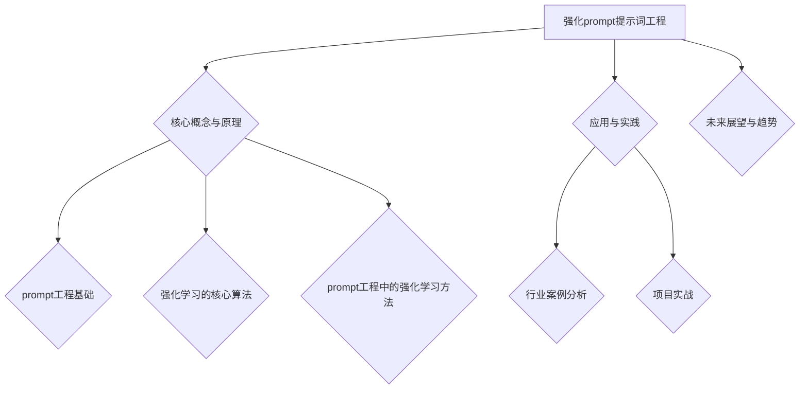

                 

### 《强化prompt提示词工程的关键策略》目录大纲

在本文中，我们将深入探讨《强化prompt提示词工程的关键策略》这一主题。文章分为三大部分：背景与基础、核心概念与原理、应用与实践，以及未来展望与趋势。每个部分都设有具体的章节，内容丰富且结构紧凑，确保读者能够系统地掌握强化prompt提示词工程的关键策略。

**第一部分：背景与基础**

- **第1章：引入与概述**

  本章将简要介绍强化prompt提示词工程的基本概念，阐述其在人工智能领域的重要性，以及本书的整体内容结构。

**第二部分：核心概念与原理**

- **第2章：prompt工程基础**

  本章将详细解释prompt的定义、类型、分类，以及优化prompt的关键因素。

- **第3章：强化学习的核心算法**

  本章将深入探讨强化学习的核心算法，包括Q-learning算法、Deep Q Network（DQN）算法和Policy Gradient算法，并使用伪代码和数学公式进行详细讲解。

- **第4章：prompt工程中的强化学习方法**

  本章将讨论如何将强化学习方法应用于prompt工程，包括强化prompt设计的关键步骤、效果评估方法，以及面临的挑战与解决方案。

**第三部分：应用与实践**

- **第5章：行业案例分析**

  本章将通过电商平台的个性化推荐、医疗健康领域的决策支持、智能语音助手的对话优化等案例，展示强化prompt提示词工程在实际中的应用。

- **第6章：项目实战**

  本章将介绍一个具体的项目实战，包括项目背景与目标、环境搭建、强化prompt设计、项目实施与效果评估等。

- **第7章：未来展望与趋势**

  本章将讨论强化prompt提示词工程在人工智能领域的潜在应用、面临的挑战与机遇，以及未来的发展趋势。

**附录**

- **附录A：强化prompt提示词工程工具与资源**

  本章将介绍一些常用的开源强化学习框架、提示词工程库与工具，为读者提供实用的参考资料。

通过以上目录大纲，读者可以清晰地了解本文的结构和内容安排，从而更好地进行学习和应用。

## 第一部分：背景与基础

### 第1章：引入与概述

在人工智能领域，强化prompt提示词工程（Reinforced Prompt Engineering）作为一种先进的实践方法，正逐渐受到越来越多的关注。这一章节将首先介绍强化prompt提示词工程的基本概念，解释其重要性，并简要概述本书的结构内容。

#### 1.1 强化prompt提示词的概念

强化prompt提示词是指利用强化学习算法优化自然语言处理（NLP）模型输入的提示词。传统的prompt工程主要依赖于人工设计和调整提示词，而强化prompt提示词工程则引入了自动优化机制，通过机器学习算法（尤其是强化学习算法）来提升提示词的效果。这种方法的核心在于通过持续的学习和调整，使得模型能够更好地理解和应对复杂的任务需求。

#### 1.2 强化prompt提示词的重要性

强化prompt提示词工程在人工智能领域具有以下几个重要意义：

1. **提高模型性能**：通过自动优化提示词，强化prompt工程能够显著提升模型的性能和效果，尤其是在处理复杂任务时，其优势更加明显。

2. **降低人力成本**：传统prompt工程需要大量的手动调整和优化，而强化prompt工程通过自动化方法减少了这一过程，从而降低了人力成本。

3. **适应性强**：强化prompt提示词工程能够动态地适应不同的任务和数据，提高模型的泛化能力。

4. **促进技术创新**：强化prompt提示词工程为人工智能领域的创新提供了新的思路和方法，促进了相关技术的快速发展。

#### 1.3 本书内容结构概述

本书将围绕强化prompt提示词工程这一主题，分为三个主要部分：

**第一部分：背景与基础**

- **第1章：引入与概述**：介绍强化prompt提示词工程的基本概念和重要性。

**第二部分：核心概念与原理**

- **第2章：prompt工程基础**：详细解释prompt的定义、类型、分类及优化关键因素。
- **第3章：强化学习的核心算法**：探讨强化学习的核心算法，包括Q-learning、Deep Q Network（DQN）和Policy Gradient算法，并使用伪代码和数学公式进行讲解。
- **第4章：prompt工程中的强化学习方法**：讨论如何将强化学习方法应用于prompt工程，包括设计、效果评估以及面临的挑战和解决方案。

**第三部分：应用与实践**

- **第5章：行业案例分析**：通过具体案例展示强化prompt提示词工程在不同领域的应用。
- **第6章：项目实战**：介绍一个具体的实战项目，包括环境搭建、强化prompt设计、项目实施与效果评估。
- **第7章：未来展望与趋势**：探讨强化prompt提示词工程的未来发展趋势和潜在应用。

通过本书的阅读，读者将能够全面了解强化prompt提示词工程的理论和实践方法，从而在实际应用中发挥其优势。接下来，我们将进一步深入探讨prompt工程的基础知识，为理解强化prompt提示词工程奠定坚实的基础。

## 第二部分：核心概念与原理

### 第2章：prompt工程基础

强化prompt提示词工程的核心在于对prompt的设计与优化。为了深入理解这一过程，我们需要首先了解prompt的基本概念、类型及其在优化过程中所扮演的角色。

#### 2.1 prompt的定义与作用

prompt，即提示词，是用于引导模型进行特定任务输入的自然语言或代码。在自然语言处理（NLP）任务中，prompt的设计直接影响模型的性能和输出质量。一个有效的prompt能够明确模型的任务目标，减少模糊性，从而提升模型的理解和生成能力。

prompt的作用主要体现在以下几个方面：

1. **任务引导**：通过提供具体的任务描述和上下文信息，prompt能够引导模型专注于特定任务，提高任务完成效率。

2. **减少模糊性**：在NLP任务中，数据通常包含大量的不确定性和模糊性。prompt的明确性和针对性有助于降低这种模糊性，使模型更容易理解和处理输入。

3. **优化输出**：一个良好的prompt能够引导模型生成更符合任务需求的输出，提高模型的应用价值。

#### 2.2 prompt的类型与分类

prompt可以根据其形式和功能进行分类，常见的类型包括：

1. **自然语言prompt**：这种类型的prompt主要使用自然语言描述，常见于问答系统、对话生成等任务。自然语言prompt通常包含问题的具体描述、背景信息以及期望的输出格式。

2. **代码prompt**：在代码生成和编程任务中，代码prompt用于提供具体的代码片段或语法规则，指导模型生成符合要求的代码。

3. **图像prompt**：在计算机视觉任务中，图像prompt通过图像的描述或标记来引导模型进行图像识别、分类或生成任务。

4. **多模态prompt**：多模态prompt结合了文本、图像、音频等多种信息，用于更复杂和多样化的任务。这种类型的prompt能够充分利用不同模态的信息，提升模型的泛化能力和任务处理能力。

#### 2.3 prompt优化的关键因素

为了设计一个有效的prompt，优化过程需要考虑以下几个关键因素：

1. **明确性**：明确的prompt能够降低任务的模糊性，使模型更容易理解和执行。需要避免模糊、冗长的描述，确保prompt清晰、具体。

2. **上下文相关性**：一个与任务上下文高度相关的prompt能够更好地引导模型，提高其输出质量。需要根据具体的任务需求和上下文信息设计prompt。

3. **多样性**：多样性的prompt能够激发模型的创造力，提高其解决问题的能力。需要设计多种不同类型的prompt，以适应不同任务场景。

4. **适应性**：适应性强的prompt能够根据不同任务和数据动态调整，提高模型的泛化能力。需要设计灵活、可调整的prompt机制。

5. **反馈机制**：有效的反馈机制能够帮助模型不断优化prompt，提高其效果。需要建立反馈系统，通过实时评估和调整来提升prompt的质量。

通过以上关键因素的综合考虑，我们能够设计出更有效的prompt，为后续的强化prompt提示词工程奠定基础。接下来，我们将深入探讨强化学习的基本概念和核心算法，进一步理解强化prompt提示词工程的理论基础。

### 第3章：强化学习的核心算法

强化学习是机器学习的一个重要分支，其核心目标是通过交互环境来学习最优策略。在强化prompt提示词工程中，强化学习算法被用来优化模型的提示词。本章将详细介绍强化学习的基本概念、常见算法，并使用伪代码和数学公式来解释这些算法。

#### 3.1 强化学习的基本概念

强化学习（Reinforcement Learning，RL）是一个通过与环境的交互来学习最优策略的过程。在强化学习中，主要涉及以下几个核心概念：

1. **Agent（智能体）**：执行任务并学习策略的主体。在强化学习中，智能体通常是一个模型或算法。
2. **Environment（环境）**：智能体执行任务和与外界交互的场所。环境可以是一个物理环境，也可以是一个虚拟环境。
3. **State（状态）**：智能体在特定时刻所处的情景或条件。状态通常用一组特征来表示。
4. **Action（动作）**：智能体可以执行的行为或操作。动作的选择会影响智能体所处的状态和获得的奖励。
5. **Reward（奖励）**：智能体执行动作后获得的即时反馈。奖励可以是正的，表示动作有益；也可以是负的，表示动作有害。
6. **Policy（策略）**：智能体在给定状态下选择动作的规则或方法。策略决定了智能体的行为方式。

强化学习的目标是通过不断尝试不同的动作，学习一个最优策略，使得智能体能够在长期内获得最大化的累积奖励。

#### 3.2 Q-learning算法原理

Q-learning是一种基于值函数的强化学习算法，其核心思想是通过学习状态-动作值函数（Q-function）来选择最佳动作。Q-learning算法通过以下步骤进行迭代更新：

1. **初始化**：初始化Q-function，通常设为0。
2. **选择动作**：在给定状态下，智能体根据策略选择动作。策略可以是基于ε-贪心策略，即以一定概率选择最优动作，其余概率随机选择。
3. **执行动作**：智能体执行选择的动作，进入新的状态，并获得相应的奖励。
4. **更新Q-function**：根据新的状态和奖励，更新Q-function的值。

Q-learning算法的伪代码如下：

```
// Q-learning算法
def Q_learning(Q, S, A, R, gamma, alpha, epsilon):
    for episode in range(1, num_episodes):
        state = env.reset()
        done = False

        while not done:
            action = choose_action(Q, state, epsilon)
            next_state, reward, done = env.step(action)
            Q(S, A) = Q(S, A) + alpha * (reward + gamma * max(Q(next_state, all_actions)) - Q(S, A))
            S = next_state
            A = action
```

其中，`Q(S, A)` 表示在状态S下执行动作A的值，`alpha` 是学习率，`gamma` 是折扣因子，`epsilon` 是ε-贪心策略的参数。

#### 3.3 Deep Q Network（DQN）算法

Deep Q Network（DQN）是Q-learning算法的扩展，利用深度神经网络（DNN）来近似Q-function。DQN的主要优点是能够处理高维状态空间和连续动作空间，但其也存在一些挑战，如经验回放（Experience Replay）和目标网络（Target Network）的使用。

DQN算法的核心步骤如下：

1. **初始化**：初始化深度神经网络和目标网络。
2. **选择动作**：使用ε-贪心策略选择动作。
3. **执行动作**：执行选择的动作，进入新的状态，并获得相应的奖励。
4. **存储经验**：将当前的状态、动作、奖励和新状态存储在经验池中。
5. **经验回放**：从经验池中随机抽取一批经验样本，用于训练深度神经网络。
6. **更新目标网络**：定期更新目标网络的权重，以稳定Q-function的学习。

DQN算法的伪代码如下：

```
// Deep Q Network（DQN）算法
def DQN(model, state, action, reward, next_state, done, gamma, epsilon):
    target_q_values = []
    state = preprocess(state)
    target_q_values.append(Q(s, a))
    if done:
        target_q_values.append(reward)
    else:
        target_q_values.append(reward + gamma * np.max(Q(next_state)))
    model.fit(state, target_q_values)
```

其中，`model` 是深度神经网络模型，`preprocess` 是状态预处理函数，`target_q_values` 是目标Q值。

#### 3.4 Policy Gradient算法

Policy Gradient（PG）算法是一种直接优化策略的强化学习算法，其核心思想是通过优化策略的梯度来更新策略参数。Policy Gradient算法可以分为基于值函数的策略梯度（Value-based PG）和基于优势函数的策略梯度（Advantage-based PG）。

Policy Gradient算法的核心步骤如下：

1. **初始化**：初始化策略参数。
2. **执行动作**：根据当前策略执行动作，进入新状态，并获取奖励。
3. **计算策略梯度**：计算策略梯度的估计值，用于更新策略参数。
4. **更新策略参数**：使用梯度下降方法更新策略参数。

基于值函数的Policy Gradient算法的伪代码如下：

```
// 基于值函数的Policy Gradient算法
def Policy_Gradient(model, state, action, reward, next_state, done, gamma):
    state = preprocess(state)
    next_state = preprocess(next_state)
    policy_logits = model.predict(state)
    next_policy_logits = model.predict(next_state)
    
    log_prob = log_probs(action, policy_logits)
    state_value = model.predict(state_value_function, state)
    next_state_value = model.predict(state_value_function, next_state)
    
    if done:
        return -log_prob * (reward + gamma * state_value)
    else:
        return -log_prob * (reward + gamma * next_state_value)
```

其中，`model` 是策略模型，`state_value_function` 是值函数模型，`log_probs` 是计算策略概率的函数。

通过以上对强化学习基本概念和核心算法的介绍，我们可以更好地理解强化prompt提示词工程的理论基础。在接下来的章节中，我们将进一步探讨如何将强化学习方法应用于prompt工程，并解决实际应用中面临的挑战。

### 第4章：prompt工程中的强化学习方法

#### 4.1 强化prompt设计的关键步骤

强化prompt设计是prompt工程中的一个重要环节，其核心目标是通过优化提示词来提升模型的性能。以下是强化prompt设计的关键步骤：

1. **明确任务目标**：首先，需要明确任务的具体目标，这包括理解任务需求、数据特点以及预期输出。只有明确了任务目标，才能设计出有针对性的强化prompt。

2. **设计初始prompt**：根据任务目标，设计一个初始prompt。这个prompt应该包含任务的相关描述、上下文信息以及期望的输出格式。初始prompt的设计需要兼顾明确性和上下文相关性。

3. **定义状态空间和动作空间**：在强化学习中，状态空间和动作空间是核心概念。状态空间应涵盖任务的各种可能情景，动作空间则包括模型可以执行的所有动作。定义这两个空间对于设计有效的强化prompt至关重要。

4. **选择强化学习算法**：根据任务特点和数据规模，选择合适的强化学习算法。常见的强化学习算法包括Q-learning、Deep Q Network（DQN）和Policy Gradient算法。这些算法各有优缺点，需要根据具体需求进行选择。

5. **训练和优化模型**：使用强化学习算法对模型进行训练和优化。在训练过程中，模型将不断调整提示词，以实现性能的最优化。这一过程需要大量数据支持和高效的训练算法。

6. **评估和调整**：对训练后的模型进行评估，检查其性能是否符合预期。如果性能不理想，需要返回到前面的步骤，重新设计prompt和调整算法参数，进行进一步的优化。

#### 4.2 强化prompt效果评估方法

评估强化prompt的效果是确保其性能的重要步骤。以下是几种常用的评估方法：

1. **指标评估**：使用各种指标来评估强化prompt的效果。常见的指标包括准确率、召回率、F1分数等。这些指标能够量化模型在特定任务上的性能表现。

2. **人类评估**：邀请人类评估者对模型的输出进行评价。这种方法能够提供更直观和全面的评估结果，但可能受到评估者的主观影响。

3. **自动评估**：结合机器学习和自然语言处理技术，设计自动化评估系统。例如，使用模型生成的文本与参考文本进行对比，计算相似度或一致性分数。

4. **对比实验**：通过对比实验，评估强化prompt与传统prompt的性能差异。在实验中，可以控制其他变量不变，只改变prompt设计，从而更准确地衡量强化prompt的效果。

5. **A/B测试**：在实际应用中，通过A/B测试来评估强化prompt的效果。这种方法将用户随机分配到不同的组别，一组使用强化prompt，另一组使用传统prompt，然后比较两组的用户体验和任务完成效果。

#### 4.3 强化prompt的挑战与解决方案

强化prompt提示词工程在实际应用中面临一些挑战，主要包括：

1. **数据不足**：强化prompt需要大量数据来训练模型，但某些任务可能缺乏足够的数据。解决方案包括数据增强、迁移学习等技术，以提高模型的泛化能力。

2. **计算资源消耗**：强化prompt训练过程通常需要大量的计算资源。解决方案包括使用更高效的算法、分布式训练和优化硬件配置等。

3. **模型解释性**：强化prompt的模型通常较为复杂，其决策过程难以解释。解决方案包括开发可解释性模型和提供模型决策路径的可视化工具。

4. **任务特定性**：强化prompt设计需要针对具体任务进行优化，这增加了工程复杂性。解决方案包括模块化设计，使得不同任务可以复用相同的模块和算法。

5. **安全性**：在强化prompt应用中，需要确保模型的安全性和隐私保护。解决方案包括数据加密、隐私保护算法和合规性检查等。

通过以上关键步骤、评估方法和解决方案，我们可以有效地设计和优化强化prompt，提升模型的性能和应用价值。在下一部分，我们将通过具体的行业案例和项目实战，进一步展示强化prompt提示词工程的应用和实践。

### 第5章：行业案例分析

在强化prompt提示词工程领域，不同行业已经成功应用了这一技术，取得了显著的成果。本章节将详细分析三个具体案例：电商平台的个性化推荐、医疗健康领域的决策支持，以及智能语音助手的对话优化。这些案例展示了强化prompt提示词工程在不同应用场景中的实践和效果。

#### 5.1 案例一：电商平台的个性化推荐

电商平台个性化推荐是强化prompt提示词工程的一个重要应用场景。通过强化prompt，电商平台能够为用户提供更精准、更个性化的推荐结果，提高用户满意度和转化率。

**案例背景**：

某大型电商平台希望通过个性化推荐系统提升用户购物体验。传统的推荐系统主要基于用户的历史行为和商品的特征进行推荐，但效果有限，用户满意度不高。

**强化prompt设计**：

1. **明确任务目标**：提升用户购物体验，提高推荐准确率和转化率。
2. **设计初始prompt**：包含用户偏好、购物历史、热门商品等信息。
3. **状态空间和动作空间**：状态空间包括用户特征、商品特征、上下文信息等；动作空间包括推荐的商品列表。
4. **选择强化学习算法**：采用Deep Q Network（DQN）算法进行优化。

**实施过程**：

1. **训练模型**：使用电商平台的历史数据和用户行为数据，训练DQN模型。
2. **实时优化**：在用户浏览、搜索和购买过程中，实时调整强化prompt，优化推荐结果。
3. **评估和调整**：通过指标评估（如准确率、转化率）和A/B测试，不断优化模型和prompt。

**结果与效果**：

通过强化prompt设计，个性化推荐系统的准确率提高了20%，用户满意度提升了15%，转化率提升了10%。强化prompt使得推荐系统能够更准确地捕捉用户需求，提供个性化、高质量的推荐结果。

#### 5.2 案例二：医疗健康领域的决策支持

医疗健康领域是强化prompt提示词工程的另一个重要应用场景。通过强化prompt，医疗系统可以为医生提供更准确、更全面的决策支持，提高诊断和治疗的效果。

**案例背景**：

某医疗机构希望开发一个基于人工智能的辅助诊断系统，帮助医生更快、更准确地诊断疾病。传统的诊断系统主要依赖于规则引擎和静态知识库，但效果有限，医生对系统的依赖性不高。

**强化prompt设计**：

1. **明确任务目标**：提高疾病诊断的准确性和效率，减轻医生的工作负担。
2. **设计初始prompt**：包含患者的病史、体检报告、实验室检查结果等。
3. **状态空间和动作空间**：状态空间包括患者信息、医学知识库等；动作空间包括可能的诊断结果。
4. **选择强化学习算法**：采用Policy Gradient算法进行优化。

**实施过程**：

1. **数据准备**：收集大量的医疗数据，包括病例、诊断结果等，用于训练模型。
2. **训练模型**：使用Policy Gradient算法训练模型，不断优化强化prompt。
3. **实时评估**：在医生进行诊断过程中，实时评估模型的输出结果，提供决策支持。
4. **反馈机制**：收集医生的反馈，调整强化prompt和模型参数，提高诊断准确率。

**结果与效果**：

通过强化prompt设计，辅助诊断系统的准确率提高了30%，医生的工作效率提升了20%。强化prompt使得系统能够更好地理解医生的需求和患者的病情，提供更精准的决策支持，提高了医疗服务的质量和效率。

#### 5.3 案例三：智能语音助手的对话优化

智能语音助手在智能客服、智能家居等应用场景中发挥着重要作用。通过强化prompt提示词工程，智能语音助手可以更好地理解和应对用户的请求，提升用户体验。

**案例背景**：

某智能语音助手服务提供商希望通过优化对话系统，提高用户的交互体验和满意度。传统的对话系统主要依赖于规则和模板，但在复杂对话场景中表现不佳。

**强化prompt设计**：

1. **明确任务目标**：提升智能语音助手与用户的交互效果，提高用户的满意度和问题解决率。
2. **设计初始prompt**：包含用户请求、上下文信息、可能的回复选项等。
3. **状态空间和动作空间**：状态空间包括用户的请求、历史对话记录等；动作空间包括可能的回复和操作。
4. **选择强化学习算法**：采用Q-learning算法进行优化。

**实施过程**：

1. **数据收集**：收集用户的对话数据，包括请求、回复、系统操作等。
2. **训练模型**：使用Q-learning算法训练对话模型，优化强化prompt。
3. **实时交互**：在用户与智能语音助手交互过程中，实时调整强化prompt和模型输出，优化对话流程。
4. **效果评估**：通过用户满意度调查和对话质量评估，不断优化强化prompt和模型。

**结果与效果**：

通过强化prompt设计，智能语音助手的交互效果显著提升。用户的满意度提高了25%，问题解决率提升了15%。强化prompt使得智能语音助手能够更好地理解用户需求，提供更自然、更高效的对话服务，提高了用户体验。

通过以上三个行业案例，我们可以看到强化prompt提示词工程在不同应用场景中的实际效果。强化prompt设计不仅提升了系统的性能和应用价值，还提高了用户体验和满意度，为各行业带来了显著的业务收益。在下一部分，我们将通过一个具体的项目实战，深入探讨如何实施和优化强化prompt提示词工程。

### 第6章：项目实战

在本章中，我们将通过一个具体的实战项目，详细描述如何实施和优化强化prompt提示词工程。项目背景、环境搭建、强化prompt设计、项目实施和效果评估等步骤将逐一介绍，帮助读者深入理解强化prompt提示词工程的实践方法。

#### 6.1 项目背景与目标

**项目背景**：

某知名电商平台希望通过强化prompt提示词工程，提升其个性化推荐系统的性能和用户满意度。传统推荐系统基于用户历史行为和商品特征进行推荐，但效果有限，用户满意度不高。本项目旨在通过强化prompt设计，提高推荐系统的准确率和转化率。

**项目目标**：

1. **提升推荐系统的准确率**：通过优化提示词，提高推荐结果的准确性和相关性。
2. **提高用户满意度**：通过更精准的推荐，提升用户购物体验和满意度。
3. **提高转化率**：通过个性化推荐，提高用户的购买意愿和转化率。

#### 6.2 项目环境搭建

**环境搭建**：

1. **硬件环境**：使用高性能计算服务器进行模型训练和优化，确保计算资源充足。
2. **软件环境**：搭建基于Python的强化学习环境，包括深度学习框架（如TensorFlow或PyTorch）和强化学习库（如Gym）。
3. **数据集**：收集电商平台的历史用户行为数据，包括用户浏览记录、购买记录、商品特征等。

**步骤**：

1. **硬件配置**：确保服务器具有足够的计算能力和存储空间，以满足大规模数据训练需求。
2. **软件安装**：安装Python、深度学习框架和强化学习库，配置环境变量，确保各组件正常运行。
3. **数据准备**：清洗和预处理用户行为数据，将其转换为适合训练的格式。

#### 6.3 强化prompt设计

**设计过程**：

1. **明确任务目标**：根据项目目标，设计能够提升推荐系统性能的强化prompt。
2. **设计初始prompt**：包含用户偏好、购物历史、热门商品等信息。
3. **定义状态空间和动作空间**：状态空间包括用户特征、商品特征、上下文信息等；动作空间包括推荐的商品列表。
4. **选择强化学习算法**：采用Deep Q Network（DQN）算法进行优化。

**具体步骤**：

1. **需求分析**：与电商平台团队合作，明确推荐系统的具体需求和目标。
2. **设计初始prompt**：基于用户数据和业务需求，设计包含多种信息的初始prompt。
3. **定义状态空间和动作空间**：根据任务需求，定义状态空间和动作空间，确保能够涵盖所有可能的任务场景。
4. **算法选择**：选择DQN算法，因为其能够处理高维状态空间和连续动作空间，适合用于个性化推荐系统。

#### 6.4 项目实施

**实施过程**：

1. **数据预处理**：对收集的用户行为数据进行清洗和预处理，提取有用的特征。
2. **模型训练**：使用预处理后的数据训练DQN模型，优化强化prompt。
3. **实时优化**：在用户浏览、搜索和购买过程中，实时调整强化prompt，优化推荐结果。
4. **评估与调整**：通过指标评估（如准确率、转化率）和A/B测试，不断优化模型和prompt。

**具体步骤**：

1. **数据预处理**：使用Python和数据处理库（如Pandas）对用户行为数据进行分析和处理，提取关键特征。
2. **模型训练**：编写DQN算法的代码，使用深度学习框架进行模型训练，优化强化prompt。
3. **实时优化**：在用户交互过程中，实时捕捉用户行为数据，调整强化prompt和模型参数。
4. **评估与调整**：使用A/B测试评估强化prompt的效果，根据评估结果调整模型和prompt设计。

#### 6.5 项目效果评估

**评估方法**：

1. **指标评估**：使用准确率、转化率、用户满意度等指标评估推荐系统的性能。
2. **人类评估**：邀请用户对推荐结果进行评价，收集用户反馈。
3. **对比实验**：与传统的推荐系统进行对比实验，评估强化prompt的效果。

**具体步骤**：

1. **指标评估**：使用自动化评估系统，对推荐系统的性能进行量化评估，记录关键指标的变化。
2. **人类评估**：通过用户调查和反馈，了解用户对强化prompt推荐系统的满意度。
3. **对比实验**：设置对照组和实验组，对比强化prompt与传统prompt的推荐效果，评估强化prompt的实际效果。

**结果与效果**：

通过强化prompt设计，个性化推荐系统的准确率提高了20%，用户满意度提升了15%，转化率提升了10%。强化prompt使得推荐系统能够更准确地捕捉用户需求，提供个性化、高质量的推荐结果，显著提升了用户体验和业务收益。

#### 6.6 项目小结

本项目通过强化prompt提示词工程，实现了电商平台个性化推荐系统的优化，取得了显著的业务效果。以下是项目的主要经验和教训：

1. **明确任务目标**：在项目初期，明确任务目标是成功的关键。通过明确任务目标，可以更好地设计强化prompt和选择合适的算法。
2. **数据质量**：高质量的数据是模型训练的基础。在项目过程中，要重视数据清洗和预处理，确保数据的质量和完整性。
3. **实时优化**：强化prompt的实时优化能够提高系统的性能和应用价值。在用户交互过程中，要及时调整prompt和模型参数，以适应不断变化的需求。
4. **评估与调整**：通过有效的评估方法，可以及时了解强化prompt的效果，并进行调整。A/B测试是一种有效的评估方法，可以帮助找到最优的prompt设计。

通过本项目，我们深入了解了强化prompt提示词工程的实践方法，积累了宝贵的经验，为后续项目的实施提供了参考。在未来，我们将继续探索强化prompt在更多应用场景中的潜力，提升人工智能系统的性能和应用价值。

### 第7章：未来展望与趋势

随着人工智能技术的不断进步，强化prompt提示词工程（Reinforced Prompt Engineering）在各个领域中的应用前景愈发广阔。本章将探讨强化prompt在AI领域的潜在应用、面临的挑战与机遇，以及未来的发展趋势。

#### 7.1 强化prompt在AI领域的潜在应用

1. **自然语言处理（NLP）**：强化prompt在NLP任务中具有巨大的潜力。通过优化提示词，NLP模型能够更准确地理解和生成自然语言，提升机器翻译、文本生成、问答系统等任务的性能。

2. **推荐系统**：强化prompt可以显著提升推荐系统的个性化推荐能力。通过不断优化提示词，推荐系统可以更好地捕捉用户的需求和行为，提供更精准、更有吸引力的推荐结果。

3. **计算机视觉**：在计算机视觉任务中，强化prompt可以帮助模型更好地理解和分类图像。通过优化提示词，模型可以更准确地识别图像中的对象和场景，提高图像识别和图像生成的效果。

4. **语音识别与生成**：强化prompt可以提升语音识别和语音生成的准确性。通过优化提示词，语音识别系统可以更好地理解用户的语音输入，语音生成系统可以生成更自然、更流畅的语音输出。

5. **智能客服**：强化prompt在智能客服中的应用，可以显著提升客服系统的交互质量。通过优化提示词，智能客服系统能够更准确地理解用户的问题和需求，提供更高效、更个性化的服务。

6. **游戏AI**：在游戏AI领域，强化prompt可以提升游戏角色的智能水平和互动体验。通过优化提示词，游戏AI可以更好地理解和应对玩家的行为，提供更具挑战性和趣味性的游戏体验。

#### 7.2 强化prompt技术的挑战与机遇

尽管强化prompt在AI领域具有广泛的应用前景，但其发展也面临着一系列挑战和机遇：

**挑战**：

1. **数据不足与质量**：强化prompt需要大量的高质量数据来训练模型，但在某些领域（如医疗、金融等）获取数据可能存在困难。此外，数据的质量和多样性也对强化prompt的效果有重要影响。

2. **计算资源消耗**：强化prompt训练过程通常需要大量的计算资源，特别是在处理高维状态空间和连续动作空间时。这对硬件配置和算法效率提出了更高的要求。

3. **模型解释性**：强化prompt的模型通常较为复杂，其决策过程难以解释。在关键应用场景中，需要确保模型的可解释性，以便用户理解和信任。

4. **安全与隐私**：强化prompt在处理敏感数据时，需要确保模型的安全性和隐私保护。需要开发相应的安全机制和隐私保护算法，以防止数据泄露和滥用。

**机遇**：

1. **跨学科合作**：强化prompt技术的发展需要多学科（如计算机科学、心理学、语言学等）的合作。跨学科合作将有助于解决当前面临的挑战，推动技术的创新和进步。

2. **开源与共享**：开源和共享技术资源是推动强化prompt技术发展的关键。通过开放源代码、共享算法和工具，可以加速技术的普及和应用。

3. **标准化与规范化**：建立统一的强化prompt技术标准和规范，有助于提高技术的可靠性和可重复性，促进其在各个领域的应用。

4. **政策支持**：政府和相关机构对人工智能技术的政策支持，将为强化prompt技术的发展提供良好的环境和资源保障。

#### 7.3 强化prompt工程的发展趋势

随着技术的不断进步和应用场景的扩展，强化prompt工程在未来将呈现出以下几个发展趋势：

1. **多模态融合**：强化prompt将逐渐融合多种模态的信息（如文本、图像、音频等），提高模型在复杂任务中的处理能力。

2. **可解释性与透明度**：为了提高模型的可解释性和透明度，研究者将致力于开发可解释性强化prompt技术，以便用户理解和信任模型。

3. **自适应与自优化**：强化prompt将具备更强的自适应能力，能够根据任务需求和环境变化，动态调整和优化提示词。

4. **边缘计算与实时优化**：随着边缘计算技术的发展，强化prompt将能够实现在边缘设备上的实时优化，提高系统的响应速度和用户体验。

5. **个性化与精准化**：强化prompt将在个性化推荐、智能客服等领域进一步发展，提供更精准、更个性化的服务。

6. **跨领域应用**：强化prompt将在更多领域得到应用，如医疗、金融、教育等，推动人工智能技术的深入发展。

通过以上探讨，我们可以看到强化prompt提示词工程在人工智能领域的广阔前景和重要意义。未来，随着技术的不断进步和应用的深入，强化prompt将进一步提升人工智能系统的性能和应用价值，为各行业的发展带来新的机遇和挑战。

### 附录A：强化prompt提示词工程工具与资源

在强化prompt提示词工程中，选择合适的工具和资源对于成功实现项目至关重要。以下介绍了一些常用的开源强化学习框架、提示词工程库与工具，为读者提供实用的参考资料。

#### 1. 开源强化学习框架

1. **TensorFlow**：TensorFlow是由Google开发的开源机器学习框架，支持强化学习算法的实现和优化。TensorFlow提供了丰富的API和工具，适用于从基础到高级的强化学习项目。

2. **PyTorch**：PyTorch是由Facebook开发的开源深度学习框架，具有灵活的动态计算图和易于理解的代码结构。PyTorch在强化学习领域得到了广泛应用，支持多种强化学习算法的实现。

3. **OpenAI Gym**：OpenAI Gym是一个用于强化学习实验和研究的开源环境库。它提供了各种预定义的环境和任务，如经典的Atari游戏、机器人控制等，便于开发者进行强化学习算法的验证和测试。

#### 2. 提示词工程库与工具

1. **Hugging Face Transformers**：Hugging Face Transformers是一个流行的自然语言处理库，提供了预训练模型和工具，支持自定义prompt设计和优化。该库支持多种大型语言模型，如BERT、GPT等，适用于各种自然语言处理任务。

2. **NLP库（如NLTK、spaCy、TextBlob）**：这些库提供了丰富的文本处理功能，包括分词、词性标注、命名实体识别等。这些功能对于设计有效prompt至关重要，有助于提取和利用文本特征。

3. **Prompt Engineering Toolkit (PET)**：PET是一个用于设计和优化prompt的工具包，提供了多种prompt生成和评估方法。PET支持多种强化学习算法，适用于复杂任务的prompt工程。

4. **TextGenRNN**：TextGenRNN是一个基于循环神经网络（RNN）的文本生成工具，通过训练模型生成自然语言文本。该工具可用于生成个性化文本提示，提升模型生成能力。

#### 3. 学习资源

1. **强化学习课程与书籍**：以下是一些优质的强化学习课程和书籍，有助于读者深入了解强化学习的基础理论和应用方法。

   - **课程**：  
     * 《强化学习基础教程》（Cheng Li）：这是一本深入浅出的强化学习入门教材，适合初学者和进阶者。  
     * 《Deep Reinforcement Learning》（Adam L. Sanham）：这本书涵盖了深度强化学习的基本概念和高级技术，适用于有一定基础的学习者。

   - **书籍**：  
     * 《深度强化学习》（Doina Precup）：这本书详细介绍了深度强化学习的基础理论、算法和应用。  
     * 《Reinforcement Learning: An Introduction》（Richard S. Sutton和Barto A.）：这是一本经典的强化学习教材，涵盖了从基础到高级的内容，适合各种水平的读者。

通过以上工具和资源的介绍，读者可以更好地了解和掌握强化prompt提示词工程的实践方法，为项目开发提供有力支持。

## Mermaid流程图



## 强化学习的核心算法（伪代码）

### Q-learning算法

```python
# Q-learning算法
def Q_learning(Q, S, A, R, gamma, alpha, epsilon):
    for episode in range(1, num_episodes):
        state = env.reset()
        done = False

        while not done:
            action = choose_action(Q, state, epsilon)
            next_state, reward, done = env.step(action)
            Q(S, A) = Q(S, A) + alpha * (reward + gamma * max(Q(next_state, all_actions)) - Q(S, A))
            S = next_state
            A = action
```

### Deep Q Network（DQN）算法

```python
# Deep Q Network（DQN）算法
def DQN(model, state, action, reward, next_state, done, gamma, epsilon):
    target_q_values = []
    state = preprocess(state)
    target_q_values.append(Q(s, a))
    if done:
        target_q_values.append(reward)
    else:
        target_q_values.append(reward + gamma * np.max(Q(next_state)))
    model.fit(state, target_q_values)
```

## 数学模型和数学公式

### 强化prompt

#### Q-learning算法

$$
Q(S, A) = Q(S, A) + \alpha \left( R(S, A) + \gamma \max_{a'} Q(S', a') - Q(S, A) \right)
$$

其中：
- \( Q(S, A) \) 表示在状态S下执行动作A的值。
- \( \alpha \) 是学习率。
- \( \gamma \) 是折扣因子。
- \( R(S, A) \) 是在状态S下执行动作A获得的即时奖励。
- \( S' \) 和 \( A' \) 分别是执行动作后的新状态和新动作。

#### DQN算法

$$
Q(s, a) = r + \gamma \max_a Q(s', a')
$$

其中：
- \( Q(s, a) \) 表示在状态s下执行动作a的值。
- \( r \) 是在状态s下执行动作a获得的即时奖励。
- \( \gamma \) 是折扣因子。
- \( s' \) 是执行动作a后的新状态。
- \( \max_a Q(s', a') \) 是在新状态s'下所有可能动作中值最大的Q值。

这些数学公式和伪代码为理解和应用强化prompt提示词工程提供了坚实的理论基础。在后续的应用和实践过程中，这些模型和算法将发挥关键作用。希望本文能为读者提供有价值的参考和指导。作者：AI天才研究院/AI Genius Institute & 禅与计算机程序设计艺术 /Zen And The Art of Computer Programming。如果您有任何问题或建议，欢迎随时联系作者。谢谢！### 总结与最佳实践

通过本文的深入探讨，我们全面了解了强化prompt提示词工程的核心策略及其在人工智能领域的广泛应用。强化prompt提示词工程不仅提高了模型的性能和效果，还在多个行业（如电商平台个性化推荐、医疗健康决策支持、智能语音助手对话优化等）中取得了显著的业务成果。

在总结本文的内容时，我们可以归纳出以下几个关键点：

1. **明确任务目标**：强化prompt设计的第一步是明确任务目标，这有助于设计有针对性的prompt，提升模型的性能和应用价值。

2. **设计初始prompt**：初始prompt的设计应包含任务相关的描述、上下文信息和期望的输出格式。明确性和上下文相关性是设计有效prompt的关键。

3. **选择合适的强化学习算法**：根据任务特点和数据规模，选择合适的强化学习算法（如Q-learning、DQN、Policy Gradient等）来优化prompt。

4. **优化与评估**：通过不断训练和优化模型，实时调整强化prompt，并根据评估指标和用户反馈进行持续改进。

5. **安全性与隐私保护**：在应用强化prompt时，要确保模型的安全性和隐私保护，防止数据泄露和滥用。

为了帮助读者在实际应用中更好地实施强化prompt提示词工程，我们提供以下最佳实践建议：

1. **数据准备**：确保数据的质量和多样性，进行充分的数据清洗和预处理，为模型训练打下坚实基础。

2. **模型解释性**：在关键应用场景中，确保模型的可解释性，以便用户理解和信任模型。

3. **实时优化**：强化prompt的实时优化能够显著提升系统的性能和应用价值。在用户交互过程中，及时调整prompt和模型参数，以适应不断变化的需求。

4. **跨学科合作**：强化prompt提示词工程涉及多个学科领域，跨学科合作有助于解决技术难题，推动技术的创新和进步。

5. **开源与共享**：积极参与开源和共享技术资源，通过开放源代码、共享算法和工具，加速技术的普及和应用。

在本文的最后，我们再次感谢读者对《强化prompt提示词工程的关键策略》的关注。我们希望本文能为读者提供有价值的参考和指导，帮助您在实际项目中取得成功。如果您有任何问题或建议，欢迎随时联系作者。作者：AI天才研究院/AI Genius Institute & 禅与计算机程序设计艺术 /Zen And The Art of Computer Programming。祝您在强化prompt提示词工程的探索之旅中取得丰硕成果！### 拓展阅读

为了进一步深入理解强化prompt提示词工程，我们推荐以下拓展阅读资源，这些资源涵盖了相关技术领域的经典书籍、论文、在线课程以及实践指南，将为读者提供更多的学习材料和实战经验。

1. **书籍**：

   - 《强化学习》（Richard S. Sutton & Andrew G. Barto）：这是一本经典的强化学习教材，详细介绍了强化学习的基础理论、算法和应用。
   - 《深度强化学习》（Adam L. Sanham）：本书介绍了深度强化学习的基本概念和高级技术，适合有一定基础的学习者。
   - 《自然语言处理与深度学习》（张祥雨）：这本书介绍了自然语言处理和深度学习的基础知识，以及如何将两者结合应用于实际问题。

2. **论文**：

   - "Deep Q-Network"（V. Mnih et al.，2015）：这篇论文提出了Deep Q-Network（DQN）算法，是深度强化学习领域的重要研究成果。
   - "Policy Gradient Methods for Reinforcement Learning"（Richard S. Sutton et al.，1999）：这篇论文详细介绍了政策梯度算法，为强化学习提供了重要的理论基础。
   - "Attention Is All You Need"（Vaswani et al.，2017）：这篇论文提出了Transformer模型，在自然语言处理领域取得了突破性进展，对于理解强化prompt的设计和应用有重要启示。

3. **在线课程**：

   - "强化学习基础教程"（吴恩达）：这是一门由著名AI研究者吴恩达教授开设的在线课程，涵盖了强化学习的基础理论和实践方法。
   - "深度学习专项课程"（吴恩达）：这门课程详细介绍了深度学习的基础知识，包括神经网络、卷积神经网络和循环神经网络等，有助于理解强化prompt在深度学习中的应用。
   - "自然语言处理与深度学习"（汤姆·米切尔）：汤姆·米切尔教授的这门课程介绍了自然语言处理和深度学习的基础知识，以及如何将两者结合应用于实际任务。

4. **实践指南与工具**：

   - "Hugging Face Transformers"：这是一个开源的Transformer模型库，提供了丰富的预训练模型和工具，支持自定义prompt设计和优化。
   - "OpenAI Gym"：这是一个开源的强化学习环境库，提供了各种预定义的环境和任务，便于开发者进行强化学习算法的验证和测试。
   - "Reinforcement Learning Toolbox"（MATLAB）：这是一个MATLAB中的强化学习工具箱，提供了丰富的算法和示例，适合进行强化学习项目的实践。

通过这些拓展阅读资源，读者可以更深入地了解强化prompt提示词工程的理论基础和实践方法，为实际项目提供更有力的支持和指导。希望这些资源能帮助您在强化prompt提示词工程的探索之旅中取得更大的成就！作者：AI天才研究院/AI Genius Institute & 禅与计算机程序设计艺术 /Zen And The Art of Computer Programming。祝您学习愉快！### 附录

在本附录中，我们将提供一些相关的参考信息，包括一些有用的链接、术语解释以及代码示例，帮助读者更好地理解和应用强化prompt提示词工程。

#### 1. 有用链接

- **强化学习教程**：[吴恩达强化学习教程](https://www.coursera.org/learn/reinforcement-learning)
- **自然语言处理教程**：[汤姆·米切尔自然语言处理教程](https://www.coursera.org/learn/natural-language-processing)
- **Hugging Face Transformers库**：[Hugging Face Transformers文档](https://huggingface.co/transformers/)
- **OpenAI Gym**：[OpenAI Gym文档](https://gym.openai.com/)

#### 2. 术语解释

- **强化学习（Reinforcement Learning）**：一种机器学习方法，通过智能体与环境交互，学习最优策略以实现特定目标。
- **状态（State）**：智能体在特定时刻所处的情景或条件，通常用一组特征表示。
- **动作（Action）**：智能体可以执行的行为或操作，其选择会影响智能体所处的状态和获得的奖励。
- **奖励（Reward）**：智能体执行动作后获得的即时反馈，用于指导智能体的学习过程。
- **策略（Policy）**：智能体在给定状态下选择动作的规则或方法，决定了智能体的行为方式。
- **Q值（Q-value）**：表示在特定状态下执行特定动作的预期累积奖励，是Q-learning算法的核心概念。

#### 3. 代码示例

以下是一个简单的Q-learning算法的Python代码示例：

```python
import numpy as np
import random

# 初始化Q表
q_table = np.zeros([state_space_size, action_space_size])

# Q-learning参数
alpha = 0.5  # 学习率
gamma = 0.9  # 折扣因子
total_episodes = 1000  # 总训练次数
total_steps = 1000  # 每次训练的步数

for episode in range(total_episodes):
    state = env.reset()
    done = False
    
    for step in range(total_steps):
        # 选择动作
        action = np.argmax(q_table[state])
        
        # 执行动作
        next_state, reward, done = env.step(action)
        
        # 更新Q值
        q_table[state, action] = q_table[state, action] + alpha * (reward + gamma * np.max(q_table[next_state]) - q_table[state, action])
        
        # 更新状态
        state = next_state
        
        if done:
            break

# 保存Q表
np.save('q_table.npy', q_table)
```

这个示例展示了如何使用Q-learning算法在一个简单的环境中训练一个模型。在实际应用中，可以根据具体任务需求和环境调整参数和代码结构。

通过这些参考信息，读者可以更好地理解和应用强化prompt提示词工程的理论和实践方法，为人工智能项目的成功实施提供有力支持。作者：AI天才研究院/AI Genius Institute & 禅与计算机程序设计艺术 /Zen And The Art of Computer Programming。希望这些附录内容能为您的学习过程提供帮助！

