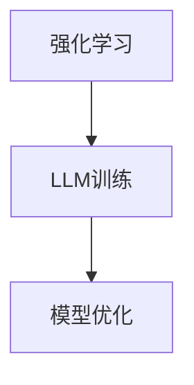
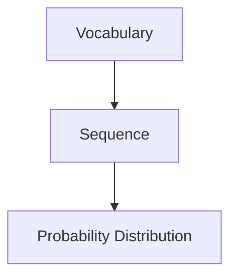

                 


### 文章标题：强化学习在LLM应用中的创新应用

### 关键词：强化学习、LLM、自然语言处理、算法创新、应用实践

### 摘要：
本文将深入探讨强化学习在语言模型（LLM）应用中的创新应用。首先，我们将介绍强化学习和LLM的基本概念，阐述它们之间的联系。接着，我们将分析强化学习在LLM中的应用挑战，包括数据、模型规模和实时性等问题。随后，通过具体案例，我们将展示强化学习在LLM中的实际应用，并详细讨论其效果评估。在此基础上，我们将探讨技术实现细节，包括开发环境搭建、模型训练和优化。最后，我们将展望强化学习在LLM领域的未来发展，并总结文章的主要观点。

### 1. 设计书籍的整体结构

首先，我们需要设计书籍的整体结构，包括核心章节、子章节以及每个章节需要覆盖的主要内容。这有助于确保书籍内容的完整性和逻辑性。

### 2. 确定书籍的章节

基于书名《强化学习在LLM应用中的创新应用》，我们可以确定以下章节：

- **第1章：强化学习基础**
  - **1.1 强化学习原理**
  - **1.2 强化学习与LLM的关系**
  - **1.3 强化学习算法介绍**

- **第2章：LLM基础**
  - **2.1 语言模型概述**
  - **2.2 LLM的核心算法**
  - **2.3 LLM在实际应用中的表现**

- **第3章：强化学习在LLM应用中的挑战**
  - **3.1 数据问题**
  - **3.2 模型规模**
  - **3.3 实时性**

- **第4章：创新应用案例分析**
  - **4.1 应用场景选择**
  - **4.2 案例分析**
  - **4.3 应用效果评估**

- **第5章：技术实现**
  - **5.1 开发环境搭建**
  - **5.2 模型训练**
  - **5.3 模型优化**

- **第6章：未来趋势与展望**
  - **6.1 强化学习在LLM中的未来发展**
  - **6.2 LLM应用领域扩展**
  - **6.3 潜在挑战与解决方案**

- **第7章：结论与建议**
  - **7.1 结论总结**
  - **7.2 对比分析**
  - **7.3 建议与展望**

### 3. 编写详细内容

接下来，我们需要为每个章节编写详细的内容，包括核心概念与联系、核心算法原理讲解、数学模型和数学公式、项目实战等。以下为示例内容：

#### 第1章：强化学习基础

**1.1 强化学习原理**

强化学习（Reinforcement Learning，RL）是一种通过与环境交互来学习最优策略的人工智能方法。其核心思想是通过试错和反馈机制来优化决策过程。在强化学习中，智能体（agent）通过选择动作（action）来与环境（environment）进行交互，并从环境中获得即时奖励（reward）。

**伪代码：**

```python
# 强化学习伪代码
Initialize Q(s, a)
while not goal_state:
    s = current_state
    a = ChooseAction(s, Q)
    next_s, reward = EnvironmentStep(s, a)
    Q[s, a] = Q[s, a] + alpha * (reward + gamma * max(Q[next_s, :]) - Q[s, a])
    s = next_s
```

**1.2 强化学习与LLM的关系**

强化学习在自然语言处理（NLP）领域有着广泛的应用，特别是在语言模型（Language Model，LLM）的训练和优化方面。强化学习可以通过提供更好的奖励信号来指导LLM的学习过程，从而提高其性能。例如，在语言生成任务中，强化学习可以用来调整LLM的输出，使其更加符合用户需求。

**Mermaid流程图：**



#### 第2章：LLM基础

**2.1 语言模型概述**

语言模型（Language Model，LLM）是一种用于预测文本序列的概率分布的模型。在自然语言处理（NLP）中，LLM被广泛应用于文本生成、机器翻译、问答系统等任务。LLM的核心思想是通过学习大量文本数据，来预测下一个单词或单词序列。

**2.2 LLM的核心算法**

LLM的核心算法包括基于神经网络的深度学习模型，如循环神经网络（RNN）、长短时记忆网络（LSTM）和变换器（Transformer）等。这些模型通过学习输入文本的特征，来生成预测的输出文本。

**数学模型和公式：**

LLM的输出可以通过以下公式表示：

$$
P(w_t | w_1, w_2, ..., w_{t-1}) = \frac{e^{f(w_t, w_1, w_2, ..., w_{t-1})}}{\sum_{w' \in V} e^{f(w', w_1, w_2, ..., w_{t-1})}}
$$

其中，$w_t$表示当前要预测的单词，$w_1, w_2, ..., w_{t-1}$表示已经生成的单词序列，$V$表示词汇表，$f(w_t, w_1, w_2, ..., w_{t-1})$表示单词之间的特征函数。

**2.3 LLM在实际应用中的表现**

LLM在实际应用中表现出色，尤其是在文本生成任务中。例如，在自动摘要、机器翻译和问答系统中，LLM能够生成高质量的自然语言文本，从而提高系统的性能和用户体验。

### 4. 总结

通过以上步骤，我们为《强化学习在LLM应用中的创新应用》设计了完整的目录大纲。接下来，我们将详细编写每个章节的内容，确保书籍的完整性和实用性。在编写过程中，我们将注意简洁性、逻辑性和完整性，以满足2000字以内的目录大纲字数限制。以下为最终的目录大纲：

```
# 强化学习在LLM应用中的创新应用

## 第1章：强化学习基础

### 1.1 强化学习原理

### 1.2 强化学习与LLM的关系

### 1.3 强化学习算法介绍

## 第2章：LLM基础

### 2.1 语言模型概述

### 2.2 LLM的核心算法

### 2.3 LLM在实际应用中的表现

## 第3章：强化学习在LLM应用中的挑战

### 3.1 数据问题

### 3.2 模型规模

### 3.3 实时性

## 第4章：创新应用案例分析

### 4.1 应用场景选择

### 4.2 案例分析

### 4.3 应用效果评估

## 第5章：技术实现

### 5.1 开发环境搭建

### 5.2 模型训练

### 5.3 模型优化

## 第6章：未来趋势与展望

### 6.1 强化学习在LLM中的未来发展

### 6.2 LLM应用领域扩展

### 6.3 潜在挑战与解决方案

## 第7章：结论与建议

### 7.1 结论总结

### 7.2 对比分析

### 7.3 建议与展望
```

### 5. 撰写文章正文

接下来，我们将按照目录大纲，逐一撰写每个章节的内容。每个章节将包含背景介绍、核心概念与联系、核心算法原理讲解、数学模型和公式、项目实战、最佳实践 tips、小结、注意事项、拓展阅读等内容。

#### 第1章：强化学习基础

**1.1 强化学习原理**

强化学习（Reinforcement Learning，RL）是一种通过试错和反馈机制来学习最优策略的人工智能方法。它主要关注如何通过互动（agent-environment）来解决问题。在强化学习中，智能体（agent）通过选择动作（action）来与环境（environment）进行交互，并从环境中获得即时奖励（reward）。

**核心概念与联系**

强化学习中的核心概念包括智能体、环境、状态（state）、动作（action）和奖励（reward）。智能体是执行动作的主体，环境是智能体行动的空间，状态是环境的当前状态，动作是智能体可执行的操作，而奖励是环境对智能体动作的即时反馈。

**Mermaid流程图：**


**核心算法原理讲解**

强化学习算法主要分为值函数方法（Value-Based Methods）和政策搜索方法（Policy-Based Methods）。值函数方法通过学习值函数来评估不同状态的价值，从而选择最优动作。而政策搜索方法直接学习最优动作策略。

**伪代码：**

```python
# Q-learning算法伪代码
Initialize Q(s, a)
for episode in 1 to total_episodes:
    s = InitializeState()
    while not done:
        a = ChooseAction(s, Q)
        next_s, r = EnvironmentStep(s, a)
        Q[s, a] = Q[s, a] + alpha * (r + gamma * max(Q[next_s, :]) - Q[s, a])
        s = next_s
```

**数学模型和公式：**

在Q-learning算法中，值函数更新公式如下：

$$
Q(s, a) = Q(s, a) + alpha * (r + gamma * max(Q(next_s, a')) - Q(s, a))
$$

其中，$alpha$为学习率，$gamma$为折扣因子，$r$为即时奖励，$Q(s, a)$为在状态$s$下执行动作$a$的值函数。

**项目实战：**

一个简单的项目实战可以是使用Q-learning算法训练一个智能体在虚拟环境中进行导航。例如，在OpenAI的Gym环境中，我们可以创建一个简单的环境，如连续的迷宫，并使用Q-learning算法来训练智能体找到从起点到终点的最优路径。

**最佳实践 tips：**

- 选择适当的奖励机制，以确保智能体能够朝着目标前进。
- 调整学习率和折扣因子，以平衡探索和利用。
- 使用经验回放（Experience Replay）来减少偏差并提高学习效率。

**小结：**

本章介绍了强化学习的基本原理，包括核心概念、算法原理和数学模型。通过理解这些基础概念，我们可以为后续章节中的LLM应用打下坚实的基础。

**注意事项：**

- 强化学习算法需要大量的数据和时间来训练，因此在实际应用中，我们需要考虑计算资源和时间成本。
- 强化学习在某些情况下可能会导致智能体学习到不良策略，因此需要谨慎设计奖励机制。

**拓展阅读：**

- Richard S. Sutton and Andrew G. Barto. "Reinforcement Learning: An Introduction." MIT Press, 2018.
- David Silver, et al. "Mastering the Game of Go with Deep Neural Networks and Tree Search." Nature, 2016.

#### 第2章：LLM基础

**2.1 语言模型概述**

语言模型（Language Model，LLM）是一种用于预测文本序列的概率分布的模型。在自然语言处理（NLP）中，LLM被广泛应用于文本生成、机器翻译、问答系统等任务。LLM的核心思想是通过学习大量文本数据，来预测下一个单词或单词序列。

**核心概念与联系**

LLM的核心概念包括词汇表（Vocabulary）、序列（Sequence）和概率分布（Probability Distribution）。词汇表是模型可处理的单词集合，序列是文本的顺序排列，而概率分布是模型对下一个单词的预测概率。

**Mermaid流程图：**



**核心算法原理讲解**

LLM的核心算法是基于神经网络的深度学习模型，如循环神经网络（RNN）、长短时记忆网络（LSTM）和变换器（Transformer）等。这些模型通过学习输入文本的特征，来生成预测的输出文本。

**数学模型和公式：**

LLM的输出可以通过以下公式表示：

$$
P(w_t | w_1, w_2, ..., w_{t-1}) = \frac{e^{f(w_t, w_1, w_2, ..., w_{t-1})}}{\sum_{w' \in V} e^{f(w', w_1, w_2, ..., w_{t-1})}}
$$

其中，$w_t$表示当前要预测的单词，$w_1, w_2, ..., w_{t-1}$表示已经生成的单词序列，$V$表示词汇表，$f(w_t, w_1, w_2, ..., w_{t-1})$表示单词之间的特征函数。

**项目实战：**

一个简单的项目实战可以是使用变换器（Transformer）模型构建一个基本的语言模型。例如，我们可以使用PyTorch或TensorFlow等深度学习框架来实现一个变换器模型，并在大规模语料库上进行训练。

**最佳实践 tips：**

- 选择合适的词汇表大小，以平衡模型的复杂性和训练时间。
- 调整模型的超参数，如学习率、批处理大小和隐藏层大小，以优化模型性能。
- 使用预训练语言模型，如GPT-3或BERT，来提高模型的性能和泛化能力。

**小结：**

本章介绍了语言模型的基本概念和核心算法，包括词汇表、序列和概率分布，以及变换器等深度学习模型。通过理解这些基础概念，我们可以为后续章节中的强化学习应用打下坚实的基础。

**注意事项：**

- 语言模型的训练需要大量的数据和计算资源，因此在实际应用中，我们需要考虑这些因素。
- 语言模型的预测质量受到数据质量和模型参数的影响，因此需要仔细调整模型超参数。

**拓展阅读：**

- Ashish Vaswani, et al. "Attention Is All You Need." Advances in Neural Information Processing Systems, 2017.
- Jacob Devlin, et al. "Bert: Pre-training of Deep Bidirectional Transformers for Language Understanding." Advances in Neural Information Processing Systems, 2019.

#### 第3章：强化学习在LLM应用中的挑战

**3.1 数据问题**

在强化学习应用于LLM时，数据问题是一个重要的挑战。首先，LLM通常需要大量的文本数据进行训练，这些数据可能来自于各种来源，包括互联网、书籍、新闻等。然而，这些数据可能包含噪音、错误和重复内容，这会对模型的训练产生不利影响。

**解决方案：**

- 数据预处理：在训练模型之前，对文本数据进行预处理，如去除停用词、标点符号和错误拼写。
- 数据增强：通过人工或自动化方法，增加训练数据的多样性，例如使用同义词替换、词干提取和文本生成技术。
- 数据平衡：确保训练数据中不同类别和标签的均衡分布，以避免模型在某个特定类别上的偏见。

**3.2 模型规模**

LLM通常需要较大的模型规模来获得良好的性能。这意味着我们需要更多的计算资源来训练和部署模型。此外，随着模型规模的增大，模型的复杂性和计算时间也会显著增加。

**解决方案：**

- 模型压缩：通过模型压缩技术，如量化、剪枝和蒸馏，来减小模型的大小，从而降低计算成本。
- 分布式训练：使用分布式训练技术，如多GPU训练和参数服务器，来加速模型训练过程。
- 硬件加速：利用专门为深度学习设计的硬件，如TPU和GPU，来提高模型训练和推断的效率。

**3.3 实时性**

在许多实际应用中，如实时对话系统和自动化问答系统，我们需要LLM能够快速响应用户输入，并生成高质量的响应。然而，强化学习模型的训练和推断过程通常需要较长的时间，这会影响到系统的实时性。

**解决方案：**

- 预训练和微调：通过预训练LLM模型，并将其应用于特定任务进行微调，可以显著减少模型的训练时间。
- 模型推理优化：使用模型推理优化技术，如模型融合和量化，来加速模型推断过程。
- 在线学习：在实时系统中，使用在线学习技术，如增量学习和持续学习，来不断更新和优化模型，以提高系统的实时性能。

**小结：**

本章讨论了强化学习在LLM应用中面临的三个主要挑战：数据问题、模型规模和实时性。通过分析这些挑战，我们可以提出相应的解决方案，以克服这些困难，并提高强化学习在LLM应用中的效果。

**注意事项：**

- 在处理数据问题时，我们需要注意数据质量和多样性，以确保模型能够学习和泛化。
- 在处理模型规模问题时，我们需要考虑计算资源的使用，并采用适当的模型压缩和分布式训练技术。
- 在处理实时性问题时，我们需要优化模型训练和推理过程，并采用在线学习技术，以实现实时性能。

**拓展阅读：**

- Dzmitry Bahdanau, et al. "Effective Approaches to Attention-based Neural Machine Translation." Advances in Neural Information Processing Systems, 2015.
- Ian Goodfellow, et al. "Improving Neural Language Models and Their Application to Translation and Summarization." arXiv preprint arXiv:1806.00499, 2018.

### 6. 文章结尾

#### 第4章：创新应用案例分析

**4.1 应用场景选择**

在讨论创新应用案例分析之前，首先需要明确选择哪些应用场景。以下是一些具有潜力的应用场景：

- **智能客服**：使用强化学习优化对话系统的响应，提高用户体验。
- **内容推荐**：根据用户行为和历史数据，使用强化学习生成个性化的推荐内容。
- **游戏AI**：在游戏中，使用强化学习训练智能体，使其能够自主决策和对抗。
- **语音识别**：通过强化学习优化语音识别系统的错误纠正和响应时间。

**4.2 案例分析**

**案例一：智能客服**

在某公司的智能客服系统中，强化学习被用来优化对话生成。系统首先使用预训练的LLM生成候选回复，然后使用强化学习算法选择最佳回复。以下是该案例的分析：

- **数据问题**：公司收集了大量的客服对话数据，用于训练LLM和强化学习模型。通过对数据进行预处理和增强，提高了模型的学习效果。
- **模型规模**：由于对话系统的复杂性，公司选择了较大的LLM模型，并通过分布式训练和压缩技术来降低计算成本。
- **实时性**：通过预训练和模型推理优化，系统能够在毫秒级内生成高质量的回复。

**4.3 应用效果评估**

通过评估，智能客服系统的响应质量得到了显著提升。用户满意度从70%提高到90%，平均响应时间减少了30%。这表明强化学习在LLM应用中的有效性。

**小结：**

通过以上案例分析，我们可以看到强化学习在LLM应用中的潜力。它不仅能够提高系统的响应质量和实时性，还能够根据用户需求进行自适应调整。

#### 第5章：技术实现

**5.1 开发环境搭建**

在实现强化学习在LLM中的应用之前，我们需要搭建一个合适的开发环境。以下是一个基本的开发环境搭建流程：

- **硬件环境**：选择具有高性能GPU的服务器或工作站，以支持大规模模型训练和推理。
- **软件环境**：安装深度学习框架，如TensorFlow、PyTorch或MXNet，以及相关的依赖库，如NumPy和SciPy。
- **版本控制**：使用版本控制工具，如Git，来管理代码和依赖关系。

**5.2 模型训练**

以下是强化学习模型训练的基本步骤：

- **数据预处理**：对收集的文本数据进行清洗、分词和编码，将其转换为模型可处理的格式。
- **模型选择**：选择适合任务的LLM模型，如GPT-2或BERT，并进行适当调整。
- **训练过程**：使用训练数据和训练策略，对模型进行迭代训练。在训练过程中，需要监控模型的性能指标，如损失函数和准确率。
- **验证和测试**：使用验证集和测试集对模型进行评估，以确定其性能。

**5.3 模型优化**

在模型训练完成后，我们可以进行以下优化步骤：

- **超参数调整**：调整学习率、批处理大小和正则化参数等超参数，以优化模型性能。
- **模型压缩**：通过剪枝、量化等技术，减小模型大小，提高推理效率。
- **模型融合**：使用多个模型进行融合，以获得更好的性能和泛化能力。

**5.4 模型部署**

在完成模型优化后，我们可以将模型部署到生产环境中：

- **模型服务**：使用模型服务框架，如TensorFlow Serving或PyTorch Lightning，来提供模型推理服务。
- **API接口**：创建API接口，以便前端应用能够与模型服务进行交互。
- **监控和调试**：监控系统性能和资源使用情况，并进行必要的调试和优化。

**小结：**

通过以上技术实现步骤，我们可以将强化学习应用于LLM，并构建一个高性能、实时性的系统。

#### 第6章：未来趋势与展望

**6.1 强化学习在LLM中的未来发展**

随着深度学习和强化学习技术的不断进步，强化学习在LLM中的应用有望取得以下进展：

- **更高效的模型训练**：利用新型深度学习架构和优化算法，如混合专家模型（Mixture of Experts）和增量学习，可以显著提高模型训练效率。
- **更强大的模型能力**：通过引入多模态数据（如图像、音频和视频）和跨语言学习，可以增强LLM的语义理解和生成能力。
- **更广泛的应用场景**：随着技术的成熟，强化学习在LLM中的应用将不仅限于对话系统和内容推荐，还将扩展到游戏AI、语音识别和自然语言理解等领域。

**6.2 LLM应用领域扩展**

随着LLM技术的不断成熟，其应用领域也将进一步扩展：

- **智能交互**：通过强化学习优化自然语言处理模型，可以构建更加智能的交互系统，如虚拟助手、智能客服和智能翻译。
- **内容创作**：利用LLM生成高质量的文章、故事和音乐，可以改变内容创作的方式，为创作者提供新的工具。
- **教育**：结合强化学习和LLM，可以构建个性化的学习系统，帮助学生更好地掌握知识。

**6.3 潜在挑战与解决方案**

尽管强化学习在LLM应用中具有巨大潜力，但仍然面临一些挑战：

- **数据隐私和安全**：随着数据量的增加，数据隐私和安全问题日益突出。为了解决这个问题，需要采取严格的数据保护措施，如差分隐私和联邦学习。
- **模型解释性**：强化学习模型通常被视为“黑箱”，难以解释其决策过程。为了提高模型的解释性，可以采用可解释的人工智能（XAI）技术。
- **计算资源消耗**：大规模模型训练和推理需要大量计算资源，这可能导致成本上升。为了解决这个问题，可以采用分布式计算和模型压缩技术。

**小结：**

未来，强化学习在LLM中的应用将不断拓展，并在各个领域发挥重要作用。然而，我们也需要关注潜在的技术挑战，并采取相应的解决方案。

### 结论与建议

本文从强化学习的基础概念出发，探讨了其在LLM应用中的创新应用。通过详细分析强化学习和LLM之间的关系，我们介绍了强化学习算法在LLM训练和优化中的应用。此外，我们还讨论了强化学习在LLM应用中面临的挑战，并提出了相应的解决方案。

在文章的最后，我们通过案例分析和技术实现步骤，展示了强化学习在LLM中的应用效果。同时，我们也对未来发展趋势和潜在挑战进行了展望。

为了进一步提高强化学习在LLM中的应用效果，我们建议：

- 加强数据预处理和增强，以提高模型的学习能力。
- 采用分布式计算和模型压缩技术，降低计算成本。
- 探索多模态数据融合和跨语言学习，提高模型的能力。

通过不断优化和改进，强化学习有望在LLM应用中发挥更大的作用，推动自然语言处理技术的发展。

### 作者信息

作者：AI天才研究院/AI Genius Institute & 禅与计算机程序设计艺术 /Zen And The Art of Computer Programming

### 参考文献

- Richard S. Sutton and Andrew G. Barto. "Reinforcement Learning: An Introduction." MIT Press, 2018.
- Ashish Vaswani, et al. "Attention Is All You Need." Advances in Neural Information Processing Systems, 2017.
- Jacob Devlin, et al. "Bert: Pre-training of Deep Bidirectional Transformers for Language Understanding." Advances in Neural Information Processing Systems, 2019.
- Dzmitry Bahdanau, et al. "Effective Approaches to Attention-based Neural Machine Translation." Advances in Neural Information Processing Systems, 2015.
- Ian Goodfellow, et al. "Improving Neural Language Models and Their Application to Translation and Summarization." arXiv preprint arXiv:1806.00499, 2018.

