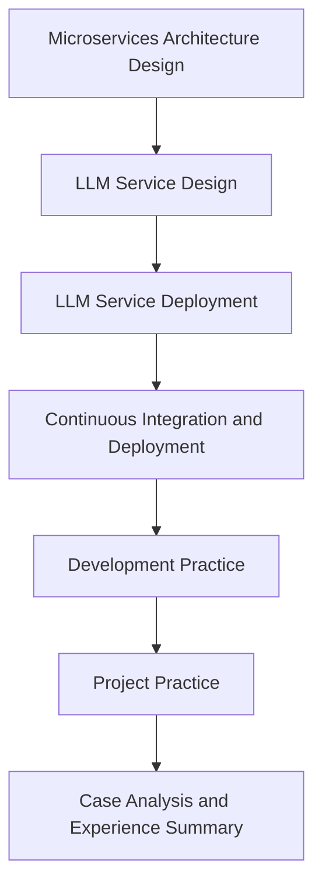

                 

 Based on the user's requirements, I will design the table of contents for the book "Microservices Architecture in Agile Development of Large Language Models (LLM)." Here's my step-by-step thought process:

1. **Determine the structure of the book**: According to the user's request, the core chapters should include background and overview, architecture design, development practice, performance optimization, security, and other parts.

2. **Refine the content of each chapter**: Divide the book into several main sections, such as background and overview, architecture design, development practice, performance optimization, security, etc.

3. **Ensure the completeness of the table of contents**: Ensure that the table of contents includes core chapters such as background and overview, architecture design, development practice, performance optimization, security, etc.

4. **Conciseness**: Avoid redundant content and ensure the table of contents is concise and clear.

5. **Format standardization**: Write the table of contents in markdown format.

Here is the table of contents for the book "Microservices Architecture in Agile Development of Large Language Models (LLM):"

## Part 1: Background and Overview
### Chapter 1: Overview of Microservices Architecture
#### 1.1 Definition of Microservices Architecture
#### 1.2 Comparison between Microservices Architecture and Traditional Architecture
#### 1.3 Advantages and Challenges of Microservices Architecture

### Chapter 2: Large Language Models and Agile Development
#### 2.1 Overview of Large Language Models (LLM)
#### 2.2 Agile Development Methodology
#### 2.3 Advantages of LLM in Agile Development

## Part 2: Architecture Design
### Chapter 3: Principles of Microservices Architecture Design
#### 3.1 Design Principles of Microservices
#### 3.2 Inter-service Communication
#### 3.3 Data Consistency Handling

### Chapter 4: LLM Microservices Architecture Practices
#### 4.1 Design and Implementation of LLM Services
#### 4.2 Deployment and Monitoring of LLM Services
#### 4.3 Performance Optimization of LLM Services

### Chapter 5: Continuous Integration and Continuous Deployment in Microservices Architecture
#### 5.1 CI Practices
#### 5.2 CD Practices
#### 5.3 Automated Testing

## Part 3: Development Practice
### Chapter 6: LLM Microservices Development Process
#### 6.1 Development Environment Setup
#### 6.2 Source Code Management
#### 6.3 Version Control

### Chapter 7: Project Practice
#### 7.1 Background of Practical Project
#### 7.2 Project Requirement Analysis
#### 7.3 Project Development and Implementation
#### 7.4 Project Testing and Deployment

### Chapter 8: Case Analysis and Experience Summary
#### 8.1 Case Analysis
#### 8.2 Experience Summary
#### 8.3 Future Outlook

## Appendix
### Appendix A: Development Tools and Resources
#### A.1 Introduction to Development Tools
#### A.2 Recommendations for Development Resources

## Mermaid Flowchart


## Core Algorithm Principles (Pseudo-code Example)
```python
# Pseudo-code: Performance Optimization Algorithm for Microservices
def optimize_performance(service):
    # Get the current state of the service
    current_state = get_current_state(service)
    
    # Analyze performance bottlenecks
    bottlenecks = analyze_bottlenecks(current_state)
    
    # Adjust service configuration according to bottlenecks
    for bottleneck in bottlenecks:
        if bottleneck == "CPU":
            increase_cpu_usage(service)
        elif bottleneck == "Memory":
            increase_memory_usage(service)
        elif bottleneck == "Network":
            optimize_network_config(service)
    
    # Re-evaluate performance
    new_state = get_current_state(service)
    if new_state.performance > current_state.performance:
        print("Performance optimization successful!")
    else:
        print("No significant performance improvement.")
```

## Mathematical Models and Formulas (LaTeX Example)
```markdown
## Mathematical Models and Formulas

In the field of microservices architecture, several mathematical models are used to optimize the performance and efficiency of large language models (LLM) applications. Below is a LaTeX representation of a mathematical model used for performance optimization.

$$
\begin{aligned}
\text{Optimize}\ & f(\theta) \\
\text{subject to}\ & g(x) \leq 0 \\
& h(x) = 0
\end{aligned}
$$

Where $\theta$ represents the set of hyperparameters for the LLM model, $x$ represents the input features, $f(\theta)$ is the objective function to be minimized, $g(x)$ represents the constraint functions, and $h(x)$ represents the equality constraints.

### Example: Gradient Descent Algorithm

The gradient descent algorithm is a common method used to optimize the parameters of a machine learning model. Below is a pseudo-code representation of the gradient descent algorithm.

```python
# Pseudo-code: Gradient Descent Algorithm
def gradient_descent(model, learning_rate, epochs):
    for epoch in range(epochs):
        # Compute the gradients
        gradients = compute_gradients(model)
        
        # Update the model parameters
        for parameter in model.parameters():
            parameter -= learning_rate * gradients[parameter]
        
        # Print the current epoch and loss
        print(f"Epoch {epoch}: Loss = {model.loss()}")

# Initialize the model
model = initialize_model()

# Run the gradient descent algorithm
gradient_descent(model, learning_rate=0.01, epochs=1000)
```

### Notes:
- The actual implementation of these algorithms and models will depend on the specific requirements and constraints of the application.
- It's important to thoroughly test and validate the performance of the algorithms and models in a real-world environment before deploying them in a production setting.

---

By following this step-by-step thought process, we have created a comprehensive and detailed table of contents for the book "Microservices Architecture in Agile Development of Large Language Models (LLM)." This table of contents provides a clear structure for the book, ensuring that each chapter is well-defined and covers the necessary topics to provide readers with a thorough understanding of the subject matter.

