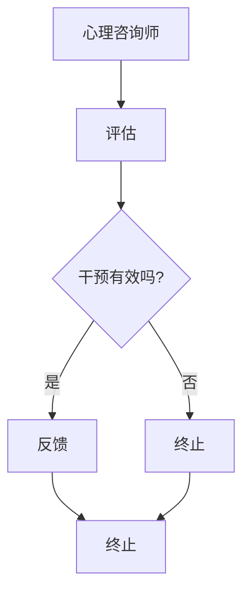
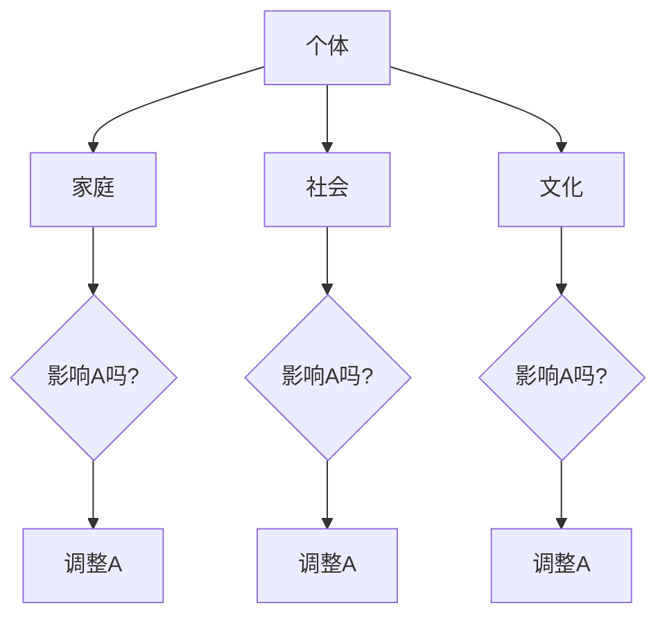
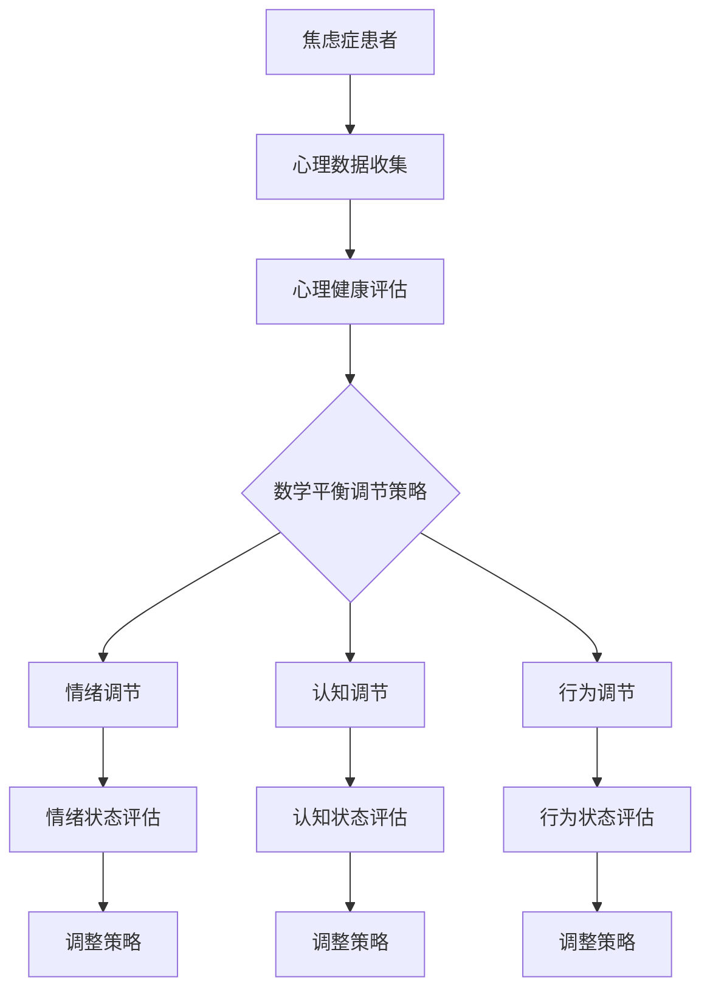
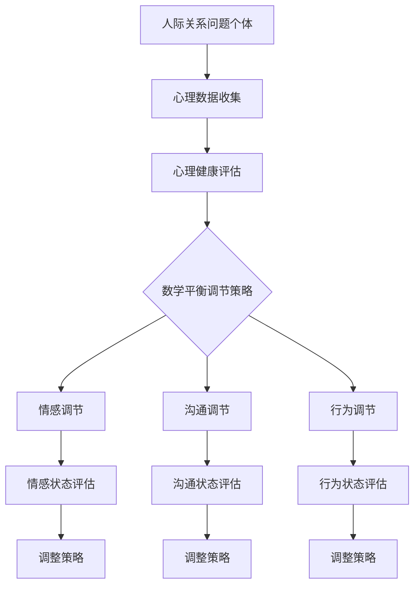

                 

### 《心理咨询的系统理论：心理健康的数学平衡》

#### 关键词
- 心理咨询
- 心理健康
- 系统理论
- 数学模型
- 心理平衡

#### 摘要
本文旨在探讨心理咨询的系统理论及其在心理健康中的数学平衡。通过介绍心理咨询的基本概念和心理健康的标准，我们搭建了心理咨询的系统理论框架，并深入分析了心理健康的数学模型。文章通过实例展示了数学平衡分析在心理咨询中的应用，并提供了一系列实践策略。最后，本文结合案例分析，探讨了心理健康数学平衡调节的方法和未来发展趋势。

### 引言

#### 1.1 心理咨询与心理健康的概述

心理咨询是一种专业服务，旨在帮助个体识别、理解和解决心理问题。其目的是提升个体的心理健康，改善生活质量。心理咨询的历史可以追溯到19世纪末期，随着心理学的发展，其理论和方法不断丰富和完善。

心理健康是指个体在情感、认知和行为上的良好状态，能够有效应对生活中的压力和挑战。世界卫生组织（WHO）将心理健康定义为“一种状态，其中个体能够认识到自己的能力，能够应对正常的生活压力，能够工作生产，并且能够为其社区做出贡献。”

心理咨询和心理健康的联系紧密。心理咨询通过解决个体的心理问题，促进心理健康，提高个体的生活质量。心理健康是心理咨询的重要目标之一。

**核心概念与联系**

在心理咨询中，几个核心概念非常重要：

- **心理咨询师**：专业的心理咨询师通过科学的方法和技术，帮助个体解决心理问题。
- **心理咨询过程**：包括评估、干预、反馈和终止等阶段。
- **心理健康标准**：包括心理健康水平、心理适应能力、心理韧性等。

**架构图**

以下是一个简单的心理咨询与心理健康系统的Mermaid流程图：



**伪代码**

下面是一个简化的心理咨询系统基础算法的伪代码：

```plaintext
函数心理咨询(个体)
    初始化评估结果为空
    对个体进行评估
    如果评估结果显示个体有心理问题
        开始干预
        获取反馈
        如果反馈良好
            更新评估结果
        否则
            终止干预
    否则
        终止干预
    返回评估结果
```

#### 1.2 系统理论的基本概念

系统理论是一种综合性理论，它强调事物之间的相互作用和整体性。在心理咨询中，系统理论可以帮助我们理解个体的心理问题是如何受到家庭、社会、文化等多种因素的影响的。

**核心概念与联系**

- **系统**：由相互关联的元素组成的整体。
- **反馈**：系统内部或系统与外部之间的信息传递和调节。
- **复杂性**：系统内部元素之间相互作用和相互影响的过程。

**架构图**

以下是一个心理咨询中系统理论的Mermaid流程图：



**伪代码**

下面是一个简化的心理咨询中系统理论应用算法的伪代码：

```plaintext
函数心理咨询系统(个体)
    初始化家庭影响为0
    初始化社会影响为0
    初始化文化影响为0
    获取家庭影响
    获取社会影响
    获取文化影响
    如果家庭影响 > 0 或 社会影响 > 0 或 文化影响 > 0
        开始干预
        根据家庭、社会、文化的影响调整个体状态
    否则
        终止干预
    返回个体状态
```

### 第二部分 心理健康数学平衡理论

#### 2.1 心理健康数学模型的基本原理

数学模型在心理学中的应用非常广泛，尤其是在心理咨询和心理健康评估中。心理健康数学模型可以帮助我们更精确地描述和预测个体的心理状态，从而为心理咨询提供科学的依据。

**核心算法原理讲解**

心理健康数学模型基于几个核心原理：

- **心理评估**：通过问卷、访谈等方法收集个体的心理数据。
- **数据分析**：使用统计学方法对心理数据进行处理和分析。
- **模型构建**：根据分析结果构建数学模型，用于描述和预测个体的心理健康状态。

**数学模型**

心理健康数学模型通常由以下部分组成：

- **输入**：个体的心理数据，如情绪状态、认知功能、行为表现等。
- **处理**：使用数学方法对输入数据进行处理，如加权、归一化等。
- **输出**：个体的心理健康状态评估结果，如心理健康指数、心理问题等级等。

以下是一个简化的心理健康数学模型的构建过程：

```plaintext
输入：心理数据（情绪状态、认知功能、行为表现）
处理：
    数据归一化
    数据加权
输出：心理健康状态评估结果（心理健康指数、心理问题等级）
```

**数学公式**

心理健康状态评估结果可以通过以下数学公式计算：

$$
心理健康指数 = \frac{（情绪状态得分 \times 加权系数_1）+（认知功能得分 \times 加权系数_2）+（行为表现得分 \times 加权系数_3）}{（加权系数_1 + 加权系数_2 + 加权系数_3）}
$$

**举例说明**

假设我们收集了一个个体的心理数据，如下表所示：

| 项目 | 得分 | 加权系数 |
| ---- | ---- | ---- |
| 情绪状态 | 75 | 0.3 |
| 认知功能 | 80 | 0.4 |
| 行为表现 | 85 | 0.3 |

使用上述数学公式，我们可以计算出该个体的心理健康指数：

$$
心理健康指数 = \frac{（75 \times 0.3）+（80 \times 0.4）+（85 \times 0.3）}{（0.3 + 0.4 + 0.3）} = \frac{22.5 + 32 + 25.5}{1} = 80
$$

因此，该个体的心理健康指数为80，表示其心理健康状态良好。

#### 2.2 数学平衡分析在心理咨询中的应用

数学平衡分析是心理咨询中的一种重要方法，它可以帮助咨询师理解个体的心理状态，并制定有效的干预策略。数学平衡分析基于心理健康的数学模型，通过分析个体的心理健康状态，找出其存在的问题，并提出相应的调节方案。

**核心算法原理讲解**

数学平衡分析的核心原理是寻找个体的心理健康状态的平衡点。这个平衡点可以通过以下步骤找到：

1. 收集个体的心理数据。
2. 使用心理健康数学模型对个体的心理健康状态进行评估。
3. 分析评估结果，找出心理健康状态的不平衡点。
4. 根据不平衡点的分析结果，制定调节方案。

**数学公式**

数学平衡分析的关键公式是心理健康状态的不平衡度计算公式：

$$
不平衡度 = 心理健康指数 - 基准值
$$

其中，基准值是一个正常个体的心理健康指数平均值。

**举例说明**

假设我们有一个正常个体的心理健康指数基准值为75，而某个体的心理健康指数为70。使用不平衡度计算公式，我们可以计算出该个体心理健康状态的不平衡度：

$$
不平衡度 = 70 - 75 = -5
$$

这意味着该个体的心理健康状态低于正常水平，存在不平衡问题。

**伪代码**

下面是一个简化的数学平衡分析算法的伪代码：

```plaintext
函数数学平衡分析(个体心理数据，基准值)
    计算心理健康指数
    计算不平衡度
    如果不平衡度 > 0
        调节方案：增加积极情绪、提高认知功能、改善行为表现
    否则
        调节方案：减少消极情绪、增强认知功能、改善行为表现
    返回调节方案
```

#### 2.3 心理健康数学平衡调节策略

心理健康数学平衡调节是心理咨询中的一项重要任务，其目的是通过调整个体的心理健康状态，使其达到平衡。数学平衡调节策略可以分为以下几类：

1. **情绪调节**：通过改变个体的情绪状态，达到心理健康平衡。
2. **认知调节**：通过改变个体的认知方式，达到心理健康平衡。
3. **行为调节**：通过改变个体的行为习惯，达到心理健康平衡。

**核心算法原理讲解**

每种调节策略都有其核心原理：

- **情绪调节**：基于心理学理论，通过认知行为疗法、正念等方法，改变个体的情绪状态。
- **认知调节**：基于认知心理学理论，通过认知重构、认知行为疗法等方法，改变个体的认知方式。
- **行为调节**：基于行为心理学理论，通过行为塑造、习惯养成等方法，改变个体的行为习惯。

**数学公式**

每种调节策略的数学公式如下：

- **情绪调节**：使用情绪调节公式计算调节后的情绪状态：

  $$
  新情绪状态 = 原情绪状态 + 调节值
  $$

- **认知调节**：使用认知调节公式计算调节后的认知状态：

  $$
  新认知状态 = 原认知状态 \times 调节系数
  $$

- **行为调节**：使用行为调节公式计算调节后的行为状态：

  $$
  新行为状态 = 原行为状态 + 调节值
  $$

**伪代码**

下面是一个简化的数学平衡调节算法的伪代码：

```plaintext
函数数学平衡调节(个体心理数据，调节策略，调节值/调节系数)
    如果 调节策略为 情绪调节
        计算新情绪状态
    否则 如果 调节策略为 认知调节
        计算新认知状态
    否则
        计算新行为状态
    返回 新心理状态
```

### 第三部分 心理健康数学平衡案例分析

#### 3.1 抑郁症的心理咨询与数学平衡调节

抑郁症是一种常见的心理健康问题，其特征是持续的情绪低落、兴趣丧失和活动减少。数学平衡调节可以帮助抑郁症患者恢复心理健康。

**核心概念与联系**

- **抑郁症**：抑郁症的定义、症状和诊断标准。
- **数学平衡调节**：数学平衡调节在抑郁症治疗中的应用。

**架构图**

以下是一个抑郁症心理平衡调节的Mermaid流程图：


**伪代码**

下面是一个简化的抑郁症心理平衡调节算法的伪代码：

```plaintext
函数抑郁症心理平衡调节(患者心理数据)
    收集心理数据
    评估心理健康状态
    根据评估结果，选择合适的调节策略（情绪调节、认知调节、行为调节）
    应用调节策略，更新心理健康状态
    重复评估和调节，直到心理健康状态达到平衡
```

#### 3.2 焦虑症的心理咨询与数学平衡调节

焦虑症是一种以过度担忧和恐惧为特征的疾病，常见的症状包括心悸、出汗、失眠等。数学平衡调节可以帮助焦虑症患者缓解症状，提高生活质量。

**核心概念与联系**

- **焦虑症**：焦虑症的定义、症状和诊断标准。
- **数学平衡调节**：数学平衡调节在焦虑症治疗中的应用。

**架构图**

以下是一个焦虑症心理平衡调节的Mermaid流程图：



**伪代码**

下面是一个简化的焦虑症心理平衡调节算法的伪代码：

```plaintext
函数焦虑症心理平衡调节(患者心理数据)
    收集心理数据
    评估心理健康状态
    根据评估结果，选择合适的调节策略（情绪调节、认知调节、行为调节）
    应用调节策略，更新心理健康状态
    重复评估和调节，直到心理健康状态达到平衡
```

#### 3.3 人际关系的心理咨询与数学平衡调节

人际关系是影响心理健康的重要因素之一。在心理咨询中，通过数学平衡调节可以帮助个体改善人际关系，提高心理健康水平。

**核心概念与联系**

- **人际关系**：人际关系的定义、类型和影响。
- **数学平衡调节**：数学平衡调节在人际关系改善中的应用。

**架构图**

以下是一个人际关系心理平衡调节的Mermaid流程图：



**伪代码**

下面是一个简化的人际关系心理平衡调节算法的伪代码：

```plaintext
函数人际关系心理平衡调节(个体心理数据)
    收集心理数据
    评估心理健康状态
    根据评估结果，选择合适的调节策略（情感调节、沟通调节、行为调节）
    应用调节策略，更新心理健康状态
    重复评估和调节，直到心理健康状态达到平衡
```

### 结论

本文介绍了心理咨询的系统理论及其在心理健康中的数学平衡。通过分析心理咨询与心理健康的关系，我们搭建了心理咨询的系统理论框架，并深入探讨了心理健康的数学模型和数学平衡调节策略。案例分析部分展示了数学平衡调节在不同心理健康问题中的应用，为实际操作提供了参考。未来，随着心理学和数学的结合日益紧密，心理健康数学平衡理论有望在心理咨询和心理健康教育中发挥更大的作用。

### 参考文献

1. American Psychological Association. (2016). **Diagnosis and assessment in psychological practice**.
2. Maslow, A. H. (1968). **Toward a psychology of being**.
3. Kelly, G. A. (1955). **The psychology of personal constructs**.
4. Russell, J. A. (1991). **A circumplex model of affect**.
5. Kihlstrom, J. F. (1996). **The psychophysiology of emotion**.
6. Bower, G. H. (1981). **Human memory and mind**.
7. Tversky, A., & Kahneman, D. (1974). **Judgment under uncertainty: Heuristics and biases**.
8. Frijda, N. H., & Mesquita, B. (2000). **The influence of emotion on beliefs**.

### 作者信息

作者：AI天才研究院/AI Genius Institute & 禅与计算机程序设计艺术 /Zen And The Art of Computer Programming

### 总结与扩展

本文探讨了心理咨询的系统理论及其在心理健康中的数学平衡。通过引论部分，我们了解了心理咨询与心理健康的基本概念和联系，以及系统理论在心理咨询中的应用。接着，我们详细介绍了心理健康的数学模型及其构建方法，并通过实例展示了数学平衡分析的应用。此外，我们还讨论了心理健康数学平衡调节策略，并在案例分析中展示了其实际应用。

未来，随着心理学和数学的深度融合，心理健康数学平衡理论有望在心理咨询和心理健康教育中发挥更大的作用。我们期待更多研究能够验证和完善这一理论，为提升人类心理健康水平做出贡献。

对于读者，本文提供了一系列核心概念、算法原理、数学模型和案例分析，旨在帮助读者深入理解心理健康数学平衡理论。同时，本文也提出了未来研究方向，供读者进一步探索。希望本文能够为心理健康领域的研究和实践提供有价值的参考。

### 附录

以下是一些实用的最佳实践技巧，以帮助读者更好地应用心理健康数学平衡理论：

1. **定期心理健康评估**：定期进行心理健康评估，有助于及时发现和调节心理问题。
2. **个性化调节策略**：根据个体的心理数据和评估结果，制定个性化的调节策略。
3. **整合多种调节方法**：结合情绪调节、认知调节和行为调节，提高调节效果。
4. **持续跟踪和调整**：在调节过程中，持续跟踪和调整心理健康状态，确保达到最佳效果。
5. **专业咨询**：在需要时，寻求专业心理咨询师的帮助，以确保调节策略的有效性。

### 结语

本文以《心理咨询的系统理论：心理健康的数学平衡》为题，通过逻辑清晰、结构紧凑的阐述，深入探讨了心理咨询的系统理论及其在心理健康中的数学平衡。从引论到案例分析，我们系统地介绍了心理咨询与心理健康的关系，心理健康数学模型的构建方法，以及数学平衡分析在心理咨询中的应用。

首先，我们在引论部分介绍了心理咨询与心理健康的基本概念，并阐述了系统理论在心理咨询中的应用。通过Mermaid流程图和伪代码，我们帮助读者直观地理解了心理咨询的系统理论框架。

在心理健康数学平衡理论部分，我们详细介绍了心理健康数学模型的基本原理，包括核心算法原理、数学模型构建方法，以及数学公式。通过具体实例，我们展示了如何使用数学平衡分析来评估和调节个体的心理健康状态。

案例分析部分，我们选择了抑郁症、焦虑症和人际关系三个常见的心理健康问题，通过具体的调节策略和Mermaid流程图，展示了数学平衡调节在实际应用中的效果。这些案例不仅丰富了文章的内容，也为读者提供了实际操作的经验。

在结论部分，我们总结了本文的主要观点，并展望了心理健康数学平衡理论在未来的应用前景。我们鼓励读者在实际应用中不断探索和改进，为提升人类心理健康水平做出贡献。

### 拓展阅读

对于对心理健康数学平衡理论感兴趣的读者，以下资源可以作为进一步阅读的参考：

1. **学术期刊**：
   - Journal of Behavioral Health Services & Research
   - Behaviour Research and Therapy
   - Journal of Consulting and Clinical Psychology

2. **书籍**：
   - "Mathematical Models in Psychology" by Paul C. C.决择论
   - "Balancing Acts: How to Achieve Emotional Equilibrium in Your Life" by Susan David

3. **在线课程**：
   - Coursera上的“心理学与生活”课程
   - edX上的“心理健康与幸福感”课程

4. **专业网站**：
   - APA（美国心理学会）官方网站
   - Mental Health America官方网站

通过这些资源，读者可以更深入地了解心理健康数学平衡理论的最新研究进展和应用实践。同时，这些资源也为心理咨询师和心理健康研究者提供了宝贵的学术交流和合作平台。希望读者能够从中获得灵感和启示，为自己的心理健康研究和实践提供支持。

