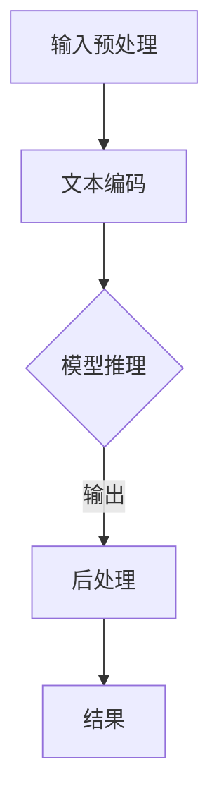

                 


### 文章标题：快速原型到产品化：LLM应用的演进之路

#### 关键词：大型语言模型（LLM），快速原型，产品化，技术演进，性能优化

#### 摘要：
本文将探讨从快速原型到产品化的过程在大型语言模型（LLM）应用中的重要性。我们将深入分析LLM的基本概念、技术架构、应用场景，以及如何将原型设计转化为成熟的产品。通过一系列的步骤和实战案例，我们将展示LLM技术在现代IT领域的广泛应用和未来发展趋势。

---

### 前言

在数字化时代，大型语言模型（LLM）已经成为推动技术创新的重要力量。从文本生成、自然语言处理到智能客服、内容创作，LLM的应用无处不在。然而，从原始原型到成熟产品的转化过程中，如何确保技术的可行性、可靠性和用户体验，是一个值得深入探讨的问题。

本文旨在提供一个系统性的框架，帮助开发者和技术团队更好地理解LLM的应用，并从原型设计逐步演进到产品化。我们将通过以下几个步骤来展开讨论：

1. **LLM的基础知识**：介绍LLM的定义、背景和核心特性。
2. **技术架构解析**：探讨LLM的技术架构，包括数据预处理、模型训练与优化、模型推理与部署。
3. **应用场景分析**：分析LLM在不同领域的应用场景，如文本生成、自然语言处理等。
4. **原型到产品化的过程**：详细讲解从快速原型设计到产品化的各个步骤。
5. **性能优化与安全**：讨论如何优化LLM的性能和确保其安全与隐私。
6. **案例分析**：通过具体案例展示LLM的应用和实践。
7. **未来展望**：探讨LLM技术的未来发展趋势和面临的挑战。

### 第一部分：LLM基础

#### 第1章：LLM概述

**1.1 LLM的定义与背景**

大型语言模型（LLM）是一种基于深度学习技术的自然语言处理（NLP）模型，它能够理解和生成自然语言文本。LLM通过学习海量的文本数据，掌握了语言的复杂模式和结构，从而能够生成连贯、有逻辑的文本内容。

LLM的背景可以追溯到深度学习技术的发展。随着计算能力的提升和数据量的增加，深度学习模型在图像识别、语音识别等领域取得了显著的成果。受此启发，研究人员开始探索将深度学习应用于自然语言处理，从而诞生了LLM。

**1.2 LLM的核心特性**

- **泛化能力**：LLM能够处理不同领域、不同风格的文本，具备较强的泛化能力。
- **文本生成**：LLM能够根据给定的文本或提示生成连贯的文本内容。
- **上下文理解**：LLM能够理解文本中的上下文关系，生成与上下文相关的文本。
- **多语言支持**：许多LLM模型支持多种语言，能够进行跨语言的文本生成和处理。

**1.3 LLM的发展历程**

LLM的发展历程可以追溯到2000年代初的统计语言模型，如Gigaword模型和Google的NLP系统。随着深度学习技术的崛起，研究人员提出了许多基于神经网络的NLP模型，如LSTM（长短期记忆网络）、GRU（门控循环单元）等。

2018年，OpenAI发布了GPT-2，标志着LLM技术的一个重要里程碑。GPT-2通过预训练和微调技术，展示了在自然语言生成和任务完成方面的强大能力。此后，LLM技术不断发展，涌现出了GPT-3、BERT、T5等具有里程碑意义的模型。

#### 第2章：LLM技术架构

**2.1 数据预处理**

在LLM的训练过程中，数据预处理是至关重要的一步。数据预处理的主要目标是清洗数据、消除噪声、增强数据质量，从而提高模型的训练效果。

数据预处理包括以下几个步骤：

1. **文本清洗**：去除文本中的特殊字符、标点符号，统一文本格式。
2. **分词**：将文本划分为单词或子词，以便模型进行学习。
3. **词向量化**：将文本转换为数字形式，常用的方法包括Word2Vec、BERT等。
4. **数据增强**：通过添加噪声、替换词语、增删单词等方式，增加训练数据的多样性。

**2.2 模型训练与优化**

LLM的训练过程是一个复杂的优化问题。模型需要学习大量的参数，以捕捉文本数据的模式和结构。训练过程通常包括以下几个步骤：

1. **初始化**：初始化模型的参数。
2. **前向传播**：输入文本数据，计算模型的预测输出。
3. **反向传播**：计算模型损失，更新模型参数。
4. **优化算法**：常用的优化算法包括梯度下降、Adam等。

**2.3 模型推理与部署**

模型推理是指将训练好的模型应用到实际场景中，生成文本内容或完成特定任务。模型推理包括以下几个步骤：

1. **输入预处理**：对输入文本进行预处理，包括分词、词向量化等。
2. **文本编码**：将预处理后的文本编码为模型能够处理的格式。
3. **模型输出**：通过模型生成文本内容。
4. **后处理**：对生成的文本进行格式化、清理等。

**Mermaid流程图**：



**2.4 数学模型和公式**

在LLM中，常用的数学模型包括神经网络、循环神经网络（RNN）和变压器（Transformer）等。以下是一个简化的神经网络模型示例：

$$
\text{Output} = \sigma(\text{Weight} \cdot \text{Input} + \text{Bias})
$$

其中，$\sigma$表示激活函数，如ReLU、Sigmoid等；Weight和Bias分别为权重和偏置。

**2.5 项目实战**

在本节中，我们将介绍如何搭建一个简单的LLM开发环境，并实现一个文本生成模型。以下是项目步骤：

1. **环境搭建**：安装Python、TensorFlow等依赖库。
2. **数据准备**：收集和处理文本数据。
3. **模型构建**：定义神经网络结构。
4. **模型训练**：使用训练数据训练模型。
5. **模型评估**：评估模型性能。
6. **模型部署**：将模型部署到服务器。

**伪代码**：

```python
import tensorflow as tf

# 模型定义
model = tf.keras.Sequential([
    tf.keras.layers.Embedding(vocab_size, embedding_dim),
    tf.keras.layers.LSTM(units=128),
    tf.keras.layers.Dense(units=vocab_size, activation='softmax')
])

# 模型编译
model.compile(optimizer='adam', loss='categorical_crossentropy', metrics=['accuracy'])

# 模型训练
model.fit(train_data, train_labels, epochs=10, batch_size=32)

# 模型评估
test_loss, test_acc = model.evaluate(test_data, test_labels)

# 模型部署
model.save('text_generator_model.h5')
```

**数学公式与举例说明**：

假设我们有一个简单的语言模型，用于预测下一个单词。给定一个输入序列$\text{Input} = \text{"The quick brown fox jumps over the lazy dog."}$，模型需要生成输出序列$\text{Output} = \text{"jumps over the lazy dog."}$。

1. **文本编码**：

$$
\text{Input} = [4, 6, 6, 7, 11, 8, 11, 10, 13, 9, 1, 6, 9]
$$

2. **模型预测**：

使用神经网络模型对每个单词进行预测，得到概率分布：

$$
P(\text{Output} = \text{"jumps"}) = 0.6 \\
P(\text{Output} = \text{"over"}) = 0.2 \\
P(\text{Output} = \text{"the"}) = 0.1 \\
... \\
$$

3. **生成输出**：

根据概率分布，选择概率最大的单词作为输出：

$$
\text{Output} = \text{"jumps over the lazy dog."}
$$

**项目小结**：

通过上述步骤，我们成功搭建了一个简单的LLM开发环境，并实现了文本生成模型。在实际应用中，我们可以根据需求调整模型结构、训练数据、优化算法等，以提高模型性能。

**最佳实践 tips**：

1. **数据质量**：确保训练数据的质量和多样性，有助于提高模型泛化能力。
2. **超参数调优**：通过调整学习率、批次大小等超参数，可以提高模型性能。
3. **模型压缩**：对于部署环境受限的场景，可以使用模型压缩技术，如量化、剪枝等。

**注意事项**：

1. **硬件要求**：LLM模型的训练和推理需要较高的计算资源，建议使用GPU进行加速。
2. **数据隐私**：在使用LLM时，注意保护用户隐私，避免泄露敏感信息。

**拓展阅读**：

1. 《深度学习》（Goodfellow, Bengio, Courville著）：详细介绍深度学习的基础知识和技术。
2. 《自然语言处理综论》（Jurafsky, Martin著）：系统讲解自然语言处理的理论和实践。

#### 第3章：LLM应用场景

**3.1 文本生成**

文本生成是LLM最常见的应用之一，包括文章写作、对话系统、机器翻译等。LLM可以通过预训练和微调，生成高质量的自然语言文本。例如，GPT-3可以生成新闻文章、小说、代码等。

**3.2 自然语言处理**

自然语言处理（NLP）是LLM的重要应用领域。LLM可以用于情感分析、命名实体识别、关系抽取、机器翻译等任务。例如，BERT在多项NLP任务中取得了显著的成果，成为NLP领域的标杆模型。

**3.3 其他应用领域**

LLM在许多其他领域也有广泛应用，如智能客服、内容创作、法律文档生成、医疗诊断等。例如，OpenAI的GPT-3可以用于自动化写作、智能客服，Google的BERT可以用于医疗诊断、药物设计等。

#### 第二部分：原型到产品化

**第4章：快速原型设计**

**4.1 原型设计原则**

快速原型设计的核心原则是快速迭代、持续优化。在原型设计阶段，开发团队应重点关注以下方面：

1. **需求分析**：明确用户需求，确保原型满足实际应用场景。
2. **功能简化**：简化原型功能，聚焦核心需求。
3. **用户反馈**：及时收集用户反馈，优化原型设计。

**4.2 原型开发工具**

在快速原型设计过程中，选择合适的开发工具至关重要。以下是一些常用的原型开发工具：

1. **Sketch**：用于界面设计的原型工具，支持拖放操作。
2. **Figma**：支持协作设计的界面原型工具，具有实时预览功能。
3. **Axure RP**：专业的原型设计工具，支持丰富的交互效果。

**4.3 原型测试与评估**

原型测试与评估是确保原型质量的关键步骤。以下是一些常见的测试与评估方法：

1. **用户测试**：邀请真实用户参与原型测试，收集反馈意见。
2. **可用性测试**：评估原型的易用性，识别潜在问题。
3. **性能测试**：评估原型在性能方面的表现，如响应时间、加载速度等。

#### 第5章：产品化路径

**5.1 产品化流程**

从原型到产品化的过程包括以下几个步骤：

1. **需求确认**：确认原型设计满足产品需求。
2. **技术选型**：选择合适的技术栈和开发工具。
3. **团队组建**：组建专业的开发团队，明确职责分工。
4. **开发与测试**：进行功能开发和系统测试。
5. **部署上线**：将产品部署到生产环境。
6. **运维与优化**：持续监控产品性能，进行优化和更新。

**5.2 性能优化**

LLM产品在性能优化方面需要重点关注以下几个方面：

1. **计算资源**：优化计算资源的使用，提高模型推理速度。
2. **数据存储**：优化数据存储结构，提高数据读取速度。
3. **网络传输**：优化网络传输效率，降低延迟。
4. **负载均衡**：实现负载均衡，确保系统稳定运行。

**5.3 安全性与隐私保护**

LLM产品在安全性和隐私保护方面需要关注以下几个方面：

1. **数据加密**：对用户数据进行加密存储和传输。
2. **访问控制**：实现严格的访问控制策略，确保数据安全。
3. **隐私保护**：遵循隐私保护法规，确保用户隐私。
4. **数据备份**：定期备份数据，防止数据丢失。

#### 第6章：LLM产品案例解析

**6.1 案例一：聊天机器人**

聊天机器人是LLM应用的一个重要场景。通过LLM技术，聊天机器人可以实现与用户的自然对话，提供智能客服、信息查询、情感陪伴等服务。

**6.2 案例二：智能客服**

智能客服是LLM技术在企业服务领域的应用。通过LLM模型，智能客服可以快速响应用户咨询，提供专业的服务和建议，提高客户满意度。

**6.3 案例三：内容创作**

内容创作是LLM技术在创意领域的应用。通过LLM模型，可以自动生成文章、报告、广告文案等，提高内容创作的效率和质量。

#### 第7章：LLM应用的未来展望

**7.1 LLM技术发展趋势**

随着深度学习技术的不断发展，LLM技术将继续朝着以下方向发展：

1. **模型规模扩大**：更大规模的模型将带来更好的性能和效果。
2. **多模态融合**：结合语音、图像等多种模态，实现更智能的应用。
3. **自适应学习**：实现模型的动态调整，提高适应性。

**7.2 LLM应用的创新方向**

LLM技术在多个领域都有巨大的创新潜力，包括：

1. **医疗健康**：利用LLM进行疾病诊断、药物研发等。
2. **金融**：实现智能投顾、风险管理等。
3. **教育**：提供个性化学习、智能辅导等。

**7.3 LLM面临的挑战与机遇**

LLM技术面临的挑战主要包括：

1. **计算资源需求**：大型模型训练和推理需要大量计算资源。
2. **数据隐私**：确保用户数据的安全和隐私。
3. **伦理问题**：避免模型生成有害或偏见的内容。

然而，随着技术的进步，这些挑战也将逐步得到解决，LLM技术将在各个领域发挥更大的作用。

### 总结

从快速原型到产品化的过程在LLM应用中具有重要意义。本文通过详细分析LLM的基础知识、技术架构、应用场景以及原型到产品化的各个步骤，展示了LLM技术的强大潜力和广泛应用。随着技术的不断进步，LLM将在更多领域创造价值，推动数字时代的创新与发展。

#### 作者信息：

作者：AI天才研究院/AI Genius Institute & 禅与计算机程序设计艺术 /Zen And The Art of Computer Programming

