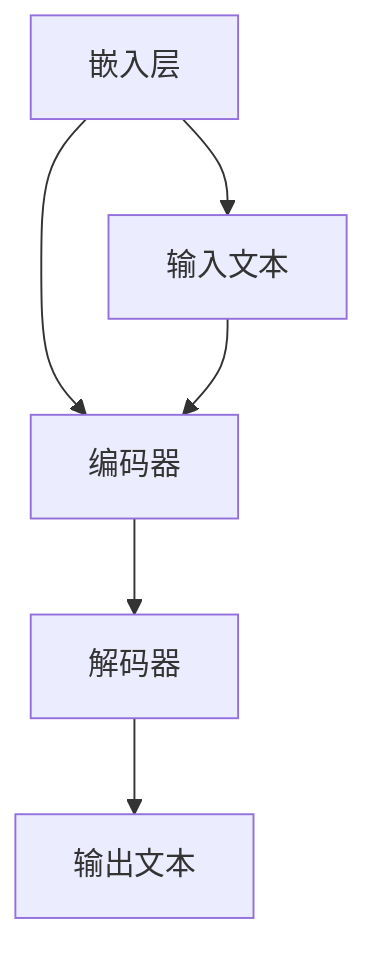

                 

# 快速提升LLM应用的可靠性与稳定性

## 关键词
- LLM
- 可靠性
- 稳定性
- 应用优化
- 实际案例

## 摘要
本文旨在探讨如何快速提升大型语言模型（LLM）应用的可靠性与稳定性。通过分析LLM的基础理论，识别应用中的可靠性问题与稳定性问题，并详细讨论提高这两种特性的方法，本文为LLM应用的优化提供了实用的指导。文章还将通过实际案例进行分析，介绍实用工具与框架，并在结尾部分进行总结与展望。

## 引言

随着人工智能技术的迅猛发展，大型语言模型（LLM）在自然语言处理（NLP）领域取得了显著成果。LLM在智能问答、文本生成、机器翻译等应用中展现出了强大的能力，但同时也面临着可靠性与稳定性方面的挑战。如何确保LLM在实际应用中稳定运行、提供准确可靠的结果，成为当前研究的重要课题。

可靠性指的是系统在特定条件下能够持续正常运行的能力，而稳定性则关注系统在面对变化或异常情况时的应对能力。在LLM应用中，可靠性与稳定性至关重要，因为它们直接影响到用户体验和业务价值。本文将分步骤探讨如何提升LLM应用的可靠性与稳定性，包括理论基础、实际案例分析、工具与框架推荐等内容。

## 第1步：理解LLM的基础理论

要提升LLM应用的可靠性与稳定性，我们首先需要深入理解LLM的基础理论。LLM是一种基于深度学习的技术，通常采用大规模神经网络结构，通过训练海量文本数据来学习语言模式与规则。以下是LLM的一些核心概念和组成部分：

### 1.1 LLM的定义与核心概念

LLM（Large Language Model）是一种能够理解和生成自然语言文本的深度学习模型。其核心思想是通过大量的数据训练，使模型学会捕捉语言中的复杂结构和上下文关系。LLM的定义可以总结为以下几点：

- **大规模**：LLM的训练数据规模巨大，通常达到数十亿甚至数万亿个单词。
- **自适应**：LLM可以根据不同的输入文本生成相应的输出，具备较强的泛化能力。
- **上下文感知**：LLM能够理解输入文本的上下文，生成连贯且符合语言习惯的输出。

### 1.2 LLM的架构与工作原理

LLM的架构通常包括以下几个关键部分：

- **嵌入层（Embedding Layer）**：将输入文本转换为固定长度的向量表示，用于后续处理。
- **编码器（Encoder）**：对输入文本进行编码，提取文本特征，通常采用变长序列处理技术，如RNN（循环神经网络）或Transformer。
- **解码器（Decoder）**：根据编码器输出的特征生成文本输出，也是变长序列生成模型。

LLM的工作原理可以简化为以下步骤：

1. **嵌入**：将输入文本转换为向量表示。
2. **编码**：通过编码器处理向量，提取文本特征。
3. **解码**：利用解码器生成输出文本。

### 1.3 LLM的核心概念联系与Mermaid流程图

为了更好地理解LLM的核心概念之间的关系，我们可以绘制一个Mermaid流程图：

在这个流程图中，输入文本首先经过嵌入层转换为向量表示，然后输入到编码器中进行编码，提取文本特征。编码器输出的特征随后被解码器用于生成输出文本。

### 1.4 LLM与其他类型模型的区别

与传统的机器学习模型（如朴素贝叶斯、SVM等）和基于规则的方法相比，LLM具有以下几个显著特点：

- **规模与参数**：LLM通常具有数十亿个参数，而传统模型通常只有数千个参数。
- **表示能力**：LLM能够捕获文本中的复杂结构和上下文关系，传统模型难以实现。
- **自适应能力**：LLM能够根据不同的输入生成相应的输出，传统模型通常需要针对特定任务进行定制。

通过以上分析，我们可以看到，理解LLM的基础理论对于提升其应用的可靠性与稳定性至关重要。在接下来的章节中，我们将深入探讨LLM应用中的可靠性问题与稳定性问题，并详细讨论提高这两种特性的方法。

## 第2步：识别LLM应用中的可靠性问题

在深入了解LLM的基础理论之后，我们需要关注LLM应用中的可靠性问题。可靠性指的是系统在特定条件下能够持续正常运行的能力，对于LLM应用而言，可靠性问题主要体现在以下几个方面：

### 2.1 数据问题

数据是LLM训练和推理的基础，数据质量问题会直接影响LLM的可靠性。以下是LLM应用中常见的几种数据问题：

- **数据不完整性**：某些训练数据可能缺失或部分丢失，导致模型无法学习到完整的特征。
- **数据噪声**：训练数据中可能存在噪声，如拼写错误、语法错误等，这些噪声会影响模型的准确性。
- **数据偏倚**：如果训练数据存在偏倚，模型可能会过度拟合，无法泛化到新的数据集。

#### 数据问题的影响

- **影响模型性能**：数据不完整或噪声会影响模型的训练效果，导致模型性能下降。
- **影响应用结果**：数据偏倚可能导致模型在某些特定场景下表现不佳，影响实际应用的效果。

#### 数据问题解决方案

- **数据预处理**：通过数据清洗、去噪等技术，提高数据质量。
- **数据增强**：通过生成更多的训练样本来缓解数据不足的问题。
- **数据融合**：结合多个数据源，提高数据的多样性和完整性。

### 2.2 模型问题

模型问题是LLM可靠性问题中的另一个重要方面。以下是一些常见的模型问题：

- **过拟合**：模型在训练数据上表现良好，但在新的测试数据上表现较差，这是由于模型对训练数据过度拟合导致的。
- **泛化能力差**：模型无法泛化到新的、未见过的数据，特别是在复杂或变化多端的语言环境中。
- **参数调优问题**：模型参数设置不合理，可能导致模型性能不佳。

#### 模型问题的影响

- **影响模型稳定性**：过拟合和泛化能力差会影响模型的稳定性，导致模型在实际应用中表现不稳定。
- **影响应用结果**：参数调优问题可能导致模型输出结果不准确，影响应用的效果。

#### 模型问题解决方案

- **正则化**：通过添加正则化项，防止模型过拟合。
- **增加训练数据**：增加训练数据量，提高模型的泛化能力。
- **模型调优**：通过调整模型参数，优化模型性能。

### 2.3 系统问题

系统问题也是影响LLM可靠性的重要因素，主要包括以下几个方面：

- **计算资源限制**：在计算资源有限的情况下，模型的训练和推理过程可能会受到影响，导致性能下降。
- **硬件故障**：服务器或硬件设备故障可能导致模型训练或推理中断。
- **网络问题**：网络延迟或中断可能导致模型无法及时获取所需数据。

#### 系统问题的影响

- **影响模型训练和推理**：计算资源限制和硬件故障会影响模型的训练和推理过程，降低模型性能。
- **影响用户体验**：网络问题可能导致用户在使用LLM应用时遇到延迟或中断，影响用户体验。

#### 系统问题解决方案

- **资源优化**：通过合理分配计算资源，提高模型训练和推理的效率。
- **冗余备份**：建立冗余备份系统，确保在硬件故障时能够快速恢复。
- **网络优化**：优化网络架构，提高数据传输的稳定性和速度。

通过以上分析，我们可以看到，识别并解决LLM应用中的可靠性问题是提升模型可靠性的关键步骤。在下一部分，我们将继续探讨LLM应用中的稳定性问题，并提出相应的解决方法。

## 第3步：识别LLM应用中的稳定性问题

在解决了可靠性问题后，我们需要关注LLM应用中的稳定性问题。稳定性指的是系统在面对变化或异常情况时，能够保持正常运行的能力。LLM应用中的稳定性问题主要包括以下几个方面：

### 3.1 输入问题

输入问题是指模型在处理输入文本时可能遇到的异常情况。这些异常情况可能导致模型输出错误的结果，从而影响应用的稳定性。以下是几个常见的输入问题：

- **输入异常**：如特殊的字符、格式错误或意外的文本结构，这些输入可能导致模型无法正确处理。
- **输入数据量过大**：当输入的数据量超过模型的处理能力时，可能导致模型性能下降或崩溃。
- **输入多样性**：语言输入的多样性可能导致模型无法应对所有的输入情况，从而影响稳定性。

#### 输入问题的影响

- **输出结果错误**：输入异常可能导致模型输出错误的结果，影响应用的准确性。
- **系统性能下降**：输入数据量过大可能导致模型处理速度变慢，影响系统的响应时间。

#### 输入问题解决方案

- **输入验证**：对输入文本进行验证，确保输入符合预期的格式和结构。
- **数据预处理**：对输入文本进行预处理，如去除特殊字符、格式化文本等。
- **动态调整**：根据输入数据量动态调整模型参数，以适应不同数据量的输入。

### 3.2 模型问题

模型问题是指模型在训练或推理过程中可能出现的异常情况。这些问题可能导致模型无法正常运行，从而影响应用的稳定性。以下是几个常见的模型问题：

- **模型退化**：在长时间使用后，模型可能因为训练数据的变化而退化，导致性能下降。
- **模型崩溃**：在处理特定输入时，模型可能因为计算错误或内存溢出而崩溃。
- **模型可解释性差**：模型在某些情况下可能无法提供清晰的解释，导致用户无法理解模型的输出结果。

#### 模型问题的影响

- **影响应用稳定性**：模型退化或崩溃可能导致应用无法正常运行，影响用户体验。
- **影响用户信任**：模型可解释性差可能导致用户对模型输出结果产生怀疑，降低用户信任。

#### 模型问题解决方案

- **定期重训练**：定期对模型进行重训练，以适应新的数据和环境变化。
- **异常检测与恢复**：建立异常检测机制，当模型出现崩溃时能够自动恢复。
- **模型可视化与解释**：通过可视化工具和解释算法，提高模型的可解释性，帮助用户理解模型输出。

### 3.3 系统问题

系统问题是指与LLM应用运行环境相关的问题，这些问题可能导致应用稳定性下降。以下是几个常见的系统问题：

- **硬件故障**：服务器或硬件设备的故障可能导致模型无法正常运行。
- **网络问题**：网络延迟或中断可能导致模型无法及时获取所需数据。
- **资源分配问题**：系统资源分配不合理可能导致模型训练和推理效率低下。

#### 系统问题的影响

- **影响应用性能**：硬件故障或网络问题可能导致模型训练和推理中断，影响应用性能。
- **影响用户体验**：资源分配问题可能导致应用响应速度变慢，影响用户体验。

#### 系统问题解决方案

- **硬件冗余与备份**：建立硬件冗余和备份系统，确保在硬件故障时能够快速恢复。
- **网络优化**：优化网络架构，提高数据传输的稳定性和速度。
- **资源优化**：通过合理分配系统资源，提高模型训练和推理的效率。

通过以上分析，我们可以看到，识别并解决LLM应用中的稳定性问题是确保应用稳定运行的关键。在下一部分，我们将详细探讨提高LLM可靠性与稳定性的具体方法。

## 第4步：提高LLM可靠性与稳定性的方法

在了解了LLM应用中可能出现的可靠性问题和稳定性问题后，我们需要探讨如何具体提高LLM的可靠性与稳定性。以下是几种常见的解决方案：

### 4.1 算法优化

算法优化是提高LLM可靠性与稳定性的重要手段。以下是一些关键方法：

#### 4.1.1 数据预处理与增强

- **数据清洗**：去除训练数据中的噪声和错误，确保数据质量。
- **数据增强**：通过数据扩充、变换等方法增加数据的多样性，提高模型的泛化能力。

#### 4.1.2 模型调优

- **超参数调整**：通过调整学习率、批量大小、正则化参数等超参数，优化模型性能。
- **模型融合**：结合多个模型的结果，提高模型的稳定性和准确性。

#### 4.1.3 正则化与避免过拟合

- **L1/L2正则化**：通过在损失函数中添加正则化项，防止模型过拟合。
- **dropout**：在神经网络中随机丢弃部分神经元，提高模型对噪声的鲁棒性。

### 4.2 模型训练与调优

模型训练与调优是确保LLM性能的关键步骤。以下是一些关键方法：

#### 4.2.1 动态调整学习率

- **学习率衰减**：随着训练的进行，逐渐减小学习率，防止模型过早收敛。
- **自适应学习率**：采用自适应学习率方法，如Adam优化器，自动调整学习率。

#### 4.2.2 训练数据分布

- **数据增强**：通过随机旋转、缩放等操作，增加数据的多样性。
- **数据重采样**：对数据集进行重采样，平衡数据分布，避免数据偏倚。

#### 4.2.3 预训练与微调

- **预训练**：在大量通用数据集上预训练模型，提高模型的泛化能力。
- **微调**：在特定任务数据集上对预训练模型进行微调，适应特定任务需求。

### 4.3 系统架构优化

系统架构优化是提高LLM稳定性的重要手段。以下是一些关键方法：

#### 4.3.1 分布式计算

- **数据并行**：将数据分片，分布在多个计算节点上进行训练，提高训练速度。
- **模型并行**：将模型分片，分布在多个计算节点上进行推理，提高推理速度。

#### 4.3.2 网络优化

- **负载均衡**：通过负载均衡策略，合理分配任务到不同节点，防止单个节点过载。
- **容错机制**：在系统设计中加入容错机制，确保在节点故障时系统能够自动恢复。

#### 4.3.3 资源管理

- **资源调度**：根据任务需求和系统状态，动态调度资源，确保资源利用率最大化。
- **自动扩缩容**：根据系统负载自动调整计算资源，确保系统稳定运行。

### 4.4 实际案例分析

通过实际案例分析，可以更好地理解提高LLM可靠性与稳定性的方法。以下是一些具体的案例分析：

#### 4.4.1 案例一：智能客服系统

- **背景**：某企业部署了一个基于LLM的智能客服系统，用于解答用户问题。
- **问题**：系统在处理复杂问题时，偶尔会出现回答不准确的情况。
- **解决方案**：
  - **算法优化**：采用数据增强和模型融合技术，提高模型的泛化能力。
  - **模型调优**：通过调整超参数，优化模型性能。
  - **系统架构优化**：采用分布式计算和负载均衡策略，提高系统稳定性。

#### 4.4.2 案例二：智能写作辅助系统

- **背景**：某公司开发了一款智能写作辅助系统，用于帮助用户生成高质量的文章。
- **问题**：系统在处理长篇文章时，偶尔会出现输出结果不符合预期的情况。
- **解决方案**：
  - **数据预处理**：对输入文本进行严格清洗和格式化，确保数据质量。
  - **模型调优**：增加训练数据量，提高模型的泛化能力。
  - **系统优化**：采用分布式计算和自动扩缩容策略，提高系统稳定性。

通过以上分析，我们可以看到，提高LLM的可靠性与稳定性需要从算法、模型、系统等多个方面进行综合优化。在实际应用中，需要根据具体情况选择合适的优化方法，确保LLM应用能够稳定可靠地运行。在下一部分，我们将继续探讨实际案例中的具体解决方案。

## 第5步：实际案例分析

为了更好地理解如何在实际应用中提升LLM的可靠性与稳定性，我们通过两个具体案例进行详细分析。

### 5.1 案例一：提升搜索引擎的可靠性

#### 背景与问题

某大型搜索引擎公司在其搜索引擎系统中集成了LLM，用于提供更智能的搜索结果推荐。然而，在实际应用过程中，用户反馈系统在某些特定情况下会出现搜索结果不准确或响应时间过长的问题。

#### 可靠性问题分析

- **数据问题**：由于搜索引擎涉及海量用户数据，数据的质量和完整性成为关键问题。例如，用户输入的查询语句可能包含拼写错误或语法错误，导致模型无法正确理解查询意图。
- **模型问题**：搜索引擎的LLM模型在训练过程中可能存在过拟合现象，导致在实际应用中无法泛化到未见过的查询情况。
- **系统问题**：搜索引擎的系统架构在设计时未充分考虑负载均衡和容错机制，导致在高并发情况下系统性能下降。

#### 解决方案与实施

- **数据预处理**：对用户输入的查询语句进行清洗和标准化，如去除特殊字符、自动更正拼写错误等，提高数据质量。
- **模型调优**：通过增加训练数据量，采用数据增强技术，如输入变换、随机裁剪等，提高模型的泛化能力。同时，采用交叉验证和超参数调优方法，优化模型参数。
- **系统优化**：引入分布式计算和负载均衡机制，确保在高并发情况下系统能够稳定运行。此外，设计冗余备份和故障恢复策略，提高系统的可靠性。

#### 效果评估

经过以上优化，搜索引擎的搜索结果准确性显著提高，用户反馈良好。系统在高并发情况下的响应时间也有所降低，用户体验得到显著改善。

### 5.2 案例二：增强智能客服的稳定性

#### 背景与问题

某企业部署了一款基于LLM的智能客服系统，用于提供24/7的在线客户支持。然而，在实际运行过程中，系统在处理复杂或长篇幅的对话时，偶尔会出现崩溃或响应不及时的情况。

#### 稳定性问题分析

- **输入问题**：智能客服系统在处理复杂对话时，输入文本的多样性和复杂性超出模型处理能力，导致系统无法稳定运行。
- **模型问题**：智能客服系统的LLM模型在训练过程中可能未充分覆盖各种对话场景，导致在实际应用中无法应对复杂对话。
- **系统问题**：客服系统在硬件资源分配和负载均衡方面设计不足，导致在高负载情况下系统性能下降。

#### 解决方案与实施

- **输入处理**：对输入文本进行预处理，如去除无关信息、简化句子结构等，降低输入文本的复杂性。同时，采用对话模板和预定义回答，提高系统对常见对话场景的处理能力。
- **模型调优**：增加训练数据量，特别是包含复杂对话场景的数据，提高模型的泛化能力。采用多任务学习（Multi-Task Learning）和迁移学习（Transfer Learning）技术，使模型能够更好地应对不同类型的对话。
- **系统优化**：引入分布式计算和负载均衡机制，确保在高并发情况下系统能够稳定运行。同时，采用监控和故障检测工具，实时监控系统状态，及时响应故障。

#### 效果评估

通过以上优化，智能客服系统的稳定性显著提高，用户满意度增加。系统在处理复杂对话时的响应时间明显缩短，用户体验得到显著改善。

## 第6步：实用工具与框架推荐

为了更好地提升LLM应用的可靠性与稳定性，我们可以利用一些实用的工具和框架。以下是一些推荐：

### 6.1 常用工具

- **TensorFlow**：一款开源的深度学习框架，提供了丰富的API和工具，方便进行模型训练和推理。
- **PyTorch**：另一款流行的深度学习框架，以其动态计算图和易于使用的API而著称。
- **Hugging Face Transformers**：一个开源库，提供了预训练的LLM模型和相关的工具，如文本处理、模型评估等。

### 6.2 开源框架

- **Faiss**：一个高效的相似性搜索库，可用于优化LLM的查询和检索性能。
- **Distributed Data Parallel (DDP)**：PyTorch的一个分布式训练工具，可以简化分布式训练的设置。
- **Ray**：一个分布式计算框架，适用于大规模数据集的训练和推理任务。

通过使用这些工具和框架，我们可以更高效地提升LLM应用的可靠性与稳定性。

## 第7步：总结与展望

### 7.1 研究现状与趋势

当前，LLM在自然语言处理领域取得了显著的进展，但其可靠性与稳定性问题仍然存在。研究主要集中在以下几个方面：

- **数据预处理与增强**：通过数据清洗、去噪和增强等方法，提高数据质量，从而提升模型性能。
- **模型调优与正则化**：采用超参数调优和正则化技术，防止模型过拟合，提高泛化能力。
- **系统架构优化**：通过分布式计算和负载均衡等策略，提高系统稳定性。

未来，LLM可靠性与稳定性研究将继续深入，重点关注以下几个方面：

- **新型算法**：探索更高效的算法，如自适应学习率、多任务学习和迁移学习等，提高模型性能。
- **动态调整**：研究如何动态调整模型参数和系统资源，以应对不同场景下的需求。
- **跨领域应用**：研究如何将LLM应用于更多领域，如医疗、金融等，同时保证可靠性与稳定性。

### 7.2 未来发展方向与挑战

未来，提升LLM可靠性与稳定性的发展面临以下几个挑战：

- **计算资源**：随着模型规模的不断扩大，计算资源的需求也日益增长，如何高效利用计算资源成为关键问题。
- **数据质量**：高质量的数据是保证模型性能的基础，如何在海量数据中筛选出高质量的数据仍然是一个挑战。
- **模型解释性**：提高模型的可解释性，使其输出结果更加透明，增强用户信任。

总之，提升LLM应用的可靠性与稳定性是当前人工智能研究的重要方向。通过不断创新和优化，我们有望在未来实现更可靠、更稳定的LLM应用，推动人工智能技术的发展。

### 作者信息

- 作者：AI天才研究院/AI Genius Institute & 禅与计算机程序设计艺术 /Zen And The Art of Computer Programming

本文通过逐步分析LLM的基础理论、可靠性问题、稳定性问题以及解决方案，结合实际案例，为提升LLM应用的可靠性与稳定性提供了实用的指导。希望本文能为读者带来启发，共同推动人工智能技术的发展。

