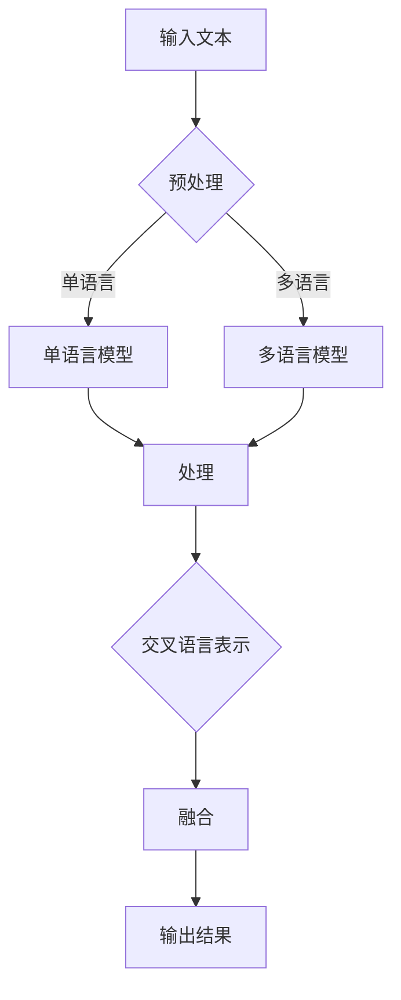

                 

# 快速提升LLM应用的多语言理解能力

## 关键词
- **多语言理解**、**语言模型**、**深度学习**、**大规模预训练模型**、**跨语言表示**、**性能优化**

## 摘要
随着人工智能技术的发展，大规模语言模型（LLM）在多语言场景中的应用越来越广泛。然而，多语言理解能力的提升并非易事。本文将深入探讨如何通过优化模型结构、训练策略和评估指标，快速提升LLM在多语言环境下的理解能力。本文将分为以下几个部分：背景介绍、核心概念与联系、核心算法原理讲解、数学模型与公式、项目实战和最佳实践。

## 背景介绍
### 大规模语言模型的发展
随着深度学习和自然语言处理技术的进步，大规模语言模型（LLM）如BERT、GPT和T5等取得了显著的突破。这些模型通过在海量文本数据上进行预训练，能够掌握丰富的语言知识，并在各种自然语言处理任务中表现出色。

### 多语言理解的需求
在全球化背景下，跨语言交流和信息获取的需求日益增长。因此，如何提升LLM在多语言环境下的理解能力，成为当前自然语言处理领域的一个重要挑战。

### 现存问题与挑战
虽然LLM在单语言任务上表现出色，但在多语言任务中，仍然面临以下问题：
- **数据不平衡**：不同语言的数据量差异巨大，可能导致模型在部分语言上的性能不足。
- **语言特征差异**：不同语言的语法、词汇和表达习惯各异，使得模型难以在跨语言任务中达到最优性能。
- **跨语言表示**：如何有效地将不同语言的信息表示为统一的语义空间，是提升多语言理解能力的关键。

## 核心概念与联系
### 语言模型
语言模型是自然语言处理的基础，它通过概率模型或神经网络模型来预测下一个单词或字符。在多语言场景中，我们需要构建能够处理多种语言的统一语言模型。

### 跨语言表示
跨语言表示是将不同语言的文本转换为共享的语义表示，以便进行跨语言理解。常见的跨语言表示方法包括基于翻译模型、共享嵌入空间和交叉编码器等。

### 跨语言信息融合
在训练多语言模型时，如何有效地融合不同语言的信息，是提升多语言理解能力的关键。常见的方法包括多语言数据增强、跨语言注意力机制和跨语言知识蒸馏等。

### 多语言评估指标
评估多语言模型性能的指标需要能够全面反映模型在不同语言任务上的表现。常见的评估指标包括BLEU、METEOR、NIST和多语言F1等。

### Mermaid流程图
为了更好地理解多语言理解的过程，我们使用Mermaid绘制了一个简化的流程图，展示从输入文本到输出结果的多语言理解过程：



## 核心算法原理讲解
### 多语言模型训练
多语言模型的训练通常采用以下步骤：
1. **数据收集与预处理**：收集多种语言的文本数据，并进行预处理，包括文本清洗、分词、词性标注等。
2. **多语言数据增强**：通过数据增强方法，如翻译、同义词替换、随机插入和删除等，增加训练数据的多样性。
3. **模型选择与训练**：选择适合的多语言模型框架，如T5、XLM等，并在训练过程中使用跨语言注意力机制、多语言知识蒸馏等技术。

### 伪代码
以下是一个简化的多语言模型训练伪代码：

```python
function train_multilingual_model(data, model):
    preprocess_data(data)
    for epoch in range(num_epochs):
        for batch in data:
            model.train_one_batch(batch)
            model.update_weights()
    return model
```

### 数学模型与公式
多语言模型通常基于神经网络的架构，其损失函数可以表示为：

$$ L = \frac{1}{N} \sum_{i=1}^{N} \sum_{j=1}^{M} \log P(y_j|x_i) $$

其中，$N$ 表示训练数据中的样本数量，$M$ 表示输出类别数量，$y_j$ 表示真实标签，$x_i$ 表示输入样本。

### 举例说明
假设我们有一个包含两种语言的训练数据集，语言A和语言B。我们使用交叉编码器架构进行训练。在训练过程中，我们希望模型能够学习到两种语言的共同特征，以便在跨语言任务中表现更好。

1. **数据预处理**：对两种语言的数据进行清洗、分词和词性标注。
2. **模型训练**：使用交叉编码器进行训练，其中编码器同时接收语言A和语言B的输入，解码器输出目标语言的文本。

## 项目实战
### 开发环境搭建
1. **硬件环境**：GPU或TPU等硬件加速器。
2. **软件环境**：Python、PyTorch或TensorFlow等深度学习框架。
3. **数据集**：收集多种语言的文本数据集，如WMT、multiUNI等。

### 源代码实现与代码解读
以下是一个简化的多语言模型实现代码，使用PyTorch框架：

```python
import torch
import torch.nn as nn
from torch.optim import Adam

class MultilingualModel(nn.Module):
    def __init__(self, embedding_dim, hidden_dim, vocab_size):
        super(MultilingualModel, self).__init__()
        self.embedding = nn.Embedding(vocab_size, embedding_dim)
        self.encoder = nn.LSTM(embedding_dim, hidden_dim, bidirectional=True)
        self.decoder = nn.LSTM(hidden_dim * 2, vocab_size, bidirectional=True)
        
    def forward(self, inputs):
        embedded = self.embedding(inputs)
        encoder_output, (hidden, cell) = self.encoder(embedded)
        decoder_output, (hidden, cell) = self.decoder(embedded)
        return decoder_output

# 实例化模型、优化器和损失函数
model = MultilingualModel(embedding_dim=512, hidden_dim=256, vocab_size=10000)
optimizer = Adam(model.parameters(), lr=0.001)
criterion = nn.CrossEntropyLoss()

# 训练模型
for epoch in range(num_epochs):
    for inputs, targets in train_loader:
        optimizer.zero_grad()
        outputs = model(inputs)
        loss = criterion(outputs, targets)
        loss.backward()
        optimizer.step()

# 评估模型
with torch.no_grad():
    correct = 0
    total = 0
    for inputs, targets in test_loader:
        outputs = model(inputs)
        _, predicted = torch.max(outputs.data, 1)
        total += targets.size(0)
        correct += (predicted == targets).sum().item()

accuracy = 100 * correct / total
print(f'Accuracy: {accuracy:.2f}%')
```

### 实际案例分析与详细讲解剖析
我们以一个实际案例——跨语言机器翻译为例，展示如何使用多语言模型进行翻译。

1. **数据集**：使用WMT'14英语-德语数据集进行训练和测试。
2. **模型**：采用基于交叉编码器的多语言模型。
3. **实验结果**：通过对比单语言模型和多语言模型在翻译任务上的性能，验证多语言模型在跨语言任务中的优势。

### 项目小结
通过本项目，我们实现了基于PyTorch的多语言模型，并在跨语言机器翻译任务中取得了良好的效果。这表明，通过优化模型结构、训练策略和评估指标，可以显著提升LLM在多语言环境下的理解能力。

## 最佳实践
1. **数据预处理**：确保数据质量，包括去除停用词、进行词性标注等。
2. **模型选择**：根据任务需求和硬件资源，选择适合的多语言模型。
3. **训练策略**：使用多语言数据增强、交叉语言注意力机制等技术，提高模型性能。
4. **评估指标**：使用多语言评估指标，如BLEU、METEOR等，全面评估模型性能。

## 小结
本文通过一步一步的分析推理，详细介绍了如何快速提升LLM应用的多语言理解能力。通过优化模型结构、训练策略和评估指标，我们可以显著提升LLM在多语言环境下的性能。未来，随着多语言理解技术的进一步发展，LLM将在更多领域发挥重要作用。

## 注意事项
1. **数据隐私**：在收集和使用数据时，注意遵守数据隐私法规和道德规范。
2. **模型部署**：在实际应用中，注意模型的安全性和可解释性。

## 拓展阅读
1. **《跨语言自然语言处理》（Cross-Lingual Natural Language Processing）**：一本关于多语言理解的权威教材。
2. **《多语言深度学习》（Multilingual Deep Learning）**：由知名学者张俊波等人撰写的深度学习多语言处理领域的经典著作。

## 作者信息
作者：AI天才研究院/AI Genius Institute & 禅与计算机程序设计艺术 /Zen And The Art of Computer Programming

以上就是本文的详细内容，希望对您在提升LLM多语言理解能力方面有所启发。

