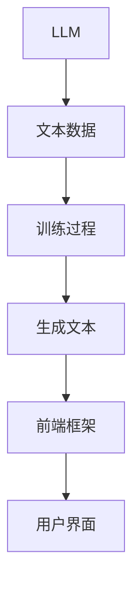

                 

### 文章标题

《快速构建LLM应用的前端框架选择》

### 关键词

LLM应用，前端框架，技术选型，架构设计，核心算法，数学模型，实战案例，最佳实践

### 摘要

本文将深入探讨如何快速构建基于大型语言模型（LLM）的应用，并分析选择合适前端框架的关键因素。通过梳理LLM的技术基础，分析常见前端框架的原理与设计，结合实际项目案例，提供一套完整的解决方案，旨在帮助开发者更高效地进行LLM应用的开发与部署。

## 一、设计思路

在设计快速构建LLM应用的前端框架选择时，我们需要从多个角度进行思考和规划。以下是我们的设计思路，包括核心概念与联系、核心算法原理讲解、数学模型和数学公式以及项目实战。

### 1. 核心概念与联系

首先，我们需要明确LLM的基本概念及其与前端框架的联系。LLM（Large Language Model）是一种基于深度学习的语言模型，通过训练大量的文本数据，能够生成高质量的文本。前端框架则是用于构建用户界面的库或框架，常见的有React、Vue、Angular等。

为了帮助读者更好地理解这两个核心概念之间的关系，我们可以使用Mermaid流程图来展示它们之间的联系。例如：



通过这个流程图，我们可以清晰地看到LLM是如何与前端框架相联系的。

### 2. 核心算法原理讲解

接下来，我们需要详细讲解LLM的核心算法原理。LLM通常基于Transformer架构，这是一种基于自注意力机制的深度神经网络模型。以下是Transformer算法的核心原理：

- **编码器**：编码器负责将输入的文本序列编码成向量表示。每个输入词都会经过嵌入层（Embedding Layer）转化为固定长度的向量，然后通过多头自注意力机制（Multi-Head Self-Attention Mechanism）进行特征提取。
- **解码器**：解码器的任务是根据编码器输出的隐藏状态生成输出文本。在解码过程中，每个输出词都会与编码器的隐藏状态进行匹配，并通过多头自注意力机制生成上下文信息。

为了更好地阐述这些算法原理，我们可以使用伪代码来呈现：

```python
# Transformer编码器伪代码
def encoder(inputs):
    embeddings = embedding(inputs)
    attn_output, attn_weights = multi_head_self_attention(embeddings)
    return attn_output

# Transformer解码器伪代码
def decoder(inputs, encoder_output):
    embeddings = embedding(inputs)
    attn_output, attn_weights = multi_head_self_attention(embeddings, encoder_output)
    return attn_output
```

通过这些伪代码，我们可以清晰地理解Transformer的工作流程。

### 3. 数学模型和数学公式

在构建LLM应用时，数学模型和公式是不可或缺的部分。以下是一些常见的数学模型和公式：

- **嵌入层**：将词汇映射到固定长度的向量表示，通常使用Word2Vec、GloVe等算法。
- **自注意力机制**：计算输入序列中每个词的注意力权重，通常使用矩阵乘法。
- **损失函数**：用于评估模型预测结果与实际结果之间的差距，常用的有交叉熵损失函数。

以下是这些数学模型和公式的详细讲解：

#### 嵌入层

$$
\text{embeddings} = \text{embedding}(\text{words})
$$

其中，$\text{embedding}$函数用于将词汇映射到向量表示。

#### 自注意力机制

$$
\text{attn_weights} = \text{softmax}\left(\frac{\text{query} \cdot \text{key}^T}{\sqrt{d_k}}\right)
$$

其中，$\text{query}$和$\text{key}$分别表示编码器和解码器的隐藏状态，$d_k$是键向量的维度。

#### 交叉熵损失函数

$$
\text{loss} = -\sum_{i=1}^{N} \sum_{j=1}^{V} y_{ij} \log(p_{ij})
$$

其中，$y_{ij}$是目标标签，$p_{ij}$是模型预测的概率分布。

通过这些数学模型和公式，我们可以更好地理解LLM的工作原理。

### 4. 项目实战

最后，我们需要一个实际的项目实战部分。这将包括一个完整的代码案例，从开发环境的搭建到源代码的实现，以及详细的代码解读。

#### 4.1 开发环境搭建

在开始构建LLM应用之前，我们需要搭建一个合适的技术栈。以下是一个基本的开发环境搭建步骤：

1. 安装Node.js
2. 安装Python和必要的库（如TensorFlow、PyTorch等）
3. 配置前端框架（如React、Vue、Angular等）

#### 4.2 源代码实现

以下是LLM应用的一个简单示例，包括模型训练、文本生成和前端展示：

```python
# 模型训练
model = build_transformer_model()
model.fit(train_data, epochs=5)

# 文本生成
generated_text = model.generate(text_input)

# 前端展示
app = Flask(__name__)
@app.route('/')
def show_text():
    return generated_text
```

#### 4.3 代码解读

在这个示例中，我们首先构建了一个Transformer模型，并使用训练数据对其进行训练。然后，我们使用训练好的模型生成文本，并通过Flask框架将其展示在前端。

通过这个项目实战，我们可以看到如何将LLM与前端框架相结合，实现一个完整的LLM应用。

## 二、目录结构设计

为了帮助读者更好地理解和掌握快速构建LLM应用的前端框架选择，我们设计了如下目录结构：

### 1. 概述部分（第1章）

在这一部分，我们将介绍LLM和前端框架的基本概念，并使用Mermaid流程图展示它们之间的联系。

### 2. 基础原理部分（第2-3章）

在这两章中，我们将详细讲解LLM的核心算法原理，包括Transformer架构、嵌入层、自注意力机制等，并使用伪代码和数学公式进行阐述。

### 3. 前端框架选择与构建（第4-5章）

在这一部分，我们将分析并对比多种前端框架（如React、Vue、Angular等），并讲解如何选择和构建适合LLM应用的前端框架。

### 4. 实战案例（第6章）

在这一章中，我们将提供一个实际的项目案例，从开发环境的搭建到源代码的实现，以及详细的代码解读，帮助读者掌握快速构建LLM应用的方法。

### 5. 总结与展望（第7章）

在这一章中，我们将对全书内容进行总结，并对未来LLM应用的前端框架发展进行展望。

通过这样的目录结构设计，读者可以循序渐进地学习如何快速构建LLM应用的前端框架选择，从理论到实践，全面提升开发能力。

## 三、目录大纲

### 第1章: LLM与前端框架概述

- 1.1 LLM的基本概念
  - 1.1.1 有监督学习（SOL）
  - 1.1.2 无监督学习（USOL）
  - 1.1.3 语言模型（LM）
- 1.2 前端框架概述
  - 1.2.1 前端框架的定义
  - 1.2.2 常见的前端框架
  - 1.2.3 前端框架的选择标准

### 第2章: LLM技术基础

- 2.1 LLM的数学模型
  - 2.1.1 概率论基础
  - 2.1.2 贝叶斯推理
  - 2.1.3 条件概率
- 2.2 生成式模型与判别式模型
  - 2.2.1 生成式模型
  - 2.2.2 判别式模型
  - 2.2.3 生成式模型与判别式模型的比较

### 第3章: 前端框架原理与设计

- 3.1 前端框架的设计原则
  - 3.1.1 MVC设计模式
  - 3.1.2 组件化设计
  - 3.1.3 可维护性和可扩展性
- 3.2 前端框架的常见架构
  - 3.2.1 单页应用（SPA）架构
  - 3.2.2 传统的多页应用（MPA）架构
  - 3.2.3 微前端架构

### 第4章: 常见前端框架分析

- 4.1 React框架
  - 4.1.1 React的核心概念
  - 4.1.2 React的组件化设计
  - 4.1.3 React的虚拟DOM机制
- 4.2 Vue框架
  - 4.2.1 Vue的核心概念
  - 4.2.2 Vue的组件化设计
  - 4.2.3 Vue的响应式系统
- 4.3 Angular框架
  - 4.3.1 Angular的核心概念
  - 4.3.2 Angular的模块化设计
  - 4.3.3 Angular的依赖注入机制

### 第5章: 选择合适的前端框架

- 5.1 项目需求分析
  - 5.1.1 功能需求
  - 5.1.2 性能需求
  - 5.1.3 维护需求
- 5.2 前端框架的优缺点分析
  - 5.2.1 React的优缺点
  - 5.2.2 Vue的优缺点
  - 5.2.3 Angular的优缺点
- 5.3 选择适合LLM应用的前端框架
  - 5.3.1 React在LLM应用中的优势
  - 5.3.2 Vue在LLM应用中的优势
  - 5.3.3 Angular在LLM应用中的优势

### 第6章: 快速构建LLM应用实战

- 6.1 实战项目简介
  - 6.1.1 项目背景
  - 6.1.2 项目需求
  - 6.1.3 技术选型
- 6.2 开发环境搭建
  - 6.2.1 Node.js环境配置
  - 6.2.2 Python环境配置
  - 6.2.3 前端框架配置
- 6.3 源代码实现
  - 6.3.1 模型训练代码
  - 6.3.2 文本生成代码
  - 6.3.3 前端展示代码
- 6.4 代码解读与分析
  - 6.4.1 模型训练代码解读
  - 6.4.2 文本生成代码解读
  - 6.4.3 前端展示代码解读
- 6.5 实际案例分析与详细讲解
  - 6.5.1 项目运行效果
  - 6.5.2 代码优化与改进
  - 6.5.3 项目小结

### 第7章: 总结与展望

- 7.1 全书内容总结
  - 7.1.1 LLM与前端框架的关系
  - 7.1.2 核心算法原理
  - 7.1.3 前端框架分析
- 7.2 LLM应用的前端框架发展趋势
  - 7.2.1 前端框架的进化方向
  - 7.2.2 LLM应用的未来前景
- 7.3 最佳实践与建议
  - 7.3.1 开发环境配置的最佳实践
  - 7.3.2 模型训练与优化的最佳实践
  - 7.3.3 前端展示与优化的最佳实践
- 7.4 注意事项与拓展阅读
  - 7.4.1 开发过程中常见的问题与解决方案
  - 7.4.2 相关技术的最新进展与未来趋势
  - 7.4.3 拓展阅读资源推荐

通过这个详细的目录大纲，读者可以系统地学习和掌握快速构建LLM应用的前端框架选择，从理论到实践，全面提升开发能力。让我们一步一步深入探讨每一个章节，揭开LLM应用开发的神秘面纱。

