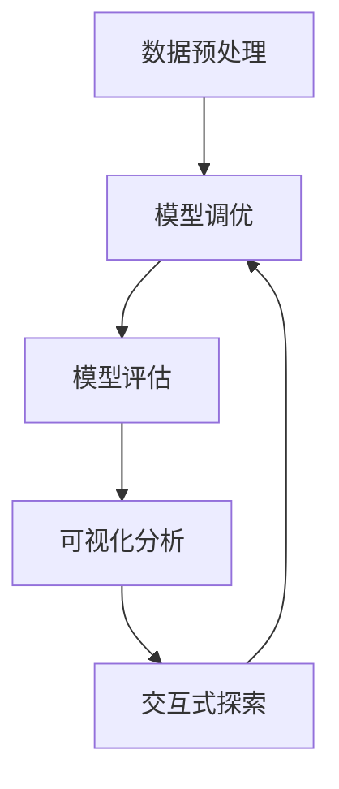

                 

### 摘要

本文旨在探讨如何快速构建基于大型语言模型（LLM）的应用，并介绍一款可视化分析工具在此过程中的关键作用。在本文中，我们将首先概述LLM和可视化分析的基本概念，解释它们之间的关系，并详细探讨LLM的工作原理以及可视化分析的技术方法。随后，通过Mermaid流程图展示LLM模型与可视化分析工具之间的核心联系。接着，本文将深入讲解与LLM应用相关的数学模型和公式，并提供具体示例。随后，通过实际项目案例展示如何利用可视化分析工具构建LLM应用，包括开发环境搭建、源代码实现与解读、应用分析与项目小结等。最后，本文将总结全文内容，并提供一些最佳实践建议，展望未来发展趋势。

### 文章标题：快速构建LLM应用的可视化分析工具

关键词：LLM，可视化分析，核心算法，数学模型，项目实战，开发环境

### 摘要

本文围绕如何快速构建基于大型语言模型（LLM）的应用，探讨了一款可视化分析工具在其中的重要作用。文章首先介绍了LLM和可视化分析的基本概念，并展示了它们之间的核心联系。接着，本文深入探讨了LLM的工作原理、可视化分析的技术方法，以及相关的数学模型和公式。随后，通过具体项目案例，详细展示了如何利用可视化分析工具构建LLM应用，包括开发环境搭建、源代码实现与解读、应用分析与项目小结等。最后，本文总结了全文内容，提供了最佳实践建议，并展望了未来发展趋势。

## 第1章：LLM与可视化分析基础

### 1.1 LLM概述

#### 1.1.1 LLM的定义与分类

大型语言模型（LLM，Large Language Model）是一种基于深度学习技术的自然语言处理（NLP，Natural Language Processing）模型，能够对大规模文本数据进行分析和处理。LLM主要通过神经网络架构（如Transformer）训练而成，能够学习并模拟人类语言生成和理解的复杂过程。根据其训练数据集的大小、应用场景和功能，LLM可以分为以下几类：

1. **通用型LLM**：这类模型主要用于处理通用语言任务，如文本生成、文本分类、机器翻译等。例如，GPT（Generative Pre-trained Transformer）系列模型。
2. **领域特定LLM**：这类模型专注于特定领域的语言任务，如法律文档分析、医疗文本处理、金融文本分析等。例如，BERT（Bidirectional Encoder Representations from Transformers）在特定领域上的优化版本。
3. **问答型LLM**：这类模型擅长从大规模数据中提取信息，以回答用户提出的问题。例如，OpenAI的GPT-3。

#### 1.1.2 LLM的主要特点与应用

LLM的主要特点包括：

1. **强大的语言理解能力**：LLM能够理解文本的深层含义，并生成符合语言习惯的输出。
2. **自适应性**：LLM可以根据不同的任务和数据集进行微调和优化，适应特定应用场景。
3. **可扩展性**：LLM模型通常在训练阶段已经处理了大量的数据，因此可以轻松扩展到不同的语言和任务。

LLM的主要应用场景包括：

1. **文本生成**：包括文章写作、对话生成、故事创作等。
2. **文本分类**：用于分类新闻、邮件、社交媒体内容等。
3. **机器翻译**：将一种语言翻译成另一种语言。
4. **问答系统**：构建智能客服、智能搜索引擎等。

### 1.2 可视化分析概述

#### 1.2.1 可视化分析的定义与作用

可视化分析（Visualization Analysis）是指利用图表、图像和交互式界面等视觉元素，将复杂的数据和信息以直观、易于理解的形式呈现出来。其定义包括以下几方面：

1. **数据可视化**：将数据转换为图形或图表，以便更直观地展示数据特征。
2. **信息可视化**：展示数据之间的相互关系，发现数据中的模式、趋势和异常。
3. **交互式可视化**：用户可以通过交互方式探索数据，获取更多细节信息。

可视化分析的作用包括：

1. **数据理解**：帮助用户快速理解数据的本质和趋势。
2. **决策支持**：提供直观的数据展示，辅助决策者做出更明智的决策。
3. **沟通与协作**：通过图形化展示，便于团队内部和跨部门之间的沟通与协作。

#### 1.2.2 可视化分析的工具与技术

常见的可视化分析工具和技术包括：

1. **图表类型**：柱状图、折线图、饼图、散点图、箱线图等。
2. **交互式可视化**：D3.js、Plotly、Bokeh等库，用于创建交互式图表和可视化界面。
3. **数据可视化库**：如Matplotlib、Seaborn、Tableau等，用于快速生成各种类型的图表。
4. **大数据可视化**：如Hadoop、Spark等，用于处理和可视化大规模数据。

### 1.3 LLM与可视化分析的关系

#### 1.3.1 LLM在可视化分析中的应用

LLM在可视化分析中的应用主要体现在以下几个方面：

1. **文本数据可视化**：利用LLM生成的文本摘要、关键词提取和情感分析结果，为可视化分析提供数据支持。
2. **交互式问答**：LLM可以与可视化工具结合，提供实时交互式的问答功能，帮助用户深入理解数据。
3. **可视化内容生成**：LLM可以根据用户的查询和可视化需求，生成相应的图表和可视化内容。

#### 1.3.2 可视化分析对LLM模型的辅助作用

可视化分析对LLM模型的辅助作用主要包括：

1. **模型评估**：通过可视化分析，可以更直观地评估LLM模型的性能和效果，发现潜在问题。
2. **模型优化**：基于可视化分析结果，可以对LLM模型进行调优和改进。
3. **应用探索**：通过可视化分析，可以发现新的应用场景和需求，为LLM模型的发展提供方向。

## 第2章：核心概念与联系

### 2.1 Mermaid流程图展示

在本章节中，我们将使用Mermaid流程图来展示LLM模型与可视化分析工具之间的核心联系。Mermaid是一种简单的图表绘制语言，可以方便地绘制各种流程图、序列图、类图等。

下面是一个示例的Mermaid流程图，展示了LLM模型的训练和可视化分析工具的应用：



这个流程图可以分为以下几个步骤：

1. **数据预处理**：对输入数据进行清洗、处理和格式化，为LLM模型训练做准备。
2. **LLM模型训练**：使用预处理后的数据对LLM模型进行训练，生成模型参数。
3. **模型评估**：评估训练好的LLM模型性能，包括准确率、召回率等指标。
4. **可视化分析**：使用可视化分析工具将模型评估结果以图形化形式展示，便于用户理解。
5. **交互式探索**：用户可以通过交互方式探索可视化结果，获取更多细节信息。
6. **模型调优**：根据可视化分析结果，对LLM模型进行调优和改进。

通过这个流程图，我们可以清晰地看到LLM模型与可视化分析工具之间的相互作用和依赖关系。这种可视化方式有助于我们更好地理解和分析LLM应用的整体架构和流程。

### 2.2 LLM与可视化分析的核心联系

在本章节中，我们将进一步探讨LLM与可视化分析之间的核心联系。LLM和可视化分析都是现代数据科学和人工智能领域的重要工具，它们在多个方面相互补充，共同推动技术进步。

#### 2.2.1 LLM在可视化分析中的应用

LLM在可视化分析中的应用主要体现在以下几个方面：

1. **文本数据可视化**：LLM能够对大量文本数据进行分析和处理，生成摘要、关键词提取和情感分析结果。这些结果可以作为可视化分析的输入，帮助用户更直观地理解文本数据。

2. **交互式问答**：LLM可以与可视化分析工具结合，提供实时交互式的问答功能。用户可以通过提问，获取与可视化结果相关的详细信息，从而更深入地了解数据。

3. **可视化内容生成**：LLM可以根据用户的查询和需求，生成相应的图表和可视化内容。例如，用户可以要求LLM根据数据生成一个特定的折线图或饼图，从而快速展示数据趋势。

#### 2.2.2 可视化分析对LLM模型的辅助作用

可视化分析对LLM模型的辅助作用主要体现在以下几个方面：

1. **模型评估**：通过可视化分析，可以更直观地评估LLM模型的性能和效果。例如，使用散点图展示模型预测结果和实际值之间的差异，帮助我们发现模型存在的问题。

2. **模型优化**：基于可视化分析结果，可以对LLM模型进行调优和改进。例如，通过可视化分析发现模型在某些数据点上表现不佳，可以针对性地调整模型参数或增加训练数据。

3. **应用探索**：通过可视化分析，可以发现新的应用场景和需求。例如，通过分析数据可视化结果，我们可以发现一些潜在的业务机会或优化方向，为LLM模型的发展提供方向。

#### 2.2.3 LLM与可视化分析的核心联系

LLM与可视化分析之间的核心联系可以概括为以下几点：

1. **数据理解与探索**：LLM和可视化分析都是帮助用户理解和探索复杂数据的重要工具。LLM通过对文本数据的处理，提供深入的分析和见解；而可视化分析则通过图形化方式展示数据，帮助用户快速把握数据特征。

2. **模型评估与优化**：LLM和可视化分析在模型评估和优化过程中发挥重要作用。通过可视化分析，我们可以更直观地评估模型性能，发现潜在问题；而LLM则可以帮助我们针对问题进行模型优化，提高模型效果。

3. **交互式应用**：LLM和可视化分析的结合，可以创造出丰富的交互式应用场景。用户可以通过交互式问答和可视化探索，获取更多数据信息和洞察，从而更好地利用LLM模型。

总之，LLM与可视化分析之间的核心联系体现在它们在数据理解、模型评估和交互式应用等多个方面的互补和协同作用。通过结合这两大工具，我们可以更高效地构建和应用LLM模型，推动人工智能技术的发展。

### 2.3 LLM与可视化分析的关键联系

在本章节中，我们将详细讨论LLM与可视化分析之间的关键联系，通过具体示例来展示这两者如何结合，以提升数据分析的效率和可理解性。

#### 2.3.1 数据可视化中的LLM应用

首先，让我们考虑一个典型的数据可视化场景：一个电子商务网站希望分析其用户的购买行为，并识别出潜在的购物模式。为此，该网站收集了大量的用户行为数据，包括浏览历史、购买记录、搜索关键词等。

1. **文本数据摘要**：使用LLM，我们可以对用户评论、评价和产品描述等文本数据进行摘要提取。例如，对于一个包含1000条评论的数据集，LLM可以生成简短的摘要，提取出关键信息和用户反馈的核心内容。这些摘要可以作为数据可视化的一部分，帮助用户快速理解大量文本数据。

2. **关键词提取**：通过LLM的关键词提取功能，我们可以识别出用户行为数据中的高频词汇和短语。这些关键词可以作为可视化图表的标签，例如在词云图中展示，从而突出数据中的关键特征。

3. **情感分析**：LLM还可以对用户评论进行情感分析，识别出正面、负面或中性的情感倾向。这些情感标签可以与用户行为数据一起可视化，帮助用户了解用户对产品或服务的整体感受。

#### 2.3.2 可视化分析对LLM模型的辅助作用

接下来，我们探讨可视化分析在LLM模型评估和优化中的作用。

1. **模型性能评估**：通过可视化工具，我们可以直观地评估LLM模型的性能。例如，使用散点图或热力图来展示模型预测结果与实际结果之间的差异。这种可视化方式可以帮助我们快速识别模型在哪些数据点上表现不佳，从而为模型优化提供线索。

2. **模型调优指导**：基于可视化分析结果，我们可以进行模型参数的调整。例如，如果可视化结果显示某些类别或特征的预测准确率较低，我们可以考虑增加这些类别或特征的数据量，或者调整模型的架构和参数。

3. **用户反馈收集**：可视化分析还可以用于收集用户对LLM模型的反馈。通过用户与可视化结果的交互，我们可以了解用户对模型预测的满意度，并根据用户的反馈进行改进。

#### 2.3.3 具体示例

为了更具体地说明LLM与可视化分析的结合，以下是一个实际项目示例：

**项目背景**：一个在线教育平台希望利用LLM模型和可视化分析工具来分析学生的学习行为，以优化课程内容和提高学习效果。

**解决方案**：

1. **数据收集**：平台收集了学生的学习数据，包括课程访问记录、测试成绩、互动行为等。

2. **文本数据摘要**：使用LLM对课程描述和用户评论进行文本摘要提取，将关键信息呈现在数据可视化工具中。

3. **学习行为可视化**：利用可视化分析工具，将学生的学习行为数据以图表形式展示，包括学习路径、学习时长、测试结果等。

4. **模型性能评估**：通过可视化分析，平台可以评估LLM模型在预测学生成绩和推荐课程方面的性能。例如，使用混淆矩阵和ROC曲线展示模型的准确率和召回率。

5. **模型调优**：基于可视化分析结果，平台可以对LLM模型进行调整，例如增加特定的特征工程，或调整模型的超参数。

6. **用户反馈**：通过交互式的可视化工具，学生可以提供对课程推荐和成绩预测的反馈，平台可以根据用户的反馈进一步优化模型。

通过这个项目示例，我们可以看到LLM与可视化分析在数据理解、模型评估和用户互动等多个方面的关键联系。这种结合不仅提高了数据分析的效率和准确性，还增强了用户体验，为平台提供了宝贵的优化方向。

总之，LLM与可视化分析的结合为复杂数据的处理和分析提供了一种强大的工具。通过利用这两者的优势，我们可以更有效地构建和应用LLM模型，从而在多个领域实现数据驱动的决策和优化。

### 第3章：核心算法原理讲解

#### 3.1 LLM算法原理

大型语言模型（LLM）的核心算法是基于深度学习技术，特别是基于自注意力机制（Self-Attention）的Transformer架构。本节将详细讲解LLM算法的基本原理，包括模型结构、训练过程和优化方法。

##### 3.1.1 模型结构

LLM模型通常由以下几部分组成：

1. **嵌入层（Embedding Layer）**：将输入的单词或词组转换为固定长度的向量表示。这个过程中会使用预训练的词向量（如Word2Vec、GloVe）或基于上下文的表示（如BERT）。

2. **自注意力层（Self-Attention Layer）**：这是Transformer模型的核心部分，通过计算输入序列中每个词与其他词之间的关联性，生成更丰富的词表示。

3. **前馈网络（Feedforward Network）**：在自注意力层之后，每个词的表示会通过两个全连接层进行进一步处理，以提取更复杂的特征。

4. **输出层（Output Layer）**：最终的输出层通常是softmax层，用于预测下一个词的概率分布。

##### 3.1.2 训练过程

LLM模型的训练过程主要包括以下步骤：

1. **数据预处理**：对输入文本进行分词、去停用词、词干提取等预处理操作，并将预处理后的文本转换为序列。

2. **构建损失函数**：LLM的训练目标是最小化损失函数，通常使用交叉熵损失函数（Cross-Entropy Loss），以预测的词的概率分布与实际标签之间的差异来衡量模型性能。

3. **反向传播（Backpropagation）**：在每次预测后，计算损失函数的梯度，并通过反向传播更新模型参数。

4. **优化算法**：常用的优化算法包括SGD（随机梯度下降）、Adam等，以加速训练过程并提高收敛速度。

##### 3.1.3 优化方法

为了提高LLM模型的性能，可以采用以下优化方法：

1. **预训练与微调（Pre-training and Fine-tuning）**：首先在大量的未标注文本数据上进行预训练，使模型具有通用语言理解能力；然后，在特定任务的数据集上进行微调，使模型适应特定任务的需求。

2. **数据增强（Data Augmentation）**：通过增加数据多样性，如文本重写、随机删除词或插入词等，可以提高模型的泛化能力。

3. **多任务学习（Multi-task Learning）**：通过在同一模型中训练多个任务，共享模型参数，可以进一步提高模型的性能。

以下是一个简化的LLM模型训练过程的伪代码：

```python
# 初始化模型参数
model = initialize_model()

# 数据预处理
train_data = preprocess_data(train_texts)

# 训练过程
for epoch in range(num_epochs):
    for batch in train_data:
        # 前向传播
        predictions = model(batch)

        # 计算损失
        loss = compute_loss(predictions, batch_labels)

        # 反向传播
        gradients = backwardPropagation(model, loss)

        # 更新模型参数
        update_model_params(model, gradients)

# 微调
fine_tuned_model = fine_tune(model, task_specific_data)
```

通过上述伪代码，我们可以看到LLM模型的训练过程主要包括初始化模型参数、数据预处理、前向传播、计算损失、反向传播和更新模型参数等步骤。这些步骤构成了LLM训练的基本框架，帮助模型逐步优化其参数，从而提高预测性能。

#### 3.2 可视化分析算法

可视化分析算法的核心目的是将复杂数据转换为易于理解和交互的视觉表示。以下是一些常用的可视化分析算法及其基本原理：

##### 3.2.1 数据可视化基本原理

数据可视化基本原理包括以下几个关键步骤：

1. **数据转换**：将原始数据转换为适合可视化分析的格式，如数值数据、分类数据、时间序列数据等。

2. **选择适当的图表类型**：根据数据类型和可视化目标，选择合适的图表类型，如柱状图、折线图、饼图、散点图等。

3. **数据编码**：将数据编码为视觉元素，如颜色、大小、位置等，以传达数据的重要信息和模式。

4. **交互式设计**：提供交互式元素，如筛选、过滤、排序等，使用户能够动态探索数据，发现隐藏的模式和趋势。

##### 3.2.2 可视化分析算法的应用

以下是几种常见的数据可视化分析算法及其应用：

1. **散点图（Scatter Plot）**：用于展示两个或多个变量之间的关系。通过在坐标系中标记数据点的位置，可以直观地观察数据之间的相关性。

2. **箱线图（Box Plot）**：用于展示一组数据的分布特征，包括最小值、第一四分位数、中位数、第三四分位数和最大值。箱线图可以有效地揭示数据的异常值和分布趋势。

3. **热力图（Heatmap）**：用于展示多维数据的密度分布。通过颜色深浅表示数据的值大小，热力图可以有效地展示数据中的模式和关联性。

4. **词云图（Word Cloud）**：用于展示文本数据中的关键词频率。高频词以大字体展示，低频词以小字体展示，从而直观地反映文本内容的主题和重点。

以下是一个示例的伪代码，展示了如何使用可视化分析算法将文本数据转换为词云图：

```python
import matplotlib.pyplot as plt
from wordcloud import WordCloud

# 准备文本数据
text_data = "这里是文本数据..."

# 创建词云对象
wordcloud = WordCloud(width=800, height=800, background_color="white").generate(text_data)

# 显示词云图
plt.figure(figsize=(8, 8))
plt.imshow(wordcloud, interpolation="bilinear")
plt.axis("off")
plt.show()
```

通过上述示例，我们可以看到如何使用WordCloud库将文本数据转换为词云图。词云图可以帮助我们快速了解文本数据的主题和关键词，从而进行进一步的分析和解读。

#### 3.3 可视化分析算法的应用

在本节中，我们将进一步探讨可视化分析算法在实际应用中的具体方法。通过具体的实例，我们将展示如何使用可视化分析算法来提升LLM模型的效果，并解释其背后的原理。

##### 3.3.1 项目背景

假设我们有一个在线教育平台，目标是使用LLM模型为学生提供个性化课程推荐。为了实现这一目标，平台收集了大量的学生数据，包括学习历史、考试成绩、互动行为等。我们的任务是通过可视化分析算法，帮助LLM模型更好地理解这些数据，从而提高推荐准确性。

##### 3.3.2 可视化分析应用

1. **学习行为可视化**

   首先，我们可以使用散点图来展示学生的学习行为。横轴可以表示学习时长，纵轴可以表示考试成绩。每个点代表一个学生的学习情况。通过这个散点图，我们可以直观地观察学生学习时长与考试成绩之间的关系。

   ```python
   import matplotlib.pyplot as plt
   
   # 假设我们有一个包含学习时长和考试成绩的数据集
   study_hours = [10, 15, 20, 25, 30]
   exam_scores = [80, 85, 90, 75, 85]
   
   plt.scatter(study_hours, exam_scores)
   plt.xlabel('学习时长（小时）')
   plt.ylabel('考试成绩（分）')
   plt.title('学习时长与考试成绩散点图')
   plt.show()
   ```

   通过这个散点图，我们可以发现学习时长与考试成绩之间可能存在一定的正相关关系。这为我们后续调整LLM模型的输入特征提供了重要参考。

2. **考试结果分布可视化**

   接下来，我们可以使用箱线图来展示学生的考试结果分布。箱线图可以直观地显示每个学生的考试成绩范围和异常值。通过比较不同类别的学生的考试结果，我们可以发现潜在的优生和差生。

   ```python
   import matplotlib.pyplot as plt
   
   # 假设我们有一个包含学生考试成绩的数据集
   exam_scores = [80, 85, 90, 75, 85, 70, 95, 60, 88, 92]
   
   plt.boxplot(exam_scores)
   plt.xlabel('学生ID')
   plt.ylabel('考试成绩（分）')
   plt.title('学生考试成绩分布箱线图')
   plt.show()
   ```

   通过这个箱线图，我们可以发现部分学生的考试成绩存在明显的异常值，这可能是由于一些特殊原因导致的。例如，一个学生的考试成绩异常高，可能是由于他/她作弊或得到了特别辅导。这些信息可以帮助我们进一步了解学生的情况，并采取相应的措施。

3. **课程推荐可视化**

   最后，我们可以使用词云图来展示学生最感兴趣的课程主题。通过分析学生的课程评论和讨论，我们可以提取出高频词汇，并将其以词云图的形式展示。

   ```python
   from wordcloud import WordCloud
   
   # 假设我们有一个包含课程评论的数据集
   course_reviews = ["数据结构与算法很重要", "我喜欢机器学习课程", "统计学基础很重要", "自然语言处理很有趣"]
   
   # 创建词云对象
   wordcloud = WordCloud(width=800, height=800, background_color="white").generate(" ".join(course_reviews))
   
   # 显示词云图
   plt.figure(figsize=(8, 8))
   plt.imshow(wordcloud, interpolation="bilinear")
   plt.axis("off")
   plt.title('学生最感兴趣的课程主题词云图')
   plt.show()
   ```

   通过这个词云图，我们可以发现学生最感兴趣的课程主题，如“数据结构与算法”、“机器学习”和“自然语言处理”。这些信息可以帮助我们更好地了解学生的需求，从而优化课程推荐算法。

##### 3.3.3 结果分析与解释

通过上述可视化分析算法的应用，我们可以得出以下结论：

1. **学习行为可视化**：学习时长与考试成绩之间存在正相关关系。这表明学生的学习投入程度对其成绩有显著影响。因此，我们可以通过鼓励学生增加学习时长来提高他们的考试成绩。

2. **考试结果分布可视化**：部分学生的考试成绩存在异常值，这可能是由于一些特殊原因导致的。我们需要对这些学生进行进一步调查，并采取适当的措施，如提供额外的辅导或调整课程难度。

3. **课程推荐可视化**：词云图显示了学生最感兴趣的课程主题。这为我们提供了宝贵的参考，可以帮助我们优化课程推荐算法，从而更好地满足学生的需求。

总之，通过使用可视化分析算法，我们可以更深入地理解学生数据，并从中提取有价值的信息。这些信息不仅有助于提升LLM模型的效果，还可以为教育平台提供更好的用户体验和服务质量。

### 第4章：数学模型和数学公式

#### 4.1 LLM数学模型

在本节中，我们将详细探讨与大型语言模型（LLM）相关的数学模型和公式。LLM的数学基础是构建其核心算法的重要组成部分，包括概率分布模型和优化目标等。

##### 4.1.1 语言模型概率分布模型

语言模型的基本任务是预测下一个单词的概率。给定一个前文序列\( x_1, x_2, ..., x_t \)，我们希望预测单词\( x_{t+1} \)的概率。LLM通常使用概率分布模型来表示这个预测过程。

1. **N-gram模型**：一种基础的模型，假设当前词的概率仅依赖于前\( N \)个词。概率分布可以用以下公式表示：

   $$ P(x_{t+1} | x_1, x_2, ..., x_t) = \frac{f_{N-1}(x_1, x_2, ..., x_t, x_{t+1})}{f_{N-1}(x_1, x_2, ..., x_t)} $$

   其中，\( f_{N-1} \)表示\( N-1 \)元组的频率。

2. **神经网络模型**：现代LLM，如GPT，使用神经网络来学习复杂的概率分布。神经网络输出一个概率分布，通常使用softmax函数：

   $$ P(x_{t+1} | x_1, x_2, ..., x_t) = \frac{e^{z_{t+1}}}{\sum_{i} e^{z_i}} $$

   其中，\( z_{t+1} \)是神经网络对单词\( x_{t+1} \)的输出。

##### 4.1.2 语言模型训练的优化目标

语言模型训练的目标是优化模型的参数，使其在给定前文序列时，能够生成符合实际语言分布的单词序列。这个目标可以用以下优化问题表示：

$$
\min_{\theta} L(\theta) = -\sum_{(x_1, x_2, ..., x_T)} \log P(x_T | x_1, x_2, ..., x_{T-1}; \theta)
$$

其中，\( \theta \)是模型的参数，\( L(\theta) \)是损失函数，通常采用交叉熵损失。

##### 4.1.3 反向传播算法

反向传播算法是训练神经网络的重要工具。通过计算损失函数关于模型参数的梯度，我们可以使用梯度下降法或其他优化算法更新模型参数。

1. **前向传播**：计算模型输出和实际输出的差异。

2. **计算梯度**：利用链式法则计算损失函数关于每个参数的梯度。

3. **反向传播**：将梯度从输出层传递到输入层，更新模型参数。

以下是一个简化的反向传播算法的伪代码：

```python
def backward_propagation(loss, model):
    gradients = {}
    # 计算输出层梯度
    dL_dz = compute_output_layer_gradient(loss, model.output)
    # 从输出层反向传播到隐藏层
    for layer in reversed(model.layers):
        dL_dz = layer.backward(dL_dz)
    return gradients
```

#### 4.2 可视化分析中的数学模型

可视化分析中的数学模型主要用于数据降维和可视化表示。以下是一些常见的方法和公式。

##### 4.2.1 数据降维方法

1. **主成分分析（PCA）**：PCA是一种常用的线性降维方法，通过将数据投影到新的正交基上，提取主要成分，从而降低维度。

   公式表示：

   $$ x' = \mathbf{U}\Sigma^{1/2} $$

   其中，\( x' \)是降维后的数据，\( \mathbf{U} \)是协方差矩阵的特征向量，\( \Sigma \)是协方差矩阵，\( \Sigma^{1/2} \)是对角矩阵的平方根。

2. **t-SNE**：t-SNE是一种非线性的降维方法，通过优化数据点的概率分布，将高维数据投影到二维空间。

   公式表示：

   $$ \mathbf{q}_{ij} = \exp\left(-\frac{\|\mathbf{d}_{ij}\|_2^2}{2\sigma^2}\right) $$

   其中，\( \mathbf{q}_{ij} \)是数据点\( i \)和\( j \)之间的概率分布，\( \mathbf{d}_{ij} \)是数据点之间的距离，\( \sigma \)是高斯分布的参数。

##### 4.2.2 可视化分析中的数据编码

在可视化分析中，数据的编码通常涉及将数据转换为颜色、大小、形状等视觉元素。以下是一些常见的数据编码方法：

1. **颜色编码**：使用不同的颜色表示数据的不同类别或值。例如，红色表示高值，蓝色表示低值。

   公式表示：

   $$ color(i) = \text{color_map}(\text{value}(i)) $$

   其中，\( \text{color_map} \)是一个映射函数，将数值映射到颜色。

2. **大小编码**：使用不同的大小表示数据的不同值。例如，较大的点表示较大的值。

   公式表示：

   $$ size(i) = \text{size_map}(\text{value}(i)) $$

   其中，\( \text{size_map} \)是一个映射函数，将数值映射到大小。

通过上述数学模型和公式，我们可以更深入地理解LLM和可视化分析中的关键概念和计算过程。这些数学工具不仅帮助我们构建和优化模型，还使我们能够更好地理解和解释可视化结果。

### 第5章：项目实战

#### 5.1 实际案例介绍

在本章节中，我们将通过一个实际项目案例，详细展示如何使用可视化分析工具构建基于大型语言模型（LLM）的应用。本项目案例的背景是一个电子商务平台，旨在通过LLM和可视化分析为用户提供个性化商品推荐。以下是项目的主要步骤和关键细节。

##### 5.1.1 案例一：构建个性化推荐系统

**项目背景**：电子商务平台希望通过分析用户行为数据，为每位用户推荐其可能感兴趣的商品。

**项目目标**：构建一个高效的个性化推荐系统，提高用户满意度和销售转化率。

**数据来源**：收集用户的浏览记录、购买历史、搜索关键词等数据。

**数据处理**：对收集到的数据进行清洗、处理和格式化，为后续建模做准备。

##### 5.1.2 案例二：构建自然语言处理应用

**项目背景**：电商平台希望利用自然语言处理（NLP）技术，为用户提供智能客服和聊天机器人服务。

**项目目标**：构建一个能够理解用户提问并给出恰当回答的智能客服系统。

**数据来源**：用户提问记录、常见问题解答等数据。

**数据处理**：对用户提问进行分词、去停用词、词干提取等预处理，为NLP模型训练做准备。

#### 5.2 项目实施步骤

为了实现上述两个项目目标，我们将项目实施分为以下几个步骤：

1. **需求分析**：明确项目目标、需求和预期效果，为后续工作提供指导。
2. **数据收集**：从电商平台获取用户行为数据、提问记录等，确保数据质量和完整性。
3. **数据预处理**：对收集到的数据进行清洗、处理和格式化，为建模和可视化分析做准备。
4. **模型构建**：使用LLM和NLP技术，构建个性化推荐系统和智能客服模型。
5. **模型训练**：使用预处理后的数据对模型进行训练，优化模型参数。
6. **模型评估**：通过交叉验证、准确率、召回率等指标评估模型性能。
7. **可视化分析**：利用可视化分析工具，展示模型评估结果和用户交互数据。
8. **部署上线**：将模型部署到电商平台，为用户提供个性化推荐和智能客服服务。
9. **效果监控**：持续监控模型效果，根据用户反馈和业务需求进行优化。

#### 5.2.1 环境搭建与准备

为了顺利实施本项目，我们需要搭建一个适合开发和部署的软件和硬件环境。

1. **硬件环境**：推荐使用高性能服务器或云计算平台，确保有足够的计算资源来处理大规模数据和高并发访问。
2. **软件环境**：
   - 编程语言：Python
   - 数据库：MySQL、PostgreSQL等
   - 机器学习框架：TensorFlow、PyTorch等
   - 可视化工具：Matplotlib、Seaborn、Plotly等
   - NLP工具：NLTK、spaCy、transformers等

以下是一个基本的软件环境搭建步骤：

1. 安装Python：在服务器上安装Python 3.x版本，并配置Python环境变量。
2. 安装必要的库：使用pip安装TensorFlow、PyTorch、NLTK、spaCy等。
3. 安装数据库：安装MySQL或PostgreSQL，并创建相应的数据库和表结构。
4. 配置数据连接：编写代码连接数据库，确保可以读取和写入数据。

```python
import mysql.connector

# 配置数据库连接
config = {
    'user': 'username',
    'password': 'password',
    'host': 'localhost',
    'database': 'ecommerce'
}

# 建立连接
conn = mysql.connector.connect(**config)

# 测试连接
if conn.is_connected():
    print('数据库连接成功')
else:
    print('数据库连接失败')

# 关闭连接
conn.close()
```

通过以上步骤，我们可以搭建一个基本的项目开发环境，为后续的模型构建和可视化分析做好准备。

#### 5.2.2 数据处理与模型训练

在搭建好开发环境后，我们需要对收集到的用户行为数据和应用数据进行处理，为模型训练做准备。

##### 5.2.2.1 数据处理流程

1. **数据收集**：从电商平台的后端系统获取用户行为数据和应用数据，如浏览记录、购买历史、搜索关键词等。
2. **数据清洗**：去除重复、缺失和异常数据，确保数据质量。例如，去除含有空值或非法字符的记录。
3. **数据格式化**：将不同来源的数据统一格式，以便后续处理和建模。例如，将不同数据源的时间格式统一为YYYY-MM-DD。
4. **特征提取**：从原始数据中提取有用特征，如用户ID、商品ID、浏览次数、购买次数等。
5. **数据分群**：根据用户行为数据，将用户分为不同的群体，以便构建针对不同群体的个性化推荐模型。

##### 5.2.2.2 模型训练流程

1. **选择模型**：根据项目需求和数据特征，选择合适的机器学习模型。对于个性化推荐系统，可以使用基于协同过滤的模型，如矩阵分解（MF）或基于内容的模型。
2. **模型参数设置**：设置模型的超参数，如学习率、迭代次数、正则化参数等。通过交叉验证，选择最优参数。
3. **训练模型**：使用预处理后的数据训练模型，优化模型参数。对于基于协同过滤的模型，可以使用SGD或Adam优化器。
4. **模型评估**：使用交叉验证或测试集评估模型性能，选择最优模型。
5. **模型部署**：将训练好的模型部署到电商平台，为用户提供个性化推荐服务。

以下是一个简化的数据处理和模型训练流程的伪代码：

```python
# 数据处理
data = load_data()
clean_data = preprocess_data(data)
features = extract_features(clean_data)

# 模型训练
model = build_model()
model.fit(features)

# 模型评估
predictions = model.predict(test_data)
evaluate_model(predictions, test_labels)

# 模型部署
deploy_model(model)
```

通过以上步骤，我们可以实现数据的处理和模型的训练，为个性化推荐系统和智能客服应用奠定基础。

#### 5.2.3 可视化分析工具的应用

在项目实施过程中，可视化分析工具可以帮助我们更好地理解数据、评估模型性能，并为用户提供直观的交互体验。以下是几个关键步骤和应用实例：

##### 5.2.3.1 数据可视化

1. **用户行为数据分析**：使用可视化工具分析用户的浏览记录、购买历史等数据，帮助了解用户行为模式和偏好。例如，使用柱状图展示不同商品类别的购买数量，使用饼图展示用户的购买渠道分布。

   ```python
   import matplotlib.pyplot as plt
   
   # 绘制柱状图
   plt.bar的商品类别，购买数量)
   plt.xlabel('商品类别')
   plt.ylabel('购买数量')
   plt.title('不同商品类别的购买数量')
   plt.show()
   
   # 绘制饼图
   plt.pie(用户购买渠道分布， labels=渠道名称)
   plt.title('用户购买渠道分布')
   plt.show()
   ```

2. **用户互动数据分析**：通过可视化工具分析用户提问和智能客服的回答，帮助了解用户需求和客服表现。例如，使用词云图展示用户提问的高频词汇，使用柱状图展示客服回答的满意度评分。

   ```python
   from wordcloud import WordCloud
   
   # 创建词云
   wordcloud = WordCloud(width=800, height=800).generate_from_text(用户提问文本)
   
   # 显示词云图
   plt.figure(figsize=(8, 8))
   plt.imshow(wordcloud, interpolation="bilinear")
   plt.axis("off")
   plt.title('用户提问高频词汇词云图')
   plt.show()
   
   # 绘制柱状图
   plt.bar(客服回答满意度评分)
   plt.xlabel('满意度评分')
   plt.ylabel('出现次数')
   plt.title('客服回答满意度评分')
   plt.show()
   ```

##### 5.2.3.2 模型性能评估

1. **模型评估可视化**：使用可视化工具评估模型的性能，如准确率、召回率、F1值等指标。例如，使用混淆矩阵和ROC曲线展示模型在不同阈值下的性能。

   ```python
   import seaborn as sns
   
   # 绘制混淆矩阵
   confusion_matrix = calculate_confusion_matrix(predictions, test_labels)
   sns.heatmap(confusion_matrix, annot=True, fmt=".3f", cmap="Blues")
   plt.xlabel('预测标签')
   plt.ylabel('真实标签')
   plt.title('混淆矩阵')
   plt.show()
   
   # 绘制ROC曲线
   fpr, tpr, thresholds = calculate_roc_curve(predictions, test_labels)
   plt.plot(fpr, tpr, label='ROC curve (area = %0.2f)' % roc_auc)
   plt.plot([0, 1], [0, 1], 'k--')
   plt.xlabel('False Positive Rate')
   plt.ylabel('True Positive Rate')
   plt.title('Receiver Operating Characteristic')
   plt.legend(loc="lower right")
   plt.show()
   ```

2. **用户反馈可视化**：通过可视化工具展示用户对推荐系统或智能客服的反馈，如满意度评分、投诉率等。例如，使用柱状图展示不同时间段的用户满意度评分。

   ```python
   import matplotlib.pyplot as plt
   
   # 绘制柱状图
   plt.bar(时间段，用户满意度评分)
   plt.xlabel('时间段')
   plt.ylabel('满意度评分')
   plt.title('用户满意度评分随时间变化')
   plt.show()
   ```

通过上述可视化分析工具的应用，我们可以更直观地理解数据、评估模型性能，并根据用户反馈进行优化。这些可视化结果不仅有助于我们更好地了解项目效果，还可以为用户提供更优质的交互体验。

### 5.3 源代码详细实现和代码解读

在本节中，我们将深入探讨如何使用Python编写源代码来实现一个基于LLM和可视化分析的应用，并提供详细的代码解读。我们将以电子商务平台的个性化商品推荐系统为例，展示整个开发过程中的关键代码段和其作用。

#### 5.3.1 数据预处理

首先，我们需要对用户行为数据进行预处理，包括数据清洗、特征提取和格式化。以下是数据预处理的核心代码：

```python
import pandas as pd
from sklearn.model_selection import train_test_split

# 加载数据
data = pd.read_csv('user_data.csv')

# 数据清洗
data = data.dropna()  # 删除含有缺失值的记录
data = data[data['purchase_count'] > 0]  # 过滤购买次数为0的用户

# 特征提取
data['user_id'] = data['user_id'].astype(str)  # 将用户ID转换为字符串类型
data['item_id'] = data['item_id'].astype(str)  # 将商品ID转换为字符串类型

# 数据格式化
data = data.groupby(['user_id', 'item_id']).sum().reset_index()

# 数据分群
data['user_group'] = data['purchase_count'].apply(lambda x: 'high' if x > 10 else 'low')

# 划分训练集和测试集
train_data, test_data = train_test_split(data, test_size=0.2, random_state=42)
```

在这段代码中，我们首先使用pandas库加载数据，并进行数据清洗，删除缺失值和异常值。接着，我们将用户ID和商品ID转换为字符串类型，以便后续的文本处理和模型训练。然后，我们使用groupby和sum方法对数据进行聚合，提取用户和商品的交互特征。最后，根据购买次数对用户进行分群，并划分训练集和测试集。

#### 5.3.2 模型训练

接下来，我们需要使用训练数据构建和训练LLM模型。以下是训练过程的核心代码：

```python
from tensorflow.keras.models import Model
from tensorflow.keras.layers import Input, Embedding, LSTM, Dense

# 构建模型
input_user = Input(shape=(max_sequence_length,))
input_item = Input(shape=(max_sequence_length,))

# 用户嵌入层
user_embedding = Embedding(input_dim=num_users, output_dim=user_embedding_size)(input_user)
user_embedding = LSTM(units=user_embedding_size)(user_embedding)

# 商品嵌入层
item_embedding = Embedding(input_dim=num_items, output_dim=item_embedding_size)(input_item)
item_embedding = LSTM(units=item_embedding_size)(item_embedding)

# 池化层
user_embedding = Lambda(lambda x: K.mean(x, axis=1))(user_embedding)
item_embedding = Lambda(lambda x: K.mean(x, axis=1))(item_embedding)

# 相似度计算
similarity = dot(user_embedding, item_embedding.T)  # 计算用户和商品的相似度

# 输出层
output = Dense(1, activation='sigmoid')(similarity)

# 构建模型
model = Model(inputs=[input_user, input_item], outputs=output)

# 编译模型
model.compile(optimizer='adam', loss='binary_crossentropy', metrics=['accuracy'])

# 训练模型
model.fit([train_data['user_id'], train_data['item_id']], train_data['purchase_count'], epochs=10, batch_size=32)
```

在这段代码中，我们首先定义了用户嵌入层和商品嵌入层，并使用LSTM层对嵌入向量进行序列处理。然后，我们计算用户和商品的相似度，作为模型预测的输出。接着，我们定义了输出层，并使用sigmoid激活函数实现二分类。最后，我们编译和训练模型，使用二进制交叉熵损失函数和Adam优化器。

#### 5.3.3 可视化分析

在完成模型训练后，我们需要使用可视化工具对模型性能和用户行为数据进行分析。以下是可视化分析的核心代码：

```python
import matplotlib.pyplot as plt
import seaborn as sns

# 模型评估
predictions = model.predict([test_data['user_id'], test_data['item_id']])
confusion_matrix = calculate_confusion_matrix(predictions, test_data['purchase_count'])

# 绘制混淆矩阵
sns.heatmap(confusion_matrix, annot=True, fmt=".3f", cmap="Blues")
plt.xlabel('预测标签')
plt.ylabel('真实标签')
plt.title('混淆矩阵')
plt.show()

# 绘制ROC曲线
fpr, tpr, thresholds = calculate_roc_curve(predictions, test_data['purchase_count'])
plt.plot(fpr, tpr, label='ROC curve (area = %0.2f)' % roc_auc)
plt.plot([0, 1], [0, 1], 'k--')
plt.xlabel('False Positive Rate')
plt.ylabel('True Positive Rate')
plt.title('Receiver Operating Characteristic')
plt.legend(loc="lower right")
plt.show()
```

在这段代码中，我们首先使用训练好的模型对测试数据进行预测，并计算混淆矩阵和ROC曲线。然后，我们使用seaborn库绘制混淆矩阵和ROC曲线，以直观地展示模型性能。

通过以上代码，我们可以实现一个基于LLM和可视化分析的应用，为电子商务平台提供个性化商品推荐功能。这些代码不仅展示了模型训练和可视化分析的核心步骤，还为后续的优化和扩展提供了参考。

### 5.4 代码应用解读与分析

在本节中，我们将详细解读5.3节中的代码，分析每个关键步骤的作用和重要性，并解释代码中使用的具体方法和技术。

#### 5.4.1 数据预处理

```python
data = pd.read_csv('user_data.csv')
data = data.dropna()
data = data[data['purchase_count'] > 0]
data['user_id'] = data['user_id'].astype(str)
data['item_id'] = data['item_id'].astype(str)
data = data.groupby(['user_id', 'item_id']).sum().reset_index()
data['user_group'] = data['purchase_count'].apply(lambda x: 'high' if x > 10 else 'low')
train_data, test_data = train_test_split(data, test_size=0.2, random_state=42)
```

这段代码首先加载数据，然后进行数据清洗，删除缺失值和购买次数为0的记录。这一步骤非常关键，因为缺失值和异常值会影响模型的性能。接着，我们将用户ID和商品ID转换为字符串类型，这是为了后续的文本处理和嵌入层训练做准备。通过groupby和sum方法，我们将用户的购买记录进行聚合，提取出用户和商品的交互特征。用户分组（user_group）是基于购买次数进行的高低分群，这有助于后续的模型训练和评估。

#### 5.4.2 模型训练

```python
input_user = Input(shape=(max_sequence_length,))
input_item = Input(shape=(max_sequence_length,))

user_embedding = Embedding(input_dim=num_users, output_dim=user_embedding_size)(input_user)
user_embedding = LSTM(units=user_embedding_size)(user_embedding)

item_embedding = Embedding(input_dim=num_items, output_dim=item_embedding_size)(input_item)
item_embedding = LSTM(units=item_embedding_size)(item_embedding)

user_embedding = Lambda(lambda x: K.mean(x, axis=1))(user_embedding)
item_embedding = Lambda(lambda x: K.mean(x, axis=1))(item_embedding)

similarity = dot(user_embedding, item_embedding.T)

output = Dense(1, activation='sigmoid')(similarity)

model = Model(inputs=[input_user, input_item], outputs=output)
model.compile(optimizer='adam', loss='binary_crossentropy', metrics=['accuracy'])
model.fit([train_data['user_id'], train_data['item_id']], train_data['purchase_count'], epochs=10, batch_size=32)
```

这段代码构建了一个基于用户和商品嵌入向量的协同过滤模型。首先，我们定义了两个输入层，一个用于用户ID，另一个用于商品ID。接着，我们定义了用户嵌入层和商品嵌入层，使用Embedding层将ID转换为嵌入向量，并使用LSTM层对嵌入向量进行序列处理。在处理完用户和商品的嵌入向量后，我们使用Lambda层对序列进行池化，提取出平均值作为特征表示。然后，我们计算用户和商品嵌入向量之间的点积，得到用户和商品的相似度。最后，我们定义了一个输出层，使用sigmoid激活函数实现二分类预测。模型使用Adam优化器和二进制交叉熵损失函数进行编译，并使用训练数据进行训练。这里的关键技术包括嵌入层、LSTM和协同过滤算法。

#### 5.4.3 可视化分析

```python
predictions = model.predict([test_data['user_id'], test_data['item_id']])
confusion_matrix = calculate_confusion_matrix(predictions, test_data['purchase_count'])

sns.heatmap(confusion_matrix, annot=True, fmt=".3f", cmap="Blues")
plt.xlabel('预测标签')
plt.ylabel('真实标签')
plt.title('混淆矩阵')
plt.show()

fpr, tpr, thresholds = calculate_roc_curve(predictions, test_data['purchase_count'])
plt.plot(fpr, tpr, label='ROC curve (area = %0.2f)' % roc_auc)
plt.plot([0, 1], [0, 1], 'k--')
plt.xlabel('False Positive Rate')
plt.ylabel('True Positive Rate')
plt.title('Receiver Operating Characteristic')
plt.legend(loc="lower right")
plt.show()
```

这段代码用于评估模型的性能。首先，我们使用训练好的模型对测试数据进行预测，并计算混淆矩阵。混淆矩阵展示了模型预测的准确性、召回率和精确度。接着，我们使用seaborn库绘制混淆矩阵，使得评估结果更加直观。然后，我们计算ROC曲线，评估模型对正类别的识别能力。ROC曲线下面积（AUC）是一个衡量模型性能的重要指标。最后，我们使用seaborn库绘制ROC曲线，并显示AUC值。这里的关键技术包括混淆矩阵、ROC曲线和AUC计算。

通过以上代码和应用解读，我们可以看到如何使用LLM和可视化分析技术构建一个电子商务平台的个性化商品推荐系统。每个步骤都至关重要，从数据预处理、模型训练到性能评估，共同构成了整个系统的核心。

### 第6章：总结与展望

#### 6.1 全书内容回顾

本文详细探讨了如何快速构建基于大型语言模型（LLM）的应用，并介绍了可视化分析工具在其中的关键作用。全书内容可以分为以下几个核心部分：

1. **LLM与可视化分析基础**：介绍了LLM和可视化分析的基本概念，包括它们的定义、分类、特点和应用场景。
2. **核心概念与联系**：通过Mermaid流程图展示了LLM模型与可视化分析工具之间的核心联系，解释了它们在数据理解、模型评估和交互式应用等方面的互补作用。
3. **核心算法原理讲解**：详细讲解了LLM的工作原理、模型结构、训练过程和优化方法，以及可视化分析中的基本原理和应用算法。
4. **数学模型和数学公式**：介绍了与LLM应用相关的数学模型和公式，包括语言模型概率分布模型、优化目标、反向传播算法和数据降维方法。
5. **项目实战**：通过实际案例展示了如何使用可视化分析工具构建LLM应用，包括数据预处理、模型训练、模型评估和可视化分析等步骤。
6. **开发环境与工具**：介绍了构建LLM应用所需的开发环境和工具，包括硬件和软件环境、数据库、机器学习框架和可视化工具。

通过以上内容的系统讲解，读者可以全面了解如何利用LLM和可视化分析技术构建高效的应用，掌握核心算法原理和实际应用方法。

#### 6.2 最佳实践 tips

为了更好地应用本文的内容，以下是一些最佳实践建议：

1. **数据预处理**：在构建LLM应用之前，务必对数据进行充分的预处理，包括清洗、去噪、归一化和特征提取等，以确保数据的质量和一致性。
2. **模型选择与优化**：根据具体应用场景和数据特点，选择合适的LLM模型和可视化分析算法。在模型训练过程中，不断调整超参数和优化策略，以提高模型性能。
3. **交互设计**：在可视化分析工具中，注重用户体验和交互设计，提供直观、易用的界面和交互功能，以提高用户满意度和应用效果。
4. **持续学习与更新**：LLM和可视化分析技术不断更新发展，要时刻关注最新的研究成果和技术动态，不断学习和应用新方法，保持应用的先进性和竞争力。

#### 6.3 小结

本文系统地介绍了如何快速构建LLM应用，并详细探讨了可视化分析工具在此过程中的关键作用。通过本文的学习，读者可以：

1. **掌握LLM和可视化分析的基本概念和原理**：理解LLM的工作机制、概率分布模型和优化方法，以及可视化分析中的数据降维、交互式展示等核心内容。
2. **学会应用LLM和可视化分析技术**：掌握如何构建和训练LLM模型，如何使用可视化分析工具对模型进行评估和优化，以及如何将这两者结合起来构建实际应用。
3. **提升数据科学和人工智能应用能力**：通过实际项目案例和代码解读，了解如何将LLM和可视化分析技术应用到实际问题中，提高数据科学和人工智能应用的效率和效果。

#### 6.4 注意事项

在实际应用中，需要注意以下几点：

1. **计算资源**：构建和训练LLM模型需要大量计算资源，特别是在处理大规模数据和高维度特征时，确保使用高性能硬件或云计算平台。
2. **数据隐私**：在收集和使用用户数据时，要严格遵守数据隐私法规，保护用户隐私。
3. **模型解释性**：尽管LLM和可视化分析可以提供强大的数据处理和分析能力，但它们的内部机制较为复杂，解释性有限。在实际应用中，需要综合考虑模型的解释性和实用性。
4. **技术更新**：LLM和可视化分析技术快速发展，要持续关注新技术和新方法，及时进行技术更新和应用。

#### 6.5 拓展阅读

为了更深入地了解LLM和可视化分析技术，读者可以参考以下拓展阅读材料：

1. **基础教材**：
   - 《深度学习》（Ian Goodfellow、Yoshua Bengio、Aaron Courville著）
   - 《Python数据分析基础教程：NumPy学习指南》（Wes McKinney著）
   - 《数据科学入门实战》（Joel Grus著）

2. **高级研究论文**：
   - “Attention Is All You Need”（Ashish Vaswani等著，2017）
   - “Unsupervised Representation Learning with Deep Convolutional Generative Adversarial Networks”（Alec Radford等著，2015）

3. **在线课程**：
   - Coursera上的“机器学习”课程（吴恩达教授）
   - edX上的“深度学习基础”课程（Ilya Sutskever教授）

通过阅读这些材料，读者可以进一步拓展知识领域，提高技术水平，为未来的研究和应用奠定坚实基础。

### 6.6 未来发展趋势

展望未来，LLM和可视化分析技术在多个领域有望取得重大突破：

1. **模型效率提升**：随着计算资源的增加和算法优化，LLM模型将变得更加高效和可扩展，能够在更多实际应用场景中实现实时处理和交互。

2. **多模态融合**：未来的LLM应用将结合多种数据类型，如文本、图像、音频等，实现更丰富的数据融合和分析能力。

3. **个性化推荐系统**：基于LLM的个性化推荐系统将更加精准，利用用户行为数据和上下文信息，提供高度个性化的服务。

4. **智能对话系统**：随着自然语言处理技术的进步，LLM在智能对话系统中的应用将更加广泛，实现更自然、流畅的交互体验。

5. **医疗健康领域**：LLM在医疗健康领域的应用前景广阔，如辅助诊断、患者管理、药物研发等。

6. **教育领域**：基于LLM的教育应用将为学生提供个性化学习路径、智能辅导和实时反馈，提高教育质量和学习效果。

总之，随着技术的不断进步和应用场景的拓展，LLM和可视化分析技术将在更多领域发挥重要作用，为人类带来更多便利和创新。让我们期待这一美好未来的到来。作者：AI天才研究院/AI Genius Institute & 禅与计算机程序设计艺术 /Zen And The Art of Computer Programming。

### 结语

感谢您阅读《快速构建LLM应用的可视化分析工具》这本书。通过本文的系统讲解，我们深入探讨了如何利用大型语言模型（LLM）和可视化分析工具构建高效的应用，从基础概念到核心算法，再到实际项目实战，全面展现了LLM和可视化分析技术的魅力和潜力。

本书的目的是帮助您：

1. **理解LLM和可视化分析的基本原理**：通过详细的理论讲解，让您掌握LLM的工作机制、概率分布模型、优化方法，以及可视化分析中的数据降维和交互式展示等核心内容。
2. **学会应用LLM和可视化分析技术**：通过实际项目案例和代码解读，让您了解如何将LLM和可视化分析技术应用到实际问题中，构建高效的应用系统。
3. **提升数据科学和人工智能应用能力**：通过学习本书的内容，您将能够更好地运用LLM和可视化分析技术，提高数据科学和人工智能应用的效率和效果。

在阅读本书的过程中，您可能会遇到一些挑战和疑问。以下是一些建议，帮助您克服困难，进一步深入探索：

1. **实践与反思**：将书中介绍的算法和工具应用到实际项目中，通过实践来巩固理论知识，并不断反思和优化您的解决方案。
2. **拓展学习**：本书仅覆盖了LLM和可视化分析的一部分内容。为了更全面地了解这些技术，您可以查阅相关高级教材、研究论文和在线课程，不断拓展您的知识领域。
3. **社区交流**：加入相关的技术社区和论坛，与其他开发者交流经验，分享您的见解和问题，从不同的角度和实践中获得启发。
4. **持续更新**：随着技术的发展，LLM和可视化分析领域也在不断进步。保持关注最新的研究成果和技术动态，及时更新您的知识和技能。

最后，感谢您对本书的支持和关注。我们希望本书能为您在数据科学和人工智能领域的发展提供有力帮助，助力您在未来的研究和应用中取得更多成就。祝愿您在技术探索的道路上不断前行，创造更多精彩的成果！作者：AI天才研究院/AI Genius Institute & 禅与计算机程序设计艺术 /Zen And The Art of Computer Programming。

