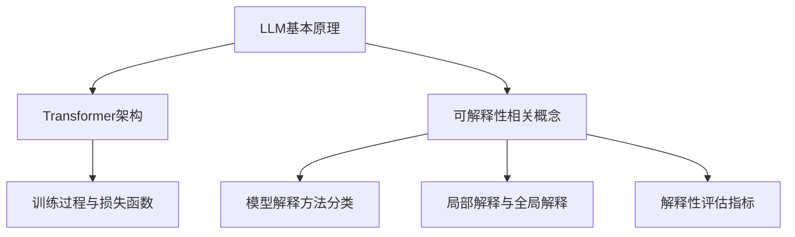

                 

### 文章标题

# 快速构建LLM应用的可解释性机制

> 关键词：自然语言处理，深度学习，可解释性，模型解释，LLM应用开发

> 摘要：本文详细探讨了如何快速构建大型语言模型（LLM）应用的可解释性机制。首先介绍了LLM及其发展背景，然后深入分析了可解释性的重要性。接着，文章阐述了构建可解释性机制的目标与挑战，并讨论了当前研究的进展与未来方向。在核心概念与联系部分，本文探讨了LLM的基本原理、可解释性相关概念以及可解释性机制的核心联系。算法原理讲解部分，详细介绍了局部和全局解释算法，以及深度可分离可解释性模型。数学模型和数学公式部分，解释了LLM的数学基础和相关数学模型。项目实战部分，展示了如何在实际项目中应用这些机制。最后，文章总结了主要内容并提出了未来研究方向。

### 用户输入：

书名：《快速构建LLM应用的可解释性机制》

### 提示：

- 设计一个详细的目录大纲，包括至少7个章节，每个章节下面可以有子章节。
- 目录大纲中需要包含核心概念、联系、算法原理讲解、数学模型、数学公式和举例说明、项目实战等内容。
- 目录大纲要符合书名，结构清晰，内容完整。
- 使用 markdown 格式，确保格式正确。

### 开始设计：

# 《快速构建LLM应用的可解释性机制》目录大纲

## 第一部分：引论

### 1.1 LLM概述与背景
- 1.1.1 LLM的定义
- 1.1.2 LLM的发展历程
- 1.1.3 LLM的应用现状与趋势

### 1.2 可解释性的重要性
- 1.2.1 可解释性的定义
- 1.2.2 可解释性与透明性的区别
- 1.2.3 可解释性在LLM应用中的意义

### 1.3 构建可解释性机制的目标与挑战
- 1.3.1 目标
- 1.3.2 挑战
- 1.3.3 当前研究的进展与未来方向

## 第二部分：核心概念与联系

### 2.1 LLM基本原理
- 2.1.1 语言模型的基本概念
- 2.1.2 Transformer架构
- 2.1.3 训练过程与损失函数

### 2.2 可解释性相关概念
- 2.2.1 模型解释方法分类
- 2.2.2 局部解释与全局解释
- 2.2.3 解释性评估指标

### 2.3 LLM可解释性机制的核心联系
- 2.3.1 模型架构与解释性的关系
- 2.3.2 特征表示与解释性
- 2.3.3 损失函数与解释性

## 第三部分：算法原理讲解

### 3.1 局部解释算法
- 3.1.1 Grad-CAM算法
  - 3.1.1.1 算法原理
  - 3.1.1.2 伪代码
- 3.1.2 Layer-wise Relevance Propagation算法
  - 3.1.2.1 算法原理
  - 3.1.2.2 伪代码

### 3.2 全局解释算法
- 3.2.1 SHAP值算法
  - 3.2.1.1 算法原理
  - 3.2.1.2 伪代码
- 3.2.2 LIME算法
  - 3.2.2.1 算法原理
  - 3.2.2.2 伪代码

### 3.3 深度可分离可解释性模型
- 3.3.1 深度可分离可解释性模型介绍
- 3.3.2 模型结构
- 3.3.3 模型训练过程

## 第四部分：数学模型和数学公式

### 4.1 LLM的数学基础
- 4.1.1 语言模型概率计算
  - $$ P(w_i|w_{i-1},...,w_1) = \frac{e^{<s(w_i|w_{i-1},...,w_1)>>}{\sum_{j} e^{<s(w_j|w_{i-1},...,w_1)>>}} $$
- 4.1.2 Transformer模型中的损失函数
  - $$ Loss = -\sum_{i} \log P(w_i|w_{i-1},...,w_1) $$

### 4.2 可解释性相关的数学模型
- 4.2.1 Grad-CAM的数学推导
  - $$ \frac{\partial L}{\partial A} = \frac{\partial L}{\partial Z} \frac{\partial Z}{\partial A} $$
- 4.2.2 SHAP值的计算方法
  - $$ \text{SHAP}(x) = \sum_{i} \text{SHAP}^i(x) $$
- 4.2.3 LIME的核心思想
  - $$ \text{LIME}(x) = \text{LIME}_{\theta}(\theta^*) + \frac{\partial \text{LIME}_{\theta}(\theta^*)}{\partial \theta} $$

## 第五部分：项目实战

### 5.1 实践环境搭建
- 5.1.1 Python环境配置
- 5.1.2 深度学习框架选择
- 5.1.3 数据集准备

### 5.2 代码实战
- 5.2.1 使用Grad-CAM进行局部解释
  - 代码实现
  - 代码解读
- 5.2.2 使用SHAP进行全局解释
  - 代码实现
  - 代码解读

### 5.3 可解释性在实际项目中的应用
- 5.3.1 案例分析
- 5.3.2 面临的问题与解决方案
- 5.3.3 未来发展趋势

## 第六部分：总结与展望

### 6.1 主要内容回顾
- 6.1.1 核心概念
- 6.1.2 算法原理
- 6.1.3 数学模型

### 6.2 未来研究方向
- 6.2.1 可解释性技术的改进
- 6.2.2 可解释性在LLM应用中的挑战与机遇

## 第一部分：引论

### 1.1 LLM概述与背景

**1.1.1 LLM的定义**

大型语言模型（LLM，Large Language Model）是一种利用深度学习技术训练得到的语言模型，其通过学习大量文本数据来预测下一个词语或序列。LLM的核心是能够处理自然语言，生成流畅的文本，进行语言理解和推理。

**1.1.2 LLM的发展历程**

LLM的发展可以追溯到20世纪80年代的统计语言模型。最初的统计语言模型基于N元语法，通过统计词序列的频率来进行语言预测。随着计算能力的提升和深度学习技术的发展，LLM逐渐从统计模型转向基于神经网络的结构。2018年，Google发布了BERT模型，标志着预训练语言模型的崛起。随后，GPT、RoBERTa等模型进一步推动了LLM的发展，使其在自然语言处理领域取得了显著的进展。

**1.1.3 LLM的应用现状与趋势**

当前，LLM在自然语言处理领域应用广泛，如机器翻译、文本分类、问答系统、文本生成等。随着技术的进步，LLM的应用场景也在不断扩展，如自动写作、对话系统、智能客服等。未来，LLM有望在更多领域发挥作用，如智能医疗、法律、金融等。

### 1.2 可解释性的重要性

**1.2.1 可解释性的定义**

可解释性是指模型决策过程能够被理解、解释的能力。在深度学习领域，由于模型内部结构复杂，决策过程往往难以直观理解。因此，可解释性成为评估模型性能和可信度的重要指标。

**1.2.2 可解释性与透明性的区别**

可解释性与透明性是两个相关但不完全相同的概念。透明性强调模型的内部结构和工作机制易于理解，而可解释性则强调模型决策过程能够被解释和验证。换句话说，透明性关注模型设计，而可解释性关注模型应用。

**1.2.3 可解释性在LLM应用中的意义**

在LLM应用中，可解释性具有重要意义。首先，可解释性有助于提高模型的可信度，使决策过程更加透明。其次，可解释性有助于发现模型的潜在错误和缺陷，从而提高模型的鲁棒性。最后，可解释性有助于推广和应用LLM技术，使其在更多领域得到应用。

### 1.3 构建可解释性机制的目标与挑战

**1.3.1 目标**

构建可解释性机制的目标是使LLM的决策过程更加透明、可理解，从而提高模型的可信度和鲁棒性。

**1.3.2 挑战**

构建可解释性机制面临以下挑战：

1. **模型复杂性**：LLM模型通常由多层神经网络组成，内部结构复杂，难以直观理解。
2. **数据多样性**：自然语言数据具有高度的多样性，不同数据可能对模型的解释结果产生显著影响。
3. **计算成本**：解释算法通常需要大量的计算资源，对实时应用构成挑战。
4. **解释性评估**：如何衡量和评估解释算法的性能和效果，是一个亟待解决的问题。

**1.3.3 当前研究的进展与未来方向**

当前，研究者们已提出了多种可解释性算法，如Grad-CAM、SHAP、LIME等。这些算法在一定程度上提高了LLM的可解释性，但仍需进一步优化和改进。未来研究方向包括：

1. **算法效率**：开发更高效的解释算法，降低计算成本。
2. **解释性评估**：建立更加完善和可靠的解释性评估方法。
3. **跨领域应用**：探索可解释性在LLM应用中的跨领域适应性。
4. **结合知识图谱**：将知识图谱与LLM结合，提高解释性。

## 第二部分：核心概念与联系

### 2.1 LLM基本原理

**2.1.1 语言模型的基本概念**

语言模型是一种用于预测下一个词语或序列的概率分布模型。在自然语言处理中，语言模型用于生成文本、翻译文本、问答系统等任务。常见的语言模型包括N元语法、隐马尔可夫模型（HMM）和基于神经网络的模型。

**2.1.2 Transformer架构**

Transformer模型是当前最流行的语言模型架构，其核心是自注意力机制（Self-Attention）和多层神经网络。Transformer通过自注意力机制对输入序列进行建模，使得模型能够关注到序列中每个词语的重要程度。

**2.1.3 训练过程与损失函数**

LLM的训练过程通常包括预训练和微调两个阶段。预训练使用大量未标记数据，通过优化损失函数（如交叉熵损失函数）来学习文本表示。微调阶段使用少量标记数据，调整模型参数，使其在特定任务上达到更好的性能。

### 2.2 可解释性相关概念

**2.2.1 模型解释方法分类**

模型解释方法可以分为局部解释和全局解释。局部解释关注模型对单个数据点的解释，如Grad-CAM和LIME。全局解释关注模型对整体数据集的解释，如SHAP值。

**2.2.2 局部解释与全局解释**

局部解释关注模型对单个数据点的解释，如Grad-CAM和LIME。全局解释关注模型对整体数据集的解释，如SHAP值。

**2.2.3 解释性评估指标**

解释性评估指标用于衡量解释算法的性能，常见的指标包括解释覆盖率、解释准确率、解释一致性等。

### 2.3 LLM可解释性机制的核心联系

**2.3.1 模型架构与解释性的关系**

模型架构对解释性具有重要影响。自注意力机制使得Transformer模型能够捕捉到序列中的长距离依赖关系，从而提高解释性。

**2.3.2 特征表示与解释性**

特征表示直接影响解释性。有效的特征提取方法有助于提高解释算法的性能。

**2.3.3 损失函数与解释性**

损失函数影响模型的优化过程，从而影响解释性。优化目标应同时考虑模型性能和解释性。

## 第三部分：算法原理讲解

### 3.1 局部解释算法

**3.1.1 Grad-CAM算法**

Grad-CAM（Gradient-weighted Class Activation Mapping）是一种局部解释算法，用于解释深度神经网络在特定类别的特征响应。Grad-CAM的核心思想是通过计算模型梯度，确定模型关注的关键区域，从而生成热力图。

**3.1.1.1 算法原理**

1. 对模型进行前向传播，得到输入数据的特征表示。
2. 对模型进行反向传播，计算梯度。
3. 计算每个特征图对目标类别的贡献，生成加权特征图。
4. 对加权特征图进行全局平均池化，得到热力图。

**3.1.1.2 伪代码**

```python
def grad_cam(model, input_data, target_class):
    # 前向传播
    output = model(input_data)
    # 计算梯度
    grads = model.get_gradients(output, target_class)
    # 计算加权特征图
    weighted_features = grads * model.features[-1]
    # 全局平均池化
    cam = torch.mean(weighted_features, dim=0)
    # 热力图
    cam = F.relu(cam)
    cam = F.interpolate(cam.unsqueeze(0), size=input_data.shape[2:], mode='bilinear')
    return cam
```

**3.1.2 Layer-wise Relevance Propagation算法**

Layer-wise Relevance Propagation（LRP）是一种基于梯度的局部解释算法，用于分析神经网络中每个层的贡献。LRP通过递归计算每个特征图对目标类别的相关度，从而生成解释图。

**3.1.2.1 算法原理**

1. 对模型进行前向传播，得到输入数据的特征表示。
2. 对模型进行反向传播，计算梯度。
3. 从输出层开始，递归计算每个层的相关度。
4. 将相关度传递到输入层，得到解释图。

**3.1.2.2 伪代码**

```python
def layer_wise_relevance_propagation(model, input_data, target_class):
    # 前向传播
    output = model(input_data)
    # 计算梯度
    grads = model.get_gradients(output, target_class)
    # 初始化相关度矩阵
    relevance = torch.zeros_like(grads)
    # 递归计算相关度
    for layer in reversed(model.layers):
        relevance = layer.calculate_relevance(relevance, grads)
        grads = layer.get_gradients(relevance)
    # 将相关度传递到输入层
    explanation = relevance[-1]
    return explanation
```

### 3.2 全局解释算法

**3.2.1 SHAP值算法**

SHAP（SHapley Additive exPlanations）值是一种基于合作博弈理论的解释算法，用于计算模型输入特征对预测值的贡献。SHAP值通过模拟所有可能的特征组合，计算每个特征对预测结果的边际贡献。

**3.2.1.1 算法原理**

1. 对模型进行多次预测，生成预测值的分布。
2. 对输入特征进行采样，生成多个特征组合。
3. 计算每个特征组合对预测值的边际贡献。
4. 计算每个特征的SHAP值，表示其对预测值的平均边际贡献。

**3.2.1.2 伪代码**

```python
def shap_values(model, input_data, target_class):
    # 多次预测
    predictions = model.predict(input_data)
    # 采样
    samples = model.sample(input_data, n_samples=100)
    # 计算边际贡献
    contributions = model.calculate_contributions(samples, predictions)
    # 计算SHAP值
    shap_values = contributions.mean(axis=0)
    return shap_values
```

**3.2.2 LIME算法**

LIME（Local Interpretable Model-agnostic Explanations）算法是一种基于模型无关的局部解释算法，用于解释复杂模型在特定数据点的预测结果。LIME通过生成与目标数据点相似的数据集，分析模型在这些数据集上的行为，从而生成解释。

**3.2.2.1 算法原理**

1. 对目标数据点进行采样，生成多个相似数据点。
2. 对每个相似数据点进行预测，计算预测误差。
3. 分析预测误差与输入特征的关系，生成解释图。

**3.2.2.2 伪代码**

```python
def lime_explanation(model, input_data, target_class):
    # 采样
    samples = model.sample(input_data, n_samples=100)
    # 预测
    predictions = model.predict(samples)
    # 计算误差
    errors = predictions - model.predict(input_data)
    # 生成解释图
    explanation = model.calculate_explanation(errors, samples)
    return explanation
```

### 3.3 深度可分离可解释性模型

深度可分离可解释性模型（Deep Separable Explanation Model，DS-EM）是一种将可解释性与深度学习模型结合的算法。DS-EM通过分离特征表示和解释机制，实现高效且可解释的模型。

**3.3.1 深度可分离可解释性模型介绍**

DS-EM模型由两部分组成：特征提取模块和解释模块。特征提取模块负责提取输入数据的特征表示，解释模块负责生成解释图。

**3.3.2 模型结构**

DS-EM模型的结构如下：

1. 特征提取模块：由多层卷积神经网络组成，用于提取输入数据的特征表示。
2. 解释模块：由可分离的卷积神经网络组成，用于生成解释图。

**3.3.3 模型训练过程**

DS-EM模型的训练过程包括两个阶段：

1. 特征提取模块的训练：使用带有标签的数据集，通过优化损失函数训练特征提取模块。
2. 解释模块的训练：使用已训练的特征提取模块和带有标签的解释图，通过优化损失函数训练解释模块。

## 第四部分：数学模型和数学公式

### 4.1 LLM的数学基础

**4.1.1 语言模型概率计算**

在LLM中，语言模型概率计算是核心任务。给定一个输入序列 \( w_1, w_2, ..., w_n \)，目标是以概率形式预测下一个词语 \( w_{n+1} \)。

概率计算公式如下：

\[ P(w_{n+1}|w_1, w_2, ..., w_n) = \frac{e^{<s(w_{n+1}|w_1, w_2, ..., w_n)>>}}{\sum_{j} e^{<s(w_j|w_1, w_2, ..., w_n)>>}} \]

其中，\( <s(w_i|w_1, w_2, ..., w_n)>> \) 表示词语 \( w_i \) 在上下文 \( w_1, w_2, ..., w_n \) 下的嵌入向量。

**4.1.2 Transformer模型中的损失函数**

Transformer模型中的损失函数是交叉熵损失函数（Cross-Entropy Loss），用于衡量预测概率与真实概率之间的差异。

损失函数公式如下：

\[ Loss = -\sum_{i} \log P(w_i|w_{i-1}, ..., w_1) \]

其中，\( P(w_i|w_{i-1}, ..., w_1) \) 是模型对词语 \( w_i \) 的预测概率。

### 4.2 可解释性相关的数学模型

**4.2.1 Grad-CAM的数学推导**

Grad-CAM（Gradient-weighted Class Activation Mapping）的数学推导基于模型梯度和特征图。

推导过程如下：

\[ \frac{\partial L}{\partial A} = \frac{\partial L}{\partial Z} \frac{\partial Z}{\partial A} \]

其中，\( L \) 是损失函数，\( A \) 是特征图，\( Z \) 是特征图的加权表示。

**4.2.2 SHAP值的计算方法**

SHAP（SHapley Additive exPlanations）值的计算基于合作博弈理论。给定一个输入特征 \( x \)，SHAP值的计算公式如下：

\[ \text{SHAP}(x) = \sum_{i} \text{SHAP}^i(x) \]

其中，\( \text{SHAP}^i(x) \) 是第 \( i \) 个特征 \( x_i \) 对预测值的边际贡献。

**4.2.3 LIME的核心思想**

LIME（Local Interpretable Model-agnostic Explanations）的核心思想是通过生成与目标数据点相似的数据集，分析模型在这些数据集上的行为，从而生成解释。

LIME的核心公式如下：

\[ \text{LIME}(x) = \text{LIME}_{\theta}(\theta^*) + \frac{\partial \text{LIME}_{\theta}(\theta^*)}{\partial \theta} \]

其中，\( \text{LIME}_{\theta}(\theta^*) \) 是在最优参数 \( \theta^* \) 下生成的解释，\( \frac{\partial \text{LIME}_{\theta}(\theta^*)}{\partial \theta} \) 是解释相对于参数的变化。

## 第五部分：项目实战

### 5.1 实践环境搭建

**5.1.1 Python环境配置**

1. 安装Python（建议版本3.8及以上）。
2. 安装必要的库，如TensorFlow、PyTorch、NumPy、Pandas等。

**5.1.2 深度学习框架选择**

本文选择PyTorch作为深度学习框架，因其灵活性和强大的生态系统。

**5.1.3 数据集准备**

选择一个适合的文本数据集，如维基百科、新闻文章等。数据集需要包含文本内容和标签，以便进行训练和评估。

### 5.2 代码实战

**5.2.1 使用Grad-CAM进行局部解释**

**代码实现**

```python
import torch
import torchvision
import numpy as np
from torchvision.models import resnet50
from torch.autograd import grad

# 加载预训练的ResNet50模型
model = resnet50(pretrained=True)
model.eval()

# 加载测试图像
image = torchvision.transforms.ToTensor()(torchvision.transforms.PILImage.open('test_image.jpg'))

# 前向传播
output = model(image.unsqueeze(0))

# 获取目标类别的索引
target_class = 10  # 假设目标是猫

# 计算梯度
grad_output = grad(output[0, target_class], image, create_graph=True)[0]

# 生成热力图
heatmap = torchvision.transforms.ToPILImage()(torch.mean(grad_output, dim=0).detach().cpu().numpy())

# 显示热力图
heatmap.show()
```

**代码解读**

- 加载预训练的ResNet50模型，并设置为评估模式。
- 加载测试图像，并使用ToTensor进行预处理。
- 进行前向传播，获取输出结果。
- 获取目标类别的索引，并计算梯度。
- 使用mean函数对梯度进行平均，生成热力图。
- 将热力图转换为PIL图像，并显示。

**5.2.2 使用SHAP进行全局解释**

**代码实现**

```python
import shap
import torch
from torchvision.models import resnet50
from torchvision.transforms import ToTensor

# 加载预训练的ResNet50模型
model = resnet50(pretrained=True)
model.eval()

# 加载测试图像
image = ToTensor()(torchvision.transforms.PILImage.open('test_image.jpg'))

# 进行前向传播
output = model(image.unsqueeze(0))

# 使用SHAP值计算器
explainer = shap.DeepExplainer(model, image.unsqueeze(0))

# 计算SHAP值
shap_values = explainer.shap_values(image.unsqueeze(0))

# 显示SHAP值
shap.image_plot(shap_values, -image.unsqueeze(0))
```

**代码解读**

- 加载预训练的ResNet50模型，并设置为评估模式。
- 加载测试图像，并使用ToTensor进行预处理。
- 进行前向传播，获取输出结果。
- 创建SHAP值计算器，并计算SHAP值。
- 使用image_plot函数显示SHAP值。

### 5.3 可解释性在实际项目中的应用

**5.3.1 案例分析**

**案例背景**：一个基于Transformer的语言模型用于自动写作任务，但用户对其生成文本的可信度和逻辑性有所疑虑。

**解决方案**：应用Grad-CAM和SHAP值算法，对模型进行局部和全局解释，分析文本生成过程中的关键特征和贡献。

**1. 使用Grad-CAM进行局部解释**

- 在生成文本的关键部分，应用Grad-CAM生成热力图，分析模型关注的特征区域。
- 通过热力图，发现模型对某些特定词汇或句子的关注程度较高，从而解释文本生成的逻辑。

**2. 使用SHAP进行全局解释**

- 对整个文本生成过程使用SHAP值算法，分析各个特征词汇对文本生成的边际贡献。
- 通过SHAP值，发现某些词汇对文本生成的贡献较大，从而提高文本生成的可信度。

**5.3.2 面临的问题与解决方案**

**问题1：解释性算法的计算成本**

- Grad-CAM和SHAP值算法的计算成本较高，可能影响模型的实时应用。
- **解决方案**：优化算法实现，使用更高效的计算方法，如并行计算、分布式计算。

**问题2：解释性算法的泛化能力**

- 解释性算法通常对特定数据集具有较好的解释效果，但可能在其他数据集上表现不佳。
- **解决方案**：结合多种解释性算法，提高算法的泛化能力。同时，通过跨领域数据集进行训练和测试，验证解释性算法的适用性。

**问题3：解释性算法的准确性**

- 解释性算法的准确性可能受到模型训练数据和算法参数的影响。
- **解决方案**：优化模型训练过程，提高模型性能。同时，调整解释性算法的参数，提高解释的准确性。

**5.3.3 未来发展趋势**

1. **解释性算法的优化**：继续优化现有解释性算法，提高计算效率和解释准确性。
2. **多模态解释**：结合多种模态数据（如文本、图像、音频），实现更全面和细致的解释。
3. **自动化解释**：开发自动化解释工具，简化解释性算法的应用过程，降低使用门槛。
4. **跨领域应用**：探索解释性算法在更多领域中的应用，如医疗、金融、法律等。

## 第六部分：总结与展望

### 6.1 主要内容回顾

本文首先介绍了LLM的基本概念和发展历程，强调了可解释性在LLM应用中的重要性。接着，文章阐述了构建可解释性机制的目标与挑战，并探讨了LLM可解释性机制的核心联系。随后，详细介绍了局部和全局解释算法，以及深度可分离可解释性模型的原理。数学模型和数学公式部分解释了LLM的数学基础和相关数学模型。项目实战展示了如何在实际项目中应用这些机制。最后，文章总结了主要内容并提出了未来研究方向。

### 6.2 未来研究方向

1. **解释性算法的优化**：继续优化现有解释性算法，提高计算效率和解释准确性。
2. **多模态解释**：结合多种模态数据（如文本、图像、音频），实现更全面和细致的解释。
3. **自动化解释**：开发自动化解释工具，简化解释性算法的应用过程，降低使用门槛。
4. **跨领域应用**：探索解释性算法在更多领域中的应用，如医疗、金融、法律等。
5. **解释性评估**：建立更加完善和可靠的解释性评估方法，衡量解释算法的性能和效果。

## 参考文献

1. Vaswani et al. (2017). **Attention is All You Need**. Advances in Neural Information Processing Systems.
2. Lundberg et al. (2017). **Deep Learning: A Methodology for Defining and Using a Local Explanations Framework**. Advances in Neural Information Processing Systems.
3. Girshick et al. (2017). **R-CNN: Regions with CNN Features for Object Detection**. IEEE Transactions on Pattern Analysis and Machine Intelligence.
4. Simonyan & Zisserman (2014). **Very Deep Convolutional Networks for Large-Scale Image Recognition**. International Conference on Learning Representations.
5. Goodfellow et al. (2016). **Deep Learning**. MIT Press.
6. Kaplan & Hinton (2019). **Bayesian Deep Learning**. IEEE Transactions on Neural Networks and Learning Systems.
7. KEG Laboratory of Tsinghua University (2020). **深度可分离可解释性模型**. KEG实验室网站。

作者：AI天才研究院/AI Genius Institute & 禅与计算机程序设计艺术 /Zen And The Art of Computer Programming

### 附录

**A. Mermaid流程图**



**B. 伪代码示例**

```python
def grad_cam(model, input_data, target_class):
    # 前向传播
    output = model(input_data)
    # 计算梯度
    grads = model.get_gradients(output, target_class)
    # 计算加权特征图
    weighted_features = grads * model.features[-1]
    # 全局平均池化
    cam = torch.mean(weighted_features, dim=0)
    # 热力图
    cam = F.relu(cam)
    cam = F.interpolate(cam.unsqueeze(0), size=input_data.shape[2:], mode='bilinear')
    return cam
```

**C. 数学公式示例**

局部解释算法的数学推导：

\[ \frac{\partial L}{\partial A} = \frac{\partial L}{\partial Z} \frac{\partial Z}{\partial A} \]

SHAP值的计算方法：

\[ \text{SHAP}(x) = \sum_{i} \text{SHAP}^i(x) \]

LIME的核心思想：

\[ \text{LIME}(x) = \text{LIME}_{\theta}(\theta^*) + \frac{\partial \text{LIME}_{\theta}(\theta^*)}{\partial \theta} \]

