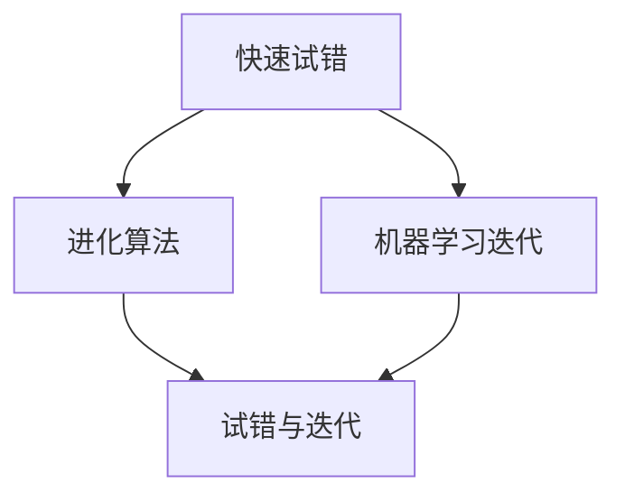

                 

### 快速试错与敏捷迭代：LLM应用开发的制胜法则

> **关键词：** 快速试错、敏捷迭代、大型语言模型（LLM）、应用开发、优化策略

> **摘要：** 本文旨在探讨快速试错与敏捷迭代在大型语言模型（LLM）应用开发中的重要性。通过详细分析这两者的概念、联系、实践方法以及它们在LLM开发中的应用，本文提出了有效开发LLM应用的最佳策略，旨在提高开发效率和产品质量。

---

### 第1章：快速试错与敏捷迭代概述

#### 1.1 快速试错的起源与发展

快速试错（Quick Trial and Error）作为一种探索和优化方法，起源于进化生物学中的自然选择理论。达尔文在《物种起源》中描述了生物通过不断试错和适应环境的过程，这一思想后来被引入到计算机科学领域，特别是在机器学习和人工智能领域得到了广泛应用。

在机器学习中，快速试错通常表现为通过大量的实验来优化模型参数，从而找到最优解。这种方法的核心在于快速执行实验、收集反馈并在此基础上进行调整，从而逐步逼近最优解。例如，在训练神经网络时，通过调整权重和偏置，使网络能够更好地拟合训练数据。

**概念联系：**

- **快速试错：** 与进化算法（Evolutionary Algorithms）密切相关。进化算法通过模拟自然进化过程，利用试错和遗传操作来寻找最优解。
- **敏捷迭代：** 与敏捷开发（Agile Development）方法论有类似之处。敏捷开发强调快速迭代和持续改进，以适应不断变化的需求。

**架构流程图（Mermaid）：**



**快速试错与敏捷迭代的联系与差异：**

快速试错侧重于通过实验寻找最优解，而敏捷迭代更注重快速响应需求变化，确保产品能够在有限时间内交付。快速试错是无监督或弱监督的，而敏捷迭代通常依赖于明确的用户需求和反馈。

**数学模型：**

- **成本模型：**
  $$ C = C_0 + c \times n $$
  其中，$C$ 是总成本，$C_0$ 是初始成本，$c$ 是每次迭代增加的成本，$n$ 是迭代次数。

- **时间模型：**
  $$ T = T_0 + t \times n $$
  其中，$T$ 是总时间，$T_0$ 是初始时间，$t$ 是每次迭代增加的时间，$n$ 是迭代次数。

#### 1.2 敏捷迭代的核心理念

敏捷迭代（Agile Iteration）是一种软件开发方法，强调快速迭代和持续改进。其核心理念包括：

- **需求收集与优先级排序：** 通过与用户和利益相关者的沟通，快速收集需求并对其进行优先级排序。
- **迭代计划与执行：** 在每个迭代周期内，开发团队制定计划，执行任务并交付可用的软件版本。
- **反馈与调整：** 通过用户反馈和定期的回顾会议，识别问题并进行调整，确保项目能够持续改进。

**伪代码示例：**

```python
while (目标未达成) {
    进行实验设计
    执行实验
    根据实验结果调整方案
}
```

#### 1.3 快速试错与敏捷迭代的联系与差异

快速试错和敏捷迭代都是通过迭代和实验来优化过程，但它们的目标和应用场景有所不同。快速试错侧重于寻找最优解，而敏捷迭代则更注重快速响应需求变化，确保产品能够及时交付。

**数学模型：**

- **成本模型：**
  $$ C = C_0 + c \times n $$

- **时间模型：**
  $$ T = T_0 + t \times n $$

### 第2章：快速试错技术

#### 2.1 试错策略与方法

快速试错技术包括多种策略和方法，以下是一些常用的方法：

- **逐步逼近法：** 通过逐步调整参数，逐渐逼近最优解。
- **随机搜索法：** 在参数空间内随机搜索，找到最优解。
- **交叉验证法：** 通过将数据集划分为训练集和验证集，多次训练和验证，找到最优参数。

#### 2.1.1 逐步逼近法

逐步逼近法是一种简单而有效的快速试错方法，适用于参数优化问题。其核心思想是逐步调整参数，使得模型性能逐步提高。

**伪代码示例：**

```python
初始化参数θ
设置学习率α
设置迭代次数N

for i = 1 to N do {
    计算损失函数J(θ)
    更新参数θ = θ - α * ∇θJ(θ)
}
```

#### 2.1.2 随机搜索法

随机搜索法通过在参数空间内随机选择参数，评估模型的性能，并选择性能较好的参数。这种方法适用于参数空间较小的情况。

**伪代码示例：**

```python
初始化参数θ
设置搜索范围[-A, A]
设置迭代次数N

for i = 1 to N do {
    随机生成θ
    计算损失函数J(θ)
    更新最佳参数θ_best if J(θ) < J(θ_best)
}
```

#### 2.1.3 交叉验证法

交叉验证法通过将数据集划分为训练集和验证集，多次训练和验证，评估模型的性能。这种方法能够有效地避免过拟合问题。

**伪代码示例：**

```python
初始化参数θ
设置交叉验证次数K

for k = 1 to K do {
    划分训练集和验证集
    训练模型θ
    计算验证集的损失函数J(θ)
}

计算平均损失函数J(θ) = 1/K * Σ(J(θ)_k)
```

### 第3章：敏捷迭代实践

#### 3.1 敏捷开发流程

敏捷开发流程包括需求收集与优先级排序、迭代计划与执行、反馈与调整等步骤。以下是一个典型的敏捷开发流程：

1. **需求收集与优先级排序：** 通过与用户和利益相关者的沟通，收集需求并对其进行优先级排序。
2. **迭代计划与执行：** 在每个迭代周期内，开发团队制定计划，执行任务并交付可用的软件版本。
3. **反馈与调整：** 通过用户反馈和定期的回顾会议，识别问题并进行调整，确保项目能够持续改进。

#### 3.1.1 需求收集与优先级排序

需求收集是敏捷开发的重要环节。通过用户访谈、问卷调查和市场调研等方式，收集用户需求。收集到的需求通常以用户故事的形式记录，并按照优先级进行排序。

**伪代码示例：**

```python
收集用户需求
将需求记录为用户故事
按照优先级排序用户故事
```

#### 3.1.2 迭代计划与执行

迭代计划是在每个迭代周期内制定的任务和时间表。开发团队根据用户故事的优先级和资源情况，制定迭代计划。在执行计划时，开发团队需要遵循敏捷开发的原则，确保任务能够按时完成。

**伪代码示例：**

```python
制定迭代计划
执行迭代计划
监控任务进度
```

#### 3.1.3 反馈与调整

在迭代结束后，开发团队需要收集用户反馈，并根据反馈进行调整。反馈可以通过用户测试、用户满意度调查和定期的回顾会议等方式获取。根据反馈，开发团队可以优化产品设计和开发流程。

**伪代码示例：**

```python
收集用户反馈
分析反馈
根据反馈进行调整
```

### 第4章：LLM应用开发的快速试错与敏捷迭代

#### 4.1 LLM应用开发概述

大型语言模型（Large Language Model，简称LLM）是一种基于深度学习的自然语言处理模型，能够理解和生成人类语言。LLM应用开发涉及到模型设计、训练、优化和部署等多个环节。快速试错和敏捷迭代方法在LLM应用开发中具有重要意义。

#### 4.1.1 LLM技术基础

LLM技术基础包括：

- **神经网络架构：** 如Transformer、BERT等。
- **训练数据集：** 如维基百科、新闻文章、社交媒体数据等。
- **预训练和微调：** 通过大规模预训练，使模型具备通用语言能力，然后通过微调适应特定应用场景。

#### 4.1.2 LLM应用场景分析

LLM应用场景广泛，包括：

- **自然语言理解：** 如问答系统、文本分类、情感分析等。
- **自然语言生成：** 如机器翻译、自动摘要、对话生成等。
- **内容审核：** 如垃圾邮件过滤、虚假信息检测等。

#### 4.2 快速试错在LLM应用开发中的应用

快速试错方法在LLM应用开发中具有重要应用，包括：

- **模型选择与调优：** 通过快速试错，选择合适的模型架构和超参数。
- **数据预处理与清洗：** 通过快速试错，优化数据预处理流程，提高数据质量。

#### 4.2.1 模型选择与调优

模型选择与调优是LLM应用开发的关键环节。通过快速试错，开发团队可以：

- **比较不同模型架构的优劣：** 如Transformer、BERT等。
- **调整超参数：** 如学习率、批量大小、正则化参数等。

**伪代码示例：**

```python
初始化模型参数
设置学习率α
设置迭代次数N

for i = 1 to N do {
    训练模型
    评估模型性能
    更新参数
}
```

#### 4.2.2 数据预处理与清洗

数据预处理与清洗是保证LLM模型性能的重要步骤。通过快速试错，开发团队可以：

- **选择合适的文本预处理方法：** 如分词、词干提取、词性标注等。
- **清洗数据：** 去除噪声数据和错误数据，提高数据质量。

**伪代码示例：**

```python
读取数据集
预处理数据
清洗数据

for i = 1 to N do {
    训练模型
    评估模型性能
    更新预处理和清洗策略
}
```

#### 4.3 敏捷迭代在LLM应用开发中的应用

敏捷迭代方法在LLM应用开发中具有重要意义，包括：

- **功能迭代与优化：** 通过迭代开发，逐步完善应用功能。
- **性能测试与优化：** 通过迭代测试和优化，提高应用性能。

#### 4.3.1 功能迭代与优化

功能迭代与优化是通过迭代开发和用户反馈来不断完善应用功能。开发团队可以：

- **制定迭代计划：** 根据用户需求和项目进度制定迭代计划。
- **执行迭代任务：** 完成迭代任务，开发新功能或优化现有功能。

**伪代码示例：**

```python
制定迭代计划
执行迭代任务
收集用户反馈
优化功能

while (目标未达成) {
    执行迭代任务
    收集用户反馈
    优化功能
}
```

#### 4.3.2 性能测试与优化

性能测试与优化是通过迭代测试和优化来提高应用性能。开发团队可以：

- **设计性能测试用例：** 设计各种测试用例，覆盖应用的不同功能点。
- **执行性能测试：** 运行性能测试用例，收集性能数据。
- **优化性能：** 根据性能数据进行分析和优化，提高应用性能。

**伪代码示例：**

```python
设计性能测试用例
执行性能测试
分析性能数据
优化性能

while (性能未达到要求) {
    分析性能数据
    优化性能
    重新执行性能测试
}
```

### 第5章：成功案例分析

在本章节中，我们将通过两个实际案例来展示如何将快速试错与敏捷迭代方法应用于大型语言模型（LLM）的应用开发。

#### 5.1 案例一：电商推荐系统

**案例背景：**

某大型电商公司希望开发一款智能推荐系统，以提高用户满意度和销售转化率。该公司拥有庞大的用户数据和商品数据，但面临着如何构建高效且准确的推荐算法的挑战。

**快速试错与敏捷迭代实践：**

1. **需求收集与优先级排序：**
   - 通过用户调研和市场分析，收集用户对推荐系统的需求和期望。
   - 将需求按照优先级排序，确定首先需要实现的功能。

2. **模型选择与调优：**
   - 初次尝试使用了传统的协同过滤算法，但效果不佳。
   - 通过试错，最终选择了基于深度学习的Transformer模型。
   - 调整学习率、批量大小等超参数，优化模型性能。

3. **数据预处理与清洗：**
   - 对用户行为数据和商品数据进行了预处理，包括去重、缺失值填充和数据归一化。
   - 通过交叉验证法，确保数据质量对模型训练的影响。

4. **迭代开发与优化：**
   - 采用敏捷迭代方法，逐步完善推荐系统的功能。
   - 每个迭代周期结束后，收集用户反馈，根据反馈进行功能调整和性能优化。

5. **性能测试与优化：**
   - 设计了多种性能测试用例，包括推荐准确性、响应速度和系统稳定性。
   - 通过迭代测试，不断优化模型和系统性能，达到预期目标。

**案例小结：**
通过快速试错和敏捷迭代，电商推荐系统在短时间内实现了从需求收集到功能完善的闭环开发过程，提高了用户满意度和销售转化率。

#### 5.2 案例二：金融风险评估

**案例背景：**

某金融机构希望利用大型语言模型对贷款申请进行风险评估，以提高贷款审批效率和准确性。该金融机构拥有海量的贷款申请数据，但面临如何构建高效的风险评估模型的问题。

**快速试错与敏捷迭代实践：**

1. **需求收集与优先级排序：**
   - 与金融机构的信贷部门合作，了解风险评估的具体需求和关键指标。
   - 将需求按照优先级排序，明确首先需要实现的风险评估功能。

2. **模型选择与调优：**
   - 初次尝试使用了传统统计模型，但效果不理想。
   - 通过试错，选择了基于BERT的深度学习模型，并针对金融领域进行了微调。
   - 调整学习率、批量大小等超参数，优化模型性能。

3. **数据预处理与清洗：**
   - 对贷款申请数据进行预处理，包括文本数据清洗、缺失值填充和数据归一化。
   - 通过交叉验证法，确保数据质量对模型训练的影响。

4. **迭代开发与优化：**
   - 采用敏捷迭代方法，逐步完善风险评估模型的功能。
   - 每个迭代周期结束后，收集金融机构的反馈，根据反馈进行功能调整和性能优化。

5. **性能测试与优化：**
   - 设计了多种性能测试用例，包括风险评估准确性、响应速度和系统稳定性。
   - 通过迭代测试，不断优化模型和系统性能，达到预期目标。

**案例小结：**
通过快速试错和敏捷迭代，金融风险评估模型在短时间内实现了从需求收集到功能完善的闭环开发过程，提高了贷款审批的效率和准确性。

### 第6章：快速试错与敏捷迭代的挑战与应对策略

#### 6.1 数据质量与可靠性

数据质量是快速试错和敏捷迭代成功的关键因素。数据质量问题可能导致模型训练效果不佳，进而影响最终应用性能。以下是一些数据质量挑战及应对策略：

- **挑战：**
  - 数据缺失：部分数据字段可能存在缺失值。
  - 数据噪声：数据中可能存在噪声和异常值。
  - 数据不平衡：某些类别或标签的数据分布不均。

- **应对策略：**
  - 数据清洗：去除缺失值和噪声数据，填充缺失值。
  - 数据增强：通过数据扩充和变换方法，增加数据多样性。
  - 数据采样：通过过采样或欠采样方法，平衡数据分布。

#### 6.2 模型复杂性与可解释性

随着深度学习模型变得越来越复杂，模型的训练时间和计算资源需求也不断增加。同时，模型的可解释性成为一个重要问题，特别是在金融、医疗等需要解释性强的领域。

- **挑战：**
  - 计算资源限制：复杂模型需要大量计算资源，可能超出资源限制。
  - 模型可解释性：复杂模型难以解释，难以理解模型的决策过程。

- **应对策略：**
  - 模型简化：选择简单的模型架构，减少模型参数。
  - 模型解释：使用模型解释工具，如LIME、SHAP等，提高模型的可解释性。
  - 模型集成：通过集成多个简单模型，提高模型性能和可解释性。

#### 6.3 团队协作与沟通

快速试错和敏捷迭代需要团队成员之间的紧密协作和有效沟通。以下是一些团队协作和沟通的挑战及应对策略：

- **挑战：**
  - 沟通障碍：团队成员之间的沟通可能存在障碍，影响项目进展。
  - 团队协作：团队成员之间的协作可能不够紧密，导致任务延误。
  - 项目管理：项目管理不善可能导致项目目标不明确，进度失控。

- **应对策略：**
  - 定期会议：定期召开团队会议，确保信息传递和任务协调。
  - 工具支持：使用项目管理工具（如JIRA、Trello等），提高任务管理和团队协作效率。
  - 目标明确：明确项目目标和任务分工，确保每个团队成员都清楚自己的职责。

### 第7章：未来展望与建议

#### 7.1 快速试错与敏捷迭代的发展趋势

随着人工智能技术的不断发展，快速试错和敏捷迭代方法在各个领域的应用将越来越广泛。未来，快速试错和敏捷迭代方法可能会：

- **集成更多自动化工具：** 自动化工具将进一步提升快速试错和敏捷迭代的效率。
- **跨领域应用：** 快速试错和敏捷迭代方法将在更多领域得到应用，如医疗、金融等。
- **更加智能化：** 结合人工智能技术，快速试错和敏捷迭代方法将变得更加智能化，能够自动优化和调整策略。

#### 7.2 对开发者的建议

对于开发者来说，掌握快速试错和敏捷迭代方法具有重要意义。以下是一些建议：

- **持续学习：** 不断学习新技术和工具，提升自己的技能水平。
- **实践经验：** 通过实际项目积累经验，不断提升快速试错和敏捷迭代的能力。
- **团队合作：** 培养良好的团队合作精神和沟通能力，提高团队协作效率。
- **创新思维：** 保持创新思维，积极探索新的解决方案和应用场景。

**作者：** AI天才研究院/AI Genius Institute & 禅与计算机程序设计艺术 /Zen And The Art of Computer Programming

