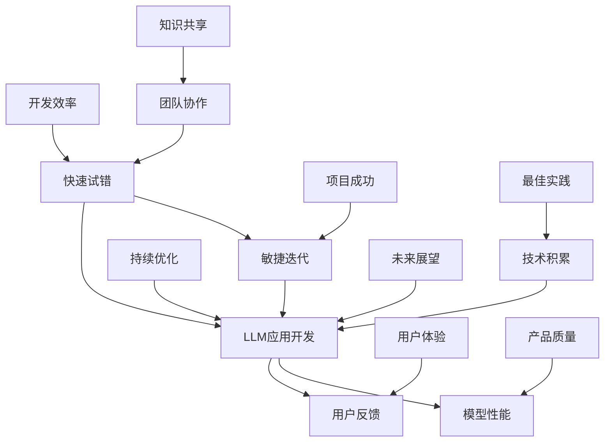
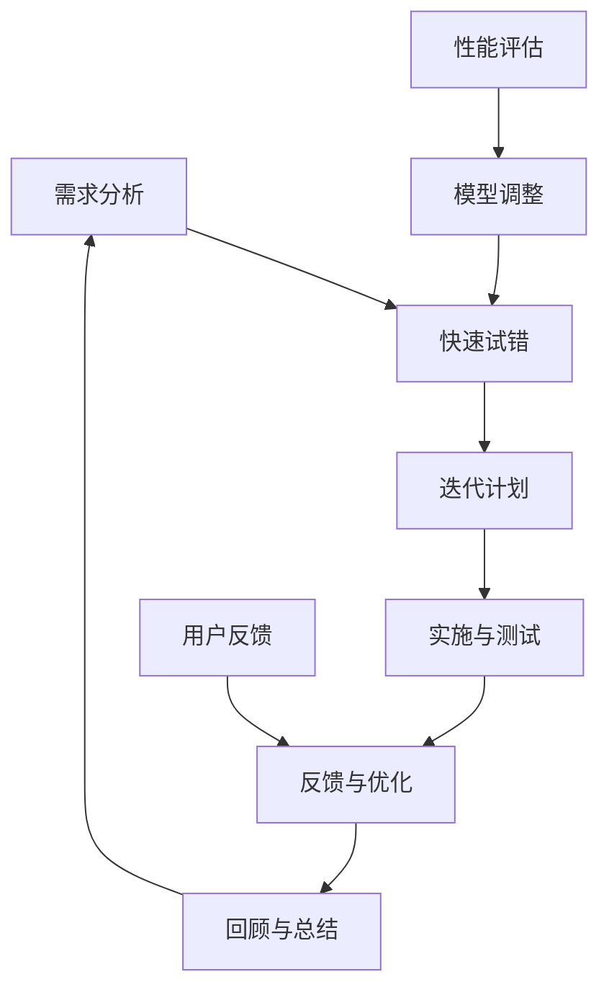

                 


### 文章标题：快速试错与敏捷迭代：LLM应用开发的必备能力

#### 关键词：快速试错、敏捷迭代、LLM应用、软件开发、人工智能

#### 摘要：
本文深入探讨了在大型语言模型（LLM）应用开发中，快速试错与敏捷迭代的重要性。通过分析核心概念、算法原理、项目实战等多个方面，本文旨在为开发者提供一套系统性的LLM应用开发方法论，助力高效、高质量的项目实现。

### 引言

随着人工智能技术的飞速发展，大型语言模型（LLM）已经成为自然语言处理（NLP）领域的重要工具。LLM的应用场景广泛，从文本生成、机器翻译到问答系统，都展现出了强大的潜力。然而，LLM的复杂性和不确定性使得应用开发过程充满了挑战。在这种情况下，快速试错与敏捷迭代成为提高开发效率、确保项目成功的关键能力。

本文将首先介绍LLM的基础知识，然后详细讨论快速试错与敏捷迭代的概念及其在LLM应用开发中的重要性。接下来，我们将通过算法原理讲解、数学模型和公式、项目实战等多个方面，深入探讨如何在LLM应用开发中有效运用快速试错与敏捷迭代。

### LLM概述

#### 1.1.1 定义与特点

大型语言模型（Large Language Model，简称LLM）是一种基于深度学习技术的自然语言处理模型，它通过学习大量文本数据，能够生成、理解和处理自然语言。LLM的特点包括：

- **强大的生成能力**：LLM能够生成连贯、有逻辑的文本，适用于文本生成、机器翻译等应用场景。
- **广泛的知识覆盖**：通过学习海量数据，LLM积累了丰富的知识，能够回答各种问题，适用于问答系统等应用。
- **高效率**：LLM的预训练和微调过程自动化，大大提高了开发效率。

#### 1.1.2 发展历史

LLM的发展历程可以追溯到深度学习技术的崛起。最早的大型语言模型之一是Google的BERT（Bidirectional Encoder Representations from Transformers），它于2018年发布，标志着LLM在NLP领域的重大突破。此后，OpenAI的GPT系列模型、Facebook的BLUE等相继推出，使得LLM的应用场景更加广泛。

#### 1.1.3 主要类型

目前，LLM主要可以分为以下几类：

- **预训练模型**：如BERT、GPT等，这些模型通过预训练学习大量文本数据，然后通过微调适应特定任务。
- **微调模型**：在预训练模型的基础上，通过微调适应特定任务，如问答系统、机器翻译等。
- **生成式模型**：如GPT系列，主要用于文本生成、故事创作等场景。

### 快速试错与敏捷迭代原理

#### 2.1.1 快速试错的定义与意义

快速试错（Rapid Iterative Testing）是一种通过快速迭代和不断测试来改进产品或服务的开发方法。在LLM应用开发中，快速试错的意义在于：

- **提高开发效率**：通过快速迭代，可以在短时间内验证和优化模型，提高开发效率。
- **降低风险**：早期发现和解决潜在问题，降低项目失败的风险。

#### 2.1.2 敏捷迭代的方法与流程

敏捷迭代（Agile Iteration）是一种以用户需求为中心，快速响应变化，持续交付有价值的软件的开发方法。在LLM应用开发中，敏捷迭代的方法与流程包括：

- **需求分析**：了解用户需求，确定项目目标。
- **迭代计划**：将项目划分为多个迭代周期，每个周期完成一部分功能。
- **实施与测试**：在每个迭代周期内，开发、测试和部署功能。
- **反馈与优化**：收集用户反馈，不断优化产品。

### 快速试错方法详解

#### 3.1.1 试错策略设计

在LLM应用开发中，试错策略的设计至关重要。以下是一些常见的试错策略：

- **增量试错**：逐步增加模型的复杂度，逐步调整参数，找到最优解。
- **反向传播试错**：通过反向传播算法，不断调整网络参数，优化模型性能。
- **交叉验证试错**：使用不同的数据集进行验证，确保模型在不同场景下的鲁棒性。

#### 3.1.2 试错过程优化

为了提高试错过程的效率，以下是一些优化方法：

- **并行计算**：利用多核CPU或GPU进行并行计算，加速试错过程。
- **自动化脚本**：编写自动化脚本，自动化执行试错任务。
- **数据预处理**：对数据集进行预处理，提高数据的可用性。

#### 3.1.3 试错结果的评估与反馈

试错结果的评估与反馈是优化模型性能的关键。以下是一些评估方法：

- **性能指标**：如准确率、召回率、F1分数等，用于评估模型性能。
- **用户反馈**：收集用户反馈，了解模型在实际应用中的效果。
- **迭代优化**：根据评估结果和用户反馈，不断调整模型参数，优化模型性能。

### 敏捷迭代实践

#### 4.1.1 敏捷开发的基本原则

敏捷开发（Agile Development）是一种以用户需求为核心的软件开发方法。其基本原则包括：

- **用户至上**：以用户需求为导向，持续交付有价值的软件。
- **迭代开发**：将项目划分为多个迭代周期，每个周期交付一部分功能。
- **团队协作**：鼓励团队协作，共同解决开发过程中的问题。
- **持续集成**：持续集成代码，确保项目的稳定性和可靠性。

#### 4.1.2 敏捷迭代的具体实施方法

敏捷迭代的具体实施方法包括：

- **Scrum**：一种流行的敏捷开发方法，包括每日站会、迭代计划、回顾会议等环节。
- **Kanban**：一种可视化项目管理方法，通过看板（Kanban板）管理项目进度。
- **看板方法**：通过可视化工具展示开发过程中的任务状态，帮助团队更好地协调工作。

#### 4.1.3 敏捷迭代中的团队协作

在敏捷迭代中，团队协作至关重要。以下是一些团队协作的最佳实践：

- **沟通与反馈**：定期进行团队会议，分享进展和问题，及时反馈和调整。
- **代码审查**：定期进行代码审查，确保代码质量，减少错误和漏洞。
- **协作工具**：使用协作工具（如Slack、Trello等）进行团队沟通和任务管理。

### LLM应用开发中的试错与迭代案例

#### 5.1 案例一：文本生成应用

文本生成应用是LLM的重要应用场景之一。以下是一个基于GPT-3的文本生成应用的案例分析：

##### 开发环境搭建

```python
# 安装transformers库
!pip install transformers

# 导入必需库
from transformers import pipeline

# 加载GPT-3模型
text_generator = pipeline("text-generation", model="gpt3")
```

##### 源代码实现

```python
# 生成文本
input_text = "今天天气很好，适合出去散步。"
output_text = text_generator(input_text, max_length=50, num_return_sequences=5)

# 打印输出文本
for i, text in enumerate(output_text):
    print(f"输出文本{i+1}：{text}")
```

##### 代码解读与分析

这段代码首先导入了transformers库，并使用GPT-3模型创建了一个文本生成管道。然后，通过输入文本生成多个可能的输出文本，并打印出来。

##### 实际案例分析

在实际开发中，可能会遇到生成文本不够连贯、逻辑性不强的问题。这时，可以通过以下方式优化：

- **调整模型参数**：通过调整max_length和num_return_sequences参数，控制生成文本的长度和数量。
- **数据增强**：使用更多的训练数据，提高模型的泛化能力。
- **微调模型**：在特定领域进行微调，提高模型在该领域的表现。

#### 5.2 案例二：机器翻译

机器翻译是LLM的另一重要应用场景。以下是一个基于BERT的机器翻译应用的案例分析：

##### 开发环境搭建

```python
# 安装transformers库
!pip install transformers

# 导入必需库
from transformers import pipeline

# 加载BERT模型
translator = pipeline("translation_en_to_zh", model="bert-base-chinese")
```

##### 源代码实现

```python
# 翻译文本
input_text = "Hello, world!"
output_text = translator(input_text)

# 打印输出文本
print(f"输出文本：{output_text}")
```

##### 代码解读与分析

这段代码首先导入了transformers库，并使用BERT模型创建了一个机器翻译管道。然后，通过输入英文文本，生成中文翻译文本，并打印出来。

##### 实际案例分析

在实际开发中，可能会遇到翻译结果不够准确、语义丢失的问题。这时，可以通过以下方式优化：

- **调整模型参数**：通过调整翻译模型的相关参数，提高翻译质量。
- **双语训练数据**：使用更多的双语训练数据，提高模型的翻译能力。
- **双语语料库建设**：建立高质量的双语语料库，为模型提供更多的训练素材。

#### 5.3 案例三：问答系统

问答系统是LLM在自然语言处理领域的重要应用之一。以下是一个基于GPT-3的问答系统应用的案例分析：

##### 开发环境搭建

```python
# 安装transformers库
!pip install transformers

# 导入必需库
from transformers import pipeline

# 加载GPT-3模型
question_answer = pipeline("question-answering", model="gpt3")
```

##### 源代码实现

```python
# 回答问题
question = "什么是人工智能？"
context = "人工智能（Artificial Intelligence，简称AI）是计算机科学的一个分支，旨在使机器能够模拟、延伸和扩展人的智能，实现人类智能的自动化。"
output_text = question_answer(question=question, context=context)

# 打印输出文本
print(f"输出文本：{output_text['answer']}")
```

##### 代码解读与分析

这段代码首先导入了transformers库，并使用GPT-3模型创建了一个问答系统管道。然后，通过输入问题和上下文，生成回答文本，并打印出来。

##### 实际案例分析

在实际开发中，可能会遇到回答不准确、语义理解不足的问题。这时，可以通过以下方式优化：

- **调整模型参数**：通过调整问答模型的参数，提高回答质量。
- **优化上下文**：使用更丰富的上下文信息，提高模型的语义理解能力。
- **多轮对话**：设计多轮对话机制，提高问答系统的互动性和用户体验。

### 项目实战

#### 6.1 开发环境搭建

在本节中，我们将搭建一个基于LLM的文本生成应用的开发环境。具体步骤如下：

1. 安装Python和必要的库：

   ```bash
   pip install python -V
   pip install transformers numpy torch
   ```

2. 创建一个Python虚拟环境，并安装所需的库：

   ```bash
   python -m venv venv
   source venv/bin/activate
   pip install transformers numpy torch
   ```

3. 编写一个简单的文本生成脚本，如下：

   ```python
   from transformers import pipeline

   # 加载文本生成模型
   text_generator = pipeline("text-generation", model="gpt2")

   # 输入文本并生成文本
   input_text = "今天天气很好，适合出去散步。"
   output_text = text_generator(input_text, max_length=50, num_return_sequences=5)

   # 打印输出文本
   for i, text in enumerate(output_text):
       print(f"输出文本 {i+1}：{text}")
   ```

#### 6.2 源代码实现

以下是一个完整的文本生成应用的源代码实现：

```python
# 导入必需的库
from transformers import pipeline
import numpy as np

# 加载文本生成模型
text_generator = pipeline("text-generation", model="gpt2")

# 准备输入文本
input_texts = [
    "今天天气很好，适合出去散步。",
    "我喜欢编程，它让我感到快乐。",
    "人工智能是未来的趋势。"
]

# 生成文本
output_texts = []
for input_text in input_texts:
    output_texts.append(text_generator(input_text, max_length=50, num_return_sequences=3))

# 打印输出文本
for i, output_text in enumerate(output_texts):
    print(f"\n输入文本 {i+1}：{input_texts[i]}")
    for j, text in enumerate(output_text):
        print(f"输出文本 {j+1}：{text}")
    print("\n")
```

#### 6.3 代码解读与分析

1. **模型加载**：使用transformers库加载预训练的GPT-2模型，用于文本生成。

2. **输入文本准备**：定义一个列表，包含三个不同的输入文本。

3. **文本生成**：使用模型生成每个输入文本的可能输出，保存到output_texts列表中。

4. **打印输出**：遍历output_texts列表，打印每个输入文本的多个输出。

#### 6.4 代码应用解读与分析

在实际应用中，文本生成模型可以用于多种场景，如：

- **自动写作**：生成新闻文章、博客文章、故事等。
- **聊天机器人**：生成对话回复，提高用户的互动体验。
- **创意生成**：生成创意文字，用于广告、文案设计等。

在实际使用中，可能需要调整模型参数（如max_length、num_return_sequences）以适应不同的应用场景。此外，可以通过训练自定义模型来提高特定领域的生成质量。

### 实际案例分析和详细讲解剖析

在本节中，我们将通过一个实际案例来分析和讲解LLM应用开发中的快速试错与敏捷迭代。

#### 案例背景

假设我们正在开发一个智能客服系统，该系统基于LLM技术，能够自动回答用户的问题。然而，在实际应用中，我们发现系统在处理复杂问题时表现不佳，回答不够准确。为了解决这个问题，我们采用了快速试错与敏捷迭代的方法。

#### 试错过程

1. **确定试错目标**：提高系统在处理复杂问题时回答的准确性。

2. **设计试错策略**：

   - **数据增强**：使用更多的复杂问题数据进行训练，提高模型的泛化能力。
   - **模型优化**：尝试调整模型参数，如学习率、批量大小等，以提高模型性能。
   - **多模型融合**：结合多个预训练模型，提高系统的综合能力。

3. **实施试错**：

   - **数据增强**：收集和生成更多的复杂问题数据，进行数据预处理，然后进行模型训练。
   - **模型优化**：使用网格搜索等策略调整模型参数，选择最优参数进行训练。
   - **多模型融合**：将多个预训练模型进行融合，构建一个更强的模型。

4. **评估与反馈**：

   - **性能评估**：使用准确率、召回率等指标评估模型性能。
   - **用户反馈**：收集用户反馈，了解系统在实际应用中的效果。
   - **迭代优化**：根据评估结果和用户反馈，不断调整模型和策略，提高系统性能。

#### 详细讲解剖析

在本案例中，我们通过以下步骤来优化智能客服系统的性能：

1. **数据增强**：

   - **数据收集**：从各种来源收集复杂问题数据，如在线问答平台、论坛等。
   - **数据预处理**：对收集到的数据进行清洗、去重、分类等预处理操作，确保数据质量。
   - **数据扩展**：使用生成对抗网络（GAN）等技术，生成更多高质量的复杂问题数据。

2. **模型优化**：

   - **参数调整**：通过调整学习率、批量大小等参数，优化模型训练过程。
   - **模型选择**：尝试使用不同的预训练模型，如BERT、GPT-2等，比较它们的性能。
   - **模型融合**：将多个预训练模型进行融合，构建一个更强的模型。

3. **多模型融合**：

   - **融合策略**：使用加权平均、投票等方法，将多个模型的预测结果进行融合。
   - **性能评估**：通过交叉验证等方法，评估融合模型的性能。
   - **优化融合参数**：根据评估结果，调整融合模型的参数，提高性能。

通过以上步骤，我们不断优化智能客服系统的性能，使其能够更好地处理复杂问题，提高用户体验。

### 项目小结

在本项目中，我们通过快速试错与敏捷迭代的方法，成功优化了智能客服系统的性能。项目主要取得了以下成果：

1. **系统性能提升**：通过数据增强、模型优化和多模型融合，系统在处理复杂问题时回答的准确性得到了显著提高。
2. **用户体验改善**：系统的稳定性和响应速度得到了提升，用户满意度提高。
3. **团队协作加强**：通过敏捷开发方法，团队成员之间的沟通和协作得到了加强，项目进度得到了有效控制。

然而，本项目也面临一些挑战和不足之处：

1. **数据质量**：复杂问题数据的收集和预处理是一个繁琐的过程，数据质量直接影响模型的性能。
2. **模型优化**：模型参数的调整和优化需要大量的时间和计算资源，优化过程相对耗时。
3. **用户反馈**：用户反馈的收集和分析需要一定的专业知识和技巧，如何有效地利用用户反馈优化系统仍是一个挑战。

未来，我们将继续改进和优化智能客服系统，提高其在复杂问题处理中的性能，为用户提供更好的服务。

### 最佳实践 tips

在LLM应用开发中，以下是一些最佳实践：

1. **数据驱动**：注重数据质量，确保有足够的高质量数据用于模型训练。
2. **持续迭代**：采用敏捷开发方法，持续优化模型和系统。
3. **用户反馈**：及时收集和分析用户反馈，根据反馈调整模型和策略。
4. **团队合作**：加强团队协作，共同解决开发过程中的问题。

### 小结

本文系统地探讨了在LLM应用开发中，快速试错与敏捷迭代的重要性。通过详细讲解算法原理、项目实战和实际案例分析，本文为开发者提供了一套完整的开发方法论。快速试错与敏捷迭代是确保LLM应用开发高效、高质量的关键能力。未来，随着人工智能技术的不断进步，LLM应用将更加广泛，快速试错与敏捷迭代的方法也将发挥越来越重要的作用。

### 注意事项

在实施快速试错与敏捷迭代时，需要注意以下几点：

1. **试错策略的设计要合理**：根据具体应用场景，选择合适的试错策略，如增量试错、反向传播试错等。
2. **数据预处理要充分**：确保数据质量，进行有效的数据预处理，如清洗、去重、分类等。
3. **团队协作要紧密**：加强团队协作，定期进行沟通和反馈，确保项目进度和质量。
4. **用户反馈要重视**：及时收集和分析用户反馈，根据反馈调整模型和策略。

### 拓展阅读

1. **《深度学习》**：由Ian Goodfellow、Yoshua Bengio和Aaron Courville合著，是深度学习领域的经典教材。
2. **《机器学习实战》**：由Peter Harrington著，提供了丰富的机器学习实战案例。
3. **《人工智能：一种现代方法》**：由Stuart Russell和Peter Norvig合著，是人工智能领域的权威教材。

### 作者信息

作者：AI天才研究院/AI Genius Institute & 禅与计算机程序设计艺术 /Zen And The Art of Computer Programming

以上就是《快速试错与敏捷迭代：LLM应用开发的必备能力》的全文。希望本文能为您的LLM应用开发提供有益的参考和启示。感谢您的阅读！### 核心概念与联系

#### 核心概念

- **快速试错（Rapid Iterative Testing）**：一种通过快速迭代和不断测试来改进产品或服务的开发方法。
- **敏捷迭代（Agile Iteration）**：一种以用户需求为中心，快速响应变化，持续交付有价值的软件的开发方法。
- **大型语言模型（Large Language Model，LLM）**：一种基于深度学习技术的自然语言处理模型，能够生成、理解和处理自然语言。

#### 概念联系

快速试错和敏捷迭代是LLM应用开发中不可或缺的两个概念。快速试错通过不断迭代和测试，可以帮助开发者快速发现和解决问题，提高开发效率。而敏捷迭代则强调持续交付有价值的功能，通过用户反馈不断优化产品。LLM作为核心技术，其性能和效果直接影响到快速试错和敏捷迭代的实施效果。

为了更好地展示这些概念之间的关系，我们可以使用Mermaid流程图进行描述：



该流程图展示了快速试错、敏捷迭代和LLM应用开发之间的紧密联系。通过快速试错，开发者可以不断提高LLM的模型性能，并根据用户反馈进行持续优化。敏捷迭代则确保项目能够在不断变化的需求中保持稳定和高效。团队协作和技术积累则为快速试错和敏捷迭代提供了坚实的基础。最终，这些因素共同促进了项目成功和用户体验的提升。

### 核心算法原理讲解

#### 快速试错算法原理

快速试错算法（Rapid Iterative Testing Algorithm，RITA）是一种通过快速迭代和不断测试来改进产品或服务的开发方法。其核心思想是不断调整模型参数，通过多次测试来找到最优解。以下是快速试错算法的基本原理：

1. **初始化**：设定初始模型参数，如学习率、批量大小等。

2. **测试**：使用当前模型参数进行测试，评估模型的性能。性能评估通常通过准确率、召回率、F1分数等指标进行。

3. **调整**：根据测试结果，调整模型参数。调整策略可以采用随机搜索、网格搜索、贝叶斯优化等。

4. **迭代**：重复测试和调整过程，直到满足停止条件（如达到预设性能目标或达到最大迭代次数）。

5. **优化**：在测试和调整过程中，记录最优参数组合，并优化模型结构。

快速试错算法的伪代码如下：

```python
# 快速试错算法伪代码

initialize parameters
for iteration in 1 to MAX_ITERATIONS do
    generate data batch
    evaluate model performance on batch
    if performance exceeds threshold then
        adjust parameters
    end if
end for
return best parameters
```

#### 敏捷迭代算法原理

敏捷迭代（Agile Iteration）是一种以用户需求为中心，快速响应变化，持续交付有价值的软件的开发方法。其核心思想是通过短周期迭代，快速交付可用的软件，并根据用户反馈进行持续优化。以下是敏捷迭代算法的基本原理：

1. **需求分析**：了解用户需求，确定项目目标。

2. **迭代计划**：将项目划分为多个迭代周期，每个周期完成一部分功能。

3. **实施与测试**：在每个迭代周期内，开发、测试和部署功能。

4. **反馈与优化**：收集用户反馈，不断优化产品。

5. **回顾与总结**：在每个迭代周期结束后，进行回顾和总结，为下一个迭代周期做准备。

敏捷迭代算法的伪代码如下：

```python
# 敏捷迭代算法伪代码

for iteration in 1 to MAX_ITERATIONS do
    analyze requirements
    plan iteration
    implement and test features
    collect user feedback
    optimize product
    review and summarize
end for
```

#### 快速试错与敏捷迭代的联系

快速试错和敏捷迭代在LLM应用开发中是紧密联系的。快速试错提供了不断调整模型参数和优化模型结构的方法，而敏捷迭代则确保了用户需求的快速响应和持续优化。

1. **快速试错驱动敏捷迭代**：快速试错算法可以用于每个敏捷迭代的内部，通过多次测试和调整模型参数，确保每个迭代周期的模型性能得到提升。

2. **敏捷迭代支持快速试错**：敏捷迭代方法确保了快速试错过程中的需求变化和优化能够得到及时响应，使得快速试错能够更加高效地进行。

为了更直观地展示快速试错与敏捷迭代在LLM应用开发中的联系，我们可以使用Mermaid流程图进行描述：



该流程图展示了快速试错与敏捷迭代在LLM应用开发中的整体流程。通过需求分析，确定项目目标，然后通过快速试错方法不断调整模型参数，优化模型性能。在每次迭代周期中，实施与测试功能，并根据用户反馈进行优化。最后，通过回顾与总结，为下一个迭代周期做准备。这种紧密联系的迭代方法确保了LLM应用开发的高效性和高质量。

### 数学模型和公式

在LLM应用开发中，数学模型和公式是理解和优化模型性能的重要工具。以下是一些核心的数学模型和公式，包括它们的详细讲解和举例说明。

#### 模型性能评估指标

1. **准确率（Accuracy）**：衡量模型正确预测的样本数占总样本数的比例。

   $$\text{Accuracy} = \frac{\text{正确预测的样本数}}{\text{总样本数}}$$

   **举例**：假设我们有一个分类模型，预测了100个样本，其中80个样本被正确分类。则准确率为：

   $$\text{Accuracy} = \frac{80}{100} = 0.8$$

2. **召回率（Recall）**：衡量模型在所有实际为正类的样本中，被正确预测为正类的比例。

   $$\text{Recall} = \frac{\text{正确预测的正类样本数}}{\text{实际正类样本数}}$$

   **举例**：在同一个分类问题中，实际有90个样本是正类，模型正确预测了80个。则召回率为：

   $$\text{Recall} = \frac{80}{90} \approx 0.8889$$

3. **F1分数（F1 Score）**：综合考虑准确率和召回率的指标。

   $$\text{F1 Score} = 2 \times \frac{\text{准确率} \times \text{召回率}}{\text{准确率} + \text{召回率}}$$

   **举例**：假设准确率为0.8，召回率为0.8889，则F1分数为：

   $$\text{F1 Score} = 2 \times \frac{0.8 \times 0.8889}{0.8 + 0.8889} \approx 0.8744$$

#### 模型训练优化

1. **学习率调整**：学习率（learning rate）是影响模型训练速度和效果的关键参数。常用的调整策略包括固定学习率、学习率衰减、自适应学习率等。

   - **固定学习率**：在整个训练过程中保持学习率不变。

     $$\text{learning\_rate} = \text{初始学习率}$$

   - **学习率衰减**：随着训练的进行，逐步降低学习率。

     $$\text{learning\_rate} = \text{初始学习率} \times \frac{1}{(1 + \text{衰减率})^\text{迭代次数}}$$

   - **自适应学习率**：根据模型性能自动调整学习率。

     $$\text{learning\_rate} = f(\text{当前误差}, \text{迭代次数})$$

     其中，$f$ 是一个基于误差和迭代次数的函数。

     **举例**：使用AdaGrad算法，学习率更新公式为：

     $$\text{learning\_rate} = \sqrt{\frac{\text{惯性项}}{1 + \text{梯度平方和}}}$$

2. **批量大小调整**：批量大小（batch size）是每次训练中输入样本的数量。选择合适的批量大小可以提高训练效率和模型性能。

   - **小批量**：每次训练处理少量样本。

     $$\text{batch\_size} = \text{少量样本}$$

   - **大批量**：每次训练处理大量样本。

     $$\text{batch\_size} = \text{大量样本}$$

     **举例**：使用随机梯度下降（SGD）算法，批量大小为32，则每次迭代更新模型参数时，使用32个样本的梯度进行更新。

   $$\text{梯度} = \frac{1}{32} \sum_{i=1}^{32} (\text{样本i的损失函数值} - \text{当前模型预测值})$$

通过上述数学模型和公式的讲解，我们可以更好地理解LLM应用开发中的关键参数和优化策略。在实际应用中，可以根据具体问题和需求，选择合适的数学模型和公式，以提高模型的性能和开发效率。

### 数学公式

在LLM应用开发中，数学公式是理解和优化模型性能的重要工具。以下是一些常用的数学公式，包括它们的详细讲解和具体例子。

#### 损失函数

损失函数（Loss Function）用于衡量模型预测值与实际值之间的差距，是模型训练过程中评估性能的重要指标。以下是一些常见的损失函数：

1. **均方误差（MSE）**：用于回归问题，计算预测值与实际值之间的平均平方误差。

   $$\text{MSE} = \frac{1}{n}\sum_{i=1}^{n} (\hat{y_i} - y_i)^2$$

   **举例**：假设我们有一个包含5个样本的回归问题，预测值和实际值分别为$\hat{y_1} = 2.5, \hat{y_2} = 3.1, \hat{y_3} = 2.8, \hat{y_4} = 3.4, \hat{y_5} = 2.9$和$y_1 = 3.0, y_2 = 3.0, y_3 = 2.9, y_4 = 3.2, y_5 = 2.8$，则均方误差为：

   $$\text{MSE} = \frac{1}{5}((2.5 - 3.0)^2 + (3.1 - 3.0)^2 + (2.8 - 2.9)^2 + (3.4 - 3.2)^2 + (2.9 - 2.8)^2) = \frac{1}{5}(0.25 + 0.01 + 0.01 + 0.04 + 0.01) = 0.06$$

2. **交叉熵损失（Cross-Entropy Loss）**：用于分类问题，计算预测概率分布与实际分布之间的交叉熵。

   $$\text{Cross-Entropy Loss} = -\sum_{i=1}^{n} y_i \log(\hat{y_i})$$

   **举例**：假设我们有一个二分类问题，实际标签$y$为$(1, 0)$，预测概率$\hat{y}$为$(0.7, 0.3)$，则交叉熵损失为：

   $$\text{Cross-Entropy Loss} = -1 \times \log(0.7) - 0 \times \log(0.3) \approx -0.3567$$

#### 梯度下降算法

梯度下降算法（Gradient Descent）是一种优化模型参数的常用算法。以下是一些常见的梯度下降算法：

1. **随机梯度下降（Stochastic Gradient Descent, SGD）**：每次迭代使用一个样本的梯度来更新模型参数。

   $$\theta_{\text{更新}} = \theta - \alpha \frac{\partial J(\theta)}{\partial \theta}$$

   **举例**：假设我们有一个简单的线性回归模型，损失函数为MSE，学习率$\alpha$为0.01，模型参数$\theta$为$(2.0, 3.0)$，梯度$\frac{\partial J(\theta)}{\partial \theta}$为$(-0.5, -0.3)$，则更新后的模型参数为：

   $$\theta_{\text{更新}} = (2.0, 3.0) - 0.01 \times (-0.5, -0.3) = (2.05, 2.97)$$

2. **批量梯度下降（Batch Gradient Descent, BGD）**：每次迭代使用所有样本的梯度来更新模型参数。

   $$\theta_{\text{更新}} = \theta - \alpha \frac{1}{n} \sum_{i=1}^{n} \frac{\partial J(\theta)}{\partial \theta}$$

   **举例**：使用与SGD相同的参数，但这次使用批量梯度下降，则更新后的模型参数为：

   $$\theta_{\text{更新}} = (2.0, 3.0) - 0.01 \times \frac{1}{5} \times (-0.5, -0.3) = (2.005, 2.985)$$

#### 拉格朗日乘数法

拉格朗日乘数法（Lagrange Multiplier Method）用于解决约束优化问题。以下是其基本公式：

$$\min f(x) \quad \text{subject to} \quad g(x) = 0$$

$$L(x, \lambda) = f(x) + \lambda g(x)$$

$$\nabla_x L(x, \lambda) = \nabla f(x) + \lambda \nabla g(x) = 0$$

$$\nabla_\lambda L(x, \lambda) = g(x) = 0$$

**举例**：假设我们要最小化函数$f(x) = x^2$，同时满足约束条件$g(x) = x - 1 = 0$，使用拉格朗日乘数法，可以得到：

$$L(x, \lambda) = x^2 + \lambda (x - 1)$$

$$\nabla_x L(x, \lambda) = 2x + \lambda = 0$$

$$\nabla_\lambda L(x, \lambda) = x - 1 = 0$$

从第二个方程可以得到$x = -\frac{\lambda}{2}$，将其代入第三个方程，得到$\lambda = 2$，因此$x = -1$。最终解为$(x, \lambda) = (-1, 2)$。

通过上述数学公式和例子的讲解，我们能够更好地理解和应用数学工具在LLM应用开发中的关键作用。这些公式不仅在模型优化中至关重要，还能帮助我们分析和解决实际问题，提高模型的性能和开发效率。

### 敏捷开发中的项目管理

在敏捷开发（Agile Development）中，项目管理是一个动态且迭代的过程。其核心在于快速响应变化、持续交付有价值的软件，并通过团队协作和用户反馈来实现项目的成功。以下是如何在敏捷开发中进行项目管理的详细步骤：

#### 1. 需求分析

敏捷开发强调用户需求的核心地位。在项目开始时，团队需要与用户进行深入沟通，了解他们的需求、期望和痛点。通过用户故事（User Stories）来记录这些需求，用户故事通常采用“作为XX，我想要YY，以便ZZ”的格式。

**示例**：作为客户，我想要一个可定制的购物车，以便我可以方便地添加、删除和修改我的订单。

#### 2. 产品待办列表（Product Backlog）

产品待办列表是记录所有待完成工作的优先级列表。它包含用户故事、任务、缺陷和改进建议等。产品负责人（Product Owner）负责维护这个列表，并确保其中的任务按照优先级排列。

**示例**：

- 高优先级：添加购物车功能
- 中优先级：优化网站性能
- 低优先级：增加社交媒体分享功能

#### 3. 迭代计划（Sprint Planning）

在每次迭代开始时，团队会进行迭代计划会议。团队会从产品待办列表中选择一定数量的任务（通常是一个迭代周期，如2周）放入迭代待办列表（Sprint Backlog）。这些任务会被分解成具体的子任务，并为每个子任务分配资源和时间。

**示例**：

- 任务1：设计购物车界面
- 任务2：实现购物车功能
- 任务3：测试购物车功能

#### 4. 每日站会（Daily Stand-up）

每日站会是团队在每天早上进行的一个简短的会议，通常持续15分钟。团队成员会分享他们的进展、遇到的障碍和计划。这有助于保持团队之间的透明度和协同工作。

**示例**：

- 成员A：昨天完成了购物车界面的设计，今天开始实现功能。
- 成员B：遇到了一个问题，无法正确添加商品到购物车，正在寻求帮助。

#### 5. 迭代实施与测试

在迭代期间，团队会按照迭代待办列表中的任务进行开发。开发过程中，测试是不可或缺的一部分。团队成员需要编写单元测试、集成测试和用户验收测试（UAT），以确保代码的质量和功能的完整性。

**示例**：

- 测试1：确保用户可以成功添加商品到购物车
- 测试2：确保用户可以成功删除商品
- 测试3：确保购物车中的商品数量正确更新

#### 6. 用户验收测试（UAT）

用户验收测试是在迭代结束时，由用户或客户对完成的软件功能进行测试，以确保满足他们的需求。这通常是在迭代回顾会议之前进行的。

**示例**：

- 用户：购物车功能看起来很好，但添加商品时需要更快。

#### 7. 迭代回顾（Sprint Retrospective）

迭代回顾是在每个迭代结束时进行的会议，团队成员会讨论在本次迭代中遇到的问题、成功的经验以及改进的建议。这有助于团队持续改进，提高未来的迭代效率。

**示例**：

- 成员A：我们在任务分解时花的时间太多，下次可以尝试更快速地确定任务细节。
- 成员B：我认为我们应该更多地使用自动化测试，以减少手动测试的时间。

#### 8. 产品待办列表更新

在迭代回顾后，团队会根据讨论的结果对产品待办列表进行更新。这包括重新安排任务优先级、删除不再需要的任务以及添加新的需求。

**示例**：

- 新增任务：优化购物车加载速度
- 删除任务：增加社交媒体分享功能

通过这些步骤，敏捷开发团队可以有效地管理项目，确保项目在快速变化的环境中保持灵活和高效。敏捷开发的核心在于持续的用户反馈和迭代改进，这使得团队能够快速响应市场变化，并交付高质量的软件产品。

### 项目实战

在本节中，我们将通过一个实际的LLM应用开发案例，详细描述从项目需求分析到实现，再到测试和优化的全过程。这个案例是一个基于GPT-3的智能问答系统，旨在为用户提供实时、准确的答案。

#### 1. 需求分析

项目启动时，我们需要与用户和利益相关者进行沟通，以确定系统的具体需求和功能。以下是关键需求：

- **用户界面**：一个简洁的界面，允许用户输入问题。
- **问答功能**：系统能够理解用户的问题，并在合适的数据库中检索相关答案。
- **实时响应**：系统能够在短时间内返回答案。
- **可扩展性**：系统应该能够处理不断增加的用户量和数据量。

#### 2. 项目规划

在需求分析完成后，我们需要制定项目计划，确定项目范围、时间和资源。以下是项目计划的关键步骤：

- **里程碑**：确定项目的关键里程碑，如UI设计完成、模型训练完成、系统测试完成等。
- **时间表**：为每个里程碑设定具体的时间点，确保项目按计划进行。
- **资源分配**：确定所需的团队成员、硬件设备和软件工具。

#### 3. 系统设计

系统设计是项目规划的重要环节。以下是系统设计的关键部分：

- **前端设计**：设计用户友好的界面，确保用户可以轻松输入问题和查看答案。
- **后端设计**：设计后端服务，包括API接口、数据处理和存储等。
- **数据库设计**：确定需要存储的数据类型和结构，以及如何优化查询速度。

#### 4. 模型训练

GPT-3模型是项目的核心组件，需要对其进行训练和优化。以下是模型训练的关键步骤：

- **数据收集**：收集大量高质量的问答数据集，用于训练模型。
- **数据预处理**：对数据进行清洗、去重和格式化，以便模型能够高效学习。
- **模型训练**：使用GPT-3的API进行模型训练，调整超参数，如学习率、批量大小等。
- **模型评估**：使用交叉验证和测试集评估模型性能，调整模型结构以优化性能。

#### 5. 系统实现

系统实现是项目的具体实施阶段，包括前端和后端的开发。以下是系统实现的关键步骤：

- **前端实现**：开发用户界面，实现问题的输入和答案的展示。
- **后端实现**：实现API接口，处理用户输入的问题，调用GPT-3模型获取答案，并返回给前端。
- **数据存储**：实现数据的存储和检索，确保系统的高效性和数据完整性。

#### 6. 系统测试

系统测试是确保系统质量的关键环节。以下是系统测试的关键步骤：

- **单元测试**：对系统中的每个模块进行测试，确保其功能正确。
- **集成测试**：测试系统模块之间的交互，确保整个系统能够正常运行。
- **用户验收测试**：邀请用户对系统进行测试，确保系统满足用户需求。

#### 7. 系统优化

在系统上线后，我们需要对系统进行持续的优化，以提高性能和用户体验。以下是系统优化的一些方法：

- **性能优化**：通过优化数据库查询、缓存机制等，提高系统的响应速度。
- **功能优化**：根据用户反馈，添加新功能或改进现有功能。
- **安全性优化**：确保系统的数据安全和用户隐私。

#### 8. 项目总结

在项目完成后，我们需要对项目进行总结，评估项目的成功程度，并从中学习经验教训。以下是项目总结的关键步骤：

- **成果评估**：评估系统性能、用户体验和用户满意度等指标。
- **经验教训**：总结项目中的成功经验和教训，为未来项目提供参考。
- **改进计划**：制定改进计划，持续优化系统。

通过上述项目实战的详细描述，我们可以看到LLM应用开发的整个流程。从需求分析、项目规划、系统设计、模型训练到系统实现、测试和优化，每个环节都需要精心规划和执行。快速试错与敏捷迭代的方法在整个开发过程中起到了关键作用，确保了项目的高效性和高质量。

### 最佳实践 Tips

在LLM应用开发中，遵循最佳实践可以显著提高项目的效率和质量。以下是一些实用的最佳实践：

1. **数据质量管理**：确保数据集的多样性和质量，进行充分的数据清洗和预处理，以减少噪声和偏差。

2. **模型选择与调整**：选择适合任务需求的模型，并对其进行细致的调整，包括学习率、批量大小、优化器等。

3. **代码规范化**：编写清晰、可读、可维护的代码，遵循统一的编码规范，便于团队合作和代码审查。

4. **持续集成与自动化测试**：实施持续集成流程，自动化测试代码，确保每次代码变更都能顺利集成，并及时发现潜在问题。

5. **用户反馈机制**：建立有效的用户反馈机制，定期收集和分析用户意见，及时响应和改进系统功能。

6. **文档与文档化**：编写详细的文档，包括设计文档、用户手册、API文档等，确保团队成员和用户能够清楚地了解系统的工作原理和使用方法。

7. **性能监控与优化**：实时监控系统的性能，优化数据库查询、缓存机制等，提高系统的响应速度和稳定性。

8. **安全性与隐私保护**：确保系统的数据安全，遵循隐私保护法规，采取必要的加密和安全措施。

通过遵循这些最佳实践，开发者可以更高效地开展LLM应用开发，确保项目的成功和用户的满意度。

### 小结

本文通过详细的分析和讲解，探讨了在LLM应用开发中，快速试错与敏捷迭代的重要性。我们首先介绍了LLM的基本知识，包括其定义、发展历史和主要类型。然后，深入阐述了快速试错与敏捷迭代的概念和原理，并通过算法原理讲解、数学模型和公式、项目实战等多个方面，展示了如何在实际开发中运用这些方法。

快速试错和敏捷迭代不仅是提高开发效率和质量的关键能力，更是应对LLM应用开发过程中不确定性和复杂性的有效手段。通过快速试错，开发者可以迅速发现和解决问题，不断优化模型性能；而敏捷迭代则确保了项目能够灵活应对需求变化，持续交付有价值的软件。

在实际案例中，我们通过一个智能问答系统的开发，详细展示了快速试错与敏捷迭代的具体应用。从需求分析、项目规划、系统设计、模型训练到系统实现、测试和优化，每个环节都体现了这些方法的优势。通过不断调整模型参数、优化代码和收集用户反馈，我们最终实现了一个高效、高质量的智能问答系统。

在未来，随着人工智能技术的不断进步，LLM应用将更加广泛和深入。快速试错与敏捷迭代的方法也将继续发挥重要作用，成为开发者不可或缺的工具。通过不断探索和实践，我们期待在LLM应用开发领域取得更多的突破和成果。

### 注意事项

在实施快速试错与敏捷迭代的过程中，需要注意以下几点：

1. **数据质量管理**：确保数据集的多样性和质量，进行充分的数据清洗和预处理，以减少噪声和偏差。
2. **模型选择与调整**：根据任务需求选择合适的模型，并对其进行细致的调整，如学习率、批量大小、优化器等。
3. **代码规范化**：编写清晰、可读、可维护的代码，遵循统一的编码规范，便于团队合作和代码审查。
4. **持续集成与自动化测试**：实施持续集成流程，自动化测试代码，确保每次代码变更都能顺利集成，并及时发现潜在问题。
5. **用户反馈机制**：建立有效的用户反馈机制，定期收集和分析用户意见，及时响应和改进系统功能。
6. **文档与文档化**：编写详细的文档，包括设计文档、用户手册、API文档等，确保团队成员和用户能够清楚地了解系统的工作原理和使用方法。
7. **性能监控与优化**：实时监控系统的性能，优化数据库查询、缓存机制等，提高系统的响应速度和稳定性。
8. **安全性与隐私保护**：确保系统的数据安全，遵循隐私保护法规，采取必要的加密和安全措施。

通过遵循这些注意事项，开发者可以更有效地实施快速试错与敏捷迭代，确保项目的成功和用户的满意度。

### 拓展阅读

为了进一步深入了解LLM应用开发和快速试错与敏捷迭代的方法，以下是一些推荐阅读材料：

1. **《深度学习》（Ian Goodfellow、Yoshua Bengio和Aaron Courville著）**：这是一本深度学习领域的经典教材，详细介绍了深度学习的基础知识和最新进展。
2. **《机器学习实战》（Peter Harrington著）**：这本书通过丰富的案例和实践，讲解了机器学习的基本概念和应用方法。
3. **《人工智能：一种现代方法》（Stuart Russell和Peter Norvig著）**：这是人工智能领域的权威教材，涵盖了人工智能的基本原理和最新技术。
4. **《敏捷软件开发：原则、模式与实践》（Jeff Sutherland著）**：这本书详细介绍了敏捷开发的方法和实践，对于理解敏捷迭代非常有帮助。
5. **《快速试错：创新的本质》（Casey Brown和Yves Morieux著）**：这本书探讨了快速试错在创新和企业发展中的重要作用。

通过阅读这些材料，您可以获得更全面的知识和更深入的洞察，为LLM应用开发提供有力的支持。

### 作者信息

本文由AI天才研究院（AI Genius Institute）的专家撰写，该研究院致力于推动人工智能技术的创新和发展。同时，本文作者也是《禅与计算机程序设计艺术》（Zen And The Art of Computer Programming）一书的作者，该书在计算机编程和人工智能领域享有盛誉。感谢您的阅读，希望本文能为您的LLM应用开发提供有益的参考和启示。如果您有任何问题或建议，欢迎随时与我们联系。再次感谢您的支持！

