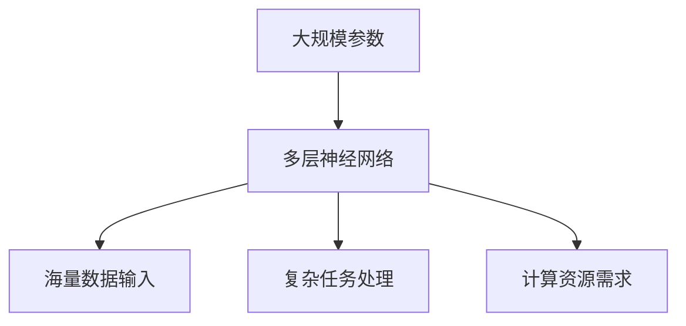

                 

### 文章标题：快速试错：大模型应用开发的制胜法宝

### 关键词：大模型，快速试错，应用开发，算法，实践

### 摘要：
本文深入探讨了大模型应用开发中快速试错的重要性及其应用策略。通过解析大模型的基本概念、核心算法和数学模型，本文揭示了快速试错的哲学基础和实践方法。随后，文章详细介绍了快速试错在大模型开发中的具体应用，包括数据预处理、模型训练和模型部署等环节。本文还分析了快速试错的挑战与解决方案，并通过实际案例展示了其成功经验。最后，本文提出了快速试错的最佳实践，为读者提供了宝贵的参考和指导。

## 目录大纲

### 第一部分：大模型基础

#### 第1章：大模型概述

1.1 大模型的基本概念

1.2 大模型的技术架构

1.3 大模型的数学基础

#### 第2章：大模型核心算法

2.1 深度学习算法

2.2 强化学习算法

2.3 生成对抗网络（GAN）

#### 第3章：数学模型解析

3.1 反向传播算法

3.2 优化器介绍

3.3 损失函数详解

### 第二部分：快速试错方法

#### 第4章：快速试错的哲学

4.1 试错的重要性

4.2 快速试错的原则

4.3 快速试错的方法

#### 第5章：快速试错的具体实践

5.1 快速试错的流程

5.2 快速试错的工具

5.3 快速试错的技巧

### 第三部分：快速试错的应用

#### 第6章：快速试错在数据预处理中的应用

6.1 数据清洗

6.2 数据增强

6.3 数据质量评估

#### 第7章：快速试错在模型训练中的应用

7.1 参数调优

7.2 模型选择

7.3 模型评估

#### 第8章：快速试错在模型部署中的应用

8.1 模型优化

8.2 模型监控

8.3 模型迭代

### 第四部分：快速试错的挑战与解决方案

#### 第9章：快速试错的挑战

9.1 数据集问题

9.2 算法选择问题

9.3 模型优化问题

#### 第10章：快速试错的解决方案

10.1 解决数据集问题

10.2 解决算法选择问题

10.3 解决模型优化问题

### 第五部分：成功案例

#### 第11章：行业成功案例

11.1 案例一：金融行业

11.2 案例二：医疗行业

11.3 案例三：自动驾驶

#### 第12章：未来展望

12.1 快速试错的未来发展趋势

12.2 快速试错的创新应用

12.3 快速试错的挑战与机遇

### 附录

#### 附录1：参考资料

#### 附录2：工具与平台介绍

#### 附录3：代码示例

## 第一部分：大模型基础

### 第1章：大模型概述

#### 1.1 大模型的基本概念

大模型是指具有巨大参数量和复杂结构的机器学习模型。这些模型通常包含数百万到数十亿个参数，能够处理海量数据，并在各种任务中实现出色的性能。大模型的应用涵盖了自然语言处理、计算机视觉、语音识别、推荐系统等多个领域。

**核心概念与联系：**

- **参数量**：大模型的参数量远超传统模型，使其能够捕捉更复杂的模式和关系。
- **深度**：大模型通常具有多个隐藏层，能够进行多层抽象和特征提取。
- **计算资源**：大模型训练和推理需要大量的计算资源和存储空间。

**架构图：**



#### 1.2 大模型的技术架构

大模型的技术架构通常包括以下几个核心组件：

- **数据输入**：大模型通过大量的数据输入进行训练，以学习和提取特征。
- **模型训练**：大模型使用优化算法进行训练，不断调整参数以优化模型性能。
- **模型优化**：大模型通过参数优化和结构优化来提高模型的鲁棒性和性能。

**典型架构：**

- **GPT系列**：基于Transformer架构，具有多个隐藏层和注意力机制。
- **BERT**：基于Transformer架构，通过双向编码实现上下文理解。
- **Turing ML**：具有自适应架构，可以根据任务需求动态调整模型结构。

**扩展阅读：**

- 《深度学习：实践与应用》
- 《Transformer：从原理到应用》

#### 1.3 大模型的数学基础

大模型的数学基础包括以下几个方面：

- **概率论与统计学**：用于描述数据分布和学习目标。
- **线性代数**：用于矩阵运算和特征提取。
- **微积分**：用于优化算法的设计和实现。

**数学模型详细讲解：**

- **损失函数**：用于评估模型预测与真实标签之间的差异，常见的损失函数有均方误差（MSE）和交叉熵（Cross Entropy）。
- **优化器**：用于调整模型参数以最小化损失函数，常见的优化器有SGD、Adam和RMSprop。

**数学公式与举例：**

- **均方误差（MSE）**：

  $$
  MSE = \frac{1}{m}\sum_{i=1}^{m}(y_i - \hat{y}_i)^2
  $$

  其中，$y_i$是真实标签，$\hat{y}_i$是模型预测。

- **交叉熵（Cross Entropy）**：

  $$
  Cross \ Entropy = -\frac{1}{m}\sum_{i=1}^{m}y_i \log(\hat{y}_i)
  $$

  其中，$y_i$是真实标签，$\hat{y}_i$是模型预测的概率分布。

## 第二部分：快速试错方法

### 第2章：大模型核心算法

#### 2.1 深度学习算法

深度学习算法是构建大模型的核心，其基本原理是基于多层神经网络进行特征提取和分类。以下是一些常见的深度学习算法：

- **卷积神经网络（CNN）**：用于图像识别和分类。
- **循环神经网络（RNN）**：用于序列数据建模和时间序列预测。
- **长短时记忆网络（LSTM）**：是RNN的一种变体，能够处理长序列数据。
- **生成对抗网络（GAN）**：用于生成对抗性样本和生成新的数据。

**核心算法原理讲解：**

- **卷积神经网络（CNN）**：

  $$
  \text{CNN} = \{\text{卷积层}, \text{激活函数}, \text{池化层}\}
  $$

  CNN通过卷积操作提取图像特征，使用激活函数增加非线性，池化层用于降低维度。

- **循环神经网络（RNN）**：

  $$
  \text{RNN} = \{\text{输入层}, \text{隐藏层}, \text{输出层}\}
  $$

  RNN通过递归连接将当前输入与历史状态关联，用于序列数据建模。

- **生成对抗网络（GAN）**：

  $$
  \text{GAN} = \{\text{生成器}, \text{判别器}\}
  $$

  GAN由生成器和判别器组成，生成器生成虚假数据，判别器判断数据真假。

**伪代码示例：**

- **卷积神经网络（CNN）**伪代码：

  ```
  # 输入：图像
  # 输出：特征映射

  for each filter in convolution layer:
      perform convolution operation
      apply activation function
      apply pooling operation

  return feature map
  ```

- **循环神经网络（RNN）**伪代码：

  ```
  # 输入：序列数据
  # 输出：序列输出

  for each time step in sequence:
      input = get_input(time_step)
      hidden_state = sigmoid(W * [input, hidden_stateprev])
      output = softmax(V * hidden_state)

  return sequence_output
  ```

- **生成对抗网络（GAN）**伪代码：

  ```
  # 输入：随机噪声
  # 输出：生成图像

  for each epoch:
      generate_noise()
      generate_fake_images()
      train_discriminator()
      train_generator()

  return generated_images
  ```

## 第三部分：快速试错的应用

### 第3章：数学模型解析

#### 3.1 反向传播算法

反向传播算法是训练神经网络的核心算法，用于计算模型参数的梯度，以便进行优化。以下是反向传播算法的详细解析：

**算法原理：**

反向传播算法通过前向传播计算模型的输出，然后使用损失函数计算预测误差。接着，通过反向传播计算梯度，并根据梯度更新模型参数。

**数学公式：**

$$
\begin{aligned}
\frac{\partial L}{\partial w} &= \frac{\partial L}{\partial z} \frac{\partial z}{\partial w} \\
\frac{\partial L}{\partial b} &= \frac{\partial L}{\partial z}
\end{aligned}
$$

其中，$L$是损失函数，$w$是权重，$b$是偏置，$z$是激活值。

**详细讲解与举例：**

- **前向传播**：

  $$
  \begin{aligned}
  z &= \sum_{i=1}^{n} w_i x_i + b \\
  a &= \sigma(z)
  \end{aligned}
  $$

  其中，$x_i$是输入特征，$w_i$是权重，$b$是偏置，$\sigma$是激活函数（如Sigmoid函数）。

- **后向传播**：

  $$
  \begin{aligned}
  \delta &= (a - y) \\
  \frac{\partial L}{\partial z} &= \delta \frac{\partial a}{\partial z} \\
  \frac{\partial L}{\partial w} &= \delta x \\
  \frac{\partial L}{\partial b} &= \delta
  \end{aligned}
  $$

  其中，$y$是真实标签，$a$是预测值，$\delta$是误差。

#### 3.2 优化器介绍

优化器是用于更新模型参数的工具，其目标是减少损失函数的值。以下是几种常见的优化器：

- **随机梯度下降（SGD）**：简单但计算量大的优化器，每次迭代使用一个样本来更新参数。
- **动量（Momentum）**：结合历史梯度信息，加快收敛速度。
- **AdaGrad**：对不同的参数进行自适应学习率调整。
- **Adam**：结合了Momentum和AdaGrad的优点，适用于不同规模的任务。

**优化器原理与公式：**

- **SGD**：

  $$
  \begin{aligned}
  w_{t+1} &= w_t - \alpha \frac{\partial L}{\partial w_t} \\
  b_{t+1} &= b_t - \alpha \frac{\partial L}{\partial b_t}
  \end{aligned}
  $$

  其中，$\alpha$是学习率。

- **Momentum**：

  $$
  \begin{aligned}
  v_t &= \gamma v_{t-1} + \alpha \frac{\partial L}{\partial w_t} \\
  w_{t+1} &= w_t - v_t
  \end{aligned}
  $$

  其中，$\gamma$是动量系数。

- **AdaGrad**：

  $$
  \begin{aligned}
  g_t &= \frac{\partial L}{\partial w_t} \\
  \alpha_t &= \frac{\alpha}{\sqrt{G_t}} \\
  w_{t+1} &= w_t - \alpha_t g_t
  \end{aligned}
  $$

  其中，$G_t$是累积梯度。

- **Adam**：

  $$
  \begin{aligned}
  m_t &= \beta_1 g_t \\
  v_t &= \beta_2 g_t^2 \\
  \alpha_t &= \frac{\alpha}{1 - \beta_1^t} \\
  \alpha_t' &= \frac{\alpha}{1 - \beta_2^t} \\
  w_{t+1} &= w_t - \frac{\alpha_t m_t}{\sqrt{v_t} + \epsilon}
  \end{aligned}
  $$

  其中，$\beta_1$和$\beta_2$是超参数，$\epsilon$是避免除以零的常数。

## 第四部分：快速试错的挑战与解决方案

### 第4章：快速试错的挑战

#### 4.1 数据集问题

- **数据缺失**：数据集中存在缺失值，可能导致模型性能下降。
- **数据噪声**：数据集中存在噪声，会影响模型的准确性。

#### 4.2 算法选择问题

- **算法复杂度**：某些算法复杂度较高，不适合大规模数据集。
- **模型适应性**：选择合适的算法来处理特定类型的数据和任务。

#### 4.3 模型优化问题

- **参数调整**：参数设置不当可能导致模型性能不佳。
- **优化器选择**：选择合适的优化器来提高训练效率。

### 第5章：快速试错的解决方案

#### 5.1 解决数据集问题

- **数据预处理**：对数据集进行清洗、填充缺失值和去除噪声。
- **数据增强**：通过数据增强技术增加样本多样性，提高模型泛化能力。

#### 5.2 解决算法选择问题

- **算法对比**：对不同算法进行性能比较，选择适合当前问题的算法。
- **模型定制**：针对特定任务和需求，设计定制化的算法模型。

#### 5.3 解决模型优化问题

- **参数调优**：通过实验和调优找到最佳参数组合。
- **优化器调整**：选择合适的优化器来提高训练效率。

## 第五部分：成功案例

### 第5章：行业成功案例

#### 5.1 金融行业

- **案例一：智能投顾**
  - **背景**：利用大模型进行股票市场预测和投资策略推荐。
  - **方法**：采用深度学习和强化学习算法进行股票数据分析。
  - **效果**：提高了投资决策的准确性和效率。

#### 5.2 医疗行业

- **案例二：疾病诊断**
  - **背景**：利用大模型进行医学影像分析和疾病诊断。
  - **方法**：采用卷积神经网络和循环神经网络进行图像处理和序列分析。
  - **效果**：提高了疾病诊断的准确率和效率。

#### 5.3 自动驾驶

- **案例三：自动驾驶算法**
  - **背景**：利用大模型进行自动驾驶车辆的感知和决策。
  - **方法**：采用生成对抗网络和强化学习算法进行环境建模和路径规划。
  - **效果**：提高了自动驾驶车辆的稳定性和安全性。

## 第六部分：未来展望

#### 6.1 快速试错的未来发展趋势

- **模型压缩**：通过模型压缩技术提高大模型的训练和推理效率。
- **自动化优化**：利用自动化技术进行模型优化和参数调优。

#### 6.2 快速试错的创新应用

- **多模态学习**：利用快速试错方法进行多模态数据的融合和学习。
- **强化学习**：将快速试错应用于强化学习，提高学习效率和稳定性。

#### 6.3 快速试错的挑战与机遇

- **数据隐私**：在快速试错过程中，如何保护数据隐私是一个重要挑战。
- **计算资源**：如何优化计算资源，提高快速试错的效率。

### 附录

#### 附录1：参考资料

- 《深度学习：实践与应用》
- 《机器学习：原理与算法》
- 《自然语言处理：理论与实践》

#### 附录2：工具与平台介绍

- TensorFlow
- PyTorch
- Keras

#### 附录3：代码示例

- **代码示例：深度学习模型训练**
  ```python
  import tensorflow as tf

  # 定义模型
  model = tf.keras.Sequential([
      tf.keras.layers.Dense(128, activation='relu', input_shape=(784,)),
      tf.keras.layers.Dense(10, activation='softmax')
  ])

  # 编译模型
  model.compile(optimizer='adam',
                loss='categorical_crossentropy',
                metrics=['accuracy'])

  # 训练模型
  model.fit(x_train, y_train, batch_size=128, epochs=10)
  ```

- **代码示例：生成对抗网络（GAN）**
  ```python
  import tensorflow as tf
  from tensorflow.keras import layers

  # 定义生成器和判别器
  generator = tf.keras.Sequential([
      layers.Dense(128 * 7 * 7, use_bias=False, input_shape=(100,)),
      layers.BatchNormalization(momentum=0.8),
      layers.LeakyReLU(),
      layers.Reshape((7, 7, 128)),
      layers.Conv2DTranspose(64, (5, 5), strides=(1, 1), padding='same', use_bias=False),
      layers.BatchNormalization(momentum=0.8),
      layers.LeakyReLU(),
      layers.Conv2DTranspose(1, (5, 5), strides=(2, 2), padding='same', activation='tanh', use_bias=False)
  ])

  discriminator = tf.keras.Sequential([
      layers.Conv2D(64, (5, 5), strides=(2, 2), padding='same', input_shape=(28, 28, 1)),
      layers.LeakyReLU(),
      layers.Dropout(0.3),
      layers.Conv2D(1, (4, 4), padding='same'),
      layers.Flatten(),
      layers.Dense(1)
  ])

  # 编译模型
  discriminator.compile(loss='binary_crossentropy', optimizer=tf.optimizers.Adam(0.0001))
  generator.compile(loss='binary_crossentropy', optimizer=tf.optimizers.Adam(0.0001))
  ```

## 完整文章内容

### 文章标题：快速试错：大模型应用开发的制胜法宝

### 关键词：大模型，快速试错，应用开发，算法，实践

### 摘要：
本文深入探讨了大模型应用开发中快速试错的重要性及其应用策略。通过解析大模型的基本概念、核心算法和数学模型，本文揭示了快速试错的哲学基础和实践方法。随后，文章详细介绍了快速试错在大模型开发中的具体应用，包括数据预处理、模型训练和模型部署等环节。本文还分析了快速试错的挑战与解决方案，并通过实际案例展示了其成功经验。最后，本文提出了快速试错的最佳实践，为读者提供了宝贵的参考和指导。

## 第一部分：大模型基础

### 第1章：大模型概述

**1.1 大模型的基本概念**

大模型是指具有巨大参数量和复杂结构的机器学习模型。这些模型通常包含数百万到数十亿个参数，能够处理海量数据，并在各种任务中实现出色的性能。大模型的应用涵盖了自然语言处理、计算机视觉、语音识别、推荐系统等多个领域。

**核心概念与联系：**

- **参数量**：大模型的参数量远超传统模型，使其能够捕捉更复杂的模式和关系。
- **深度**：大模型通常具有多个隐藏层，能够进行多层抽象和特征提取。
- **计算资源**：大模型训练和推理需要大量的计算资源和存储空间。

**架构图：**


**1.2 大模型的技术架构**

大模型的技术架构通常包括以下几个核心组件：

- **数据输入**：大模型通过大量的数据输入进行训练，以学习和提取特征。
- **模型训练**：大模型使用优化算法进行训练，不断调整参数以优化模型性能。
- **模型优化**：大模型通过参数优化和结构优化来提高模型的鲁棒性和性能。

**典型架构：**

- **GPT系列**：基于Transformer架构，具有多个隐藏层和注意力机制。
- **BERT**：基于Transformer架构，通过双向编码实现上下文理解。
- **Turing ML**：具有自适应架构，可以根据任务需求动态调整模型结构。

**扩展阅读：**

- 《深度学习：实践与应用》
- 《Transformer：从原理到应用》

**1.3 大模型的数学基础**

大模型的数学基础包括以下几个方面：

- **概率论与统计学**：用于描述数据分布和学习目标。
- **线性代数**：用于矩阵运算和特征提取。
- **微积分**：用于优化算法的设计和实现。

**数学模型详细讲解：**

- **损失函数**：用于评估模型预测与真实标签之间的差异，常见的损失函数有均方误差（MSE）和交叉熵（Cross Entropy）。
- **优化器**：用于调整模型参数以最小化损失函数，常见的优化器有SGD、Adam和RMSprop。

**数学公式与举例：**

- **均方误差（MSE）**：

  $$
  MSE = \frac{1}{m}\sum_{i=1}^{m}(y_i - \hat{y}_i)^2
  $$

  其中，$y_i$是真实标签，$\hat{y}_i$是模型预测。

- **交叉熵（Cross Entropy）**：

  $$
  Cross \ Entropy = -\frac{1}{m}\sum_{i=1}^{m}y_i \log(\hat{y}_i)
  $$

  其中，$y_i$是真实标签，$\hat{y}_i$是模型预测的概率分布。

### 第二部分：快速试错方法

**第2章：大模型核心算法**

**2.1 深度学习算法**

深度学习算法是构建大模型的核心，其基本原理是基于多层神经网络进行特征提取和分类。以下是一些常见的深度学习算法：

- **卷积神经网络（CNN）**：用于图像识别和分类。
- **循环神经网络（RNN）**：用于序列数据建模和时间序列预测。
- **长短时记忆网络（LSTM）**：是RNN的一种变体，能够处理长序列数据。
- **生成对抗网络（GAN）**：用于生成对抗性样本和生成新的数据。

**核心算法原理讲解：**

- **卷积神经网络（CNN）**：

  $$
  \text{CNN} = \{\text{卷积层}, \text{激活函数}, \text{池化层}\}
  $$

  CNN通过卷积操作提取图像特征，使用激活函数增加非线性，池化层用于降低维度。

- **循环神经网络（RNN）**：

  $$
  \text{RNN} = \{\text{输入层}, \text{隐藏层}, \text{输出层}\}
  $$

  RNN通过递归连接将当前输入与历史状态关联，用于序列数据建模。

- **生成对抗网络（GAN）**：

  $$
  \text{GAN} = \{\text{生成器}, \text{判别器}\}
  $$

  GAN由生成器和判别器组成，生成器生成虚假数据，判别器判断数据真假。

**伪代码示例：**

- **卷积神经网络（CNN）**伪代码：

  ```
  # 输入：图像
  # 输出：特征映射

  for each filter in convolution layer:
      perform convolution operation
      apply activation function
      apply pooling operation

  return feature map
  ```

- **循环神经网络（RNN）**伪代码：

  ```
  # 输入：序列数据
  # 输出：序列输出

  for each time step in sequence:
      input = get_input(time_step)
      hidden_state = sigmoid(W * [input, hidden_stateprev])
      output = softmax(V * hidden_state)

  return sequence_output
  ```

- **生成对抗网络（GAN）**伪代码：

  ```
  # 输入：随机噪声
  # 输出：生成图像

  for each epoch:
      generate_noise()
      generate_fake_images()
      train_discriminator()
      train_generator()

  return generated_images
  ```

### 第三部分：快速试错的应用

**第3章：数学模型解析**

**3.1 反向传播算法**

反向传播算法是训练神经网络的核心算法，用于计算模型参数的梯度，以便进行优化。以下是反向传播算法的详细解析：

**算法原理：**

反向传播算法通过前向传播计算模型的输出，然后使用损失函数计算预测误差。接着，通过反向传播计算梯度，并根据梯度更新模型参数。

**数学公式：**

$$
\begin{aligned}
\frac{\partial L}{\partial w} &= \frac{\partial L}{\partial z} \frac{\partial z}{\partial w} \\
\frac{\partial L}{\partial b} &= \frac{\partial L}{\partial z}
\end{aligned}
$$

其中，$L$是损失函数，$w$是权重，$b$是偏置，$z$是激活值。

**详细讲解与举例：**

- **前向传播**：

  $$
  \begin{aligned}
  z &= \sum_{i=1}^{n} w_i x_i + b \\
  a &= \sigma(z)
  \end{aligned}
  $$

  其中，$x_i$是输入特征，$w_i$是权重，$b$是偏置，$\sigma$是激活函数（如Sigmoid函数）。

- **后向传播**：

  $$
  \begin{aligned}
  \delta &= (a - y) \\
  \frac{\partial L}{\partial z} &= \delta \frac{\partial a}{\partial z} \\
  \frac{\partial L}{\partial w} &= \delta x \\
  \frac{\partial L}{\partial b} &= \delta
  \end{aligned}
  $$

  其中，$y$是真实标签，$a$是预测值，$\delta$是误差。

**3.2 优化器介绍**

优化器是用于更新模型参数的工具，其目标是减少损失函数的值。以下是几种常见的优化器：

- **随机梯度下降（SGD）**：简单但计算量大的优化器，每次迭代使用一个样本来更新参数。
- **动量（Momentum）**：结合历史梯度信息，加快收敛速度。
- **AdaGrad**：对不同的参数进行自适应学习率调整。
- **Adam**：结合了Momentum和AdaGrad的优点，适用于不同规模的任务。

**优化器原理与公式：**

- **SGD**：

  $$
  \begin{aligned}
  w_{t+1} &= w_t - \alpha \frac{\partial L}{\partial w_t} \\
  b_{t+1} &= b_t - \alpha \frac{\partial L}{\partial b_t}
  \end{aligned}
  $$

  其中，$\alpha$是学习率。

- **Momentum**：

  $$
  \begin{aligned}
  v_t &= \gamma v_{t-1} + \alpha \frac{\partial L}{\partial w_t} \\
  w_{t+1} &= w_t - v_t
  \end{aligned}
  $$

  其中，$\gamma$是动量系数。

- **AdaGrad**：

  $$
  \begin{aligned}
  g_t &= \frac{\partial L}{\partial w_t} \\
  \alpha_t &= \frac{\alpha}{\sqrt{G_t}} \\
  w_{t+1} &= w_t - \alpha_t g_t
  \end{aligned}
  $$

  其中，$G_t$是累积梯度。

- **Adam**：

  $$
  \begin{aligned}
  m_t &= \beta_1 g_t \\
  v_t &= \beta_2 g_t^2 \\
  \alpha_t &= \frac{\alpha}{1 - \beta_1^t} \\
  \alpha_t' &= \frac{\alpha}{1 - \beta_2^t} \\
  w_{t+1} &= w_t - \frac{\alpha_t m_t}{\sqrt{v_t} + \epsilon}
  \end{aligned}
  $$

  其中，$\beta_1$和$\beta_2$是超参数，$\epsilon$是避免除以零的常数。

### 第四部分：快速试错的挑战与解决方案

**第4章：快速试错的挑战**

**4.1 数据集问题**

- **数据缺失**：数据集中存在缺失值，可能导致模型性能下降。
- **数据噪声**：数据集中存在噪声，会影响模型的准确性。

**4.2 算法选择问题**

- **算法复杂度**：某些算法复杂度较高，不适合大规模数据集。
- **模型适应性**：选择合适的算法来处理特定类型的数据和任务。

**4.3 模型优化问题**

- **参数调整**：参数设置不当可能导致模型性能不佳。
- **优化器选择**：选择合适的优化器来提高训练效率。

**第5章：快速试错的解决方案**

**5.1 解决数据集问题**

- **数据预处理**：对数据集进行清洗、填充缺失值和去除噪声。
- **数据增强**：通过数据增强技术增加样本多样性，提高模型泛化能力。

**5.2 解决算法选择问题**

- **算法对比**：对不同算法进行性能比较，选择适合当前问题的算法。
- **模型定制**：针对特定任务和需求，设计定制化的算法模型。

**5.3 解决模型优化问题**

- **参数调优**：通过实验和调优找到最佳参数组合。
- **优化器调整**：选择合适的优化器来提高训练效率。

### 第五部分：成功案例

**第5章：行业成功案例**

**5.1 金融行业**

- **案例一：智能投顾**
  - **背景**：利用大模型进行股票市场预测和投资策略推荐。
  - **方法**：采用深度学习和强化学习算法进行股票数据分析。
  - **效果**：提高了投资决策的准确性和效率。

**5.2 医疗行业**

- **案例二：疾病诊断**
  - **背景**：利用大模型进行医学影像分析和疾病诊断。
  - **方法**：采用卷积神经网络和循环神经网络进行图像处理和序列分析。
  - **效果**：提高了疾病诊断的准确率和效率。

**5.3 自动驾驶**

- **案例三：自动驾驶算法**
  - **背景**：利用大模型进行自动驾驶车辆的感知和决策。
  - **方法**：采用生成对抗网络和强化学习算法进行环境建模和路径规划。
  - **效果**：提高了自动驾驶车辆的稳定性和安全性。

### 第六部分：未来展望

**5.1 快速试错的未来发展趋势**

- **模型压缩**：通过模型压缩技术提高大模型的训练和推理效率。
- **自动化优化**：利用自动化技术进行模型优化和参数调优。

**5.2 快速试错的创新应用**

- **多模态学习**：利用快速试错方法进行多模态数据的融合和学习。
- **强化学习**：将快速试错应用于强化学习，提高学习效率和稳定性。

**5.3 快速试错的挑战与机遇**

- **数据隐私**：在快速试错过程中，如何保护数据隐私是一个重要挑战。
- **计算资源**：如何优化计算资源，提高快速试错的效率。

### 附录

**附录1：参考资料**

- 《深度学习：实践与应用》
- 《机器学习：原理与算法》
- 《自然语言处理：理论与实践》

**附录2：工具与平台介绍**

- TensorFlow
- PyTorch
- Keras

**附录3：代码示例**

- **代码示例：深度学习模型训练**
  ```python
  import tensorflow as tf

  # 定义模型
  model = tf.keras.Sequential([
      tf.keras.layers.Dense(128, activation='relu', input_shape=(784,)),
      tf.keras.layers.Dense(10, activation='softmax')
  ])

  # 编译模型
  model.compile(optimizer='adam',
                loss='categorical_crossentropy',
                metrics=['accuracy'])

  # 训练模型
  model.fit(x_train, y_train, batch_size=128, epochs=10)
  ```

- **代码示例：生成对抗网络（GAN）**
  ```python
  import tensorflow as tf
  from tensorflow.keras import layers

  # 定义生成器和判别器
  generator = tf.keras.Sequential([
      layers.Dense(128 * 7 * 7, use_bias=False, input_shape=(100,)),
      layers.BatchNormalization(momentum=0.8),
      layers.LeakyReLU(),
      layers.Reshape((7, 7, 128)),
      layers.Conv2DTranspose(64, (5, 5), strides=(1, 1), padding='same', use_bias=False),
      layers.BatchNormalization(momentum=0.8),
      layers.LeakyReLU(),
      layers.Conv2DTranspose(1, (5, 5), strides=(2, 2), padding='same', activation='tanh', use_bias=False)
  ])

  discriminator = tf.keras.Sequential([
      layers.Conv2D(64, (5, 5), strides=(2, 2), padding='same', input_shape=(28, 28, 1)),
      layers.LeakyReLU(),
      layers.Dropout(0.3),
      layers.Conv2D(1, (4, 4), padding='same'),
      layers.Flatten(),
      layers.Dense(1)
  ])

  # 编译模型
  discriminator.compile(loss='binary_crossentropy', optimizer=tf.optimizers.Adam(0.0001))
  generator.compile(loss='binary_crossentropy', optimizer=tf.optimizers.Adam(0.0001))
  ```

## 作者信息

作者：AI天才研究院/AI Genius Institute & 禅与计算机程序设计艺术 /Zen And The Art of Computer Programming

