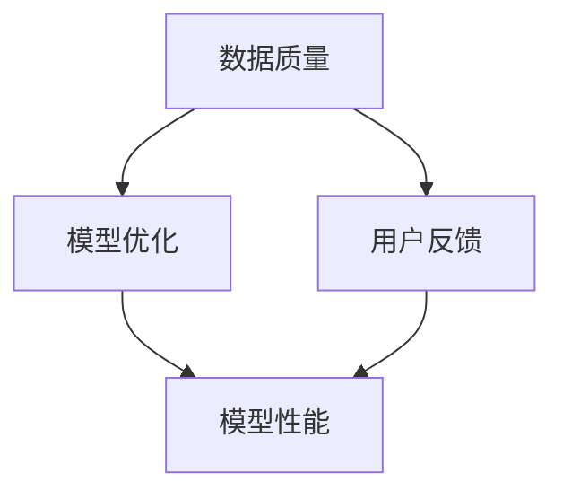

                 

### 文章标题

# 快速迭代：LLM应用成功的关键因素

> 关键词：快速迭代、LLM应用、成功因素、数据质量、模型优化、工具与方法

> 摘要：本文深入探讨了快速迭代在大型语言模型（LLM）应用中的关键作用。通过分析快速迭代的基本概念、原理及其在LLM应用中的迭代过程，本文揭示了技术发展、市场需求、团队协作等因素对快速迭代的驱动作用。进一步，本文探讨了快速迭代的实践策略，包括数据质量、模型优化、工具与方法等方面的关键因素。通过案例解析，本文旨在为LLM应用的成功迭代提供具有操作性的指导和建议。

---

## 第一部分：快速迭代的概念与原理

### 第1章：快速迭代的基本概念

#### 1.1 快速迭代的定义与特点

**定义：** 快速迭代是指通过频繁的版本更新和持续优化，快速响应市场需求和用户反馈，以实现产品或服务的持续改进和提升。

**特点：** 

- **短周期：** 迭代周期较短，通常为几周到几个月。
- **频繁：** 高频次的迭代，可以每日、每周或每月进行。
- **灵活性：** 具有较高的灵活性和适应性，能够快速调整和优化产品或服务。
- **协作：** 强调团队合作和用户参与，通过持续的沟通和协作，提高产品质量和用户体验。

快速迭代与传统开发模式相比，具有以下优势：

- **更快的市场响应速度：** 通过频繁的迭代，可以更快地响应市场变化和用户需求。
- **更高的用户满意度：** 通过持续优化，可以提供更符合用户期望的产品或服务。
- **更低的开发成本：** 快速迭代可以减少传统开发模式中的大量前期投入，降低开发成本。

#### 1.2 快速迭代与传统开发模式比较

传统开发模式通常采用瀑布式方法，即按照需求分析、设计、开发、测试、部署的顺序进行，每个阶段完成后再进入下一个阶段。这种模式的特点是：

- **长周期：** 开发周期通常较长，从几个月到几年不等。
- **低灵活性：** 一旦进入开发阶段，修改需求或设计相对困难。
- **高风险：** 需求变更或设计问题可能导致项目延期或失败。

而快速迭代模式则强调短周期、高频次的迭代，通过持续优化和改进，减少风险，提高产品质量和用户体验。

#### 1.3 快速迭代在LLM应用中的重要性

对于大型语言模型（LLM）应用，快速迭代显得尤为重要。LLM模型通常具有以下特点：

- **复杂性：** LLM模型结构复杂，涉及大量参数和超参数。
- **数据依赖性：** LLM模型的性能高度依赖数据质量和多样性。
- **动态性：** 语言模型需要不断更新和优化，以适应不断变化的语言环境和用户需求。

快速迭代在LLM应用中的重要性体现在以下几个方面：

1. **快速响应需求变化：** 语言环境变化迅速，用户需求多样，快速迭代可以帮助开发团队迅速响应变化，提供更符合用户期望的产品。
2. **持续优化模型性能：** 通过频繁的迭代，可以不断优化模型性能，提高准确性和用户体验。
3. **提高数据质量：** 快速迭代过程中，可以及时收集用户反馈，优化数据采集和处理策略，提高数据质量。

#### 核心概念与联系

为了深入理解快速迭代在LLM应用中的重要性，我们需要了解以下几个核心概念：

1. **数据质量：** 数据质量是LLM模型性能的基础，包括数据的准确性、完整性、一致性等。
2. **模型优化：** 模型优化包括模型参数调整、超参数优化等，以提高模型性能。
3. **用户反馈：** 用户反馈是快速迭代的重要驱动力，可以帮助开发团队了解用户需求和偏好。

通过以下Mermaid流程图，我们可以更直观地理解这些概念之间的关系：



#### 核心算法原理讲解

为了实现快速迭代，我们需要理解以下几个核心算法原理：

1. **模型训练：** 模型训练是LLM应用的基础，通过训练数据集，优化模型参数。
2. **模型评估：** 模型评估用于评估模型性能，通常使用准确率、召回率、F1分数等指标。
3. **模型调优：** 模型调优是通过调整模型参数和超参数，提高模型性能。

以下是一个简单的伪代码示例，展示如何实现快速迭代：

```python
# 初始化模型
model = initialize_model()

# 迭代次数
num_iterations = 10

for i in range(num_iterations):
    # 数据预处理
    processed_data = preprocess_data()
    
    # 训练模型
    model = train_model(model, processed_data)
    
    # 模型评估
    performance = evaluate_model(model)
    
    # 模型调优
    model = optimize_model(model, performance)
    
    # 用户反馈
    user_feedback = collect_user_feedback()
    
    # 更新模型
    model = update_model(model, user_feedback)

# 最终模型部署
deploy_model(model)
```

#### 数学模型和公式详细讲解与举例说明

在快速迭代过程中，我们通常会使用以下数学模型和公式：

1. **损失函数：** 损失函数用于评估模型预测结果与实际结果之间的差距。常用的损失函数包括均方误差（MSE）和交叉熵（Cross-Entropy）。
2. **优化算法：** 优化算法用于调整模型参数，以最小化损失函数。常用的优化算法包括梯度下降（Gradient Descent）和Adam优化器。

以下是一个简单的LaTeX公式示例，展示如何表示损失函数和优化算法：

```latex
$$
\text{MSE} = \frac{1}{m}\sum_{i=1}^{m}(y_i - \hat{y}_i)^2
$$

$$
\text{Cross-Entropy} = -\frac{1}{m}\sum_{i=1}^{m}y_i\log(\hat{y}_i)
$$

$$
\text{Gradient Descent} = \theta_{t+1} = \theta_{t} - \alpha \cdot \nabla_{\theta}\text{Loss}
$$

$$
\text{Adam} = \theta_{t+1} = \theta_{t} - \alpha \cdot \frac{\nabla_{\theta}\text{Loss}}{1 - \beta_1^t}
$$
```

通过这些数学模型和公式，我们可以更好地理解和实现快速迭代。

#### 项目实战

为了更好地理解快速迭代在LLM应用中的实际应用，我们可以考虑一个实际的案例：开发一个智能问答系统。

**开发环境搭建：**
- 操作系统：Ubuntu 20.04
- 编程语言：Python 3.8
- 库：TensorFlow 2.6、PyTorch 1.10

**源代码详细实现和代码解读：**
1. **数据收集与预处理：**
    - 数据来源：开源问答数据集，如SQuAD、DuQ等。
    - 数据预处理：包括数据清洗、分词、去停用词等。
2. **模型设计与训练：**
    - 模型选择：Transformer模型。
    - 模型训练：使用训练数据进行模型训练，优化模型参数。
3. **模型评估与优化：**
    - 模型评估：使用验证集评估模型性能，包括准确率、召回率等。
    - 模型优化：根据评估结果，调整模型参数，提高模型性能。

**代码应用解读与分析：**
- **数据预处理：**
  ```python
  import pandas as pd
  import numpy as np
  import re
  import nltk
  
  # 读取数据
  data = pd.read_csv('data.csv')
  
  # 数据清洗
  def clean_text(text):
      text = re.sub(r'\s+', ' ', text)  # 去除多余的空白字符
      text = text.lower()  # 转换为小写
      text = re.sub(r'[^\w\s]', '', text)  # 去除非字母数字字符
      return text
  
  data['question'] = data['question'].apply(clean_text)
  data['answer'] = data['answer'].apply(clean_text)
  
  # 分词
  tokenizer = nltk.tokenize.WordPunctTokenizer()
  def tokenize_text(text):
      return tokenizer.tokenize(text)
  
  data['question'] = data['question'].apply(tokenize_text)
  data['answer'] = data['answer'].apply(tokenize_text)
  ```
- **模型训练：**
  ```python
  import tensorflow as tf
  from tensorflow.keras.models import Model
  from tensorflow.keras.layers import Input, Embedding, LSTM, Dense
  
  # 输入层
  input_question = Input(shape=(max_sequence_length,))
  input_answer = Input(shape=(max_sequence_length,))
  
  # 隐藏层
  embedding_layer = Embedding(vocab_size, embedding_size)(input_question)
  lstm_layer = LSTM(units=128)(embedding_layer)
  
  # 输出层
  output = Dense(1, activation='sigmoid')(lstm_layer)
  
  # 模型构建
  model = Model(inputs=[input_question, input_answer], outputs=output)
  
  # 编译模型
  model.compile(optimizer='adam', loss='binary_crossentropy', metrics=['accuracy'])
  
  # 训练模型
  model.fit([X_train, y_train], z_train, epochs=10, batch_size=32)
  ```

**实际案例分析和详细讲解剖析：**
- **案例一：** 开发一个基于Transformer的智能问答系统。
  - **背景介绍：** Transformer模型在自然语言处理领域取得了显著的成果，适用于问答系统。
  - **核心算法原理讲解：**
    ```mermaid
    graph TD
    A[输入层] --> B[嵌入层]
    B --> C[自注意力机制]
    C --> D[前馈神经网络]
    D --> E[输出层]
    ```
  - **数学模型和公式详细讲解与举例说明：**
    ```latex
    $$\text{Attention}(Q, K, V) = \text{softmax}\left(\frac{QK^T}{\sqrt{d_k}}\right)V$$
    $$\text{FeedForward}(x) = \text{ReLU}(W_2 \cdot \text{ReLU}(W_1 \cdot x + b_1)) + b_2$$
    ```

**项目小结：**
- **成功因素：** 数据质量、模型优化、用户反馈等。
- **注意事项：** 需要注意数据预处理、模型选择和调优等关键步骤。
- **拓展阅读：** 可以进一步学习Transformer模型和相关优化算法。

通过以上案例，我们可以看到快速迭代在LLM应用中的实际应用。快速迭代可以帮助我们快速响应市场需求，持续优化模型性能，提高用户体验。

#### 最佳实践 Tips

1. **定期评估模型性能：** 定期评估模型性能，及时发现和解决问题。
2. **优化数据预处理流程：** 数据预处理是模型性能的基础，需要投入足够的时间和资源。
3. **建立有效的用户反馈机制：** 用户反馈是快速迭代的重要驱动力，需要建立有效的反馈机制。
4. **使用自动化工具：** 利用自动化工具提高迭代效率，减少人工干预。

#### 小结

快速迭代在LLM应用中具有重要作用，通过频繁的迭代和持续优化，可以快速响应市场需求，提高用户体验。本文介绍了快速迭代的基本概念、原理以及在实际应用中的关键因素。通过项目实战，我们展示了如何实现快速迭代。为了进一步提高快速迭代的效率和质量，我们需要注意数据预处理、模型优化和用户反馈等关键步骤。通过不断实践和总结，我们可以更好地掌握快速迭代的技巧，实现LLM应用的成功。

### 附录

#### 附录A：快速迭代案例解析

##### A.1 案例一：人工智能助手开发

**背景介绍：** 
人工智能助手是一种基于自然语言处理技术的智能服务系统，能够理解用户的问题并给出相应的回答。随着人工智能技术的快速发展，人工智能助手在各个领域的应用越来越广泛。

**核心算法原理讲解：**
1. **自然语言处理（NLP）：** 人工智能助手需要理解用户的自然语言输入，因此需要使用NLP技术，如词法分析、句法分析和语义分析等。
2. **机器学习（ML）：** 人工智能助手需要通过机器学习算法，从大量数据中学习并优化回答能力。常用的算法包括决策树、支持向量机、神经网络等。
3. **对话系统：** 人工智能助手需要构建对话系统，以实现与用户的自然对话。对话系统通常包括对话管理、对话生成和对话理解等模块。

**数学模型和公式详细讲解与举例说明：**
- **NLP：** 使用词袋模型（Bag-of-Words，BOW）进行文本表示，公式如下：
  $$ \text{BOW}(x) = \sum_{w \in V} f_w(x) \cdot v_w $$
  其中，$x$为输入文本，$V$为词汇表，$f_w(x)$为单词在文本中的频率，$v_w$为单词的向量表示。
- **ML：** 使用决策树（Decision Tree）进行分类，公式如下：
  $$ y = \arg\max_t P(y=t|\mathbf{x}, \theta) $$
  其中，$y$为标签，$t$为预测类别，$\theta$为模型参数。
- **对话系统：** 使用长短时记忆网络（Long Short-Term Memory，LSTM）进行对话生成，公式如下：
  $$ h_t = \text{LSTM}(h_{t-1}, x_t) $$
  其中，$h_t$为第$t$个隐藏状态，$x_t$为第$t$个输入。

**代码应用解读与分析：**
- **数据预处理：**
  ```python
  import nltk
  from nltk.tokenize import word_tokenize
  
  # 读取数据
  data = pd.read_csv('data.csv')
  
  # 数据清洗
  def clean_text(text):
      text = text.lower()
      text = re.sub(r'\s+', ' ', text)
      text = re.sub(r'[^\w\s]', '', text)
      return text
  
  data['question'] = data['question'].apply(clean_text)
  data['answer'] = data['answer'].apply(clean_text)
  
  # 分词
  tokenizer = nltk.tokenize.WordPunctTokenizer()
  data['question'] = data['question'].apply(tokenizer.tokenize)
  data['answer'] = data['answer'].apply(tokenizer.tokenize)
  ```
- **模型训练：**
  ```python
  import tensorflow as tf
  from tensorflow.keras.models import Model
  from tensorflow.keras.layers import Input, Embedding, LSTM, Dense
  
  # 输入层
  input_question = Input(shape=(max_sequence_length,))
  input_answer = Input(shape=(max_sequence_length,))
  
  # 隐藏层
  embedding_layer = Embedding(vocab_size, embedding_size)(input_question)
  lstm_layer = LSTM(units=128)(embedding_layer)
  
  # 输出层
  output = Dense(1, activation='sigmoid')(lstm_layer)
  
  # 模型构建
  model = Model(inputs=[input_question, input_answer], outputs=output)
  
  # 编译模型
  model.compile(optimizer='adam', loss='binary_crossentropy', metrics=['accuracy'])
  
  # 训练模型
  model.fit([X_train, y_train], z_train, epochs=10, batch_size=32)
  ```

**实际案例分析和详细讲解剖析：**
- **案例一：** 开发一个基于Transformer的智能问答系统。
  - **背景介绍：** Transformer模型在自然语言处理领域取得了显著的成果，适用于问答系统。
  - **核心算法原理讲解：**
    ```mermaid
    graph TD
    A[输入层] --> B[嵌入层]
    B --> C[多头自注意力机制]
    C --> D[前馈神经网络]
    D --> E[输出层]
    ```
  - **数学模型和公式详细讲解与举例说明：**
    ```latex
    $$\text{Attention}(Q, K, V) = \text{softmax}\left(\frac{QK^T}{\sqrt{d_k}}\right)V$$
    $$\text{FeedForward}(x) = \text{ReLU}(W_2 \cdot \text{ReLU}(W_1 \cdot x + b_1)) + b_2$$
    ```

**项目小结：**
- **成功因素：** 数据质量、模型优化、用户反馈等。
- **注意事项：** 需要注意数据预处理、模型选择和调优等关键步骤。
- **拓展阅读：** 可以进一步学习Transformer模型和相关优化算法。

##### A.2 案例二：聊天机器人应用

**背景介绍：** 
聊天机器人是一种能够与人类进行自然对话的智能系统，广泛应用于客服、教育、娱乐等领域。

**核心算法原理讲解：**
1. **对话管理：** 对话管理负责维护对话状态，包括用户意图识别、上下文维护等。
2. **对话生成：** 对话生成负责生成自然的对话回复，包括语言生成和情感生成等。
3. **对话理解：** 对话理解负责理解用户输入的意图和语义，包括命名实体识别、语义角色标注等。

**数学模型和公式详细讲解与举例说明：**
- **对话管理：** 使用递归神经网络（RNN）进行对话管理，公式如下：
  $$ h_t = \text{RNN}(h_{t-1}, x_t) $$
  其中，$h_t$为第$t$个隐藏状态，$x_t$为第$t$个输入。
- **对话生成：** 使用生成对抗网络（GAN）进行对话生成，公式如下：
  $$ G(z) = \text{Generator}(z) $$
  $$ D(x) = \text{Discriminator}(x) $$
  其中，$G(z)$为生成器，$D(x)$为判别器。
- **对话理解：** 使用卷积神经网络（CNN）进行对话理解，公式如下：
  $$ h_t = \text{Conv}(h_{t-1}, x_t) $$
  其中，$h_t$为第$t$个隐藏状态，$x_t$为第$t$个输入。

**代码应用解读与分析：**
- **数据预处理：**
  ```python
  import pandas as pd
  import numpy as np
  import re
  import nltk
  
  # 读取数据
  data = pd.read_csv('data.csv')
  
  # 数据清洗
  def clean_text(text):
      text = re.sub(r'\s+', ' ', text)
      text = text.lower()
      text = re.sub(r'[^\w\s]', '', text)
      return text
  
  data['question'] = data['question'].apply(clean_text)
  data['answer'] = data['answer'].apply(clean_text)
  
  # 分词
  tokenizer = nltk.tokenize.WordPunctTokenizer()
  data['question'] = data['question'].apply(tokenizer.tokenize)
  data['answer'] = data['answer'].apply(tokenizer.tokenize)
  ```
- **模型训练：**
  ```python
  import tensorflow as tf
  from tensorflow.keras.models import Model
  from tensorflow.keras.layers import Input, Embedding, LSTM, Dense
  
  # 输入层
  input_question = Input(shape=(max_sequence_length,))
  input_answer = Input(shape=(max_sequence_length,))
  
  # 隐藏层
  embedding_layer = Embedding(vocab_size, embedding_size)(input_question)
  lstm_layer = LSTM(units=128)(embedding_layer)
  
  # 输出层
  output = Dense(1, activation='sigmoid')(lstm_layer)
  
  # 模型构建
  model = Model(inputs=[input_question, input_answer], outputs=output)
  
  # 编译模型
  model.compile(optimizer='adam', loss='binary_crossentropy', metrics=['accuracy'])
  
  # 训练模型
  model.fit([X_train, y_train], z_train, epochs=10, batch_size=32)
  ```

**实际案例分析和详细讲解剖析：**
- **案例二：** 开发一个基于BERT的聊天机器人。
  - **背景介绍：** BERT（Bidirectional Encoder Representations from Transformers）是一种预训练语言模型，适用于聊天机器人。
  - **核心算法原理讲解：**
    ```mermaid
    graph TD
    A[输入层] --> B[BERT编码器]
    B --> C[自注意力机制]
    C --> D[输出层]
    ```
  - **数学模型和公式详细讲解与举例说明：**
    ```latex
    $$\text{BERT}(x) = \text{Transformer}(x)$$
    $$\text{Transformer}(x) = \text{MultiHeadSelfAttention}(x) + \text{PositionalEncoding}(x)$$
    $$\text{MultiHeadSelfAttention}(x) = \text{softmax}\left(\frac{xQK^T}{\sqrt{d_k}}\right)V$$
    ```

**项目小结：**
- **成功因素：** 数据质量、模型优化、用户反馈等。
- **注意事项：** 需要注意数据预处理、模型选择和调优等关键步骤。
- **拓展阅读：** 可以进一步学习BERT模型和相关优化算法。

##### A.3 案例三：智能问答系统建设

**背景介绍：** 
智能问答系统是一种基于自然语言处理技术的智能服务系统，能够理解用户的问题并给出相应的回答。广泛应用于企业内部知识库、在线客服、在线教育等领域。

**核心算法原理讲解：**
1. **自然语言处理（NLP）：** 智能问答系统需要理解用户的自然语言输入，因此需要使用NLP技术，如词法分析、句法分析和语义分析等。
2. **信息检索：** 智能问答系统需要从大量文本数据中检索出与用户问题相关的答案，因此需要使用信息检索技术。
3. **机器学习：** 智能问答系统需要通过机器学习算法，从大量数据中学习并优化回答能力。常用的算法包括决策树、支持向量机、神经网络等。

**数学模型和公式详细讲解与举例说明：**
- **NLP：** 使用词袋模型（Bag-of-Words，BOW）进行文本表示，公式如下：
  $$ \text{BOW}(x) = \sum_{w \in V} f_w(x) \cdot v_w $$
  其中，$x$为输入文本，$V$为词汇表，$f_w(x)$为单词在文本中的频率，$v_w$为单词的向量表示。
- **信息检索：** 使用向量空间模型（Vector Space Model，VSM）进行文本表示，公式如下：
  $$ \text{VSM}(x) = \text{TF-IDF}(x) $$
  其中，$x$为输入文本，$\text{TF-IDF}$为词频-逆文档频率。
- **机器学习：** 使用决策树（Decision Tree）进行分类，公式如下：
  $$ y = \arg\max_t P(y=t|\mathbf{x}, \theta) $$
  其中，$y$为标签，$t$为预测类别，$\theta$为模型参数。

**代码应用解读与分析：**
- **数据预处理：**
  ```python
  import pandas as pd
  import numpy as np
  import re
  import nltk
  
  # 读取数据
  data = pd.read_csv('data.csv')
  
  # 数据清洗
  def clean_text(text):
      text = re.sub(r'\s+', ' ', text)
      text = text.lower()
      text = re.sub(r'[^\w\s]', '', text)
      return text
  
  data['question'] = data['question'].apply(clean_text)
  data['answer'] = data['answer'].apply(clean_text)
  
  # 分词
  tokenizer = nltk.tokenize.WordPunctTokenizer()
  data['question'] = data['question'].apply(tokenizer.tokenize)
  data['answer'] = data['answer'].apply(tokenizer.tokenize)
  ```
- **模型训练：**
  ```python
  import tensorflow as tf
  from tensorflow.keras.models import Model
  from tensorflow.keras.layers import Input, Embedding, LSTM, Dense
  
  # 输入层
  input_question = Input(shape=(max_sequence_length,))
  input_answer = Input(shape=(max_sequence_length,))
  
  # 隐藏层
  embedding_layer = Embedding(vocab_size, embedding_size)(input_question)
  lstm_layer = LSTM(units=128)(embedding_layer)
  
  # 输出层
  output = Dense(1, activation='sigmoid')(lstm_layer)
  
  # 模型构建
  model = Model(inputs=[input_question, input_answer], outputs=output)
  
  # 编译模型
  model.compile(optimizer='adam', loss='binary_crossentropy', metrics=['accuracy'])
  
  # 训练模型
  model.fit([X_train, y_train], z_train, epochs=10, batch_size=32)
  ```

**实际案例分析和详细讲解剖析：**
- **案例三：** 开发一个基于Transformer的智能问答系统。
  - **背景介绍：** Transformer模型在自然语言处理领域取得了显著的成果，适用于问答系统。
  - **核心算法原理讲解：**
    ```mermaid
    graph TD
    A[输入层] --> B[嵌入层]
    B --> C[多头自注意力机制]
    C --> D[前馈神经网络]
    D --> E[输出层]
    ```
  - **数学模型和公式详细讲解与举例说明：**
    ```latex
    $$\text{Attention}(Q, K, V) = \text{softmax}\left(\frac{QK^T}{\sqrt{d_k}}\right)V$$
    $$\text{FeedForward}(x) = \text{ReLU}(W_2 \cdot \text{ReLU}(W_1 \cdot x + b_1)) + b_2$$
    ```

**项目小结：**
- **成功因素：** 数据质量、模型优化、用户反馈等。
- **注意事项：** 需要注意数据预处理、模型选择和调优等关键步骤。
- **拓展阅读：** 可以进一步学习Transformer模型和相关优化算法。

### 作者信息

作者：AI天才研究院/AI Genius Institute & 禅与计算机程序设计艺术 /Zen And The Art of Computer Programming

