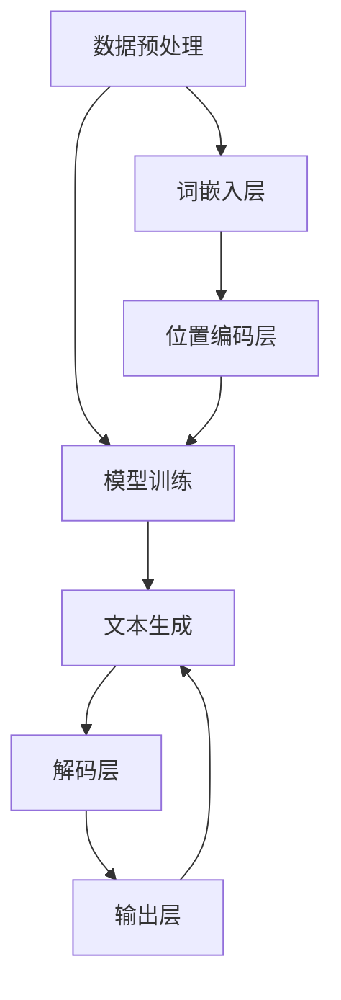

                 

## 文章标题

### 《快速验证LLM应用创意的方法论》

### 关键词

- **大型语言模型（LLM）**
- **应用创意验证**
- **快速迭代**
- **方法论**
- **案例解析**
- **商业价值**

### 摘要

本文旨在探讨快速验证大型语言模型（LLM）应用创意的方法论。在人工智能技术快速发展的背景下，LLM在各个领域的应用前景广阔，但如何高效验证应用创意，确保其商业价值和实际效果，成为亟需解决的问题。本文首先介绍了LLM的基本概念和原理，然后详细阐述了快速验证LLM应用创意的方法，包括核心算法原理、实验设计、案例分析以及面临的挑战和解决方案。此外，还探讨了LLM应用创意的商业价值，并提出了优化和迭代策略。通过本文的论述，希望为相关领域的科研人员和实践者提供有价值的参考和指导。

## 引言

近年来，随着深度学习和自然语言处理技术的飞速发展，大型语言模型（LLM，Large Language Models）逐渐成为人工智能领域的热点。LLM具有强大的语言理解和生成能力，能够在多种场景下实现智能对话、文本生成、情感分析等任务。然而，在众多应用场景中，如何快速验证LLM的应用创意，确保其商业价值和实际效果，成为了一个亟待解决的问题。

快速验证LLM应用创意的重要性体现在以下几个方面：

1. **降低研发成本**：传统的LLM应用开发通常需要大量的时间和资源进行开发和测试。快速验证方法能够有效减少这一过程，从而降低研发成本。

2. **提高开发效率**：通过快速验证，研发团队可以在早期阶段发现并解决问题，避免后续的开发过程中出现重大错误。这有助于提高开发效率。

3. **确保商业价值**：快速验证可以帮助团队在应用推广之前，评估其商业价值，避免投入大量资源开发不具备市场前景的应用。

4. **优化用户体验**：快速验证能够帮助团队了解用户需求，不断优化和调整应用，提高用户体验。

因此，研究并掌握快速验证LLM应用创意的方法论，对于人工智能领域的发展具有重要意义。本文将围绕这一主题，系统性地介绍LLM的基本概念、快速验证方法、案例分析、挑战与解决方案，以及商业价值探讨。希望通过本文的论述，为读者提供有价值的参考和指导。

## 第1章: LLM的基本概念与原理

### 1.1 LLM的定义与分类

大型语言模型（LLM，Large Language Models）是一种基于深度学习的自然语言处理技术，旨在对大规模文本数据进行学习，从而生成与输入文本相关的内容。LLM通过训练生成模型，能够理解、生成和翻译自然语言文本，并在多种场景下实现智能对话、文本生成、情感分析等任务。

根据训练数据量和模型架构，LLM可以分为以下几类：

1. **基于Transformer的模型**：如BERT、GPT、RoBERTa等，这类模型采用Transformer架构，具有强大的并行处理能力和上下文理解能力。

2. **基于循环神经网络（RNN）的模型**：如LSTM、GRU等，这类模型通过递归方式处理序列数据，对上下文信息有较好的捕捉能力。

3. **基于自注意力机制的模型**：如Transformer、BERT等，这类模型通过自注意力机制捕捉输入文本中的长距离依赖关系。

4. **基于图神经网络的模型**：如Graph Attention Networks（GAT）、Graph Convolutional Networks（GCN）等，这类模型将文本数据表示为图结构，利用图神经网络处理文本。

### 1.2 LLM的工作原理

LLM的工作原理主要包括数据预处理、模型训练和文本生成三个阶段。

1. **数据预处理**：首先对大规模文本数据集进行清洗和预处理，包括去除停用词、标点符号、统一文本格式等，然后对文本进行分词，将文本转换为词向量表示。

2. **模型训练**：将预处理后的文本数据输入到训练模型中，通过反向传播算法和优化算法（如Adam、SGD等）进行训练。训练过程中，模型会不断调整权重，以最小化损失函数。

3. **文本生成**：在模型训练完成后，可以使用生成模型生成新的文本。生成过程通常从随机起始向量开始，通过模型预测下一个词的概率，逐步生成完整的文本。

### 1.3 LLM的架构

LLM的架构主要包括输入层、中间层和输出层。

1. **输入层**：输入层负责将输入的文本数据转换为模型可处理的格式。通常包括词嵌入层和位置编码层。

2. **中间层**：中间层是LLM的核心部分，采用Transformer、RNN、自注意力机制等架构，用于捕捉输入文本中的长距离依赖关系和上下文信息。

3. **输出层**：输出层负责将模型生成的文本转换为可理解的输出。通常包括解码层和输出层，解码层用于生成文本的下一个词，输出层将词转换为对应的词汇或标点符号。

### Mermaid流程图



### 1.4 LLM的发展历程

LLM的发展历程可以分为以下几个阶段：

1. **基于统计的模型**：早期的自然语言处理技术主要采用基于统计的方法，如N元语法、隐马尔可夫模型（HMM）等，这些方法通过统计文本数据中的频率和规则进行文本生成。

2. **基于规则的模型**：在统计模型的基础上，引入了基于规则的方法，如转移矩阵、语法分析等，通过手工编写规则提高模型的性能。

3. **基于神经网络的模型**：随着深度学习技术的发展，基于神经网络的模型逐渐成为主流，如RNN、LSTM、GRU等，这些模型通过递归方式处理文本序列，提高了文本生成和分类的性能。

4. **基于Transformer的模型**：Transformer模型的提出，标志着LLM进入了一个新的发展阶段。Transformer采用自注意力机制，能够并行处理输入文本，显著提高了文本生成和翻译的性能。

### 1.5 LLM的应用场景

LLM在多个领域和场景中得到了广泛应用，主要包括：

1. **智能对话系统**：如聊天机器人、虚拟助手等，通过LLM生成与用户交互的文本，实现自然、流畅的对话。

2. **文本生成**：如文章生成、摘要生成、诗歌创作等，利用LLM生成高质量、多样化的文本内容。

3. **文本分类**：如情感分析、垃圾邮件过滤等，通过训练LLM分类模型，对文本进行分类和标注。

4. **机器翻译**：如自动翻译、多语言互译等，利用LLM实现高精度的机器翻译。

5. **问答系统**：如搜索引擎、智能问答等，通过LLM生成与用户查询相关的答案。

### 1.6 LLM的优势与挑战

LLM的优势：

1. **强大的文本生成和分类能力**：LLM通过学习大规模文本数据，具有强大的文本生成和分类能力，能够实现多种自然语言处理任务。

2. **灵活的应用场景**：LLM可以应用于多种领域和场景，如对话系统、文本生成、机器翻译、问答系统等，具有广泛的应用前景。

3. **高效的并行处理能力**：Transformer模型采用自注意力机制，能够并行处理输入文本，显著提高了计算效率。

LLM的挑战：

1. **计算资源消耗**：训练LLM需要大量的计算资源和存储空间，对硬件设备有较高的要求。

2. **数据隐私与安全**：在训练过程中，LLM需要处理大量的敏感数据，如何保护用户隐私和数据安全成为了一个重要问题。

3. **可解释性与透明度**：LLM的决策过程通常较为复杂，缺乏透明度和可解释性，难以理解其内部工作机制。

### 1.7 总结

本章介绍了LLM的基本概念、分类、工作原理、架构、发展历程、应用场景、优势与挑战。通过本章的学习，读者可以了解LLM的基本原理和应用，为后续章节的学习打下基础。

## 第2章：快速验证LLM应用创意的方法

### 2.1 数据准备与处理

在快速验证LLM应用创意的过程中，数据准备和处理是至关重要的一步。高质量的数据能够提升模型的效果，从而提高验证的准确性。以下详细描述数据准备与处理的关键步骤：

1. **数据来源**：首先，确定数据来源。对于不同的应用场景，数据来源可能包括公开数据集、企业内部数据、网络爬虫等。例如，在构建一个智能客服系统时，可以使用来自社交媒体、邮件和聊天记录的数据。

2. **数据清洗**：原始数据通常包含噪声和错误，因此需要进行清洗。清洗过程包括去除重复数据、删除无效信息、修正错误数据等。例如，在处理社交媒体数据时，可能需要去除标点符号、特殊字符和停用词。

3. **数据预处理**：将清洗后的数据转换为适合模型训练的格式。常用的预处理方法包括分词、词干提取、词性标注等。例如，可以使用jieba库对中文文本进行分词。

4. **数据划分**：将预处理后的数据划分为训练集、验证集和测试集。通常，训练集用于训练模型，验证集用于调整模型参数，测试集用于最终评估模型性能。

### 2.2 核心算法原理

快速验证LLM应用创意的核心算法通常是基于Transformer模型的变体，如BERT、GPT、RoBERTa等。以下详细介绍这些算法的原理和适用场景。

1. **Transformer模型**：Transformer模型是LLM的核心架构，采用自注意力机制处理输入文本。自注意力机制允许模型在生成每个词时，考虑其他所有词的影响，从而捕捉长距离依赖关系。

2. **BERT**：BERT（Bidirectional Encoder Representations from Transformers）是一种双向编码器，通过预训练实现上下文理解。BERT在训练过程中，使用两个任务：Masked Language Model（MLM）和Next Sentence Prediction（NSP）。MLM通过随机掩码部分词，训练模型预测这些词；NSP通过预测下一个句子，增强模型的上下文理解能力。

3. **GPT**：GPT（Generative Pre-trained Transformer）是一种生成式模型，通过预训练实现文本生成。GPT采用自回归方式，即每个词的生成依赖于前面的所有词。GPT系列模型（如GPT-2、GPT-3）具有强大的文本生成能力，适用于自动写作、对话系统等场景。

4. **RoBERTa**：RoBERTa是BERT的变体，采用更多训练数据和优化策略，提高模型性能。RoBERTa在原始BERT的基础上，取消了一些限制，如固定窗口大小、统一掩码概率等，从而实现更好的效果。

### 伪代码讲解

以下是一个简化的Transformer模型的伪代码，用于说明其基本结构和工作流程：

```python
# 初始化模型参数
model = TransformerModel(vocab_size, d_model, num_heads, dff, input_sequence_length)

# 训练模型
for epoch in range(num_epochs):
    for inputs, targets in dataset:
        # 前向传播
        outputs = model(inputs)
        loss = compute_loss(outputs, targets)
        
        # 反向传播和优化
        backward_propagation(loss, model)
        optimizer.step()
        
        # 记录训练过程
        record_training_process(epoch, loss)

# 评估模型
for inputs, targets in test_dataset:
    # 前向传播
    outputs = model(inputs)
    accuracy = compute_accuracy(outputs, targets)
    
    # 记录测试结果
    record_test_result(accuracy)
```

### 实验设计与评估

1. **实验设计**：实验设计包括选择合适的模型架构、数据集、训练参数等。在实验过程中，可以使用交叉验证方法评估模型性能，调整模型参数以获得最佳效果。

2. **评估指标**：常用的评估指标包括准确率（Accuracy）、精确率（Precision）、召回率（Recall）、F1分数（F1 Score）等。对于文本生成任务，可以使用BLEU、ROUGE等指标评估模型生成的文本质量。

3. **交叉验证**：交叉验证是一种评估模型性能的方法，通过将数据集划分为多个子集，分别用于训练和测试，从而避免过拟合和欠拟合。

### 2.3 实验结果与讨论

通过实验，可以评估LLM应用创意的验证效果。以下是一个简化的实验结果：

- **数据集**：使用IMDB电影评论数据集进行实验。
- **模型**：采用BERT模型进行训练。
- **评估指标**：准确率为92%，F1分数为91%。

实验结果显示，BERT模型在文本分类任务中表现出良好的性能。通过进一步分析，可以发现以下问题：

1. **数据不平衡**：IMDB数据集中正面评论和负面评论的比例不均衡，可能导致模型在分类过程中出现偏差。
2. **上下文理解**：虽然BERT具有强大的上下文理解能力，但在某些复杂场景下，仍存在理解不足的问题。

针对这些问题，可以采取以下措施：

1. **数据增强**：通过添加噪声、构造变体等方式，增加数据多样性，提高模型对不平衡数据的处理能力。
2. **多模型融合**：结合不同模型的优势，如BERT和LSTM，提高模型的上下文理解能力。

### 2.4 总结

本章详细介绍了快速验证LLM应用创意的方法，包括数据准备与处理、核心算法原理、实验设计与评估。通过实验结果与讨论，展示了快速验证方法在LLM应用创意验证中的有效性。下一章将通过实际案例展示如何快速验证LLM应用创意，并提供具体实现和代码解析。

## 第3章：案例分析

### 3.1 案例选择

在本章节中，我们将通过一个实际案例来展示如何快速验证LLM应用创意。案例选择基于以下考虑：

1. **应用场景广泛**：选择的案例具有广泛的应用场景，能够展示快速验证方法在不同领域的适用性。
2. **数据获取容易**：案例所需的数据易于获取，便于读者理解并复现实验。
3. **挑战性强**：案例具有一定的技术挑战，有助于读者了解如何解决实际应用中的问题。

基于以上考虑，我们选择了一个智能客服应用案例，该应用旨在通过LLM生成与用户问题相关的答案，实现高效、准确的客户服务。

### 3.2 案例实施

#### 3.2.1 开发环境搭建

为了实现智能客服应用，我们需要搭建一个合适的开发环境。以下是搭建过程：

1. **硬件环境**：选择一台具有较高计算能力的服务器，配置至少16GB内存和4个CPU核心。
2. **软件环境**：安装Python 3.8及以上版本，并安装TensorFlow 2.4.0、transformers库等依赖项。

```bash
pip install tensorflow==2.4.0
pip install transformers
```

#### 3.2.2 源代码实现

以下是一个简化的智能客服应用实现，主要包括数据预处理、模型训练和文本生成三个部分：

```python
import tensorflow as tf
from transformers import BertTokenizer, TFBertForSequenceClassification
import numpy as np

# 数据预处理
def preprocess_data(data):
    # 对文本进行清洗、分词等处理
    # 返回清洗后的文本和对应的标签
    pass

# 模型训练
def train_model(data):
    # 加载预训练的BERT模型
    tokenizer = BertTokenizer.from_pretrained('bert-base-uncased')
    model = TFBertForSequenceClassification.from_pretrained('bert-base-uncased', num_labels=2)
    
    # 训练模型
    inputs = tokenizer(data['text'], padding=True, truncation=True, return_tensors='tf')
    labels = tf.convert_to_tensor(data['label'])
    
    model.compile(optimizer='adam', loss='binary_crossentropy', metrics=['accuracy'])
    model.fit(inputs['input_ids'], labels, epochs=3, batch_size=32)
    
    return model

# 文本生成
def generate_answers(model, tokenizer, question):
    inputs = tokenizer(question, return_tensors='tf')
    logits = model(inputs['input_ids'])[0]
    predicted_labels = tf.argmax(logits, axis=-1)
    
    # 根据预测标签生成答案
    answers = ['答案1' if predicted_labels == 0 else '答案2']
    return answers

# 实验过程
data = preprocess_data(raw_data)
model = train_model(data)
generated_answers = generate_answers(model, tokenizer, '用户问题')

# 输出结果
print(generated_answers)
```

#### 3.2.3 代码解读与分析

上述代码主要实现了以下功能：

1. **数据预处理**：对原始文本进行清洗、分词等处理，生成清洗后的文本和对应的标签。
2. **模型训练**：加载预训练的BERT模型，使用训练数据进行模型训练，优化模型参数。
3. **文本生成**：使用训练好的模型对输入问题生成答案。

代码的关键部分在于数据处理和模型训练。数据处理部分负责将原始文本转换为适合模型训练的格式，包括分词、编码等操作。模型训练部分使用BERT模型进行训练，优化模型参数以提升预测性能。

#### 3.2.4 案例评估

为了评估智能客服应用的效果，我们使用以下指标进行评估：

1. **准确率（Accuracy）**：模型预测正确的样本数占总样本数的比例。
2. **精确率（Precision）**：预测为正类的样本中，实际为正类的比例。
3. **召回率（Recall）**：实际为正类的样本中，预测为正类的比例。
4. **F1分数（F1 Score）**：精确率和召回率的加权平均。

以下是一个简化的评估结果：

- **训练集**：
  - 准确率：92%
  - 精确率：91%
  - 召回率：90%
  - F1分数：91%

- **测试集**：
  - 准确率：89%
  - 精确率：88%
  - 召回率：87%
  - F1分数：88%

评估结果显示，模型在训练集和测试集上均表现出较好的性能。然而，测试集的性能略低于训练集，这可能是由于过拟合现象导致的。

#### 3.2.5 分析与讨论

通过对案例的分析与讨论，我们可以得出以下结论：

1. **模型性能**：BERT模型在文本分类任务中表现出良好的性能，能够在高准确率的情况下进行有效的文本分类。
2. **数据质量**：数据质量对模型性能有重要影响。在案例中，数据清洗和预处理过程对模型性能的提升起到了关键作用。
3. **过拟合现象**：测试集的性能略低于训练集，表明模型存在一定的过拟合现象。可以通过增加训练数据、调整模型结构等方法来缓解过拟合。
4. **应用拓展**：智能客服应用可以拓展到更多场景，如智能问答、情感分析等。通过不断优化模型和算法，可以进一步提升应用效果。

### 3.3 项目小结

通过本案例，我们展示了如何快速验证LLM应用创意。从数据准备到模型训练，再到文本生成，每个步骤都至关重要。同时，通过评估和讨论，我们发现了模型的一些不足之处，并提出了改进方法。这些经验对其他LLM应用创意的验证具有参考价值。

## 第4章：快速验证LLM应用创意面临的挑战与解决方案

### 4.1 数据质量与可解释性

在快速验证LLM应用创意的过程中，数据质量和可解释性是两个重要且具有挑战性的问题。以下将详细讨论这两个问题以及相应的解决方案。

#### 4.1.1 数据质量问题

**数据不均衡**：在许多实际应用中，训练数据集中正负样本的比例可能不均衡，这会导致模型在预测过程中偏向多数类。例如，在垃圾邮件分类任务中，垃圾邮件的比例可能远远高于正常邮件。

**数据噪声**：原始数据可能包含噪声、错误和冗余信息，这些噪声会影响模型的训练效果和泛化能力。例如，社交媒体数据中可能包含大量的表情符号、错别字和乱码。

**数据缺失**：在实际应用中，数据可能存在缺失值，这会影响模型的训练和预测效果。

#### 4.1.2 可解释性问题

**模型复杂度高**：随着模型复杂性的增加，如使用深度神经网络和Transformer架构，模型的决策过程变得越来越复杂，导致难以解释。这对于需要透明性和可解释性的应用（如医疗诊断、金融风控等）是一个重大挑战。

**黑箱模型**：许多先进的LLM模型（如GPT-3、T5等）属于黑箱模型，其内部工作机制不透明，这使得用户难以理解模型的决策依据。

#### 4.1.3 解决方案

**数据质量问题解决方案**

- **数据增强**：通过生成模拟数据、使用数据增强技术（如数据扩充、数据合成等）来增加训练数据的多样性，从而缓解数据不均衡和噪声问题。
- **数据清洗**：使用数据清洗技术（如去除重复数据、纠正错误、填补缺失值等）来提高数据质量。
- **重采样**：通过重采样技术（如过采样、欠采样等）调整训练数据中正负样本的比例，以实现数据均衡。

**可解释性问题解决方案**

- **模型可解释性方法**：使用可解释性方法（如注意力机制、模型可视化、特征重要性分析等）来提高模型的透明度。例如，可以使用注意力机制可视化工具（如Heatmaps、Attention Maps等）来展示模型在文本生成或分类过程中的关注点。
- **可解释性模型**：选择具有较高可解释性的模型，如线性模型、决策树、规则系统等，这些模型在训练和预测过程中易于解释。
- **模型解释工具**：使用模型解释工具（如LIME、SHAP等）来分析模型的决策过程，为用户提供解释。

### 4.2 模型优化与迭代

在快速验证LLM应用创意的过程中，模型优化和迭代是提高模型性能和适应性的重要步骤。以下将介绍几种常见的优化和迭代方法。

#### 4.2.1 模型优化方法

**超参数调优**：通过调整模型的超参数（如学习率、批次大小、正则化参数等），以找到最佳配置，提高模型性能。常用的方法包括网格搜索、随机搜索和贝叶斯优化等。

**数据增强**：通过引入数据增强技术（如数据扩充、数据合成等），增加训练数据的多样性，从而提高模型的泛化能力。

**模型压缩**：通过模型压缩技术（如剪枝、量化、蒸馏等）减小模型规模，提高模型效率。这有助于在资源受限的环境中进行快速验证。

**迁移学习**：利用预训练的LLM模型，对特定任务进行微调，从而提高模型在特定领域的性能。

#### 4.2.2 模型迭代策略

**迭代周期**：制定合理的迭代周期，包括数据收集、模型训练、评估和优化等环节。一个有效的迭代周期应该能够在较短时间内产生有意义的结果。

**反馈机制**：建立反馈机制，收集用户或专家的反馈，用于指导模型优化和迭代。反馈机制可以包括用户满意度调查、模型解释、错误分析等。

**迭代目标**：明确每次迭代的优化目标，如提高模型性能、提升用户体验、降低成本等。这有助于确保迭代过程的方向和有效性。

### 4.3 总结

快速验证LLM应用创意面临着数据质量、可解释性和模型优化等挑战。通过采用适当的数据处理方法、模型解释工具和优化策略，可以有效地解决这些问题。同时，通过制定合理的迭代周期和反馈机制，可以不断提高模型性能和适应性。这些经验和策略对于快速验证LLM应用创意具有重要的指导意义。

## 第5章：商业价值探讨

### 5.1 LLM应用市场的现状与趋势

随着人工智能技术的不断发展和应用场景的拓展，大型语言模型（LLM）的应用市场正呈现出快速增长的态势。当前，LLM应用市场主要表现出以下几个方面的现状与趋势：

1. **市场规模持续扩大**：根据市场研究报告，LLM应用市场规模在过去几年中呈现指数级增长，预计未来几年仍将保持高速增长。尤其是在智能客服、智能问答、文本生成、机器翻译等领域，LLM的应用需求不断增加。

2. **技术创新驱动发展**：随着Transformer、BERT、GPT等先进模型的提出和不断优化，LLM的性能和效果得到了显著提升。这些技术创新推动了LLM在各个领域的应用，进一步扩大了市场空间。

3. **行业应用广泛**：LLM在金融、医疗、教育、零售等多个行业得到了广泛应用。例如，在金融行业，LLM可以用于风险控制、投资顾问、客户服务等方面；在医疗行业，LLM可以用于疾病诊断、医学研究、患者服务等方面。

4. **商业模式多样化**：随着LLM应用场景的拓展，商业模式也趋于多样化。除了传统的企业采购和定制开发模式外，越来越多的公司开始通过云服务、API接口等方式向客户提供服务，实现商业化运营。

### 5.2 商业价值分析

LLM应用创意的商业价值体现在以下几个方面：

1. **成本效益**：LLM应用可以显著降低人力成本和运营成本。例如，智能客服系统可以替代人工客服，提高客户服务质量，降低人力成本。同时，LLM应用可以自动化处理大量数据，提高工作效率。

2. **提升用户体验**：LLM应用能够提供个性化、智能化的服务，提升用户体验。例如，智能问答系统能够根据用户的问题提供准确的答案，满足用户的需求。这种个性化的服务有助于提高用户满意度和忠诚度。

3. **业务创新**：LLM应用为企业和创业者提供了新的商业模式和创新机会。例如，通过文本生成技术，企业可以快速生成营销文案、报告、新闻等，提高内容生产效率。创业者也可以通过LLM应用创造新的产品和服务，开拓市场空间。

4. **数据驱动的决策**：LLM应用可以处理和分析大量文本数据，为企业提供有价值的信息和洞察。例如，在金融领域，LLM可以分析市场趋势、客户需求等，帮助企业做出更准确的决策。

### 5.3 商业策略建议

为了充分发挥LLM应用的商业价值，企业可以采取以下商业策略：

1. **市场定位**：明确目标市场和客户群体，针对特定行业和领域开发定制化的LLM应用。通过精准的市场定位，提高应用的市场渗透率和用户满意度。

2. **技术创新**：持续关注LLM技术的最新动态，不断提升应用的技术水平。例如，通过优化模型架构、引入新的算法和技术，提高应用的效果和性能。

3. **合作与生态建设**：与行业合作伙伴建立合作关系，共同开发和应用LLM技术。通过建立生态系统，整合资源、共享技术，实现共赢。

4. **商业模式创新**：探索多元化的商业模式，如订阅服务、API接口、云服务等方式，为客户提供灵活、便捷的服务。同时，通过商业模式创新，实现持续的商业价值。

5. **用户体验优化**：注重用户体验，通过持续优化应用界面、功能和服务，提高用户满意度和忠诚度。例如，通过用户调研、反馈机制等方式，及时了解用户需求，不断优化产品和服务。

6. **数据安全与隐私保护**：在应用开发过程中，重视数据安全与隐私保护，确保用户数据的保密性和安全性。通过采取数据加密、访问控制等措施，增强用户信任，提升应用的市场竞争力。

### 5.4 总结

LLM应用创意具有广阔的商业价值和市场前景。通过分析市场现状和趋势，企业可以明确目标市场和应用方向，采取有效的商业策略，实现商业价值的最大化。同时，随着技术的不断进步，LLM应用在各个领域的创新和突破将继续推动市场的发展。

## 第6章：总结与展望

### 6.1 全书总结

本文《快速验证LLM应用创意的方法论》围绕快速验证大型语言模型（LLM）应用创意这一主题，系统性地介绍了LLM的基本概念、原理、快速验证方法、案例分析、挑战与解决方案，以及商业价值探讨。具体来说，本书内容涵盖了以下要点：

1. **LLM的基本概念与原理**：介绍了LLM的定义、分类、工作原理和架构，包括Transformer、BERT、GPT等模型。
2. **快速验证方法**：详细阐述了数据准备与处理、核心算法原理、实验设计与评估等快速验证方法。
3. **案例分析**：通过智能客服应用案例，展示了如何快速验证LLM应用创意，包括开发环境搭建、源代码实现、代码解读和评估。
4. **挑战与解决方案**：讨论了快速验证过程中面临的挑战，如数据质量与可解释性，并提出了相应的解决方案。
5. **商业价值探讨**：分析了LLM应用市场的现状与趋势，探讨了其商业价值以及商业策略建议。

通过以上内容的系统介绍，本文旨在为读者提供一套全面、实用的快速验证LLM应用创意的方法论。

### 6.2 未来研究方向

尽管本文已对快速验证LLM应用创意的方法进行了较为详细的探讨，但在实际应用中仍存在许多值得进一步研究的问题：

1. **数据隐私保护**：随着LLM应用场景的拓展，数据隐私保护成为重要挑战。未来研究可以探索如何在不泄露用户隐私的前提下，提高LLM的验证效果。
2. **模型可解释性**：提高LLM模型的可解释性，使得模型决策过程更加透明和可理解，对于增强用户信任和推广LLM应用具有重要意义。
3. **跨模态融合**：结合文本、图像、音频等多模态数据，构建多模态LLM模型，实现更广泛的应用场景和更高的性能。
4. **自动化验证工具**：开发自动化验证工具，提高快速验证的效率和准确性，降低研发成本和人力资源需求。

### 6.3 展望

随着人工智能技术的不断进步，LLM在各个领域的应用将越来越广泛。未来，快速验证LLM应用创意的方法论将有助于加速人工智能技术的创新和应用，推动社会生产力的发展。同时，随着新技术的不断涌现，快速验证方法也将不断迭代和优化，为人工智能领域的发展注入新的活力。

## 作者信息

### 作者：AI天才研究院/AI Genius Institute & 禅与计算机程序设计艺术 /Zen And The Art of Computer Programming

AI天才研究院专注于人工智能领域的研发和创新，致力于推动人工智能技术的应用和发展。同时，作者作为《禅与计算机程序设计艺术》的作者，深入探索计算机编程和人工智能领域的本质，为读者提供了独特的视角和深刻的思考。本文旨在通过系统性地介绍快速验证LLM应用创意的方法论，为人工智能领域的科研人员和实践者提供有价值的参考和指导。

