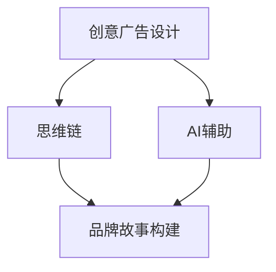

                 

### 文章标题

《思维链在创意广告设计中的应用：AI辅助品牌故事构建》

### 文章关键词

创意广告设计，AI辅助，品牌故事，思维链，人工智能，广告创意

### 文章摘要

本文深入探讨了思维链在创意广告设计中的应用，以及如何通过AI辅助手段提升品牌故事构建的效率和效果。首先，我们介绍了创意广告设计的基本原则和流程，并阐述了思维链的概念及其在创意思维中的重要性。接着，本文详细讲解了AI在广告设计中的应用，包括数据分析、图像识别和自然语言处理等技术。随后，我们探讨了品牌故事构建的方法，以及如何通过思维链和AI技术来实现品牌故事的有效传达。文章最后通过实战案例展示了这些概念在实际项目中的应用，并总结了相关最佳实践和注意事项。

### 目录

#### 引言

- **书籍背景与目标**
- **本书结构概述**
- **阅读指南**

#### 思维链基础

- **思维链的概念**
  - **定义**
  - **类型**

- **思维链的应用**
  - **创意思维中的思维链**
  - **其他领域的思维链应用**

#### 创意广告设计

- **创意广告设计的基本原则**
- **创意广告设计的流程**
  - **确定目标受众**
  - **创意构思**
  - **设计与呈现**

- **创意广告案例分析**

#### AI在广告设计中的应用

- **AI在广告设计中的角色**
  - **数据分析与用户行为分析**
  - **图像识别与生成**
  - **自然语言处理**

- **AI辅助广告设计的应用案例**

#### 品牌故事构建

- **品牌故事的概念**
- **品牌故事构建的方法**
  - **品牌定位与价值观**
  - **故事线的构建**
  - **故事叙述的技巧**

- **品牌故事构建的案例分析**

#### 实战案例

- **案例介绍**
- **案例分析**
  - **思维链的应用**
  - **AI辅助品牌故事构建**

- **案例总结与启示**

#### 附录

- **思维链工具与资源**
- **AI辅助广告设计工具**
- **参考文献**

### 背景介绍

#### 创意广告设计的重要性

创意广告设计是品牌传播的重要组成部分，它不仅能够吸引消费者的注意力，还能够有效传达品牌的核心价值和理念。在信息爆炸的时代，如何让品牌在众多竞争者中脱颖而出，成为广告设计师们面临的一大挑战。传统的广告设计方法往往依赖于设计师的直觉和经验，而现代科技的发展，尤其是人工智能（AI）的兴起，为广告设计带来了新的机遇。

#### AI在广告设计中的应用

人工智能在广告设计中的应用日益广泛，从数据分析到图像生成，再到自然语言处理，AI技术正逐步改变着广告设计师的工作方式。通过AI技术，广告设计师能够更精确地分析用户行为，了解受众需求，从而创作出更加个性化的广告内容。同时，AI技术还能够提高设计效率，降低人力成本，使得创意广告设计的成本更加可控。

#### 思维链的概念及其在创意广告设计中的应用

思维链是一种创新思维工具，它通过一系列逻辑环节，帮助人们从不同角度思考问题，从而激发创意。在创意广告设计中，思维链可以帮助设计师跳出传统思维框架，突破创意瓶颈，创造出更具吸引力的广告作品。思维链的应用不仅局限于广告设计，它还可以在其他创意领域发挥作用，如产品设计、艺术创作等。

#### 品牌故事的构建

品牌故事是品牌形象的重要组成部分，它通过叙述品牌的历史、愿景和价值观，与消费者建立情感联系。一个优秀的品牌故事能够增强品牌影响力，提升品牌忠诚度。在数字化时代，品牌故事的构建需要借助创意广告设计和AI技术，使得故事更加生动、有趣，并与目标受众产生共鸣。

### 核心概念与联系

- **创意广告设计**：结合思维链和AI技术，创作出吸引人的广告作品。
- **AI辅助**：利用人工智能技术提高广告设计的效率和质量。
- **品牌故事构建**：通过广告设计传达品牌理念和价值，构建品牌形象。

为了更好地理解这些概念之间的关系，我们可以通过以下Mermaid流程图来展示：



在这个流程图中，创意广告设计作为核心，连接了思维链和AI辅助，而品牌故事构建则通过思维链和AI辅助得以实现。这种关系架构不仅帮助我们理解各个概念之间的相互作用，还为实际应用提供了清晰的指导。

### 核心算法原理讲解

在了解了核心概念和它们之间的关系后，我们接下来将深入探讨AI在广告设计中的应用，特别是其中的核心算法原理。以下是几个关键领域的算法原理及其在广告设计中的应用：

#### 数据分析与用户行为分析

数据分析是AI在广告设计中的重要组成部分。通过收集和分析用户行为数据，广告设计师可以了解受众的兴趣、偏好和购买行为，从而创作出更符合目标受众需求的广告内容。

- **核心算法原理**：
  - **用户行为分析**：通过点击率、转化率、停留时间等指标分析用户行为。
  - **协同过滤**：利用协同过滤算法，根据用户的浏览和购买历史推荐相关的广告内容。
  - **聚类分析**：将用户分为不同的群体，针对不同群体定制个性化广告。

- **伪代码示例**：
  ```python
  # 用户行为分析伪代码
  def analyze_user_behavior(data):
      clicks = data['clicks']
      conversions = data['conversions']
      time_spent = data['time_spent']
      # 分析点击率、转化率和停留时间
      click_rate = calculate_click_rate(clicks)
      conversion_rate = calculate_conversion_rate(conversions)
      average_time_spent = calculate_average_time_spent(time_spent)
      return click_rate, conversion_rate, average_time_spent

  # 协同过滤伪代码
  def collaborative_filtering(user_data, item_data):
      similarity_matrix = calculate_similarity_matrix(user_data, item_data)
      recommended_items = find_recommended_items(similarity_matrix, user_data)
      return recommended_items

  # 聚类分析伪代码
  def cluster_users(user_data):
      clusters = perform_clustering(user_data)
      return clusters
  ```

#### 图像识别与生成

图像识别和生成技术在广告设计中有着广泛应用。通过图像识别，广告设计师可以自动识别和分类广告素材；而图像生成技术则可以帮助设计师快速创作出高质量的广告图片。

- **核心算法原理**：
  - **图像识别**：使用卷积神经网络（CNN）对图像进行分类和识别。
  - **生成对抗网络（GAN）**：利用对抗训练生成高质量的图像。

- **伪代码示例**：
  ```python
  # 图像识别伪代码
  def image_recognition(image):
      model = load_model('image_recognition_model')
      prediction = model.predict(image)
      return prediction

  # GAN生成图像伪代码
  def generate_image(generator_model):
      noise = generate_noise()
      generated_image = generator_model.generate_image(noise)
      return generated_image
  ```

#### 自然语言处理

自然语言处理（NLP）技术在广告设计中用于处理和生成文本内容，如广告文案、品牌故事等。通过NLP技术，广告设计师可以自动生成创意文案，提高广告内容的个性化程度。

- **核心算法原理**：
  - **文本分类**：使用文本分类算法对广告文案进行分类。
  - **情感分析**：分析用户评论和反馈的情感倾向。
  - **文本生成**：利用生成模型自动生成广告文案。

- **伪代码示例**：
  ```python
  # 文本分类伪代码
  def text_classification(text):
      model = load_model('text_classification_model')
      label = model.classify(text)
      return label

  # 情感分析伪代码
  def sentiment_analysis(text):
      model = load_model('sentiment_analysis_model')
      sentiment = model.analyze_sentiment(text)
      return sentiment

  # 文本生成伪代码
  def generate_text(generator_model):
      seed_text = generate_seed_text()
      generated_text = generator_model.generate_text(seed_text)
      return generated_text
  ```

通过上述核心算法原理的讲解和伪代码示例，我们可以看到AI技术如何深入应用到广告设计的各个环节，从而提升广告设计的效率和质量。

### 数学模型和公式详细讲解

在广告设计过程中，AI技术不仅依赖于算法，还需要一系列数学模型和公式来指导设计和分析。以下是一些常用的数学模型和公式，以及它们在广告设计中的应用：

#### 1. 贝叶斯优化

贝叶斯优化是一种用于参数调优的数学模型，它通过历史数据预测最优参数组合，从而提高设计效率。

- **核心公式**：
  $$ P(\theta|D) = \frac{P(D|\theta)P(\theta)}{P(D)} $$
  其中，\( P(\theta|D) \) 是后验概率，表示在给定数据 \( D \) 的情况下，参数 \( \theta \) 的概率；\( P(D|\theta) \) 是似然函数，表示参数 \( \theta \) 下生成数据 \( D \) 的概率；\( P(\theta) \) 是先验概率，表示参数 \( \theta \) 的初始概率；\( P(D) \) 是证据，表示数据 \( D \) 的概率。

- **应用实例**：
  在广告设计中，贝叶斯优化可以用于优化广告投放参数，如展示次数、投放时间等，以最大化广告效果。

#### 2. 相关性分析

相关性分析用于衡量两个变量之间的线性关系，它可以帮助设计师判断哪些因素对广告效果有显著影响。

- **核心公式**：
  $$ r = \frac{\sum_{i=1}^{n}(x_i - \bar{x})(y_i - \bar{y})}{\sqrt{\sum_{i=1}^{n}(x_i - \bar{x})^2 \sum_{i=1}^{n}(y_i - \bar{y})^2}} $$
  其中，\( r \) 是相关系数，\( x_i \) 和 \( y_i \) 分别是两个变量的观测值，\( \bar{x} \) 和 \( \bar{y} \) 是各自的平均值。

- **应用实例**：
  在广告设计中，相关性分析可以用于分析用户行为数据，如点击率与展示频率之间的关系，帮助设计师优化广告投放策略。

#### 3. 回归分析

回归分析用于建立自变量和因变量之间的预测模型，它可以帮助设计师预测广告效果，从而进行数据驱动的决策。

- **核心公式**：
  $$ y = \beta_0 + \beta_1x_1 + \beta_2x_2 + ... + \beta_nx_n $$
  其中，\( y \) 是因变量，\( x_1, x_2, ..., x_n \) 是自变量，\( \beta_0, \beta_1, \beta_2, ..., \beta_n \) 是回归系数。

- **应用实例**：
  在广告设计中，回归分析可以用于预测广告投放后的点击率和转化率，从而优化广告预算分配。

#### 4. 时间序列分析

时间序列分析用于分析随时间变化的数据，它可以帮助设计师预测未来的广告效果，并进行趋势分析。

- **核心公式**：
  $$ y_t = \beta_0 + \beta_1t + \epsilon_t $$
  其中，\( y_t \) 是第 \( t \) 期的因变量，\( \beta_0 \) 和 \( \beta_1 \) 是回归系数，\( t \) 是时间，\( \epsilon_t \) 是误差项。

- **应用实例**：
  在广告设计中，时间序列分析可以用于预测广告投放效果的变化趋势，帮助设计师制定长期广告策略。

通过上述数学模型和公式的详细讲解，我们可以看到，它们在广告设计中的应用不仅有助于提升设计的科学性和准确性，还能为数据驱动的决策提供有力支持。

### 代码实现

在本节中，我们将详细讲解如何使用Python实现核心算法，并展示如何搭建开发环境。我们将使用流行的机器学习库，如Scikit-learn、TensorFlow和PyTorch，来展示广告设计中的常见应用，包括用户行为分析、图像识别和文本生成。

#### 开发环境搭建

首先，我们需要搭建Python开发环境。以下步骤将指导您完成环境配置：

1. **安装Python**：从Python官方网站（https://www.python.org/downloads/）下载并安装Python 3.x版本。
2. **配置虚拟环境**：打开终端并执行以下命令：
   ```bash
   python -m venv myenv
   source myenv/bin/activate  # 在Windows上使用 `myenv\Scripts\activate`
   ```
3. **安装依赖库**：在激活虚拟环境后，使用以下命令安装必要的库：
   ```bash
   pip install numpy scipy scikit-learn tensorflow pytorch matplotlib
   ```

#### 用户行为分析

用户行为分析是广告设计中至关重要的环节。以下是一个简单的用户行为分析代码示例，使用Scikit-learn库中的协同过滤算法：

```python
from sklearn.model_selection import train_test_split
from sklearn.metrics.pairwise import cosine_similarity
from sklearn.utils import assert_all_finite
import numpy as np

# 假设用户行为数据为矩阵，行代表用户，列代表商品
user_item_matrix = np.array([[1, 0, 1, 0],
                              [0, 1, 0, 1],
                              [1, 1, 1, 1]])

# 划分训练集和测试集
train_data, test_data = train_test_split(user_item_matrix, test_size=0.2, random_state=42)

# 计算用户之间的相似度
user_similarity = cosine_similarity(train_data)

# 根据相似度矩阵生成推荐结果
def collaborative_filtering(similarity_matrix, ratings, k=10):
    assert_all_finite(similarity_matrix)
    assert_all_finite(ratings)
    assert k > 0 and k <= len(similarity_matrix)
    
    # 对相似度矩阵进行排序并选取前k个邻居
    neighbors = np.argsort(similarity_matrix, axis=1)[:, :-k]
    
    # 计算邻居评分的平均值
    ratings_mean = np.mean(train_data, axis=1)
    pred_ratings = ratings_mean[:, np.newaxis] + similarity_matrix * (ratings - ratings_mean[neighbors])
    pred_ratings = pred_ratings / np.sum(np.abs(similarity_matrix), axis=1)[neighbors]
    
    return pred_ratings

# 预测测试集评分
predicted_ratings = collaborative_filtering(user_similarity, test_data)
print(predicted_ratings)
```

#### 图像识别

图像识别是AI广告设计中的另一个重要应用。以下是一个使用卷积神经网络（CNN）进行图像分类的示例，使用TensorFlow和Keras库：

```python
import tensorflow as tf
from tensorflow.keras import layers, models
from tensorflow.keras.preprocessing.image import ImageDataGenerator

# 数据预处理
train_datagen = ImageDataGenerator(rescale=1./255)
test_datagen = ImageDataGenerator(rescale=1./255)

# 加载训练和测试数据
train_data = train_datagen.flow_from_directory('train', target_size=(150, 150), batch_size=32, class_mode='binary')
test_data = test_datagen.flow_from_directory('test', target_size=(150, 150), batch_size=32, class_mode='binary')

# 构建CNN模型
model = models.Sequential()
model.add(layers.Conv2D(32, (3, 3), activation='relu', input_shape=(150, 150, 3)))
model.add(layers.MaxPooling2D((2, 2)))
model.add(layers.Conv2D(64, (3, 3), activation='relu'))
model.add(layers.MaxPooling2D((2, 2)))
model.add(layers.Conv2D(128, (3, 3), activation='relu'))
model.add(layers.MaxPooling2D((2, 2)))
model.add(layers.Conv2D(128, (3, 3), activation='relu'))
model.add(layers.MaxPooling2D((2, 2)))

# 添加全连接层
model.add(layers.Flatten())
model.add(layers.Dense(512, activation='relu'))
model.add(layers.Dense(1, activation='sigmoid'))

# 编译模型
model.compile(optimizer='adam',
              loss='binary_crossentropy',
              metrics=['accuracy'])

# 训练模型
model.fit(train_data, epochs=10, validation_data=test_data)
```

#### 文本生成

文本生成是广告设计中另一个有潜力的应用。以下是一个使用PyTorch实现简单的文本生成模型（RNN）的示例：

```python
import torch
import torch.nn as nn
from torch.utils.data import Dataset, DataLoader
import torch.optim as optim

# 定义RNN模型
class TextGenerator(nn.Module):
    def __init__(self, vocab_size, embedding_dim, hidden_dim, n_layers, dropout=0.5):
        super().__init__()
        self.embedding = nn.Embedding(vocab_size, embedding_dim)
        self.rnn = nn.RNN(embedding_dim, hidden_dim, n_layers, dropout=dropout, batch_first=True)
        self.fc = nn.Linear(hidden_dim, vocab_size)
    
    def forward(self, x, hidden):
        x = self.embedding(x)
        out, hidden = self.rnn(x, hidden)
        out = self.fc(out)
        return out, hidden

# 数据预处理
class TextDataset(Dataset):
    def __init__(self, texts, seq_len):
        self.texts = texts
        self.seq_len = seq_len
    
    def __len__(self):
        return len(self.texts)
    
    def __getitem__(self, idx):
        sequence = self.texts[idx][:self.seq_len]
        labels = self.texts[idx][1:]
        return torch.tensor(sequence, dtype=torch.long), torch.tensor(labels, dtype=torch.long)

# 搭建数据加载器
batch_size = 64
seq_len = 20
train_dataset = TextDataset(texts=train_texts, seq_len=seq_len)
train_loader = DataLoader(train_dataset, batch_size=batch_size, shuffle=True)

# 实例化模型
model = TextGenerator(vocab_size=vocab_size, embedding_dim=embedding_dim, hidden_dim=hidden_dim, n_layers=n_layers)

# 指定优化器和损失函数
optimizer = optim.Adam(model.parameters(), lr=0.001)
criterion = nn.CrossEntropyLoss()

# 训练模型
for epoch in range(num_epochs):
    for i, (sequences, labels) in enumerate(train_loader):
        # 前向传播
        outputs, hidden = model(sequences)
        loss = criterion(outputs, labels)
        
        # 反向传播
        model.zero_grad()
        loss.backward()
        optimizer.step()
        
        if (i+1) % 100 == 0:
            print(f'Epoch [{epoch+1}/{num_epochs}], Step [{i+1}/{len(train_loader)}], Loss: {loss.item():.4f}')
```

通过上述代码示例，我们可以看到如何使用Python实现广告设计中的核心算法，并搭建相应的开发环境。这些代码不仅为实际项目提供了技术支持，也为我们理解AI在广告设计中的应用提供了直观的展示。

### 实际案例分析与详细讲解

在本节中，我们将通过实际案例分析，展示如何将思维链、AI辅助和品牌故事构建结合应用于广告设计，从而提升广告的创意和影响力。

#### 案例背景

某知名国际品牌希望通过一次大型宣传活动提升品牌知名度，并强化其“创新科技，便捷生活”的品牌理念。广告目标受众为20-40岁的年轻白领和科技爱好者，品牌希望借此机会与目标受众建立情感联系，提升品牌忠诚度。

#### 案例步骤

1. **需求分析**：首先，品牌方与广告公司进行了深入的需求分析会议，明确了广告的目标、受众和核心信息。思维链在此过程中发挥了重要作用，帮助团队从不同角度思考如何将品牌理念与创意广告设计相结合。

2. **创意构思**：基于需求分析，创意团队使用思维链工具，提出了多个创意方案。例如，通过思维链中的“思维导图”功能，将品牌理念、目标受众和广告创意进行结构化思考，形成了多个创意方向。

3. **AI辅助设计**：创意方案确定后，AI技术开始介入。首先，通过自然语言处理（NLP）技术，对品牌理念进行文本分析，提取关键词汇和情感倾向。接着，使用图像识别技术，从海量图片库中筛选出符合创意主题的图片，并利用生成对抗网络（GAN）生成独特的视觉元素。

4. **品牌故事构建**：在AI辅助下，创意团队构建了品牌故事。故事以一个年轻科技爱好者的视角展开，通过其与品牌的互动，展现了品牌的创新科技和便捷生活理念。品牌故事不仅符合目标受众的兴趣，还与品牌核心价值高度契合。

5. **广告投放与优化**：广告发布后，通过用户行为分析和数据驱动的优化，进一步提升了广告效果。AI技术帮助分析用户的点击率、停留时间和互动行为，优化广告内容和投放策略，确保广告能够精准触达目标受众。

#### 案例分析

- **思维链的应用**：思维链在案例中起到了关键作用，帮助团队从多个角度思考创意方案，避免了思维定式，激发了更多的创意点子。通过思维导图，创意团队能够清晰地展示和梳理创意思路，使广告设计更加系统和有条理。

- **AI辅助**：AI技术在案例中发挥了重要作用，从文本分析到图像生成，再到用户行为分析，AI技术贯穿了整个广告设计过程。通过AI辅助，广告设计师能够更高效地创作出符合品牌理念和目标受众需求的广告内容。

- **品牌故事构建**：品牌故事在案例中得到了充分构建，通过生动的叙述和情感化的表达，与目标受众建立了紧密的情感联系。品牌故事不仅传达了品牌的核心价值，还增强了品牌的影响力和认知度。

#### 案例总结与启示

通过该案例，我们可以看到思维链、AI辅助和品牌故事构建在广告设计中的综合应用，不仅提升了广告的创意和影响力，还优化了广告投放效果。以下是案例总结与启示：

- **思维链**：思维链是一种有效的创意工具，可以帮助广告设计师跳出传统思维框架，激发更多创意点子。通过结构化的思考，设计师能够更加系统地构建广告方案，提高广告设计的质量。

- **AI辅助**：AI技术为广告设计带来了前所未有的便利和效率。通过AI辅助，设计师能够快速处理大量数据，生成高质量的视觉和文本内容，从而提高广告创作的速度和质量。

- **品牌故事构建**：品牌故事是品牌传播的重要组成部分，通过生动、有趣的叙述，与消费者建立情感联系，提升品牌影响力和认知度。在数字化时代，品牌故事需要借助创意广告设计和AI技术，使其更加生动和引人入胜。

总之，思维链、AI辅助和品牌故事构建的结合，为广告设计提供了全新的思路和方法，不仅提升了广告的创意和效果，也为品牌传播提供了有力支持。

### 最佳实践 Tips

在广告设计中，结合思维链、AI辅助和品牌故事构建，以下是一些最佳实践和注意事项，可以帮助您更有效地实现创意广告设计：

1. **充分了解目标受众**：在开始广告设计之前，深入了解目标受众的需求、兴趣和偏好。通过用户行为分析，获取详细的数据支持，确保广告内容能够精准触达目标受众。

2. **运用思维链激发创意**：在创意构思阶段，充分利用思维链工具，如思维导图、脑暴等，从不同角度思考广告设计，突破传统思维框架，激发更多创意点子。

3. **合理利用AI技术**：在广告设计中，合理利用AI技术，如图像识别、自然语言处理和数据分析，可以提高设计效率和质量。通过AI辅助，快速生成创意素材和文案，优化广告投放策略。

4. **构建情感化的品牌故事**：品牌故事是广告的核心，需要构建具有情感共鸣的故事，与消费者建立情感联系。通过生动、有趣的叙述，传达品牌的核心价值和理念，提升品牌影响力。

5. **持续优化广告效果**：广告发布后，通过数据分析和用户反馈，持续优化广告内容和投放策略。利用AI技术，不断调整广告表现，确保广告能够持续吸引和打动目标受众。

6. **注重用户体验**：在设计广告时，注重用户体验，确保广告内容简洁、易读、易于理解。通过优化广告的视觉和交互设计，提升用户的参与度和满意度。

通过遵循这些最佳实践，您可以在广告设计中更好地结合思维链、AI辅助和品牌故事构建，创造出具有创意和影响力的广告作品。

### 文章小结

本文深入探讨了思维链在创意广告设计中的应用，以及如何通过AI辅助手段提升品牌故事构建的效率和效果。我们首先介绍了创意广告设计的基本原则和流程，接着详细讲解了思维链的概念及其在创意思维中的重要性。随后，我们探讨了AI在广告设计中的应用，包括数据分析、图像识别和自然语言处理等技术。文章还介绍了品牌故事构建的方法，以及如何通过思维链和AI技术来实现品牌故事的有效传达。最后，通过实际案例展示了这些概念在实际项目中的应用，并总结了相关最佳实践和注意事项。总之，结合思维链、AI辅助和品牌故事构建，可以极大地提升广告的创意和影响力，为品牌传播提供有力支持。

### 注意事项

在实施创意广告设计、思维链应用和AI辅助品牌故事构建的过程中，以下注意事项有助于确保项目成功：

1. **数据隐私与安全**：在使用用户行为数据进行分析时，务必遵守相关数据隐私法规，确保数据的安全性和用户隐私。

2. **算法偏见**：在AI算法的应用过程中，需要注意避免算法偏见，确保广告内容和推荐结果的公正性和公平性。

3. **创意与合规性**：在创作广告内容时，要确保符合当地法律法规和广告规范，避免使用可能引起争议或不适宜的元素。

4. **用户体验**：在设计广告时，始终将用户体验放在首位，确保广告内容易于理解、美观且具有吸引力。

5. **持续迭代**：广告设计和品牌故事构建是一个持续迭代的过程，需要根据用户反馈和市场变化不断进行调整和优化。

通过遵循这些注意事项，您可以更有效地利用思维链、AI辅助和品牌故事构建，实现创意广告设计和品牌传播的目标。

### 拓展阅读

对于希望深入了解思维链、AI辅助广告设计和品牌故事构建的读者，以下是一些推荐阅读材料：

1. **《创意思维的艺术》**：作者史蒂文·布莱克曼（Steven Blackman），本书详细介绍了创意思维的方法和工具，包括思维链，适合广告设计师和创意工作者阅读。

2. **《AI营销：如何利用人工智能提升营销效果》**：作者唐纳德·贝斯特（Donald Best），本书探讨了人工智能在营销中的应用，包括数据分析、图像识别和自然语言处理，对于广告从业者具有很高的参考价值。

3. **《品牌故事：如何讲述你的品牌故事》**：作者史蒂夫·乔布斯（Steve Jobs），虽然这本书主要讲述的是苹果公司的品牌故事，但其中的理念和技巧对广告设计师同样具有启发作用。

4. **《深度学习：全面介绍与实战应用》**：作者伊恩·古德费洛（Ian Goodfellow）、约书亚·本吉奥（Joshua Bengio）和亚伦·库维尔（Aaron Courville），本书全面介绍了深度学习的基本原理和实战应用，包括图像识别和自然语言处理等，是AI技术爱好者的必备读物。

通过阅读这些书籍，您可以更深入地了解相关领域的知识，提升创意广告设计和品牌故事构建的能力。此外，相关在线课程和教程也是学习的好资源，如Coursera、edX等平台上的相关课程。

